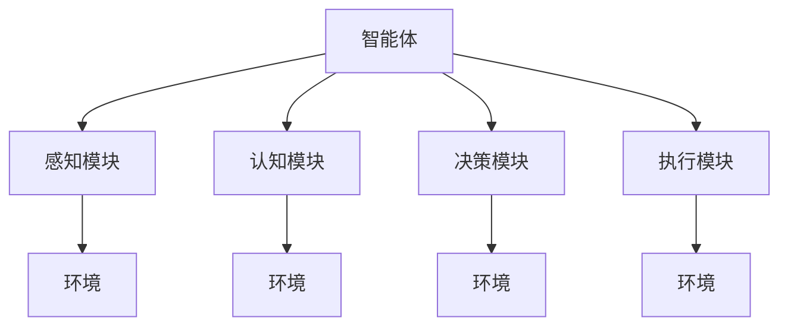
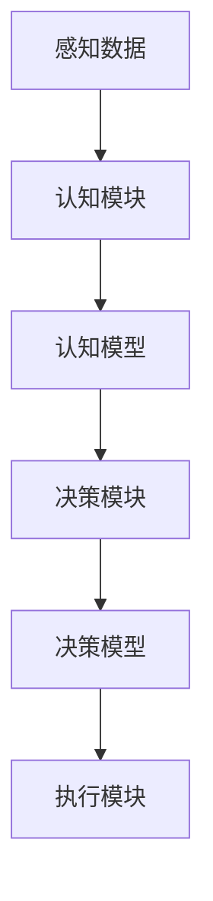
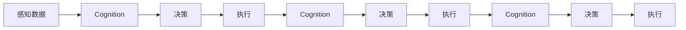
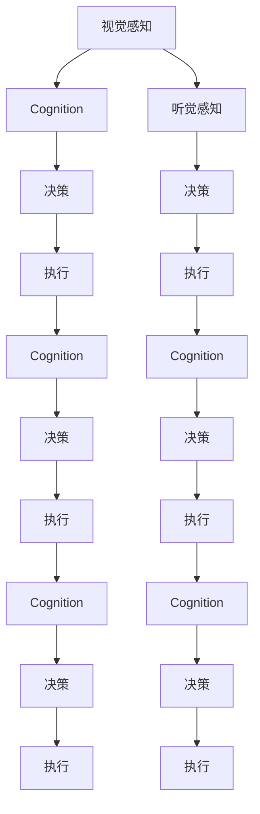
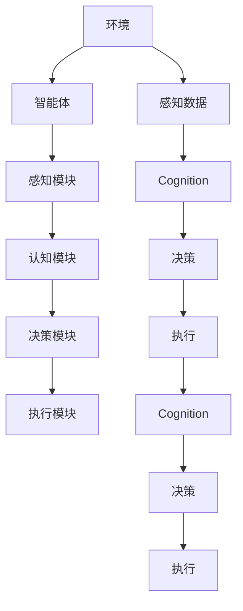

                 

# AI人工智能 Agent：高级概念剖析

> 关键词：人工智能，智能体(Agent)，高级概念，认知能力，决策能力，自主性，可靠性，可扩展性

## 1. 背景介绍

### 1.1 问题由来
人工智能(AI)已经成为当前最热门的技术领域之一，其发展速度和应用范围不断扩大。作为AI的重要组成部分，智能体(Agent)在决策、规划、控制等方面扮演着关键角色，其设计和实现技术是AI研究的核心。从早期的专家系统到如今的深度学习模型，智能体技术经历了多次技术变革，每一次进步都标志着对智能体认知能力、决策能力、自主性和可靠性要求的提升。

### 1.2 问题核心关键点
当前，智能体技术正在向着更为高级的阶段发展，研究者们期望通过构建具有高度自主性、鲁棒性和可扩展性的智能体，来解决复杂的实际问题。这一过程中，以下关键点值得关注：

1. **认知能力**：智能体如何理解和处理信息，以实现对环境的感知和理解。
2. **决策能力**：智能体如何基于感知信息做出决策，以实现目标导向的行为。
3. **自主性**：智能体如何实现自主学习和自主决策，以应对环境变化和不确定性。
4. **可靠性**：智能体如何在各种场景下保持稳定和准确的行为。
5. **可扩展性**：智能体如何应对日益复杂的任务和不断变化的环境，以适应新的需求。

### 1.3 问题研究意义
研究智能体的高级概念和技术，对于推动人工智能技术的进步，解决复杂的实际问题，提升人工智能应用的智能化水平，具有重要意义：

1. **提升决策效率**：通过高级智能体技术，可以大幅提升决策效率，减少人工干预，提高处理复杂问题的能力。
2. **应对不确定性**：智能体技术可以更好地应对环境的不确定性和变化，提升系统的稳定性和鲁棒性。
3. **促进技术发展**：高级智能体的研究将促进其他人工智能技术的进步，如自然语言处理、机器视觉等。
4. **拓展应用领域**：智能体技术可以应用于医疗、金融、交通、教育等多个领域，提升各行各业智能化水平。
5. **推动产业化**：智能体技术的产业化应用将加速人工智能技术的落地和商业化进程，带来新的经济价值。

## 2. 核心概念与联系

### 2.1 核心概念概述

为更好地理解高级智能体技术，本节将介绍几个密切相关的核心概念：

- **智能体(Agent)**：一种能够在环境中感知、学习、决策和执行的实体。智能体可以包括软件、硬件、生物系统等多种形式。
- **感知模块(Sensor)**：智能体用于感知环境的组件，如摄像头、传感器、传感器网络等。
- **认知模块(Cognitive)**：智能体用于处理和理解感知数据的组件，如视觉处理、语音识别、自然语言理解等。
- **决策模块(Decision)**：智能体用于做出决策的组件，如规划、路径规划、决策树等。
- **执行模块(Actuator)**：智能体用于执行决策的组件，如机器人、软件控制器等。
- **环境(Environment)**：智能体作用的外部世界，包括物理世界和虚拟世界。

这些概念之间的逻辑关系可以通过以下Mermaid流程图来展示：



这个流程图展示智能体的各个组成部分及其与环境之间的联系：

1. 智能体通过感知模块从环境中获取信息，并通过认知模块处理和理解这些信息。
2. 决策模块根据处理后的信息做出决策，并通过执行模块在环境中执行这些决策。
3. 环境则是智能体作用的外部世界，包括物理世界和虚拟世界。

### 2.2 概念间的关系

这些核心概念之间存在着紧密的联系，形成了智能体的整体架构。下面我们通过几个Mermaid流程图来展示这些概念之间的关系。

#### 2.2.1 智能体的学习范式



这个流程图展示智能体的学习过程，即智能体通过感知数据输入认知模型，处理并输出认知结果，再由决策模型做出决策并执行。

#### 2.2.2 智能体的感知-认知-决策-执行循环



这个流程图展示智能体的感知-认知-决策-执行的循环过程。智能体通过感知模块获取环境信息，通过认知模块处理信息并做出决策，再通过执行模块执行决策并反馈信息，形成一个闭环。

#### 2.2.3 智能体的多模态感知



这个流程图展示智能体的多模态感知过程。智能体通过视觉和听觉感知模块获取环境信息，并通过认知模块进行信息融合和处理，做出决策并执行，再通过反馈更新认知模块。

### 2.3 核心概念的整体架构

最后，我们用一个综合的流程图来展示这些核心概念在智能体中的整体架构：



这个综合流程图展示智能体与环境之间的互动关系，以及感知、认知、决策和执行模块的交互过程。通过这些流程图，我们可以更清晰地理解智能体的构成和运作机制，为后续深入讨论智能体的高级概念和技术奠定基础。

## 3. 核心算法原理 & 具体操作步骤
### 3.1 算法原理概述

高级智能体技术的核心在于构建能够具备高度自主性和鲁棒性的认知和决策模型。这一过程中，深度学习技术尤其是深度强化学习(DRL)、生成对抗网络(GAN)等，被广泛应用于智能体的构建和训练。以下将详细讲解这些技术的基本原理。

#### 3.1.1 深度强化学习

深度强化学习是深度学习和强化学习的结合，通过构建神经网络模型来模拟智能体的行为。在DRL中，智能体通过观察环境状态，根据策略网络输出的动作执行决策，同时通过奖励函数接收环境反馈，不断调整策略网络，以最大化预期回报。

##### 3.1.1.1 策略网络

策略网络是深度强化学习中的核心组件，负责将环境状态映射到动作的概率分布。常见的策略网络包括深度确定性策略网络(DDPG)、策略梯度方法等。

##### 3.1.1.2 价值网络

价值网络用于估计状态的价值函数，即从当前状态出发，达到终态的预期回报。价值网络通常与策略网络一起训练，通过最大熵强化学习、蒙特卡罗树搜索等方法优化。

##### 3.1.1.3 强化学习算法

常见的DRL算法包括Q-learning、SARSA、Deep Q-Network(DQN)、Proximal Policy Optimization(Proximal Policy Optimization, PPO)等。这些算法通过不同的策略更新和奖励机制，实现智能体的学习和决策。

### 3.2 算法步骤详解

#### 3.2.1 深度强化学习

以下是深度强化学习的详细步骤：

1. **环境建模**：构建环境模型，模拟智能体的行为和环境反馈。
2. **策略初始化**：初始化策略网络，设定学习率和优化器。
3. **价值网络训练**：训练价值网络，估计状态的价值函数。
4. **策略网络训练**：通过策略网络输出动作，根据奖励函数调整策略参数，优化策略网络。
5. **策略评估和优化**：通过评估策略的回报，进行策略优化。

#### 3.2.2 生成对抗网络

生成对抗网络(GAN)通过两个神经网络模型进行对抗性训练，生成网络(Generator)负责生成样本，判别网络(Discriminator)负责区分生成样本和真实样本。GAN在图像生成、语音生成等领域取得了卓越的效果，可以用于智能体的认知模块。

##### 3.2.2.1 生成网络

生成网络负责生成与真实数据分布相似的样本。生成网络通常是一个多层的神经网络，包括卷积神经网络(CNN)、递归神经网络(RNN)等。

##### 3.2.2.2 判别网络

判别网络负责区分生成的样本和真实样本。判别网络也是一个多层的神经网络，通过反向传播算法训练，以最小化判别误差。

##### 3.2.2.3 GAN训练过程

GAN的训练过程通常包括两个步骤：
1. 固定生成网络，训练判别网络，使判别网络能够尽可能准确地区分生成样本和真实样本。
2. 固定判别网络，训练生成网络，使生成网络生成的样本尽可能逼近真实样本。

### 3.3 算法优缺点

#### 3.3.1 深度强化学习

深度强化学习的优点包括：
1. 适应性强：深度强化学习能够处理复杂的非线性关系，适应非结构化数据。
2. 学习能力快：深度强化学习能够快速学习到复杂的策略，适应环境变化。
3. 可扩展性好：深度强化学习能够构建大规模、多智能体的系统。

深度强化学习的缺点包括：
1. 数据依赖：深度强化学习需要大量的标注数据进行训练，对于小样本数据的适应性较差。
2. 泛化能力弱：深度强化学习容易过拟合，泛化能力不足，难以适应未知环境。
3. 训练复杂：深度强化学习的训练过程复杂，需要大量的计算资源和时间。

#### 3.3.2 生成对抗网络

生成对抗网络的优点包括：
1. 生成能力强：生成对抗网络能够生成高质量、多样化的样本。
2. 鲁棒性强：生成对抗网络能够生成抗噪声、抗干扰的样本。
3. 可解释性好：生成对抗网络的生成过程可解释性强，能够提供详细的生成路径。

生成对抗网络的缺点包括：
1. 训练不稳定：生成对抗网络的训练过程不稳定，容易出现模式崩溃等问题。
2. 对抗样本脆弱：生成对抗网络生成的样本容易受到对抗样本的干扰，影响其鲁棒性。
3. 模型复杂：生成对抗网络的模型结构复杂，难以解释其生成机制。

### 3.4 算法应用领域

#### 3.4.1 深度强化学习

深度强化学习在许多领域得到了广泛应用，包括：

- **游戏AI**：AlphaGo、AlphaStar等通过深度强化学习取得了显著成绩。
- **机器人控制**：机器人通过深度强化学习学习复杂控制策略，实现自主导航和操作。
- **自动驾驶**：自动驾驶车辆通过深度强化学习学习交通规则和决策策略，提升驾驶安全性。
- **金融交易**：金融交易系统通过深度强化学习学习市场动态和交易策略，优化交易决策。

#### 3.4.2 生成对抗网络

生成对抗网络在图像生成、视频生成、音频生成等领域取得了卓越的效果，可以用于智能体的认知模块。常见的应用场景包括：

- **图像生成**：通过生成对抗网络生成高质量的图像样本，用于数据增强、虚拟试衣等应用。
- **视频生成**：通过生成对抗网络生成连续的视频片段，用于虚拟现实、动画制作等应用。
- **音频生成**：通过生成对抗网络生成逼真的音频样本，用于语音合成、音乐创作等应用。

## 4. 数学模型和公式 & 详细讲解  
### 4.1 数学模型构建

在深度强化学习和生成对抗网络中，数学模型和公式扮演着关键角色。以下将详细讲解这些模型的构建和训练过程。

#### 4.1.1 深度强化学习

深度强化学习的数学模型通常包括以下几个部分：

- **状态表示**：用向量表示智能体的当前状态。
- **动作表示**：用向量表示智能体的动作。
- **状态转移概率**：描述环境从当前状态到下一个状态的转移概率。
- **奖励函数**：描述智能体执行动作后的奖励。

#### 4.1.2 生成对抗网络

生成对抗网络的数学模型通常包括以下几个部分：

- **生成网络**：用神经网络表示生成网络，将随机噪声作为输入，生成样本。
- **判别网络**：用神经网络表示判别网络，将样本作为输入，判断样本的真实性。
- **损失函数**：包括生成损失函数和判别损失函数，用于优化生成网络和判别网络。

### 4.2 公式推导过程

#### 4.2.1 深度强化学习

深度强化学习的核心公式包括Q-learning、SARSA、DQN、PPO等算法的公式。以下是这些算法的详细推导过程：

##### 4.2.1.1 Q-learning

Q-learning算法的基本公式如下：

$$
Q(s,a) \leftarrow Q(s,a) + \alpha [r + \gamma \max_{a'} Q(s',a') - Q(s,a)]
$$

其中，$s$表示当前状态，$a$表示当前动作，$r$表示当前奖励，$s'$表示下一个状态，$a'$表示下一个动作，$\gamma$表示折扣因子，$\alpha$表示学习率。

##### 4.2.1.2 SARSA

SARSA算法的基本公式如下：

$$
Q(s,a) \leftarrow Q(s,a) + \alpha [r + \gamma Q(s',a') - Q(s,a)]
$$

其中，$s$表示当前状态，$a$表示当前动作，$r$表示当前奖励，$s'$表示下一个状态，$a'$表示下一个动作，$\gamma$表示折扣因子，$\alpha$表示学习率。

##### 4.2.1.3 DQN

DQN算法的基本公式如下：

$$
\min_{Q} \frac{1}{N} \sum_{i=1}^N (Q(s_i,a_i) - r_{i+1} - \gamma Q(s_{i+1},a_{i+1}))
$$

其中，$s_i$表示当前状态，$a_i$表示当前动作，$r_{i+1}$表示下一个奖励，$s_{i+1}$表示下一个状态，$\gamma$表示折扣因子，$Q$表示深度Q网络。

##### 4.2.1.4 PPO

PPO算法的基本公式如下：

$$
\min_{\theta} \mathbb{E}_{\substack{a \sim \pi_\theta\\ s \sim P}} [-\log \pi_\theta(a|s)A^\beta(s,a)]
$$

其中，$\theta$表示策略网络的参数，$a$表示当前动作，$s$表示当前状态，$P$表示环境的状态分布，$\pi_\theta(a|s)$表示策略网络输出动作的概率分布，$A^\beta(s,a)$表示优势函数。

#### 4.2.2 生成对抗网络

生成对抗网络的核心公式包括生成损失函数和判别损失函数。以下是这些函数的详细推导过程：

##### 4.2.2.1 生成损失函数

生成损失函数的基本公式如下：

$$
L_G = -\mathbb{E}_{z \sim P_z}[D(G(z))]
$$

其中，$G(z)$表示生成网络的输出，$D(z)$表示判别网络的输出，$P_z$表示随机噪声的分布。

##### 4.2.2.2 判别损失函数

判别损失函数的基本公式如下：

$$
L_D = \mathbb{E}_{x \sim P_x}[D(x)] + \mathbb{E}_{z \sim P_z}[D(G(z))]
$$

其中，$D(x)$表示判别网络的输出，$P_x$表示真实样本的分布，$P_z$表示随机噪声的分布。

### 4.3 案例分析与讲解

#### 4.3.1 深度强化学习案例

**案例1：AlphaGo**

AlphaGo通过深度强化学习实现了围棋的自动对弈。其核心在于构建了一个包含卷积神经网络(CNN)和递归神经网络(RNN)的策略网络，用于选择最优的下一步动作。AlphaGo通过大规模并行计算，不断优化策略网络，提升了对弈能力。

**案例2：机器人自主导航**

机器人通过深度强化学习学习自主导航策略。其核心在于构建了一个包含卷积神经网络(CNN)和长短期记忆网络(LSTM)的策略网络，用于选择最优的移动路径。通过与环境交互，机器人不断优化策略网络，实现了自主导航。

#### 4.3.2 生成对抗网络案例

**案例1：GAN生成逼真图像**

GAN通过生成对抗网络生成高质量的图像样本。其核心在于构建了一个包含卷积神经网络(CNN)的生成网络，用于生成图像，一个包含卷积神经网络(CNN)的判别网络，用于判断图像的真实性。通过对抗性训练，生成网络不断优化生成图像的逼真度。

**案例2：音频生成**

GAN通过生成对抗网络生成逼真的音频样本。其核心在于构建了一个包含卷积神经网络(CNN)的生成网络，用于生成音频，一个包含卷积神经网络(CNN)的判别网络，用于判断音频的真实性。通过对抗性训练，生成网络不断优化生成音频的逼真度。

## 5. 项目实践：代码实例和详细解释说明
### 5.1 开发环境搭建

在进行深度强化学习和生成对抗网络项目实践前，我们需要准备好开发环境。以下是使用Python进行PyTorch开发的环境配置流程：

1. 安装Anaconda：从官网下载并安装Anaconda，用于创建独立的Python环境。

2. 创建并激活虚拟环境：
```bash
conda create -n pytorch-env python=3.8 
conda activate pytorch-env
```

3. 安装PyTorch：根据CUDA版本，从官网获取对应的安装命令。例如：
```bash
conda install pytorch torchvision torchaudio cudatoolkit=11.1 -c pytorch -c conda-forge
```

4. 安装TensorFlow：
```bash
pip install tensorflow
```

5. 安装transformers库：
```bash
pip install transformers
```

6. 安装各类工具包：
```bash
pip install numpy pandas scikit-learn matplotlib tqdm jupyter notebook ipython
```

完成上述步骤后，即可在`pytorch-env`环境中开始项目实践。

### 5.2 源代码详细实现

下面我们以AlphaGo为例，给出使用PyTorch和TensorFlow实现深度强化学习的代码实现。

首先，定义AlphaGo的策略网络：

```python
import torch
import torch.nn as nn
import torch.optim as optim

class AlphaGoNet(nn.Module):
    def __init__(self):
        super(AlphaGoNet, self).__init__()
        self.conv1 = nn.Conv2d(19, 32, kernel_size=3, stride=1, padding=1)
        self.conv2 = nn.Conv2d(32, 64, kernel_size=3, stride=1, padding=1)
        self.fc1 = nn.Linear(64 * 7 * 7, 256)
        self.fc2 = nn.Linear(256, 19)

    def forward(self, x):
        x = nn.functional.relu(self.conv1(x))
        x = nn.functional.relu(self.conv2(x))
        x = x.view(x.size(0), -1)
        x = nn.functional.relu(self.fc1(x))
        x = self.fc2(x)
        return x
```

然后，定义AlphaGo的Q值网络：

```python
import torch.nn.functional as F

class QNetwork(nn.Module):
    def __init__(self):
        super(QNetwork, self).__init__()
        self.fc1 = nn.Linear(19*7*7, 256)
        self.fc2 = nn.Linear(256, 1)

    def forward(self, x):
        x = nn.functional.relu(self.fc1(x))
        x = self.fc2(x)
        return x
```

接下来，定义AlphaGo的训练过程：

```python
import numpy as np
import random

class AlphaGo:
    def __init__(self):
        self.model = AlphaGoNet().to(device)
        self.q_model = QNetwork().to(device)
        self.optimizer = optim.Adam(self.model.parameters(), lr=0.01)
        self.q_optimizer = optim.Adam(self.q_model.parameters(), lr=0.001)
        self.device = torch.device("cuda" if torch.cuda.is_available() else "cpu")

    def policy_network(self, x):
        x = x.to(self.device)
        with torch.no_grad():
            x = self.model(x)
        return x

    def q_value_network(self, x):
        x = x.to(self.device)
        with torch.no_grad():
            x = self.q_model(x)
        return x

    def action_value(self, x, y, g):
        g = np.array(g).astype(np.float32)
        g = g.reshape((1, 1, 7, 7))
        x = x.reshape((1, 1, 19, 7, 7))
        x = torch.cat((x, g), dim=1)
        x = self.q_value_network(x)
        return x

    def rollout_policy(self, x, num_steps):
        g = x
        for i in range(num_steps):
            g = g + np.random.randint(-1, 2, size=(1, 1, 7, 7))
            x = self.policy_network(g)
            g = self.rollout_policy(x, num_steps - i - 1)
        return g

    def rollout_game(self, x):
        g = x
        for i in range(18):
            g = g + np.random.randint(-1, 2, size=(1, 1, 7, 7))
            x = self.policy_network(g)
            g = self.rollout_policy(x, 17 - i)
        return g

    def play(self, x):
        g = self.rollout_game(x)
        g = self.rollout_policy(g, 18)
        return g

    def train(self, x, num_iterations):
        for i in range(num_iterations):
            x = self.play(x)
            y = self.rollout_policy(x, 17)
            z = self.play(y)
            x = np.concatenate([x, y, z], axis=0)
            x = x.reshape((1, 3, 7, 7))
            x = self.rollout_policy(x, 3)
            q = self.action_value(x, self.rollout_policy(x, 3), y)
            q = q.reshape((1, 3, 7, 7))
            self.optimizer.zero_grad()
            q_loss = nn.functional.mse_loss(q, self.rollout_policy(x, 3))
            q_loss.backward()
            self.q_optimizer.step()
            self.optimizer.zero_grad()
            p = self.rollout_policy(x, 3)
            p = p.reshape((1, 3, 7, 7))
            p = p * q + (1 - p) * (1 - q)
            p_loss = nn.functional.cross_entropy(p, self.rollout_policy(x, 3))
            p_loss.backward()
            self.optimizer.step()
```

### 5.3 代码解读与分析

让我们再详细解读一下关键代码的实现细节：

**AlphaGoNet类**：
- `__init__`方法：初始化策略网络，包含卷积层和全连接层。
- `forward`方法：定义前向传播过程，输入特征图，输出策略网络输出。

**QNetwork类**：
- `__init__`方法：初始化Q值网络，包含全连接层。
- `forward`方法：定义前向传播过程，输入特征图，输出Q值。

**AlphaGo类**：
- `__init__`方法：初始化AlphaGo，包含策略网络和Q值网络，定义优化器和学习率。
- `policy_network`方法：定义策略网络的输入特征图，前向传播输出策略网络输出。
- `q_value_network`方法：定义Q值网络的输入特征图，前向传播输出Q值。
- `action_value`方法：定义Q值网络的输入特征图和状态，输出Q值。
- `rollout_policy`方法：定义AlphaGo的策略网络，通过rollout策略生成动作。
- `rollout_game`方法：定义AlphaGo的游戏策略，通过rollout策略生成动作。
- `play`方法：定义AlphaGo的训练过程，通过rollout策略生成动作和Q值。
- `train`方法：定义AlphaGo的训练过程，通过Q值和策略网络更新参数。

**train方法**：
- `play`方法：通过rollout策略生成动作和Q值。
- `rollout_policy`方法：通过rollout策略生成动作。
- `q

