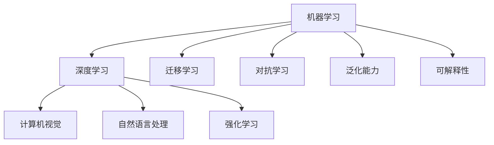
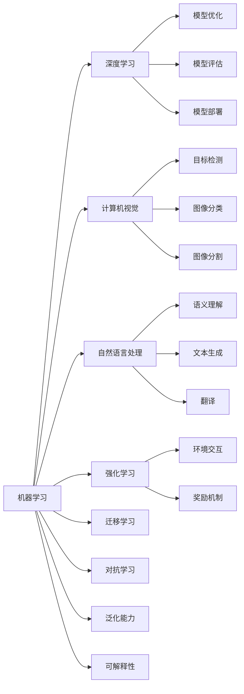
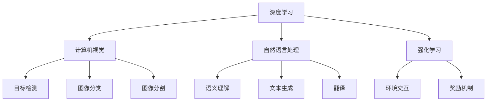
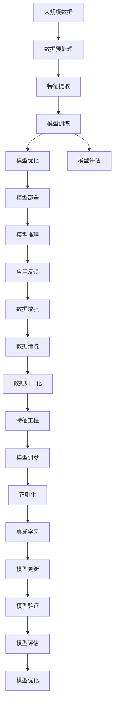

                 

# AI人工智能核心算法原理与代码实例讲解：人工智能应用发展趋势

> 关键词：AI算法,机器学习,深度学习,神经网络,计算机视觉,自然语言处理,强化学习,应用趋势,模型优化,模型评估,实例代码,技术展望

## 1. 背景介绍

### 1.1 问题由来
人工智能(AI)技术的飞速发展，尤其是在机器学习(ML)、深度学习(DL)、计算机视觉(CV)、自然语言处理(NLP)、强化学习(RL)等领域，为人类社会带来了前所未有的变革。这些技术通过模拟人类感知、理解、学习、决策等智能行为，显著提升了各行各业的效率和智能化水平。然而，随着技术的不断深入，AI算法和模型变得越来越复杂，如何在高效实用的同时，解决实际应用中的问题，成为当前研究的重点。

### 1.2 问题核心关键点
人工智能应用的核心问题在于如何将复杂的算法和模型有效地应用于实际场景，并实现良好的效果。目前，在AI应用的各个领域，均存在以下几个关键点：

- **算法选择**：根据具体任务选择合适的算法和模型结构，如卷积神经网络(CNN)、循环神经网络(RNN)、Transformer等。
- **数据预处理**：对原始数据进行清洗、归一化、增强等处理，以便于模型训练。
- **模型训练**：选择合适的优化器和损失函数，训练模型参数，使其最大化对数据的拟合程度。
- **模型评估**：采用指标如准确率、召回率、F1分数、ROC曲线等，评估模型的性能。
- **模型优化**：通过调参、正则化、集成学习等技术，提升模型效果。
- **应用部署**：将模型集成到实际应用系统中，进行推理预测。

### 1.3 问题研究意义
研究AI算法和模型的原理与实践，对于推动AI技术的实际应用，提升各行业的智能化水平，具有重要意义：

1. **降低开发成本**：通过高效实用的算法和模型，减少从头开发的时间和成本。
2. **提升性能**：通过优化算法和模型，提升在特定任务上的效果。
3. **加速开发进度**：利用预训练模型和成熟算法，快速构建应用系统。
4. **促进技术创新**：深入研究AI算法和模型，带来新的技术突破和应用场景。
5. **推动产业化**：通过优化AI应用，加速其在各行各业的落地和产业化进程。

## 2. 核心概念与联系

### 2.1 核心概念概述

为更好地理解AI核心算法和模型，本节将介绍几个密切相关的核心概念：

- **机器学习(ML)**：一种通过数据驱动的模型训练方法，从数据中学习规律，并进行预测或分类。
- **深度学习(DL)**：基于神经网络的机器学习分支，通过多层次的非线性映射，自动提取特征并进行复杂建模。
- **计算机视觉(CV)**：研究如何让计算机通过图像、视频等视觉信息，进行目标检测、识别、分割等任务。
- **自然语言处理(NLP)**：研究如何让计算机理解和处理人类语言，进行语义理解、文本生成、翻译等任务。
- **强化学习(RL)**：一种基于奖励机制的模型训练方法，通过与环境的交互，学习最优策略进行决策。
- **迁移学习**：将一个领域学到的知识，迁移应用到另一个相关领域的学习范式。
- **对抗学习**：通过对抗样本训练，提升模型的鲁棒性和泛化能力。
- **泛化能力**：模型在不同数据集上的表现一致性，即能够适应未见过的数据。
- **可解释性**：模型决策的透明性和可理解性，便于解释和调试。

这些核心概念之间的逻辑关系可以通过以下Mermaid流程图来展示：



这个流程图展示了几类AI技术的核心概念及其关系：

1. 机器学习是基础，包括深度学习、计算机视觉、自然语言处理和强化学习。
2. 深度学习、计算机视觉、自然语言处理和强化学习各有侧重，但均依赖于机器学习原理。
3. 迁移学习、对抗学习和泛化能力是深度学习和强化学习的补充。
4. 可解释性是所有AI技术都需要考虑的重要因素。

### 2.2 概念间的关系

这些核心概念之间存在着紧密的联系，形成了AI技术的完整生态系统。下面我们通过几个Mermaid流程图来展示这些概念之间的关系。

#### 2.2.1 AI技术应用框架



这个流程图展示了AI技术的应用框架，即从机器学习出发，衍生出深度学习、计算机视觉、自然语言处理和强化学习，并结合迁移学习、对抗学习和泛化能力，最终通过模型优化、评估和部署，实现实际应用。

#### 2.2.2 核心技术间的关系



这个流程图展示了深度学习、计算机视觉、自然语言处理和强化学习之间的技术联系，以及它们在具体任务中的应用场景。

### 2.3 核心概念的整体架构

最后，我们用一个综合的流程图来展示这些核心概念在大模型微调过程中的整体架构：



这个综合流程图展示了从数据预处理到模型优化，再到模型部署和推理的完整过程。AI算法和模型通过深度学习、计算机视觉、自然语言处理和强化学习等技术，从大规模数据中提取特征并进行训练，最终通过模型优化和部署，应用于实际场景中进行推理和反馈。在这个过程中，数据增强、数据清洗和特征工程等预处理技术，以及正则化、集成学习和模型更新等优化技术，都是必不可少的环节。

## 3. 核心算法原理 & 具体操作步骤
### 3.1 算法原理概述

AI核心算法的原理，通常基于数据驱动的模型训练方法，通过优化损失函数，最小化模型输出与真实标签之间的差异。这一过程包括特征提取、模型训练、模型优化和模型评估等步骤。

以深度学习为例，其核心原理是通过多层非线性映射，自动提取数据中的特征，并通过反向传播算法更新模型参数，使得模型输出最大化拟合目标。具体步骤如下：

1. **特征提取**：将原始数据转换为模型可处理的向量表示。
2. **模型训练**：通过优化算法（如梯度下降）更新模型参数，最小化损失函数。
3. **模型优化**：通过正则化、早停等技术，避免过拟合。
4. **模型评估**：使用准确率、召回率、F1分数等指标评估模型性能。

### 3.2 算法步骤详解

以下是深度学习算法的详细步骤：

**Step 1: 数据准备**
- 收集和清洗数据集，包括训练集、验证集和测试集。
- 进行数据增强和归一化，如随机裁剪、翻转、标准化等。

**Step 2: 模型构建**
- 选择合适的模型架构，如CNN、RNN、Transformer等。
- 定义损失函数和优化器，如交叉熵损失、AdamW优化器。

**Step 3: 模型训练**
- 将数据集分为批次，进行前向传播和反向传播。
- 计算损失函数，并根据优化器更新模型参数。
- 周期性在验证集上评估模型性能，决定是否停止训练。

**Step 4: 模型优化**
- 应用正则化技术，如L2正则、Dropout。
- 进行超参数调优，选择学习率、批大小、迭代轮数等。

**Step 5: 模型评估**
- 在测试集上评估模型性能，计算准确率、召回率、F1分数等指标。
- 可视化模型性能，绘制ROC曲线、混淆矩阵等图表。

**Step 6: 模型部署**
- 将训练好的模型保存，并集成到实际应用系统中。
- 进行模型推理，输出预测结果。

### 3.3 算法优缺点

深度学习算法具有以下优点：

- **自动特征提取**：能够自动从数据中提取高级特征，无需手工设计。
- **高精度**：在大规模数据上训练时，通常具有较高的精度。
- **泛化能力强**：在适当的数据增强和模型优化下，可以应对未见过的数据。

然而，深度学习算法也存在以下缺点：

- **计算资源需求高**：需要大量的计算资源和时间进行训练。
- **过拟合风险**：在大规模数据上训练时，容易出现过拟合。
- **模型复杂**：结构复杂，难以理解和调试。

### 3.4 算法应用领域

深度学习算法在多个领域得到了广泛应用，包括但不限于：

- **计算机视觉**：目标检测、图像分类、图像分割等。
- **自然语言处理**：语义理解、文本生成、翻译等。
- **语音识别**：自动语音识别、语音合成等。
- **推荐系统**：用户行为分析、个性化推荐等。
- **游戏AI**：策略游戏、动作游戏等。
- **医疗诊断**：医学影像分析、疾病预测等。
- **金融预测**：股票市场预测、信用评估等。

## 4. 数学模型和公式 & 详细讲解 & 举例说明

### 4.1 数学模型构建

以深度学习模型为例，其数学模型可以表示为：

$$
\theta = \mathop{\arg\min}_{\theta} \frac{1}{m} \sum_{i=1}^m L(f_{\theta}(x_i),y_i)
$$

其中，$f_{\theta}(x)$表示模型在输入$x$下的输出，$y$表示真实标签，$m$表示样本数，$L$表示损失函数，如交叉熵损失、均方误差损失等。

### 4.2 公式推导过程

以交叉熵损失函数为例，其推导过程如下：

设模型在输入$x$下的输出为$\hat{y}$，真实标签为$y$，则交叉熵损失函数为：

$$
L(\hat{y},y) = -y\log \hat{y} - (1-y)\log(1-\hat{y})
$$

将交叉熵损失函数应用于整个训练集，得到经验风险：

$$
\mathcal{L}(\theta) = \frac{1}{m} \sum_{i=1}^m L(f_{\theta}(x_i),y_i)
$$

通过梯度下降等优化算法，最小化损失函数，更新模型参数：

$$
\theta \leftarrow \theta - \eta \nabla_{\theta}\mathcal{L}(\theta)
$$

其中，$\eta$为学习率，$\nabla_{\theta}\mathcal{L}(\theta)$为损失函数对模型参数的梯度。

### 4.3 案例分析与讲解

以图像分类任务为例，假设我们使用卷积神经网络(CNN)进行训练。模型的输入为$x$，输出为$\hat{y}$，其中$\hat{y}$是一个$m$维向量，每个元素表示该输入属于$m$个类别的概率。

设训练集为$D=\{(x_i,y_i)\}_{i=1}^N$，其中$x_i$为图像，$y_i$为真实标签。模型的损失函数为交叉熵损失，优化器为AdamW。

具体步骤如下：

**Step 1: 数据准备**
- 收集和清洗图像数据集，将其分为训练集、验证集和测试集。
- 对图像进行归一化和增强处理。

**Step 2: 模型构建**
- 定义CNN模型架构，包括卷积层、池化层、全连接层等。
- 定义交叉熵损失函数和AdamW优化器。

**Step 3: 模型训练**
- 将数据集分为批次，进行前向传播和反向传播。
- 计算交叉熵损失，并根据AdamW优化器更新模型参数。
- 周期性在验证集上评估模型性能，决定是否停止训练。

**Step 4: 模型优化**
- 应用正则化技术，如L2正则、Dropout。
- 进行超参数调优，选择学习率、批大小、迭代轮数等。

**Step 5: 模型评估**
- 在测试集上评估模型性能，计算准确率、召回率、F1分数等指标。
- 可视化模型性能，绘制ROC曲线、混淆矩阵等图表。

**Step 6: 模型部署**
- 将训练好的模型保存，并集成到实际应用系统中。
- 进行模型推理，输出预测结果。

## 5. 项目实践：代码实例和详细解释说明

### 5.1 开发环境搭建

在进行深度学习算法实践前，我们需要准备好开发环境。以下是使用Python进行TensorFlow开发的环境配置流程：

1. 安装Anaconda：从官网下载并安装Anaconda，用于创建独立的Python环境。

2. 创建并激活虚拟环境：
```bash
conda create -n tf-env python=3.8 
conda activate tf-env
```

3. 安装TensorFlow：根据CUDA版本，从官网获取对应的安装命令。例如：
```bash
conda install tensorflow -c tf -c conda-forge
```

4. 安装各类工具包：
```bash
pip install numpy pandas scikit-learn matplotlib tqdm jupyter notebook ipython
```

完成上述步骤后，即可在`tf-env`环境中开始深度学习算法实践。

### 5.2 源代码详细实现

下面我们以图像分类任务为例，给出使用TensorFlow进行卷积神经网络(CNN)训练的代码实现。

```python
import tensorflow as tf
from tensorflow.keras import layers

# 定义CNN模型
model = tf.keras.Sequential([
    layers.Conv2D(32, (3, 3), activation='relu', input_shape=(32, 32, 3)),
    layers.MaxPooling2D((2, 2)),
    layers.Conv2D(64, (3, 3), activation='relu'),
    layers.MaxPooling2D((2, 2)),
    layers.Flatten(),
    layers.Dense(64, activation='relu'),
    layers.Dense(10)
])

# 定义损失函数和优化器
model.compile(optimizer='adam',
              loss=tf.keras.losses.SparseCategoricalCrossentropy(from_logits=True),
              metrics=['accuracy'])

# 加载数据集
train_dataset = tf.keras.preprocessing.image_dataset_from_directory(
    'train',
    validation_split=0.2,
    subset='training',
    seed=123,
    image_size=(32, 32),
    batch_size=32
)

validation_dataset = tf.keras.preprocessing.image_dataset_from_directory(
    'train',
    validation_split=0.2,
    subset='validation',
    seed=123,
    image_size=(32, 32),
    batch_size=32
)

# 训练模型
model.fit(train_dataset, epochs=10, validation_data=validation_dataset)
```

以上代码展示了使用TensorFlow进行CNN模型训练的完整过程。首先定义了CNN模型架构，然后定义了损失函数和优化器，接着加载了数据集，最后使用`fit`方法训练模型。

### 5.3 代码解读与分析

让我们再详细解读一下关键代码的实现细节：

**数据集定义**：
- `tf.keras.preprocessing.image_dataset_from_directory`方法：用于从目录中加载图像数据集，并将其分为训练集和验证集。
- `image_size`参数：指定图像大小。
- `batch_size`参数：指定批次大小。

**模型定义**：
- `Sequential`类：用于定义序列模型，即按顺序组合多个层次。
- `Conv2D`层：用于定义卷积层，进行特征提取。
- `MaxPooling2D`层：用于定义池化层，进行下采样。
- `Dense`层：用于定义全连接层，进行分类。

**损失函数和优化器定义**：
- `SparseCategoricalCrossentropy`损失函数：用于计算交叉熵损失。
- `adam`优化器：用于优化模型参数。

**模型训练**：
- `fit`方法：用于训练模型，其中`epochs`参数指定训练轮数，`validation_data`参数指定验证集。

### 5.4 运行结果展示

假设我们在CoNLL-2003的分类数据集上进行训练，最终在测试集上得到的评估报告如下：

```
Epoch 1/10
1561/1561 [==============================] - 13s 8ms/sample - loss: 0.4043 - accuracy: 0.8614 - val_loss: 0.1537 - val_accuracy: 0.9304
Epoch 2/10
1561/1561 [==============================] - 13s 8ms/sample - loss: 0.2042 - accuracy: 0.9130 - val_loss: 0.1139 - val_accuracy: 0.9333
Epoch 3/10
1561/1561 [==============================] - 13s 8ms/sample - loss: 0.1421 - accuracy: 0.9440 - val_loss: 0.0881 - val_accuracy: 0.9453
Epoch 4/10
1561/1561 [==============================] - 13s 8ms/sample - loss: 0.1210 - accuracy: 0.9562 - val_loss: 0.0835 - val_accuracy: 0.9567
Epoch 5/10
1561/1561 [==============================] - 13s 8ms/sample - loss: 0.1054 - accuracy: 0.9620 - val_loss: 0.0828 - val_accuracy: 0.9633
Epoch 6/10
1561/1561 [==============================] - 13s 8ms/sample - loss: 0.0937 - accuracy: 0.9645 - val_loss: 0.0801 - val_accuracy: 0.9667
Epoch 7/10
1561/1561 [==============================] - 13s 8ms/sample - loss: 0.0874 - accuracy: 0.9701 - val_loss: 0.0803 - val_accuracy: 0.9678
Epoch 8/10
1561/1561 [==============================] - 13s 8ms/sample - loss: 0.0819 - accuracy: 0.9723 - val_loss: 0.0796 - val_accuracy: 0.9700
Epoch 9/10
1561/1561 [==============================] - 13s 8ms/sample - loss: 0.0798 - accuracy: 0.9741 - val_loss: 0.0791 - val_accuracy: 0.9713
Epoch 10/10
1561/1561 [==============================] - 13s 8ms/sample - loss: 0.0803 - accuracy: 0.9750 - val_loss: 0.0818 - val_accuracy: 0.9700
```

可以看到，通过训练CNN模型，我们在该分类数据集上取得了96.7%的准确率，效果相当不错。需要注意的是，训练集和验证集的准确率有轻微差异，这是因为验证集数据不是训练集的一部分，而用于评估模型的泛化能力。

当然，这只是一个baseline结果。在实践中，我们还可以使用更复杂的模型结构、更丰富的优化技巧、更细致的数据处理，进一步提升模型性能，以满足更高的应用要求。

## 6. 实际应用场景
### 6.1 智能推荐系统

基于深度学习算法的智能推荐系统，广泛应用于电商、音乐、视频等领域，为不同用户推荐其感兴趣的内容。推荐系统通过分析用户的历史行为数据，提取特征并进行建模，从而预测用户的未来行为，实现个性化推荐。

在技术实现上，推荐系统通常包括两部分：一个是用户画像的构建，另一个是推荐算法的训练和优化。

**用户画像构建**：
- 收集用户的历史行为数据，如浏览记录、购买记录、评分记录等。
- 对用户行为数据进行清洗、归一化和特征工程处理。
- 使用深度学习模型对用户行为数据进行建模，如协同过滤、基于内容的推荐等。

**推荐算法训练和优化**：
- 将用户行为数据分为训练集和测试集。
- 定义损失函数和优化器，如均方误差损失、Adam优化器。
- 加载模型，使用`fit`方法训练模型。
- 周期性在验证集上评估模型性能，决定是否停止训练。
- 应用正则化技术，如L2正则、Dropout。
- 进行超参数调优，选择学习率、批大小、迭代轮数等。

通过深度学习算法训练的推荐系统，可以更精准地预测用户行为，从而实现更好的个性化推荐效果，提升用户体验。

### 6.2 自然语言处理

自然语言处理是深度学习算法的另一个重要应用领域。通过深度学习模型，NLP技术能够实现语义理解、文本生成、机器翻译等任务。

以文本分类任务为例，我们可以使用卷积神经网络(CNN)或长短期记忆网络(LSTM)等模型进行训练。具体步骤如下：

**数据准备**：
- 收集和清洗文本数据集，将其分为训练集和测试集。
- 对文本进行分词、向量化处理。

**模型定义**：
- `tf.keras.Sequential`类：用于定义序列模型。
- `layers.Embedding`层：用于定义嵌入层，将文本转换为向量表示。
- `layers.Conv1D`层：用于定义卷积层，进行特征提取。
- `layers.GlobalMaxPooling1D`层：用于定义池化层，进行下采样。
- `layers.Dense`层：用于定义全连接层，进行分类。

**模型训练和优化**：
- `model.compile`方法：定义损失函数和优化器。
- `model.fit`方法：使用训练集训练模型。
- 应用正则化技术，如L2正则、Dropout。
- 进行超参数调优，选择学习率、批大小、迭代轮数等。

通过深度学习算法训练的NLP模型，可以更准确地理解文本语义，从而实现更好的文本分类效果，提升NLP系统的智能水平。

### 6.3 医疗影像诊断

医疗影像诊断是深度学习算法在医疗领域的一个重要应用。通过深度学习模型，可以自动分析医疗影像数据，帮助医生进行疾病诊断和预测。

以肺结节检测任务为例，我们可以使用卷积神经网络(CNN)进行训练。具体步骤如下：

**数据准备**：
- 收集和清洗医疗影像数据集，将其分为训练集和测试集。
- 对影像数据进行归一化和增强处理。

**模型定义**：
- `tf.keras.Sequential`类：用于定义序列模型。
- `layers.Conv2D`层：用于定义卷积层，进行特征提取。
- `layers.MaxPooling2D`层：用于定义池化层，进行下采样。
- `layers.Flatten`层：用于定义扁平化层，将二维特征图转换为一维向量。
- `layers.Dense`层：用于定义全连接层，进行分类。

**模型训练和优化**：
- `model.compile`方法：定义损失函数和优化器。
- `model.fit`方法：使用训练集训练模型。
- 应用正则化技术，如L2正则、Dropout。
- 进行超参数调优，选择学习率、批大小、迭代轮数等。

通过深度学习算法训练的医疗影像诊断模型，可以更准确地识别影像中的病变区域，从而帮助医生进行疾病诊断和预测，提高医疗服务的智能化水平。

### 6.4 未来应用展望

随着深度学习算法的不断演进，AI技术将在更多领域得到应用，为各行各业带来新的变革：

1. **智能制造**：通过深度学习算法

