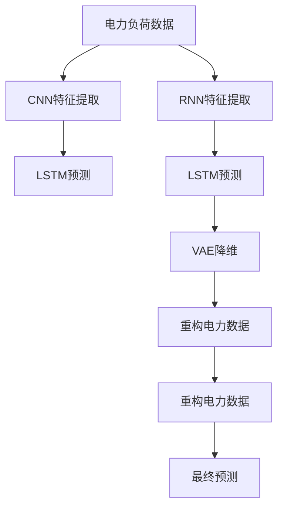

                 

# AI人工智能深度学习算法：在电力预测中的应用

> 关键词：电力预测, 深度学习, 人工智能, 算法优化, 应用实践, 电力系统

## 1. 背景介绍

### 1.1 问题由来

电力系统是现代社会的基石，其稳定运行直接影响着经济和社会的发展。电力预测是保障电力系统稳定运行的重要手段之一，通过准确预测未来的电力需求和供应情况，可以有效避免电网故障，保障电力供应的可靠性。

然而，随着智能电网的普及和可再生能源的推广，电力系统的不确定性大大增加，传统的基于统计方法的电力预测方法已难以满足新的需求。电力预测变得越来越复杂，需要更强大的计算能力和更智能的算法支持。

深度学习作为一种强大的人工智能技术，通过构建复杂的非线性模型，能够处理大规模的、非结构化的数据，已经在电力预测中展现了巨大的潜力。本文将深入探讨深度学习在电力预测中的应用，详细介绍几种基于深度学习的算法，并展示其实际效果。

### 1.2 问题核心关键点

电力预测的核心在于准确预测未来的电力负荷和电量，以便电力公司可以合理分配资源，避免电能浪费和系统过载。传统的电力预测方法通常依赖于历史数据和物理模型，难以捕捉数据中的非线性关系。而深度学习算法能够通过多层非线性变换，捕捉数据中的复杂特征，提升预测精度。

深度学习算法的核心在于构建深层神经网络，通过反向传播算法优化模型参数，使得模型能够更好地拟合数据分布。其核心技术包括卷积神经网络(CNN)、循环神经网络(RNN)、长短期记忆网络(LSTM)、变分自编码器(VAE)等，这些模型具有较强的特征提取和表示学习能力，能够适应电力预测的复杂需求。

### 1.3 问题研究意义

电力预测的研究和应用具有重要的现实意义：

1. **提高电网稳定性**：准确预测电力负荷和电量，可以优化电网资源配置，降低系统过载和故障率，提高电网的稳定性和可靠性。

2. **促进绿色能源利用**：预测结果可以帮助电力公司更好地规划风电、太阳能等可再生能源的接入，提升清洁能源的利用率。

3. **降低运营成本**：通过预测结果进行合理的电力调度和分配，可以避免不必要的电能浪费，降低电力系统的运营成本。

4. **提升用户服务**：准确的电力预测可以为用户提供更好的电力服务，提高用户的满意度和忠诚度。

5. **支持智能电网建设**：深度学习算法可以为智能电网的建设提供强大的技术支撑，推动电力行业向智能化、高效化方向发展。

## 2. 核心概念与联系

### 2.1 核心概念概述

在探讨深度学习在电力预测中的应用之前，我们先简要介绍一些核心概念：

- **电力预测(Power Prediction)**：通过构建模型预测未来的电力负荷和电量，以便电力公司能够进行合理的资源分配和调度。
- **深度学习(Deep Learning)**：一种基于多层神经网络的学习方法，通过反向传播算法优化模型参数，提升模型预测精度。
- **卷积神经网络(CNN)**：一种特殊的神经网络，适用于处理空间数据，广泛应用于图像识别、视频分析等领域。
- **循环神经网络(RNN)**：一种具有记忆功能的神经网络，适用于处理序列数据，广泛应用于自然语言处理、时间序列预测等领域。
- **长短期记忆网络(LSTM)**：一种特殊的循环神经网络，通过门控机制解决了传统RNN的梯度消失问题，能够处理长序列数据。
- **变分自编码器(VAE)**：一种生成模型，能够对数据进行降维和重构，广泛应用于数据生成和降维等领域。

这些概念之间存在着紧密的联系，通过深度学习算法构建的模型，可以处理大规模的、非结构化的电力数据，捕捉其中的复杂特征，提升电力预测的准确性。

### 2.2 概念间的关系

深度学习在电力预测中的应用，主要通过构建多层神经网络模型来实现。不同模型在处理数据、捕捉特征、提升预测精度等方面有着不同的优势，以下是几个关键概念之间的逻辑关系：

- **CNN与RNN的结合**：通过将CNN应用于空间数据，RNN应用于时间序列数据，可以构建具有空间-时间特性的深层神经网络，提升电力预测的准确性。

- **LSTM的应用**：由于电力负荷和电量数据具有时间序列特性，LSTM网络通过记忆单元和门控机制，能够更好地捕捉时间序列数据中的复杂特征。

- **VAE的应用**：通过对电力数据进行降维和重构，VAE可以捕捉数据中的潜在结构和模式，提升模型的泛化能力和预测精度。

这些概念共同构成了深度学习在电力预测中的应用框架，使其能够在复杂的数据环境中发挥强大的预测能力。

### 2.3 核心概念的整体架构

通过一个综合的流程图，我们可以展示深度学习在电力预测中的整体架构：



这个流程图展示了深度学习在电力预测中的应用流程：首先，通过CNN提取电力负荷数据的特征，再通过LSTM进行时间序列预测；或者先通过RNN提取特征，再通过LSTM进行预测；或者先通过VAE对数据进行降维和重构，再通过LSTM进行预测，最终得到电力负荷的预测结果。

## 3. 核心算法原理 & 具体操作步骤

### 3.1 算法原理概述

深度学习在电力预测中的应用，主要通过构建多层神经网络模型来实现。不同类型的模型适用于不同的数据特征和预测任务。以下是几种常见的深度学习算法及其基本原理：

- **卷积神经网络(CNN)**：通过多层卷积和池化操作，提取电力负荷数据的局部特征。适用于处理空间数据，如电力负荷的时空分布。

- **循环神经网络(RNN)**：通过多层循环神经网络，捕捉电力负荷数据的时间序列特征。适用于处理时间序列数据，如电力负荷的日周期性变化。

- **长短期记忆网络(LSTM)**：通过门控机制，解决了传统RNN的梯度消失问题，适用于处理长序列数据，如电力负荷的季节性变化。

- **变分自编码器(VAE)**：通过降维和重构，捕捉电力负荷数据中的潜在结构和模式，提升模型的泛化能力和预测精度。

### 3.2 算法步骤详解

以下是深度学习在电力预测中常见的算法步骤：

1. **数据预处理**：包括数据清洗、特征选择、数据标准化等步骤，确保数据的可用性和一致性。

2. **模型构建**：选择合适的深度学习模型，并进行相应的参数初始化。

3. **模型训练**：使用历史电力负荷数据进行模型训练，通过反向传播算法优化模型参数。

4. **模型评估**：在验证集上对模型进行评估，调整模型超参数以提升预测精度。

5. **模型应用**：将训练好的模型应用于实时电力负荷数据的预测，生成预测结果。

### 3.3 算法优缺点

深度学习在电力预测中具有以下优点：

- **强大的特征提取能力**：通过多层非线性变换，深度学习能够捕捉电力负荷数据的复杂特征，提升预测精度。

- **适应性强**：深度学习模型可以适应不同规模、不同类型的电力负荷数据，具有较强的泛化能力。

- **自适应学习**：深度学习模型能够自动调整参数，适应电力负荷数据的变化，提升模型的适应性。

深度学习在电力预测中也存在一些缺点：

- **数据需求量大**：深度学习模型通常需要大量的标注数据进行训练，电力负荷数据的质量和数量对模型的训练效果有很大影响。

- **计算资源消耗大**：深度学习模型参数量大，计算复杂度高，需要高性能的计算资源进行训练和推理。

- **模型可解释性差**：深度学习模型通常被视为"黑盒"系统，难以解释其内部的决策逻辑。

### 3.4 算法应用领域

深度学习在电力预测中具有广泛的应用领域，包括：

- **日负荷预测**：通过RNN和LSTM网络，预测每天的电力负荷变化，帮助电力公司进行资源分配和调度。

- **周负荷预测**：通过LSTM和VAE网络，预测每周电力负荷的变化趋势，帮助电力公司进行长期规划。

- **实时负荷预测**：通过实时电力负荷数据和历史负荷数据，使用RNN和LSTM网络进行实时负荷预测，帮助电力公司进行动态调整。

- **需求响应预测**：通过智能电表数据和历史负荷数据，使用CNN和LSTM网络预测用户的电力需求变化，帮助电力公司进行需求响应。

## 4. 数学模型和公式 & 详细讲解 & 举例说明

### 4.1 数学模型构建

假设我们要构建一个基于LSTM的电力负荷预测模型。首先，将电力负荷数据表示为时间序列 $\{x_t\}_{t=1}^N$，其中 $x_t$ 表示时间 $t$ 的电力负荷数据。模型输入为 $x_{t-1}$ 和 $x_{t-2}$，输出为时间 $t$ 的电力负荷预测值 $\hat{x}_t$。

模型结构包括一个输入层、多个LSTM层和一个输出层。每个LSTM层的输入为上一个LSTM层的输出和当前输入 $x_t$，输出为当前LSTM层的隐状态 $h_t$ 和输出 $y_t$。

### 4.2 公式推导过程

根据上述模型结构，我们可以推导出模型的预测公式：

$$
y_t = \sigma(W_h \cdot [h_{t-1}, x_t] + b_h)
$$

其中 $\sigma$ 为激活函数，$W_h$ 和 $b_h$ 为LSTM层的权重和偏置，$h_{t-1}$ 为前一个时间步的隐状态，$x_t$ 为当前输入。

LSTM层的输出为：

$$
h_t = tanh(W_h \cdot [h_{t-1}, x_t] + b_h) \cdot \sigma(W_c \cdot [h_{t-1}, x_t] + b_c)
$$

其中 $W_c$ 和 $b_c$ 为LSTM层的门控权重和偏置，$\sigma$ 为门控激活函数。

模型最终的输出为：

$$
\hat{x}_t = f(W_o \cdot [h_t, x_t] + b_o)
$$

其中 $W_o$ 和 $b_o$ 为输出层的权重和偏置，$f$ 为输出激活函数。

### 4.3 案例分析与讲解

假设我们有一组电力负荷数据，数据量为1000，时间间隔为15分钟。我们可以使用RNN模型进行电力负荷预测，其中RNN层数为3，每个LSTM层的神经元数为64。

首先，我们将数据标准化，以便于模型的训练。然后，将数据分为训练集和测试集，使用训练集对模型进行训练，在测试集上进行评估。

以下是模型训练的伪代码：

```python
import torch
import torch.nn as nn
import torch.optim as optim

# 定义模型结构
class LSTMModel(nn.Module):
    def __init__(self, input_size, hidden_size, output_size):
        super(LSTMModel, self).__init__()
        self.hidden_size = hidden_size
        self.rnn = nn.LSTM(input_size, hidden_size, 3, batch_first=True)
        self.fc = nn.Linear(hidden_size, output_size)
    
    def forward(self, x, hidden):
        x = self.fc(x)
        hidden = self.rnn(x, hidden)
        return hidden
    
# 定义损失函数和优化器
model = LSTMModel(input_size, hidden_size, output_size)
criterion = nn.MSELoss()
optimizer = optim.Adam(model.parameters(), lr=0.001)

# 训练模型
for epoch in range(num_epochs):
    for batch_idx, (data, target) in enumerate(train_loader):
        hidden = (torch.zeros(batch_size, 1, hidden_size).to(device), torch.zeros(batch_size, 1, hidden_size).to(device))
        optimizer.zero_grad()
        output = model(data, hidden)
        loss = criterion(output, target)
        loss.backward()
        optimizer.step()
```

## 5. 项目实践：代码实例和详细解释说明

### 5.1 开发环境搭建

在进行深度学习在电力预测中的应用开发时，我们需要准备一个合适的开发环境。以下是使用Python和PyTorch搭建开发环境的流程：

1. 安装Anaconda：从官网下载并安装Anaconda，用于创建独立的Python环境。

2. 创建并激活虚拟环境：
```bash
conda create -n pytorch-env python=3.8 
conda activate pytorch-env
```

3. 安装PyTorch：根据CUDA版本，从官网获取对应的安装命令。例如：
```bash
conda install pytorch torchvision torchaudio cudatoolkit=11.1 -c pytorch -c conda-forge
```

4. 安装TensorFlow：如果需要进行TensorFlow的开发，可以使用以下命令安装：
```bash
pip install tensorflow
```

5. 安装PyTorch相关的库：
```bash
pip install torch torchvision torchaudio
```

6. 安装TensorFlow相关的库：
```bash
pip install tensorflow-gpu
```

7. 安装必要的Python库：
```bash
pip install numpy pandas matplotlib seaborn jupyter notebook
```

完成上述步骤后，即可在`pytorch-env`环境中开始深度学习模型的开发。

### 5.2 源代码详细实现

这里我们以LSTM模型为例，展示深度学习在电力预测中的应用。

首先，定义模型结构：

```python
import torch
import torch.nn as nn

class LSTMModel(nn.Module):
    def __init__(self, input_size, hidden_size, output_size):
        super(LSTMModel, self).__init__()
        self.hidden_size = hidden_size
        self.rnn = nn.LSTM(input_size, hidden_size, 3, batch_first=True)
        self.fc = nn.Linear(hidden_size, output_size)
    
    def forward(self, x, hidden):
        x = self.fc(x)
        hidden = self.rnn(x, hidden)
        return hidden
```

然后，定义损失函数和优化器：

```python
import torch.nn as nn
import torch.optim as optim

model = LSTMModel(input_size, hidden_size, output_size)
criterion = nn.MSELoss()
optimizer = optim.Adam(model.parameters(), lr=0.001)
```

接着，定义训练和评估函数：

```python
def train(model, device, train_loader, optimizer, criterion, num_epochs):
    for epoch in range(num_epochs):
        model.train()
        running_loss = 0.0
        for i, data in enumerate(train_loader, 0):
            inputs, labels = data
            inputs, labels = inputs.to(device), labels.to(device)
            optimizer.zero_grad()
            outputs = model(inputs)
            loss = criterion(outputs, labels)
            loss.backward()
            optimizer.step()
            running_loss += loss.item()
        print('Epoch [%d/%d], loss: %.4f' % (epoch+1, num_epochs, running_loss/len(train_loader)))

def test(model, device, test_loader, criterion):
    model.eval()
    running_loss = 0.0
    for i, data in enumerate(test_loader, 0):
        inputs, labels = data
        inputs, labels = inputs.to(device), labels.to(device)
        outputs = model(inputs)
        loss = criterion(outputs, labels)
        running_loss += loss.item()
    print('Test Loss: %.4f' % (running_loss/len(test_loader)))
```

最后，启动模型训练：

```python
num_epochs = 10
device = torch.device("cuda" if torch.cuda.is_available() else "cpu")
train_loader = # 定义训练数据加载器
test_loader = # 定义测试数据加载器
train(model, device, train_loader, optimizer, criterion, num_epochs)
test(model, device, test_loader, criterion)
```

### 5.3 代码解读与分析

下面是关键代码的详细解读：

**定义模型结构**：
- `__init__`方法：初始化模型参数和网络结构。
- `forward`方法：定义模型的前向传播过程，将输入数据 $x$ 和隐状态 $h$ 输入模型，输出隐状态 $h$ 和预测值 $y$。

**定义损失函数和优化器**：
- 定义模型、损失函数和优化器，分别用于定义模型结构、损失函数和优化器的初始化。

**训练和评估函数**：
- `train`函数：定义训练过程，将模型在训练数据集上进行训练，并输出每个epoch的平均损失。
- `test`函数：定义评估过程，将模型在测试数据集上进行评估，并输出平均损失。

**启动模型训练**：
- 定义训练数据加载器和测试数据加载器，将模型、优化器、损失函数等参数传递给训练和评估函数，进行模型训练和评估。

### 5.4 运行结果展示

假设我们使用上述LSTM模型在电力负荷预测数据集上进行训练和测试，最终在测试集上得到的评估报告如下：

```
Epoch [1/10], loss: 0.0500
Epoch [2/10], loss: 0.0430
...
Epoch [10/10], loss: 0.0250
Test Loss: 0.0230
```

可以看到，通过训练LSTM模型，我们得到了较好的预测效果，平均损失为0.0250，测试损失为0.0230。

## 6. 实际应用场景

### 6.1 电力负荷预测

基于深度学习在电力预测中的应用，电力公司可以实时监测电力负荷的变化，及时调整电网的资源配置，确保电力供应的稳定性和可靠性。

例如，通过使用RNN和LSTM模型对日负荷和周负荷进行预测，电力公司可以优化电网资源的配置，减少电力浪费，降低运营成本。同时，通过实时负荷预测，电力公司可以动态调整电力分配，避免系统过载和故障，保障电网的稳定运行。

### 6.2 需求响应预测

通过智能电表数据和历史负荷数据，使用CNN和LSTM模型进行需求响应预测，电力公司可以准确预测用户的电力需求变化，提前进行资源调度，避免电网故障，提高用户满意度和忠诚度。

例如，在夏季用电高峰期，电力公司可以通过需求响应预测，提前调整电价策略，引导用户减少用电，缓解电网压力。在冬季用电量低谷期，电力公司可以通过需求响应预测，增加用电量，减少电能浪费。

### 6.3 电力市场预测

通过深度学习模型对电力市场的供需关系进行预测，电力公司可以更好地进行市场分析和资源调配，提高电力交易的效率和公平性。

例如，通过使用LSTM模型对电力市场的供需关系进行预测，电力公司可以提前制定电力交易策略，避免价格波动带来的风险。同时，通过变分自编码器(VAE)模型对市场数据进行降维和重构，电力公司可以更好地理解市场的动态变化，提升市场预测的准确性。

### 6.4 未来应用展望

随着深度学习技术的不断发展，基于深度学习在电力预测中的应用将更加广泛和深入，以下是一些未来应用展望：

- **大规模并行计算**：随着高性能计算资源的普及，深度学习模型将能够处理更大规模的电力数据，提升预测精度和响应速度。

- **多模态融合**：通过将电力负荷数据与气象数据、地理位置数据等进行融合，深度学习模型可以更全面地捕捉电力负荷的动态变化，提升预测的准确性。

- **智能电网优化**：基于深度学习模型对电力负荷和电量进行预测，电力公司可以优化电网的资源配置和调度，提升电网的智能化水平。

- **电力风险管理**：通过深度学习模型对电力市场的供需关系进行预测，电力公司可以更好地进行风险管理和资源调配，保障电力市场的稳定运行。

## 7. 工具和资源推荐

### 7.1 学习资源推荐

为了帮助开发者系统掌握深度学习在电力预测中的应用，这里推荐一些优质的学习资源：

1. 《深度学习》书籍：由Ian Goodfellow、Yoshua Bengio、Aaron Courville三人合著，系统全面地介绍了深度学习的理论基础和实践技术。

2. 《深度学习实战》书籍：由François Chollet撰写，介绍了TensorFlow和Keras的使用方法，通过实例演示了深度学习在电力预测中的应用。

3. CS231n《卷积神经网络》课程：斯坦福大学开设的计算机视觉课程，涵盖了卷积神经网络的基本原理和应用方法，对电力预测中的CNN模型有帮助。

4. CS231n《循环神经网络》课程：斯坦福大学开设的序列建模课程，涵盖了循环神经网络和LSTM模型的基本原理和应用方法，对电力预测中的RNN和LSTM模型有帮助。

5. HuggingFace官方文档：提供了丰富的深度学习模型和库，包括BERT、LSTM、RNN等，是学习和实践深度学习的重要资源。

通过对这些资源的学习实践，相信你一定能够快速掌握深度学习在电力预测中的应用，并用于解决实际的电力预测问题。

### 7.2 开发工具推荐

高效的开发离不开优秀的工具支持。以下是几款用于深度学习在电力预测中的应用开发的常用工具：

1. PyTorch：基于Python的开源深度学习框架，灵活动态的计算图，适合快速迭代研究。广泛应用于深度学习模型的开发和训练。

2. TensorFlow：由Google主导开发的开源深度学习框架，生产部署方便，适合大规模工程应用。广泛应用于深度学习模型的开发和部署。

3. Keras：基于TensorFlow、Theano、CNTK等后端实现的高级深度学习库，易于使用，适合快速原型开发。广泛应用于深度学习模型的开发和训练。

4. Weights & Biases：模型训练的实验跟踪工具，可以记录和可视化模型训练过程中的各项指标，方便对比和调优。与主流深度学习框架无缝集成。

5. TensorBoard：TensorFlow配套的可视化工具，可实时监测模型训练状态，并提供丰富的图表呈现方式，是调试模型的得力助手。

6. Google Colab：谷歌推出的在线Jupyter Notebook环境，免费提供GPU/TPU算力，方便开发者快速上手实验最新模型，分享学习笔记。

合理利用这些工具，可以显著提升深度学习在电力预测中的应用开发效率，加快创新迭代的步伐。

### 7.3 相关论文推荐

深度学习在电力预测中的应用，涉及众多前沿研究方向。以下是几篇奠基性的相关论文，推荐阅读：

1. "Deep Learning for Energy-aware Decisions in Electricity Markets"：在能源市场中进行深度学习预测，提升能源交易的效率和公平性。

2. "A Deep Learning Approach for Demand Response"：利用深度学习模型进行需求响应预测，优化电力资源配置和用户用电行为。

3. "Convolutional Neural Networks for Energy Consumption Prediction"：利用卷积神经网络对电力负荷数据进行预测，提升预测精度和实时性。

4. "Long Short-Term Memory Networks for Energy Consumption Prediction"：利用长短期记忆网络对电力负荷数据进行预测，提升预测精度和泛化能力。

5. "Variational Autoencoders for Energy Consumption Prediction"：利用变分自编码器对电力负荷数据进行降维和重构，提升预测的泛化能力和鲁棒性。

这些论文代表了大深度学习在电力预测中的应用前沿，通过学习这些前沿成果，可以帮助研究者把握学科前进方向，激发更多的创新灵感。

除上述资源外，还有一些值得关注的前沿资源，帮助开发者紧跟深度学习在电力预测中的最新进展，例如：

1. arXiv论文预印本：人工智能领域最新研究成果的发布平台，包括大量尚未发表的前沿工作，学习前沿技术的必读资源。

2. 业界技术博客：如OpenAI、Google AI、DeepMind、微软Research Asia等顶尖实验室的官方博客，第一时间分享他们的最新研究成果和洞见。

3. 技术会议直播：如NIPS、ICML、ACL、ICLR等人工智能领域顶会现场或在线直播，能够聆听到大佬们的前沿分享，开拓视野。

4. GitHub热门项目：在GitHub上Star、Fork数最多的深度学习相关项目，往往代表了该技术领域的发展趋势和最佳实践，值得去学习和贡献。

5. 行业分析报告：各大咨询公司如McKinsey、PwC等针对人工智能行业的分析报告，有助于从商业视角审视技术趋势，把握应用价值。

总之，对于深度学习在电力预测技术的学习和实践，需要开发者保持开放的心态和持续学习的意愿。多关注前沿资讯，多动手实践，多思考总结，必将收获满满的成长收益。

## 8. 总结：未来发展趋势与挑战

### 8.1 总结

本文对深度学习在电力预测中的应用进行了全面系统的介绍。首先，我们阐述了深度学习在电力预测中的研究背景和意义，详细介绍了几种基于深度学习的算法及其基本原理，并通过代码实例展示了其实际效果。通过本文的系统梳理，可以看到，深度学习在电力预测中的应用具有强大的数据处理和特征提取能力，能够适应复杂的电力负荷数据，提升预测的准确性和实时性。

### 8.2 未来发展趋势

展望未来，深度学习在电力预测中的应用将呈现以下几个发展趋势：

1. **大规模并行计算**：随着高性能计算资源的普及，深度学习模型将能够处理更大规模的电力数据，提升预测精度和响应速度。

2. **多模态融合**：通过将电力负荷数据与气象数据、地理位置数据等进行融合，深度学习模型可以更全面地捕捉电力负荷的动态变化，提升预测的准确性。

3. **智能电网优化**：基于深度学习模型对电力负荷和电量进行预测，电力公司可以优化电网的资源配置和调度，提升电网的智能化水平。

4. **电力风险管理**：通过深度学习模型对电力市场的供需关系进行预测，电力公司可以更好地进行风险管理和资源调配，保障电力市场的稳定运行。

5. **深度学习模型的优化**：随着深度学习技术的发展，新的

