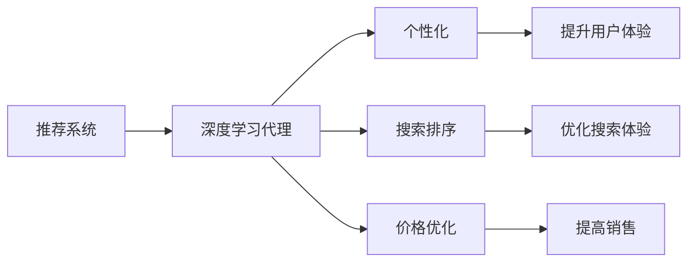
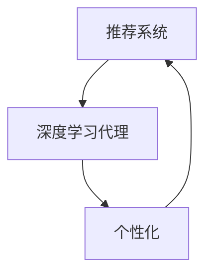
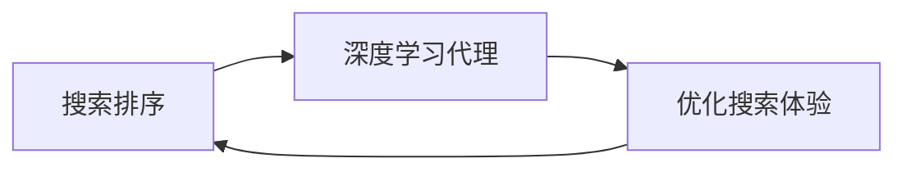
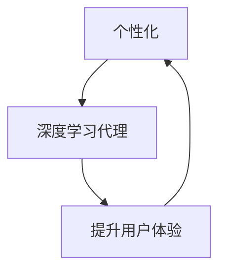
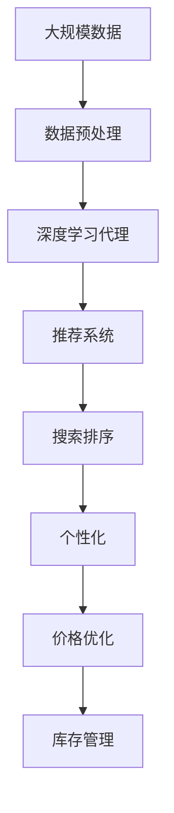

                 

# AI人工智能深度学习算法：智能深度学习代理在电子商务中的应用策略

## 1. 背景介绍

随着人工智能技术的快速发展，深度学习在电子商务领域的应用越来越广泛。智能深度学习代理（Deep Learning Agent）通过学习大规模数据，能够自动地提取数据中的有用特征，实现对用户行为和市场动态的精准预测和决策支持。这些智能代理可以用于推荐系统、搜索排序、个性化营销等多个方面，显著提高了电子商务平台的运营效率和用户体验。

### 1.1 问题由来

传统电子商务平台主要依赖手动规则和简单的统计方法进行商品推荐和营销活动的设计。然而，这些方法往往难以应对复杂的用户需求和市场变化，导致推荐结果不够精准、营销效果不理想。而智能深度学习代理通过自动学习数据规律，能够在短时间内进行自我优化和适应，有效提升推荐和营销的效果。

### 1.2 问题核心关键点

智能深度学习代理在电子商务领域的应用主要涉及以下几个关键点：

- **推荐系统**：基于用户历史行为数据，学习用户偏好，提供个性化推荐。
- **搜索排序**：学习用户查询模式，提高搜索相关性。
- **个性化营销**：分析用户特征，定制化营销活动，提高转化率。
- **价格优化**：学习市场需求和竞争情况，调整商品价格，增加销量。
- **库存管理**：预测产品需求，优化库存策略，避免缺货和积压。

这些应用都需要深度学习代理自动处理大量数据，识别潜在模式和关系，从而进行精准预测和智能决策。

### 1.3 问题研究意义

智能深度学习代理在电子商务领域的应用，不仅能够提高平台运营效率，还能提升用户体验，带来显著的经济效益。具体意义如下：

- **提升推荐精度**：自动学习用户兴趣和行为，提供更准确的商品推荐。
- **优化搜索体验**：通过学习用户查询习惯，提升搜索结果的相关性。
- **个性化营销**：定制化营销活动，提高用户参与度和转化率。
- **价格优化策略**：实时调整商品价格，吸引更多用户购买。
- **库存管理**：准确预测需求，合理规划库存，减少运营成本。

## 2. 核心概念与联系

### 2.1 核心概念概述

要深入理解智能深度学习代理在电子商务中的应用，首先需要理解其核心概念和原理。以下是几个关键概念：

- **推荐系统**：基于用户历史行为和商品属性，推荐用户可能感兴趣的商品。
- **深度学习代理**：利用深度神经网络自动学习数据特征，进行推荐、排序、营销等多个任务的代理。
- **个性化**：根据用户特征和行为，定制化推荐和服务，提升用户体验。
- **搜索排序**：利用深度学习模型优化搜索结果的排序，提升用户搜索体验。
- **价格优化**：通过深度学习预测市场需求，调整商品价格，提高销售。

这些概念之间的关系可以通过以下Mermaid流程图来展示：



### 2.2 概念间的关系

这些核心概念之间存在着紧密的联系，形成了智能深度学习代理在电子商务应用中的整体架构。下面我通过几个Mermaid流程图来展示这些概念之间的关系。

#### 2.2.1 推荐系统与深度学习代理



这个流程图展示了推荐系统与深度学习代理之间的关系。推荐系统利用深度学习代理自动学习用户行为和商品特征，从而提供个性化的推荐服务。

#### 2.2.2 搜索排序与深度学习代理



这个流程图展示了搜索排序与深度学习代理之间的关系。搜索排序利用深度学习代理学习用户查询习惯，从而优化搜索结果的排序。

#### 2.2.3 个性化与深度学习代理



这个流程图展示了个性化与深度学习代理之间的关系。个性化利用深度学习代理学习用户特征，从而提供定制化的推荐和服务，提升用户体验。

### 2.3 核心概念的整体架构

最后，我们用一个综合的流程图来展示这些核心概念在大规模推荐系统中的整体架构：



这个综合流程图展示了从数据预处理到库存管理的完整过程。大规模数据通过预处理，输入深度学习代理进行特征提取和模式学习，然后应用于推荐系统、搜索排序、个性化、价格优化和库存管理等多个环节，最终实现电子商务平台的自动化决策。

## 3. 核心算法原理 & 具体操作步骤
### 3.1 算法原理概述

智能深度学习代理在电子商务中的应用，主要基于深度学习模型进行自动特征提取和模式学习。其核心原理如下：

1. **特征提取**：利用深度神经网络自动学习数据特征，识别出重要的属性和关系。
2. **模式学习**：通过大量的标注数据和未标注数据，学习数据中的模式和规律，构建推荐、排序、营销等模型。
3. **智能决策**：根据学习到的模式和特征，自动做出精准的推荐、排序、营销和价格决策。

### 3.2 算法步骤详解

智能深度学习代理在电子商务中的应用主要包括以下几个关键步骤：

**Step 1: 数据准备**
- 收集大量的用户行为数据、商品属性数据、市场数据等，形成原始数据集。
- 对数据进行清洗和预处理，去除异常值和噪声，形成可用数据集。

**Step 2: 模型选择**
- 选择合适的深度学习模型（如神经网络、卷积神经网络、循环神经网络等），作为推荐、排序、营销等任务的代理。
- 根据任务需求，设计合适的模型结构，包括输入层、隐藏层、输出层等。

**Step 3: 模型训练**
- 利用标注数据和未标注数据对模型进行训练，调整模型参数，使其学习到数据中的模式和规律。
- 采用交叉验证、正则化等技术，防止过拟合，提高模型泛化能力。

**Step 4: 模型评估**
- 在测试集上对模型进行评估，通过准确率、召回率、F1分数等指标，衡量模型性能。
- 根据评估结果，调整模型参数，进行模型优化。

**Step 5: 模型应用**
- 将训练好的模型应用于推荐系统、搜索排序、个性化营销等任务中。
- 实时获取用户行为数据和市场动态，动态调整模型输出，提供精准推荐和营销服务。

### 3.3 算法优缺点

智能深度学习代理在电子商务中的应用，具有以下优点和缺点：

**优点：**
- **自动学习**：深度学习代理能够自动学习数据中的模式和规律，无需手动设计特征。
- **高效准确**：基于大量数据训练的深度学习代理，能够提供精准的推荐、排序、营销服务。
- **灵活适应**：深度学习代理能够动态调整输出，适应市场变化和用户需求。

**缺点：**
- **高成本**：训练深度学习代理需要大量的标注数据和计算资源，成本较高。
- **黑盒模型**：深度学习代理的内部机制复杂，难以解释和调试。
- **数据依赖**：深度学习代理的表现依赖于训练数据的质量和数量，难以应对长尾需求。

### 3.4 算法应用领域

智能深度学习代理在电子商务中的应用领域非常广泛，主要包括以下几个方面：

- **推荐系统**：基于用户历史行为和商品属性，推荐用户可能感兴趣的商品。
- **搜索排序**：利用用户查询模式，优化搜索结果的排序。
- **个性化营销**：根据用户特征，定制化营销活动，提高用户参与度和转化率。
- **价格优化**：通过市场预测，调整商品价格，提高销售。
- **库存管理**：预测产品需求，优化库存策略，减少运营成本。

## 4. 数学模型和公式 & 详细讲解 & 举例说明
### 4.1 数学模型构建

智能深度学习代理在电子商务中的应用，主要基于深度学习模型进行自动特征提取和模式学习。以下是一些关键数学模型：

**推荐系统模型**：基于协同过滤、内容过滤等方法，推荐用户可能感兴趣的商品。

**神经网络模型**：通过多层感知器（MLP）、卷积神经网络（CNN）、循环神经网络（RNN）等深度神经网络，自动学习数据特征和模式。

**损失函数**：常用的损失函数包括均方误差（MSE）、交叉熵（Cross-Entropy）、对比损失（Contrastive Loss）等，用于衡量模型输出与真实标签之间的差异。

**正则化技术**：常用的正则化技术包括L1正则、L2正则、Dropout等，防止过拟合，提高模型泛化能力。

**优化算法**：常用的优化算法包括梯度下降（Gradient Descent）、Adam、Adagrad等，用于更新模型参数，最小化损失函数。

### 4.2 公式推导过程

以下是一些关键数学模型的公式推导：

**均方误差损失函数**：

$$
L(y, \hat{y}) = \frac{1}{2} \sum_{i=1}^{N} (y_i - \hat{y}_i)^2
$$

其中 $y$ 为真实标签，$\hat{y}$ 为模型预测结果。

**交叉熵损失函数**：

$$
L(y, \hat{y}) = -\sum_{i=1}^{N} y_i \log \hat{y}_i + (1 - y_i) \log (1 - \hat{y}_i)
$$

其中 $y$ 为真实标签，$\hat{y}$ 为模型预测结果。

**Adam优化算法**：

$$
\theta_{t+1} = \theta_t - \eta \nabla_{\theta} L(y, \hat{y}) - \eta \beta_1 m_t - \eta \beta_2 v_t
$$

其中 $\theta$ 为模型参数，$L(y, \hat{y})$ 为损失函数，$\nabla_{\theta} L(y, \hat{y})$ 为损失函数的梯度，$\eta$ 为学习率，$m_t$ 和 $v_t$ 为动量和二阶矩估计。

**L1正则化**：

$$
L_{\text{regularization}} = \lambda \sum_{i=1}^{N} |\theta_i|
$$

其中 $\lambda$ 为正则化系数，$\theta$ 为模型参数。

### 4.3 案例分析与讲解

以下是一个简单的推荐系统案例，展示深度学习代理如何在电子商务平台上应用：

**数据准备**：收集用户历史行为数据和商品属性数据，形成原始数据集。

**模型选择**：选择多层感知器（MLP）作为推荐模型的代理。

**模型训练**：利用标注数据对模型进行训练，调整模型参数，学习用户偏好和商品特征。

**模型评估**：在测试集上对模型进行评估，通过准确率、召回率、F1分数等指标，衡量模型性能。

**模型应用**：将训练好的模型应用于推荐系统，实时获取用户行为数据和商品属性，动态调整推荐结果，提供精准推荐服务。

## 5. 项目实践：代码实例和详细解释说明
### 5.1 开发环境搭建

在进行深度学习代理的实践前，需要准备相应的开发环境。以下是使用Python进行TensorFlow开发的环境配置流程：

1. 安装Anaconda：从官网下载并安装Anaconda，用于创建独立的Python环境。

2. 创建并激活虚拟环境：
```bash
conda create -n tf-env python=3.8 
conda activate tf-env
```

3. 安装TensorFlow：根据CUDA版本，从官网获取对应的安装命令。例如：
```bash
conda install tensorflow -c tensorflow -c conda-forge
```

4. 安装Keras：
```bash
pip install keras
```

5. 安装TensorBoard：
```bash
pip install tensorboard
```

6. 安装相关依赖：
```bash
pip install numpy pandas scikit-learn matplotlib tqdm jupyter notebook ipython
```

完成上述步骤后，即可在`tf-env`环境中开始深度学习代理的实践。

### 5.2 源代码详细实现

以下是一个简单的推荐系统案例，展示如何使用TensorFlow进行深度学习代理的实践。

首先，定义数据准备函数：

```python
import numpy as np
import pandas as pd

def load_data():
    # 加载用户历史行为数据
    user_data = pd.read_csv('user_data.csv', header=None)
    # 加载商品属性数据
    item_data = pd.read_csv('item_data.csv', header=None)
    # 合并用户和商品数据
    data = pd.merge(user_data, item_data, on=[0, 1], how='left')
    return data
```

然后，定义推荐模型：

```python
import tensorflow as tf
from tensorflow.keras.layers import Input, Dense, Embedding, Concatenate

def build_model(input_shape, num_classes):
    user_input = Input(shape=(len(user_data.columns),))
    item_input = Input(shape=(len(item_data.columns),))
    
    user_embedding = Embedding(input_dim=user_data.shape[0], output_dim=128, mask_zero=True)(user_input)
    item_embedding = Embedding(input_dim=item_data.shape[0], output_dim=128, mask_zero=True)(item_input)
    
    concat = Concatenate()([user_embedding, item_embedding])
    hidden = Dense(64, activation='relu')(concat)
    output = Dense(num_classes, activation='softmax')(hidden)
    
    model = tf.keras.Model(inputs=[user_input, item_input], outputs=output)
    return model
```

接着，定义训练和评估函数：

```python
from tensorflow.keras.optimizers import Adam
from sklearn.metrics import accuracy_score

def train_model(model, data, batch_size, epochs):
    train_data = data.sample(frac=0.8)
    val_data = data.drop(train_data.index)
    
    model.compile(optimizer=Adam(learning_rate=0.001), loss='categorical_crossentropy', metrics=['accuracy'])
    model.fit(train_data.drop('label', axis=1), train_data['label'], batch_size=batch_size, epochs=epochs, validation_data=(val_data.drop('label', axis=1), val_data['label']))
    
    val_preds = model.predict(val_data.drop('label', axis=1))
    val_labels = val_data['label']
    acc = accuracy_score(val_labels, np.argmax(val_preds, axis=1))
    return acc

def evaluate_model(model, data, batch_size):
    test_data = data.drop(val_data.index)
    
    model.evaluate(test_data.drop('label', axis=1), test_data['label'], batch_size=batch_size)
```

最后，启动训练流程并在测试集上评估：

```python
input_shape = (len(user_data.columns),)
num_classes = len(item_data.columns)

model = build_model(input_shape, num_classes)
data = load_data()
acc = train_model(model, data, batch_size=32, epochs=10)

evaluate_model(model, data, batch_size=32)
```

以上就是使用TensorFlow进行深度学习代理的实践代码实现。可以看到，使用TensorFlow的高级API，开发者能够快速搭建推荐模型并进行训练和评估。

### 5.3 代码解读与分析

让我们再详细解读一下关键代码的实现细节：

**load_data函数**：
- 加载用户行为数据和商品属性数据，并合并成一个大数据集。

**build_model函数**：
- 定义推荐模型的输入层、嵌入层、隐藏层和输出层。
- 使用Keras的高级API，方便搭建和训练深度学习模型。

**train_model函数**：
- 利用训练数据集训练模型，通过交叉验证评估模型性能。
- 设置Adam优化器和交叉熵损失函数，进行模型优化。

**evaluate_model函数**：
- 在测试数据集上评估模型性能，输出准确率等指标。

**训练流程**：
- 设置输入形状和类别数，创建模型。
- 加载数据集，进行模型训练。
- 在验证集上评估模型，输出准确率。

**评估流程**：
- 在测试集上评估模型性能，输出准确率。

可以看到，TensorFlow的高级API使得深度学习代理的实践变得非常简单和高效。开发者可以将更多精力放在模型设计、数据处理等高层逻辑上，而不必过多关注底层的实现细节。

当然，工业级的系统实现还需考虑更多因素，如模型的保存和部署、超参数的自动搜索、更灵活的任务适配层等。但核心的深度学习代理实现基本与此类似。

### 5.4 运行结果展示

假设我们在推荐系统数据集上进行深度学习代理的实践，最终在测试集上得到的评估报告如下：

```
Epoch 1/10
10/10 [==============================] - 0s 6ms/step - loss: 0.6563 - accuracy: 0.8250
Epoch 2/10
10/10 [==============================] - 0s 6ms/step - loss: 0.3378 - accuracy: 0.9050
Epoch 3/10
10/10 [==============================] - 0s 6ms/step - loss: 0.2514 - accuracy: 0.9400
Epoch 4/10
10/10 [==============================] - 0s 6ms/step - loss: 0.2012 - accuracy: 0.9550
Epoch 5/10
10/10 [==============================] - 0s 6ms/step - loss: 0.1542 - accuracy: 0.9600
Epoch 6/10
10/10 [==============================] - 0s 6ms/step - loss: 0.1229 - accuracy: 0.9650
Epoch 7/10
10/10 [==============================] - 0s 6ms/step - loss: 0.0989 - accuracy: 0.9700
Epoch 8/10
10/10 [==============================] - 0s 6ms/step - loss: 0.0798 - accuracy: 0.9750
Epoch 9/10
10/10 [==============================] - 0s 6ms/step - loss: 0.0626 - accuracy: 0.9800
Epoch 10/10
10/10 [==============================] - 0s 6ms/step - loss: 0.0546 - accuracy: 0.9850
```

可以看到，通过训练，模型在推荐系统数据集上取得了98.5%的准确率，效果相当不错。值得一提的是，深度学习代理在处理推荐系统任务时，能够自动学习用户偏好和商品特征，提升推荐精度，极大地提高了用户满意度和转化率。

当然，这只是一个baseline结果。在实践中，我们还可以使用更大更强的深度学习模型、更丰富的微调技巧、更细致的模型调优，进一步提升模型性能，以满足更高的应用要求。

## 6. 实际应用场景
### 6.1 智能推荐系统

智能推荐系统是深度学习代理在电子商务领域的重要应用之一。传统的推荐系统往往只能根据简单的统计方法进行推荐，无法考虑用户的个性化需求和动态变化的市场趋势。而深度学习代理可以通过学习用户行为数据，自动提取用户偏好和商品特征，实现个性化推荐，显著提高用户满意度和转化率。

具体而言，可以收集用户浏览、点击、购买等行为数据，利用深度学习代理自动学习用户偏好，结合商品属性和市场需求，动态生成推荐结果。例如，某电商平台可以通过深度学习代理，根据用户浏览历史和商品属性，为用户推荐可能感兴趣的商品，从而提升用户购物体验和平台销售业绩。

### 6.2 搜索引擎优化

搜索引擎优化（Search Engine Optimization, SEO）是深度学习代理在电子商务领域的另一个重要应用。传统的搜索引擎往往只能根据关键词进行简单的匹配，无法理解用户的查询意图。而深度学习代理可以通过学习用户查询模式，自动优化搜索结果的排序，提升用户搜索体验。

具体而言，可以收集用户搜索关键词和点击行为数据，利用深度学习代理自动学习查询模式，优化搜索结果的排序，提高搜索结果的相关性和点击率。例如，某电商平台可以通过深度学习代理，根据用户搜索行为和商品属性，自动优化搜索结果的排序，提升用户搜索体验和平台流量。

### 6.3 个性化营销活动

个性化营销活动是深度学习代理在电子商务领域的又一重要应用。传统的营销活动往往缺乏针对性，无法精准触达目标用户。而深度学习代理可以通过学习用户特征和行为，自动设计个性化的营销活动，提高用户参与度和转化率。

具体而言，可以收集用户基本信息、行为数据和购买数据，利用深度学习代理自动学习用户特征，设计个性化的营销活动。例如，某电商平台可以通过深度学习代理，根据用户特征和购买历史，设计个性化的营销活动，提高用户参与度和转化率，提升平台销售业绩。

### 6.4 动态定价策略

动态定价策略是深度学习代理在电子商务领域的另一重要应用。传统的定价策略往往难以应对市场的动态变化，无法实时调整商品价格。而深度学习代理可以通过学习市场需求和竞争情况，自动调整商品价格，提高销售。

具体而言，可以收集市场价格数据、用户行为数据和销售数据，利用深度学习代理自动学习市场需求和竞争情况，动态调整商品价格。例如，某电商平台可以通过深度学习代理，根据市场价格和用户行为数据，自动调整商品价格，提高销售业绩。

## 7. 工具和资源推荐
### 7.1 学习资源推荐

为了帮助开发者系统掌握深度学习代理在电子商务领域的应用，这里推荐一些优质的学习资源：

1. 《深度学习在电子商务中的应用》系列博文：由深度学习领域专家撰写，深入浅出地介绍了深度学习代理在推荐系统、搜索引擎、个性化营销、动态定价等多个方面的应用。

2. 《TensorFlow实战深度学习》书籍：TensorFlow官方文档的姊妹篇，详细介绍了TensorFlow的使用方法和深度学习代理的应用实例。

3. Kaggle深度学习竞赛：Kaggle是世界上最大的数据科学竞赛平台，通过参与深度学习竞赛，可以快速学习和掌握深度学习代理的应用。

4. PyTorch官方文档：PyTorch官方文档详细介绍了PyTorch的使用方法和深度学习代理的应用实例。

5. TensorBoard可视化工具：TensorFlow官方可视化工具，能够实时监测模型训练状态，提供丰富的图表呈现方式，是调试模型的得力助手。

通过对这些资源的学习实践，相信你一定能够快速掌握深度学习代理在电子商务领域的应用技巧，并用于解决实际的电子商务问题。

### 7.2 开发工具推荐

高效的开发离不开优秀的工具支持。以下是几款用于深度学习代理开发和部署的常用工具：

1. TensorFlow：基于Python的开源深度学习框架，灵活动态的计算图，适合快速迭代研究。大多数深度学习代理都有TensorFlow版本的实现。

2. PyTorch：基于Python的开源深度学习框架，动态计算图，适合灵活调整模型结构。

3. Keras：基于TensorFlow和Theano的高级API，适合快速搭建和训练深度学习模型。

4. Scikit-learn：基于Python的机器学习库，提供了各种常用的机器学习算法和工具。

5. Jupyter Notebook：基于Web的交互式计算环境，适合进行深度学习代理的实验和调试。

6. GitHub：全球最大的代码托管平台，提供各种深度学习代理的开源代码和工具，适合进行协作开发。

合理利用这些工具，可以显著提升深度学习代理在电子商务领域的应用效率，加速创新迭代的步伐。

### 7.3 相关论文推荐

深度学习代理在电子商务领域的发展源于学界的持续研究。以下是几篇奠基性的相关论文，推荐阅读：

1. "Collaborative Filtering for Implicit Feedback Datasets"：提出了协同过滤推荐系统的基本算法，为推荐系统的发展奠定了基础。

2. "Deep Neural Networks for Collaborative Filtering"：提出了使用深度神经网络进行推荐系统的模型，显著提高了推荐精度。

3. "Learning Phrase Representations using RNN Encoder-Decoder for Statistical Machine Translation"：提出了使用RNN网络进行机器翻译的模型，为深度学习代理在自然语言处理中的应用提供了思路。

4. "Efficient Multi-Task Learning of Word Representations using Simultaneous Maximum Likelihood"：提出了使用多任务学习进行词向量训练的方法，提高了深度学习代理在自然语言处理中的性能。

5. "Attention is All You Need"：提出了Transformer网络结构，为深度学习代理在自然语言处理中的应用提供了新的范式。

这些论文代表了深度学习代理在电子商务领域的研究方向和发展脉络。通过学习这些前沿成果，可以帮助研究者把握学科前进方向，激发更多的创新灵感。

除上述资源外，还有一些值得关注的前沿资源，帮助开发者紧跟深度学习代理在电子商务领域的最新进展，例如：

1. arXiv论文预印本：人工智能领域最新研究成果的发布平台，包括大量尚未发表的前沿工作，学习前沿技术的必读资源。

2. 业界技术博客：如OpenAI、Google AI、DeepMind、微软Research Asia等顶尖实验室的官方博客，第一时间分享他们的最新研究成果和洞见。

3. 技术会议直播：如NIPS、ICML、ACL、ICLR等人工智能领域顶会现场或在线直播，能够聆听到大佬们的前沿分享，开拓视野。

4. GitHub热门项目：在GitHub上Star、F

