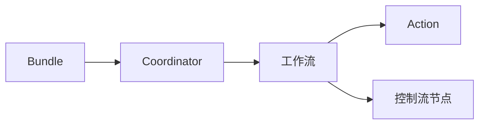
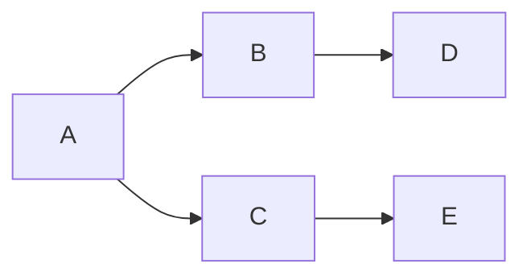

# Oozie原理与代码实例讲解

## 1. 背景介绍

### 1.1 问题的由来

在当今大数据时代，海量数据的处理和分析成为了许多企业和组织的迫切需求。为了应对这一挑战，各种分布式计算框架应运而生，例如 Hadoop、Spark 等。然而，这些框架通常需要编写复杂的代码来编排和管理多个任务的执行流程，例如数据清洗、特征提取、模型训练等等。手动编写和维护这些代码不仅繁琐易错，而且难以扩展和复用。

为了解决这个问题，工作流调度系统应运而生。Oozie 就是其中一种优秀的工作流调度系统，它可以帮助我们定义、管理和执行复杂的数据处理工作流。

### 1.2 研究现状

Oozie 最初由 Yahoo! 开发，并于 2010 年开源。目前，Oozie 已经成为了 Apache 基金会的顶级项目，被广泛应用于各种大数据平台和应用场景。

除了 Oozie 之外，还有其他一些常用的工作流调度系统，例如：

* **Azkaban:** LinkedIn 开发的工作流调度系统，易于使用，但功能相对简单。
* **Airflow:** Airbnb 开发的工作流调度系统，功能强大，但学习曲线较陡峭。
* **Luigi:** Spotify 开发的工作流调度系统，专注于 Python 生态系统。

### 1.3 研究意义

Oozie 作为一款成熟、稳定、功能强大的工作流调度系统，具有以下优点：

* **可扩展性:** Oozie 可以轻松地扩展到处理数千个节点和数百万个工作流。
* **可靠性:** Oozie 提供了多种机制来确保工作流的可靠执行，例如重试机制、失败处理机制等。
* **易用性:** Oozie 提供了基于 XML 的工作流定义语言，易于理解和使用。
* **灵活性:** Oozie 支持多种类型的任务，例如 Hadoop 任务、Java 程序、Shell 脚本等。

学习和掌握 Oozie 的使用，可以帮助我们更好地应对大数据处理和分析的挑战，提高工作效率，降低开发成本。

### 1.4 本文结构

本文将从以下几个方面详细介绍 Oozie 原理和代码实例：

* 核心概念与联系
* 核心算法原理 & 具体操作步骤
* 数学模型和公式 & 详细讲解 & 举例说明
* 项目实践：代码实例和详细解释说明
* 实际应用场景
* 工具和资源推荐
* 总结：未来发展趋势与挑战
* 附录：常见问题与解答

## 2. 核心概念与联系

在深入了解 Oozie 之前，我们先来了解一些核心概念：

* **工作流 (Workflow):**  由多个 Action 组成，定义了数据处理的流程。
* **Action:**  工作流中的一个步骤，例如运行一个 MapReduce 任务、执行一个 Shell 脚本等。
* **控制流节点 (Control Flow Node):** 用于控制工作流的执行流程，例如 decision 节点、fork 节点、join 节点等。
* **Coordinator:**  用于周期性地调度工作流，例如每天执行一次、每周执行一次等。
* **Bundle:**  用于将多个 Coordinator 组织在一起，方便管理和部署。

下图展示了 Oozie 的核心概念之间的关系：



## 3. 核心算法原理 & 具体操作步骤

### 3.1 算法原理概述

Oozie 的核心算法原理是基于 **有向无环图 (DAG)** 的工作流调度算法。Oozie 将工作流定义为一个 DAG，其中节点表示 Action，边表示 Action 之间的依赖关系。Oozie 根据 DAG 的拓扑排序来确定 Action 的执行顺序，并监控 Action 的执行状态，根据需要进行重试或失败处理。

### 3.2 算法步骤详解

Oozie 工作流的执行过程可以分为以下几个步骤：

1. **提交工作流:** 用户将定义好的工作流文件提交到 Oozie 服务器。
2. **解析工作流:** Oozie 服务器解析工作流文件，构建 DAG。
3. **调度 Action:** Oozie 服务器根据 DAG 的拓扑排序，依次调度 Action 执行。
4. **执行 Action:** Oozie 服务器将 Action 提交到相应的执行引擎执行，例如 Hadoop Yarn、Spark 等。
5. **监控 Action:** Oozie 服务器监控 Action 的执行状态，例如 RUNNING、SUCCEEDED、FAILED 等。
6. **处理 Action 结果:** 根据 Action 的执行结果，Oozie 服务器进行相应的处理，例如重试失败的 Action、执行下一个 Action 等。
7. **完成工作流:** 当所有 Action 都执行成功后，Oozie 服务器标记工作流为 SUCCEEDED 状态。

### 3.3 算法优缺点

**优点:**

* **简单易懂:** 基于 DAG 的调度算法简单易懂，易于实现和维护。
* **高效可靠:** Oozie 可以高效地调度和执行大量的工作流，并提供了多种机制来确保工作流的可靠执行。
* **灵活扩展:** Oozie 支持多种类型的 Action，可以方便地扩展到不同的应用场景。

**缺点:**

* **不支持循环:** Oozie 的 DAG 调度算法不支持循环，如果需要实现循环逻辑，需要使用其他方法，例如 Coordinator。
* **不支持动态工作流:** Oozie 的工作流定义是静态的，如果需要动态地修改工作流，需要重新提交工作流。

### 3.4 算法应用领域

Oozie 适用于各种需要进行数据处理和分析的场景，例如：

* **ETL (Extract, Transform, Load):** 从多个数据源中抽取数据，进行清洗、转换，然后加载到目标数据库或数据仓库。
* **机器学习:** 进行数据预处理、特征工程、模型训练、模型评估等步骤。
* **数据分析:** 进行数据探索、数据可视化、报表生成等操作。

## 4. 数学模型和公式 & 详细讲解 & 举例说明

### 4.1 数学模型构建

Oozie 的工作流调度算法可以抽象为一个数学模型：

**输入:**

* $G = (V, E)$: 表示工作流的 DAG，其中 $V$ 表示 Action 集合，$E$ 表示 Action 之间的依赖关系。
* $S$: 表示 Action 的状态集合，例如 {RUNNING, SUCCEEDED, FAILED}。

**输出:**

* $O$: 表示 Action 的执行顺序。

**约束条件:**

* 对于任意两个 Action $u, v \in V$，如果 $(u, v) \in E$，则 $u$ 必须在 $v$ 之前执行。

### 4.2 公式推导过程

Oozie 使用拓扑排序算法来确定 Action 的执行顺序。拓扑排序算法的基本思想是：

1. 从 DAG 中选择一个入度为 0 的节点，将其加入到排序结果中。
2. 删除该节点及其所有出边。
3. 重复步骤 1 和 2，直到所有节点都被加入到排序结果中。

### 4.3 案例分析与讲解

假设我们有一个工作流，包含 5 个 Action，分别为 A、B、C、D、E，它们的依赖关系如下：



根据拓扑排序算法，我们可以得到 Action 的执行顺序为：A、B、C、D、E。

### 4.4 常见问题解答

**问题 1:** 如果 DAG 中存在环，如何处理？

**解答:** Oozie 的 DAG 调度算法不支持循环，如果 DAG 中存在环，Oozie 将无法执行该工作流。

**问题 2:** 如何处理 Action 执行失败的情况？

**解答:** Oozie 提供了多种机制来处理 Action 执行失败的情况，例如重试机制、失败处理机制等。

## 5. 项目实践：代码实例和详细解释说明

### 5.1 开发环境搭建

在开始编写 Oozie 工作流之前，我们需要先搭建好开发环境。Oozie 可以运行在 Hadoop 集群上，因此我们需要先搭建好 Hadoop 集群。

### 5.2 源代码详细实现

以下是一个简单的 Oozie 工作流示例，该工作流包含两个 Action：

* 第一个 Action 运行一个 MapReduce 任务。
* 第二个 Action 执行一个 Shell 脚本。

```xml
<workflow-app xmlns="uri:oozie:workflow:0.1" name="my-workflow">
  <start to="mapreduce-node"/>

  <action name="mapreduce-node">
    <map-reduce>
      <job-tracker>${jobTracker}</job-tracker>
      <name-node>${nameNode}</name-node>
      <configuration>
        <property>
          <name>mapred.mapper.class</name>
          <value>com.example.MyMapper</value>
        </property>
        <property>
          <name>mapred.reducer.class</name>
          <value>com.example.MyReducer</value>
        </property>
      </configuration>
    </map-reduce>
    <ok to="shell-node"/>
    <error to="fail"/>
  </action>

  <action name="shell-node">
    <shell xmlns="uri:oozie:shell-action:0.1">
      <exec>echo "Hello World!"</exec>
    </shell>
    <ok to="end"/>
    <error to="fail"/>
  </action>

  <kill name="fail">
    <message>Workflow failed, error message[${wf:errorMessage(wf:lastErrorNode())}]</message>
  </kill>

  <end name="end"/>
</workflow-app>
```

### 5.3 代码解读与分析

* `<workflow-app>`: 定义工作流的根元素。
* `<start>`: 定义工作流的起始节点。
* `<action>`: 定义一个 Action。
* `<map-reduce>`: 定义一个 MapReduce 任务。
* `<shell>`: 定义一个 Shell 脚本任务。
* `<ok>`: 定义 Action 成功后的跳转节点。
* `<error>`: 定义 Action 失败后的跳转节点。
* `<kill>`: 定义一个终止节点，用于终止工作流的执行。
* `<end>`: 定义工作流的结束节点。

### 5.4 运行结果展示

将上述代码保存为 `workflow.xml` 文件，然后使用 Oozie 命令行工具提交到 Oozie 服务器执行：

```
oozie job -oozie http://<oozie-server>:11000/oozie -config job.properties -run
```

其中，`job.properties` 文件包含了工作流的参数配置信息，例如 Hadoop 集群的地址、数据库连接信息等。

## 6. 实际应用场景

Oozie 可以应用于各种需要进行数据处理和分析的场景，例如：

* **电商平台:** 定时调度数据分析任务，生成销售报表、用户行为分析报告等。
* **金融行业:** 进行风险控制、反欺诈等数据分析任务。
* **医疗行业:** 进行疾病预测、药物研发等数据分析任务。

## 7. 工具和资源推荐

### 7.1 学习资源推荐

* **Oozie 官方文档:** https://oozie.apache.org/
* **Oozie Tutorial:** https://oozie.apache.org/docs/4.2.0/OozieTutorial.html

### 7.2 开发工具推荐

* **Eclipse:** 支持 Oozie 工作流的开发和调试。
* **IntelliJ IDEA:** 支持 Oozie 工作流的开发和调试。

### 7.3 相关论文推荐

* **Oozie: Towards a Scalable Workflow Management System for Hadoop:** https://www.usenix.org/legacy/event/hotcloud10/tech/full_papers/Singh.pdf

### 7.4 其他资源推荐

* **Oozie Github 仓库:** https://github.com/apache/oozie

## 8. 总结：未来发展趋势与挑战

### 8.1 研究成果总结

Oozie 作为一款成熟、稳定、功能强大的工作流调度系统，已经被广泛应用于各种大数据平台和应用场景。Oozie 的核心算法原理是基于 DAG 的工作流调度算法，它可以高效地调度和执行大量的工作流，并提供了多种机制来确保工作流的可靠执行。

### 8.2 未来发展趋势

未来，Oozie 将会朝着以下几个方向发展：

* **更细粒度的调度:** 支持更细粒度的调度，例如支持任务级别的调度。
* **更智能的调度:** 支持更智能的调度，例如根据资源使用情况动态调整任务调度策略。
* **更丰富的功能:** 支持更丰富的功能，例如支持机器学习工作流、流式数据处理工作流等。

### 8.3 面临的挑战

Oozie 在未来发展过程中，也面临着一些挑战：

* **与其他大数据组件的集成:**  需要与其他大数据组件进行更好的集成，例如 Spark、Flink 等。
* **性能优化:**  需要不断优化性能，以应对更大规模的数据处理需求。
* **安全性:**  需要加强安全性，以保护用户数据安全。

### 8.4 研究展望

Oozie 是一款非常有前景的工作流调度系统，未来将会在更多领域得到应用。相信随着技术的不断发展，Oozie 会变得更加强大和易用，为我们解决更多大数据处理和分析的难题。

## 9. 附录：常见问题与解答

**问题 1:** Oozie 和 Azkaban、Airflow 有什么区别？

**解答:**

* **Oozie:** 成熟稳定，功能强大，但学习曲线相对较陡峭。
* **Azkaban:** 易于使用，但功能相对简单。
* **Airflow:** 功能强大，但学习曲线较陡峭。

**问题 2:** Oozie 支持哪些类型的 Action？

**解答:** Oozie 支持多种类型的 Action，例如 Hadoop 任务、Java 程序、Shell 脚本等。

**问题 3:** 如何监控 Oozie 工作流的执行状态？

**解答:** 可以使用 Oozie Web UI 或 Oozie 命令行工具来监控工作流的执行状态。

作者：禅与计算机程序设计艺术 / Zen and the Art of Computer Programming
