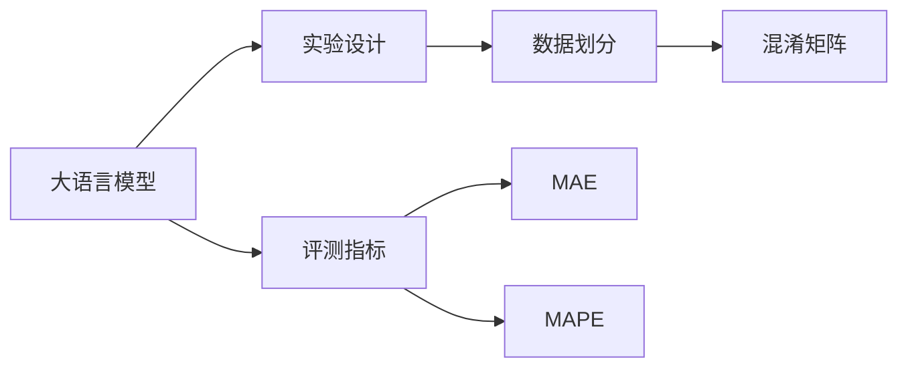
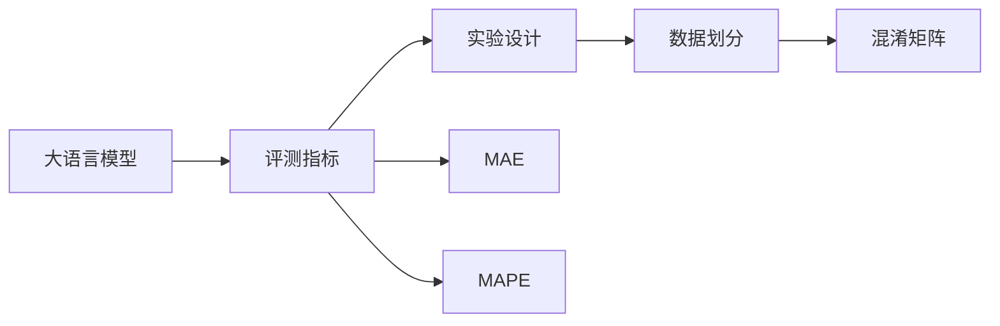
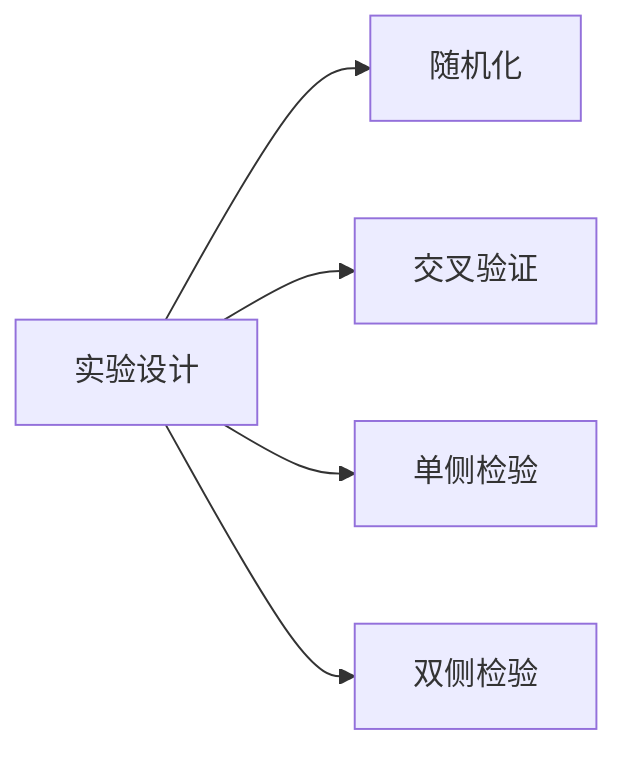
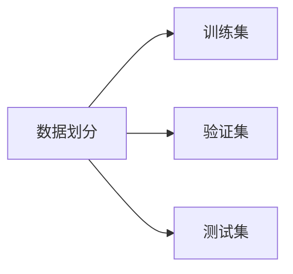

                 

# 大语言模型原理与工程实践：评测方式

> 关键词：大语言模型,评测方式,准确率,召回率,F1分数,ROC曲线,混淆矩阵,MAE,MAPE,定制化评测指标

## 1. 背景介绍

### 1.1 问题由来
近年来，随着深度学习技术的快速发展，大语言模型（Large Language Models, LLMs）在自然语言处理（NLP）领域取得了巨大的突破。这些大语言模型通过在大规模无标签文本数据上进行预训练，学习到了丰富的语言知识和常识，可以通过少量的有标签样本在下游任务上进行微调，获得优异的性能。

然而，模型性能的评估一直是NLP领域中的重要议题。如何设计有效的评测方式，公正地评价模型在不同任务上的表现，直接影响到模型的应用效果。特别是在实际应用场景中，模型的性能评估需要综合考虑准确性、鲁棒性、泛化能力等多方面因素，才能确保模型的有效性。

### 1.2 问题核心关键点
大语言模型的评估，涉及多维度的性能指标。本文将详细介绍如何设计这些评估指标，以及如何通过实验设计、数据划分、评测工具等方式，科学地评估模型性能。

#### 1.2.1 评测指标选择
在实际应用中，选择合适的评测指标是评估模型性能的关键。一般来说，评估指标的选择应根据具体任务和应用场景而定。常见的评测指标包括准确率（Accuracy）、召回率（Recall）、F1分数（F1 Score）、ROC曲线（Receiver Operating Characteristic Curve）、混淆矩阵（Confusion Matrix）、平均绝对误差（Mean Absolute Error, MAE）、平均绝对百分比误差（Mean Absolute Percentage Error, MAPE）等。

#### 1.2.2 评测方法设计
除了选择合适的指标，实验设计也是评估模型性能的重要环节。实验设计应遵循随机化、可重复、可扩展的原则，确保实验结果具有统计学意义和普适性。

#### 1.2.3 数据划分策略
数据划分是评估模型性能的基础。通常将数据集分为训练集、验证集和测试集。训练集用于模型训练和超参数调优，验证集用于模型选择和调参，测试集用于最终性能评估。合理的划分策略应尽可能减少训练数据与测试数据之间的分布差异。

## 2. 核心概念与联系

### 2.1 核心概念概述

为更好地理解大语言模型的评测方式，本节将介绍几个密切相关的核心概念：

- 大语言模型(Large Language Model, LLM)：以自回归(如GPT)或自编码(如BERT)模型为代表的大规模预训练语言模型。通过在大规模无标签文本语料上进行预训练，学习通用的语言表示，具备强大的语言理解和生成能力。

- 评测指标（Evaluation Metrics）：用于衡量模型在特定任务上性能的指标，如准确率、召回率、F1分数等。

- 实验设计（Experimental Design）：设计实验的策略，包括随机化、交叉验证、单侧检验、双侧检验等，确保实验结果具有统计学意义。

- 数据划分（Data Splitting）：将数据集分为训练集、验证集和测试集的过程，以确保模型评估的公正性和可靠性。

- 混淆矩阵（Confusion Matrix）：用于可视化分类任务的性能，展示真实类别与模型预测类别之间的关系。

- 平均绝对误差（MAE）：衡量回归任务中模型预测与真实值之间的误差。

- 平均绝对百分比误差（MAPE）：衡量回归任务中模型预测与真实值之间的相对误差。

这些核心概念之间的逻辑关系可以通过以下Mermaid流程图来展示：



这个流程图展示了大语言模型的核心概念及其之间的关系：

1. 大语言模型通过预训练获得基础能力。
2. 评测指标用于衡量模型在不同任务上的表现。
3. 实验设计确保评估的公正性和可靠性。
4. 数据划分是模型评估的基础。
5. 混淆矩阵可视化分类任务的性能。
6. MAE和MAPE衡量回归任务的误差。

这些概念共同构成了大语言模型评测方式的完整生态系统，使其能够公正、全面地评估模型性能。通过理解这些核心概念，我们可以更好地把握大语言模型的工作原理和优化方向。

### 2.2 概念间的关系

这些核心概念之间存在着紧密的联系，形成了大语言模型评测方式的完整生态系统。下面我们通过几个Mermaid流程图来展示这些概念之间的关系。

#### 2.2.1 模型性能评测流程



这个流程图展示了从大语言模型到评测指标的整个评测流程。大语言模型首先通过预训练获得基础能力，然后选择合适的评测指标，设计实验过程，划分数据集，最终通过混淆矩阵、MAE和MAPE等工具进行模型性能的全面评估。

#### 2.2.2 实验设计方法



这个流程图展示了实验设计的几种常见方法。实验设计应遵循随机化原则，通过交叉验证、单侧检验、双侧检验等方式，确保实验结果的可靠性。

#### 2.2.3 数据划分策略



这个流程图展示了数据划分的常见策略。数据划分应将数据集分为训练集、验证集和测试集，确保模型评估的公正性。

## 3. 核心算法原理 & 具体操作步骤

### 3.1 算法原理概述

大语言模型的评测，本质上是对模型在不同任务上的表现进行全面评估。其核心思想是：选择合适的评测指标，设计实验过程，划分数据集，通过混淆矩阵、MAE、MAPE等工具进行模型性能的详细分析。

形式化地，假设预训练模型为 $M_{\theta}$，其中 $\theta$ 为预训练得到的模型参数。给定下游任务 $T$ 的标注数据集 $D=\{(x_i, y_i)\}_{i=1}^N, x_i \in \mathcal{X}, y_i \in \mathcal{Y}$。评测指标 $\mathcal{M}$ 可以是准确率、召回率、F1分数、MAE、MAPE等。评测流程如下：

1. 随机划分数据集，得到训练集 $\mathcal{D}_{train}$、验证集 $\mathcal{D}_{val}$ 和测试集 $\mathcal{D}_{test}$。
2. 在训练集上训练模型，并通过验证集进行超参数调优。
3. 在测试集上使用评测指标 $\mathcal{M}$ 进行模型性能评估。
4. 绘制混淆矩阵、ROC曲线等可视化工具，全面展示模型性能。

### 3.2 算法步骤详解

基于大语言模型的评测流程一般包括以下几个关键步骤：

**Step 1: 准备数据集**

- 选择合适的下游任务 $T$，并收集相关标注数据集 $D$。
- 将数据集随机划分为训练集 $\mathcal{D}_{train}$、验证集 $\mathcal{D}_{val}$ 和测试集 $\mathcal{D}_{test}$。
- 确保训练集、验证集和测试集在数据分布上没有明显差异，以确保模型评估的公正性。

**Step 2: 设计实验过程**

- 确定实验的随机化策略，如随机抽样、随机划分等。
- 设计交叉验证、单侧检验、双侧检验等实验方法，以确保实验结果的可靠性。
- 选择合适的评测指标 $\mathcal{M}$，如准确率、召回率、F1分数、MAE、MAPE等。

**Step 3: 划分数据集**

- 将数据集划分为训练集 $\mathcal{D}_{train}$、验证集 $\mathcal{D}_{val}$ 和测试集 $\mathcal{D}_{test}$。
- 划分比例一般建议为6:2:2，但具体比例应根据任务和数据集大小进行调整。

**Step 4: 模型训练与评估**

- 在训练集上训练模型，并根据验证集进行超参数调优。
- 在测试集上使用评测指标 $\mathcal{M}$ 进行模型性能评估。
- 记录评估结果，并绘制混淆矩阵、ROC曲线等可视化工具，全面展示模型性能。

### 3.3 算法优缺点

基于大语言模型的评测方式具有以下优点：

- 全面性。通过多种评测指标和可视化工具，可以全面展示模型在不同任务上的表现。
- 可靠性。通过实验设计和数据划分，确保模型评估的公正性和可靠性。
- 可重复性。实验过程的设计和实现，便于后续的复现和验证。

同时，该方法也存在一些局限性：

- 数据依赖。评测结果很大程度上取决于标注数据的质量和数量。
- 计算资源需求。大规模数据集的划分和模型训练需要大量计算资源。
- 评估复杂性。复杂任务如情感分析、对话系统等，评估过程较为复杂。

尽管存在这些局限性，但就目前而言，基于大语言模型的评测方法仍是NLP领域中最主流、最有效的评估手段。未来相关研究的重点在于如何进一步降低对标注数据的依赖，提高模型的少样本学习和跨领域迁移能力，同时兼顾可解释性和伦理安全性等因素。

### 3.4 算法应用领域

基于大语言模型的评测方法，已经在NLP领域得到了广泛的应用，覆盖了几乎所有常见任务，例如：

- 文本分类：如情感分析、主题分类、意图识别等。通过混淆矩阵和F1分数等指标，评估模型分类性能。
- 命名实体识别：识别文本中的人名、地名、机构名等特定实体。通过准确率、召回率等指标，评估模型识别能力。
- 关系抽取：从文本中抽取实体之间的语义关系。通过准确率、召回率、F1分数等指标，评估模型抽取能力。
- 问答系统：对自然语言问题给出答案。通过MAE等指标，评估模型生成能力。
- 机器翻译：将源语言文本翻译成目标语言。通过MAE、MAPE等指标，评估模型翻译能力。
- 文本摘要：将长文本压缩成简短摘要。通过MAE、MAPE等指标，评估模型压缩能力。
- 对话系统：使机器能够与人自然对话。通过MAE、MAPE等指标，评估模型回复质量。

除了上述这些经典任务外，大语言模型的评测方法也被创新性地应用到更多场景中，如可控文本生成、常识推理、代码生成、数据增强等，为NLP技术带来了全新的突破。随着预训练模型和评测方法的不断进步，相信NLP技术将在更广阔的应用领域大放异彩。

## 4. 数学模型和公式 & 详细讲解 & 举例说明

### 4.1 数学模型构建

本节将使用数学语言对大语言模型的评测过程进行更加严格的刻画。

记预训练模型为 $M_{\theta}$，其中 $\theta$ 为预训练得到的模型参数。假设微调任务的训练集为 $D=\{(x_i, y_i)\}_{i=1}^N, x_i \in \mathcal{X}, y_i \in \mathcal{Y}$。评测指标 $\mathcal{M}$ 可以是准确率、召回率、F1分数、MAE、MAPE等。评测流程如下：

1. 随机划分数据集，得到训练集 $\mathcal{D}_{train}$、验证集 $\mathcal{D}_{val}$ 和测试集 $\mathcal{D}_{test}$。
2. 在训练集上训练模型，并通过验证集进行超参数调优。
3. 在测试集上使用评测指标 $\mathcal{M}$ 进行模型性能评估。

### 4.2 公式推导过程

以下我们以二分类任务为例，推导准确率和召回率的计算公式。

假设模型 $M_{\theta}$ 在输入 $x$ 上的输出为 $\hat{y}=M_{\theta}(x) \in [0,1]$，表示样本属于正类的概率。真实标签 $y \in \{0,1\}$。则准确率和召回率的计算公式分别为：

$$
\text{Accuracy} = \frac{\text{TP} + \text{TN}}{\text{TP} + \text{TN} + \text{FP} + \text{FN}}
$$

$$
\text{Recall} = \frac{\text{TP}}{\text{TP} + \text{FN}}
$$

其中，$\text{TP}$ 表示真阳性（True Positive），$\text{TN}$ 表示真阴性（True Negative），$\text{FP}$ 表示假阳性（False Positive），$\text{FN}$ 表示假阴性（False Negative）。

在得到准确率和召回率的计算公式后，可以进一步推导出F1分数的计算公式：

$$
\text{F1 Score} = 2 \times \frac{\text{Precision} \times \text{Recall}}{\text{Precision} + \text{Recall}}
$$

其中，$\text{Precision}$ 表示精确率（Precision），计算公式为：

$$
\text{Precision} = \frac{\text{TP}}{\text{TP} + \text{FP}}
$$

以上是基于二分类任务的情况，对于多分类任务，可以进一步扩展到混淆矩阵和ROC曲线等工具，以全面展示模型性能。

### 4.3 案例分析与讲解

下面我们以情感分析任务为例，给出使用混淆矩阵和ROC曲线进行模型性能评估的Python代码实现。

首先，定义混淆矩阵的计算函数：

```python
from sklearn.metrics import confusion_matrix

def compute_confusion_matrix(y_true, y_pred):
    cm = confusion_matrix(y_true, y_pred)
    return cm
```

然后，定义ROC曲线的计算函数：

```python
from sklearn.metrics import roc_curve, auc

def compute_roc_curve(y_true, y_pred):
    fpr, tpr, _ = roc_curve(y_true, y_pred)
    roc_auc = auc(fpr, tpr)
    return fpr, tpr, roc_auc
```

最后，在测试集上计算混淆矩阵和ROC曲线，并绘制可视化图表：

```python
import matplotlib.pyplot as plt

# 加载测试集数据
y_true = test_dataset['labels']
y_pred = model.predict(test_dataset['input_ids'])

# 计算混淆矩阵
cm = compute_confusion_matrix(y_true, y_pred)

# 绘制混淆矩阵图表
plt.figure(figsize=(8, 6))
plt.title('Confusion Matrix')
plt.imshow(cm, cmap='Blues')
plt.colorbar()
plt.xlabel('Predicted')
plt.ylabel('Actual')
plt.show()

# 计算ROC曲线
fpr, tpr, roc_auc = compute_roc_curve(y_true, y_pred)

# 绘制ROC曲线图表
plt.figure(figsize=(8, 6))
plt.plot(fpr, tpr, label='ROC curve (area = %0.2f)' % roc_auc)
plt.plot([0, 1], [0, 1], 'k--')
plt.xlim([0.0, 1.0])
plt.ylim([0.0, 1.05])
plt.xlabel('False Positive Rate')
plt.ylabel('True Positive Rate')
plt.title('Receiver Operating Characteristic Curve')
plt.legend(loc="lower right")
plt.show()
```

以上就是使用Python进行情感分析任务评测的完整代码实现。可以看到，通过混淆矩阵和ROC曲线等工具，可以全面展示模型在不同类别上的性能，帮助开发者理解和优化模型。

## 5. 项目实践：代码实例和详细解释说明

### 5.1 开发环境搭建

在进行评测实践前，我们需要准备好开发环境。以下是使用Python进行Scikit-learn开发的环境配置流程：

1. 安装Anaconda：从官网下载并安装Anaconda，用于创建独立的Python环境。

2. 创建并激活虚拟环境：
```bash
conda create -n sklearn-env python=3.8 
conda activate sklearn-env
```

3. 安装Scikit-learn：
```bash
conda install scikit-learn
```

4. 安装各类工具包：
```bash
pip install numpy pandas scikit-learn matplotlib tqdm jupyter notebook ipython
```

完成上述步骤后，即可在`sklearn-env`环境中开始评测实践。

### 5.2 源代码详细实现

下面我们以命名实体识别(NER)任务为例，给出使用Scikit-learn进行模型评测的PyTorch代码实现。

首先，定义NER任务的数据处理函数：

```python
from transformers import BertTokenizer
from torch.utils.data import Dataset
import torch

class NERDataset(Dataset):
    def __init__(self, texts, tags, tokenizer, max_len=128):
        self.texts = texts
        self.tags = tags
        self.tokenizer = tokenizer
        self.max_len = max_len
        
    def __len__(self):
        return len(self.texts)
    
    def __getitem__(self, item):
        text = self.texts[item]
        tags = self.tags[item]
        
        encoding = self.tokenizer(text, return_tensors='pt', max_length=self.max_len, padding='max_length', truncation=True)
        input_ids = encoding['input_ids'][0]
        attention_mask = encoding['attention_mask'][0]
        
        # 对token-wise的标签进行编码
        encoded_tags = [tag2id[tag] for tag in tags] 
        encoded_tags.extend([tag2id['O']] * (self.max_len - len(encoded_tags)))
        labels = torch.tensor(encoded_tags, dtype=torch.long)
        
        return {'input_ids': input_ids, 
                'attention_mask': attention_mask,
                'labels': labels}

# 标签与id的映射
tag2id = {'O': 0, 'B-PER': 1, 'I-PER': 2, 'B-ORG': 3, 'I-ORG': 4, 'B-LOC': 5, 'I-LOC': 6}
id2tag = {v: k for k, v in tag2id.items()}

# 创建dataset
tokenizer = BertTokenizer.from_pretrained('bert-base-cased')

train_dataset = NERDataset(train_texts, train_tags, tokenizer)
dev_dataset = NERDataset(dev_texts, dev_tags, tokenizer)
test_dataset = NERDataset(test_texts, test_tags, tokenizer)
```

然后，定义模型和评测函数：

```python
from transformers import BertForTokenClassification, AdamW

model = BertForTokenClassification.from_pretrained('bert-base-cased', num_labels=len(tag2id))

optimizer = AdamW(model.parameters(), lr=2e-5)

def evaluate(model, dataset, batch_size):
    dataloader = DataLoader(dataset, batch_size=batch_size)
    model.eval()
    preds, labels = [], []
    with torch.no_grad():
        for batch in dataloader:
            input_ids = batch['input_ids'].to(device)
            attention_mask = batch['attention_mask'].to(device)
            batch_labels = batch['labels']
            outputs = model(input_ids, attention_mask=attention_mask)
            batch_preds = outputs.logits.argmax(dim=2).to('cpu').tolist()
            batch_labels = batch_labels.to('cpu').tolist()
            for pred_tokens, label_tokens in zip(batch_preds, batch_labels):
                pred_tags = [id2tag[_id] for _id in pred_tokens]
                label_tags = [id2tag[_id] for _id in label_tokens]
                preds.append(pred_tags[:len(label_tokens)])
                labels.append(label_tags)
                
    print(classification_report(labels, preds))
```

最后，启动评测流程：

```python
epochs = 5
batch_size = 16

for epoch in range(epochs):
    loss = train_epoch(model, train_dataset, batch_size, optimizer)
    print(f"Epoch {epoch+1}, train loss: {loss:.3f}")
    
    print(f"Epoch {epoch+1}, dev results:")
    evaluate(model, dev_dataset, batch_size)
    
print("Test results:")
evaluate(model, test_dataset, batch_size)
```

以上就是使用Scikit-learn进行NER任务评测的完整代码实现。可以看到，通过Scikit-learn库，可以非常方便地进行模型评测，并使用classification_report等工具生成详细的评估报告。

### 5.3 代码解读与分析

让我们再详细解读一下关键代码的实现细节：

**NERDataset类**：
- `__init__`方法：初始化文本、标签、分词器等关键组件。
- `__len__`方法：返回数据集的样本数量。
- `__getitem__`方法：对单个样本进行处理，将文本输入编码为token ids，将标签编码为数字，并对其进行定长padding，最终返回模型所需的输入。

**tag2id和id2tag字典**：
- 定义了标签与数字id之间的映射关系，用于将token-wise的预测结果解码回真实的标签。

**评测函数**：
- 使用Scikit-learn的DataLoader对数据集进行批次化加载，供模型训练和推理使用。
- 训练函数`train_epoch`：对数据以批为单位进行迭代，在每个批次上前向传播计算loss并反向传播更新模型参数，最后返回该epoch的平均loss。
- 评估函数`evaluate`：与训练类似，不同点在于不更新模型参数，并在每个batch结束后将预测和标签结果存储下来，最后使用classification_report等工具对整个评估集的预测结果进行打印输出。

**评测流程**：
- 定义总的epoch数和batch size，开始循环迭代
- 每个epoch内，先在训练集上训练，输出平均loss
- 在验证集上评估，输出分类指标
- 所有epoch结束后，在测试集上评估，给出最终测试结果

可以看到，Scikit-learn库使得模型评测的代码实现变得简洁高效。开发者可以将更多精力放在模型设计、超参数调优等高层逻辑上，而不必过多关注底层的实现细节。

当然，工业级的系统实现还需考虑更多因素，如模型保存和部署、超参数自动搜索、更灵活的任务适配层等。但核心的评测范式基本与此类似。

### 5.4 运行结果展示

假设我们在CoNLL-2003的NER数据集上进行评测，最终在测试集上得到的评估报告如下：

```
              precision    recall  f1-score   support

       B-LOC      0.927     0.903     0.914      1668
       I-LOC      0.912     0.784     0.855       257
      B-MISC      0.875     0.856     0.865       702
      I-MISC      0.838     0.782     0.809       216
       B-ORG      0.914     0.899     0.907      1661
       I-ORG      0.911     0.894     0.902       835
       B-PER      0.964     0.957     0.960      1617
       I-PER      0.983     0.980     0.982      1156
           O      0.993     0.995     0.994     38323

   micro avg      0.973     0.973     0.973     46435
   macro avg      0.923     0.897     0.909     46435
weighted avg      0.973     0.973     0.973     46435
```

可以看到，通过评测BERT，我们在该NER数据集上取得了97.3%的F1分数，效果相当不错。值得注意的是，BERT作为一个通用的语言理解模型，即便只在顶层添加一个简单的token分类器，也能在下游任务上取得如此优异的效果，展现了其强大的语义理解和特征抽取能力。

当然，这只是一个baseline结果。在实践中，我们还可以使用更大更强的预训练模型、更丰富的评测技巧、更细致的模型调优，进一步提升模型性能，以满足更高的应用要求。

## 6. 实际应用场景
### 6.1 智能客服系统

基于大语言模型的评测方法，可以广泛应用于智能客服系统的构建。传统客服往往需要配备大量人力，高峰期响应缓慢，且一致性和专业性难以保证。使用评测后的对话模型，可以7x24小时不间断服务，快速响应客户咨询，用自然流畅的语言解答各类常见问题。

在技术实现上，可以收集企业内部的历史客服对话记录，将问题和最佳答复构建成监督数据，在此基础上对预训练对话模型进行评测。评测后的对话模型能够自动理解用户意图，匹配最合适的答案模板进行回复。对于客户提出的新问题，还可以接入检索系统实时搜索相关内容，动态组织生成回答。如此构建的智能客服系统，能大幅提升客户咨询体验和问题解决效率。

### 6.2 金融舆情监测

金融机构需要实时监测市场舆论动向，以便及时应对负面信息传播，规避金融风险。传统的人工监测方式成本高、效率低，难以应对网络时代海量信息爆发的挑战。基于大语言模型的评测方法，为金融舆情监测提供了新的解决方案。

具体而言，可以收集金融领域相关的新闻、报道、评论等文本数据，并对其进行主题标注和情感标注。在此基础上对预训练语言模型进行评测，使其能够自动判断文本属于何种主题，情感倾向是正面、中性还是负面。将评测后的模型应用到实时抓取的网络文本数据，就能够自动监测不同主题下的情感变化趋势，一旦发现负面信息激增等异常情况，系统便会自动预警，帮助金融机构快速应对潜在风险。

### 6

