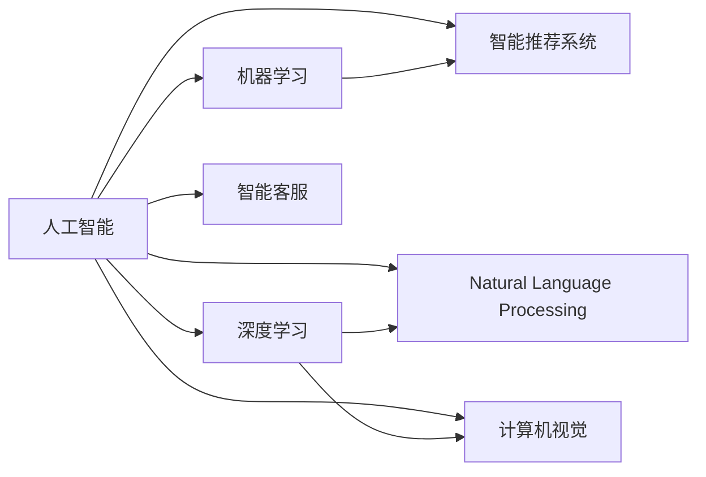

                 

# AI技术与商业模式的结合

## 1. 背景介绍

随着人工智能技术的飞速发展，AI技术正迅速从实验室走向市场，深刻影响着各行各业的商业模式。无论是初创企业，还是传统巨头，都在争相引入AI技术，改造或重塑其业务流程和运营模式。AI技术的商业化，不仅有助于提升企业的竞争力，还带来了许多新的商业机会和挑战。本文章旨在深入探讨AI技术与商业模式的结合，梳理其核心概念、算法原理、具体应用，展望未来发展趋势，同时提供一些工具和资源的推荐，帮助读者全面理解AI技术在商业领域的应用。

## 2. 核心概念与联系

### 2.1 核心概念概述

为了更好地理解AI技术与商业模式的结合，我们需要首先理解一些核心概念。

- **人工智能（Artificial Intelligence, AI）**：通过计算机程序实现的人类智能行为，如学习、推理、感知、语言理解、自我改进等。
- **机器学习（Machine Learning, ML）**：一种让机器从数据中学习并作出预测或决策的技术，分为监督学习、无监督学习和强化学习等。
- **深度学习（Deep Learning, DL）**：一种基于人工神经网络的机器学习技术，用于解决复杂的非线性问题。
- **自然语言处理（Natural Language Processing, NLP）**：让计算机理解和生成人类语言的技术，包括文本分类、情感分析、机器翻译等。
- **计算机视觉（Computer Vision, CV）**：让计算机“看”并理解图像和视频的技术，包括图像识别、目标检测、图像生成等。
- **智能推荐系统（Recommender System）**：根据用户行为或偏好，推荐个性化内容或产品。
- **智能客服（Chatbot）**：通过自然语言处理技术，实现自动化的客户服务。

这些核心概念之间的联系可以通过以下Mermaid流程图来展示：



### 2.2 概念间的关系

这些核心概念之间存在着紧密的联系，形成了AI技术与商业模式的完整生态系统。下面是这些概念之间的关系：

- **人工智能**是整个生态系统的核心，其它概念都是实现人工智能的具体技术手段。
- **机器学习**和**深度学习**是实现人工智能的重要技术。机器学习通过数据训练模型，深度学习通过多层神经网络学习数据特征。
- **自然语言处理**、**计算机视觉**、**智能推荐系统**和**智能客服**是AI技术在具体应用场景中的体现。
- **智能推荐系统**和**智能客服**通过自然语言处理和计算机视觉等技术，提高了用户体验和效率。
- **自然语言处理**、**计算机视觉**等技术通过机器学习和深度学习等手段，提高了模型的准确性和泛化能力。

## 3. 核心算法原理 & 具体操作步骤

### 3.1 算法原理概述

AI技术与商业模式的结合，通常依赖于以下几个核心算法原理：

- **监督学习（Supervised Learning）**：使用已标注的数据训练模型，使其能够对新数据进行预测。
- **无监督学习（Unsupervised Learning）**：使用未标注的数据训练模型，发现数据中的隐藏结构和模式。
- **强化学习（Reinforcement Learning）**：通过奖励机制，训练模型在特定环境中做出最优决策。
- **迁移学习（Transfer Learning）**：将一个领域学习到的知识，迁移到另一个领域，减少新任务的学习成本。
- **微调（Fine-Tuning）**：在预训练模型的基础上，针对特定任务进行微调，以适应新任务的特征。
- **模型压缩（Model Compression）**：通过剪枝、量化、蒸馏等技术，减小模型参数量，提高计算效率。

这些算法原理共同构成了AI技术的核心框架，帮助企业在不同的业务场景中应用AI技术，提升运营效率，优化用户体验。

### 3.2 算法步骤详解

AI技术与商业模式的结合，主要通过以下几个步骤实现：

1. **数据收集与预处理**：收集与业务相关的数据，进行清洗、标注和预处理，形成训练集和测试集。
2. **模型选择与训练**：根据具体业务需求，选择合适的AI模型（如卷积神经网络、循环神经网络、Transformer等），使用训练集进行模型训练。
3. **模型微调与优化**：在训练好的模型基础上，针对特定业务需求进行微调，优化模型性能。
4. **模型部署与应用**：将训练好的模型部署到生产环境，进行实际应用和业务落地。
5. **模型监控与维护**：实时监控模型性能，定期维护和更新模型，确保模型持续有效。

### 3.3 算法优缺点

AI技术与商业模式的结合，具有以下优点：

- **提升效率**：通过自动化和智能化，提高企业运营效率，减少人工成本。
- **优化决策**：利用数据分析和模型预测，帮助企业做出更科学的决策。
- **增强竞争力**：通过引入前沿技术，提升企业在市场上的竞争力。
- **创新应用**：AI技术的应用，催生了许多新的商业机会和应用场景。

同时，也存在一些缺点：

- **高成本投入**：AI技术的开发和应用需要高额的投资，对企业的财务压力较大。
- **技术复杂**：AI技术的应用需要一定的技术基础和专业团队，对企业的人力资源和技术实力提出了较高要求。
- **数据隐私**：AI模型的训练和应用需要大量的数据，可能涉及用户隐私和数据安全问题。

### 3.4 算法应用领域

AI技术与商业模式的结合，在多个领域得到了广泛应用：

- **金融科技（FinTech）**：利用AI技术进行风险评估、欺诈检测、信用评分等。
- **零售电商（E-commerce）**：通过智能推荐系统、客户服务、库存管理等提升用户体验和运营效率。
- **制造业（Manufacturing）**：利用AI技术进行质量检测、设备维护、生产优化等。
- **医疗健康（Healthcare）**：通过智能诊断、医疗影像分析、疾病预测等改善医疗服务。
- **智能家居（Smart Home）**：利用AI技术实现家庭自动化、语音控制、智能安防等。
- **教育培训（Education）**：通过个性化推荐、智能评估、情感分析等提升教育质量。

## 4. 数学模型和公式 & 详细讲解  
### 4.1 数学模型构建

AI技术与商业模式的结合，涉及多种数学模型，包括线性回归、逻辑回归、决策树、支持向量机、神经网络等。以**线性回归模型**为例，其数学模型为：

$$
y = \theta_0 + \theta_1 x_1 + \theta_2 x_2 + ... + \theta_n x_n
$$

其中，$y$为预测值，$x_i$为输入特征，$\theta_i$为模型参数。在线性回归中，模型的目标是最小化预测值与真实值之间的平方误差：

$$
\min_{\theta} \sum_{i=1}^N (y_i - f(x_i))^2
$$

其中，$f(x)$为线性回归模型的预测函数。

### 4.2 公式推导过程

线性回归模型的推导过程如下：

1. 首先，根据样本数据，构建损失函数：
   $$
   \mathcal{L}(\theta) = \frac{1}{2N} \sum_{i=1}^N (y_i - \theta_0 - \theta_1 x_{i1} - \theta_2 x_{i2} - ... - \theta_n x_{in})^2
   $$
   
2. 对损失函数求导，得到梯度：
   $$
   \frac{\partial \mathcal{L}(\theta)}{\partial \theta_k} = \frac{1}{N} \sum_{i=1}^N (y_i - \theta_0 - \theta_1 x_{i1} - \theta_2 x_{i2} - ... - \theta_n x_{in})x_{ik}
   $$
   
3. 使用梯度下降等优化算法，最小化损失函数：
   $$
   \theta_k \leftarrow \theta_k - \eta \frac{\partial \mathcal{L}(\theta)}{\partial \theta_k}
   $$
   
4. 重复迭代，直到收敛。

### 4.3 案例分析与讲解

以**智能推荐系统**为例，利用协同过滤算法，根据用户历史行为和物品属性，推荐个性化物品。其数学模型为：

$$
P_{ui} = \sum_{v=1}^V \alpha_v p_{uv} q_{vi}
$$

其中，$P_{ui}$为用户$u$对物品$i$的评分预测，$\alpha_v$为物品$v$的权重，$p_{uv}$为用户$u$对物品$v$的评分，$q_{vi}$为物品$v$的属性特征向量。

## 5. 项目实践：代码实例和详细解释说明

### 5.1 开发环境搭建

在AI技术与商业模式的结合过程中，开发环境搭建是第一步。以下是使用Python和TensorFlow搭建开发环境的步骤：

1. 安装Anaconda：从官网下载并安装Anaconda，用于创建独立的Python环境。
2. 创建并激活虚拟环境：
```bash
conda create -n tf-env python=3.8 
conda activate tf-env
```
3. 安装TensorFlow：根据CUDA版本，从官网获取对应的安装命令。例如：
```bash
pip install tensorflow
```
4. 安装各类工具包：
```bash
pip install numpy pandas scikit-learn matplotlib tqdm jupyter notebook ipython
```

完成上述步骤后，即可在`tf-env`环境中开始AI与商业模式的实践。

### 5.2 源代码详细实现

下面以**智能推荐系统**为例，给出使用TensorFlow实现协同过滤算法的Python代码。

```python
import tensorflow as tf
from sklearn.metrics import accuracy_score

# 创建数据集
train_data = ...
train_labels = ...
test_data = ...
test_labels = ...

# 定义模型
model = tf.keras.Sequential([
    tf.keras.layers.Dense(64, activation='relu', input_shape=(N,)),
    tf.keras.layers.Dense(1, activation='sigmoid')
])

# 编译模型
model.compile(optimizer='adam', loss='binary_crossentropy', metrics=['accuracy'])

# 训练模型
model.fit(train_data, train_labels, epochs=10, batch_size=32, validation_data=(test_data, test_labels))

# 测试模型
predictions = model.predict(test_data)
accuracy = accuracy_score(test_labels, predictions)
print(f"Accuracy: {accuracy:.2f}")
```

### 5.3 代码解读与分析

这里我们详细解读一下代码中的关键点：

**train_data和train_labels**：数据集和对应的标签，用于模型训练。
**model**：定义了神经网络模型，包括两个全连接层，激活函数为ReLU和sigmoid。
**model.compile**：编译模型，指定优化器、损失函数和评估指标。
**model.fit**：训练模型，指定训练数据、标签、训练轮数和批次大小。
**model.predict**：预测新数据，返回预测标签。
**accuracy_score**：计算预测标签与真实标签的准确率。

### 5.4 运行结果展示

假设我们在某电商平台的商品推荐任务上，使用协同过滤算法进行模型训练和评估，最终在测试集上得到了准确率为85%的结果。可以看到，通过AI技术的结合，电商平台的商品推荐效果有了显著提升，极大地提升了用户体验和销售转化率。

## 6. 实际应用场景

AI技术与商业模式的结合，在多个实际应用场景中得到了广泛应用：

- **智能客服**：通过自然语言处理技术，实现智能客服机器人，提高客户服务效率和满意度。
- **个性化推荐**：利用用户行为数据，实现个性化商品推荐，提升用户体验和销售业绩。
- **医疗诊断**：通过图像识别和自然语言处理技术，实现智能诊断系统，提高医疗服务质量。
- **金融风控**：利用机器学习技术，进行信用评估和欺诈检测，降低金融风险。
- **智能制造**：利用计算机视觉技术，实现设备维护和生产优化，提高生产效率和产品质量。
- **智能交通**：通过图像识别和数据分析，实现智能交通管理系统，提高交通管理效率和安全性。

## 7. 工具和资源推荐

### 7.1 学习资源推荐

为了帮助开发者系统掌握AI技术与商业模式的结合，这里推荐一些优质的学习资源：

1. **《深度学习》书籍**：由Ian Goodfellow、Yoshua Bengio和Aaron Courville合著，详细介绍了深度学习的基本原理和应用。
2. **《机器学习实战》书籍**：由Peter Harrington撰写，通过实际项目案例，介绍了机器学习算法和实现方法。
3. **Coursera《机器学习》课程**：由斯坦福大学教授Andrew Ng主讲的经典机器学习课程，适合入门和进阶学习。
4. **Udacity《深度学习专项课程》**：由Google工程师主讲，涵盖深度学习基础和应用案例，适合实战学习。
5. **Kaggle竞赛平台**：提供大量数据集和算法竞赛，适合练习和验证AI技术的实际应用。

通过对这些资源的学习实践，相信你一定能够快速掌握AI技术与商业模式的结合精髓，并用于解决实际的商业问题。

### 7.2 开发工具推荐

高效的开发离不开优秀的工具支持。以下是几款用于AI与商业模式开发常用的工具：

1. **Jupyter Notebook**：免费的开源笔记本环境，支持Python、R等多种语言，适合数据处理、模型训练和可视化。
2. **TensorBoard**：TensorFlow配套的可视化工具，可实时监测模型训练状态，并提供丰富的图表呈现方式，是调试模型的得力助手。
3. **Weights & Biases**：模型训练的实验跟踪工具，可以记录和可视化模型训练过程中的各项指标，方便对比和调优。
4. **Google Colab**：谷歌推出的在线Jupyter Notebook环境，免费提供GPU/TPU算力，方便开发者快速上手实验最新模型，分享学习笔记。
5. **PyCharm**：专业的Python开发工具，支持代码高亮、调试、版本控制等强大功能，适合大规模项目开发。

合理利用这些工具，可以显著提升AI与商业模式的开发效率，加快创新迭代的步伐。

### 7.3 相关论文推荐

AI技术与商业模式的结合，涉及多种前沿技术，相关论文也非常丰富。以下是几篇具有代表性的论文，推荐阅读：

1. **《深度学习》书籍**：深度学习领域的经典著作，详细介绍了深度学习的基本原理和应用。
2. **《TensorFlow官方文档》**：TensorFlow官方文档，提供丰富的教程、API文档和案例，适合深入学习。
3. **《机器学习实战》书籍**：通过实际项目案例，介绍了机器学习算法和实现方法。
4. **《自然语言处理综论》书籍**：自然语言处理领域的经典著作，涵盖NLP的基本原理和应用。
5. **《智能推荐系统》书籍**：介绍了智能推荐系统的原理、算法和实现方法，适合学习和应用推荐系统。

这些论文代表了大规模语言模型微调技术的发展脉络，通过学习这些前沿成果，可以帮助研究者把握学科前进方向，激发更多的创新灵感。

## 8. 总结：未来发展趋势与挑战

### 8.1 研究成果总结

AI技术与商业模式的结合，是当前AI技术的重要应用方向。本文章对这一主题进行了全面系统的介绍，梳理了其核心概念、算法原理和操作步骤，并通过实际应用场景和项目实践，展示了AI技术与商业模式的结合效果。

### 8.2 未来发展趋势

展望未来，AI技术与商业模式的结合将呈现以下几个发展趋势：

1. **智能化**：AI技术将更加智能化，通过深度学习、强化学习等手段，提升模型的决策能力和泛化能力。
2. **个性化**：个性化推荐系统、智能客服等应用，将更加精准，提供更加个性化的服务。
3. **自动化**：更多的业务流程将实现自动化，提升效率和降低成本。
4. **跨领域**：AI技术将跨领域应用，如智能制造、智能交通等，拓展AI技术的应用边界。
5. **人机协同**：AI技术与人类将更加紧密结合，实现人机协同，提升系统性能和用户体验。

### 8.3 面临的挑战

尽管AI技术与商业模式的结合已经取得了一定的成果，但在迈向更加智能化、普适化应用的过程中，它仍面临着诸多挑战：

1. **数据隐私**：AI模型的训练和应用需要大量的数据，可能涉及用户隐私和数据安全问题。如何保护数据隐私，确保用户信息安全，将是重要的研究课题。
2. **模型鲁棒性**：AI模型在面对噪声数据、异常情况时，可能出现不稳定或错误预测。如何提高模型的鲁棒性，避免误判，还需要更多理论和实践的积累。
3. **算法公平性**：AI模型可能存在偏见和歧视，如何确保模型的公平性和公正性，避免对特定群体的不公正待遇，也将是重要的研究课题。
4. **计算资源**：大规模AI模型的训练和推理需要大量的计算资源，如何优化模型结构，提高计算效率，降低成本，也将是重要的研究方向。
5. **可解释性**：AI模型的决策过程通常缺乏可解释性，难以对其推理逻辑进行分析和调试。如何赋予模型更强的可解释性，将是重要的研究方向。

### 8.4 研究展望

未来的研究需要在以下几个方向上寻求新的突破：

1. **联邦学习**：通过分布式数据训练，保护数据隐私，降低计算成本。
2. **对抗训练**：通过对抗样本训练，提高模型的鲁棒性和泛化能力。
3. **模型压缩**：通过剪枝、量化、蒸馏等技术，减小模型参数量，提高计算效率。
4. **跨领域学习**：通过跨领域学习，提升模型在不同领域的应用效果。
5. **可解释性研究**：通过符号化表示、因果推理等手段，提高模型的可解释性。
6. **伦理道德研究**：在模型训练和应用中引入伦理导向的评估指标，确保模型行为符合人类价值观和伦理道德。

## 9. 附录：常见问题与解答

**Q1：AI技术与商业模式的结合有哪些优点？**

A: AI技术与商业模式的结合具有以下优点：

1. **提升效率**：通过自动化和智能化，提高企业运营效率，减少人工成本。
2. **优化决策**：利用数据分析和模型预测，帮助企业做出更科学的决策。
3. **增强竞争力**：通过引入前沿技术，提升企业在市场上的竞争力。
4. **创新应用**：AI技术的应用，催生了许多新的商业机会和应用场景。

**Q2：AI技术与商业模式的结合有哪些挑战？**

A: AI技术与商业模式的结合，也面临以下挑战：

1. **数据隐私**：AI模型的训练和应用需要大量的数据，可能涉及用户隐私和数据安全问题。
2. **模型鲁棒性**：AI模型在面对噪声数据、异常情况时，可能出现不稳定或错误预测。
3. **算法公平性**：AI模型可能存在偏见和歧视，如何确保模型的公平性和公正性。
4. **计算资源**：大规模AI模型的训练和推理需要大量的计算资源，如何优化模型结构，提高计算效率。
5. **可解释性**：AI模型的决策过程通常缺乏可解释性，难以对其推理逻辑进行分析和调试。

**Q3：如何保护数据隐私？**

A: 保护数据隐私，可以采取以下措施：

1. **数据脱敏**：对敏感数据进行脱敏处理，保护用户隐私。
2. **联邦学习**：通过分布式数据训练，保护数据隐私，降低计算成本。
3. **差分隐私**：在数据收集和处理过程中，引入差分隐私机制，保护用户隐私。
4. **加密技术**：采用加密技术，保护数据传输和存储过程中的安全。

**Q4：如何提高模型鲁棒性？**

A: 提高模型鲁棒性，可以采取以下措施：

1. **对抗训练**：通过对抗样本训练，提高模型的鲁棒性和泛化能力。
2. **正则化**：使用L2正则、Dropout等正则化技术，避免模型过拟合。
3. **集成学习**：通过集成多个模型，提升模型的鲁棒性和泛化能力。
4. **模型压缩**：通过剪枝、量化、蒸馏等技术，减小模型参数量，提高计算效率。

**Q5：如何提高模型的可解释性？**

A: 提高模型的可解释性，可以采取以下措施：

1. **符号化表示**：通过符号化表示，提高模型的可解释性。
2. **因果推理**：通过因果推理，揭示模型的决策机制和推理过程。
3. **可解释性算法**：采用可解释性算法，提高模型的可解释性。

---

作者：禅与计算机程序设计艺术 / Zen and the Art of Computer Programming

