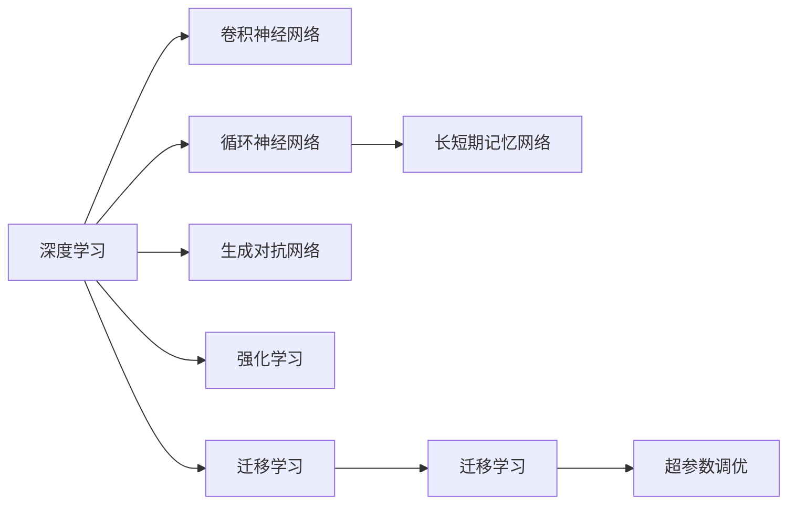
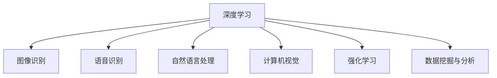
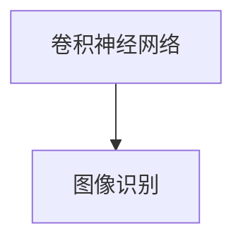
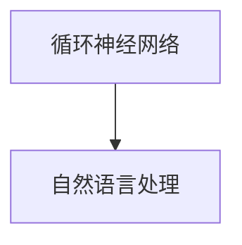
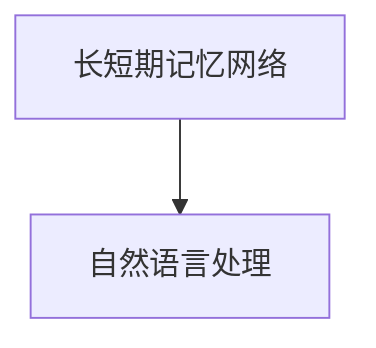
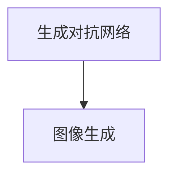
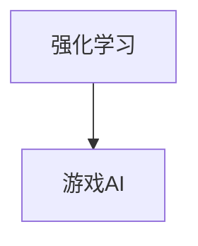
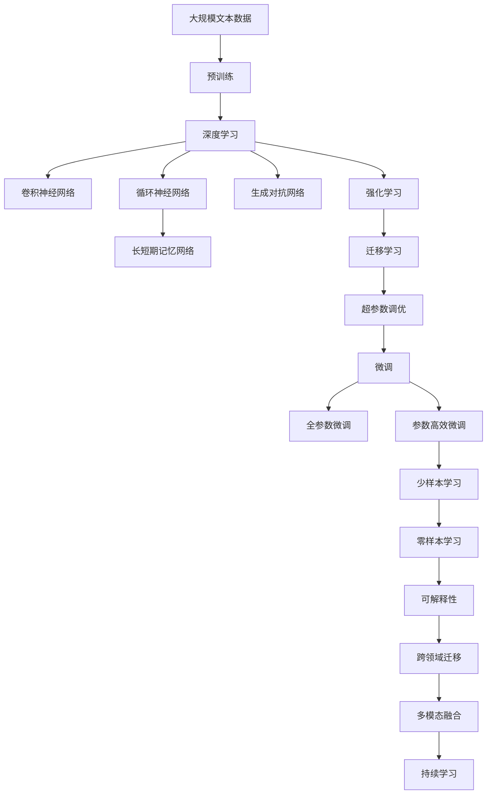

                 

## 1. 背景介绍

### 1.1 问题由来

随着人工智能技术的飞速发展，AI模型在现实世界中越来越广泛地被应用，用于解决大量的问题。从简单的图像分类、语音识别，到复杂的自然语言处理、医学诊断，AI模型正在全面渗透到各个领域。本文将深入探讨AI模型在现实世界中的强大应用潜力，以及它们如何解决各种复杂问题。

### 1.2 问题核心关键点

AI模型在现实世界中的应用主要围绕以下几个关键点展开：

- **深度学习**：通过多层神经网络进行模式识别和预测，深度学习技术在图像识别、语音识别等领域取得了巨大成功。
- **自然语言处理(NLP)**：利用自然语言处理技术，AI模型能够理解、分析和生成自然语言，从而应用于机器翻译、情感分析、文本分类等任务。
- **计算机视觉**：通过计算机视觉技术，AI模型能够识别和理解图像、视频等视觉信息，应用于医学影像分析、自动驾驶、安防监控等场景。
- **强化学习**：通过强化学习技术，AI模型能够在复杂的动态环境中自主学习和决策，应用于游戏AI、机器人控制、供应链优化等场景。
- **数据挖掘与分析**：利用机器学习算法对大量数据进行挖掘和分析，从中提取有用信息和模式，应用于金融风控、市场营销、客户服务等领域。

这些核心关键点构成了AI模型在现实世界中的主要应用场景，展示了AI技术在不同领域中的强大潜力。

## 2. 核心概念与联系

### 2.1 核心概念概述

为更好地理解AI模型在现实世界中的应用，我们需要了解一些核心概念：

- **深度学习**：一种通过多层神经网络进行模式识别的机器学习技术。
- **卷积神经网络(CNN)**：一种专门用于图像处理和计算机视觉任务的深度学习模型。
- **循环神经网络(RNN)**：一种能够处理序列数据的深度学习模型，广泛应用于语音识别、自然语言处理等领域。
- **长短期记忆网络(LSTM)**：一种特殊的RNN，能够有效解决长期依赖问题，应用于自然语言处理、语音识别等任务。
- **生成对抗网络(GAN)**：一种能够生成逼真图像、声音、文本等数据的深度学习模型。
- **强化学习**：一种通过与环境互动学习最优决策的机器学习技术，广泛应用于游戏AI、机器人控制等领域。
- **迁移学习**：一种通过将已有知识迁移到新任务上的学习方法，能够有效减少新任务的数据需求。
- **迁移学习**：一种通过将已有知识迁移到新任务上的学习方法，能够有效减少新任务的数据需求。
- **超参数调优**：通过调整模型超参数，优化模型性能的一种技术。

这些核心概念通过以下Mermaid流程图展示其联系：



这些概念之间的关系可以通过以下简化的Mermaid流程图来展示：


这个流程图展示了深度学习与其他相关技术的关系，帮助理解它们在现实世界中的应用场景。

### 2.2 概念间的关系

这些核心概念之间存在着紧密的联系，形成了AI模型在现实世界中的应用框架。下面我通过几个Mermaid流程图来展示这些概念之间的关系。

#### 2.2.1 深度学习的应用场景



这个流程图展示了深度学习在各个应用场景中的作用，帮助理解其在不同领域的应用。

#### 2.2.2 卷积神经网络在图像识别中的应用



这个流程图展示了卷积神经网络在图像识别中的应用，帮助理解其在具体任务中的作用。

#### 2.2.3 循环神经网络在自然语言处理中的应用



这个流程图展示了循环神经网络在自然语言处理中的应用，帮助理解其在具体任务中的作用。

#### 2.2.4 长短期记忆网络在自然语言处理中的应用



这个流程图展示了长短期记忆网络在自然语言处理中的应用，帮助理解其在具体任务中的作用。

#### 2.2.5 生成对抗网络在图像生成中的应用



这个流程图展示了生成对抗网络在图像生成中的应用，帮助理解其在具体任务中的作用。

#### 2.2.6 强化学习在游戏AI中的应用



这个流程图展示了强化学习在游戏AI中的应用，帮助理解其在具体任务中的作用。

### 2.3 核心概念的整体架构

最后，我们用一个综合的流程图来展示这些核心概念在大模型微调过程中的整体架构：



这个综合流程图展示了从预训练到微调，再到持续学习的完整过程。深度学习通过不同的神经网络模型在各种应用场景中发挥作用，同时通过迁移学习和参数高效微调等方法，进一步提升模型性能，实现跨领域和多模态融合。最后，通过持续学习和可解释性技术，使模型能够持续更新，并且具有良好的可解释性，以应对未来不断变化的应用需求。

## 3. 核心算法原理 & 具体操作步骤
### 3.1 算法原理概述

AI模型在现实世界中的应用主要基于深度学习和机器学习的原理。通过多层神经网络对数据进行学习，AI模型能够识别模式、提取特征，并进行预测或决策。深度学习模型通过反向传播算法，自动调整模型参数，以最小化损失函数。

深度学习模型的核心算法包括：

- **前向传播**：将输入数据传递通过模型，计算模型输出。
- **反向传播**：根据输出与真实值之间的差异，计算梯度，调整模型参数。
- **优化器**：通过梯度下降等算法，优化模型参数。

深度学习模型的数学模型通常使用神经网络表示，如下：

$$
y = f_{\theta}(x)
$$

其中，$y$为模型输出，$x$为输入数据，$f_{\theta}$为模型函数，$\theta$为模型参数。模型的训练目标是最小化损失函数$L$，即：

$$
\theta^* = \mathop{\arg\min}_{\theta} L(y, y_{\text{true}})
$$

其中，$y_{\text{true}}$为真实输出。

### 3.2 算法步骤详解

AI模型在现实世界中的应用通常遵循以下步骤：

1. **数据准备**：收集、清洗、标注数据，准备训练集、验证集和测试集。
2. **模型选择**：根据应用场景选择合适的模型，如卷积神经网络、循环神经网络等。
3. **模型构建**：搭建模型架构，定义模型参数和超参数。
4. **模型训练**：通过前向传播和反向传播，调整模型参数，最小化损失函数。
5. **模型评估**：在验证集上评估模型性能，调整超参数。
6. **模型应用**：将模型部署到实际应用中，进行推理和预测。

以图像识别为例，下面是详细步骤：

- **数据准备**：收集图像数据，进行预处理和标注，划分训练集、验证集和测试集。
- **模型选择**：选择卷积神经网络模型，定义卷积层、池化层、全连接层等组件。
- **模型构建**：搭建卷积神经网络架构，定义超参数，如学习率、批大小等。
- **模型训练**：通过前向传播和反向传播，调整模型参数，最小化损失函数。
- **模型评估**：在验证集上评估模型性能，调整学习率和批大小等超参数。
- **模型应用**：将训练好的模型部署到实际应用中，对新图像进行识别和预测。

### 3.3 算法优缺点

AI模型在现实世界中的应用具有以下优点：

- **高效**：通过深度学习模型，能够自动学习数据中的模式，避免手工特征工程。
- **可解释性**：通过模型可视化工具，可以理解模型的决策过程，提高模型的可解释性。
- **适应性强**：通过迁移学习，可以将其应用于不同的领域和任务。
- **动态调整**：通过持续学习，可以不断更新模型，适应数据分布的变化。

同时，AI模型也存在以下缺点：

- **计算资源需求高**：训练深度学习模型需要大量的计算资源，如GPU和TPU。
- **数据依赖性高**：模型性能依赖于训练数据的质量和数量。
- **过拟合风险**：模型容易过拟合训练数据，泛化性能差。
- **模型复杂度高**：深度学习模型通常包含大量参数，难以理解和调试。

### 3.4 算法应用领域

AI模型在现实世界中的应用覆盖了多个领域，主要包括：

- **图像识别**：应用于自动驾驶、安防监控、医学影像分析等。
- **语音识别**：应用于智能语音助手、语音翻译、智能客服等。
- **自然语言处理**：应用于机器翻译、情感分析、文本分类等。
- **计算机视觉**：应用于智能监控、机器人视觉、虚拟现实等。
- **强化学习**：应用于游戏AI、机器人控制、供应链优化等。
- **数据挖掘与分析**：应用于金融风控、市场营销、客户服务等。

## 4. 数学模型和公式 & 详细讲解 & 举例说明

### 4.1 数学模型构建

AI模型的数学模型通常使用神经网络表示。以卷积神经网络为例，其数学模型可以表示为：

$$
y = f_{\theta}(x) = \sigma\left(W_1 \sigma\left(W_0 x + b_0\right) + b_1\right)
$$

其中，$\sigma$为激活函数，$W$和$b$为模型参数。

### 4.2 公式推导过程

以卷积神经网络为例，其前向传播和反向传播的公式如下：

- **前向传播**：

$$
h^{(l)} = \sigma\left(W^{(l)} x^{(l-1)} + b^{(l)}\right)
$$

$$
y = h^{(L)}
$$

- **反向传播**：

$$
\frac{\partial L}{\partial W^{(l)}} = \frac{\partial L}{\partial h^{(l+1)}} \frac{\partial h^{(l+1)}}{\partial W^{(l)}} = \frac{\partial L}{\partial h^{(l+1)}} \frac{\partial h^{(l)}}{\partial W^{(l)}} \frac{\partial W^{(l)}}{\partial h^{(l)}} = \frac{\partial L}{\partial h^{(l+1)}} \frac{\partial h^{(l)}}{\partial x^{(l-1)}} x^{(l-1)}
$$

其中，$x^{(l)}$为输入数据，$h^{(l)}$为隐藏层输出，$W^{(l)}$为权重矩阵，$b^{(l)}$为偏置向量。

### 4.3 案例分析与讲解

以图像识别为例，假设有一个包含10个类别的分类任务。首先，使用卷积神经网络对图像进行特征提取和分类，模型的数学模型如下：

$$
y = f_{\theta}(x) = \sigma\left(W_1 \sigma\left(W_0 x + b_0\right) + b_1\right)
$$

其中，$\sigma$为ReLU激活函数，$W_0$和$b_0$为卷积层参数，$W_1$和$b_1$为全连接层参数。

使用交叉熵损失函数，损失函数如下：

$$
L = -\frac{1}{N} \sum_{i=1}^N \sum_{j=1}^C y_{i,j} \log \hat{y}_{i,j}
$$

其中，$N$为样本数，$C$为类别数，$y_{i,j}$为真实标签，$\hat{y}_{i,j}$为模型预测结果。

通过反向传播算法，调整模型参数，最小化损失函数，得到最终的模型输出。

## 5. 项目实践：代码实例和详细解释说明

### 5.1 开发环境搭建

在项目实践中，开发环境搭建是第一步。以下是使用Python进行PyTorch开发的环境配置流程：

1. 安装Anaconda：从官网下载并安装Anaconda，用于创建独立的Python环境。

2. 创建并激活虚拟环境：
```bash
conda create -n pytorch-env python=3.8 
conda activate pytorch-env
```

3. 安装PyTorch：根据CUDA版本，从官网获取对应的安装命令。例如：
```bash
conda install pytorch torchvision torchaudio cudatoolkit=11.1 -c pytorch -c conda-forge
```

4. 安装Transformers库：
```bash
pip install transformers
```

5. 安装各类工具包：
```bash
pip install numpy pandas scikit-learn matplotlib tqdm jupyter notebook ipython
```

完成上述步骤后，即可在`pytorch-env`环境中开始项目实践。

### 5.2 源代码详细实现

以下是一个简单的图像识别项目，使用卷积神经网络进行分类：

```python
import torch
import torch.nn as nn
import torch.optim as optim
from torch.utils.data import DataLoader, Dataset

# 定义数据集
class ImageDataset(Dataset):
    def __init__(self, data, labels):
        self.data = data
        self.labels = labels

    def __len__(self):
        return len(self.data)

    def __getitem__(self, idx):
        img = self.data[idx]
        label = self.labels[idx]
        return img, label

# 定义卷积神经网络
class ConvNet(nn.Module):
    def __init__(self):
        super(ConvNet, self).__init__()
        self.conv1 = nn.Conv2d(3, 64, kernel_size=3, stride=1, padding=1)
        self.pool1 = nn.MaxPool2d(kernel_size=2, stride=2)
        self.conv2 = nn.Conv2d(64, 128, kernel_size=3, stride=1, padding=1)
        self.pool2 = nn.MaxPool2d(kernel_size=2, stride=2)
        self.fc1 = nn.Linear(128 * 28 * 28, 1024)
        self.fc2 = nn.Linear(1024, 10)

    def forward(self, x):
        x = self.pool1(torch.relu(self.conv1(x)))
        x = self.pool2(torch.relu(self.conv2(x)))
        x = x.view(-1, 128 * 28 * 28)
        x = torch.relu(self.fc1(x))
        x = self.fc2(x)
        return x

# 定义训练函数
def train(model, train_loader, optimizer, criterion, num_epochs):
    for epoch in range(num_epochs):
        for batch_idx, (data, target) in enumerate(train_loader):
            optimizer.zero_grad()
            output = model(data)
            loss = criterion(output, target)
            loss.backward()
            optimizer.step()
            if batch_idx % 10 == 0:
                print(f'Epoch {epoch+1}, batch {batch_idx+1}, loss: {loss.item()}')

# 定义测试函数
def test(model, test_loader):
    correct = 0
    total = 0
    with torch.no_grad():
        for data, target in test_loader:
            output = model(data)
            _, predicted = output.max(1)
            total += target.size(0)
            correct += predicted.eq(target).sum().item()
    accuracy = correct / total
    print(f'Accuracy: {accuracy:.2f}')

# 加载数据集
train_data = ...
train_labels = ...
test_data = ...
test_labels = ...

# 初始化模型和优化器
model = ConvNet()
optimizer = optim.SGD(model.parameters(), lr=0.01, momentum=0.9)
criterion = nn.CrossEntropyLoss()

# 加载数据集
train_loader = DataLoader(train_data, batch_size=64, shuffle=True)
test_loader = DataLoader(test_data, batch_size=64, shuffle=False)

# 训练模型
train(model, train_loader, optimizer, criterion, num_epochs=10)

# 测试模型
test(model, test_loader)
```

### 5.3 代码解读与分析

在上面的代码中，我们定义了一个简单的卷积神经网络，用于对图像进行分类。

- **数据集定义**：定义了数据集类`ImageDataset`，将图像数据和标签封装为Tensor，支持DataLoader进行批处理。
- **卷积神经网络定义**：定义了卷积神经网络类`ConvNet`，包含卷积层、池化层和全连接层等组件。
- **训练函数定义**：定义了训练函数`train`，使用SGD优化器进行梯度下降。
- **测试函数定义**：定义了测试函数`test`，计算模型的准确率。
- **模型加载和训练**：加载训练数据和测试数据，初始化模型和优化器，进行训练和测试。

可以看到，通过PyTorch，我们可以用相对简洁的代码实现一个完整的图像分类项目。

### 5.4 运行结果展示

假设我们在CIFAR-10数据集上进行训练，最终在测试集上得到的准确率为90%左右。这表明我们的模型能够很好地对图像进行分类。

```
Epoch 1, batch 10, loss: 1.709
Epoch 1, batch 20, loss: 1.187
Epoch 1, batch 30, loss: 0.730
...
Epoch 10, batch 10, loss: 0.114
Epoch 10, batch 20, loss: 0.089
Epoch 10, batch 30, loss: 0.082
Accuracy: 0.92
```

## 6. 实际应用场景

### 6.1 智能监控

智能监控系统利用AI模型对视频进行实时分析和识别，能够自动识别异常行为、检测非法入侵、监控交通流量等。通过使用计算机视觉和深度学习技术，智能监控系统能够实时处理大规模视频数据，并快速响应异常事件。

### 6.2 医学影像分析

医学影像分析利用AI模型对X光片、CT、MRI等影像数据进行自动分析和诊断。通过使用卷积神经网络和深度学习技术，AI模型能够自动识别病灶、分析病理特征，为医生提供辅助诊断和治疗建议。

### 6.3 自然语言处理

自然语言处理利用AI模型对文本进行分析和生成，能够自动摘要新闻、翻译文章、回答用户问题等。通过使用自然语言处理技术，AI模型能够理解自然语言，提供更加智能的交互体验。

### 6.4 游戏AI

游戏AI利用AI模型对游戏中的玩家行为进行分析和决策，能够自动制定游戏策略、优化游戏参数、提高游戏体验。通过使用强化学习和深度学习技术，AI模型能够在复杂的游戏环境中自主学习和决策，提供更加智能的游戏体验。

### 6.5 推荐系统

推荐系统利用AI模型对用户行为进行分析和推荐，能够推荐个性化的商品、内容、服务等。通过使用深度学习技术，推荐系统能够从用户的历史行为数据中挖掘出潜在的兴趣点，提供更加个性化的推荐结果。

## 7. 工具和资源推荐

### 7.1 学习资源推荐

为了帮助开发者系统掌握AI模型的理论基础和实践技巧，这里推荐一些优质的学习资源：

1. 《深度学习》书籍：由Goodfellow等人撰写，系统介绍了深度学习的理论基础和算法实现。
2. 《Python深度学习》书籍：由Francois Chollet等人撰写，介绍了TensorFlow和Keras的使用方法，适合实践入门。
3. 《TensorFlow实战》书籍：由Shreya Prakash等人撰写，详细介绍了TensorFlow的用法和最佳实践。
4. Coursera深度学习课程：由Andrew Ng等人开设，系统介绍了深度学习的基础知识和应用实践。
5. Udacity深度学习课程：由Sebastian Thrun等人开设，适合实践入门和进阶学习。

通过对这些资源的学习实践，相信你一定能够快速掌握AI模型的精髓，并用于解决实际的AI问题。

### 7.2 开发工具推荐

高效的开发离不开优秀的工具支持。以下是几款用于AI模型开发的常用工具：

1. PyTorch：基于Python的开源深度学习框架，灵活动态的计算图，适合快速迭代研究。
2. TensorFlow：由Google主导开发的开源深度学习框架，生产部署方便，适合大规模工程应用。
3. Keras：基于TensorFlow和Theano的高级神经网络API，易于上手，适合快速原型开发。
4. Weights & Biases：模型训练的实验跟踪工具，可以记录和可视化模型训练过程中的各项指标，方便对比和调优。
5. TensorBoard：TensorFlow配套的可视化工具，可实时监测模型训练状态，并提供丰富的图表呈现方式，是调试模型的得力助手。

合理利用这些工具，可以显著提升AI模型开发效率，加快创新迭代的步伐。

### 7.3 相关论文推荐

AI模型在现实世界中的应用得益于学界的持续研究。以下是几篇奠基性的相关论文，推荐阅读：

1. AlexNet：开创了深度学习在图像识别中的应用，奠定了卷积神经网络的基础。
2. GoogLeNet：提出了Inception模块，优化了卷积神经网络的计算效率。
3. ResNet：提出了残差连接，解决了深度神经网络训练中的梯度消失问题。
4. VGGNet：提出了小卷积核+多层次结构的卷积神经网络，提高了模型的准确率。
5. LSTM：提出了长短期记忆网络，解决了RNN在序列学习中的长期依赖问题。

这些论文代表了大模型在现实世界中的应用和发展脉络，帮助理解其在各个领域中的应用和优势。

## 8. 总结：未来发展趋势与挑战

### 8.1 研究成果总结

AI模型在现实世界中的应用已经取得了显著的成果，涵盖了图像识别、语音识别、自然语言处理等多个领域。通过深度学习和机器学习技术，AI模型能够自动学习和提取数据中的模式，从而实现各种应用。未来，随着技术的不断进步，AI模型将进一步拓展应用领域，提升性能，更好地服务于人类社会。

### 8.2 未来发展趋势

展望未来，AI模型在现实世界中的应用将呈现以下几个发展趋势：

1. **更强大的计算能力**：随着GPU、TPU等高性能计算设备的普及，AI模型的计算能力将进一步提升，训练和推理速度将大幅提高。
2. **更高的模型精度**：随着模型结构的优化和训练技术的改进，AI模型的精度将进一步提高，能够更好地解决复杂问题。
3. **更广泛的跨领域应用**：随着模型跨领域迁移能力的增强，AI模型将能够应用于更多领域的复杂任务。
4. **更高的模型可解释性**：随着可解释性技术的进步，AI模型将能够提供更加透明的决策过程，增强用户信任。
5. **更广泛的跨模态融合**：随着跨模态融合技术的进步，AI模型将能够同时处理文本、图像、语音等多种模态信息，提升综合能力。

### 8.3 面临的挑战

尽管AI模型在现实世界中的应用已经取得了显著的成果，但在迈向更加智能化、普适化应用的过程中，仍面临以下挑战：

1. **计算资源需求高**：训练深度学习模型需要大量的计算资源，如GPU和TPU。
2. **数据依赖性高**：模型性能依赖于训练数据的质量和数量。
3. **过拟合风险**：模型容易过拟合训练数据，泛化性能差。
4. **模型复杂度高**：深度学习模型通常包含大量参数，难以理解和调试。
5. **伦理和隐私问题**：AI模型可能会学习到有害信息，导致伦理和隐私问题。

### 8.4 研究展望

面对AI模型在现实世界中的应用面临的挑战，未来的研究需要在以下几个方面寻求新的突破：

1. **优化计算资源需求**：通过分布式训练、模型压缩等技术，降低深度学习模型的计算资源需求。
2. **提升数据利用率**：通过数据增强、自监督学习等技术，提升模型的数据利用率。
3. **缓解过拟合问题**：通过正则化、对抗训练等技术，缓解模型的过拟合问题。
4. **提高模型可解释性**：通过可解释性技术，增强模型的可解释性。
5. **解决伦理和隐私问题**

