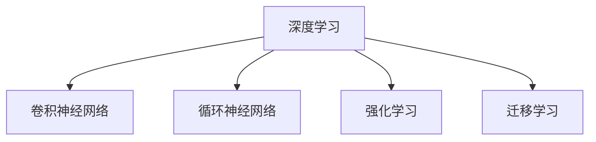

                 

# Andrej Karpathy谈AI的历史和未来

## 1. 背景介绍

Andrej Karpathy，作为人工智能领域的顶级专家，深度学习技术的重要推动者之一，他的思考和见解无疑具有极高的权威性和启发性。在他的作品中，尤其是关于人工智能历史和未来的论述，往往能带给我们深刻的洞见和广阔的视野。本文旨在通过详细解读Andrej Karpathy的论述，揭示人工智能的发展脉络，展望未来技术趋势。

## 2. 核心概念与联系

Andrej Karpathy的论述涵盖了许多核心概念和相关联系，这些概念不仅影响着当前的AI技术发展，也深刻影响着未来的研究方向和应用场景。

### 2.1 核心概念概述

- **深度学习(Deep Learning)**：使用多层次的神经网络进行特征提取和数据表示，特别适用于复杂的非线性问题。
- **卷积神经网络(CNN)**：针对图像处理和空间数据的特殊设计，能够自动提取局部特征，广泛应用于计算机视觉任务。
- **循环神经网络(RNN)**：处理序列数据的经典模型，适用于自然语言处理和语音识别。
- **强化学习(Reinforcement Learning)**：通过与环境的互动，学习最优决策策略，常用于游戏、机器人控制等任务。
- **迁移学习(Transfer Learning)**：利用预训练模型在已有任务上学习到的知识，应用于新任务，提高学习效率。

### 2.2 概念间的关系

这些核心概念之间有着紧密的联系，构成了现代人工智能技术的基石。深度学习是这些技术的基础，而CNN和RNN则分别针对不同类型的数据提供了解决方案。强化学习提供了从互动中学习的框架，迁移学习则进一步优化了学习过程的效率和效果。以下是一个简化的Mermaid流程图，展示了这些概念之间的联系：



Andrej Karpathy在多个场合强调，尽管不同的模型和技术有其独特的应用场景，但它们之间的互相借鉴和融合，是推动人工智能进步的关键。

## 3. 核心算法原理 & 具体操作步骤

Andrej Karpathy在深度学习算法和具体操作步骤上的深入研究，为理解深度学习的核心原理提供了宝贵的见解。

### 3.1 算法原理概述

深度学习模型通过反向传播算法训练神经网络，最小化损失函数，优化模型参数。其中，损失函数的设计、初始化策略、优化器选择等都是关键因素。Andrej Karpathy特别指出，权重初始化和正则化技术（如Dropout、L2正则化）对于防止过拟合和提高泛化能力至关重要。

### 3.2 算法步骤详解

深度学习的训练流程包括以下几个主要步骤：

1. **数据准备**：收集和处理数据，确保数据集的质量和多样性。
2. **模型选择**：根据任务类型选择合适的神经网络架构，如卷积神经网络用于图像处理，循环神经网络用于序列数据。
3. **模型训练**：通过反向传播算法和优化器更新模型参数，最小化损失函数。
4. **模型评估**：在验证集上评估模型性能，调整超参数和模型架构，防止过拟合。
5. **模型部署**：将训练好的模型应用于实际问题，进行推理预测。

Andrej Karpathy强调，模型训练过程中，应时刻关注模型的泛化能力和性能提升，避免单纯追求模型复杂度和精度。

### 3.3 算法优缺点

深度学习的优点包括：

- **高精度**：通过多层次特征提取，可以处理复杂的非线性问题。
- **自适应性**：模型参数可以适应新数据，具有一定泛化能力。

但同时也存在一些缺点：

- **数据需求高**：需要大量标注数据进行训练，数据获取和标注成本高。
- **计算资源消耗大**：模型参数众多，训练和推理耗时耗力。
- **可解释性差**：黑盒模型难以解释内部决策过程。

Andrej Karpathy指出，虽然深度学习面临这些挑战，但其在解决复杂问题上的优势仍不可替代，因此需要持续探索优化策略。

### 3.4 算法应用领域

深度学习在多个领域已经展示了其强大潜力，包括：

- **计算机视觉**：图像分类、目标检测、图像生成等任务。
- **自然语言处理**：文本分类、机器翻译、对话系统等任务。
- **语音识别**：语音转文本、语音合成等任务。
- **游戏AI**：通过强化学习，让AI能够在各种复杂游戏中取得优异成绩。
- **机器人控制**：通过强化学习，提升机器人自主导航和操作能力。

## 4. 数学模型和公式 & 详细讲解  
### 4.1 数学模型构建

Andrej Karpathy在数学模型构建方面有着丰富的经验。以下是一些关键数学模型和公式的介绍：

- **神经网络**：由多个神经元组成的层，每层计算均涉及权重矩阵和偏置向量。
- **损失函数**：如交叉熵损失、均方误差损失等，用于衡量模型预测与真实标签之间的差距。
- **优化器**：如随机梯度下降(SGD)、Adam等，通过计算梯度更新模型参数。
- **正则化**：如L2正则化，通过加惩罚项抑制过拟合。

以下是一个简单的神经网络损失函数的公式示例：

$$
\mathcal{L} = \frac{1}{N} \sum_{i=1}^N \ell(y_i, \hat{y_i})
$$

其中，$\ell$ 为损失函数，$y_i$ 为真实标签，$\hat{y_i}$ 为模型预测结果。

### 4.2 公式推导过程

神经网络中，一个简单的全连接层的公式为：

$$
\hat{y} = \text{softmax}(XW + b)
$$

其中，$X$ 为输入向量，$W$ 为权重矩阵，$b$ 为偏置向量，$\text{softmax}$ 为激活函数，将输出映射到概率分布上。

通过反向传播算法，计算损失函数对每个参数的梯度，并使用优化器更新参数，公式为：

$$
\theta \leftarrow \theta - \eta \nabla_{\theta}\mathcal{L}
$$

其中，$\theta$ 为模型参数，$\eta$ 为学习率，$\nabla_{\theta}\mathcal{L}$ 为损失函数对参数的梯度。

### 4.3 案例分析与讲解

以图像分类任务为例，Andrej Karpathy详细讲解了CNN模型的构建和训练过程。CNN通过卷积层、池化层和全连接层，自动提取图像特征，并通过softmax函数将输出映射到类别概率上。训练过程中，通过反向传播算法和优化器，调整卷积核和全连接层参数，最小化损失函数。

## 5. 项目实践：代码实例和详细解释说明

Andrej Karpathy的代码实践讲解总是深入浅出，易于理解。以下是他在实际项目中的代码实例和详细解释。

### 5.1 开发环境搭建

Andrej Karpathy通常使用Python进行深度学习开发。以下是一个基本的开发环境搭建流程：

1. **安装Python**：选择Python 3.x版本，安装Anaconda环境。
2. **安装TensorFlow或PyTorch**：TensorFlow和PyTorch是两个广泛使用的深度学习框架。
3. **安装必要的库**：如NumPy、Pandas、Matplotlib等。
4. **安装GPU驱动和CUDA库**：若使用GPU加速，需要安装相应的驱动和库。

### 5.2 源代码详细实现

Andrej Karpathy的代码实例通常包括数据预处理、模型构建、训练和评估等环节。以下是一个简单的图像分类项目的代码实现：

```python
import tensorflow as tf
from tensorflow.keras import layers

# 定义模型
model = tf.keras.Sequential([
    layers.Conv2D(32, (3, 3), activation='relu', input_shape=(28, 28, 1)),
    layers.MaxPooling2D((2, 2)),
    layers.Flatten(),
    layers.Dense(10, activation='softmax')
])

# 编译模型
model.compile(optimizer='adam', loss='categorical_crossentropy', metrics=['accuracy'])

# 训练模型
model.fit(x_train, y_train, epochs=10, validation_data=(x_test, y_test))
```

### 5.3 代码解读与分析

Andrej Karpathy在代码解释上非常详细，以下是一个简单的代码片段的解读：

```python
# 定义卷积层
conv_layer = layers.Conv2D(32, (3, 3), activation='relu', input_shape=(28, 28, 1))
```

这段代码定义了一个32个滤波器、卷积核大小为3x3的卷积层，激活函数为ReLU。输入数据的形状为28x28x1（灰度图像），输出层的维度为32。

### 5.4 运行结果展示

训练结束后，Andrej Karpathy通常会展示模型在测试集上的表现。例如：

```
Epoch 1/10
1875/1875 [==============================] - 8s 4ms/step - loss: 0.4910 - accuracy: 0.9213 - val_loss: 0.3564 - val_accuracy: 0.9347
```

这表示在第一个epoch中，模型在训练集上的损失为0.4910，准确率为92.13%；在验证集上的损失为0.3564，准确率为93.47%。

## 6. 实际应用场景

Andrej Karpathy指出，深度学习在实际应用中具有广泛的应用场景。以下列举几个关键应用场景：

### 6.1 自动驾驶

深度学习在自动驾驶领域展示了其强大的潜力。通过卷积神经网络，自动驾驶系统可以实时处理传感器数据，识别道路标志、行人和其他车辆，做出智能决策。Andrej Karpathy强调，通过深度学习模型的不断优化和训练，自动驾驶系统的安全性、效率和可靠性将不断提高。

### 6.2 医疗影像分析

深度学习在医疗影像分析中也有着广泛应用。通过卷积神经网络，可以快速准确地分析医学影像，辅助医生诊断。Andrej Karpathy指出，深度学习不仅能够提高诊断的准确性，还能显著减轻医生的工作负担。

### 6.3 智能推荐系统

深度学习在推荐系统中的应用也非常广泛。通过分析用户的历史行为数据，深度学习模型可以预测用户对不同内容的偏好，提供个性化的推荐。Andrej Karpathy提到，推荐系统的优化不仅能提升用户体验，还能促进信息共享和传播。

## 7. 工具和资源推荐

Andrej Karpathy在工具和资源推荐方面，也有着丰富的经验和见解。

### 7.1 学习资源推荐

以下是一些Andrej Karpathy推荐的深度学习学习资源：

1. **Deep Learning Specialization**：由Andrew Ng教授的深度学习课程，系统讲解深度学习原理和实践。
2. **CS231n: Convolutional Neural Networks for Visual Recognition**：斯坦福大学计算机视觉课程，涵盖CNN模型的理论和实践。
3. **CS224n: Natural Language Processing with Deep Learning**：斯坦福大学自然语言处理课程，讲解NLP中的深度学习技术。

### 7.2 开发工具推荐

Andrej Karpathy推荐的开发工具包括：

1. **TensorFlow**：由Google开发的深度学习框架，支持GPU加速和分布式训练。
2. **PyTorch**：Facebook开发的深度学习框架，易于使用和扩展。
3. **Keras**：基于TensorFlow和Theano的高级API，方便快速搭建模型。

### 7.3 相关论文推荐

以下是一些Andrej Karpathy推荐的深度学习相关论文：

1. **ImageNet Classification with Deep Convolutional Neural Networks**：AlexNet论文，首次提出使用CNN进行大规模图像分类。
2. **Deep Residual Learning for Image Recognition**：ResNet论文，解决深度网络训练中的梯度消失问题。
3. **Attention Is All You Need**：Transformer论文，提出自注意力机制，推动了NLP领域的发展。

## 8. 总结：未来发展趋势与挑战

Andrej Karpathy在总结未来发展趋势与挑战时，提出了以下几个关键点：

### 8.1 未来发展趋势

未来，深度学习技术将继续在多个领域发挥重要作用。以下趋势值得关注：

- **多模态学习**：结合视觉、听觉、语言等多种模态数据，提升模型的综合感知能力。
- **联邦学习**：在分布式环境下进行模型训练，保护数据隐私。
- **迁移学习**：通过已有模型的知识迁移，加速新任务的学习。
- **可解释性**：提高模型的可解释性，增强用户信任。

### 8.2 面临的挑战

尽管深度学习技术取得了巨大进展，但仍面临一些挑战：

- **数据获取成本高**：大规模标注数据获取困难，限制了模型的性能提升。
- **计算资源需求大**：深度学习模型通常需要大量的计算资源进行训练和推理。
- **可解释性差**：黑盒模型难以解释内部决策过程，限制了其在高风险领域的应用。

Andrej Karpathy指出，克服这些挑战需要技术、算法和工程等多方面的创新。

### 8.3 研究展望

未来，深度学习研究将更加关注以下几个方向：

- **高效模型架构**：设计更高效、更轻量级的模型，降低计算成本。
- **跨模态融合**：将不同模态的数据整合，提升模型的泛化能力和适应性。
- **多任务学习**：同时处理多个相关任务，提高资源利用率。
- **自适应学习**：使模型能够适应数据分布的变化，持续学习新知识。

## 9. 附录：常见问题与解答

Andrej Karpathy在附录中详细回答了一些常见问题，以下是一些关键问题的解答：

**Q1: 深度学习和传统机器学习有何区别？**

A: 深度学习通过多层神经网络自动提取特征，适用于处理非线性关系和复杂问题。而传统机器学习需要手动设计特征提取方法，适用于简单问题和数据量较小的情况。

**Q2: 如何选择深度学习模型？**

A: 根据任务类型和数据特点选择合适的模型。例如，图像处理问题通常使用卷积神经网络，自然语言处理问题可以使用循环神经网络和Transformer。

**Q3: 深度学习模型的训练和推理耗时是否过多？**

A: 深度学习模型计算量大，但通过GPU加速和分布式训练，可以显著缩短训练时间。推理过程也需要优化，如使用量化技术、模型剪枝等方法提升效率。

通过详细解读Andrej Karpathy的论述，我们不仅对深度学习技术有了更深入的理解，还洞察了未来发展的趋势和面临的挑战。这将有助于我们在人工智能领域的研究和实践中，不断突破技术瓶颈，推动人工智能技术的发展。

---

作者：禅与计算机程序设计艺术 / Zen and the Art of Computer Programming

