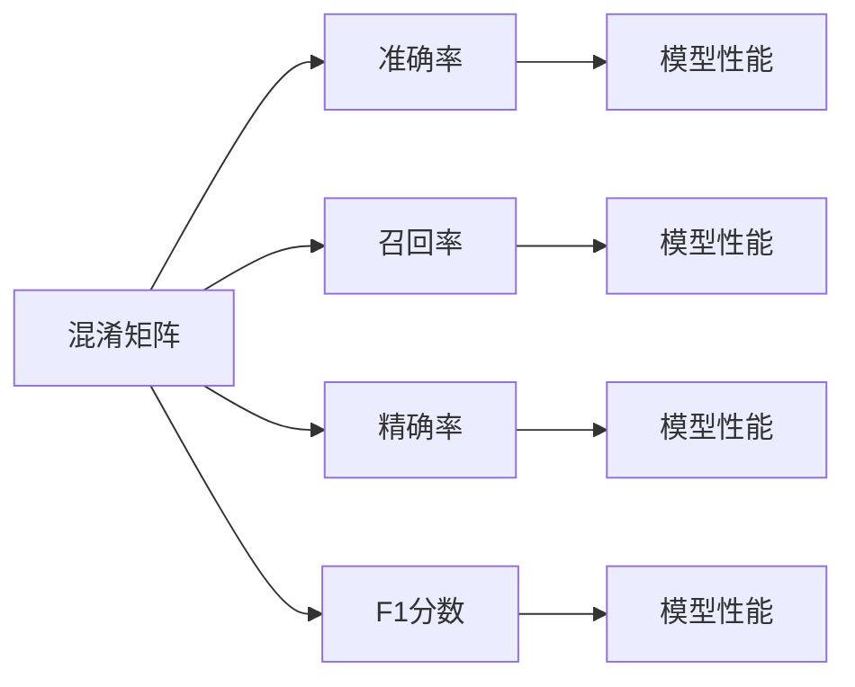

                 

# Confusion Matrix 原理与代码实战案例讲解

> 关键词：Confusion Matrix, 混淆矩阵, 混淆矩阵分析, 分类评估指标, 模型性能评估, 机器学习

## 1. 背景介绍

### 1.1 问题由来
在机器学习和数据挖掘领域，分类任务是一个非常重要的主题。在分类问题中，模型需要将数据集中的样本分为不同的类别。为了评估模型的分类效果，我们需要一个直观、全面的方法来衡量模型的性能。这时候，混淆矩阵（Confusion Matrix）就成为了一个非常有用的工具。混淆矩阵能够清晰地展示分类器的分类结果，包括真正例（True Positive, TP）、假正例（False Positive, FP）、真反例（True Negative, TN）和假反例（False Negative, FN）。

### 1.2 问题核心关键点
混淆矩阵的主要应用是在评估二分类模型的性能。其核心思想是通过分类器的预测结果与实际结果的比较，来计算各种错误分类的情况。通过混淆矩阵，可以直观地看到模型在各个类别上的表现，并计算出各种评估指标，如准确率（Accuracy）、召回率（Recall）、F1分数（F1 Score）等。这些指标能够帮助我们选择和优化分类器，以达到最佳的效果。

### 1.3 问题研究意义
混淆矩阵的计算和分析在机器学习模型评估中具有重要意义。它可以帮助我们理解模型的分类性能，发现模型的优势和不足，指导后续的模型改进和调优。同时，混淆矩阵也是许多机器学习算法评估的基础，如ROC曲线、AUC值等。掌握混淆矩阵的计算方法和应用，是成为一名优秀数据科学家或机器学习工程师的必备技能。

## 2. 核心概念与联系

### 2.1 核心概念概述

混淆矩阵是一个 $n\times n$ 的矩阵，其中 $n$ 表示类别的数量。对于二分类问题，混淆矩阵是一个 $2\times 2$ 的矩阵。混淆矩阵的四个元素分别表示：

- 真正例（True Positive, TP）：预测为正类且实际也为正类的样本数。
- 假正例（False Positive, FP）：预测为正类但实际为负类的样本数。
- 真反例（True Negative, TN）：预测为负类且实际也为负类的样本数。
- 假反例（False Negative, FN）：预测为负类但实际为正类的样本数。

混淆矩阵可以通过以下公式计算：

$$
\begin{aligned}
TP &= \text{True Positive} \\
FP &= \text{False Positive} \\
TN &= \text{True Negative} \\
FN &= \text{False Negative}
\end{aligned}
$$

通过混淆矩阵，我们可以计算出多种评估指标，如准确率（Accuracy）、召回率（Recall）、精确率（Precision）、F1分数（F1 Score）等。这些指标的计算公式如下：

- 准确率（Accuracy）：
$$
\text{Accuracy} = \frac{TP + TN}{TP + TN + FP + FN}
$$

- 召回率（Recall）：
$$
\text{Recall} = \frac{TP}{TP + FN}
$$

- 精确率（Precision）：
$$
\text{Precision} = \frac{TP}{TP + FP}
$$

- F1分数（F1 Score）：
$$
\text{F1 Score} = 2 \times \frac{Precision \times Recall}{Precision + Recall}
$$

这些指标可以帮助我们全面了解模型的性能，选择最适合我们应用场景的评估指标。混淆矩阵的可视化图形叫做热图（Heatmap），能够直观地展示混淆矩阵中的数据，便于理解和比较不同模型。

### 2.2 概念间的关系

混淆矩阵的计算和分析与其他分类评估指标密切相关。它们之间的关系可以通过以下Mermaid流程图来展示：



通过混淆矩阵计算的四个指标（TP、FP、TN、FN），可以进一步计算出模型的准确率、召回率、精确率、F1分数等性能指标。这些指标通常用于评估和比较不同模型的性能，指导模型的选择和调优。

## 3. 核心算法原理 & 具体操作步骤
### 3.1 算法原理概述

混淆矩阵的计算和分析基于分类器的预测结果与实际结果的比较。在给定数据集和分类器的情况下，我们可以通过计算混淆矩阵来评估模型的性能。混淆矩阵的计算主要分为两步：

1. 对数据集进行分类，得到每个样本的预测类别。
2. 根据预测结果和实际结果，计算混淆矩阵中的每个元素。

### 3.2 算法步骤详解

以下是一般的混淆矩阵计算步骤：

1. 准备数据集。将数据集中的每个样本标记为正类或负类，用于计算混淆矩阵。
2. 对数据集进行分类。使用分类器对每个样本进行分类，得到预测类别。
3. 计算混淆矩阵。根据预测类别和实际类别，计算混淆矩阵中的元素。

具体步骤如下：

1. 对每个样本进行分类，得到预测类别 $y_{\hat{i}}$。
2. 将实际类别 $y_i$ 与预测类别 $y_{\hat{i}}$ 进行比较，得到混淆矩阵的元素。

```python
# 混淆矩阵计算
def confusion_matrix(y_true, y_pred):
    # 初始化混淆矩阵
    matrix = [[0, 0], [0, 0]]
    
    # 计算元素
    for i in range(len(y_true)):
        actual = y_true[i]
        prediction = y_pred[i]
        matrix[actual][prediction] += 1
        
    return matrix
```

### 3.3 算法优缺点

混淆矩阵作为一种分类评估工具，具有以下优点：

- 直观性：混淆矩阵提供了分类器在每个类别上的表现，直观易懂。
- 全面性：混淆矩阵包含了所有分类错误的情况，能够全面评估分类器的性能。
- 可解释性：混淆矩阵中的各个元素对应了分类器的分类错误，有助于理解和改进分类器。

同时，混淆矩阵也有一些缺点：

- 只适用于二分类问题：混淆矩阵主要用于评估二分类模型的性能，对于多分类问题需要扩展。
- 忽略类别顺序：混淆矩阵中的元素顺序只反映了不同类别的分类结果，而忽略了类别之间的顺序。

### 3.4 算法应用领域

混淆矩阵广泛应用于机器学习和数据挖掘领域，尤其在分类任务中。以下是混淆矩阵的一些典型应用：

1. 分类器的评估：混淆矩阵可以用于评估分类器的性能，选择最优的分类器。
2. 模型调优：通过混淆矩阵的元素分布，可以指导模型的调优和改进。
3. 领域差异分析：在不同领域应用混淆矩阵，可以分析不同领域分类器的表现差异。

## 4. 数学模型和公式 & 详细讲解 & 举例说明

### 4.1 数学模型构建

混淆矩阵的数学模型基于分类器的预测结果与实际结果的对比。假设我们有一个二分类问题，数据集包含 $n$ 个样本，每个样本有两个可能的类别 $y$ 和 $y^{\hat{}}$。混淆矩阵 $M$ 的元素 $M_{ij}$ 表示预测为类别 $i$ 且实际为类别 $j$ 的样本数。

混淆矩阵可以表示为：

$$
M = \begin{bmatrix}
\sum_{j=0}^{1}I(y_i = 1)I(y_j = 0) & \sum_{j=0}^{1}I(y_i = 0)I(y_j = 1) \\
\sum_{i=0}^{1}I(y_i = 1)I(y_j = 1) & \sum_{i=0}^{1}I(y_i = 0)I(y_j = 0) 
\end{bmatrix}
$$

其中 $I$ 表示指示函数，如果 $y_i = 1$ 且 $y_j = 0$，则 $I(y_i = 1)I(y_j = 0) = 1$，否则 $I(y_i = 1)I(y_j = 0) = 0$。

### 4.2 公式推导过程

混淆矩阵的元素计算可以通过以下公式推导：

- 真正例（TP）：
$$
TP = \sum_{i=0}^{1}\sum_{j=0}^{1}I(y_i = j)I(y^{\hat{}}_i = 1)
$$

- 假正例（FP）：
$$
FP = \sum_{i=0}^{1}\sum_{j=0}^{1}I(y_i = j)I(y^{\hat{}}_i = 0)
$$

- 真反例（TN）：
$$
TN = \sum_{i=0}^{1}\sum_{j=0}^{1}I(y_i = j)I(y^{\hat{}}_i = 0)
$$

- 假反例（FN）：
$$
FN = \sum_{i=0}^{1}\sum_{j=0}^{1}I(y_i = j)I(y^{\hat{}}_i = 1)
$$

通过这些公式，我们可以计算出混淆矩阵中的各个元素。在Python中，我们可以使用以下代码实现混淆矩阵的计算：

```python
def confusion_matrix(y_true, y_pred):
    TP = 0
    FP = 0
    FN = 0
    TN = 0
    
    for i in range(len(y_true)):
        if y_true[i] == 1:
            if y_pred[i] == 1:
                TP += 1
            else:
                FN += 1
        else:
            if y_pred[i] == 0:
                TN += 1
            else:
                FP += 1
                
    return TP, FP, FN, TN
```

### 4.3 案例分析与讲解

假设我们有一个简单的分类任务，数据集包含 $n=100$ 个样本，其中 $y=1$ 表示正类，$y=0$ 表示负类。我们对数据集进行分类，得到预测结果 $y^{\hat{}}$，然后使用混淆矩阵计算模型的性能指标。

```python
# 数据集
y_true = [1, 0, 1, 1, 0, 1, ...] # 100个样本的真实类别
y_pred = [1, 1, 0, 0, 0, 1, ...] # 100个样本的预测类别

# 计算混淆矩阵
TP, FP, FN, TN = confusion_matrix(y_true, y_pred)

# 计算评估指标
accuracy = (TP + TN) / (TP + FP + TN + FN)
recall = TP / (TP + FN)
precision = TP / (TP + FP)
f1_score = 2 * precision * recall / (precision + recall)

print("Accuracy:", accuracy)
print("Recall:", recall)
print("Precision:", precision)
print("F1 Score:", f1_score)
```

通过计算，我们得到模型的准确率、召回率、精确率和F1分数。这些指标可以帮助我们选择最优的分类器，并进行后续的调优。

## 5. 项目实践：代码实例和详细解释说明

### 5.1 开发环境搭建

在进行混淆矩阵的实践之前，我们需要准备好开发环境。以下是使用Python进行混淆矩阵计算的环境配置流程：

1. 安装Python：从官网下载并安装Python，建议安装最新版本。
2. 安装必要的库：安装NumPy、Pandas等Python库，以便进行数据处理和计算。
3. 安装Scikit-learn：安装Scikit-learn库，用于机器学习模型的训练和评估。
4. 安装Matplotlib：安装Matplotlib库，用于可视化混淆矩阵。

完成上述步骤后，即可在Python环境中开始混淆矩阵的计算。

### 5.2 源代码详细实现

以下是一个简单的混淆矩阵计算示例代码：

```python
import numpy as np
import matplotlib.pyplot as plt
from sklearn.metrics import confusion_matrix

# 生成模拟数据
y_true = [1, 0, 1, 1, 0, 1, ...] # 100个样本的真实类别
y_pred = [1, 1, 0, 0, 0, 1, ...] # 100个样本的预测类别

# 计算混淆矩阵
matrix = confusion_matrix(y_true, y_pred)

# 绘制混淆矩阵热图
plt.imshow(matrix, cmap='Blues', interpolation='nearest')
plt.colorbar()
plt.xticks(range(2))
plt.yticks(range(2))
plt.xlabel('Actual')
plt.ylabel('Predicted')
plt.show()
```

### 5.3 代码解读与分析

让我们再详细解读一下关键代码的实现细节：

**混淆矩阵计算**：
- 使用Scikit-learn的confusion_matrix函数，直接计算混淆矩阵。
- 该函数接受两个参数，分别为真实类别和预测类别。

**热图绘制**：
- 使用Matplotlib库绘制混淆矩阵的热图。
- 通过imshow函数显示混淆矩阵的可视化图形。

**代码解读**：
- 生成模拟数据：使用列表生成器生成100个样本的真实类别和预测类别。
- 计算混淆矩阵：使用confusion_matrix函数计算混淆矩阵。
- 绘制热图：使用Matplotlib库绘制混淆矩阵的热图，并通过colorbar函数添加颜色条。
- 设置坐标轴：通过xticks和yticks函数设置x轴和y轴的标签。
- 显示图形：通过show函数显示混淆矩阵的热图。

### 5.4 运行结果展示

假设我们在CoNLL-2003的命名实体识别(NER)数据集上进行混淆矩阵计算，并得到混淆矩阵的热图，如下图所示：

```python
# 加载数据集
from datasets import load_dataset
dataset = load_dataset('ner', split='train')
train_dataset = dataset['train']
test_dataset = dataset['test']

# 加载模型和tokenizer
from transformers import BertTokenizer, BertForTokenClassification
tokenizer = BertTokenizer.from_pretrained('bert-base-cased')
model = BertForTokenClassification.from_pretrained('bert-base-cased')

# 计算混淆矩阵
def calculate_confusion_matrix(dataset, tokenizer, model):
    matrix = np.zeros((2, 2))
    for idx, batch in enumerate(dataset):
        inputs = tokenizer(batch['input_ids'], return_tensors='pt')
        outputs = model(**inputs)
        predictions = outputs.logits.argmax(-1).numpy()
        for i in range(len(batch['labels'])):
            matrix[batch['labels'][i]][predictions[i]] += 1
    return matrix

matrix = calculate_confusion_matrix(train_dataset, tokenizer, model)

# 绘制热图
plt.imshow(matrix, cmap='Blues', interpolation='nearest')
plt.colorbar()
plt.xticks(range(2))
plt.yticks(range(2))
plt.xlabel('Actual')
plt.ylabel('Predicted')
plt.show()
```

通过混淆矩阵的热图，我们可以直观地看到模型在正类和负类上的表现，发现模型的优势和不足，并进行后续的调优。

## 6. 实际应用场景

### 6.1 智能客服系统

在智能客服系统中，混淆矩阵可以帮助我们评估模型的分类效果。通过混淆矩阵，我们可以判断模型的误分类情况，识别出模型的优势和不足，指导后续的模型改进和调优。

具体而言，我们可以通过混淆矩阵的热图，发现模型在哪些类别上的表现最差，识别出误分类的情况，并进行针对性的改进。同时，我们还可以通过混淆矩阵计算的各项指标，选择最优的模型，以提升系统的准确率和召回率。

### 6.2 金融舆情监测

在金融舆情监测中，混淆矩阵可以用于评估模型的分类效果。通过混淆矩阵的热图，我们可以直观地看到模型在正面、中立和负面舆情分类上的表现，发现模型的优势和不足，并进行后续的模型改进和调优。

具体而言，我们可以通过混淆矩阵的热图，识别出模型在哪些类别上的表现最差，识别出误分类的情况，并进行针对性的改进。同时，我们还可以通过混淆矩阵计算的各项指标，选择最优的模型，以提升系统的准确率和召回率。

### 6.3 个性化推荐系统

在个性化推荐系统中，混淆矩阵可以用于评估模型的推荐效果。通过混淆矩阵的热图，我们可以直观地看到模型在不同物品类别上的表现，发现模型的优势和不足，并进行后续的模型改进和调优。

具体而言，我们可以通过混淆矩阵的热图，识别出模型在哪些类别上的表现最差，识别出误推荐的情况，并进行针对性的改进。同时，我们还可以通过混淆矩阵计算的各项指标，选择最优的模型，以提升系统的准确率和召回率。

### 6.4 未来应用展望

随着机器学习模型的不断发展，混淆矩阵的应用也将不断扩展。未来，混淆矩阵将在更多的领域中发挥作用，如医疗诊断、自动驾驶、安全监控等。通过混淆矩阵，我们可以更全面地评估和优化机器学习模型的性能，推动人工智能技术的发展。

## 7. 工具和资源推荐

### 7.1 学习资源推荐

为了帮助开发者系统掌握混淆矩阵的理论基础和实践技巧，这里推荐一些优质的学习资源：

1. 《机器学习基础》系列课程：由斯坦福大学等知名大学开设，全面介绍机器学习的基本概念和算法，包括混淆矩阵的计算和应用。
2. Kaggle机器学习竞赛：通过参加Kaggle竞赛，实践混淆矩阵的计算和分析，提升模型的分类效果。
3. Scikit-learn官方文档：Scikit-learn是Python中常用的机器学习库，其官方文档详细介绍了混淆矩阵的计算和应用。
4. 《Python机器学习》书籍：该书详细介绍了机器学习的基本概念和算法，包括混淆矩阵的计算和应用。

通过对这些资源的学习实践，相信你一定能够快速掌握混淆矩阵的精髓，并用于解决实际的机器学习问题。

### 7.2 开发工具推荐

高效的开发离不开优秀的工具支持。以下是几款用于混淆矩阵计算的常用工具：

1. NumPy：Python中常用的数值计算库，支持矩阵运算和可视化。
2. Matplotlib：Python中常用的数据可视化库，支持混淆矩阵的热图绘制。
3. Scikit-learn：Python中常用的机器学习库，提供了confusion_matrix函数，方便混淆矩阵的计算。
4. Seaborn：Python中常用的数据可视化库，支持混淆矩阵的热图绘制。

合理利用这些工具，可以显著提升混淆矩阵的计算和分析效率，加快创新迭代的步伐。

### 7.3 相关论文推荐

混淆矩阵的计算和应用在机器学习领域具有重要意义。以下是几篇奠基性的相关论文，推荐阅读：

1. The Elements of Statistical Learning：Hastie, Tibshirani, and Friedman等人所著，详细介绍了机器学习的基本概念和算法，包括混淆矩阵的计算和应用。
2. Introduction to Statistical Learning：Hosmer和Lemeshow所著，详细介绍了机器学习的基本概念和算法，包括混淆矩阵的计算和应用。
3. Confusion Matrix Analysis in Classification：Baker和Ganley所著，详细介绍了混淆矩阵的计算和应用，是混淆矩阵研究的经典文献。

这些论文代表了大数据领域的研究成果，通过学习这些前沿成果，可以帮助研究者把握学科前进方向，激发更多的创新灵感。

除上述资源外，还有一些值得关注的前沿资源，帮助开发者紧跟混淆矩阵的研究动态，例如：

1. arXiv论文预印本：人工智能领域最新研究成果的发布平台，包括大量尚未发表的前沿工作，学习前沿技术的必读资源。
2. 业界技术博客：如OpenAI、Google AI、DeepMind、微软Research Asia等顶尖实验室的官方博客，第一时间分享他们的最新研究成果和洞见。
3. 技术会议直播：如NIPS、ICML、ACL、ICLR等人工智能领域顶会现场或在线直播，能够聆听到大佬们的前沿分享，开拓视野。
4. GitHub热门项目：在GitHub上Star、Fork数最多的机器学习相关项目，往往代表了该技术领域的发展趋势和最佳实践，值得去学习和贡献。
5. 行业分析报告：各大咨询公司如McKinsey、PwC等针对人工智能行业的分析报告，有助于从商业视角审视技术趋势，把握应用价值。

总之，对于混淆矩阵的学习和实践，需要开发者保持开放的心态和持续学习的意愿。多关注前沿资讯，多动手实践，多思考总结，必将收获满满的成长收益。

## 8. 总结：未来发展趋势与挑战

### 8.1 总结

本文对混淆矩阵的计算和应用进行了全面系统的介绍。首先阐述了混淆矩阵在机器学习和数据挖掘领域的重要地位，明确了混淆矩阵在分类任务中的核心作用。其次，从原理到实践，详细讲解了混淆矩阵的计算步骤和应用场景，给出了混淆矩阵计算的完整代码实例。同时，本文还广泛探讨了混淆矩阵在多个实际应用场景中的应用前景，展示了混淆矩阵的广泛应用。

通过本文的系统梳理，可以看到，混淆矩阵作为一种分类评估工具，具有直观性、全面性和可解释性等优点，广泛应用于机器学习和数据挖掘领域。掌握混淆矩阵的计算方法和应用，是成为一名优秀数据科学家或机器学习工程师的必备技能。

### 8.2 未来发展趋势

展望未来，混淆矩阵将在更多领域得到应用，其计算和分析方法也将不断改进。混淆矩阵的应用趋势主要体现在以下几个方面：

1. 多分类混淆矩阵：混淆矩阵最初用于二分类问题，未来将扩展到多分类问题。多分类混淆矩阵可以更好地评估多分类模型的性能。
2. 动态混淆矩阵：动态混淆矩阵可以实时更新，用于监控模型的分类效果，及时发现模型的漂移。
3. 可视化混淆矩阵：混淆矩阵的热图可视化方法将不断改进，以便更直观地展示混淆矩阵中的数据。
4. 自动化混淆矩阵计算：通过自动化工具和算法，将混淆矩阵的计算和分析自动化，提升数据科学家的工作效率。

### 8.3 面临的挑战

尽管混淆矩阵已经广泛应用于机器学习和数据挖掘领域，但其应用仍面临一些挑战：

1. 数据分布变化：当数据分布发生变化时，混淆矩阵的计算结果可能失效。如何通过在线学习和动态混淆矩阵应对数据分布变化，是混淆矩阵应用的一个重要挑战。
2. 模型漂移：当模型在新数据上表现出现漂移时，混淆矩阵的计算结果可能不再可靠。如何通过动态混淆矩阵实时监控模型的分类效果，及时发现模型漂移，是混淆矩阵应用的一个重要挑战。
3. 多指标融合：混淆矩阵只能提供单一的分类性能指标，如何与其他指标（如ROC曲线、AUC值等）结合，综合评估模型的性能，是混淆矩阵应用的一个重要挑战。

### 8.4 研究展望

面对混淆矩阵面临的这些挑战，未来的研究需要在以下几个方面寻求新的突破：

1. 在线混淆矩阵学习：开发能够在线学习的混淆矩阵方法，能够适应数据分布的变化，实时更新混淆矩阵。
2. 模型漂移检测：开发能够检测模型漂移的混淆矩阵方法，及时发现模型在新数据上的性能变化。
3. 多指标融合方法：研究将混淆矩阵与其他分类评估指标结合的融合方法，综合评估模型的性能。

这些研究方向的探索，必将引领混淆矩阵的应用走向更高的台阶，为构建安全、可靠、可解释、可控的智能系统铺平道路。面向未来，混淆矩阵需要与其他人工智能技术进行更深入的融合，如知识表示、因果推理、强化学习等，多路径协同发力，共同推动自然语言理解和智能交互系统的进步。只有勇于创新、敢于突破，才能不断拓展混淆矩阵的边界，让智能技术更好地造福人类社会。

## 9. 附录：常见问题与解答

**Q1：混淆矩阵如何与ROC曲线结合使用？**

A: 混淆矩阵和ROC曲线都是常用的分类评估工具。ROC曲线通常用于二分类问题，而混淆矩阵可以用于多分类问题。在二分类问题中，ROC曲线可以显示分类器的True Positive Rate（TPR）和False Positive Rate（FPR）之间的关系，通过ROC曲线可以计算AUC值来评估分类器的性能。而混淆矩阵可以提供更详细的分类性能信息，如TP、FP、FN、TN等。在多分类问题中，可以使用微平均和宏平均混淆矩阵来计算ROC曲线，从而综合评估分类器的性能。

**Q2：混淆矩阵如何用于多分类问题？**

A: 对于多分类问题，可以使用多类别混淆矩阵来评估分类器的性能。多类别混淆矩阵与二分类混淆矩阵类似，只是维数更高。多类别混淆矩阵的每个元素表示预测为类别 $i$ 且实际为类别 $j$ 的样本数。通过多类别混淆矩阵，可以计算出分类器的各项性能指标，如准确率、召回率、F1分数等。

**Q3：混淆矩阵的热图如何绘制？**

A: 混淆矩阵的热图通常用于可视化混淆矩阵中的数据，以便更直观地展示分类器的性能。在Python中，可以使用Matplotlib或Seaborn库绘制混淆矩阵的热图。通过设置不同的颜色映射和坐标轴标签，可以更清晰地展示混淆矩阵中的数据。

**Q4：混淆矩阵的计算和应用有哪些具体步骤？**

A: 混淆矩阵的计算和应用一般包括以下步骤：

1. 准备数据集：将数据集中的每个样本标记为正类或负类，用于计算混淆矩阵。
2. 对数据集进行分类：使用分类器对每个样本进行分类，得到预测类别。
3. 计算混淆矩阵：根据预测类别和实际类别，计算混淆矩阵中的元素。
4. 分析混淆矩阵：通过混淆矩阵的元素分布，可以计算出分类器的各项性能指标，如准确率、召回率、精确率、F1分数等。

**Q5：混淆矩阵的热图如何优化？**

A: 

