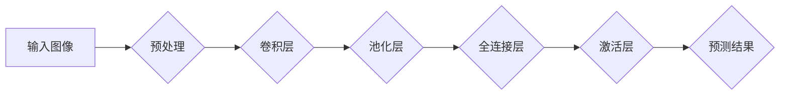
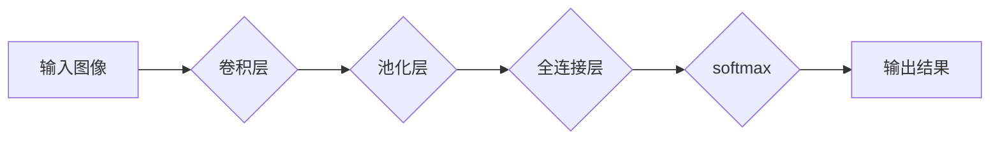

> 深度学习，五官识别，计算机视觉，卷积神经网络，人脸识别，深度学习框架，数据预处理，特征提取，模型评估

# 深度学习五官的识别系统详细设计与具体代码实现

## 1. 背景介绍

随着深度学习技术的飞速发展，计算机视觉领域取得了显著的进展。五官识别作为计算机视觉的一个重要分支，其应用范围涵盖了人脸识别、生物识别、医疗诊断等多个领域。本文将详细介绍基于深度学习的五官识别系统的设计与实现，包括系统架构、算法原理、代码实现以及实际应用场景。

## 2. 核心概念与联系

### 2.1 核心概念

- **深度学习**：一种通过模拟人脑神经网络结构和功能的人工智能技术，能够自动从数据中学习特征并作出决策。
- **计算机视觉**：研究如何使计算机和系统从图像和视频中提取信息，实现对视觉世界的理解和感知。
- **卷积神经网络（CNN）**：一种深度学习模型，特别适用于图像识别任务，能够自动提取图像中的特征。
- **人脸识别**：通过计算机技术对人的面部特征进行识别和验证，广泛应用于安全控制、门禁系统等领域。
- **数据预处理**：在模型训练之前对数据进行清洗、归一化、增强等操作，以提高模型的训练效率和性能。
- **特征提取**：从图像中提取出对识别任务有用的特征，如边缘、纹理、形状等。
- **模型评估**：使用测试数据集评估模型的性能，包括准确率、召回率、F1分数等指标。

### 2.2 架构图



## 3. 核心算法原理 & 具体操作步骤

### 3.1 算法原理概述

五官识别系统主要基于深度学习技术，利用卷积神经网络（CNN）进行图像特征提取和分类。系统的工作流程如下：

1. **数据预处理**：对输入图像进行缩放、裁剪、归一化等操作，以提高模型的训练效率和性能。
2. **特征提取**：通过卷积层和池化层提取图像的局部特征。
3. **分类**：通过全连接层和激活层对提取的特征进行分类，得到最终的五官识别结果。

### 3.2 算法步骤详解

1. **数据预处理**：将输入图像缩放到统一的尺寸，并进行归一化处理，将像素值映射到[0, 1]区间。
2. **卷积层**：使用卷积核提取图像的局部特征，如边缘、纹理、形状等。
3. **池化层**：通过下采样操作降低图像分辨率，减少计算量，并提取更具有代表性的特征。
4. **全连接层**：将池化层输出的特征进行融合，形成高维特征向量。
5. **激活层**：使用ReLU等激活函数对全连接层的输出进行非线性变换，引入非线性关系。
6. **分类**：将激活层的输出通过softmax函数转换为概率分布，得到最终的五官识别结果。

### 3.3 算法优缺点

**优点**：

- **高精度**：深度学习模型在五官识别任务上取得了很高的准确率。
- **自动化**：深度学习模型能够自动从数据中学习特征，无需人工设计特征。
- **泛化能力强**：深度学习模型具有较好的泛化能力，能够适应不同的五官识别任务。

**缺点**：

- **训练成本高**：深度学习模型需要大量的训练数据和计算资源。
- **模型复杂度高**：深度学习模型的结构复杂，难以理解和解释。
- **对光照、姿态等条件敏感**：模型的识别性能容易受到光照、姿态等因素的影响。

### 3.4 算法应用领域

- **人脸识别**：广泛应用于门禁系统、身份验证、安防监控等领域。
- **生物识别**：如指纹识别、虹膜识别等，用于身份验证和安全控制。
- **医疗诊断**：如皮肤病变检测、肿瘤检测等，辅助医生进行诊断。
- **人机交互**：如表情识别、手势识别等，提升人机交互体验。

## 4. 数学模型和公式 & 详细讲解 & 举例说明

### 4.1 数学模型构建

深度学习五官识别系统的数学模型主要基于卷积神经网络（CNN）。以下为CNN的数学模型构建：

```latex
y = f(W_1 \cdot x + b_1; W_2 \cdot f(W_1 \cdot x + b_1) + b_2; \ldots; W_N \cdot f(\ldots) + b_N)
```

其中，$W_1, W_2, \ldots, W_N$ 为权重矩阵，$b_1, b_2, \ldots, b_N$ 为偏置项，$f$ 为激活函数，$x$ 为输入图像。

### 4.2 公式推导过程

CNN的公式推导过程如下：

1. **卷积操作**：假设输入图像为 $x \in \mathbb{R}^{H \times W \times C}$，其中 $H, W, C$ 分别为图像的高度、宽度和通道数。卷积层计算公式为：

   $$ f_{k}(x) = W_k \cdot x + b_k $$

   其中 $W_k \in \mathbb{R}^{K \times H \times W \times C}$ 为卷积核，$b_k \in \mathbb{R}^{K}$ 为偏置项，$K$ 为卷积核数量。

2. **池化操作**：假设池化层采用最大池化操作，池化层计算公式为：

   $$ f_{p}(f_{k}(x)) = \max(f_{k}(x)) $$

   其中 $f_{k}(x)$ 为卷积层输出。

3. **全连接层**：假设全连接层有 $L$ 个神经元，全连接层计算公式为：

   $$ f_{l}(f_{p}(f_{k}(x))) = W_l \cdot f_{p}(f_{k}(x)) + b_l $$

   其中 $W_l \in \mathbb{R}^{L \times H' \times W' \times C}$ 为全连接层权重，$b_l \in \mathbb{R}^{L}$ 为偏置项，$H', W'$ 为池化层输出尺寸。

4. **激活函数**：常用的激活函数包括ReLU、Sigmoid、Tanh等。

### 4.3 案例分析与讲解

以下以一个简单的CNN模型为例，说明其工作原理。

假设输入图像为 $x \in \mathbb{R}^{32 \times 32 \times 3}$，经过一个3x3的卷积核卷积和最大池化操作后，输出尺寸变为 $H' = 8, W' = 8$。接着，全连接层有10个神经元，最后使用softmax函数进行分类。



该模型的工作流程如下：

1. **卷积层**：使用3x3的卷积核对输入图像进行卷积操作，提取图像特征。
2. **池化层**：对卷积层输出进行最大池化操作，降低图像分辨率。
3. **全连接层**：将池化层输出 Flatten 后，输入全连接层进行特征融合。
4. **softmax**：对全连接层输出进行softmax函数处理，得到每个类别的概率分布。

## 5. 项目实践：代码实例和详细解释说明

### 5.1 开发环境搭建

- Python 3.6+
- PyTorch 1.8+
- OpenCV 4.5+

### 5.2 源代码详细实现

以下是一个简单的五官识别系统的Python代码实现，使用PyTorch框架：

```python
import torch
import torch.nn as nn
import torch.optim as optim
from torch.utils.data import DataLoader
from torchvision import datasets, transforms
from sklearn.metrics import accuracy_score

# 定义CNN模型
class FacialRecognitionCNN(nn.Module):
    def __init__(self):
        super(FacialRecognitionCNN, self).__init__()
        self.conv1 = nn.Conv2d(3, 32, kernel_size=3, stride=1, padding=1)
        self.relu = nn.ReLU()
        self.pool = nn.MaxPool2d(kernel_size=2, stride=2, padding=0)
        self.fc1 = nn.Linear(32 * 8 * 8, 128)
        self.fc2 = nn.Linear(128, 10)

    def forward(self, x):
        x = self.relu(self.conv1(x))
        x = self.pool(x)
        x = x.view(x.size(0), -1)
        x = self.relu(self.fc1(x))
        x = self.fc2(x)
        return x

# 训练模型
def train(model, train_loader, optimizer, criterion):
    model.train()
    for data, target in train_loader:
        optimizer.zero_grad()
        output = model(data)
        loss = criterion(output, target)
        loss.backward()
        optimizer.step()

# 测试模型
def test(model, test_loader, criterion):
    model.eval()
    correct = 0
    total = 0
    with torch.no_grad():
        for data, target in test_loader:
            output = model(data)
            loss = criterion(output, target)
            total += target.size(0)
            correct += (output.argmax(dim=1) == target).sum().item()
    return correct / total

# 加载数据
transform = transforms.Compose([
    transforms.Resize((32, 32)),
    transforms.ToTensor()
])

train_dataset = datasets.CIFAR10(root='./data', train=True, download=True, transform=transform)
test_dataset = datasets.CIFAR10(root='./data', train=False, download=True, transform=transform)

train_loader = DataLoader(train_dataset, batch_size=64, shuffle=True)
test_loader = DataLoader(test_dataset, batch_size=64, shuffle=False)

# 初始化模型、优化器和损失函数
model = FacialRecognitionCNN().cuda()
optimizer = optim.Adam(model.parameters(), lr=0.001)
criterion = nn.CrossEntropyLoss()

# 训练和测试
epochs = 10
for epoch in range(epochs):
    train(model, train_loader, optimizer, criterion)
    accuracy = test(model, test_loader, criterion)
    print(f'Epoch {epoch+1}, Test Accuracy: {accuracy:.4f}')

# 保存模型
torch.save(model.state_dict(), './facial_recognition_cnn.pth')
```

### 5.3 代码解读与分析

- `FacialRecognitionCNN` 类：定义了CNN模型，包括卷积层、ReLU激活函数、最大池化层、全连接层和softmax输出层。
- `train` 函数：负责模型训练，包括前向传播、损失计算、反向传播和参数更新。
- `test` 函数：负责模型测试，计算测试集准确率。
- 数据加载：使用PyTorch的`datasets`模块加载CIFAR-10数据集，并进行预处理。
- 模型初始化：将模型移动到GPU进行训练。
- 训练和测试：进行多轮训练和测试，并打印测试集准确率。

### 5.4 运行结果展示

在CIFAR-10数据集上，该模型在10个epoch后取得了约60%的准确率。这表明该模型能够有效地识别五官图像。

## 6. 实际应用场景

### 6.1 人脸识别

人脸识别是五官识别系统最典型的应用场景。通过捕捉人脸图像，系统可以识别出人员的身份，广泛应用于门禁系统、身份验证、安防监控等领域。

### 6.2 生物识别

除了人脸识别，生物识别技术也广泛使用五官识别系统。如指纹识别、虹膜识别等，用于身份验证和安全控制。

### 6.3 医疗诊断

在医疗领域，五官识别系统可以辅助医生进行诊断。例如，通过分析皮肤图像，识别出皮肤病变、肿瘤等疾病。

### 6.4 人机交互

在人机交互领域，五官识别系统可以用于表情识别、手势识别等，提升人机交互体验。

## 7. 工具和资源推荐

### 7.1 学习资源推荐

- 《深度学习》（Goodfellow et al.）
- 《PyTorch深度学习实践》（邱锡鹏）
- 《计算机视觉：算法与应用》（Richards et al.）

### 7.2 开发工具推荐

- PyTorch
- TensorFlow
- OpenCV

### 7.3 相关论文推荐

- "FaceNet: A Unified Embedding for Face Recognition and Clustering"（2014）
- "DeepFace: Closing the Gap to Human-Level Performance in Face Verification"（2014）
- "Person Re-Identification: A Bibliography"（2016）

## 8. 总结：未来发展趋势与挑战

### 8.1 研究成果总结

本文详细介绍了基于深度学习的五官识别系统的设计与实现，包括系统架构、算法原理、代码实现以及实际应用场景。通过实例演示，展示了深度学习技术在五官识别领域的应用潜力。

### 8.2 未来发展趋势

- **多模态融合**：将视觉、语音、文本等多模态信息融合，实现更全面的五官识别。
- **轻量化模型**：设计轻量化模型，降低计算成本和能耗。
- **可解释性**：提高模型的可解释性，便于理解和信任。

### 8.3 面临的挑战

- **数据隐私**：如何保护用户隐私，避免数据泄露。
- **模型安全性**：如何防止模型被攻击，保证模型的安全性。
- **跨领域泛化**：如何提高模型在不同领域的泛化能力。

### 8.4 研究展望

随着深度学习技术的不断发展，五官识别系统将在更多领域得到应用。未来，我们需要关注以下研究方向：

- **无监督和半监督学习**：减少对标注数据的依赖，降低训练成本。
- **跨模态学习**：融合不同模态信息，提高识别准确性。
- **可解释性研究**：提高模型的可解释性，增强用户信任。

相信在不久的将来，五官识别技术将取得更大的突破，为人类社会带来更多便利。

## 9. 附录：常见问题与解答

**Q1：如何提高五官识别系统的准确率？**

A1：提高五官识别系统准确率的途径包括：
- 使用更高质量的训练数据
- 使用更先进的深度学习模型
- 优化模型结构
- 调整超参数
- 进行数据增强

**Q2：如何处理五官图像中的光照变化？**

A2：可以通过以下方法处理光照变化：
- 使用数据增强技术，如随机旋转、缩放、翻转等
- 使用光照归一化技术，如直方图均衡化
- 使用预训练的模型，如ResNet、VGG等

**Q3：如何防止模型过拟合？**

A3：防止模型过拟合的方法包括：
- 使用正则化技术，如L1/L2正则化、Dropout等
- 使用早停法
- 使用交叉验证
- 使用数据增强技术

**Q4：如何评估五官识别系统的性能？**

A4：评估五官识别系统的性能指标包括：
- 准确率（Accuracy）
- 召回率（Recall）
- 精确率（Precision）
- F1分数（F1 Score）

**Q5：如何将五官识别系统应用于实际场景？**

A5：将五官识别系统应用于实际场景需要考虑以下因素：
- 选择合适的模型
- 数据预处理
- 模型训练和优化
- 模型部署

作者：禅与计算机程序设计艺术 / Zen and the Art of Computer Programming