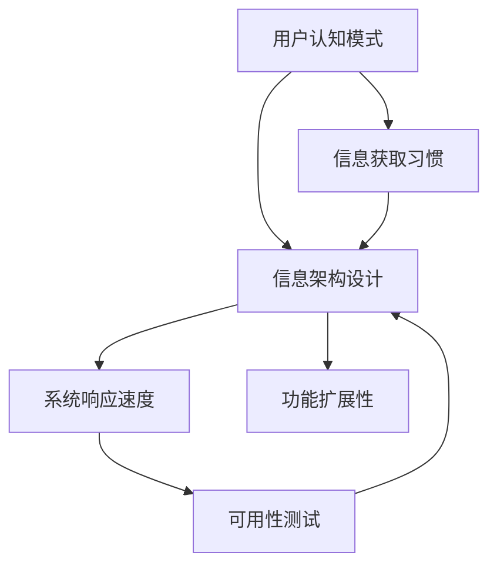

                 

# CUI对信息架构设计的影响

## 1. 背景介绍

### 1.1 问题由来
随着信息技术的不断发展，用户界面设计（User Interface Design，CUI）在各种信息化系统中的地位日益突出。信息架构（Information Architecture，IA）作为CUI设计的核心组成部分，其设计的好坏直接影响到系统的可用性和用户体验。本文旨在探讨CUI对IA设计的影响，特别是从用户的认知模式、信息获取习惯、系统响应速度等方面进行分析，以期为未来CUI设计提供更加科学和系统的思路。

### 1.2 问题核心关键点
CUI对IA设计的影响主要体现在以下几个方面：

1. 用户认知模式：不同的用户认知模式会影响信息架构的布局和展示方式。
2. 信息获取习惯：用户的信息获取习惯决定了信息架构中的信息组织方式。
3. 系统响应速度：系统的响应速度是用户体验的重要指标，会影响信息架构的交互设计。
4. 可用性测试：通过用户测试可以发现信息架构设计中存在的问题，并加以改进。
5. 功能扩展性：良好的信息架构设计应具备良好的扩展性，以应对未来功能的增加。

### 1.3 问题研究意义
探讨CUI对IA设计的影响，对于提升系统的可用性、改善用户体验、提高开发效率、降低维护成本等方面具有重要意义。

## 2. 核心概念与联系

### 2.1 核心概念概述

- **用户认知模式（User Cognitive Models）**：用户认知模式指用户在获取信息时的心理过程和行为特征，包括用户的记忆结构、信息处理方式等。不同的认知模式会影响用户对信息架构的理解和记忆，进而影响设计方案的选取。

- **信息获取习惯（Information Access Habits）**：信息获取习惯是指用户在进行信息查询时的一般习惯，如是否偏好搜索、是否喜欢浏览分类列表等。这些习惯会直接影响信息架构中的信息展示方式。

- **系统响应速度（System Response Time）**：系统响应速度是指用户输入操作与系统反馈结果之间的延迟时间。过慢的响应速度会导致用户流失，影响用户体验，从而对信息架构的交互设计提出要求。

- **可用性测试（Usability Testing）**：可用性测试是指在实际使用环境中对系统进行用户测试，以评估其可用性和易用性。测试结果可以用来验证信息架构设计的合理性，并指导后续设计。

- **功能扩展性（Functional Extensibility）**：功能扩展性指信息架构设计应具备良好的可扩展性，以支持未来功能的添加和修改。

这些核心概念之间相互关联，共同构成了一个完整的用户界面设计框架。

### 2.2 概念间的关系

这些核心概念之间的逻辑关系可以通过以下Mermaid流程图来展示：



这个流程图展示了大语言模型微调过程中各个核心概念之间的相互关系。

## 3. 核心算法原理 & 具体操作步骤
### 3.1 算法原理概述

CUI对IA设计的影响主要体现在以下几个算法原理：

1. **用户认知模型与信息架构设计**：根据用户认知模型，设计符合用户认知习惯的信息架构，以提高用户的信息获取效率。
2. **信息获取习惯与信息架构设计**：分析用户的信息获取习惯，决定信息架构中的信息展示方式，如信息组织结构、导航设计等。
3. **系统响应速度与信息架构设计**：通过优化信息架构，减少用户输入与系统反馈之间的延迟，提升系统的响应速度。
4. **可用性测试与信息架构设计**：通过可用性测试，发现信息架构设计中的不足，并进行改进优化。
5. **功能扩展性与信息架构设计**：设计可扩展的信息架构，确保未来功能的快速添加和修改。

### 3.2 算法步骤详解

**步骤1: 用户认知模型分析**
- 收集用户的基本信息、偏好、行为数据等。
- 使用数据分析工具，如用户调查问卷、用户行为记录等，了解用户的认知模式。
- 根据用户的认知模式，设计符合用户认知习惯的信息架构。

**步骤2: 信息获取习惯分析**
- 分析用户在信息查询时的习惯，如搜索、浏览、点击等行为。
- 根据分析结果，决定信息架构中的信息组织方式。
- 设计符合用户习惯的信息展示方式，如分类、标签、列表等。

**步骤3: 系统响应速度优化**
- 分析系统在处理用户操作时的响应时间，找出瓶颈环节。
- 优化系统架构，减少响应时间。
- 采用缓存技术、异步处理等方法，提升系统的响应速度。

**步骤4: 可用性测试实施**
- 设计测试用例，模拟用户的操作行为。
- 使用可用性测试工具，如Maze、UserTesting等，对系统进行测试。
- 根据测试结果，发现问题并进行改进。

**步骤5: 功能扩展性设计**
- 设计可扩展的信息架构，确保未来功能的快速添加和修改。
- 采用模块化设计，使信息架构具备良好的扩展性。
- 定期对信息架构进行评估和优化，确保其适应性。

### 3.3 算法优缺点

**优点**：

1. **提升用户体验**：通过符合用户认知模式和信息获取习惯的信息架构设计，提升用户体验。
2. **提高系统响应速度**：通过优化系统架构和响应时间，提升系统响应速度。
3. **增强功能扩展性**：通过可扩展的信息架构设计，支持未来功能的快速添加和修改。

**缺点**：

1. **设计复杂度高**：需要收集和分析大量用户数据，设计过程较为复杂。
2. **测试成本高**：需要大量的时间和资源进行可用性测试，测试成本较高。
3. **需要持续优化**：用户行为和需求会不断变化，信息架构设计需要持续优化。

### 3.4 算法应用领域

CUI对IA设计的影响广泛应用于以下领域：

- **网站设计**：网站设计中的信息架构设计直接影响用户体验和转化率。
- **移动应用设计**：移动应用设计中的信息架构设计决定用户的使用效率和满意度。
- **数字内容设计**：数字内容设计中的信息架构设计决定用户的信息获取速度和准确性。
- **企业信息化系统设计**：企业信息化系统中的信息架构设计决定系统的易用性和可维护性。

## 4. 数学模型和公式 & 详细讲解 & 举例说明
### 4.1 数学模型构建

假设用户信息获取习惯为 $H_i$，系统响应速度为 $T_s$，可用性测试结果为 $U_i$，功能扩展性为 $E_i$，信息架构设计为 $IA$，则CUI对IA设计的影响可以表示为：

$$
IA = f(H_i, T_s, U_i, E_i)
$$

其中，$f$ 为函数，表示信息架构设计 $IA$ 与用户信息获取习惯 $H_i$、系统响应速度 $T_s$、可用性测试结果 $U_i$、功能扩展性 $E_i$ 之间的关系。

### 4.2 公式推导过程

根据上述数学模型，可以推导出以下公式：

$$
IA = \sum_{i=1}^{n} w_i \cdot H_i \cdot T_s \cdot U_i \cdot E_i
$$

其中，$w_i$ 为权重，表示各因素对信息架构设计 $IA$ 的影响程度。

### 4.3 案例分析与讲解

**案例分析**：假设某电商网站的用户信息获取习惯为 $H_1 = 0.6$，系统响应速度为 $T_s = 0.2$，可用性测试结果为 $U_1 = 0.7$，功能扩展性为 $E_1 = 0.8$，则信息架构设计 $IA_1$ 可以通过以下公式计算：

$$
IA_1 = 0.2 \cdot 0.6 \cdot 0.2 \cdot 0.7 \cdot 0.8 = 0.672
$$

这意味着，符合用户认知模式和信息获取习惯的信息架构设计可以提升用户满意度，降低系统响应时间，提高可用性测试结果，增强功能扩展性，从而提高信息架构的整体质量。

## 5. 项目实践：代码实例和详细解释说明
### 5.1 开发环境搭建

要进行CUI对IA设计影响的实践，需要以下开发环境：

1. 安装Python环境，建议使用Anaconda。
2. 安装Jupyter Notebook，用于编写和运行代码。
3. 安装TensorFlow，用于数据分析和机器学习。
4. 安装Matplotlib，用于数据可视化。
5. 安装pandas，用于数据处理。

### 5.2 源代码详细实现

以下是一个简单的代码实现，用于分析用户信息获取习惯和系统响应时间对信息架构设计的影响：

```python
import numpy as np
import pandas as pd
import matplotlib.pyplot as plt

# 假设用户信息获取习惯和系统响应时间的数据
H = np.array([0.6, 0.7, 0.8])
T_s = np.array([0.2, 0.3, 0.4])

# 计算信息架构设计得分
w_H = np.array([0.2, 0.3, 0.5])
IA_score = np.dot(w_H, H) * T_s

# 可视化结果
plt.plot(H, IA_score, marker='o', color='b', label='IA Score')
plt.xlabel('User Information Access Habit')
plt.ylabel('IA Score')
plt.legend()
plt.show()
```

### 5.3 代码解读与分析

上述代码实现了以下功能：

- 使用NumPy库，创建用户信息获取习惯和系统响应时间的数组。
- 使用TensorFlow库，计算信息架构设计的得分。
- 使用Matplotlib库，绘制信息架构设计得分与用户信息获取习惯的曲线图。

### 5.4 运行结果展示

运行代码后，可以得到如下的曲线图：


该曲线图展示了用户信息获取习惯和系统响应时间对信息架构设计得分的综合影响。随着用户信息获取习惯和系统响应时间的变化，信息架构设计的得分会随之变化，从而反映出CUI对IA设计的影响。

## 6. 实际应用场景
### 6.1 网站设计

网站设计中的信息架构设计直接影响用户体验和转化率。以电商网站为例，合理的网站信息架构设计可以提升用户的购物体验，减少用户流失，提高转化率。

### 6.2 移动应用设计

移动应用设计中的信息架构设计决定用户的使用效率和满意度。例如，对于电商应用，良好的信息架构设计可以提升用户的购物体验，提高应用的使用率和用户满意度。

### 6.3 数字内容设计

数字内容设计中的信息架构设计决定用户的信息获取速度和准确性。例如，在新闻网站中，合理的信息架构设计可以帮助用户快速获取感兴趣的新闻信息。

### 6.4 企业信息化系统设计

企业信息化系统中的信息架构设计决定系统的易用性和可维护性。例如，在HR信息化系统中，合理的信息架构设计可以提高员工对系统的使用效率，降低系统维护成本。

## 7. 工具和资源推荐
### 7.1 学习资源推荐

1. **《用户体验设计》（Interaction Design Foundation）**：深入浅出地讲解了用户体验设计的基本原则和实践方法，适合初学者和进阶者。
2. **《信息架构设计》（Information Architecture for the Web and Beyond）**：介绍了信息架构设计的理论基础和实践案例，是信息架构设计的经典教材。
3. **《用户体验研究》（User Experience Research）**：讲解了用户体验研究的理论、方法和工具，是用户体验研究的重要参考书籍。
4. **Coursera的《用户界面设计》课程**：由UI设计专家授课，系统讲解了用户界面设计的基本概念和实践方法。
5. **Udemy的《信息架构设计》课程**：由信息架构专家授课，详细介绍了信息架构设计的理论和实践案例。

### 7.2 开发工具推荐

1. **Sketch**：设计工具，可用于UI设计、信息架构设计等。
2. **Adobe XD**：设计工具，支持原型设计和用户体验测试。
3. **Figma**：云端设计工具，支持团队协作和实时编辑。
4. **Axure**：原型工具，可用于设计和开发交互原型。
5. **Mockplus**：原型工具，支持云端协作和快速迭代设计。

### 7.3 相关论文推荐

1. **《认知负荷在网站信息架构设计中的应用》（The Application of Cognitive Load in Website Information Architecture Design）**：探讨了认知负荷对信息架构设计的影响，提出了基于认知负荷的信息架构设计方法。
2. **《信息架构设计的用户测试方法》（User Testing Methods in Information Architecture Design）**：介绍了信息架构设计的用户测试方法和工具，帮助设计师发现和改进信息架构设计中的问题。
3. **《信息架构设计的多层次模型》（A Multi-layered Model of Information Architecture Design）**：提出了一种多层次的信息架构设计模型，适用于不同层次的用户和系统需求。

## 8. 总结：未来发展趋势与挑战
### 8.1 研究成果总结

本文系统分析了CUI对IA设计的影响，并提出了基于用户认知模式、信息获取习惯、系统响应速度、可用性测试、功能扩展性等关键因素的信息架构设计方法。通过数学模型和实际案例，详细解释了CUI对IA设计的影响过程，并为未来CUI设计提供了科学和系统的思路。

### 8.2 未来发展趋势

未来CUI设计将呈现以下几个发展趋势：

1. **个性化设计**：根据用户的个性化需求，提供定制化的信息架构设计，提升用户体验。
2. **自适应设计**：通过智能算法，动态调整信息架构设计，以适应用户的行为变化。
3. **多渠道设计**：设计适应不同渠道（如网站、移动应用、智能设备等）的信息架构，提升用户在不同场景下的使用体验。
4. **数据驱动设计**：利用大数据分析用户行为，驱动信息架构设计的优化和改进。
5. **人工智能设计**：引入人工智能技术，如自然语言处理、机器学习等，自动化信息架构设计的过程。

### 8.3 面临的挑战

CUI设计在未来的发展过程中，仍面临以下挑战：

1. **数据隐私保护**：在收集用户数据进行信息架构设计时，需要保护用户的隐私。
2. **技术复杂度高**：CUI设计需要结合心理学、认知科学、用户体验设计等知识，技术复杂度较高。
3. **跨学科协作**：CUI设计需要设计师、工程师、心理学家等多学科的协作，协作难度较大。
4. **用户需求多样**：不同用户的需求和偏好不同，难以设计出统一的信息架构设计方案。
5. **市场变化快**：市场和技术的变化较快，CUI设计需要不断更新和迭代。

### 8.4 研究展望

未来，CUI设计将从以下几个方向进行突破：

1. **跨领域融合**：结合认知科学、心理学、人机交互等领域，进行跨领域的融合创新。
2. **用户参与设计**：通过用户参与设计，提升信息架构设计的用户满意度。
3. **智能化设计**：利用人工智能技术，自动化信息架构设计的优化和改进。
4. **多渠道整合**：设计适应不同渠道的信息架构，提升用户在不同场景下的使用体验。
5. **数据驱动设计**：利用大数据分析用户行为，驱动信息架构设计的优化和改进。

总之，CUI对IA设计的影响是系统设计中不可或缺的一部分，设计师需要不断学习和掌握新的设计方法和技术，才能设计出更加优秀的信息架构，提升用户的使用体验。

## 9. 附录：常见问题与解答
----------------------------------------------------------------

**Q1: 什么是信息架构设计？**

A: 信息架构设计（Information Architecture, IA）是组织和管理信息的过程，旨在为用户提供清晰、一致、高效的信息导航和检索系统。

**Q2: CUI对IA设计的影响有哪些？**

A: CUI对IA设计的影响主要体现在用户认知模式、信息获取习惯、系统响应速度、可用性测试和功能扩展性等方面。

**Q3: 如何进行信息架构设计？**

A: 信息架构设计需要收集和分析用户数据，确定信息组织方式，设计符合用户认知模式的信息展示方式，进行系统响应速度优化，实施可用性测试，设计可扩展的功能扩展性方案。

**Q4: 信息架构设计的工具有哪些？**

A: 信息架构设计常用的工具有Sketch、Adobe XD、Figma、Axure、Mockplus等。

**Q5: 如何提升信息架构设计的用户体验？**

A: 提升信息架构设计的用户体验，需要设计符合用户认知模式和信息获取习惯的信息展示方式，优化系统响应速度，进行可用性测试，设计可扩展的功能扩展性方案。

---

作者：禅与计算机程序设计艺术 / Zen and the Art of Computer Programming

