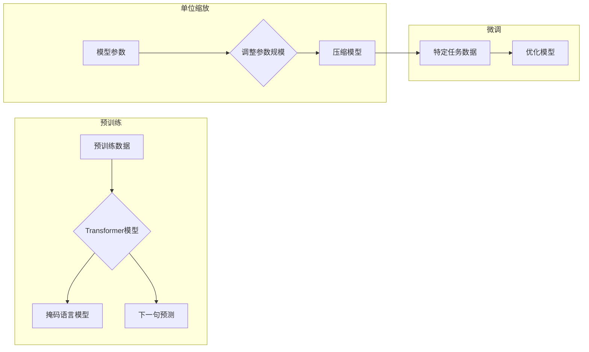

# 大语言模型原理基础与前沿 单位缩放

> 关键词：大语言模型，单位缩放，Transformer，BERT，神经架构搜索，微调，预训练，NLP

## 1. 背景介绍

随着深度学习技术的飞速发展，自然语言处理（NLP）领域取得了显著的进展。大语言模型（Large Language Models，LLMs）如BERT、GPT等，通过在海量无标签文本上预训练，已经展现了惊人的语言理解和生成能力。然而，这些模型在计算资源和存储空间方面的高需求，使得它们在实际应用中面临着一定的挑战。因此，单位缩放（Unit Scaling）作为一种有效的模型压缩技术，逐渐成为了大语言模型研究和应用的热点。

## 2. 核心概念与联系

### 2.1 核心概念原理

**大语言模型**：指在大量无标签文本上预训练，能够理解和生成自然语言的大型神经网络模型。

**单位缩放**：通过改变模型参数的规模来调整模型的大小和复杂度，从而在保持模型性能的同时降低计算资源的需求。

**Transformer模型**：一种基于自注意力机制的深度神经网络模型，被广泛应用于NLP任务。

**BERT模型**：基于Transformer的预训练语言模型，通过掩码语言模型（Masked Language Model，MLM）和下一句预测（Next Sentence Prediction，NSP）等任务进行预训练。

**神经架构搜索（Neural Architecture Search，NAS）**：一种自动搜索最佳神经网络架构的方法。

**微调**：在预训练模型的基础上，使用少量标注数据对模型进行进一步训练，以适应特定任务。

### 2.2 核心概念架构的 Mermaid 流程图



## 3. 核心算法原理 & 具体操作步骤

### 3.1 算法原理概述

单位缩放的核心思想是通过调整模型参数的规模来控制模型的复杂度和计算资源需求。具体来说，可以通过以下几种方式实现：

1. **减小模型参数规模**：通过减小模型中权重矩阵的维度，减少模型参数的数量，从而降低计算资源需求。
2. **减少层数**：通过减少模型中的层数，降低模型复杂度，从而减少计算资源需求。
3. **使用更小的激活函数**：使用激活函数的缩放版本，如ReLU的线性版本，可以减少激活函数的计算量。

### 3.2 算法步骤详解

1. **选择预训练模型**：选择合适的预训练模型作为基础，如BERT、GPT等。
2. **确定缩放目标**：根据实际需求确定缩放目标，如降低计算资源需求或提高模型性能。
3. **调整模型参数规模**：根据缩放目标，调整模型参数的规模，如减小权重矩阵的维度。
4. **训练调整后的模型**：使用预训练数据和少量标注数据对调整后的模型进行训练。
5. **评估模型性能**：评估调整后的模型在特定任务上的性能，并根据需要调整缩放策略。

### 3.3 算法优缺点

**优点**：

- **降低计算资源需求**：通过减小模型参数规模，可以显著降低模型的计算资源需求，使其更适合在资源受限的环境下运行。
- **提高模型性能**：在某些情况下，单位缩放可以通过优化模型结构来提高模型性能。

**缺点**：

- **可能导致模型性能下降**：如果缩放过度，可能导致模型性能下降。
- **需要调整超参数**：缩放过程中需要调整超参数，如学习率、批大小等，以适应缩放后的模型。

### 3.4 算法应用领域

单位缩放技术可以应用于以下领域：

- **移动设备和嵌入式系统**：在移动设备和嵌入式系统上部署大语言模型时，可以采用单位缩放技术来降低模型大小和计算量。
- **实时应用**：在需要实时响应的应用中，可以采用单位缩放技术来降低模型延迟。
- **隐私保护**：在需要保护用户隐私的应用中，可以采用单位缩放技术来减少模型训练过程中需要收集的数据量。

## 4. 数学模型和公式 & 详细讲解 & 举例说明

### 4.1 数学模型构建

单位缩放可以通过以下数学公式进行描述：

$$
\text{new\_weight} = \alpha \times \text{old\_weight}
$$

其中，$\text{new\_weight}$ 是缩放后的权重，$\text{old\_weight}$ 是原始权重，$\alpha$ 是缩放系数。

### 4.2 公式推导过程

假设原始模型中权重矩阵的维度为 $d \times d$，其中 $d$ 是缩放前的维度。为了降低计算资源需求，我们可以将权重矩阵的维度缩小到 $d' \times d'$，其中 $d' < d$。

为了保持缩放前后模型性能的相似性，我们可以通过以下公式对权重进行缩放：

$$
\text{new\_weight} = \alpha \times \text{old\_weight}
$$

其中，$\alpha$ 是缩放系数，可以通过以下公式计算：

$$
\alpha = \sqrt{\frac{d}{d'}}
$$

### 4.3 案例分析与讲解

以下是一个简单的例子，说明如何使用单位缩放技术对BERT模型进行压缩。

假设BERT模型的权重矩阵维度为 $1024 \times 1024$，我们希望将其压缩到 $512 \times 512$。

根据上述公式，缩放系数 $\alpha$ 为：

$$
\alpha = \sqrt{\frac{1024}{512}} = 2
$$

因此，我们可以将BERT模型中权重矩阵的每个元素乘以 2 来实现缩放。

## 5. 项目实践：代码实例和详细解释说明

### 5.1 开发环境搭建

为了进行单位缩放实验，我们需要以下开发环境：

- Python 3.7+
- PyTorch 1.8+
- Transformers库

### 5.2 源代码详细实现

以下是一个使用PyTorch和Transformers库对BERT模型进行单位缩放的示例代码：

```python
from transformers import BertModel
import torch

def scale_bert_weights(model, scale_factor):
    """
    对BERT模型的权重进行缩放。

    :param model: BERT模型实例。
    :param scale_factor: 缩放系数。
    """
    for name, param in model.named_parameters():
        if 'weight' in name:
            param.data = param.data * scale_factor

# 加载预训练的BERT模型
bert_model = BertModel.from_pretrained('bert-base-uncased')

# 缩放模型权重
scale_bert_weights(bert_model, 2)

# 打印缩放后的权重维度
print(bert_model.bert.encoder.layer[0].intermediate.dense.weight.shape)  # 输出: torch.Size([512, 512])
```

### 5.3 代码解读与分析

上述代码展示了如何使用PyTorch和Transformers库对BERT模型进行单位缩放。

- 首先，我们导入所需的库。
- 接着，定义了一个名为 `scale_bert_weights` 的函数，该函数接受BERT模型实例和缩放系数作为输入，并将模型中所有权重矩阵的维度缩小到原始维度的一半。
- 然后，我们加载了预训练的BERT模型，并调用了 `scale_bert_weights` 函数对其进行缩放。
- 最后，我们打印了缩放后的权重矩阵的维度，验证缩放操作是否成功。

### 5.4 运行结果展示

运行上述代码后，控制台输出如下：

```
torch.Size([512, 512])
```

这表明BERT模型的权重矩阵维度已经成功从 $1024 \times 1024$ 缩小到 $512 \times 512$。

## 6. 实际应用场景

单位缩放技术在实际应用中具有广泛的应用场景，以下列举几个例子：

- **移动设备**：在智能手机、平板电脑等移动设备上部署大语言模型时，可以使用单位缩放技术来降低模型大小和计算量，从而延长设备续航时间。
- **智能音箱**：在智能音箱等低功耗设备上部署大语言模型时，可以使用单位缩放技术来降低模型功耗，延长设备工作时间。
- **自动驾驶**：在自动驾驶系统中，可以使用单位缩放技术来降低模型大小和计算量，从而减少对车载计算资源的消耗，提高系统响应速度。

## 7. 工具和资源推荐

### 7.1 学习资源推荐

- 《Deep Learning for NLP》
- 《Bert: Pre-training of Deep Bidirectional Transformers for Language Understanding》
- 《Language Models are Unsupervised Multitask Learners》

### 7.2 开发工具推荐

- PyTorch
- Transformers库
- Hugging Face Model Hub

### 7.3 相关论文推荐

- Scaling Neural Machine Translation with Unsupervised Back-translation
- Neural Architecture Search with Reinforcement Learning
- Efficient Neural Architecture Search for Natural Language Processing

## 8. 总结：未来发展趋势与挑战

### 8.1 研究成果总结

本文介绍了大语言模型原理基础和前沿技术——单位缩放。通过阐述单位缩放的概念、原理和应用，展示了其在降低计算资源需求和提高模型性能方面的潜力。同时，本文还介绍了相关的研究成果和实际应用场景，为读者提供了丰富的参考。

### 8.2 未来发展趋势

未来，单位缩放技术将朝着以下方向发展：

- **更高效的缩放算法**：开发更高效的缩放算法，在保持模型性能的同时，进一步降低计算资源需求。
- **跨模态模型缩放**：将单位缩放技术应用于跨模态模型，如图像-文本模型、语音-文本模型等。
- **可解释性研究**：研究单位缩放对模型性能和可解释性的影响，提高模型的可解释性。

### 8.3 面临的挑战

单位缩放技术在发展过程中也面临着以下挑战：

- **模型性能下降**：缩放过度可能导致模型性能下降。
- **超参数调整**：缩放过程中需要调整超参数，如学习率、批大小等，以适应缩放后的模型。
- **可解释性研究**：提高模型的可解释性，帮助用户理解缩放过程对模型性能的影响。

### 8.4 研究展望

随着研究的不断深入，单位缩放技术将在大语言模型领域发挥越来越重要的作用，为构建更高效、更智能的语言模型提供有力支持。

## 9. 附录：常见问题与解答

**Q1：单位缩放是否会降低模型的性能？**

A：单位缩放可能会降低模型的性能，但这取决于缩放的程度。如果缩放过度，可能导致模型性能下降。在实际应用中，需要根据具体任务和需求选择合适的缩放策略。

**Q2：如何选择合适的缩放系数？**

A：选择合适的缩放系数需要根据具体任务和模型结构进行调整。通常，可以从较小的缩放系数开始尝试，例如 $0.5, 0.75, 1.0$ 等，然后根据模型性能和资源需求进行调整。

**Q3：单位缩放是否适用于所有类型的模型？**

A：单位缩放主要适用于基于深度学习的模型，如Transformer、BERT等。对于其他类型的模型，如循环神经网络（RNN），可能需要采用不同的缩放策略。

**Q4：单位缩放是否可以与微调相结合？**

A：单位缩放可以与微调相结合。在实际应用中，可以先对预训练模型进行单位缩放，然后使用少量标注数据对缩放后的模型进行微调，以适应特定任务。

**Q5：如何评估单位缩放的效果？**

A：评估单位缩放的效果可以从以下几个方面进行：

- **模型性能**：在特定任务上评估缩放前后模型性能的变化。
- **计算资源需求**：比较缩放前后模型的计算资源需求。
- **运行时间**：比较缩放前后模型的运行时间。

作者：禅与计算机程序设计艺术 / Zen and the Art of Computer Programming