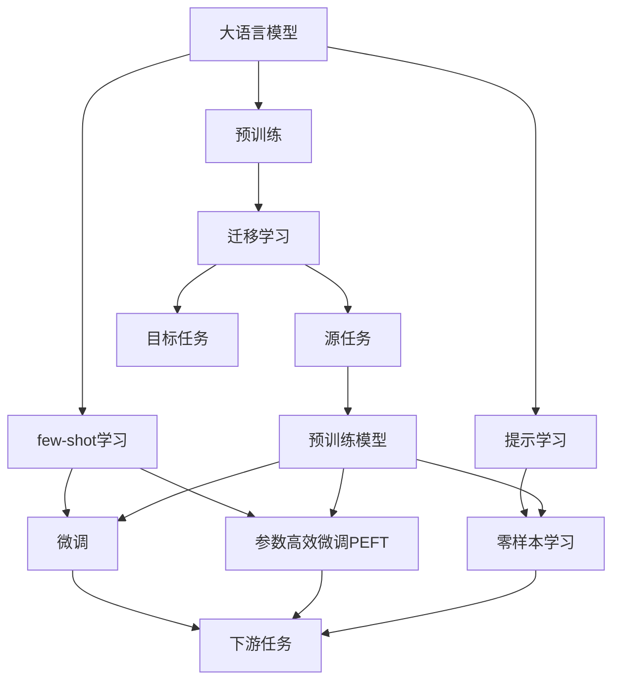
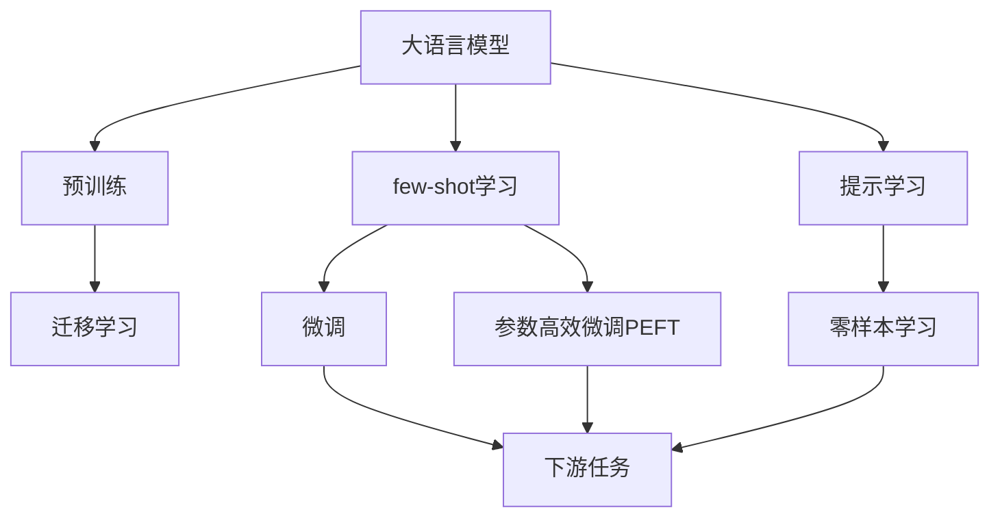
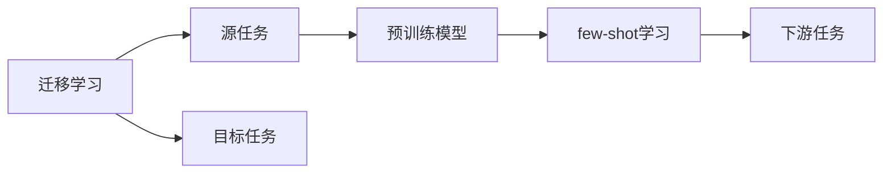
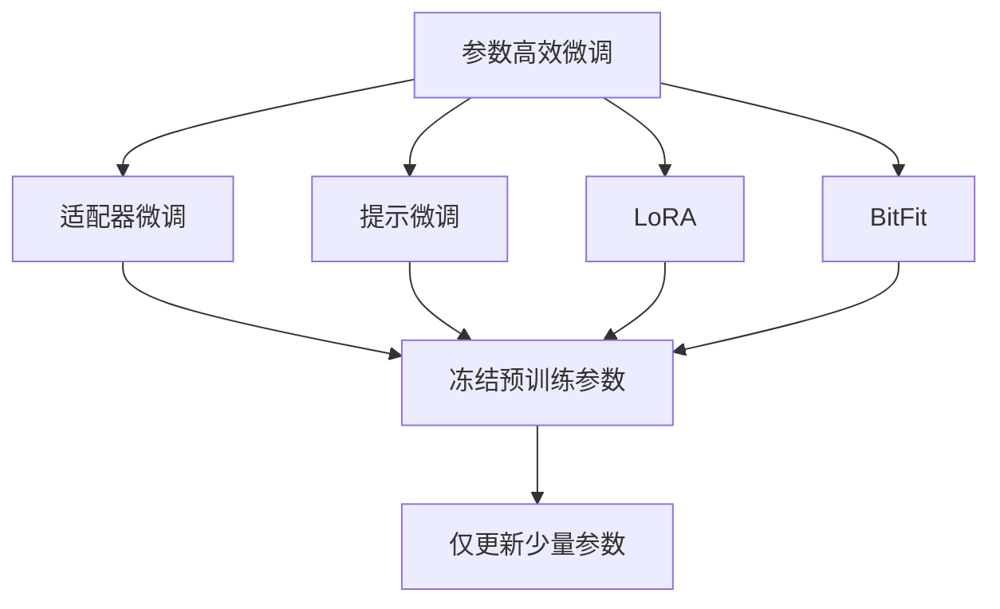
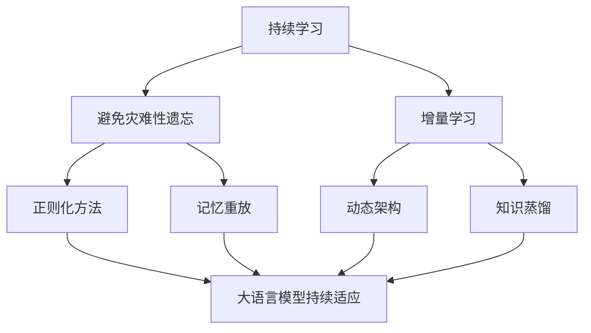
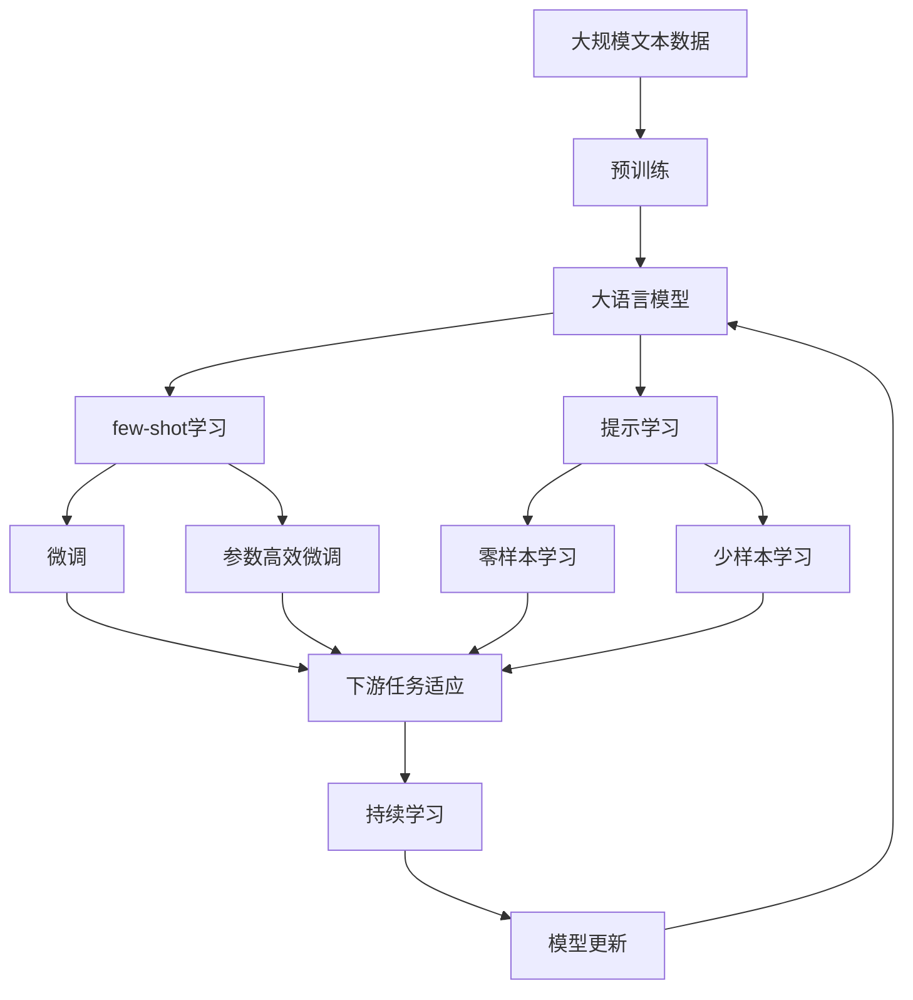

                 

# 大语言模型的few-shot学习原理与代码实例讲解

## 1. 背景介绍

### 1.1 问题由来

随着深度学习技术的迅猛发展，大语言模型（Large Language Models, LLMs）如OpenAI的GPT-3和Google的BERT等在自然语言处理（NLP）领域取得了显著的进步。这些模型通过在大规模无标签文本数据上进行预训练，学习到了丰富的语言知识，能够进行各种复杂的自然语言处理任务，如文本分类、命名实体识别、问答等。然而，由于预训练数据集通常是非常大规模的，训练这些模型需要大量的计算资源和长时间。

为了降低预训练的资源需求，研究人员提出了few-shot学习（Few-shot Learning）的概念。few-shot学习指模型仅基于少量样本（一般少于50个样本）即可完成新任务的学习，从而在计算资源和时间成本方面显著优于传统的预训练+微调方法。这使得大语言模型可以更加灵活地应用于各种实际应用场景，特别是在计算资源受限的条件下。

### 1.2 问题核心关键点

few-shot学习的核心思想是利用大语言模型在预训练过程中学习到的语言知识和结构化表示，通过少量样本即可完成特定任务的推理和学习。few-shot学习主要包括以下几个关键点：

1. **样本数量少**：few-shot学习模型仅使用少量样本（一般少于50个样本）进行训练。
2. **泛化能力强**：尽管训练数据少，但模型具有很强的泛化能力，能够在新的、未见过的数据上进行推理和生成。
3. **高效适应性**：few-shot学习模型可以快速适应新任务，而无需进行大规模的重新训练。
4. **零样本学习**：在某些情况下，few-shot学习模型可以在没有任何训练数据的情况下进行推理，即零样本学习（Zero-shot Learning）。

### 1.3 问题研究意义

few-shot学习在NLP领域具有重要的研究意义：

1. **资源效率**：few-shot学习可以显著降低预训练和微调所需的资源和成本，使得大语言模型更加实用。
2. **任务灵活性**：few-shot学习使得模型可以快速适应新任务，提升模型的应用灵活性。
3. **实时性**：few-shot学习可以在短时间内完成新任务的推理，提高实时性。
4. **跨领域能力**：few-shot学习模型具有很强的跨领域迁移能力，可以在不同领域之间进行知识迁移。
5. **零样本能力**：在某些情况下，few-shot学习模型能够进行零样本推理，无需进行任何训练。

## 2. 核心概念与联系

### 2.1 核心概念概述

为了更好地理解few-shot学习的原理，本节将介绍几个密切相关的核心概念：

- **大语言模型（Large Language Model, LLM）**：一种通过在大规模文本数据上进行预训练学习通用语言表示的模型，如GPT-3、BERT等。
- **few-shot学习（Few-shot Learning）**：一种通过少量样本完成新任务学习的技术，不需要大规模的预训练和微调。
- **提示学习（Prompt Learning）**：一种通过精心设计提示模板（Prompt Template）引导模型进行推理和生成的技术，无需更新模型参数。
- **零样本学习（Zero-shot Learning）**：模型在没有任何训练数据的情况下，仅凭任务描述进行推理和生成。
- **迁移学习（Transfer Learning）**：将预训练模型在源任务上学习到的知识迁移到目标任务上，通过微调或提示学习实现。
- **参数高效微调（Parameter-Efficient Fine-Tuning, PEFT）**：一种只更新少量模型参数的微调方法，减少计算资源消耗。
- **对抗训练（Adversarial Training）**：通过引入对抗样本提高模型鲁棒性，避免过拟合。

这些核心概念之间的逻辑关系可以通过以下Mermaid流程图来展示：



这个流程图展示了从预训练到大语言模型微调、few-shot学习、提示学习、零样本学习等不同技术之间的关系，以及它们如何共同构成大语言模型微调的生态系统。

### 2.2 概念间的关系

这些核心概念之间存在着紧密的联系，形成了few-shot学习的大语言模型微调方法的整体框架。下面我们通过几个Mermaid流程图来展示这些概念之间的关系。

#### 2.2.1 大语言模型的学习范式



这个流程图展示了few-shot学习的基本原理，以及它与预训练、微调、参数高效微调和零样本学习等技术之间的关系。

#### 2.2.2 迁移学习与few-shot学习的关系



这个流程图展示了迁移学习的基本原理，以及它如何与few-shot学习、预训练等技术相结合，实现新任务的推理和学习。

#### 2.2.3 参数高效微调方法



这个流程图展示了几种常见的参数高效微调方法，包括适配器微调、提示微调、LoRA和BitFit。这些方法的共同特点是冻结大部分预训练参数，只更新少量参数，从而提高微调效率。

#### 2.2.4 持续学习在大语言模型中的应用



这个流程图展示了持续学习在大语言模型中的应用。持续学习的主要目标是避免灾难性遗忘和实现增量学习。通过正则化方法、记忆重放、动态架构和知识蒸馏等技术，可以使大语言模型持续适应新的任务和数据。

### 2.3 核心概念的整体架构

最后，我们用一个综合的流程图来展示这些核心概念在大语言模型few-shot学习微调过程中的整体架构：



这个综合流程图展示了从预训练到few-shot学习、提示学习、持续学习等的完整过程。大语言模型首先在大规模文本数据上进行预训练，然后通过few-shot学习、提示学习等技术实现微调，最后通过持续学习技术不断更新和适应新的任务和数据。通过这些流程图，我们可以更清晰地理解few-shot学习在大语言模型微调过程中的各个环节。

## 3. 核心算法原理 & 具体操作步骤

### 3.1 算法原理概述

few-shot学习的核心思想是利用大语言模型在预训练过程中学习到的语言知识和结构化表示，通过少量样本即可完成特定任务的推理和学习。其基本原理可以总结如下：

1. **数据集划分**：将数据集划分为训练集、验证集和测试集，通常要求训练集和测试集的数据分布一致。
2. **提示设计**：设计合适的提示模板（Prompt Template），将任务描述嵌入其中，引导模型进行推理和生成。
3. **模型微调**：使用训练集对大语言模型进行微调，优化模型参数以适应特定任务。
4. **零样本推理**：在没有任何训练数据的情况下，使用提示模板进行零样本推理，无需更新模型参数。

### 3.2 算法步骤详解

few-shot学习的基本步骤如下：

**Step 1: 准备预训练模型和数据集**

- 选择合适的预训练语言模型 $M_{\theta}$ 作为初始化参数，如 GPT-3、BERT 等。
- 准备下游任务的标注数据集 $D=\{(x_i, y_i)\}_{i=1}^N$，划分为训练集、验证集和测试集。一般要求标注数据与预训练数据的分布不要差异过大。

**Step 2: 设计提示模板**

- 根据任务类型，设计合适的提示模板（Prompt Template）。例如，对于分类任务，可以使用类似 "给定一个文本，预测其属于哪个类别" 的模板。
- 将提示模板嵌入模型输入，通常将提示模板拼接在文本前面或后面，作为模型的额外输入。

**Step 3: 设置微调超参数**

- 选择合适的优化算法及其参数，如 Adam、SGD 等，设置学习率、批大小、迭代轮数等。
- 设置正则化技术及强度，包括权重衰减、Dropout、Early Stopping 等。
- 确定冻结预训练参数的策略，如仅微调顶层，或全部参数都参与微调。

**Step 4: 执行梯度训练**

- 将训练集数据分批次输入模型，前向传播计算损失函数。
- 反向传播计算参数梯度，根据设定的优化算法和学习率更新模型参数。
- 周期性在验证集上评估模型性能，根据性能指标决定是否触发 Early Stopping。
- 重复上述步骤直到满足预设的迭代轮数或 Early Stopping 条件。

**Step 5: 测试和部署**

- 在测试集上评估微调后模型 $M_{\hat{\theta}}$ 的性能，对比微调前后的精度提升。
- 使用微调后的模型对新样本进行推理预测，集成到实际的应用系统中。
- 持续收集新的数据，定期重新微调模型，以适应数据分布的变化。

### 3.3 算法优缺点

few-shot学习具有以下优点：

1. **数据需求少**：few-shot学习只需要少量样本即可完成任务学习，显著降低对标注数据的依赖。
2. **泛化能力强**：尽管训练数据少，few-shot学习模型仍能表现出较强的泛化能力，在新的数据上表现良好。
3. **高效适应性**：few-shot学习模型可以快速适应新任务，无需进行大规模的重新训练。
4. **零样本能力**：在某些情况下，few-shot学习模型能够进行零样本推理，无需进行任何训练。

同时，few-shot学习也存在一些局限性：

1. **任务特定性**：few-shot学习的效果依赖于提示模板的设计，不同任务可能需要不同的提示模板。
2. **泛化性不足**：当任务与预训练数据的分布差异较大时，few-shot学习的效果可能不佳。
3. **提示模板设计复杂**：设计合适的提示模板需要丰富的经验和技能，难以自动生成。
4. **性能不稳定**：few-shot学习模型的性能不稳定，容易受到输入样本的影响。

尽管存在这些局限性，但few-shot学习在实际应用中已经展现出了显著的优势，特别是在计算资源受限的条件下。未来相关研究的重点在于如何进一步提高few-shot学习的泛化能力和提示模板的设计效率。

### 3.4 算法应用领域

few-shot学习在NLP领域已经得到了广泛的应用，覆盖了几乎所有常见任务，例如：

- 文本分类：如情感分析、主题分类、意图识别等。通过few-shot学习，模型能够在少量样本上学习文本-标签映射。
- 命名实体识别：识别文本中的人名、地名、机构名等特定实体。通过few-shot学习，模型能够学习实体边界和类型。
- 关系抽取：从文本中抽取实体之间的语义关系。通过few-shot学习，模型能够学习实体-关系三元组。
- 问答系统：对自然语言问题给出答案。通过few-shot学习，模型能够在少量问题-答案对上学习匹配答案。
- 机器翻译：将源语言文本翻译成目标语言。通过few-shot学习，模型能够学习语言-语言映射。
- 文本摘要：将长文本压缩成简短摘要。通过few-shot学习，模型能够在少量文章-摘要对上学习抓取要点。
- 对话系统：使机器能够与人自然对话。通过few-shot学习，模型能够在多轮对话历史上的提示下进行回复生成。

除了上述这些经典任务外，few-shot学习还被创新性地应用到更多场景中，如可控文本生成、常识推理、代码生成、数据增强等，为NLP技术带来了全新的突破。随着few-shot学习方法的不断进步，相信NLP技术将在更广阔的应用领域大放异彩。

## 4. 数学模型和公式 & 详细讲解  
### 4.1 数学模型构建

本节将使用数学语言对few-shot学习的微调过程进行更加严格的刻画。

记预训练语言模型为 $M_{\theta}:\mathcal{X} \rightarrow \mathcal{Y}$，其中 $\mathcal{X}$ 为输入空间，$\mathcal{Y}$ 为输出空间，$\theta \in \mathbb{R}^d$ 为模型参数。假设微调任务的训练集为 $D=\{(x_i, y_i)\}_{i=1}^N, x_i \in \mathcal{X}, y_i \in \mathcal{Y}$。

定义模型 $M_{\theta}$ 在数据样本 $(x,y)$ 上的损失函数为 $\ell(M_{\theta}(x),y)$，则在数据集 $D$ 上的经验风险为：

$$
\mathcal{L}(\theta) = \frac{1}{N} \sum_{i=1}^N \ell(M_{\theta}(x_i),y_i)
$$

few-shot学习的优化目标是最小化经验风险，即找到最优参数：

$$
\theta^* = \mathop{\arg\min}_{\theta} \mathcal{L}(\theta)
$$

在实践中，我们通常使用基于梯度的优化算法（如SGD、Adam等）来近似求解上述最优化问题。设 $\eta$ 为学习率，$\lambda$ 为正则化系数，则参数的更新公式为：

$$
\theta \leftarrow \theta - \eta \nabla_{\theta}\mathcal{L}(\theta) - \eta\lambda\theta
$$

其中 $\nabla_{\theta}\mathcal{L}(\theta)$ 为损失函数对参数 $\theta$ 的梯度，可通过反向传播算法高效计算。

### 4.2 公式推导过程

以下我们以二分类任务为例，推导交叉熵损失函数及其梯度的计算公式。

假设模型 $M_{\theta}$ 在输入 $x$ 上的输出为 $\hat{y}=M_{\theta}(x) \in [0,1]$，表示样本属于正类的概率。真实标签 $y \in \{0,1\}$。则二分类交叉熵损失函数定义为：

$$
\ell(M_{\theta}(x),y) = -[y\log \hat{y} + (1-y)\log (1-\hat{y})]
$$

将其代入经验风险公式，得：

$$
\mathcal{L}(\theta) = -\frac{1}{N}\sum_{i=1}^N [y_i\log M_{\theta}(x_i)+(1-y_i)\log(1-M_{\theta}(x_i))]
$$

根据链式法则，损失函数对参数 $\theta_k$ 的梯度为：

$$
\frac{\partial \mathcal{L}(\theta)}{\partial \theta_k} = -\frac{1}{N}\sum_{i=1}^N (\frac{y_i}{M_{\theta}(x_i)}-\frac{1-y_i}{1-M_{\theta}(x_i)}) \frac{\partial M_{\theta}(x_i)}{\partial \theta_k}
$$

其中 $\frac{\partial M_{\theta}(x_i)}{\partial \theta_k}$ 可进一步递归展开，利用自动微分技术完成计算。

在得到损失函数的梯度后，即可带入参数更新公式，完成模型的迭代优化。重复上述过程直至收敛，最终得到适应下游任务的最优模型参数 $\theta^*$。

## 5. 项目实践：代码实例和详细解释说明
### 5.1 开发环境搭建

在进行few-shot学习实践前，我们需要准备好开发环境。以下是使用Python进行PyTorch开发的环境配置流程：

1. 安装Anaconda：从官网下载并安装Anaconda，用于创建独立的Python环境。

2. 创建并激活虚拟环境：
```bash
conda create -n pytorch-env python=3.8 
conda activate pytorch-env
```

3. 安装PyTorch：根据CUDA版本，从官网获取对应的安装命令。例如：
```bash
conda install pytorch torchvision torchaudio cudatoolkit=11.1 -c pytorch -c conda-forge
```

4. 安装Transformers库：
```bash
pip install transformers
```

5. 安装各类工具包：
```bash
pip install numpy pandas scikit-learn matplotlib tqdm jupyter notebook ipython
```

完成上述步骤后，即可在`pytorch-env`环境中开始few-shot学习实践。

### 5.2 源代码详细实现

下面我们以命名实体识别(NER)任务为例，给出使用Transformers库对BERT模型进行few-shot学习的PyTorch代码实现。

首先，定义NER任务的数据处理函数：

```python
from transformers import BertTokenizer
from torch.utils.data import Dataset
import torch

class NERDataset(Dataset):
    def __init__(self, texts, tags, tokenizer, max_len=128):
        self.texts = texts
        self.tags = tags
        self.tokenizer = tokenizer
        self.max_len = max_len
        
    def __len__(self):
        return len(self.texts)
    
    def __getitem__(self, item):
        text = self.texts[item]
        tags = self.tags[item]
        
        encoding = self.tokenizer(text, return_tensors='pt', max_length=self.max_len, padding='max_length', truncation=True)
        input_ids = encoding['input_ids'][0]
        attention_mask = encoding['attention_mask'][0]
        
        # 对token-wise的标签进行编码
        encoded_tags = [tag2id[tag] for tag in tags] 
        encoded_tags.extend([tag2id['O']] * (self.max_len - len(encoded_tags)))
        labels = torch.tensor(encoded_tags, dtype=torch.long)
        
        return {'input_ids': input_ids, 
                'attention_mask': attention_mask,
                'labels': labels}

# 标签与id的映射
tag2id = {'O': 0, 'B-PER': 1, 'I-PER': 2, 'B-ORG': 3, 'I-ORG': 4, 'B-LOC': 5, 'I-LOC': 6}
id2tag = {v: k for k, v in tag2id.items()}

# 创建dataset
tokenizer = BertTokenizer.from_pretrained('bert-base-cased')

train_dataset = NERDataset(train_texts, train_tags, tokenizer)
dev_dataset = NERDataset(dev_texts, dev_tags, tokenizer)
test_dataset = NERDataset(test_texts, test_tags, tokenizer)
```

然后，定义模型和优化器：

```python
from transformers import BertForTokenClassification, AdamW

model = BertForTokenClassification.from_pretrained('bert-base-cased', num_labels=len(tag2id))

optimizer = AdamW(model.parameters(), lr=2e-5)
```

接着，定义训练和评估函数：

```python
from torch.utils.data import DataLoader
from tqdm import tqdm
from sklearn.metrics import classification_report

device = torch.device('cuda') if torch.cuda.is_available() else torch.device('cpu')
model.to(device)

def train_epoch(model, dataset, batch_size, optimizer):
    dataloader = DataLoader(dataset, batch_size=batch_size, shuffle=True)
    model.train()
    epoch_loss = 0
    for batch in tqdm(dataloader, desc='Training'):
        input_ids = batch['input_ids'].to(device)
        attention_mask = batch['attention_mask'].to(device)
        labels = batch['labels'].to(device)
        model.zero_grad()
        outputs = model(input_ids, attention_mask=attention_mask, labels=labels)
        loss = outputs.loss
        epoch_loss += loss.item()
        loss.backward()
        optimizer.step()
    return epoch_loss / len(dataloader)

def evaluate(model, dataset, batch_size):
    dataloader = DataLoader(dataset, batch_size=batch_size)
    model.eval()
    preds, labels = [], []
    with torch.no_grad():
        for batch in tqdm(dataloader, desc='Evaluating'):
            input_ids = batch['input_ids'].to(device)
            attention_mask = batch['attention_mask'].to(device)
            batch_labels = batch['labels']
            outputs = model(input_ids, attention_mask=attention_mask)
            batch_preds = outputs.logits.argmax(dim=2).to('cpu').tolist()
            batch_labels = batch_labels.to('cpu').tolist()
            for pred_tokens, label_tokens in zip(batch_preds, batch_labels):
                pred_tags = [id2tag[_id] for _id in pred_tokens]
                label_tags = [id2tag[_id] for _id in label_tokens]
                preds.append(pred_tags[:len(label_tags)])
                labels.append(label_tags)
                
    print(classification_report(labels, preds))
```

最后，启动训练流程并在测试集上评估：

```python
epochs = 5
batch_size = 16

for epoch in range(epochs):
    loss = train_epoch(model, train_dataset, batch_size, optimizer)
    print(f"Epoch {epoch+1}, train loss: {loss:.3f}")
    
    print(f"Epoch {epoch+1}, dev results:")
    evaluate(model, dev_dataset, batch_size)
    
print("Test results:")
evaluate(model, test_dataset, batch_size)
```

以上就是使用PyTorch对BERT进行few-shot学习命名实体识别任务微调的完整代码实现。可以看到，得益于Transformers库的强大封装，我们可以用相对简洁的代码完成BERT模型的加载和few-shot学习。

### 5.3 代码解读与分析

让我们再详细解读一下关键代码的实现细节：

**NERDataset类**：
- `__init__`方法：初始化文本、标签、分词器等关键组件。
- `__len__`方法：返回数据集的样本数量。
- `__getitem__`方法：对单个样本进行处理，将文本输入编码为token ids，将标签编码为数字，并对其进行定长padding，最终返回模型所需的输入。

**tag2id和id2tag字典**：
- 定义了标签与数字id之间的映射关系，用于将token-wise的预测结果解码回真实的标签。

**训练和评估函数**：
- 使用PyTorch的DataLoader对数据集进行批次化加载，供模型训练和推理使用。
- 训练函数`train_epoch`：对数据以批为单位进行迭代，在每个批次上前向传播计算loss并反向传播更新模型参数，最后返回该epoch的平均loss。
- 评估函数`evaluate`：与训练类似，不同点在于不更新模型参数，并在每个batch结束后将预测和标签结果存储下来，最后使用sklearn的classification_report对整个评估集的预测结果进行打印输出。

**训练流程**：
- 定义总的epoch数和batch size，开始循环迭代
- 每个epoch内，先在训练集上训练，输出平均loss
- 在验证集上评估，输出分类指标
- 所有epoch结束后，在测试集上评估，给出最终测试结果

可以看到，PyTorch配合Transformers库使得few-shot学习代码实现变得简洁高效。开发者可以将更多精力放在数据处理、模型改进等高层逻辑上，而不必过多关注底层的实现细节。

当然，工业级的系统实现还需考虑更多因素，如模型的保存和部署、超参数的自动搜索、更灵活的任务适配层等。但核心的few-shot学习范式基本与此类似。

### 5.4 运行结果展示

假设我们在CoNLL-2003的NER数据集上进行few-shot学习，最终在测试集上得到的评估

