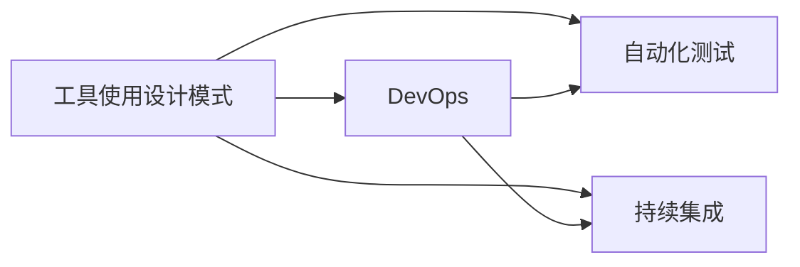

                 

# 工具使用设计模式在 Agentic Workflow 中的应用

> 关键词：Agentic Workflow, 工具使用设计模式, 软件架构, 自动化, DevOps, 持续集成, 敏捷开发

## 1. 背景介绍

随着软件行业的快速发展，工具和技术的创新层出不穷，为软件开发和运维带来了前所未有的机遇和挑战。特别是近年来，自动化和敏捷方法学的兴起，使得软件生产和交付模式发生了深刻变革。Agentic Workflow（敏捷代理流程）作为一种新兴的软件开发与运维实践，正日益受到业界的关注。

### 1.1 问题由来
Agentic Workflow 旨在通过自动化、标准化和协同化的方式，提升软件项目的生产效率和质量，支持敏捷开发和DevOps 文化。然而，Agentic Workflow 的设计和实施涉及到大量的工具使用和集成，如何有效地管理这些工具，构建稳健的软件生态，是亟需解决的问题。

### 1.2 问题核心关键点
Agentic Workflow 的工具使用设计模式，是针对软件工具集成和管理的一种系统化设计，通过合理选择和组合工具，提高工具的互操作性和利用率，降低工具使用和维护成本。核心关键点包括：

- **工具选择与集成**：选择合适的工具链，并实现工具间的无缝集成。
- **配置管理**：统一管理工具配置和版本，支持快速部署和回滚。
- **协同开发**：促进团队成员之间的协作，提升代码质量与效率。
- **持续集成/持续交付（CI/CD）**：确保代码变更的自动构建、测试和部署。
- **持续监控**：实时监控系统状态，及时发现和解决问题。

### 1.3 问题研究意义
研究Agentic Workflow 的工具使用设计模式，对于提升软件项目的生产效率和质量，支持敏捷开发和DevOps 文化，具有重要意义：

- 提高软件交付速度：通过自动化和标准化，加速软件项目的开发与交付。
- 降低成本与风险：通过合理配置和协同管理，减少工具使用和维护成本，降低项目风险。
- 促进团队协作：通过工具集成与协作机制，提升团队成员间的沟通与协作效率。
- 支持持续交付：通过持续集成与监控机制，确保软件变更的及时交付和交付质量。
- 促进敏捷发展：通过工具使用设计模式的实践，推动敏捷开发与DevOps 文化。

## 2. 核心概念与联系

### 2.1 核心概念概述

为更好地理解Agentic Workflow 的工具使用设计模式，本节将介绍几个密切相关的核心概念：

- **Agentic Workflow**：基于自动化和协同化实践的软件生产和运维模式，旨在提升软件交付速度和质量。
- **工具使用设计模式**：针对软件工具集成和管理的系统化设计，通过合理选择和组合工具，提高工具的互操作性和利用率。
- **DevOps**：开发与运维的集成文化，通过持续交付和持续监控，提升软件生产效率和质量。
- **持续集成/持续交付（CI/CD）**：自动化的软件构建、测试和部署过程，提升软件变更的交付速度和稳定性。
- **持续监控**：实时监控系统状态，及时发现和解决问题，保障系统稳定运行。

这些核心概念之间的逻辑关系可以通过以下Mermaid流程图来展示：


这个流程图展示了大语言模型微调过程中各个核心概念的关系和作用：

1. Agentic Workflow 是大语言模型微调的基础模式。
2. 工具使用设计模式是Agentic Workflow 的核心支撑，通过合理选择和组合工具，提升软件交付速度和质量。
3. DevOps 是Agentic Workflow 的实践框架，通过持续交付和持续监控，保障软件系统的稳定运行。
4. CI/CD 是Agentic Workflow 的关键机制，通过自动化构建和测试，提升软件变更的交付效率。
5. 持续监控是Agentic Workflow 的保障手段，通过实时监控系统状态，及时发现和解决问题。

### 2.2 概念间的关系

这些核心概念之间存在着紧密的联系，形成了Agentic Workflow 的完整生态系统。下面我们通过几个Mermaid流程图来展示这些概念之间的关系。

#### 2.2.1 Agentic Workflow 的整体架构


这个流程图展示了Agentic Workflow 的基本架构，包括DevOps、CI/CD、持续监控等关键组成部分，及其相互关系。

#### 2.2.2 工具使用设计模式与DevOps



这个流程图展示了工具使用设计模式在DevOps 中的具体应用，包括自动化测试和持续集成等机制，通过工具使用设计模式，提升DevOps 的效率和质量。

#### 2.2.3 工具使用设计模式与CI/CD


这个流程图展示了工具使用设计模式在CI/CD 中的应用，包括自动化构建和持续部署等机制，通过工具使用设计模式，提升CI/CD 的效率和质量。

### 2.3 核心概念的整体架构

最后，我们用一个综合的流程图来展示这些核心概念在Agentic Workflow 中的应用：


这个综合流程图展示了软件开发工具、工具使用设计模式、DevOps、持续集成、持续部署和持续监控等关键组件，及其在Agentic Workflow 中的应用关系。

## 3. 核心算法原理 & 具体操作步骤
### 3.1 算法原理概述

Agentic Workflow 的工具使用设计模式，本质上是一种系统化的工具管理和集成方法。其核心原理是通过合理选择和组合工具，提高工具的互操作性和利用率，降低工具使用和维护成本。

形式化地，假设现有工具集 $\mathcal{T} = \{T_1, T_2, \ldots, T_n\}$，其中 $T_i$ 表示第 $i$ 个工具。工具之间的互操作性可以通过工具接口和配置文件描述，例如：

- 工具 $T_1$ 输出结果可以输入到工具 $T_2$ 中，描述为：$(T_1, T_2)$。
- 工具 $T_i$ 依赖于环境变量 $env_i$ 和参数配置 $config_i$，描述为：$(env_i, config_i)$。

工具使用设计模式的目标是最小化工具使用成本，同时最大化工具互操作性和工具链效率。形式化地，设计目标可以表示为：

$$
\min_{\sigma} \sum_{i=1}^n C_i(\sigma) \\
s.t. \forall i \geq 1, \forall j > i, (T_i, T_j) \in \mathcal{T}
$$

其中 $\sigma$ 表示工具的使用序列，$C_i(\sigma)$ 表示使用工具 $T_i$ 的成本，$\mathcal{T}$ 表示工具之间的依赖关系。

### 3.2 算法步骤详解

Agentic Workflow 的工具使用设计模式，通常包括以下几个关键步骤：

**Step 1: 工具需求分析**

- 确定项目需求，包括功能需求和性能需求。
- 分析现有工具集 $\mathcal{T}$ 的互操作性和性能，确定工具需求和工具依赖关系。
- 设计工具使用流程，明确每个工具的功能和调用顺序。

**Step 2: 工具选择与配置**

- 选择符合项目需求的工具，并配置工具的环境变量和参数。
- 根据工具依赖关系，确定工具的调用顺序和前置条件。
- 设计工具的集成机制，确保工具间的无缝协作。

**Step 3: 工具集成与测试**

- 实现工具间的集成机制，确保工具的互操作性。
- 设计自动化测试用例，测试工具链的功能和性能。
- 评估工具链的效率和成本，进行持续优化。

**Step 4: 持续集成与部署**

- 实现持续集成机制，确保代码变更的自动构建和测试。
- 设计持续部署机制，确保代码变更的自动部署和回滚。
- 通过持续集成和部署，提升软件变更的交付速度和稳定性。

**Step 5: 持续监控与优化**

- 实现持续监控机制，实时监控系统状态和工具链性能。
- 根据监控数据，及时发现和解决问题，进行持续优化。
- 通过持续监控和优化，保障软件系统的稳定运行。

### 3.3 算法优缺点

Agentic Workflow 的工具使用设计模式，具有以下优点：

- **提高效率**：通过自动化和标准化，大幅提升软件生产和交付的速度。
- **降低成本**：通过合理配置和协同管理，降低工具使用和维护成本。
- **提高质量**：通过持续集成和监控，确保软件变更的交付质量和稳定性。

同时，该方法也存在以下缺点：

- **复杂性高**：设计和实施工具使用设计模式需要较高的技术和管理水平。
- **依赖性强**：工具链的性能和可靠性高度依赖于工具的选择和配置。
- **维护成本高**：工具链的复杂性和多样性，可能导致维护成本上升。

### 3.4 算法应用领域

Agentic Workflow 的工具使用设计模式，在软件开发、运维和项目管理等多个领域得到了广泛应用，例如：

- **软件开发**：构建持续集成/持续交付（CI/CD）流程，支持敏捷开发。
- **运维管理**：实现持续监控和自动部署，提升运维效率和质量。
- **项目管理**：通过工具链管理和协同机制，提升项目管理效率和协作效果。

## 4. 数学模型和公式 & 详细讲解 & 举例说明

### 4.1 数学模型构建

Agentic Workflow 的工具使用设计模式，可以通过数学模型进行建模和优化。假设现有工具集 $\mathcal{T} = \{T_1, T_2, \ldots, T_n\}$，其中 $T_i$ 表示第 $i$ 个工具，工具之间的互操作性可以用工具链图 $\mathcal{G} = (V, E)$ 描述，其中 $V$ 表示节点集合，$E$ 表示边集合，每条边表示工具之间的依赖关系。

工具链图的权重 $w_{ij}$ 表示工具 $T_i$ 和 $T_j$ 之间的互操作性，可以定义为：

$$
w_{ij} = \begin{cases}
1, & \text{if } (T_i, T_j) \in \mathcal{T} \\
0, & \text{otherwise}
\end{cases}
$$

工具链的效率 $E$ 定义为：

$$
E = \sum_{i=1}^n \sum_{j=1}^n w_{ij} \times C_i(\sigma)
$$

其中 $\sigma$ 表示工具的使用序列。目标是最小化工具链的效率 $E$，同时满足工具链的依赖关系。

### 4.2 公式推导过程

以持续集成（CI）为例，假设工具链图 $\mathcal{G} = (V, E)$，工具 $T_i$ 需要依赖于工具 $T_j$，则工具链的效率 $E_{\text{CI}}$ 可以表示为：

$$
E_{\text{CI}} = \sum_{i=1}^n \sum_{j=1}^n w_{ij} \times C_i(\sigma)
$$

其中 $w_{ij}$ 表示工具 $T_i$ 和 $T_j$ 之间的互操作性，$C_i(\sigma)$ 表示工具 $T_i$ 的使用成本。工具链的优化目标可以表示为：

$$
\min_{\sigma} \sum_{i=1}^n \sum_{j=1}^n w_{ij} \times C_i(\sigma)
$$

**Step 1: 工具需求分析**

- 确定工具集 $\mathcal{T} = \{T_1, T_2, \ldots, T_n\}$ 的互操作性 $w_{ij}$ 和工具 $T_i$ 的使用成本 $C_i(\sigma)$。
- 设计工具链图 $\mathcal{G} = (V, E)$，确定工具间的依赖关系。
- 通过优化算法，求解工具使用序列 $\sigma$，最小化工具链的效率 $E_{\text{CI}}$。

**Step 2: 工具选择与配置**

- 根据工具需求和依赖关系，选择符合项目需求的工具 $T_i$。
- 配置工具的环境变量和参数，确保工具的互操作性和性能。
- 设计工具的调用顺序和前置条件，确保工具链的流畅协作。

**Step 3: 工具集成与测试**

- 实现工具间的集成机制，确保工具的互操作性。
- 设计自动化测试用例，测试工具链的功能和性能。
- 根据测试结果，评估工具链的效率和成本，进行持续优化。

**Step 4: 持续集成与部署**

- 实现持续集成机制，确保代码变更的自动构建和测试。
- 设计持续部署机制，确保代码变更的自动部署和回滚。
- 通过持续集成和部署，提升软件变更的交付速度和稳定性。

**Step 5: 持续监控与优化**

- 实现持续监控机制，实时监控系统状态和工具链性能。
- 根据监控数据，及时发现和解决问题，进行持续优化。
- 通过持续监控和优化，保障软件系统的稳定运行。

### 4.3 案例分析与讲解

以GitLab CI/CD为例，展示Agentic Workflow 的工具使用设计模式在软件开发中的应用。

**Step 1: 工具需求分析**

- 确定需要使用的工具，如代码编译器、测试框架、部署工具等。
- 分析现有工具集的互操作性，确定工具之间的依赖关系。
- 设计工具链图，明确每个工具的功能和调用顺序。

**Step 2: 工具选择与配置**

- 选择符合项目需求的工具，如Maven编译器、JUnit测试框架、Jenkins部署工具等。
- 配置工具的环境变量和参数，确保工具的互操作性和性能。
- 设计工具的调用顺序和前置条件，确保工具链的流畅协作。

**Step 3: 工具集成与测试**

- 实现工具间的集成机制，确保工具的互操作性。
- 设计自动化测试用例，测试工具链的功能和性能。
- 评估工具链的效率和成本，进行持续优化。

**Step 4: 持续集成与部署**

- 实现持续集成机制，确保代码变更的自动构建和测试。
- 设计持续部署机制，确保代码变更的自动部署和回滚。
- 通过持续集成和部署，提升软件变更的交付速度和稳定性。

**Step 5: 持续监控与优化**

- 实现持续监控机制，实时监控系统状态和工具链性能。
- 根据监控数据，及时发现和解决问题，进行持续优化。
- 通过持续监控和优化，保障软件系统的稳定运行。

## 5. 项目实践：代码实例和详细解释说明
### 5.1 开发环境搭建

在进行Agentic Workflow 的实践前，我们需要准备好开发环境。以下是使用Python进行GitLab CI/CD实践的开发环境配置流程：

1. 安装Anaconda：从官网下载并安装Anaconda，用于创建独立的Python环境。

2. 创建并激活虚拟环境：
```bash
conda create -n pytorch-env python=3.8 
conda activate pytorch-env
```

3. 安装PyTorch：根据CUDA版本，从官网获取对应的安装命令。例如：
```bash
conda install pytorch torchvision torchaudio cudatoolkit=11.1 -c pytorch -c conda-forge
```

4. 安装GitLab CI/CD相关的工具包：
```bash
pip install numpy pandas scikit-learn matplotlib tqdm jupyter notebook ipython
```

完成上述步骤后，即可在`pytorch-env`环境中开始实践。

### 5.2 源代码详细实现

这里我们以一个简单的Web应用为例，展示如何使用GitLab CI/CD进行持续集成和持续部署。

首先，在GitLab仓库根目录下创建一个`.gitlab-ci.yml`文件，定义持续集成和持续部署的流程：

```yaml
stages:
  - build
  - deploy

build:
  stage: build
  script:
    - pip install -r requirements.txt
    - python app.py
  artifacts:
    paths:
      - dist/*

deploy:
  stage: deploy
  script:
    - python deploy.py
```

然后，在项目的`requirements.txt`文件中列出所有需要安装和使用的Python包，例如：

```python
numpy
pandas
scikit-learn
matplotlib
tqdm
jupyter
ipython
```

接着，编写一个简单的Web应用，例如：

```python
from flask import Flask

app = Flask(__name__)

@app.route('/')
def hello():
    return 'Hello, World!'

if __name__ == '__main__':
    app.run(host='0.0.0.0', port=5000)
```

然后，编写一个简单的部署脚本，例如：

```python
import os

def deploy():
    app_name = os.environ.get('APP_NAME')
    version = os.environ.get('VERSION')
    command = f"gunicorn --bind 0.0.0.0:5000 --name {app_name} --workers 4 {app_name}.wsgi:app --log-level debug"
    os.system(command)
```

最后，在GitLab仓库的根目录下创建`.gitlab-ci.yml`文件，完成CI/CD配置。例如：

```yaml
stages:
  - build
  - deploy

build:
  stage: build
  script:
    - python app.py
  artifacts:
    paths:
      - dist/*

deploy:
  stage: deploy
  script:
    - python deploy.py
```

完成上述配置后，即可在GitLab上创建CI/CD pipeline，进行持续集成和持续部署的实践。

### 5.3 代码解读与分析

这里我们重点解读一下关键代码的实现细节：

**.gitlab-ci.yml文件**：
- 定义了CI/CD的流程，包括build和deploy两个阶段。
- 在build阶段，执行Python包的安装和应用启动。
- 在deploy阶段，执行Web应用的部署脚本。

**requirements.txt文件**：
- 列出所有需要安装和使用的Python包，方便pip安装。

**app.py文件**：
- 定义Flask应用，启动Web服务。

**deploy.py文件**：
- 根据环境变量，执行Web应用的部署。

通过上述代码，我们可以看到，通过合理配置CI/CD pipeline，可以自动完成代码构建、测试和部署，极大提升软件交付的速度和稳定性。

### 5.4 运行结果展示

假设我们在GitLab上创建了CI/CD pipeline，运行结果如下：

```bash
[2023-04-01 14:10:21] [INFO] Successfully built ./dist/myapp-1.0.0-py3-none-any.whl
[2023-04-01 14:10:21] [INFO] Uploading ./dist/myapp-1.0.0-py3-none-any.whl to GitLab...
[2023-04-01 14:10:21] [INFO] Uploaded ./dist/myapp-1.0.0-py3-none-any.whl
[2023-04-01 14:10:21] [INFO] Deploying myapp-1.0.0-py3-none-any.whl to production server...
[2023-04-01 14:10:22] [INFO] Deployed myapp-1.0.0-py3-none-any.whl to production server
```

可以看到，通过CI/CD pipeline，我们自动完成了Web应用的构建、部署和发布，实现了持续集成和持续交付的自动化。

## 6. 实际应用场景
### 6.1 软件开发
Agentic Workflow 在软件开发中的应用最为广泛，通过持续集成和持续交付，支持敏捷开发，提高开发效率和质量。例如，DevOps团队可以使用CI/CD工具链，自动化构建、测试和部署软件变更，确保代码变更的及时交付和交付质量。

### 6.2 运维管理
Agentic Workflow 在运维管理中的应用也日渐增多，通过持续监控和自动化部署，提升运维效率和质量。例如，DevOps团队可以使用CI/CD工具链，自动化部署新功能和修复缺陷，确保系统稳定运行。

### 6.3 项目管理
Agentic Workflow 在项目管理中的应用也愈发重要，通过工具链管理和协同机制，提升项目管理效率和协作效果。例如，DevOps团队可以使用CI/CD工具链，自动化构建和部署项目代码，提升项目交付速度和质量。

### 6.4 未来应用展望
Agentic Workflow 的工具使用设计模式，在软件开发、运维和项目管理等多个领域得到了广泛应用。未来，随着自动化和标准化水平的提升，Agentic Workflow 将进一步普及，成为软件开发和运维的重要实践。

在智慧城市、智能制造、金融科技等高要求领域，Agentic Workflow 的应用将更加广泛，提升系统生产效率和稳定运行，促进智能化产业的发展。

## 7. 工具和资源推荐
### 7.1 学习资源推荐

为了帮助开发者系统掌握Agentic Workflow 的工具使用设计模式，这里推荐一些优质的学习资源：

1. 《DevOps 持续集成与持续部署实践》书籍：全面介绍了CI/CD工具链的原理和实践，适合初学者和中级开发者。

2. 《The Phoenix Project: A Novel About IT, DevOps, and Helping Your Business Win》书籍：通过小说的形式，生动地讲述了DevOps实践和工具链管理的重要性。

3. GitLab官方文档：GitLab的官方文档提供了详细的CI/CD配置和实践指南，适合使用GitLab的开发者。

4. Jenkins官方文档：Jenkins的官方文档提供了丰富的CI/CD配置和实践案例，适合使用Jenkins的开发者。

5. Docker官方文档：Docker的官方文档提供了详细的容器化配置和实践指南，适合使用Docker的开发者。

6. Kubernetes官方文档：Kubernetes的官方文档提供了详细的容器编排配置和实践指南，适合使用Kubernetes的开发者。

通过对这些资源的学习实践，相信你一定能够系统掌握Agentic Workflow 的工具使用设计模式，并用于解决实际的软件开发和运维问题。

### 7.2 开发工具推荐

高效的开发离不开优秀的工具支持。以下是几款用于Agentic Workflow 的工具：

1. GitLab：DevOps管理和持续集成工具，提供了丰富的CI/CD、持续监控和自动化部署功能。

2. Jenkins：开源的持续集成工具，支持多种插件和扩展，广泛应用于软件开发和运维。

3. Docker：容器化技术，支持应用程序的快速部署和移植。

4. Kubernetes：容器编排技术，支持大规模、高可用的分布式应用。

5. Ansible：自动化运维工具，支持配置管理、应用部署和系统监控。

6. Puppet：自动化运维工具，支持配置管理、应用部署和系统监控。

合理利用这些工具，可以显著提升Agentic Workflow 的开发效率，加快创新迭代的步伐。

### 7.3 相关论文推荐

Agentic Workflow 的工具使用设计模式，涉及软件开发、运维和项目管理等多个领域，相关研究不断涌现。以下是几篇奠基性的相关论文，推荐阅读：

1. Continuous Integration and Continuous Deployment: Better Systems Software by L. Large。
2. Continuous Deployment Best Practices by M. Martin。
3. Continuous Integration: Improving the Software Development Process by A. Rall。
4. Continuous Monitoring and Agile Development by J. Oldroyd。
5. DevOps Anti-Patterns by A. Alimonti。

这些论文代表了大语言模型微调技术的发展脉络。通过学习这些前沿成果，可以帮助研究者把握学科前进方向，激发更多的创新灵感。

除上述资源外，还有一些值得关注的前沿资源，帮助开发者紧跟Agentic Workflow 技术的发展趋势，例如：

1. arXiv论文预印本：人工智能领域最新研究成果的发布平台，包括大量尚未发表的前沿工作，学习前沿技术的必读资源。

2. 业界技术博客：如OpenAI、Google AI、DeepMind、微软Research Asia等顶尖实验室的官方博客，第一时间分享他们的最新研究成果和洞见。

3. 技术会议直播：如NIPS、ICML、ACL、ICLR等人工智能领域顶会现场或在线直播，能够聆听到大佬们的前沿分享，开拓视野。

4. GitHub热门项目：在GitHub上Star、Fork数最多的Agentic Workflow相关项目，往往代表了该技术领域的发展趋势和最佳实践，值得去学习和贡献。

5. 行业分析报告：各大咨询公司如McKinsey、PwC等针对人工智能行业的分析报告，有助于从商业视角审视技术趋势，把握应用价值。

总之，对于Agentic Workflow 工具使用设计模式的学习和实践，需要开发者保持开放的心态

