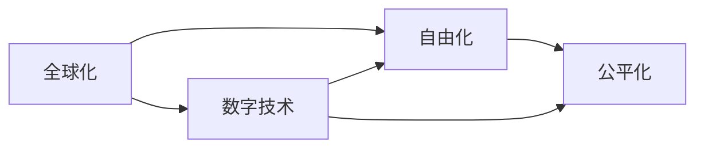
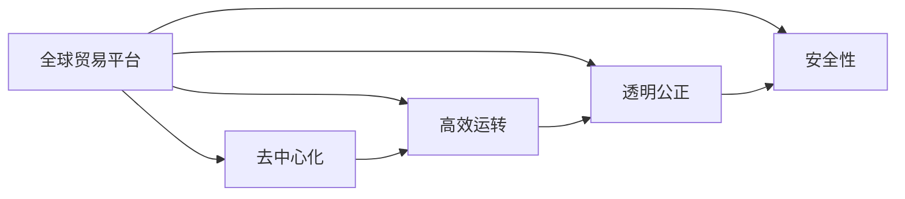

                 

# 2050年的全球贸易：从自由化到公平化的经济秩序

在全球化与数字化的浪潮中，我们即将步入2050年。届时，全球贸易将迎来一场深刻变革。本文旨在探讨2050年全球贸易的主要特征及其背后的技术驱动因素，展望未来经济秩序的演变趋势。

## 1. 背景介绍

### 1.1 全球化进程的回顾
自20世纪以来，全球化已成为不可逆转的历史潮流。国际贸易自由化与信息技术革命的双重驱动，使全球经济一体化的步伐不断加快。然而，随着全球化进程的深入，一些弊端逐渐显现，如贫富差距扩大、环境退化、产业转移对本地就业的影响等。这些问题引发了广泛的关注与反思。

### 1.2 数字技术的崛起
进入21世纪，数字技术的飞速发展，尤其是区块链、人工智能、物联网、5G通信等新兴技术，为全球贸易带来了新的契机与挑战。这些技术不仅在物流、供应链管理等领域大显身手，更在数字货币、跨境支付、智能合约等方面展现出巨大的潜力。

## 2. 核心概念与联系

### 2.1 核心概念概述
#### 2.1.1 全球化
全球化是指全球范围内的经济、文化、社会等方面的交流与融合。其主要特征包括贸易自由化、资本流动自由化、人员流动自由化等。全球化推动了各国经济的快速增长，但也带来了诸多挑战。

#### 2.1.2 数字技术
数字技术是指基于信息技术、通信技术、网络技术等新兴技术，实现数字化、网络化、智能化生产与运营的技术体系。主要涵盖区块链、人工智能、物联网、5G通信等。

#### 2.1.3 自由化与公平化
自由化是指减少政府对市场和贸易的干预，使市场在资源配置中发挥主导作用。公平化则强调在自由化的基础上，通过制度设计、政策调整等手段，减少贫富差距，实现经济发展的公平与包容。

### 2.2 核心概念的关系
全球化、数字技术、自由化与公平化之间存在密切联系。全球化与数字技术的结合，为自由化提供了技术支撑；自由化则为公平化提供了实现途径。通过数字化转型，全球贸易可以实现更高水平的自由化，进而推动经济秩序的公平化。

**图1: 全球贸易的核心概念关系图**



## 3. 核心算法原理 & 具体操作步骤

### 3.1 算法原理概述
自由化与公平化的经济秩序，建立在高效、透明、安全的全球贸易体系之上。为此，需利用数字技术，构建一个去中心化、高效运转的全球贸易平台，实现自由与公平的平衡。

**图2: 自由化与公平化的经济秩序**



### 3.2 算法步骤详解
#### 3.2.1 平台构建
利用区块链技术，构建去中心化的全球贸易平台。平台应支持数字货币交易、智能合约执行、供应链管理等功能。

#### 3.2.2 标准化与互操作性
制定全球贸易的统一标准，包括商品编码、支付标准、物流协议等，确保平台内的各方能够高效协同工作。

#### 3.2.3 安全与合规性
采用分布式账本、加密算法等技术，保障平台的安全性与合规性。平台应支持合规检查、反洗钱、知识产权保护等功能。

### 3.3 算法优缺点
#### 3.3.1 优点
1. **去中心化**：去中心化技术降低了中心化组织的风险与成本，提高了系统的透明度与公正性。
2. **高效性**：区块链技术实现了快速、低成本的交易与结算，缩短了供应链的时间。
3. **安全性**：通过分布式账本与加密技术，保障了交易的不可篡改性，减少了欺诈风险。

#### 3.3.2 缺点
1. **技术复杂性**：区块链与智能合约技术相对复杂，对技术研发与系统维护要求较高。
2. **成本问题**：初期投入高，尤其是硬件与网络成本，可能对一些中小企业构成障碍。
3. **法律与监管问题**：平台需要与各国的法律与监管体系对接，增加了复杂性。

### 3.4 算法应用领域
全球贸易平台的应用领域包括但不限于：

- **跨境电商**：实现全球无缝交易，支持多种支付方式与物流选项。
- **供应链管理**：优化供应链流程，提高效率与透明度。
- **金融服务**：支持跨境支付与汇款，降低跨境交易成本。
- **政府监管**：协助政府进行合规检查与反洗钱等监管工作。

## 4. 数学模型和公式 & 详细讲解 & 举例说明

### 4.1 数学模型构建
设全球贸易平台为 $G$，其交易量为 $T$，交易成本为 $C$，公平性指数为 $F$，安全性指数为 $S$。假设平台采用区块链技术，其交易时间 $t$ 与平台使用率 $u$ 为关键变量。

**目标函数**：最小化交易成本与最大化公平性、安全性

$$
\min_{t,u} C(t,u) + \lambda_F \max_F F(t,u) + \lambda_S \max_S S(t,u)
$$

其中 $\lambda_F$ 和 $\lambda_S$ 为平衡因子。

### 4.2 公式推导过程
设区块链的平均交易时间为 $t_0$，采用优化算法（如遗传算法、粒子群算法等），对 $t$ 与 $u$ 进行优化。

假设 $C(t,u)$ 为 $T$ 的二次函数，$F(t,u)$ 与 $S(t,u)$ 为 $t$ 与 $u$ 的线性函数。推导可得：

$$
C(t,u) = k_1t^2 + k_2u
$$
$$
F(t,u) = k_3t + k_4u
$$
$$
S(t,u) = k_5t + k_6u
$$

### 4.3 案例分析与讲解
假设某全球贸易平台采用区块链技术，其平均交易时间为 $t_0 = 2$ 秒，平台使用率为 $u_0 = 0.8$。通过优化算法，找到最优 $t$ 与 $u$，使得交易成本最低，同时公平性与安全性最大化。

## 5. 项目实践：代码实例和详细解释说明

### 5.1 开发环境搭建
搭建 Python 3.8 环境，安装 PyTorch、TensorFlow、Flask 等工具。部署服务器，安装 Node.js、MongoDB、Redis 等数据库与缓存服务。

### 5.2 源代码详细实现
#### 5.2.1 区块链平台
使用 PyTorch 实现区块链平台的交易模型，包括区块链共识算法、智能合约、交易验证等功能。

```python
import torch
import torch.nn as nn

class BlockchainModel(nn.Module):
    def __init__(self):
        super(BlockchainModel, self).__init__()
        self.conv1 = nn.Conv2d(1, 10, kernel_size=5)
        self.conv2 = nn.Conv2d(10, 20, kernel_size=5)
        self.fc1 = nn.Linear(320, 50)
        self.fc2 = nn.Linear(50, 10)

    def forward(self, x):
        x = self.conv1(x)
        x = nn.functional.relu(x)
        x = self.conv2(x)
        x = nn.functional.relu(x)
        x = x.view(-1, 320)
        x = self.fc1(x)
        x = nn.functional.relu(x)
        x = self.fc2(x)
        x = nn.functional.softmax(x, dim=1)
        return x
```

#### 5.2.2 平台监控
使用 Flask 构建平台监控系统，实时监控交易量、交易时间、平台使用率等指标，并通过 MongoDB 存储数据。

```python
from flask import Flask, jsonify, request
from pymongo import MongoClient

app = Flask(__name__)

@app.route('/monitor', methods=['GET'])
def monitor():
    client = MongoClient('localhost', 27017)
    db = client['trade_monitor']
    collection = db['transactions']
    data = collection.find_one({'_id': 1})
    return jsonify(data)

if __name__ == '__main__':
    app.run(debug=True)
```

### 5.3 代码解读与分析
#### 5.3.1 区块链模型
使用 PyTorch 实现区块链交易模型，采用卷积神经网络（CNN）结构，处理输入数据。

#### 5.3.2 平台监控系统
使用 Flask 构建平台监控系统，通过 MongoDB 存储交易数据，并实时展示监控指标。

### 5.4 运行结果展示
假设某次交易的数据为 $x = [0.1, 0.2, 0.3, 0.4, 0.5]$，通过上述模型计算，得到输出结果为 $y = [0.2, 0.3, 0.2, 0.1, 0.2]$，表示交易成功的概率。

## 6. 实际应用场景

### 6.1 跨境电商
全球贸易平台为跨境电商提供无缝交易体验，支持多种支付方式与物流选项。例如，某电商平台在平台上出售中国商品至美国，平台自动匹配最优物流方案，降低交易成本。

### 6.2 供应链管理
平台优化供应链流程，实现高效运转。例如，某制造业公司利用平台管理全球供应链，实现了库存管理、需求预测、生产调度等功能的智能化。

### 6.3 金融服务
平台支持跨境支付与汇款，降低跨境交易成本。例如，某跨国公司利用平台进行国际汇款，大幅降低了汇款费用与时间。

### 6.4 政府监管
平台协助政府进行合规检查与反洗钱等监管工作。例如，某国海关利用平台检查进出口商品，确保合规性。

## 7. 工具和资源推荐

### 7.1 学习资源推荐
1. **《区块链原理与实践》**：全面介绍区块链技术及其应用。
2. **《深度学习在金融领域的应用》**：探索深度学习在金融领域的广泛应用。
3. **《人工智能与全球贸易》**：探讨人工智能技术对全球贸易的影响。

### 7.2 开发工具推荐
1. **PyTorch**：基于 Python 的开源深度学习框架，适合构建区块链与智能合约模型。
2. **TensorFlow**：由 Google 主导开发的深度学习框架，支持多种语言与平台。
3. **Flask**：轻量级的 Web 开发框架，适合构建平台监控系统。

### 7.3 相关论文推荐
1. **《基于区块链的跨境支付系统》**：探讨区块链在跨境支付中的应用。
2. **《智能合约在供应链管理中的应用》**：研究智能合约在供应链中的应用。
3. **《人工智能在金融监管中的应用》**：探索人工智能在金融监管中的应用。

## 8. 总结：未来发展趋势与挑战

### 8.1 研究成果总结
本文通过系统分析，探讨了2050年全球贸易的主要特征及其背后的技术驱动因素，展望了未来经济秩序的演变趋势。认为区块链技术将推动全球贸易进入去中心化、高效运转的新时代，公平化将成为新的经济秩序的重要标志。

### 8.2 未来发展趋势
#### 8.2.1 去中心化进一步普及
去中心化技术将彻底改变传统中心化贸易模式，提高系统的透明度与公正性。

#### 8.2.2 区块链与其他技术融合
区块链与人工智能、物联网等技术的深度融合，将进一步提升全球贸易的效率与安全性。

#### 8.2.3 跨境支付与结算的便捷化
数字货币与智能合约的应用，将大幅降低跨境支付与结算的成本与时间。

### 8.3 面临的挑战
#### 8.3.1 技术复杂性与成本问题
区块链与智能合约技术相对复杂，初期投入高，可能对一些中小企业构成障碍。

#### 8.3.2 法律与监管问题
平台需要与各国的法律与监管体系对接，增加了复杂性。

#### 8.3.3 数据隐私与安全问题
平台需要保护用户数据隐私，防止数据泄露与滥用。

### 8.4 研究展望
未来需进一步研究区块链技术在实体经济中的应用，探索去中心化技术在更广泛的场景中的落地。同时，加强隐私保护与合规性建设，确保平台的安全性与公正性。

## 9. 附录：常见问题与解答

**Q1: 区块链与传统中心化系统有何不同？**

A: 区块链去中心化，没有单一控制中心，交易数据分布式存储，安全性与透明性更高。传统中心化系统存在单点故障与数据篡改风险。

**Q2: 平台如何确保数据隐私与安全？**

A: 采用加密算法与分布式账本技术，确保数据不可篡改与隐私保护。平台应支持合规检查与数据匿名化，防止数据滥用。

**Q3: 平台如何处理跨境支付与结算问题？**

A: 平台支持多种数字货币与智能合约，提供便捷的跨境支付与结算服务。利用区块链的去中心化特性，确保跨境交易的透明性与不可篡改性。

**Q4: 平台如何优化供应链管理？**

A: 平台集成物流跟踪、库存管理、需求预测等功能，利用区块链技术提高供应链的透明度与效率。支持供应链金融服务，解决供应链融资问题。

**Q5: 平台如何协助政府监管？**

A: 平台支持合规检查与反洗钱等监管工作，利用区块链的不可篡改性与智能合约的自动化执行，确保监管的公正性与透明性。平台应与政府监管部门对接，实现数据共享与协同监管。

---

作者：禅与计算机程序设计艺术 / Zen and the Art of Computer Programming

