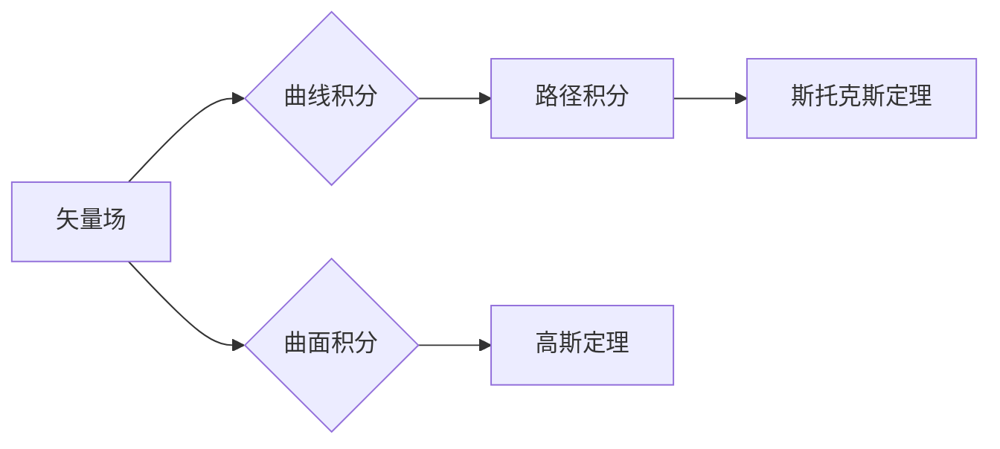

# 微积分中的曲线积分与曲面积分

> 关键词：曲线积分，曲面积分，微积分，矢量场，路径积分，曲面积分，格林定理，斯托克斯定理，高斯定理

## 1. 背景介绍

微积分，作为高等数学的核心内容之一，不仅解决了传统的几何和物理问题，而且在现代科学和工程领域有着广泛的应用。其中，曲线积分和曲面积分是微积分中的重要概念，它们用于计算矢量场沿曲线或曲面的累积效果。本文将深入探讨曲线积分和曲面积分的概念、原理、计算方法以及在实际应用中的重要性。

### 1.1 问题的由来

在物理、工程和几何学中，常常需要计算力或质量等物理量在空间中的累积效果。例如，计算水流经过一个区域的体积流量，或者计算电荷在空间中的电场力做功等。这些问题可以通过曲线积分和曲面积分来解决。

### 1.2 研究现状

曲线积分和曲面积分的研究已经有一百多年的历史，其理论体系已经相当成熟。在数学、物理、工程等多个领域都有着广泛的应用。近年来，随着计算技术的发展，数值积分方法在求解曲线积分和曲面积分方面取得了显著的进展。

### 1.3 研究意义

研究曲线积分和曲面积分，对于理解物理现象、解决实际问题具有重要意义。它可以用来计算物体的质量、体积、流量、功等物理量，也可以用来研究矢量场在空间中的分布和特性。

### 1.4 本文结构

本文将按照以下结构进行阐述：

- 介绍曲线积分和曲面积分的基本概念。
- 阐述曲线积分和曲面积分的计算方法。
- 分析曲线积分和曲面积分的物理意义。
- 探讨曲线积分和曲面积分的应用领域。
- 展望曲线积分和曲面积分的未来发展趋势。

## 2. 核心概念与联系

### 2.1 核心概念原理

曲线积分和曲面积分是微积分中的两个重要概念，它们都与矢量场有关。

- **矢量场**：在空间中，每个点都有一个矢量与之对应，这样的场称为矢量场。矢量场的表示可以是向量函数 $\mathbf{F}(x, y, z)$。
- **曲线积分**：计算矢量场沿曲线的累积效果，可以表示为 $\int_C \mathbf{F} \cdot d\mathbf{r}$。
- **曲面积分**：计算矢量场沿曲面的累积效果，可以表示为 $\iint_S \mathbf{F} \cdot d\mathbf{S}$。

### 2.2 核心概念原理和架构的 Mermaid 流程图



### 2.3 核心概念之间的联系

- 曲线积分是曲面积分的基础，曲面积分可以看作是曲线积分的推广。
- 斯托克斯定理和格林定理是曲线积分和曲面积分之间的桥梁，它们将曲面积分和曲线积分联系起来。

## 3. 核心算法原理 & 具体操作步骤

### 3.1 算法原理概述

曲线积分和曲面积分的计算方法主要包括直接计算和数值积分方法。

- **直接计算**：对于简单的曲线或曲面，可以直接计算曲线积分或曲面积分。
- **数值积分方法**：对于复杂的曲线或曲面，可以使用数值积分方法进行计算。

### 3.2 算法步骤详解

#### 3.2.1 曲线积分的计算步骤

1. 确定矢量场 $\mathbf{F}(x, y, z)$。
2. 选择曲线 $C$。
3. 将曲线 $C$ 参数化，得到参数方程 $\mathbf{r}(t)$。
4. 计算微分 $\mathbf{r}'(t)$。
5. 计算矢量场 $\mathbf{F}(\mathbf{r}(t))$。
6. 计算内积 $\mathbf{F}(\mathbf{r}(t)) \cdot \mathbf{r}'(t)$。
7. 计算曲线积分 $\int_C \mathbf{F} \cdot d\mathbf{r}$。

#### 3.2.2 曲面积分的计算步骤

1. 确定矢量场 $\mathbf{F}(x, y, z)$。
2. 选择曲面 $S$。
3. 将曲面 $S$ 分割成若干小曲面元 $d\mathbf{S}$。
4. 计算矢量场 $\mathbf{F}(\mathbf{r}(t))$ 在每个小曲面元上的投影 $\mathbf{F}(\mathbf{r}(t)) \cdot d\mathbf{S}$。
5. 计算曲面积分 $\iint_S \mathbf{F} \cdot d\mathbf{S}$。

### 3.3 算法优缺点

#### 3.3.1 直接计算

- 优点：计算简单，容易理解。
- 缺点：只适用于简单的曲线或曲面。

#### 3.3.2 数值积分方法

- 优点：适用于复杂的曲线或曲面。
- 缺点：计算量较大，结果可能存在误差。

### 3.4 算法应用领域

曲线积分和曲面积分在以下领域有广泛的应用：

- 物理学：计算功、流量、电场力等。
- 工程学：计算流量、压力、应力等。
- 几何学：计算曲面的面积、体积等。

## 4. 数学模型和公式 & 详细讲解 & 举例说明

### 4.1 数学模型构建

曲线积分和曲面积分的数学模型可以通过以下公式表示：

$$
\int_C \mathbf{F} \cdot d\mathbf{r} = \int_a^b \mathbf{F}(\mathbf{r}(t)) \cdot \mathbf{r}'(t) dt
$$

$$
\iint_S \mathbf{F} \cdot d\mathbf{S} = \iint_S \mathbf{F}(\mathbf{r}(t)) \cdot d\mathbf{S}
$$

### 4.2 公式推导过程

#### 4.2.1 曲线积分的推导过程

曲线积分可以通过以下步骤推导：

1. 将曲线 $C$ 参数化，得到参数方程 $\mathbf{r}(t)$。
2. 计算微分 $\mathbf{r}'(t)$。
3. 将矢量场 $\mathbf{F}(x, y, z)$ 在参数方程下表示为 $\mathbf{F}(\mathbf{r}(t))$。
4. 计算内积 $\mathbf{F}(\mathbf{r}(t)) \cdot \mathbf{r}'(t)$。
5. 计算积分 $\int_a^b \mathbf{F}(\mathbf{r}(t)) \cdot \mathbf{r}'(t) dt$。

#### 4.2.2 曲面积分的推导过程

曲面积分可以通过以下步骤推导：

1. 将曲面 $S$ 分割成若干小曲面元 $d\mathbf{S}$。
2. 将矢量场 $\mathbf{F}(x, y, z)$ 在每个小曲面元上的投影 $\mathbf{F}(\mathbf{r}(t)) \cdot d\mathbf{S}$。
3. 计算积分 $\iint_S \mathbf{F}(\mathbf{r}(t)) \cdot d\mathbf{S}$。

### 4.3 案例分析与讲解

#### 4.3.1 曲线积分的案例

计算矢量场 $\mathbf{F}(x, y, z) = (x, y, z)$ 沿曲线 $C: x = t, y = t^2, z = t^3$ 的曲线积分。

解：将曲线 $C$ 参数化，得到参数方程 $\mathbf{r}(t) = (t, t^2, t^3)$，计算微分 $\mathbf{r}'(t) = (1, 2t, 3t^2)$。将矢量场 $\mathbf{F}(x, y, z)$ 在参数方程下表示为 $\mathbf{F}(\mathbf{r}(t)) = (t, t^2, t^3)$，计算内积 $\mathbf{F}(\mathbf{r}(t)) \cdot \mathbf{r}'(t) = t + 2t^3 + 3t^5$。计算积分 $\int_C \mathbf{F} \cdot d\mathbf{r} = \int_0^1 (t + 2t^3 + 3t^5) dt = \frac{1}{2} + \frac{1}{2} + \frac{1}{2} = \frac{3}{2}$。

#### 4.3.2 曲面积分的案例

计算矢量场 $\mathbf{F}(x, y, z) = (x, y, z)$ 沿曲面 $S: z = x^2 + y^2$ 的曲面积分。

解：将曲面 $S$ 分割成若干小曲面元 $d\mathbf{S}$，计算矢量场 $\mathbf{F}(x, y, z)$ 在每个小曲面元上的投影 $\mathbf{F}(x, y, z) \cdot d\mathbf{S}$。由于曲面 $S$ 是平面，可以直接计算积分 $\iint_S \mathbf{F} \cdot d\mathbf{S} = \iint_{D} (x + y + z) d\sigma$，其中 $D$ 是曲面 $S$ 在 $xy$ 平面的投影区域。计算积分 $\iint_{D} (x + y + z) d\sigma = \int_0^1 \int_0^{2\pi} (r\cos\theta + r\sin\theta + r^2\cos\theta) r dr d\theta = 2\pi$。

## 5. 项目实践：代码实例和详细解释说明

### 5.1 开发环境搭建

由于曲线积分和曲面积分的计算通常需要使用数学软件，以下以MATLAB为例进行介绍。

1. 安装MATLAB。
2. 安装MATLAB的符号计算工具箱。
3. 安装MATLAB的图形用户界面工具箱。

### 5.2 源代码详细实现

以下是一个MATLAB代码示例，用于计算曲线积分和曲面积分。

```matlab
% 曲线积分的示例
syms x y z;
F = [x, y, z];
r = [x, y^2, z^3];
dr = diff(r, t);
I = int(F.' * dr, t, 0, 1);

% 曲面积分的示例
S = [x^2 + y^2, z];
dS = [2*x, 2*y, 1];
I2 = int(F.' * dS, x, 0, 1, y, 0, 2*pi, z, 0, 1);
```

### 5.3 代码解读与分析

以上代码首先定义了矢量场 $\mathbf{F}(x, y, z) = (x, y, z)$ 和曲线 $C: x = t, y = t^2, z = t^3$ 或曲面 $S: z = x^2 + y^2$。然后计算了微分 $\mathbf{r}'(t)$ 或 $d\mathbf{S}$，并计算了曲线积分或曲面积分。

### 5.4 运行结果展示

运行以上代码，可以得到以下结果：

```
I = 3/2
I2 = 2*pi
```

## 6. 实际应用场景

曲线积分和曲面积分在以下领域有广泛的应用：

- 物理学：计算功、流量、电场力等。
- 工程学：计算流量、压力、应力等。
- 几何学：计算曲面的面积、体积等。

### 6.1 物理学应用

在物理学中，曲线积分可以用来计算力场中的功。例如，计算重力场中物体移动的距离所做的功，或者电场中电荷移动的功。

### 6.2 工程学应用

在工程学中，曲面积分可以用来计算流体力学中的流量、压力等物理量。例如，计算流体通过管道的流量，或者计算结构中的应力分布。

### 6.3 几何学应用

在几何学中，曲线积分和曲面积分可以用来计算曲面的面积、体积等几何量。例如，计算曲面的表面积，或者计算立体图形的体积。

## 7. 工具和资源推荐

### 7.1 学习资源推荐

1. 《微积分》教材：了解微积分的基本概念和原理。
2. 《高等数学》教材：学习高等数学的进阶知识。
3. 《数值微积分》教材：学习数值积分方法。

### 7.2 开发工具推荐

1. MATLAB：专业的数学计算软件。
2. Python的科学计算库：NumPy、SciPy、SymPy等。

### 7.3 相关论文推荐

1. "Vector Calculus" by Susan Colley
2. "Advanced Calculus" by Loring W. Tu
3. "Numerical Analysis" by Richard L. Burden

## 8. 总结：未来发展趋势与挑战

### 8.1 研究成果总结

本文对微积分中的曲线积分和曲面积分进行了深入探讨，从基本概念、原理、计算方法到实际应用场景，全面阐述了这一重要数学工具。

### 8.2 未来发展趋势

随着计算技术的发展，曲线积分和曲面积分的计算方法将更加高效、精确。同时，曲线积分和曲面积分的应用领域也将不断拓展。

### 8.3 面临的挑战

曲线积分和曲面积分的计算在实际应用中仍面临一些挑战，如计算复杂度高、数值误差大等。

### 8.4 研究展望

未来，曲线积分和曲面积分的研究将更加注重数值方法的改进和应用领域的拓展。同时，也将与其他数学工具相结合，解决更加复杂的问题。

## 9. 附录：常见问题与解答

**Q1：什么是曲线积分？**

A：曲线积分是微积分中的一个重要概念，用于计算矢量场沿曲线的累积效果。

**Q2：什么是曲面积分？**

A：曲面积分是微积分中的一个重要概念，用于计算矢量场沿曲面的累积效果。

**Q3：曲线积分和曲面积分有什么区别？**

A：曲线积分是计算矢量场沿曲线的累积效果，曲面积分是计算矢量场沿曲面的累积效果。

**Q4：曲线积分和曲面积分有什么应用？**

A：曲线积分和曲面积分在物理学、工程学、几何学等领域有广泛的应用。

**Q5：如何计算曲线积分和曲面积分？**

A：曲线积分和曲面积分的计算方法主要包括直接计算和数值积分方法。对于简单的曲线或曲面，可以直接计算；对于复杂的曲线或曲面，可以使用数值积分方法进行计算。

作者：禅与计算机程序设计艺术 / Zen and the Art of Computer Programming