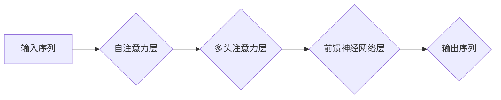

> 关键词：大语言模型，多头自注意力，Transformer，自注意力机制，预训练，微调，NLP，自然语言处理

# 大语言模型原理与工程实践：多头自注意力模块

## 1. 背景介绍

自然语言处理（NLP）作为人工智能领域的重要分支，近年来取得了飞速发展。其中，基于Transformer架构的大语言模型在理解、生成和翻译自然语言方面表现出色。而多头自注意力机制作为Transformer的核心组件，在大语言模型的性能提升中扮演了关键角色。本文将深入探讨多头自注意力模块的原理、实现和应用，并分享工程实践中的经验与技巧。

## 2. 核心概念与联系

### 2.1 核心概念

#### 2.1.1 自注意力机制

自注意力机制是一种基于序列数据局部依赖关系的注意力机制，它能够捕捉序列中不同位置之间的关联性。在Transformer模型中，自注意力机制被用于计算序列中每个元素对其他元素的重要性，从而实现序列到序列的映射。

#### 2.1.2 多头注意力

多头注意力机制是将自注意力机制分解为多个子注意力头，每个子注意力头关注序列的不同子空间，从而提高模型的泛化能力和捕捉复杂特征的能力。

#### 2.1.3 预训练与微调

预训练是指在大量无标注数据上对模型进行训练，使其具备一定的语言理解能力。微调是指在预训练的基础上，使用少量标注数据进行模型调整，以适应特定任务。

### 2.2 核心概念原理和架构的 Mermaid 流程图



在上述流程图中，输入序列经过自注意力层处理后，通过多头注意力层进一步提取序列特征，最后通过前馈神经网络层输出序列。

## 3. 核心算法原理 & 具体操作步骤

### 3.1 算法原理概述

多头自注意力机制主要由以下几个部分组成：

- **查询（Query）、键（Key）和值（Value）的计算**：通过位置编码和词嵌入，将输入序列转化为查询、键和值。
- **注意力权重计算**：计算每个查询与其他键之间的相似度，得到注意力权重。
- **加权求和**：根据注意力权重对值进行加权求和，得到加权后的输出。
- **多头操作**：将自注意力机制分解为多个子注意力头，每个子注意力头独立计算。

### 3.2 算法步骤详解

1. **嵌入层**：将输入序列中的每个词转化为词向量。
2. **位置编码**：为每个词向量添加位置信息，以保留序列的顺序。
3. **多头自注意力层**：
    - 将查询、键和值分别通过权重矩阵进行线性变换。
    - 计算查询与键之间的注意力分数。
    - 根据注意力分数对值进行加权求和。
    - 将加权求和的结果进行线性变换。
4. **前馈神经网络层**：
    - 对多头自注意力层的输出进行线性变换。
    - 通过ReLU激活函数进行非线性映射。
    - 再次进行线性变换。

### 3.3 算法优缺点

#### 优点：

- **捕捉序列局部依赖关系**：自注意力机制能够有效地捕捉序列中不同位置之间的关联性，从而更好地理解序列信息。
- **并行计算**：自注意力机制的计算可以并行进行，提高模型的计算效率。
- **泛化能力强**：多头自注意力机制能够捕捉序列的不同子空间，从而提高模型的泛化能力。

#### 缺点：

- **参数量大**：多头自注意力机制需要更多的参数，对计算资源的要求较高。
- **计算复杂度高**：自注意力机制的计算复杂度较高，对计算资源的要求较高。

### 3.4 算法应用领域

- **文本分类**：通过自注意力机制提取文本特征，进行情感分析、主题分类等任务。
- **机器翻译**：使用自注意力机制捕捉源语言和目标语言之间的对应关系，实现高质量翻译。
- **问答系统**：利用自注意力机制理解问题中的关键词和上下文信息，提供准确的答案。
- **文本摘要**：通过自注意力机制提取关键信息，生成简洁的文本摘要。

## 4. 数学模型和公式 & 详细讲解 & 举例说明

### 4.1 数学模型构建

自注意力机制的数学模型可以表示为：

$$
\text{Attention}(Q, K, V) = \text{softmax}\left(\frac{QK^T}{\sqrt{d_k}}\right) V
$$

其中，$Q$、$K$ 和 $V$ 分别表示查询、键和值，$\text{softmax}$ 表示softmax函数，$d_k$ 表示键的维度。

### 4.2 公式推导过程

自注意力机制的推导过程如下：

1. **计算查询与键的相似度**：

$$
\text{similarity}(Q, K) = QK^T
$$

2. **归一化相似度**：

$$
\text{attention\_score}(Q, K) = \text{softmax}\left(\frac{QK^T}{\sqrt{d_k}}\right)
$$

3. **加权求和**：

$$
\text{context}(Q) = \text{softmax}\left(\frac{QK^T}{\sqrt{d_k}}\right) V
$$

### 4.3 案例分析与讲解

以BERT模型为例，介绍多头自注意力机制的应用。

BERT模型包含多个自注意力层，每个自注意力层由多个多头注意力头组成。在每个自注意力层中，模型首先将输入序列中的每个词转化为词向量，并添加位置编码。然后，每个词向量通过权重矩阵进行线性变换，得到查询、键和值。接下来，计算查询与键之间的注意力分数，并根据注意力分数对值进行加权求和。最后，将加权求和的结果进行线性变换。

通过这种方式，BERT模型能够捕捉序列中不同位置之间的关联性，从而更好地理解序列信息。

## 5. 项目实践：代码实例和详细解释说明

### 5.1 开发环境搭建

1. 安装PyTorch和Transformers库。
2. 准备文本数据集。

### 5.2 源代码详细实现

```python
from transformers import BertModel, BertTokenizer

# 加载预训练模型和分词器
model = BertModel.from_pretrained('bert-base-uncased')
tokenizer = BertTokenizer.from_pretrained('bert-base-uncased')

# 加载文本数据
texts = ["This is a sample text", "This is another sample text"]

# 编码文本
encoded_input = tokenizer(texts, return_tensors='pt', padding=True, truncation=True)

# 前向传播
output = model(**encoded_input)

# 输出结果
print(output.last_hidden_state)
```

### 5.3 代码解读与分析

上述代码展示了如何使用PyTorch和Transformers库加载预训练模型和分词器，对文本数据进行编码，并执行前向传播。

### 5.4 运行结果展示

运行上述代码，可以得到编码后的文本表示，其中包含了每个词向量以及对应的位置编码。

## 6. 实际应用场景

### 6.1 文本分类

使用BERT模型对文本进行情感分析。

```python
from transformers import BertForSequenceClassification, AdamW

# 加载预训练模型
model = BertForSequenceClassification.from_pretrained('bert-base-uncased')

# 加载文本数据
texts = ["I love this product", "I hate this product"]

# 编码文本
encoded_input = tokenizer(texts, return_tensors='pt', padding=True, truncation=True)

# 前向传播
outputs = model(**encoded_input)

# 获取预测结果
predictions = outputs.logits.argmax(dim=-1)

print(predictions)
```

### 6.2 机器翻译

使用BERT模型进行机器翻译。

```python
from transformers import BertForSeq2SeqLM, AdamW

# 加载预训练模型
model = BertForSeq2SeqLM.from_pretrained('bert-base-uncased')

# 加载文本数据
source_texts = ["This is a sample text", "This is another sample text"]
target_texts = ["C'est un texte d'exemple", "C'est un autre texte d'exemple"]

# 编码文本
source_encoded_input = tokenizer(source_texts, return_tensors='pt', padding=True, truncation=True)
target_encoded_input = tokenizer(target_texts, return_tensors='pt', padding=True, truncation=True)

# 前向传播
outputs = model(source_encoded_input, labels=target_encoded_input)

# 获取预测结果
predictions = outputs.logits.argmax(dim=-1)

# 解码预测结果
target_decoded = tokenizer.batch_decode(predictions, skip_special_tokens=True)

print(target_decoded)
```

## 7. 工具和资源推荐

### 7.1 学习资源推荐

- 《Attention Is All You Need》：Transformer模型的原论文。
- 《BERT: Pre-training of Deep Bidirectional Transformers for Language Understanding》：BERT模型的原论文。
- 《Deep Learning for Natural Language Processing》：一本全面介绍NLP领域的经典教材。

### 7.2 开发工具推荐

- PyTorch：一个开源的深度学习框架。
- Transformers库：一个用于NLP任务的预训练模型库。
- Jupyter Notebook：一个交互式计算环境。

### 7.3 相关论文推荐

- 《Transformer-XL: Attentive Language Models beyond a Fixed-Length Context》：Transformer-XL模型的原论文。
- 《Longformer: The Longest Context BERT》
- 《BERT as a Meta-Learner for Model Compression》

## 8. 总结：未来发展趋势与挑战

### 8.1 研究成果总结

本文深入探讨了多头自注意力模块的原理、实现和应用，并通过代码实例展示了其在实际任务中的应用。多头自注意力机制作为Transformer模型的核心组件，在大语言模型中发挥着重要作用，推动了NLP领域的快速发展。

### 8.2 未来发展趋势

- **更高效的注意力机制**：研究更高效的注意力机制，降低计算复杂度，提高模型效率。
- **更灵活的模型结构**：设计更灵活的模型结构，适应不同任务的需求。
- **更广泛的预训练任务**：探索更广泛的预训练任务，提高模型的泛化能力。

### 8.3 面临的挑战

- **计算资源**：自注意力机制的参数量大，计算复杂度高，对计算资源的要求较高。
- **模型可解释性**：自注意力机制的计算过程难以解释，需要进一步研究模型的可解释性。

### 8.4 研究展望

随着深度学习技术的不断发展，多头自注意力模块将在NLP领域发挥越来越重要的作用。未来，我们将继续探索更高效、更灵活的注意力机制，推动NLP技术的进步。

## 9. 附录：常见问题与解答

**Q1：什么是多头自注意力机制？**

A：多头自注意力机制是一种基于序列数据局部依赖关系的注意力机制，它能够捕捉序列中不同位置之间的关联性。

**Q2：多头自注意力机制有哪些优点？**

A：多头自注意力机制能够捕捉序列中不同位置之间的关联性，从而更好地理解序列信息；并行计算，提高模型的计算效率；泛化能力强，能够捕捉序列的不同子空间。

**Q3：多头自注意力机制有哪些缺点？**

A：参数量大，对计算资源的要求较高；计算复杂度高，对计算资源的要求较高。

**Q4：多头自注意力机制的应用领域有哪些？**

A：文本分类、机器翻译、问答系统、文本摘要等。

**Q5：如何使用多头自注意力机制进行文本分类？**

A：将文本转化为词向量，通过多头自注意力机制提取特征，然后使用分类器进行预测。

**Q6：如何使用多头自注意力机制进行机器翻译？**

A：将源语言和目标语言文本转化为词向量，通过多头自注意力机制提取特征，然后使用解码器生成翻译文本。

作者：禅与计算机程序设计艺术 / Zen and the Art of Computer Programming