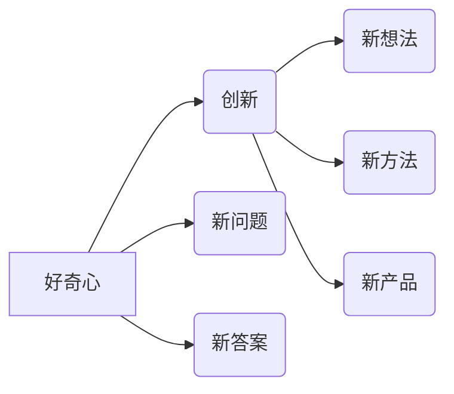
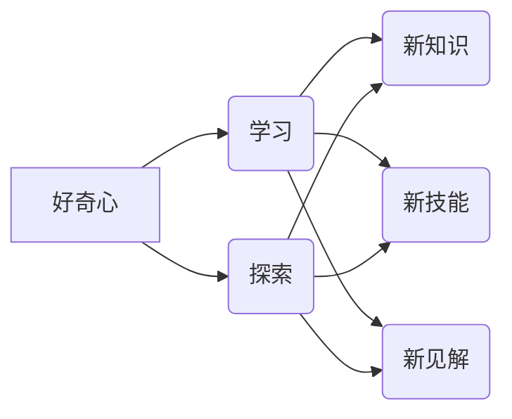

> 好奇心，探索，未知，创新，学习，人工智能，科学，技术

# 好奇心：探索未知的动力

好奇心是人类进步的引擎，它推动着我们不断探索未知，创造新的知识和技术。在IT领域，好奇心更是创新的源泉，是引领我们走向未来的动力。本文将探讨好奇心的本质、它在IT领域的应用，以及如何培养和利用好奇心来推动科技创新。

## 1. 背景介绍

好奇心是一种内在的驱动力，它促使我们对周围的世界充满好奇，想要了解事物的本质和运作规律。在IT领域，好奇心体现在对新技术、新算法、新应用的不懈追求上。好奇心不仅是一种个人特质，也是推动整个科技行业发展的关键因素。

### 1.1 好奇心的起源

好奇心是人类智慧的一部分，它源于我们对未知的好奇和探索欲望。从进化心理学的角度来看，好奇心有助于人类适应环境，学习新技能，提高生存能力。随着人类文明的发展，好奇心逐渐演变成了一种探索未知的驱动力。

### 1.2 好奇心在IT领域的体现

在IT领域，好奇心体现在以下几个方面：

- 对新技术的热情：IT行业新技术层出不穷，好奇心驱使着开发者不断学习和探索新技术，将其应用于实际项目中。
- 对复杂问题的挑战：好奇心促使科学家和工程师面对复杂问题，寻找解决方案，推动科技进步。
- 对用户体验的改进：好奇心驱使着设计师和工程师不断优化用户体验，提升产品价值。

## 2. 核心概念与联系

### 2.1 好奇心与创新的联系

好奇心是创新的源泉，它促使人们提出新问题，寻找新答案。以下是一个Mermaid流程图，展示了好奇心与创新的联系：



### 2.2 好奇心与学习的联系

好奇心也是学习的重要驱动力。以下是一个Mermaid流程图，展示了好奇心与学习的联系：



## 3. 核心算法原理 & 具体操作步骤

### 3.1 算法原理概述

好奇心驱动的IT创新通常遵循以下原理：

1. **问题发现**：通过观察和思考，发现新的问题和挑战。
2. **知识探索**：通过学习和研究，获取解决问题的关键知识。
3. **方法研究**：探索和设计新的解决方案和方法。
4. **原型实现**：快速构建原型，验证解决方案的有效性。
5. **迭代改进**：根据反馈不断优化解决方案。

### 3.2 算法步骤详解

以下是好奇心驱动的IT创新的具体操作步骤：

1. **定义问题**：明确要解决的问题和目标。
2. **收集信息**：广泛收集相关信息，包括技术、市场、用户需求等。
3. **学习研究**：学习相关知识，包括现有技术、学术论文、行业报告等。
4. **设计方案**：基于所学知识，设计解决方案。
5. **原型开发**：快速构建原型，验证方案可行性。
6. **用户测试**：收集用户反馈，优化设计方案。
7. **迭代更新**：根据反馈不断迭代和改进产品。

### 3.3 算法优缺点

**优点**：

- **推动创新**：好奇心是创新的源泉，能够激发人们的创造力。
- **提高效率**：好奇心驱动的学习能够快速掌握新知识，提高工作效率。
- **增强动力**：好奇心能够激发人们的内在动力，使他们更加专注和投入。

**缺点**：

- **容易分心**：好奇心可能导致人们过于分散注意力，影响工作效率。
- **风险较高**：好奇心驱动的创新可能面临失败的风险。
- **资源消耗**：好奇心驱动的探索可能需要大量时间和资源。

### 3.4 算法应用领域

好奇心驱动的IT创新广泛应用于以下领域：

- **人工智能**：通过好奇心探索新的算法和模型，推动AI技术发展。
- **软件开发**：通过好奇心改进开发工具和流程，提升软件质量。
- **用户体验设计**：通过好奇心研究用户需求，设计更人性化的产品。
- **网络安全**：通过好奇心研究黑客攻击手段，提高网络安全防护能力。

## 4. 数学模型和公式 & 详细讲解 & 举例说明

### 4.1 数学模型构建

好奇心驱动的IT创新可以看作是一个复杂的决策过程。以下是一个简化的数学模型：

$$
\text{创新} = f(\text{好奇心}, \text{知识}, \text{资源}, \text{反馈})
$$

其中，好奇心、知识、资源和反馈是影响创新的四个关键因素。

### 4.2 公式推导过程

好奇心驱动的创新是一个动态过程，可以通过以下步骤进行推导：

1. **好奇心**：好奇心是创新的起点，它促使人们提出问题。
2. **知识**：通过学习和研究，获取解决问题的知识。
3. **资源**：包括时间、资金、人才等资源，用于实现创新。
4. **反馈**：通过用户反馈和测试结果，评估创新效果。

### 4.3 案例分析与讲解

以下是一个好奇心驱动创新的案例：

**案例**：谷歌的自动驾驶汽车

谷歌的自动驾驶汽车项目起源于工程师对自动驾驶技术的浓厚兴趣。他们通过学习和研究，掌握了自动驾驶所需的传感器、算法和软件技术。在资源充足的条件下，他们快速构建了原型车，并在实际道路上进行了测试。通过不断收集用户反馈和改进，谷歌的自动驾驶汽车逐渐成为现实。

## 5. 项目实践：代码实例和详细解释说明

### 5.1 开发环境搭建

以开发一个简单的机器学习项目为例，以下是开发环境的搭建步骤：

1. **安装Python环境**：使用Anaconda或Miniconda创建Python虚拟环境。
2. **安装依赖库**：使用pip安装必要的库，如NumPy、Pandas、Scikit-learn等。
3. **数据准备**：收集和预处理数据。

### 5.2 源代码详细实现

以下是一个简单的机器学习项目的代码实例：

```python
import pandas as pd
from sklearn.model_selection import train_test_split
from sklearn.linear_model import LogisticRegression

# 读取数据
data = pd.read_csv('data.csv')

# 特征和标签
X = data.drop('target', axis=1)
y = data['target']

# 划分训练集和测试集
X_train, X_test, y_train, y_test = train_test_split(X, y, test_size=0.2, random_state=42)

# 创建模型
model = LogisticRegression()

# 训练模型
model.fit(X_train, y_train)

# 评估模型
print(f"模型在测试集上的准确率：{model.score(X_test, y_test)}")
```

### 5.3 代码解读与分析

这段代码实现了以下功能：

1. 使用pandas读取数据。
2. 使用Scikit-learn的train_test_split函数将数据划分为训练集和测试集。
3. 创建LogisticRegression模型。
4. 使用训练集训练模型。
5. 使用测试集评估模型性能。

### 5.4 运行结果展示

运行上述代码后，将输出模型在测试集上的准确率。

## 6. 实际应用场景

好奇心驱动的IT创新在许多实际应用场景中取得了成功：

### 6.1 人工智能

- **图像识别**：通过好奇心探索新的图像识别算法，提高识别准确率。
- **语音识别**：通过好奇心研究语音处理技术，实现更准确、更流畅的语音识别。
- **自然语言处理**：通过好奇心开发新的自然语言处理技术，提升语言理解和生成能力。

### 6.2 软件开发

- **敏捷开发**：通过好奇心探索新的软件开发方法，提高开发效率和产品质量。
- **DevOps**：通过好奇心推动软件开发和运维的融合，实现更快、更稳定的软件开发流程。

### 6.3 用户体验设计

- **交互设计**：通过好奇心研究用户行为，设计更直观、更易用的用户界面。
- **用户体验研究**：通过好奇心探索用户体验的各个方面，提升产品价值。

## 7. 工具和资源推荐

### 7.1 学习资源推荐

- **书籍**：《深度学习》、《机器学习》、《编程珠玑》
- **在线课程**：Coursera、edX、Udacity
- **技术社区**：Stack Overflow、GitHub

### 7.2 开发工具推荐

- **编程语言**：Python、Java、C++
- **开发框架**：Django、Flask、Spring
- **版本控制**：Git

### 7.3 相关论文推荐

- **《Deep Learning》**：Ian Goodfellow, Yoshua Bengio, Aaron Courville
- **《Pattern Recognition and Machine Learning》**：Christopher M. Bishop
- **《Programming Pearls》**：Jon Bentley

## 8. 总结：未来发展趋势与挑战

### 8.1 研究成果总结

好奇心驱动的IT创新在人工智能、软件开发、用户体验设计等领域取得了显著成果。然而，好奇心驱动的创新仍然面临诸多挑战，如资源限制、技术瓶颈、伦理问题等。

### 8.2 未来发展趋势

未来，好奇心驱动的IT创新将呈现以下发展趋势：

- **跨学科融合**：好奇心将推动不同学科之间的交叉融合，产生新的研究方向和应用领域。
- **人工智能赋能**：人工智能技术将进一步提高好奇心驱动的创新效率和质量。
- **开源共享**：好奇心驱动的创新成果将更加开放和共享，促进全球科技创新。

### 8.3 面临的挑战

好奇心驱动的IT创新面临的挑战主要包括：

- **资源限制**：创新需要大量的资源投入，包括资金、人才、时间等。
- **技术瓶颈**：技术发展面临诸多难题，需要不断突破。
- **伦理问题**：好奇心驱动的创新可能带来伦理问题，需要谨慎处理。

### 8.4 研究展望

未来，好奇心驱动的IT创新将继续推动科技发展，为人类社会创造更多价值。以下是几个研究展望：

- **可持续发展**：将好奇心应用于可持续发展领域，推动绿色科技发展。
- **教育创新**：通过好奇心培养创新人才，推动教育变革。
- **医疗健康**：通过好奇心开发新的医疗技术和设备，提高人类健康水平。

## 9. 附录：常见问题与解答

**Q1：好奇心如何推动科技发展？**

A：好奇心驱使人们不断探索未知，提出新问题，寻找新答案，从而推动科技发展。

**Q2：如何培养好奇心？**

A：培养好奇心可以通过以下方式：

- **多读书、多学习**：广泛阅读，学习新知识，拓宽视野。
- **多观察、多思考**：观察周围的世界，思考问题的本质。
- **多尝试、多实践**：勇于尝试新事物，从实践中学习。

**Q3：好奇心是否会导致分心？**

A：好奇心可能会导致人们过于分散注意力，影响工作效率。因此，需要合理管理好奇心，避免过度分散注意力。

**Q4：好奇心在IT领域的应用有哪些？**

A：好奇心在IT领域的应用包括：

- **人工智能**：探索新的算法和模型，推动AI技术发展。
- **软件开发**：改进开发工具和流程，提升软件质量。
- **用户体验设计**：研究用户需求，设计更人性化的产品。

**Q5：如何将好奇心转化为实际成果？**

A：将好奇心转化为实际成果可以通过以下步骤：

- **定义问题**：明确要解决的问题和目标。
- **学习研究**：学习相关知识，获取解决问题的方法。
- **实践探索**：通过实践探索，验证解决方案的有效性。
- **迭代优化**：根据反馈不断优化解决方案。

---

作者：禅与计算机程序设计艺术 / Zen and the Art of Computer Programming