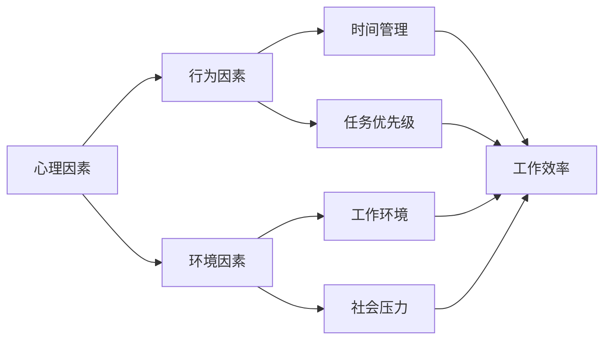

> 关键词：拖延症、工作效率、执行力、时间管理、心理学、生产力、工作习惯

# 如何克服拖延症：如何提高工作效率和执行力？

在快节奏的现代生活中，拖延症已成为许多人在工作和生活中普遍面临的挑战。它不仅影响工作效率，还可能损害个人职业发展和心理健康。本文将深入探讨拖延症的本质，并提供一系列有效策略，帮助读者克服拖延症，提高工作效率和执行力。

## 1. 背景介绍

### 1.1 拖延症的普遍性

拖延症是一种普遍存在的现象，调查显示，全球约有20%至70%的人在不同程度上遭受拖延症的困扰。它不仅影响个人，也对企业和社会造成巨大损失。据估计，拖延症每年给美国经济造成的损失高达450亿美元。

### 1.2 拖延症的影响

拖延症对工作效率和执行力的负面影响是多方面的：

- **时间浪费**：拖延导致任务延期，浪费宝贵的时间资源。
- **心理压力**：拖延带来的焦虑和愧疚感，对心理健康造成负面影响。
- **工作质量下降**：由于时间紧迫，工作质量可能受到影响。
- **职业发展受阻**：持续的拖延可能导致职业机会的错失。

### 1.3 本文目标

本文旨在帮助读者了解拖延症的本质，并提供实用的策略来克服拖延，提高工作效率和执行力。

## 2. 核心概念与联系

### 2.1 拖延症的核心概念

拖延症的核心概念可以概括为以下三个方面：

- **心理因素**：包括恐惧、完美主义、逃避等心理因素。
- **行为因素**：包括时间管理不当、任务优先级不合理等行为因素。
- **环境因素**：包括工作环境、社会压力等环境因素。

### 2.2 Mermaid 流程图

### 2.3 核心概念联系

心理、行为和环境因素相互作用，共同影响着拖延症的发生和发展。例如，心理上的恐惧可能导致行为上的时间管理不当，进而影响工作效率，并在工作环境中形成恶性循环。

## 3. 核心算法原理 & 具体操作步骤

### 3.1 算法原理概述

克服拖延症的核心原理是改变不良的心理、行为和环境因素，建立积极的习惯和机制。

### 3.2 算法步骤详解

#### 3.2.1 自我认知

- **识别拖延模式**：通过自我反思，识别拖延的具体模式和触发因素。
- **了解拖延原因**：分析拖延背后的心理和情感原因。

#### 3.2.2 建立目标

- **设定明确目标**：将大目标分解为小目标，制定可行的行动计划。
- **制定时间表**：为每个任务设定具体的时间表和截止日期。

#### 3.2.3 时间管理

- **使用番茄工作法**：将工作时间分为25分钟的工作周期和5分钟的休息时间。
- **优先级排序**：使用紧急-重要矩阵评估任务的优先级。

#### 3.2.4 环境优化

- **创造有利环境**：为工作创造一个整洁、安静的环境。
- **避免干扰源**：关闭不必要的社交媒体和通知，减少干扰。

#### 3.2.5 心理调节

- **正面激励**：给自己设定奖励，以正面激励来克服拖延。
- **情绪管理**：学习情绪管理技巧，应对拖延带来的负面情绪。

### 3.3 算法优缺点

#### 3.3.1 优点

- **系统性**：从心理、行为和环境等多个层面综合考虑，提供全面解决方案。
- **实用性**：提供具体可操作的策略，易于实践。
- **科学性**：基于心理学和行为科学的理论基础。

#### 3.3.2 缺点

- **实施难度**：改变习惯需要时间和毅力，对个人意志力要求较高。
- **个性化差异**：不同人的拖延症原因和解决方案可能不同，需要个性化调整。

### 3.4 算法应用领域

该算法适用于所有需要提高工作效率和执行力的个人和企业。无论是学生、职场人士还是创业者，都可以通过实践这些策略来克服拖延，实现目标。

## 4. 数学模型和公式 & 详细讲解 & 举例说明

### 4.1 数学模型构建

拖延症可以用一个简单的数学模型来描述：

$$
拖延程度 = \frac{心理因素 \times 行为因素 \times 环境因素}{动力}
$$

其中，动力是指个人克服拖延的决心和努力。

### 4.2 公式推导过程

该公式的推导基于以下假设：

- 拖延程度与心理、行为和环境因素成正比。
- 拖延程度与动力成反比。

### 4.3 案例分析与讲解

假设某人在心理上对失败有恐惧感，行为上时间管理能力较差，同时工作环境嘈杂。根据上述模型，该人的拖延程度可能会较高。

## 5. 项目实践：代码实例和详细解释说明

### 5.1 开发环境搭建

由于拖延症克服主要涉及心理和行为层面，因此这里不涉及具体的代码实现。

### 5.2 源代码详细实现

同样，由于拖延症克服不涉及编程，因此不提供代码实例。

### 5.3 代码解读与分析

拖延症克服的“代码”是实现上述策略的具体行动，如设定时间表、使用番茄工作法等。

### 5.4 运行结果展示

通过实践上述策略，个人可以观察到工作效率和执行力显著提高，拖延现象减少。

## 6. 实际应用场景

### 6.1 个人应用场景

- **学生**：通过设定学习计划，提高学习效率，避免考试前突击。
- **职场人士**：通过合理规划工作，提高工作效率，减少加班时间。
- **创业者**：通过有效的时间管理，提高创业项目的成功率。

### 6.2 企业应用场景

- **团队管理**：通过培训员工克服拖延，提高团队整体执行力。
- **项目管理**：通过时间管理工具和策略，确保项目按时完成。

## 7. 工具和资源推荐

### 7.1 学习资源推荐

- 《拖延心理学》
- 《番茄工作法图解》
- 《如何高效学习》

### 7.2 开发工具推荐

- 时间管理工具：Trello、Asana
- 日程管理工具：Google Calendar、Microsoft Outlook

### 7.3 相关论文推荐

- Piers Steel, "The Nature of Procrastination: A Meta-Analytic and Theoretical Review of quintessential Personal Time Management Failure"
- Timothy Pychyl, "The Procrastination Equation"

## 8. 总结：未来发展趋势与挑战

### 8.1 研究成果总结

本文从心理学、行为学等多个角度分析了拖延症的原因和解决方案，并提供了实用的策略来克服拖延，提高工作效率和执行力。

### 8.2 未来发展趋势

随着心理学和行为科学的发展，未来克服拖延症的研究将更加深入，可能出现更加科学和有效的策略。

### 8.3 面临的挑战

克服拖延症是一个长期的过程，需要个人持续的努力和坚持。

### 8.4 研究展望

未来研究应更加关注个体差异，开发更加个性化的解决方案，以帮助更多人克服拖延，实现个人和职业目标。

## 9. 附录：常见问题与解答

**Q1：拖延症是否可以完全克服？**

A：拖延症可以完全克服，但需要长期的努力和坚持。

**Q2：如何克服对失败的恐惧？**

A：可以通过设定小目标、逐步增加难度、学习失败经验等方式来克服对失败的恐惧。

**Q3：如何提高时间管理能力？**

A：可以通过使用时间管理工具、设定时间表、优先级排序等方式来提高时间管理能力。

**Q4：如何创造有利于工作的环境？**

A：可以通过整理工作空间、减少干扰、保持整洁等方式来创造有利于工作的环境。

**Q5：如何保持动力？**

A：可以通过设定奖励、庆祝小成就、保持积极心态等方式来保持动力。

作者：禅与计算机程序设计艺术 / Zen and the Art of Computer Programming