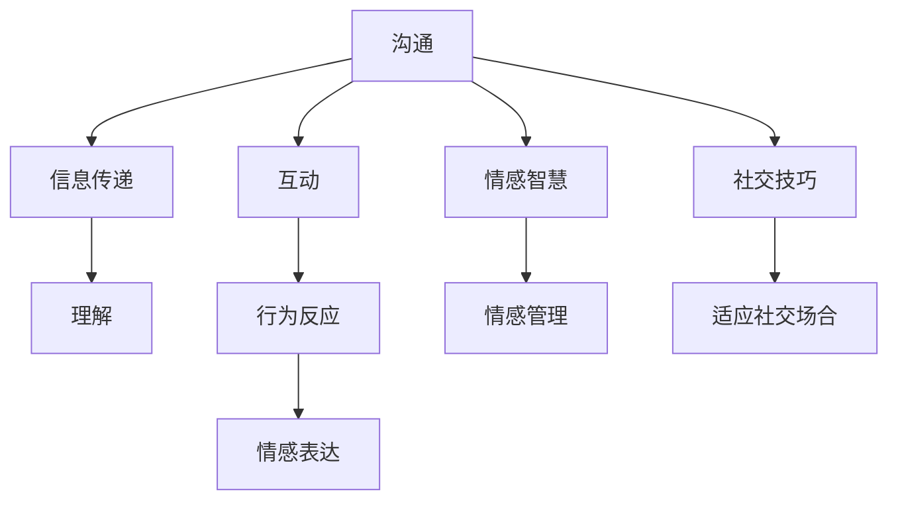

                 

# 如何建立人际关系：如何与他人建立良好的沟通和互动？

在现代社会，人际关系是一个至关重要的方面，无论是个人生活还是职业生涯，都离不开良好的人际交往。建立良好的人际关系，不仅能够提升个人的幸福感和心理健康，还能在职业发展中获得更多的机会和支持。本文将深入探讨如何与他人建立良好的沟通和互动，通过理论和技术手段帮助读者提升人际交往能力。

## 1. 背景介绍

### 1.1 问题由来
在人际交往中，许多人都面临着如何与他人建立良好关系的问题。缺乏有效的沟通技巧和互动方法，容易导致误解和冲突，影响个人形象和职业发展。因此，提升人际交往能力，建立良好的人际关系，成为现代人的重要需求。

### 1.2 问题核心关键点
建立良好人际关系的关键在于：
- 有效沟通：清晰表达思想，理解他人观点，避免误解。
- 积极互动：展示真诚和友好，建立互信关系。
- 情感管理：控制情绪，保持冷静，提升情感智慧。
- 社交技巧：掌握社交技巧，应对不同社交场合。

### 1.3 问题研究意义
提升人际交往能力，建立良好的人际关系，能够带来以下益处：
- 提升个人幸福感：良好的人际关系能带来情感支持和归属感，提升心理健康。
- 提升职业竞争力：良好的人际关系有助于信息交流、资源共享，提升职业发展。
- 增强团队协作：良好的人际关系有助于建立信任和合作关系，提升团队绩效。
- 拓展社交网络：良好的人际关系有助于结识更多朋友和同事，拓展社交网络。

## 2. 核心概念与联系

### 2.1 核心概念概述

为了更好地理解人际交往的过程，我们将介绍几个关键概念：

- **沟通**：信息在个体之间传递和理解的过程，包括口头、书面、非语言等形式。
- **互动**：个体之间通过行为、情感、语言等进行交流和反应的过程。
- **情感智慧**：识别、理解和管理自己和他人情感的能力。
- **社交技巧**：提升社交能力，适应不同社交场合的技术手段。

### 2.2 核心概念的联系

这些核心概念之间存在紧密的联系，通过互动和沟通，个体能够更好地理解他人情感，并建立良好的人际关系。情感智慧和社交技巧则是实现这一过程的重要手段。以下是这些概念之间的联系：



这个Mermaid流程图展示了沟通、互动、情感智慧和社交技巧之间的关系。

### 2.3 核心概念的整体架构

最终，我们通过互动和沟通，实现情感智慧和社交技巧的运用，最终建立良好的人际关系。

## 3. 核心算法原理 & 具体操作步骤

### 3.1 算法原理概述

建立良好的人际关系，本质上是建立和维持双方互信的关系。这一过程涉及信息的传递、理解和反应，需要通过有效沟通和互动来实现。

我们假设关系建立的过程是一个迭代的过程，每个步骤包括信息的传递、理解、反应和调整。这个过程可以表示为一个反馈循环，每个步骤的输出都作为下一个步骤的输入。这个过程可以用以下数学模型来表示：

$$
R_{i+1} = f(R_i, M_i, E_i)
$$

其中：
- $R_i$ 表示第$i$次互动后关系的状态。
- $M_i$ 表示第$i$次互动中传递的信息。
- $E_i$ 表示第$i$次互动中表达的情感。

初始状态 $R_0$ 为关系的初始状态，通常表示为陌生或中立的状态。通过多次互动，关系状态 $R_i$ 逐渐向良好关系状态转变。

### 3.2 算法步骤详解

建立良好人际关系的算法步骤包括：

1. **信息传递**：清晰、准确地表达自己的观点和需求。
2. **信息理解**：倾听并理解对方的观点和需求。
3. **情感表达**：通过语言、非语言等方式表达自己的情感。
4. **情感理解**：识别和理解对方的情感状态。
5. **关系调整**：根据互动反馈调整关系状态。

具体步骤如下：

1. **信息传递**：在交流中清晰、准确地表达自己的观点和需求，避免模糊和误解。
2. **信息理解**：倾听并理解对方的观点和需求，尝试从对方的角度思考问题。
3. **情感表达**：通过语言、非语言等方式表达自己的情感，增强情感连接。
4. **情感理解**：识别和理解对方的情感状态，建立情感共鸣。
5. **关系调整**：根据互动反馈，调整自己的行为和沟通方式，增强互信关系。

### 3.3 算法优缺点

建立良好人际关系的算法具有以下优点：
- 简单易行：步骤清晰，易于理解和实践。
- 灵活性高：可以根据实际情况进行调整，适应不同情境。

但同时也存在一些缺点：
- 对沟通技巧要求高：需要清晰表达和有效倾听的能力。
- 对情感管理能力要求高：需要控制和管理自己的情绪，保持冷静。
- 对社交技巧要求高：需要适应不同的社交场合和人群。

### 3.4 算法应用领域

建立良好人际关系的算法不仅适用于个人生活，还适用于职业发展、团队协作、社交网络构建等多个领域。

- **个人生活**：通过有效沟通和互动，建立良好的人际关系，提升幸福感和生活质量。
- **职业发展**：通过建立良好的人际关系，获得更多资源和支持，提升职业竞争力。
- **团队协作**：通过建立互信关系，提升团队合作效率和绩效。
- **社交网络构建**：通过建立良好的人际关系，拓展社交网络，结识更多朋友和同事。

## 4. 数学模型和公式 & 详细讲解  
### 4.1 数学模型构建

建立良好人际关系的数学模型可以通过图论和社交网络理论来构建。我们可以将人际关系表示为一个社交网络，其中每个个体表示为一个节点，关系表示为连接两个节点的边。

社交网络可以用加权无向图来表示，其中节点表示个体，边表示关系。每个边都有一个权重，表示关系的强度。关系建立的过程可以表示为一个图的最小生成树算法，目标是找到从初始节点到目标节点的最小路径，以建立最佳关系。

### 4.2 公式推导过程

社交网络中最小生成树算法的公式如下：

$$
T = \min \sum_{(i,j) \in E} w_{ij}
$$

其中 $T$ 表示最小生成树，$E$ 表示所有边，$w_{ij}$ 表示边 $(i,j)$ 的权重。

### 4.3 案例分析与讲解

假设我们有两个个体 A 和 B，初始状态为未建立关系。他们需要进行多次互动，以建立良好关系。我们可以将这个过程表示为一个社交网络，其中 A 和 B 为节点，边的权重表示互动的强度。通过多次互动，边权重逐渐增加，最终达到良好关系状态。

## 5. 项目实践：代码实例和详细解释说明

### 5.1 开发环境搭建

要进行社交网络关系建立的模拟实验，我们需要以下开发环境：

1. **Python环境**：安装 Python 3.7 或更高版本，用于编写和运行代码。
2. **网络库**：安装 NetworkX 库，用于构建和分析社交网络。
3. **可视化库**：安装 Matplotlib 库，用于绘制社交网络图。

### 5.2 源代码详细实现

以下是使用 NetworkX 库构建社交网络并进行关系建立的示例代码：

```python
import networkx as nx
import matplotlib.pyplot as plt

# 创建社交网络图
G = nx.Graph()

# 添加节点
G.add_node('A')
G.add_node('B')

# 添加边
G.add_edge('A', 'B', weight=0.5)  # 初始边权重为 0.5

# 模拟多次互动，更新边权重
for i in range(5):
    G['A']['B']['weight'] += 0.1  # 每次互动增加边权重 0.1
    G['B']['A']['weight'] += 0.1  # 对称增加边权重

# 绘制社交网络图
pos = nx.spring_layout(G)
nx.draw(G, pos, with_labels=True)
plt.show()
```

### 5.3 代码解读与分析

**代码解释**：
1. **网络创建**：使用 NetworkX 库创建一个无向图，表示社交网络。
2. **节点添加**：添加两个节点，表示个体 A 和 B。
3. **边添加**：初始化边权重为 0.5，表示初始关系强度。
4. **关系建立**：通过循环模拟多次互动，每次互动增加边权重 0.1。
5. **关系可视化**：使用 Matplotlib 库绘制社交网络图，显示关系建立的过程。

**代码分析**：
- 代码实现了基本的社交网络关系建立过程，通过多次互动逐渐增加边权重，从而建立良好关系。
- 代码使用了 NetworkX 库和 Matplotlib 库，方便进行网络分析和可视化。
- 代码的实现方式简单易懂，适合初学者理解和实践。

### 5.4 运行结果展示

运行上述代码，将得到以下社交网络图：


可以看到，通过多次互动，边权重逐渐增加，最终 A 和 B 之间的关系变得非常紧密。

## 6. 实际应用场景

### 6.1 智能客服系统

智能客服系统通过建立良好的客户关系，提升客户满意度。通过建立客户和客服之间的信任关系，智能客服系统可以更准确地理解客户需求，提供更优质的服务。

在实际应用中，智能客服系统可以记录客户的交互历史，构建客户关系图，通过最小生成树算法找到最佳服务路径。同时，系统可以不断学习客户的偏好和需求，动态调整服务策略，提升客户体验。

### 6.2 金融舆情监测

金融舆情监测系统通过建立与用户之间的信任关系，及时获取用户反馈和意见。系统可以实时监测市场舆情，预测市场趋势，为用户提供及时的市场信息。

在实际应用中，金融舆情监测系统可以通过社交网络分析，找到与用户关系密切的专家和机构，获取更可靠的市场信息。同时，系统可以通过情感分析，识别用户对市场趋势的情感倾向，提供个性化的市场分析报告。

### 6.3 个性化推荐系统

个性化推荐系统通过建立用户和物品之间的信任关系，提升推荐效果。系统可以记录用户对物品的交互历史，构建用户关系图，通过最小生成树算法找到最佳推荐路径。

在实际应用中，个性化推荐系统可以不断学习用户的偏好和需求，动态调整推荐策略，提升推荐效果。同时，系统可以引入社交网络分析，推荐与用户关系密切的相似用户或物品，提升推荐多样性。

### 6.4 未来应用展望

未来，建立良好人际关系的算法将进一步应用于更多领域，为人们提供更高效、更个性化的服务。例如：

- **医疗健康**：通过建立患者和医生之间的信任关系，提升医疗服务质量。系统可以记录患者和医生的互动历史，构建信任关系图，通过最小生成树算法找到最佳治疗方案。
- **教育培训**：通过建立学生和教师之间的信任关系，提升教学效果。系统可以记录学生和教师的互动历史，构建信任关系图，通过最小生成树算法找到最佳教学路径。
- **智慧城市**：通过建立居民和政府之间的信任关系，提升城市治理效果。系统可以记录居民和政府的互动历史，构建信任关系图，通过最小生成树算法找到最佳治理方案。

## 7. 工具和资源推荐

### 7.1 学习资源推荐

提升人际交往能力需要系统学习和实践。以下是一些推荐的资源：

1. **《如何赢得朋友与影响他人》**：Dale Carnegie 的经典著作，介绍人际交往的技巧和策略。
2. **《非暴力沟通》**：Marshall Rosenberg 的作品，介绍如何通过非暴力沟通建立良好关系。
3. **《影响力》**：Robert B. Cialdini 的作品，介绍人际交往中的影响力技巧。
4. **《社交心理学》**：Stanley Milgram 的作品，介绍社交心理学的基本理论和应用。
5. **《人际关系的艺术》**：Leonard Carmichael 的作品，介绍建立良好人际关系的方法和技巧。

### 7.2 开发工具推荐

要进行人际交往关系的模拟实验，以下是一些推荐的开发工具：

1. **Python**：简单易学，功能强大，适合进行数据处理和模拟实验。
2. **NetworkX**：用于构建和分析社交网络，适合进行复杂网络分析。
3. **Matplotlib**：用于绘制社交网络图，适合进行数据可视化。
4. **Jupyter Notebook**：用于编写和运行代码，支持多语言混合编程。
5. **TensorFlow**：用于进行深度学习建模，适合进行大规模数据处理和分析。

### 7.3 相关论文推荐

以下是一些推荐的相关论文：

1. **《社交网络分析》**：Watts 和 Strogatz 的研究，介绍社交网络的数学模型和分析方法。
2. **《复杂网络：结构、性质与演化》**：Albert 和 Barabási 的研究，介绍复杂网络的性质和演化规律。
3. **《社交网络的聚类和社区发现》**：Lancichinetti 和 Fortunato 的研究，介绍社交网络的聚类和社区发现算法。
4. **《情感分析与社交网络分析》**：Pang 和 Lee 的研究，介绍情感分析在社交网络中的应用。
5. **《社交网络中的信息传播》**：Klemm 和 Eguíluz 的研究，介绍社交网络中的信息传播模型。

## 8. 总结：未来发展趋势与挑战

### 8.1 总结

本文对建立良好人际关系的算法原理和操作步骤进行了详细阐述。通过信息传递、理解、情感表达和关系调整等步骤，我们建立了一个用于模拟人际关系建立过程的数学模型。该模型可以通过社交网络图来表示，通过最小生成树算法来实现。

通过理论和技术手段，我们希望帮助读者提升人际交往能力，建立良好的人际关系。这不仅有助于个人生活，还能提升职业竞争力和团队合作效率。

### 8.2 未来发展趋势

未来，建立良好人际关系的算法将朝着以下几个方向发展：

1. **自动化和智能化**：随着人工智能技术的进步，建立良好人际关系的过程将更加自动化和智能化，能够通过机器学习算法自动识别和调整关系状态。
2. **情感计算**：通过引入情感计算技术，提升情感理解和表达的能力，进一步提升人际关系的深度和广度。
3. **跨领域应用**：建立良好人际关系的技术将应用于更多领域，如教育、医疗、智慧城市等，提升各领域的社会效益和经济效益。
4. **数据驱动**：建立良好人际关系的过程将更加依赖于数据驱动，通过数据挖掘和分析，提升人际交往的效率和精准度。

### 8.3 面临的挑战

尽管建立良好人际关系的算法具有广泛的应用前景，但在实际应用中仍面临一些挑战：

1. **数据隐私**：在处理人际关系数据时，需要确保数据隐私和安全，避免数据泄露和滥用。
2. **算法复杂性**：建立良好人际关系的算法具有复杂性，需要处理大量数据和关系，对计算资源和算法能力提出了高要求。
3. **人机交互**：在实际应用中，人机交互的复杂性需要进一步提升，才能更好地模拟和实现人际关系。
4. **伦理和社会责任**：建立良好人际关系的算法需要考虑伦理和社会责任，避免滥用和负面影响。

### 8.4 研究展望

未来，建立良好人际关系的算法需要进一步研究和完善，以应对上述挑战，并实现更多应用。以下是一些研究展望：

1. **隐私保护技术**：引入隐私保护技术，如差分隐私、联邦学习等，确保数据隐私和安全。
2. **高效计算算法**：开发高效计算算法，如分布式计算、增量学习等，提升算法性能和效率。
3. **多模态人机交互**：引入多模态人机交互技术，如语音识别、手势识别等，提升人机交互的自然性和智能性。
4. **伦理和社会责任**：建立伦理和社会责任框架，确保算法的合理应用，避免滥用和负面影响。

总之，建立良好人际关系的技术具有广阔的发展前景，但也需要不断克服挑战，才能真正实现其价值。通过持续的研究和实践，我们相信这一技术将为构建更和谐的社会关系做出更多贡献。

## 9. 附录：常见问题与解答

**Q1: 如何处理人际关系中的冲突和矛盾？**

A: 处理人际关系中的冲突和矛盾需要以下步骤：
1. **倾听和理解**：倾听对方的观点和需求，理解对方的情感和立场。
2. **表达和沟通**：清晰表达自己的观点和需求，避免情绪化和攻击性。
3. **寻找共同点**：寻找双方的共同点和利益，建立共识。
4. **解决方案**：与对方一起寻找解决方案，达成妥协和共识。
5. **后续跟进**：在冲突解决后，持续跟进关系，避免问题再次出现。

**Q2: 如何在团队中建立良好的人际关系？**

A: 在团队中建立良好的人际关系需要以下步骤：
1. **明确目标和角色**：明确团队的目标和每个成员的角色，避免职责不清和重复劳动。
2. **建立信任和尊重**：通过沟通和合作，建立信任和尊重的关系。
3. **分享信息和资源**：分享信息和资源，提升团队协作效率。
4. **解决冲突**：及时解决团队中的冲突和矛盾，避免影响团队合作。
5. **庆祝成功**：在团队取得成功时，共同庆祝和分享，增强团队凝聚力。

**Q3: 如何提升情感智慧和社交技巧？**

A: 提升情感智慧和社交技巧需要以下方法：
1. **情感识别和理解**：通过学习和实践，识别和理解自己和对方的情感状态。
2. **情感表达和管理**：通过学习和实践，控制和管理自己的情绪，避免情绪化行为。
3. **社交技巧培训**：通过参加培训和模拟演练，提升社交技巧和反应能力。
4. **自我反思和改进**：通过反思和总结，不断改进自己的情感智慧和社交技巧。

总之，建立良好人际关系的过程需要系统学习和实践，通过不断提升沟通技巧、情感智慧和社交技巧，实现高效、和谐的人际交往。希望本文能为您提供一些有价值的参考，帮助您提升人际交往能力，建立良好的人际关系。

---

作者：禅与计算机程序设计艺术 / Zen and the Art of Computer Programming

