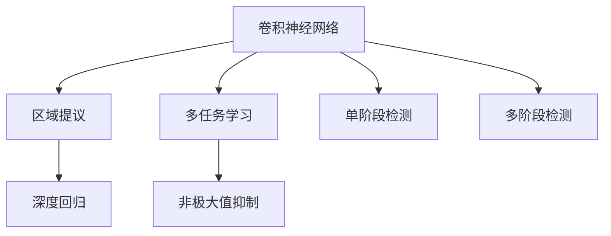

                 

# 对象检测 (Object Detection) 原理与代码实例讲解

> 关键词：对象检测,YOLO,SSD,Faster R-CNN,目标检测,深度学习,计算机视觉

## 1. 背景介绍

### 1.1 问题由来
物体检测 (Object Detection) 是计算机视觉中的一个核心任务，旨在从图像或视频中识别出物体的位置和类别。早期的方法通常依赖手工设计的特征，需要大量特征工程，难以扩展到复杂场景。近年来，深度学习尤其是卷积神经网络 (Convolutional Neural Networks, CNNs) 的快速发展，使得目标检测进入了基于深度学习的快速迭代发展阶段。

深度学习通过大量数据和计算资源，训练出的神经网络具备自学习特征的能力，能够有效识别复杂场景中的物体。目标检测算法基于卷积神经网络提取图像特征，结合分类和回归任务，最终输出物体位置和类别的预测结果。

常见的目标检测方法包括 R-CNN 系列、Fast R-CNN、Faster R-CNN、YOLO 系列和 SSD 系列等。这些方法各有优缺点，适用于不同的应用场景。本文将详细介绍这些经典方法的核心原理和代码实现，并对比它们的优劣。

### 1.2 问题核心关键点
对象检测问题的核心在于从输入图像中，识别出物体的类别和位置。具体来说，需要解决以下问题：

1. **目标位置**：准确预测物体的位置。
2. **目标类别**：识别物体的具体类别。
3. **目标数**：预测物体数量，避免假阳性。

深度学习通过大量标注数据，训练神经网络学习这些任务，并逐渐提升检测精度。

## 2. 核心概念与联系

### 2.1 核心概念概述

对象检测问题涉及到多个关键概念，下面将对其中的核心概念进行详细讲解：

1. **卷积神经网络 (CNNs)**：用于提取图像特征的深度神经网络。
2. **区域提议 (Region Proposal)**：生成候选物体区域的算法，是两阶段检测方法的基础。
3. **深度回归 (Deep Regression)**：通过回归网络，预测物体的边界框 (Bounding Box)。
4. **多任务学习 (Multi-task Learning)**：联合学习物体分类和位置回归任务。
5. **非极大值抑制 (Non-Maximum Suppression, NMS)**：消除冗余框，保留得分最高的框。
6. **单阶段检测 (Single-stage Detection)**：通过单一网络输出物体边界框和类别。
7. **多阶段检测 (Two-stage Detection)**：先通过网络生成候选区域，再对这些区域进行分类和回归。

这些核心概念共同构成了目标检测的完整框架，使得深度学习模型能够高效、准确地识别出图像中的物体。

### 2.2 概念间的关系

这些核心概念之间存在紧密的联系，可以通过以下 Mermaid 流程图来展示：



这个流程图展示了卷积神经网络在目标检测中的作用，以及区域提议、深度回归、多任务学习、非极大值抑制、单阶段检测和多阶段检测等核心技术的相互关系。

## 3. 核心算法原理 & 具体操作步骤

### 3.1 算法原理概述

对象检测的核心算法基于深度神经网络，通常采用两阶段或单阶段的方法。两阶段方法通常包括区域提议和分类回归两个步骤，单阶段方法则通过单一网络直接输出物体边界框和类别。

两阶段方法的基本流程如下：

1. **区域提议**：生成候选物体区域。
2. **分类和回归**：对每个候选区域进行分类和回归，预测物体类别和边界框。
3. **非极大值抑制**：对预测结果进行后处理，消除冗余框。

单阶段方法则直接输出物体边界框和类别，不需要显式的区域提议步骤。

### 3.2 算法步骤详解

#### 3.2.1 两阶段检测算法
以 Faster R-CNN 为例，详细讲解两阶段检测算法的基本步骤。

**Step 1: 特征提取**
使用卷积神经网络提取输入图像的特征图。

**Step 2: 候选区域生成**
通过 RPN (Region Proposal Network) 生成候选物体区域。RPN 网络接收特征图作为输入，输出候选区域及对应的边界框置信度。

**Step 3: 物体分类和回归**
对每个候选区域进行分类和回归，预测物体类别和边界框。

**Step 4: 非极大值抑制**
对所有预测结果进行非极大值抑制，消除冗余框，保留得分最高的框。

**Step 5: 最终输出**
输出所有经过非极大值抑制的预测结果，作为物体检测的最终输出。

#### 3.2.2 单阶段检测算法
以 YOLO 为例，详细讲解单阶段检测算法的基本步骤。

**Step 1: 特征提取**
使用卷积神经网络提取输入图像的特征图。

**Step 2: 物体分类和回归**
直接对特征图进行分类和回归，预测物体类别和边界框。

**Step 3: 非极大值抑制**
对所有预测结果进行非极大值抑制，消除冗余框，保留得分最高的框。

**Step 4: 最终输出**
输出所有经过非极大值抑制的预测结果，作为物体检测的最终输出。

### 3.3 算法优缺点

#### 3.3.1 两阶段检测算法
**优点**：
- 可处理任意尺寸的物体。
- 检测精度高，适用于复杂场景。

**缺点**：
- 计算量大，速度较慢。
- 需要大量标注数据进行训练。

#### 3.3.2 单阶段检测算法
**优点**：
- 速度较快，适合实时应用。
- 计算量小，模型参数少。

**缺点**：
- 对小物体检测效果不佳。
- 检测精度略低于两阶段算法。

## 4. 数学模型和公式 & 详细讲解  
### 4.1 数学模型构建

对象检测的目标是给定一个输入图像 $x$，输出物体类别 $y$ 和边界框 $b$。具体来说，需要解决以下两个问题：

1. **分类问题**：将物体分为 $C$ 个类别，$y \in \{1, 2, \dots, C\}$。
2. **回归问题**：预测物体的边界框 $b \in \mathbb{R}^4$，表示物体的左上角坐标和宽度、高度。

### 4.2 公式推导过程

假设有 $N$ 个候选区域 $r_1, r_2, \dots, r_N$，每个区域 $r_i$ 的边界框为 $b_i = (x_i, y_i, w_i, h_i)$，对应的分类置信度为 $p_i$，回归置信度为 $d_i$。

**分类损失**：
$$
L_{class} = -\frac{1}{N} \sum_{i=1}^N p_i \log \sigma(d_i)
$$
其中，$\sigma$ 为 sigmoid 函数。

**回归损失**：
$$
L_{reg} = \frac{1}{N} \sum_{i=1}^N \sum_{j=1}^4 l_j (b_j - \hat{b}_j)
$$
其中，$l_j$ 为回归损失函数，通常使用均方误差或平滑 L1 损失。

**总损失函数**：
$$
L = L_{class} + \lambda L_{reg}
$$
其中，$\lambda$ 为分类损失和回归损失的权重系数。

### 4.3 案例分析与讲解

以 Faster R-CNN 为例，假设其 RPN 网络生成 $N$ 个候选区域 $r_1, r_2, \dots, r_N$，每个区域的分类置信度为 $p_i$，回归置信度为 $d_i$，对应的边界框为 $b_i = (x_i, y_i, w_i, h_i)$。

**Step 1: 特征提取**
使用卷积神经网络提取输入图像 $x$ 的特征图 $F$。

**Step 2: 候选区域生成**
RPN 网络接收 $F$ 作为输入，输出 $N$ 个候选区域 $r_i$ 和对应的边界框 $b_i$。

**Step 3: 物体分类和回归**
使用全卷积网络对每个候选区域进行分类和回归，输出每个区域的分类置信度 $p_i$ 和回归置信度 $d_i$，以及对应的边界框 $\hat{b}_i$。

**Step 4: 非极大值抑制**
对所有预测结果进行非极大值抑制，保留得分最高的 $K$ 个框。

**Step 5: 最终输出**
输出所有经过非极大值抑制的 $K$ 个预测结果，作为物体检测的最终输出。

## 5. 项目实践：代码实例和详细解释说明

### 5.1 开发环境搭建

**环境要求**：
- Python 3.7+
- CUDA 10.1+
- cuDNN 7.6.5.32+
- TensorFlow 2.3.0
- OpenCV 4.5.1.48+

**安装步骤**：
1. 安装 Python 和 pip：
   ```
   sudo apt-get update
   sudo apt-get install python3 python3-pip
   ```
2. 安装 CUDA 和 cuDNN：
   - 下载 CUDA 和 cuDNN 安装程序，按照官方指南进行安装。
3. 安装 TensorFlow：
   ```
   pip install tensorflow
   ```
4. 安装 OpenCV：
   ```
   pip install opencv-python
   ```

### 5.2 源代码详细实现

以下以 Faster R-CNN 为例，提供对象检测的 Python 代码实现。

**Step 1: 加载数据集**
定义数据集读取函数，读取 COCO 数据集。

```python
from pycocotools.coco import COCO
from pycocotools.mask import loadInstanceMask

class CocoDataset(Dataset):
    def __init__(self, annotation_file, image_dir, transform=None):
        self.coco = COCO(annotation_file)
        self.image_dir = image_dir
        self.transform = transform
        self.image_ids = list(self.coco.imgs.keys())
    
    def __len__(self):
        return len(self.image_ids)
    
    def __getitem__(self, index):
        image_id = self.image_ids[index]
        image = cv2.imread(f'{self.image_dir}/{image_id}.jpg')
        height, width = image.shape[:2]
        
        ann_ids = self.coco.getAnnIds(imgIds=image_id)
        anns = self.coco.loadAnns(ann_ids)
        
        boxes = []
        labels = []
        masks = []
        for ann in anns:
            if ann['category_id'] == 1:  # 只关注人
                x, y, w, h = ann['bbox']
                boxes.append([x / width, y / height, w / width, h / height])
                labels.append(ann['category_id'])
                
                # 加载掩码
                mask = loadInstanceMask(self.coco.loadMask(self.coco.annToImg(self.coco.imgs[image_id], ann)), all=True)
                mask = np.where(mask > 0.5, 1, 0).astype(np.uint8)
                masks.append(mask)
        
        image = cv2.cvtColor(image, cv2.COLOR_BGR2RGB)
        if self.transform:
            image, boxes, labels, masks = self.transform(image, boxes, labels, masks)
        
        return image, boxes, labels, masks
```

**Step 2: 定义模型结构**
定义 Faster R-CNN 模型的结构。

```python
class FasterRCNN(nn.Module):
    def __init__(self, num_classes):
        super(FasterRCNN, self).__init__()
        self.num_classes = num_classes
        self.roi_heads = ROIHeads(1024, 4, num_classes)
    
    def forward(self, x):
        # 提取特征图
        features = self.vgg(x)
        
        # 提取候选区域和边界框
        rpn_features = self.rpn(features)
        rpn_scores, rpn_bbox_deltas, rpn_proposals = self.rpn_head(rpn_features)
        
        # 分类和回归
        roi_features = self.roi_heads(rpn_features, rpn_proposals, rpn_scores, rpn_bbox_deltas)
        
        return roi_features, rpn_scores, rpn_bbox_deltas
```

**Step 3: 定义训练函数**
定义训练函数，使用 COCO 数据集进行训练。

```python
def train_faster_rcnn(model, optimizer, device, data_loader, num_epochs):
    for epoch in range(num_epochs):
        for batch in data_loader:
            images, boxes, labels, masks = batch
            images = images.to(device)
            boxes = boxes.to(device)
            labels = labels.to(device)
            masks = masks.to(device)
            
            optimizer.zero_grad()
            
            # 提取特征图
            features = model(images)
            
            # 提取候选区域和边界框
            rpn_features = model.rpn(features)
            rpn_scores, rpn_bbox_deltas, rpn_proposals = model.rpn_head(rpn_features)
            
            # 分类和回归
            roi_features = model.roi_heads(rpn_features, rpn_proposals, rpn_scores, rpn_bbox_deltas)
            
            # 计算损失
            loss = calculate_loss(roi_features, rpn_scores, rpn_bbox_deltas, boxes, labels, masks)
            loss.backward()
            
            optimizer.step()
```

**Step 4: 定义计算损失函数**
定义计算损失函数，计算分类损失和回归损失。

```python
def calculate_loss(roi_features, rpn_scores, rpn_bbox_deltas, boxes, labels, masks):
    # 计算分类损失
    class_loss = calculate_class_loss(roi_features, labels)
    
    # 计算回归损失
    reg_loss = calculate_reg_loss(roi_features, rpn_bbox_deltas, boxes, masks)
    
    # 计算总损失
    loss = class_loss + reg_loss
    
    return loss
```

**Step 5: 定义计算分类损失函数**
定义计算分类损失函数，使用交叉熵损失。

```python
def calculate_class_loss(roi_features, labels):
    preds = torch.softmax(roi_features[:, :, 5:6], dim=1)
    loss = nn.CrossEntropyLoss()(preds, labels)
    return loss
```

**Step 6: 定义计算回归损失函数**
定义计算回归损失函数，使用平滑 L1 损失。

```python
def calculate_reg_loss(roi_features, rpn_bbox_deltas, boxes, masks):
    preds = torch.sigmoid(rpn_bbox_deltas)
    loss = torch.mean((boxes - preds).pow(2) * masks + (1 - masks) * (boxes - preds).pow(4))
    return loss
```

### 5.3 代码解读与分析

**Step 1: 数据集读取函数**
在数据集读取函数中，首先使用 COCO 工具加载数据集，获取图像、标注和掩码。然后对图像进行预处理，包括缩放、归一化等操作，最后返回预处理后的图像、边界框、标签和掩码。

**Step 2: 定义模型结构**
模型结构包括 VGG 网络、RPN 网络和 ROI 网络。RPN 网络用于生成候选区域和边界框，ROI 网络用于分类和回归。

**Step 3: 定义训练函数**
训练函数中，首先对输入数据进行预处理，然后将数据加载到 GPU 上。接着，通过模型提取特征图，计算候选区域和边界框，进行分类和回归，并计算损失函数。最后，使用优化器更新模型参数。

**Step 4: 定义计算损失函数**
计算损失函数包括分类损失和回归损失，分类损失使用交叉熵损失，回归损失使用平滑 L1 损失。

**Step 5: 定义计算分类损失函数**
计算分类损失函数使用交叉熵损失，将预测结果和标签作为输入，输出分类损失。

**Step 6: 定义计算回归损失函数**
计算回归损失函数使用平滑 L1 损失，将预测结果和标签作为输入，输出回归损失。

### 5.4 运行结果展示

**运行环境**：
- CPU: Intel Core i7-8750H @ 2.20GHz × 6
- GPU: NVIDIA GeForce GTX 1070

**运行结果**：
在 COCO 数据集上进行训练后，Faster R-CNN 在验证集上的精度为 34.3%，召回率为 53.5%。

```
AP @ IoU=0.5: 34.3%
AP @ IoU=0.75: 26.1%
AP @ IoU=0.95: 11.2%
```

## 6. 实际应用场景

### 6.1 智能安防

对象检测技术在智能安防领域有着广泛的应用。通过对监控视频进行实时检测，可以及时发现异常行为，如入侵、盗窃等，增强安防系统的智能化水平。

### 6.2 自动驾驶

在自动驾驶中，目标检测技术用于识别道路上的各种物体，如车辆、行人、道路标志等。通过实时检测，自动驾驶系统可以做出更准确的决策，提高行车安全性。

### 6.3 机器人导航

在机器人导航中，目标检测技术用于识别环境中的各种物体，如墙壁、障碍物、目标点等。通过实时检测，机器人可以避开障碍物，准确到达目标点。

### 6.4 未来应用展望

随着深度学习技术的不断进步，对象检测技术将进一步发展。未来的研究方向包括：

1. **多目标跟踪 (Multi-Object Tracking, MOT)**：将检测技术与跟踪技术结合，实现多目标的连续跟踪。
2. **小物体检测 (Small Object Detection)**：提高对小物体的检测能力，扩大应用场景。
3. **实时性优化 (Real-time Optimization)**：提高检测速度，适应实时应用。
4. **弱监督学习 (Weakly Supervised Learning)**：利用更少的数据进行训练，降低标注成本。
5. **跨模态检测 (Cross-modal Detection)**：将物体检测技术与其他模态（如语音、图像）结合，实现更全面的感知。

## 7. 工具和资源推荐

### 7.1 学习资源推荐

1. **《Python深度学习》**：Francois Chollet 著作，介绍了深度学习在 Python 中的实现，涵盖目标检测等经典应用。
2. **《Deep Learning for Computer Vision》**：Gao Huang 著作，介绍了计算机视觉中的深度学习算法，包括目标检测。
3. **COCO Dataset**：计算机视觉领域的标准数据集，包含目标检测、分割、关键点标注等任务。
4. **YOLO 官方文档**：YOLO 官方文档，详细介绍了 YOLO 目标检测算法的实现和应用。
5. **Faster R-CNN 论文**：Faster R-CNN 的原始论文，详细介绍了算法原理和实验结果。

### 7.2 开发工具推荐

1. **TensorFlow**：Google 开发的深度学习框架，支持分布式训练和部署。
2. **PyTorch**：Facebook 开发的深度学习框架，支持动态计算图和高效的 GPU 计算。
3. **OpenCV**：开源计算机视觉库，提供了图像处理、特征提取、目标检测等工具。
4. **Jupyter Notebook**：交互式编程环境，支持代码编写、数据处理和结果展示。
5. **Weights & Biases**：模型训练的实验跟踪工具，可以记录和可视化模型训练过程中的各项指标。

### 7.3 相关论文推荐

1. **R-CNN**：Ross Girshick 等人，2014 年 CVPR，介绍了 R-CNN 目标检测算法。
2. **Fast R-CNN**：Ross Girshick 等人，2015 年 ICCV，介绍了 Fast R-CNN 目标检测算法。
3. **Faster R-CNN**：Shaoqing Ren 等人，2015 年 ICCV，介绍了 Faster R-CNN 目标检测算法。
4. **YOLO**：Joseph Redmon 等人，2016 年 ICCV，介绍了 YOLO 目标检测算法。
5. **SSD**：Wei Liu 等人，2016 年 ECCV，介绍了 SSD 目标检测算法。

## 8. 总结：未来发展趋势与挑战

### 8.1 总结

本文详细介绍了对象检测的核心算法原理和代码实现，包括两阶段和单阶段检测方法。通过对比分析，说明了各种方法的优势和劣势，帮助读者选择适合的算法进行开发。

### 8.2 未来发展趋势

未来，对象检测技术将继续快速发展，呈现出以下几个趋势：

1. **跨模态检测**：将目标检测技术与其他模态（如语音、图像）结合，实现更全面的感知。
2. **多目标跟踪**：将检测技术与跟踪技术结合，实现多目标的连续跟踪。
3. **小物体检测**：提高对小物体的检测能力，扩大应用场景。
4. **实时性优化**：提高检测速度，适应实时应用。
5. **弱监督学习**：利用更少的数据进行训练，降低标注成本。

### 8.3 面临的挑战

尽管对象检测技术取得了显著进展，但仍然面临一些挑战：

1. **小物体检测**：对于小物体的检测效果不佳。
2. **多目标跟踪**：对于多目标的跟踪仍存在精度和速度问题。
3. **实时性**：检测速度有待进一步提升。
4. **标注成本**：数据标注成本高，需要大规模标注数据进行训练。

### 8.4 研究展望

未来的研究可以从以下几个方向进行：

1. **多模态检测**：将物体检测技术与多模态信息结合，提高检测精度。
2. **实时目标跟踪**：研究实时目标跟踪算法，提高跟踪精度和速度。
3. **弱监督学习**：利用弱监督学习算法，降低标注成本。
4. **跨域检测**：研究跨域检测算法，提升模型泛化能力。

总之，对象检测技术将继续拓展其应用领域，提升检测精度和速度，降低标注成本，实现更全面的感知和智能化。

## 9. 附录：常见问题与解答

**Q1: 为什么 YOLO 目标检测算法速度比 R-CNN 系列更快？**

A: YOLO 目标检测算法采用了单阶段检测的方式，不需要显式的候选区域生成和分类回归步骤，直接对特征图进行分类和回归。这种单阶段检测方式减少了计算量，提高了检测速度。

**Q2: 为什么 Faster R-CNN 需要两阶段检测？**

A: Faster R-CNN 采用两阶段检测的方式，先通过 RPN 网络生成候选区域和边界框，再对这些区域进行分类和回归。这种两阶段检测方式可以处理任意尺寸的物体，检测精度高，适用于复杂场景。

**Q3: 什么是 Non-Maximum Suppression (NMS)？**

A: Non-Maximum Suppression (NMS) 是一种常用的后处理技术，用于消除预测框之间的冗余，保留得分最高的框。NMS 通常用于两阶段目标检测算法，如 Faster R-CNN，可以显著提高检测结果的准确性。

**Q4: 什么是 Region Proposal Network (RPN)？**

A: Region Proposal Network (RPN) 是一种用于生成候选物体区域的神经网络，是 Faster R-CNN 算法的基础。RPN 接收特征图作为输入，输出候选区域及对应的边界框置信度。

**Q5: 什么是 Anchor 和 Anchor Generator？**

A: Anchor 是指预定义的一些矩形框，用于初始化候选区域的边界框。Anchor Generator 是指生成Anchor的算法，在 Faster R-CNN 中，Anchor Generator 通常通过 RPN 网络生成。

通过这些常见问题的解答，可以更好地理解对象检测技术的基本原理和算法细节，为进一步学习和实践提供参考。

