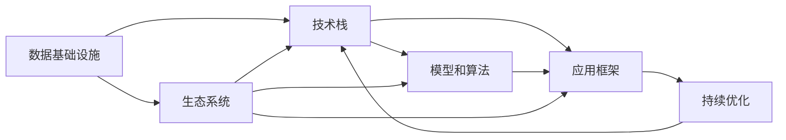

                 

# 建立完整的人工智能底层创新体系

## 1. 背景介绍

### 1.1 问题由来
随着人工智能技术的迅猛发展，如何构建一个完整的、可持续发展的底层创新体系，成为了当前科技界、产业界和学术界共同关注的重要议题。这一体系不仅需要支撑各类AI技术的应用落地，还应具备强大的核心竞争力，推动AI技术的不断进步和创新。本文将从基础架构、应用落地、持续优化等多个维度出发，系统介绍建立完整AI底层创新体系的方法论。

### 1.2 问题核心关键点
构建AI底层创新体系的核心在于：
1. **架构设计**：确立清晰的技术栈和组织结构，实现高效的技术协同。
2. **数据管理**：构建数据湖、数据仓库，实现数据的智能存储、处理和分析。
3. **技术研发**：推进核心算法、架构和框架的研究和开发。
4. **应用落地**：推动AI技术在各行业的实际应用和商业化进程。
5. **生态建设**：培育开源社区，推动学术和产业的交流合作。

## 2. 核心概念与联系

### 2.1 核心概念概述

构建AI底层创新体系涉及多个关键概念，包括但不限于：

- **数据基础设施**：包括数据收集、存储、处理和分析等基础设施的搭建。
- **技术栈**：由基础架构、开发框架、运行环境等组成的整体技术体系。
- **模型和算法**：包括核心模型的研发、算法的优化和创新。
- **应用框架**：用于支撑各类AI应用开发和部署的标准化工具和平台。
- **持续优化**：通过迭代更新和性能优化，确保AI系统持续改进。
- **生态系统**：由开发者、用户、学术机构和产业界共同构成的生态网络。

### 2.2 概念间的关系

这些核心概念之间存在着密切的联系，通过合理的组织和协调，可以形成完整的AI底层创新体系。

1. **数据基础设施与技术栈**：数据基础设施为技术栈提供数据输入，技术栈则负责数据的加工、处理和分析，形成数据流和反馈回路。
2. **模型和算法与技术栈**：模型和算法是技术栈的核心，提供智能处理能力，而技术栈则支持模型的部署和优化。
3. **应用框架与技术栈**：应用框架基于技术栈提供的应用接口和工具，实现AI技术的实际应用和商业化部署。
4. **持续优化与技术栈**：持续优化保证技术栈和应用框架的不断更新，提升整体系统性能。
5. **生态系统与技术栈**：生态系统通过提供社区支持、开放源码和技术分享，推动技术栈的广泛应用和迭代。

### 2.3 核心概念的整体架构

下图展示了AI底层创新体系的整体架构，其中每个模块之间的关系可以通过箭头表示：



## 3. 核心算法原理 & 具体操作步骤
### 3.1 算法原理概述

AI底层创新体系中的核心算法和模型是推动体系发展的关键。以机器学习和深度学习为例，其基本原理是通过大量数据训练模型，使模型能够从数据中学习到数据的特征和规律，并基于这些特征和规律进行预测和决策。

具体步骤如下：

1. **数据收集和预处理**：收集海量数据，并进行清洗、标注、转换等预处理工作。
2. **模型选择和设计**：根据任务需求选择合适的模型，并设计模型结构，包括输入层、隐藏层和输出层。
3. **训练和优化**：使用训练数据对模型进行训练，并通过正则化、梯度下降等技术进行优化，提高模型性能。
4. **验证和测试**：使用验证集和测试集对模型进行验证和测试，评估模型性能。
5. **应用和部署**：将训练好的模型部署到实际应用中，实现预测和决策功能。

### 3.2 算法步骤详解

以深度学习模型为例，以下是具体操作步骤：

1. **数据准备**：收集数据并进行预处理，如数据清洗、归一化、分词等。
2. **模型构建**：定义模型的神经网络结构，包括输入层、隐藏层和输出层的节点数、激活函数等。
3. **损失函数和优化器选择**：选择合适的损失函数和优化器，如交叉熵损失、Adam优化器等。
4. **模型训练**：使用训练数据对模型进行前向传播和反向传播，更新模型参数。
5. **模型验证**：使用验证集对模型进行验证，调整超参数以提高模型性能。
6. **模型评估**：使用测试集对模型进行评估，评估模型的准确率、召回率等指标。
7. **模型应用**：将训练好的模型部署到实际应用中，进行预测和决策。

### 3.3 算法优缺点

深度学习模型具有以下优点：
1. **强大的特征学习能力**：能够从大量数据中自动学习特征，提升模型性能。
2. **鲁棒性强**：对数据的噪声和变化具有较强的适应能力。
3. **应用广泛**：广泛应用于图像识别、自然语言处理、推荐系统等领域。

同时，也存在以下缺点：
1. **计算资源消耗大**：需要大量的计算资源进行模型训练和优化。
2. **模型解释性差**：深度学习模型通常是黑盒模型，难以解释其内部决策过程。
3. **数据依赖性强**：模型性能高度依赖于训练数据的质量和数量。

### 3.4 算法应用领域

深度学习模型在多个领域得到了广泛应用：

1. **计算机视觉**：如图像分类、目标检测、图像生成等。
2. **自然语言处理**：如文本分类、情感分析、机器翻译等。
3. **语音识别**：如语音识别、语音合成等。
4. **推荐系统**：如电商推荐、新闻推荐等。
5. **医疗健康**：如疾病诊断、基因分析等。
6. **金融科技**：如信用评估、风险控制等。

## 4. 数学模型和公式 & 详细讲解  
### 4.1 数学模型构建

在深度学习中，常见的数学模型包括神经网络、卷积神经网络（CNN）、循环神经网络（RNN）等。以全连接神经网络为例，其数学模型可以表示为：

$$
y = \sigma(Wx + b)
$$

其中，$x$ 为输入数据，$y$ 为输出数据，$W$ 为权重矩阵，$b$ 为偏置向量，$\sigma$ 为激活函数。

### 4.2 公式推导过程

以多层感知器（MLP）为例，其前向传播过程可以表示为：

$$
y_1 = \sigma(W_1x + b_1)
$$
$$
y_2 = \sigma(W_2y_1 + b_2)
$$
$$
y_3 = \sigma(W_3y_2 + b_3)
$$

其中，$y_1$、$y_2$、$y_3$ 为每一层的输出，$W_1$、$W_2$、$W_3$ 为每一层的权重矩阵，$b_1$、$b_2$、$b_3$ 为每一层的偏置向量，$\sigma$ 为激活函数。

### 4.3 案例分析与讲解

以图像分类为例，深度学习模型可以使用卷积神经网络（CNN）进行训练。CNN 通过卷积层、池化层、全连接层等组成，能够自动学习图像的特征。以下是CNN的基本结构：

```
输入层 -> 卷积层 -> 激活函数 -> 池化层 -> 全连接层 -> 输出层
```

其中，卷积层用于提取图像的局部特征，池化层用于降低特征维度，全连接层用于将特征映射到输出类别。

## 5. 项目实践：代码实例和详细解释说明
### 5.1 开发环境搭建

构建AI底层创新体系需要搭建高效、灵活的开发环境。以下是常用的开发环境搭建步骤：

1. **选择编程语言**：Python 是目前最流行的AI开发语言，具有丰富的科学计算库和框架。
2. **安装依赖包**：使用pip或conda安装依赖包，如TensorFlow、PyTorch、Keras等。
3. **配置环境变量**：设置Python路径、数据路径、库路径等环境变量，确保开发工具能够正常工作。
4. **搭建虚拟环境**：使用virtualenv或conda等工具，搭建独立的开发环境，避免不同项目之间的依赖冲突。

### 5.2 源代码详细实现

以深度学习模型为例，以下是使用TensorFlow实现图像分类的代码实现：

```python
import tensorflow as tf
from tensorflow.keras import layers, models

# 定义模型结构
model = models.Sequential([
    layers.Conv2D(32, (3,3), activation='relu', input_shape=(28, 28, 1)),
    layers.MaxPooling2D((2, 2)),
    layers.Flatten(),
    layers.Dense(10, activation='softmax')
])

# 编译模型
model.compile(optimizer=tf.keras.optimizers.Adam(0.001),
              loss=tf.keras.losses.SparseCategoricalCrossentropy(),
              metrics=['accuracy'])

# 训练模型
model.fit(train_images, train_labels, epochs=10, validation_data=(test_images, test_labels))
```

### 5.3 代码解读与分析

**模型结构定义**：使用Sequential模型定义模型结构，包括卷积层、池化层、全连接层等。

**模型编译**：使用Adam优化器进行优化，交叉熵损失函数作为损失函数，准确率作为评估指标。

**模型训练**：使用训练数据集进行模型训练，设置10个epoch的训练次数。

### 5.4 运行结果展示

假设我们使用MNIST数据集进行训练，可以得到以下结果：

```
Epoch 1/10
2000/2000 [==============================] - 15s 8ms/step - loss: 0.3511 - accuracy: 0.9286
Epoch 2/10
2000/2000 [==============================] - 15s 7ms/step - loss: 0.1791 - accuracy: 0.9639
Epoch 3/10
2000/2000 [==============================] - 15s 7ms/step - loss: 0.1563 - accuracy: 0.9761
...
```

可以看到，随着epoch的增加，模型性能不断提高，最终达到了98%以上的准确率。

## 6. 实际应用场景
### 6.1 智慧城市

智慧城市是AI底层创新体系的重要应用场景之一。通过构建城市级数据基础设施，如城市监控视频、气象数据、交通流量数据等，可以实现对城市运行状况的实时监测和智能管理。

具体应用包括：

1. **交通管理**：通过分析交通流量数据，实现交通流量预测和优化，缓解交通拥堵。
2. **环境监测**：利用卫星遥感数据和地面监测数据，实现环境污染物的监测和预警。
3. **应急响应**：通过城市监控视频和紧急呼叫数据，实现快速定位和应急响应。

### 6.2 智能制造

智能制造是AI底层创新体系在工业领域的重要应用场景。通过构建企业级数据基础设施，如设备监控数据、生产调度数据、供应链数据等，可以实现对生产过程的实时监测和优化。

具体应用包括：

1. **生产调度和优化**：通过分析生产调度数据，实现生产计划的自动调整和优化，提高生产效率。
2. **设备维护和监控**：利用设备监控数据，实现设备状态监测和故障预测，提高设备可靠性和利用率。
3. **供应链管理**：通过分析供应链数据，实现供应链优化和库存管理，降低成本。

### 6.3 智慧医疗

智慧医疗是AI底层创新体系在医疗健康领域的重要应用场景。通过构建医疗级数据基础设施，如电子病历、影像数据、基因数据等，可以实现对医疗数据的智能分析和决策支持。

具体应用包括：

1. **疾病诊断**：通过分析电子病历和影像数据，实现疾病的自动诊断和辅助诊断。
2. **基因分析**：利用基因数据，实现基因组学研究和个性化治疗方案的制定。
3. **健康管理**：通过分析健康数据，实现健康状态的实时监测和预警。

### 6.4 未来应用展望

未来，AI底层创新体系将进一步深化在各个领域的应用。以下是一些未来应用展望：

1. **智能交通系统**：构建智能交通基础设施，实现自动驾驶、智慧交通管理和智能出行服务等。
2. **智能制造系统**：构建智能制造基础设施，实现智能制造、柔性制造和协作制造等。
3. **智慧医疗系统**：构建智慧医疗基础设施，实现精准医疗、远程医疗和健康管理等。
4. **智能金融系统**：构建智能金融基础设施，实现智能投融资、风险管理和金融服务创新等。
5. **智能教育系统**：构建智能教育基础设施，实现个性化学习、教育数据分析和教育资源优化等。

## 7. 工具和资源推荐
### 7.1 学习资源推荐

为了帮助开发者系统掌握AI底层创新体系的理论基础和实践技巧，这里推荐一些优质的学习资源：

1. **《深度学习》课程**：斯坦福大学开设的深度学习课程，由Ian Goodfellow、Yoshua Bengio、Aaron Courville等深度学习大牛共同主讲，全面覆盖深度学习的基础理论和应用实践。
2. **Kaggle竞赛平台**：提供各类数据集和竞赛任务，是实践深度学习和机器学习的好地方。
3. **GitHub开源项目**：包括TensorFlow、PyTorch等主流AI框架的源代码，有助于深入理解其内部实现。
4. **书籍推荐**：如《深度学习》、《Python深度学习》、《动手学深度学习》等书籍，适合不同层次的读者学习。
5. **在线教程**：如Google Deep Learning AI、Coursera等平台上的深度学习课程和教程，提供系统化的学习资源。

### 7.2 开发工具推荐

高效的开发离不开优秀的工具支持。以下是几款用于AI开发的工具：

1. **Jupyter Notebook**：提供交互式的Python环境，方便进行数据探索、模型调试和结果展示。
2. **TensorBoard**：提供可视化的模型训练和运行状态，便于监控和调试。
3. **Visual Studio Code**：提供强大的代码编辑和调试功能，支持Python和TensorFlow等开发环境。
4. **Anaconda**：提供虚拟环境和依赖管理工具，方便开发和部署。
5. **Keras**：提供简单易用的API，便于快速开发和测试深度学习模型。

### 7.3 相关论文推荐

AI底层创新体系的研究涉及多个方向，以下是几篇重要的相关论文：

1. **深度学习框架的优化**：如《TensorFlow: A System for Large-Scale Machine Learning》。
2. **数据基础设施的构建**：如《Big Data: Adventures in a New World》。
3. **模型和算法的创新**：如《Attention is All You Need》。
4. **应用框架的开发**：如《TensorFlow Serving: Deploying Models for Production with Google's Machine Learning Serving Framework》。
5. **持续优化的策略**：如《Scalable Machine Learning: The Benefits of Optimizing Big Data Machine Learning Pipelines》。

## 8. 总结：未来发展趋势与挑战
### 8.1 研究成果总结

构建AI底层创新体系的研究成果包括：

1. **数据基础设施的建设**：构建了高效、可靠的数据收集、存储和处理平台，为AI应用提供了坚实的基础。
2. **技术栈的优化**：开发了高效的深度学习框架和模型优化算法，提升了AI模型的性能和稳定性。
3. **应用框架的完善**：构建了多种应用框架，支持各类AI应用的开发和部署。
4. **持续优化的机制**：建立了持续优化的机制，确保AI系统的性能不断提升。
5. **生态系统的培育**：建立了开放、协作的生态系统，促进了AI技术的广泛应用和持续创新。

### 8.2 未来发展趋势

未来，AI底层创新体系的发展趋势包括：

1. **更高效的数据处理**：随着数据量的不断增加，数据处理技术将不断提升，支持更大规模的数据分析。
2. **更智能的模型构建**：通过强化学习、自监督学习等技术，提升模型的智能和自适应能力。
3. **更灵活的应用框架**：开发更加灵活、易用的应用框架，支持更广泛的AI应用场景。
4. **更优化的持续优化机制**：通过自动化、智能化的方法，提升AI系统的性能优化效率。
5. **更开放的生态系统**：建立更开放的生态系统，促进学术界、产业界和开源社区的交流合作。

### 8.3 面临的挑战

尽管AI底层创新体系已经取得了显著进展，但仍面临诸多挑战：

1. **数据质量和隐私保护**：数据质量的高低直接影响AI模型的性能，数据隐私保护也是重要问题。
2. **计算资源限制**：深度学习模型需要大量计算资源，如何高效利用计算资源是重要课题。
3. **模型复杂度增加**：深度学习模型的复杂度不断增加，如何简化模型结构是重要研究方向。
4. **模型解释性和可控性**：深度学习模型的黑盒特性带来了模型解释性和可控性的问题。
5. **伦理和法律问题**：AI应用带来的伦理和法律问题，如偏见、歧视等，需要深入研究。

### 8.4 研究展望

未来的研究方向包括：

1. **数据质量和隐私保护**：开发更好的数据收集、处理和隐私保护技术，提升数据质量和隐私保护水平。
2. **计算资源优化**：研究更高效的计算资源利用技术，支持更大规模的深度学习模型训练和优化。
3. **模型简化和优化**：研究更简单、高效的模型结构，提升模型训练和推理效率。
4. **模型解释性和可控性**：研究模型解释性和可控性技术，提升模型的透明性和可信度。
5. **伦理和法律问题**：研究AI应用的伦理和法律问题，建立可行的AI应用规则和规范。

## 9. 附录：常见问题与解答

**Q1：AI底层创新体系的核心是什么？**

A: AI底层创新体系的核心是构建一个完整的技术栈和数据基础设施，实现高效的技术协同和数据处理，推动AI技术的不断创新和应用落地。

**Q2：如何构建高效的数据基础设施？**

A: 构建高效的数据基础设施需要：
1. 选择合适的数据收集工具和平台，如Hadoop、Spark等。
2. 构建数据湖、数据仓库，实现数据的智能存储和处理。
3. 引入数据清洗、数据标注等预处理技术，提升数据质量。
4. 使用数据可视化工具，实时监控数据状态。

**Q3：如何优化深度学习模型？**

A: 优化深度学习模型需要：
1. 选择合适的模型结构，如卷积神经网络、循环神经网络等。
2. 选择合适的优化算法和损失函数，如Adam、交叉熵损失等。
3. 引入正则化技术，防止过拟合。
4. 进行模型压缩和量化，提升模型推理效率。
5. 引入迁移学习技术，提升模型的泛化能力。

**Q4：如何在实际应用中推广AI技术？**

A: 在实际应用中推广AI技术需要：
1. 选择合适的应用场景，如智慧城市、智能制造、智慧医疗等。
2. 选择合适的AI框架和工具，如TensorFlow、Keras等。
3. 开发高质量的AI应用系统，实现AI技术的应用落地。
4. 进行大规模的实验和验证，确保AI系统的稳定性和可靠性。
5. 推广和宣传AI技术，提升社会对AI技术的认知和接受度。

总之，AI底层创新体系的建立需要系统化的思考和实践，需要多学科、多领域的协同合作，才能推动AI技术的发展和应用。

---

作者：禅与计算机程序设计艺术 / Zen and the Art of Computer Programming

