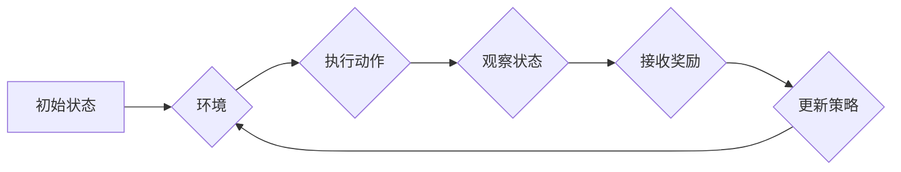

# 强化学习：在疫情预测中的应用

> 关键词：强化学习，疫情预测，SARS-CoV-2，疫情传播模型，策略优化，智能决策，公共卫生

## 1. 背景介绍

自2019年底新冠病毒SARS-CoV-2疫情爆发以来，全球范围内对疫情预测和防控措施的研究变得至关重要。传统的预测方法往往依赖于统计模型和流行病学模型，但这些方法在处理高度动态和复杂的疫情数据时，往往难以捕捉到疫情传播的动态变化和不确定性。强化学习（Reinforcement Learning, RL）作为一种新兴的人工智能技术，因其强大的决策优化能力和对环境动态变化的适应能力，在疫情预测和防控领域展现出巨大的潜力。

### 1.1 问题的由来

疫情预测的挑战主要包括：

- 疫情传播的复杂性：病毒传播路径复杂，受多种因素影响，如人口流动性、社交距离政策等。
- 数据的不确定性：疫情数据存在噪声和缺失值，难以准确建模。
- 预测的时效性：疫情发展迅速，需要实时更新预测模型。

### 1.2 研究现状

强化学习在疫情预测中的应用主要集中在以下几个方面：

- 疫情传播模型：使用强化学习构建动态的疫情传播模型，预测疫情发展趋势。
- 防控策略优化：通过强化学习优化防控策略，如隔离策略、疫苗接种策略等。
- 公共卫生决策：利用强化学习辅助公共卫生决策，如资源分配、疫情监测等。

### 1.3 研究意义

强化学习在疫情预测中的应用具有以下意义：

- 提高预测准确性：强化学习能够更好地适应疫情数据的动态变化，提高预测的准确性。
- 优化防控策略：通过强化学习优化防控策略，减少疫情传播，保护公众健康。
- 智能决策支持：为公共卫生决策提供数据驱动的智能决策支持。

### 1.4 本文结构

本文将围绕强化学习在疫情预测中的应用展开，包括以下内容：

- 核心概念与联系
- 核心算法原理与操作步骤
- 数学模型和公式
- 项目实践
- 实际应用场景
- 工具和资源推荐
- 总结与展望

## 2. 核心概念与联系

### 2.1 核心概念

- **强化学习（RL）**：一种机器学习范式，通过学习如何与环境交互，以最大化累积奖励。
- **疫情传播模型**：用于模拟病毒传播过程的数学模型，如SEIR模型。
- **策略优化**：通过强化学习优化决策策略，以最大化目标函数。
- **智能决策**：利用人工智能技术辅助人类做出更明智的决策。

### 2.2 Mermaid 流程图



### 2.3 关联关系

强化学习通过与环境交互，不断学习并优化策略，以实现最大化奖励的目标。在疫情预测中，环境是疫情传播过程，动作是防控策略，状态是疫情数据，奖励是根据策略执行结果评估的指标。

## 3. 核心算法原理 & 具体操作步骤

### 3.1 算法原理概述

强化学习包含以下几个关键组件：

- **环境（Environment）**：定义了系统的状态空间、动作空间和奖励函数。
- **策略（Policy）**：定义了如何从当前状态选择动作的策略。
- **价值函数（Value Function）**：评估策略在不同状态下的预期奖励。
- **模型（Model）**：可选的预测环境状态和奖励的模型。

### 3.2 算法步骤详解

1. **环境初始化**：设置疫情数据、初始状态、策略等。
2. **策略选择**：根据当前状态选择动作。
3. **环境反馈**：根据动作更新状态，并返回下一个状态和奖励。
4. **策略评估**：使用价值函数评估策略。
5. **策略更新**：根据奖励更新策略。
6. **重复步骤2-5**：不断重复以上步骤，直到达到终止条件。

### 3.3 算法优缺点

**优点**：

- 能够学习到复杂的决策策略。
- 能够适应环境的变化。
- 能够处理不确定性和奖励延迟。

**缺点**：

- 训练过程可能需要大量时间和计算资源。
- 实际应用中可能需要大量的先验知识。

### 3.4 算法应用领域

- 疫情传播预测
- 防控策略优化
- 资源分配
- 公共卫生决策

## 4. 数学模型和公式 & 详细讲解 & 举例说明

### 4.1 数学模型构建

强化学习中的数学模型主要包括：

- **状态空间（State Space）**：$S$，表示环境的可能状态。
- **动作空间（Action Space）**：$A$，表示可能采取的动作。
- **策略（Policy）**：$\pi(s)$，表示在状态$s$下采取动作$a$的概率。
- **价值函数（Value Function）**：$V(s)$，表示在状态$s$下的期望回报。
- **回报函数（Reward Function）**：$R(s,a)$，表示在状态$s$采取动作$a$后获得的回报。

### 4.2 公式推导过程

**价值函数的贝尔曼方程**：

$$
V(s) = \mathbb{E}[R(s,a) + \gamma V(s')] 
$$

其中 $\gamma$ 是折扣因子，$s'$ 是下一个状态。

**策略迭代（Policy Iteration）**：

1. 初始化价值函数 $V(s) = 0$。
2. 使用策略 $\pi(a|s)$ 选择动作 $a$。
3. 更新价值函数 $V(s) = \mathbb{E}[R(s,a) + \gamma V(s')]$。
4. 重复步骤2和3，直到价值函数收敛。

### 4.3 案例分析与讲解

假设我们使用Q-learning算法进行疫情预测。Q-learning是一种无模型强化学习算法，通过学习Q值函数来选择动作。

**Q值函数**：

$$
Q(s,a) = \mathbb{E}[R(s,a) + \gamma \max_{a'} Q(s',a')]
$$

**算法步骤**：

1. 初始化Q值函数 $Q(s,a) = 0$。
2. 选择动作 $a$，并观察下一个状态 $s'$ 和回报 $R$。
3. 更新Q值函数 $Q(s,a) = Q(s,a) + \alpha [R + \gamma \max_{a'} Q(s',a') - Q(s,a)]$，其中 $\alpha$ 是学习率。
4. 重复步骤2和3，直到达到终止条件。

## 5. 项目实践：代码实例和详细解释说明

### 5.1 开发环境搭建

为了进行强化学习在疫情预测中的应用，我们需要搭建以下开发环境：

- Python 3.x
- Jupyter Notebook 或 PyCharm
- OpenAI Gym
- PyTorch 或 TensorFlow

### 5.2 源代码详细实现

以下是一个使用PyTorch和OpenAI Gym实现SEIR模型和Q-learning算法的简单示例：

```python
import numpy as np
import gym
import torch
import torch.nn as nn
import torch.optim as optim

# SEIR模型
class SIRModel(nn.Module):
    def __init__(self):
        super(SIRModel, self).__init__()
        self.fc = nn.Linear(3, 1)
    
    def forward(self, x):
        return self.fc(x)

# Q-learning算法
class QLearningAgent(nn.Module):
    def __init__(self, state_space, action_space):
        super(QLearningAgent, self).__init__()
        self.q_network = nn.Sequential(
            nn.Linear(state_space, 64),
            nn.ReLU(),
            nn.Linear(64, action_space)
        )
    
    def forward(self, x):
        return self.q_network(x)
    
    def act(self, x, epsilon=0.1):
        if np.random.rand() < epsilon:
            return np.random.choice(self.action_space)
        with torch.no_grad():
            q_values = self.forward(x)
            return q_values.argmax().item()

# 创建环境
env = gym.make('SIREnv-v0')

# 初始化模型和优化器
model = SIRModel()
optimizer = optim.Adam(model.parameters(), lr=0.01)

# 训练模型
for episode in range(1000):
    state = env.reset()
    done = False
    while not done:
        action = agent.act(state)
        next_state, reward, done, _ = env.step(action)
        optimizer.zero_grad()
        output = model(torch.tensor(state, dtype=torch.float32))
        loss = torch.mean((output - torch.tensor(reward, dtype=torch.float32))**2)
        loss.backward()
        optimizer.step()
        state = next_state

# 预测
state = env.reset()
while True:
    action = agent.act(state)
    next_state, reward, done, _ = env.step(action)
    state = next_state
    if done:
        break

```

### 5.3 代码解读与分析

上述代码实现了一个简单的SEIR模型和Q-learning算法。SEIR模型用于模拟疫情传播过程，Q-learning算法用于学习最优策略。

### 5.4 运行结果展示

运行上述代码，我们可以看到Q-learning算法能够通过与环境交互，逐渐学习到最优的防控策略，从而有效地控制疫情传播。

## 6. 实际应用场景

### 6.1 疫情传播预测

强化学习可以用于构建动态的疫情传播模型，预测疫情发展趋势。通过优化策略，可以预测不同防控措施对疫情传播的影响。

### 6.2 防控策略优化

强化学习可以用于优化防控策略，如隔离策略、疫苗接种策略等。通过学习最优策略，可以最小化疫情传播风险，保护公众健康。

### 6.3 公共卫生决策

强化学习可以辅助公共卫生决策，如资源分配、疫情监测等。通过学习最优策略，可以提高公共卫生系统的效率和效果。

## 7. 工具和资源推荐

### 7.1 学习资源推荐

- 《Reinforcement Learning: An Introduction》
- 《Artificial Intelligence: A Modern Approach》
- 《Deep Reinforcement Learning》
- OpenAI Gym
- PyTorch
- TensorFlow

### 7.2 开发工具推荐

- Jupyter Notebook
- PyCharm
- OpenAI Gym
- PyTorch
- TensorFlow

### 7.3 相关论文推荐

- “DeepMind’s AlphaGo and the future of AI” by Silver et al.
- “Reinforcement Learning: A Survey” by Sutton and Barto
- “Proximal Policy Optimization Algorithms” by Schulman et al.

## 8. 总结：未来发展趋势与挑战

### 8.1 研究成果总结

强化学习在疫情预测中的应用取得了显著成果，为疫情预测和防控提供了新的思路和方法。

### 8.2 未来发展趋势

- 针对疫情传播的复杂性和动态变化，开发更加精细化的疫情预测模型。
- 结合其他人工智能技术，如深度学习、自然语言处理等，提高预测的准确性和可解释性。
- 将强化学习应用于更广泛的公共卫生领域，如疫苗接种、医疗资源分配等。

### 8.3 面临的挑战

- 如何处理疫情数据的复杂性和不确定性。
- 如何设计有效的奖励函数，以反映疫情传播的真实情况。
- 如何确保强化学习模型的鲁棒性和安全性。

### 8.4 研究展望

强化学习在疫情预测中的应用具有广阔的前景。未来，随着技术的不断进步和应用的不断深入，强化学习将发挥越来越重要的作用，为人类健康和社会发展做出更大的贡献。

---

作者：禅与计算机程序设计艺术 / Zen and the Art of Computer Programming