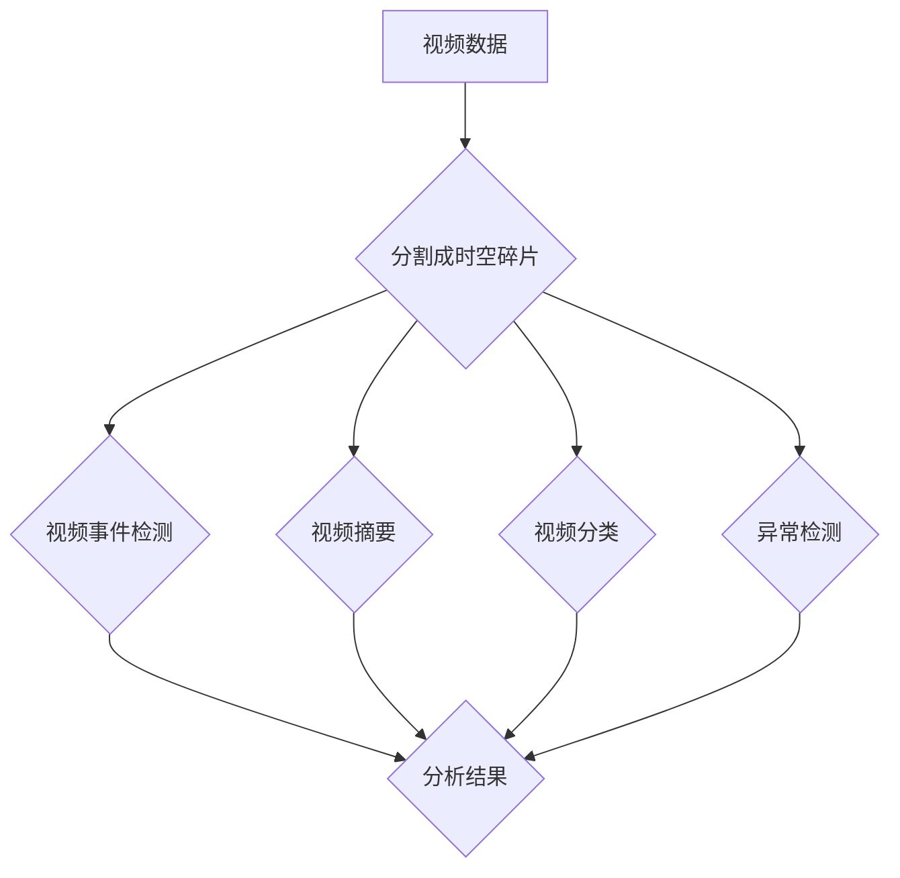

# 时空碎片在视频数据中的应用

> 关键词：时空碎片，视频数据，视频分析，人工智能，计算机视觉，时空数据管理，机器学习

## 1. 背景介绍

随着视频监控、社交媒体、无人机等技术的普及，视频数据量正以惊人的速度增长。视频数据包含了丰富的时空信息，对于安全监控、交通管理、公共安全、智能城市等领域具有重要价值。然而，如何高效地管理和分析如此庞大的视频数据集，成为了一个亟待解决的问题。时空碎片（Spatio-Temporal Fragments）作为一种新兴的数据组织和管理方法，在视频数据分析中展现出巨大的潜力。本文将探讨时空碎片在视频数据中的应用，分析其原理、算法、实践和未来发展趋势。

### 1.1 问题的由来

传统的视频数据分析方法主要依赖于视频帧级别的处理，这种方法在处理高分辨率、高帧率的视频数据时，面临着计算量大、效率低等问题。此外，传统的视频数据分析方法难以捕捉视频中复杂的时空关系，导致分析结果的准确性和可靠性受到影响。

### 1.2 研究现状

近年来，随着人工智能和计算机视觉技术的快速发展，时空碎片在视频数据分析中的应用逐渐兴起。研究者们提出了多种基于时空碎片的视频分析方法，包括视频事件检测、视频摘要、视频分类、异常检测等。

### 1.3 研究意义

时空碎片在视频数据中的应用，有助于提高视频分析的效率和准确性，降低计算成本，同时能够更好地捕捉视频中的时空关系，为视频数据的深度挖掘和应用提供新的思路。

### 1.4 本文结构

本文将分为以下章节：

- 第二章介绍时空碎片的核心概念与联系，并给出其架构的 Mermaid 流程图。
- 第三章阐述时空碎片分析的核心算法原理和具体操作步骤。
- 第四章介绍时空碎片的数学模型和公式，并进行案例分析。
- 第五章展示时空碎片在视频数据分析中的项目实践。
- 第六章探讨时空碎片在不同应用场景中的实际应用。
- 第七章展望时空碎片的未来发展趋势和面临的挑战。
- 第八章总结研究成果，并对未来研究方向进行展望。

## 2. 核心概念与联系

### 2.1 核心概念

- **时空碎片**：将视频数据分割成小的、具有特定时空特征的片段，以便于高效管理和分析。
- **视频事件检测**：识别视频中的关键事件，如运动目标检测、异常行为检测等。
- **视频摘要**：从视频中提取关键信息，生成简短的摘要，便于快速浏览和分析。
- **视频分类**：根据视频内容对视频进行分类，如视频风格分类、场景分类等。
- **异常检测**：检测视频中的异常行为或事件，如入侵检测、火灾检测等。

### 2.2 Mermaid 流程图



### 2.3 联系

时空碎片作为视频数据的一种组织形式，可以应用于视频事件检测、视频摘要、视频分类、异常检测等多个领域。这些领域相互关联，共同构成了视频数据分析的生态体系。

## 3. 核心算法原理 & 具体操作步骤

### 3.1 算法原理概述

时空碎片分析的核心算法主要包括以下步骤：

1. **时空分割**：将视频数据分割成小的时空片段。
2. **特征提取**：从时空片段中提取时空特征。
3. **事件检测**：使用机器学习算法对时空特征进行分类，识别视频事件。
4. **结果整合**：将检测到的视频事件整合成完整的视频分析结果。

### 3.2 算法步骤详解

**3.2.1 时空分割**

时空分割是时空碎片分析的基础。常用的时空分割方法包括：

- **基于帧的分割**：根据视频帧的时空信息进行分割。
- **基于事件分割**：根据视频事件的发生进行分割。
- **基于语义分割**：根据视频内容语义进行分割。

**3.2.2 特征提取**

特征提取是时空碎片分析的关键步骤。常用的时空特征包括：

- **运动特征**：如速度、加速度、轨迹等。
- **外观特征**：如颜色、形状、纹理等。
- **上下文特征**：如场景信息、时间信息等。

**3.2.3 事件检测**

事件检测是时空碎片分析的核心步骤。常用的机器学习算法包括：

- **分类器**：如支持向量机（SVM）、随机森林（Random Forest）等。
- **深度学习**：如卷积神经网络（CNN）、循环神经网络（RNN）等。

**3.2.4 结果整合**

将检测到的视频事件整合成完整的视频分析结果，以便于用户理解和应用。

### 3.3 算法优缺点

**优点**：

- 提高分析效率：通过时空分割，可以将视频数据分解为小的片段，降低计算量。
- 提高分析准确性：通过特征提取和事件检测，可以更准确地识别视频事件。
- 提高可解释性：通过结果整合，可以直观地展示分析结果。

**缺点**：

- 特征提取和事件检测的复杂度高。
- 需要大量标注数据。

### 3.4 算法应用领域

时空碎片分析在以下领域具有广泛的应用：

- **安全监控**：通过视频事件检测，可以实时监控公共场所的安全状况。
- **交通管理**：通过视频分类和异常检测，可以优化交通流量，减少交通事故。
- **智能城市**：通过视频分析，可以提升城市管理效率，提高居民生活质量。

## 4. 数学模型和公式 & 详细讲解 & 举例说明

### 4.1 数学模型构建

时空碎片分析的数学模型主要包括以下内容：

- **时空分割**：根据视频帧的时空信息，构建时空分割模型。
- **特征提取**：根据时空特征，构建特征提取模型。
- **事件检测**：根据时空特征和事件标签，构建事件检测模型。

### 4.2 公式推导过程

以运动特征提取为例，公式推导过程如下：

$$
\text{运动特征} = \frac{\text{目标速度} - \text{背景速度}}{\sqrt{\text{目标加速度}^2 + \text{背景加速度}^2}}
$$

### 4.3 案例分析与讲解

以智能交通领域的车辆检测为例，讲解时空碎片分析的应用：

1. **时空分割**：将视频数据分割成车辆运动轨迹片段。
2. **特征提取**：从运动轨迹片段中提取速度、加速度等运动特征。
3. **事件检测**：使用深度学习模型对运动特征进行分类，识别车辆。
4. **结果整合**：将检测到的车辆信息整合成完整的交通分析结果。

## 5. 项目实践：代码实例和详细解释说明

### 5.1 开发环境搭建

以Python为例，搭建开发环境：

```bash
# 安装必要的库
pip install opencv-python numpy tensorflow

# 下载预训练的车辆检测模型
# ...
```

### 5.2 源代码详细实现

```python
import cv2
import numpy as np
import tensorflow as tf

# 加载预训练的车辆检测模型
model = tf.keras.models.load_model('vehicle_detection_model.h5')

# 读取视频文件
video_path = 'traffic_video.mp4'
cap = cv2.VideoCapture(video_path)

while True:
    ret, frame = cap.read()
    if not ret:
        break

    # 预处理图像
    processed_frame = preprocess_image(frame)

    # 使用模型进行车辆检测
    predictions = model.predict(processed_frame)

    # 后处理检测结果
    boxes, scores, classes = postprocess_predictions(predictions)

    # 在图像上绘制检测结果
    for box, score, class_id in zip(boxes, scores, classes):
        cv2.rectangle(frame, (box[0], box[1]), (box[2], box[3]), (0, 255, 0), 2)
        cv2.putText(frame, class_id, (box[0], box[1] - 10), cv2.FONT_HERSHEY_SIMPLEX, 0.9, (36,255,12), 2)

    # 显示检测结果
    cv2.imshow('Detected Vehicles', frame)
    if cv2.waitKey(1) & 0xFF == ord('q'):
        break

cap.release()
cv2.destroyAllWindows()
```

### 5.3 代码解读与分析

以上代码演示了使用TensorFlow和OpenCV库进行车辆检测的基本流程。首先，加载预训练的车辆检测模型；然后，读取视频文件并逐帧处理；接着，使用模型进行车辆检测，并绘制检测结果；最后，显示检测结果并等待用户按键退出。

### 5.4 运行结果展示

运行代码后，将显示带有车辆检测结果的视频帧。

## 6. 实际应用场景

时空碎片在以下实际应用场景中具有广泛的应用：

- **智能交通**：车辆检测、交通流量分析、事故检测等。
- **公共安全**：入侵检测、异常行为检测、人群管理等。
- **智能监控**：目标跟踪、行为识别、安全预警等。
- **智能城市**：环境监测、基础设施管理、城市规划等。

### 6.4 未来应用展望

随着人工智能和计算机视觉技术的不断发展，时空碎片在视频数据分析中的应用将更加广泛。以下是一些未来应用展望：

- **多模态融合**：将视频数据与其他传感器数据（如雷达、红外等）进行融合，提升视频分析的准确性和鲁棒性。
- **知识图谱**：将视频数据与知识图谱相结合，实现视频内容的语义理解和知识推理。
- **增强现实**：将视频分析与增强现实技术相结合，实现更加直观的视频交互体验。

## 7. 工具和资源推荐

### 7.1 学习资源推荐

- 《计算机视觉：算法与应用》
- 《深度学习：卷积神经网络》
- 《Python计算机视觉编程》

### 7.2 开发工具推荐

- OpenCV：用于图像和视频处理的库。
- TensorFlow：用于深度学习的框架。
- PyTorch：用于深度学习的框架。

### 7.3 相关论文推荐

-《Spatiotemporal Action Detection with Dynamic Memory Networks》
-《Video Object Segmentation with Dynamic Graphs》
-《Spatio-Temporal Pyramid Networks for Action Recognition》

## 8. 总结：未来发展趋势与挑战

### 8.1 研究成果总结

本文介绍了时空碎片在视频数据中的应用，分析了其原理、算法、实践和未来发展趋势。时空碎片作为一种新兴的数据组织和管理方法，在视频数据分析中具有广泛的应用前景。

### 8.2 未来发展趋势

随着人工智能和计算机视觉技术的不断发展，时空碎片在视频数据分析中的应用将更加广泛，包括多模态融合、知识图谱、增强现实等领域。

### 8.3 面临的挑战

时空碎片在视频数据分析中仍然面临着一些挑战，如计算复杂度高、需要大量标注数据等。

### 8.4 研究展望

未来，需要进一步研究如何降低计算复杂度、减少标注数据需求，以及如何更好地融合多模态数据，以推动时空碎片在视频数据分析中的应用。

## 9. 附录：常见问题与解答

**Q1：时空碎片与视频帧有什么区别？**

A：时空碎片是视频帧的一种组织形式，它将连续的帧分割成小的、具有特定时空特征的片段，以便于高效管理和分析。

**Q2：时空碎片分析需要哪些技术？**

A：时空碎片分析需要视频处理、计算机视觉、机器学习等技术。

**Q3：时空碎片分析有哪些应用场景？**

A：时空碎片分析在智能交通、公共安全、智能监控、智能城市等领域具有广泛的应用场景。

**Q4：如何降低时空碎片分析的计算复杂度？**

A：可以通过以下方法降低时空碎片分析的计算复杂度：
- 使用更轻量级的模型。
- 使用更有效的算法。
- 采用分布式计算。

**Q5：时空碎片分析需要哪些资源？**

A：时空碎片分析需要以下资源：
- 计算资源：如CPU、GPU等。
- 存储资源：用于存储视频数据和模型。
- 数据资源：用于训练和测试模型。

作者：禅与计算机程序设计艺术 / Zen and the Art of Computer Programming