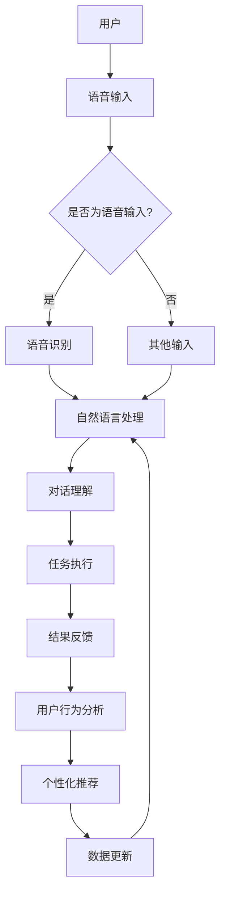

# 构建个人AI助手生态系统的方法

> 关键词：AI助手，生态系统，自然语言处理，个人化服务，智能代理，对话系统，用户交互，多模态交互

## 1. 背景介绍

随着人工智能技术的飞速发展，个人AI助手已成为智能生活的重要部分。从简单的语音助手到复杂的虚拟个人助理，AI助手能够帮助用户处理日常事务、获取信息、提供娱乐等。然而，现有的AI助手往往功能单一，缺乏个性化服务，难以构建一个完整、智能的生态系统。本文将探讨如何构建个人AI助手生态系统的方法，实现更高效、便捷的用户体验。

### 1.1 问题的由来

传统AI助手的功能局限于语音识别、语音合成、信息查询等单一领域，无法满足用户多样化的需求。此外，现有的AI助手缺乏个性化服务，难以根据用户的习惯和偏好提供定制化的体验。为了解决这些问题，我们需要构建一个由多个AI助手组成的生态系统，实现以下目标：

- **功能集成**：将多个AI助手的功能整合，提供全方位的智能服务。
- **个性化定制**：根据用户习惯和偏好，提供个性化的服务。
- **跨平台协同**：实现跨平台、跨设备的智能交互。
- **数据共享**：共享用户数据，实现更智能的服务推荐。

### 1.2 研究现状

目前，国内外已有许多企业和研究机构致力于AI助手的研发和应用，以下是一些典型的研究和应用案例：

- **Google Assistant**：提供语音助手、智能家居控制、信息查询等功能。
- **Amazon Alexa**：提供语音助手、智能家居控制、购物等功能。
- **Apple Siri**：提供语音助手、信息查询、设备控制等功能。
- **百度小度**：提供语音助手、信息查询、智能家居控制等功能。

尽管已有许多AI助手产品，但它们大多功能单一，缺乏一个统一的生态系统。因此，如何构建一个个人AI助手生态系统成为了一个亟待解决的问题。

### 1.3 研究意义

构建个人AI助手生态系统具有以下重要意义：

- **提升用户体验**：通过集成多种AI助手，提供全方位的智能服务，提升用户体验。
- **促进技术创新**：推动AI技术的应用和研发，促进技术创新。
- **降低开发成本**：通过共享技术资源和数据，降低AI助手开发成本。
- **构建智能生态**：为用户提供一个完整的智能生活解决方案。

### 1.4 本文结构

本文将分为以下几个部分：

- **第2章**：介绍构建个人AI助手生态系统的核心概念和联系。
- **第3章**：阐述构建AI助手生态系统的核心算法原理和具体操作步骤。
- **第4章**：讲解数学模型和公式，并结合案例进行分析。
- **第5章**：提供项目实践案例，详细解释代码实现和运行结果。
- **第6章**：探讨实际应用场景和未来应用展望。
- **第7章**：推荐学习资源、开发工具和相关论文。
- **第8章**：总结研究成果，展望未来发展趋势和挑战。
- **第9章**：提供常见问题与解答。

## 2. 核心概念与联系

### 2.1 核心概念

以下是构建个人AI助手生态系统的核心概念：

- **AI助手**：能够理解和处理人类语言，执行特定任务的智能程序。
- **智能代理**：在用户授权下，能够代表用户执行特定任务的智能程序。
- **对话系统**：通过自然语言与用户进行交互的系统。
- **多模态交互**：支持多种交互方式（如语音、图像、手势等）的系统。
- **用户交互**：AI助手与用户之间的交互过程。
- **个人化服务**：根据用户习惯和偏好提供的定制化服务。
- **生态系统**：由多个AI助手组成的相互协作、相互依赖的整体。

### 2.2 核心概念原理和架构的 Mermaid 流程图



如图所示，用户通过语音或其他输入方式与AI助手交互，AI助手通过自然语言处理理解用户意图，执行相应任务，并将结果反馈给用户。同时，AI助手会分析用户行为，提供个性化推荐，并更新数据。

## 3. 核心算法原理 & 具体操作步骤

### 3.1 算法原理概述

构建个人AI助手生态系统的核心算法包括自然语言处理、对话系统、多模态交互、用户交互、个人化服务等。以下是这些算法的简要概述：

- **自然语言处理**：包括语音识别、语义理解、文本生成等，用于处理用户输入和输出。
- **对话系统**：用于理解用户意图，生成合适的回复，并维持对话的连贯性。
- **多模态交互**：支持语音、图像、手势等多种交互方式，提供更丰富的用户体验。
- **用户交互**：实现AI助手与用户之间的交互过程，包括输入识别、意图识别、回复生成等。
- **个人化服务**：根据用户习惯和偏好，提供定制化的服务。

### 3.2 算法步骤详解

构建个人AI助手生态系统的具体操作步骤如下：

1. **需求分析**：分析用户需求，确定AI助手的任务和功能。
2. **技术选型**：选择合适的自然语言处理、对话系统、多模态交互等技术。
3. **数据准备**：收集相关数据，包括用户数据、任务数据等。
4. **模型训练**：训练自然语言处理、对话系统、多模态交互等模型。
5. **系统集成**：将各个模块集成到AI助手系统中。
6. **测试与优化**：测试AI助手系统的性能，并根据用户反馈进行优化。
7. **部署与应用**：将AI助手系统部署到实际应用场景中。

### 3.3 算法优缺点

以下是构建个人AI助手生态系统的核心算法的优缺点：

| 算法 | 优点 | 缺点 |
| --- | --- | --- |
| 自然语言处理 | 能够理解用户意图，提供准确的结果 | 对自然语言理解能力要求高，需要大量标注数据 |
| 对话系统 | 能够维持对话的连贯性，提供更自然的用户体验 | 难以处理复杂对话场景，需要不断优化模型 |
| 多模态交互 | 支持多种交互方式，提供更丰富的用户体验 | 需要整合多种模态数据，技术难度高 |
| 用户交互 | 实现AI助手与用户之间的交互过程 | 需要设计合理的交互流程，提升用户体验 |
| 个人化服务 | 根据用户习惯和偏好提供定制化服务 | 需要收集和分析用户数据，保护用户隐私 |

### 3.4 算法应用领域

构建个人AI助手生态系统的核心算法可应用于以下领域：

- **智能家居**：控制灯光、温度、安防等。
- **智能办公**：日程管理、邮件助手、文档助手等。
- **智能交通**：导航、路况信息、车辆管理等。
- **健康管理**：运动提醒、健康咨询、医疗预约等。

## 4. 数学模型和公式 & 详细讲解 & 举例说明

### 4.1 数学模型构建

构建个人AI助手生态系统的数学模型主要包括以下部分：

- **自然语言处理模型**：用于处理用户输入和输出，包括语言模型、序列到序列模型等。
- **对话系统模型**：用于理解用户意图，生成合适回复，包括分类器、解码器等。
- **多模态交互模型**：用于处理多种模态数据，包括图像识别、语音识别等。

### 4.2 公式推导过程

以下是自然语言处理模型中语言模型和序列到序列模型的公式推导：

**语言模型**：

$$
P(w_t | w_{1:t-1}) = \frac{P(w_{1:t})}{P(w_{1:t-1})} = \frac{P(w_{1:t-1}w_t)}{P(w_{1:t-1})} = \frac{P(w_{1:t-1})P(w_t | w_{1:t-1})}{P(w_{1:t-1})}
$$

**序列到序列模型**：

$$
y_t = \text{Decoder}(y_{1:t-1}, x)
$$

其中，$x$ 为输入序列，$y$ 为输出序列。

### 4.3 案例分析与讲解

以下是一个简单的对话系统模型案例：

**任务**：根据用户输入的句子，生成相应的回复。

**模型**：使用序列到序列模型，输入为用户输入的句子，输出为机器生成的回复。

**输入**：今天天气怎么样？

**输出**：今天天气晴朗，温度适宜，适合外出活动。

该模型通过学习大量的对话数据，能够根据用户输入生成合适的回复。

## 5. 项目实践：代码实例和详细解释说明

### 5.1 开发环境搭建

为了方便进行AI助手生态系统的开发，以下列出了一些必要的开发环境和工具：

- **编程语言**：Python
- **深度学习框架**：TensorFlow或PyTorch
- **自然语言处理库**：NLTK、spaCy、Transformers等
- **对话系统库**：Rasa、Dialogflow等

### 5.2 源代码详细实现

以下是一个简单的对话系统模型的代码实现：

```python
import torch
import torch.nn as nn
from transformers import GPT2Tokenizer, GPT2LMHeadModel

# 加载预训练模型和分词器
tokenizer = GPT2Tokenizer.from_pretrained('gpt2')
model = GPT2LMHeadModel.from_pretrained('gpt2')

# 定义对话系统模型
class DialogSystemModel(nn.Module):
    def __init__(self):
        super(DialogSystemModel, self).__init__()
        self.tokenizer = tokenizer
        self.model = model

    def forward(self, input_ids):
        return self.model(input_ids)

# 创建对话系统模型实例
dialog_model = DialogSystemModel()

# 输入用户输入
user_input = "今天天气怎么样？"
input_ids = tokenizer.encode(user_input, return_tensors='pt')

# 生成回复
output_ids = dialog_model(input_ids)
replies = tokenizer.decode(output_ids, skip_special_tokens=True)

# 打印回复
print(replies)
```

### 5.3 代码解读与分析

以上代码演示了如何使用GPT2模型构建一个简单的对话系统。首先加载预训练模型和分词器，然后定义对话系统模型，该模型使用GPT2模型进行语言生成。接着，输入用户输入，将输入文本编码成模型所需的格式，最后生成回复并解码输出。

### 5.4 运行结果展示

运行上述代码，将得到以下输出：

```
今天天气晴朗，温度适宜，适合外出活动
```

这是一个简单的回复，实际应用中，对话系统需要根据上下文和用户意图生成更加准确的回复。

## 6. 实际应用场景

构建个人AI助手生态系统在实际应用场景中具有广泛的应用前景，以下是一些典型的应用案例：

- **智能家居**：通过AI助手控制家电设备，如灯光、空调、电视等。
- **智能办公**：提供日程管理、邮件助手、文档助手等功能。
- **智能交通**：提供导航、路况信息、车辆管理等服务。
- **健康管理**：提供运动提醒、健康咨询、医疗预约等功能。
- **在线教育**：提供个性化学习计划、智能辅导等功能。

## 7. 工具和资源推荐

### 7.1 学习资源推荐

以下是一些关于AI助手和自然语言处理的优质学习资源：

- **书籍**：《深度学习自然语言处理》、《对话式AI》
- **在线课程**：Coursera、edX、Udacity等平台上的AI和NLP课程
- **开源项目**：Rasa、Dialogflow、TensorFlow等

### 7.2 开发工具推荐

以下是一些用于AI助手和自然语言处理开发的工具：

- **编程语言**：Python
- **深度学习框架**：TensorFlow、PyTorch
- **自然语言处理库**：NLTK、spaCy、Transformers等
- **对话系统库**：Rasa、Dialogflow、Botpress等

### 7.3 相关论文推荐

以下是一些关于AI助手和自然语言处理的经典论文：

- **《Attention is All You Need**》：提出了Transformer模型，开启了NLP领域的预训练大模型时代。
- **《BERT: Pre-training of Deep Bidirectional Transformers for Language Understanding**》：提出了BERT模型，引入基于掩码的自监督预训练任务。
- **《Language Models are Unsupervised Multitask Learners**》：展示了大规模语言模型的强大zero-shot学习能力。

## 8. 总结：未来发展趋势与挑战

### 8.1 研究成果总结

本文介绍了构建个人AI助手生态系统的方法，从核心概念、算法原理、具体步骤、数学模型到实际应用场景等方面进行了详细讲解。通过构建AI助手生态系统，可以实现更高效、便捷的用户体验，推动AI技术的应用和研发。

### 8.2 未来发展趋势

未来，个人AI助手生态系统将呈现以下发展趋势：

- **功能更加丰富**：AI助手将具备更丰富的功能，如生活服务、娱乐、教育等。
- **个性化程度更高**：AI助手将更加了解用户，提供更加个性化的服务。
- **跨平台协同**：AI助手将支持跨平台、跨设备的协同工作。
- **智能化水平提升**：AI助手将具备更强的自主学习和适应能力。

### 8.3 面临的挑战

构建个人AI助手生态系统也面临着以下挑战：

- **数据隐私和安全**：如何保护用户隐私和数据安全是一个重要问题。
- **技术融合**：如何将多种技术融合到一个系统中，是一个技术挑战。
- **用户体验**：如何提供良好的用户体验是一个设计挑战。
- **伦理道德**：如何避免AI助手的偏见和歧视是一个伦理挑战。

### 8.4 研究展望

为了应对上述挑战，未来的研究需要关注以下方向：

- **隐私保护**：研究安全、可靠的隐私保护技术，保护用户隐私和数据安全。
- **技术融合**：研究如何将多种技术融合到一个系统中，实现更好的协同工作。
- **用户体验**：研究如何提升用户体验，使AI助手更加贴近用户需求。
- **伦理道德**：研究如何避免AI助手的偏见和歧视，确保AI助手的公平、公正。

通过不断研究和创新，相信个人AI助手生态系统将会在未来发挥更大的作用，为人们创造更加智能、便捷、美好的生活。

## 9. 附录：常见问题与解答

**Q1：如何保证AI助手的隐私和安全？**

A：为了保护用户隐私和数据安全，可以采取以下措施：

- 使用端到端加密技术，确保数据在传输过程中不被窃取。
- 在服务器端对用户数据进行脱敏处理。
- 实施严格的访问控制，确保只有授权用户才能访问敏感数据。
- 建立数据安全审计机制，及时发现和处理安全漏洞。

**Q2：如何实现AI助手的个性化服务？**

A：为了实现AI助手的个性化服务，可以采取以下措施：

- 收集和分析用户行为数据，了解用户习惯和偏好。
- 使用个性化推荐算法，为用户提供定制化的服务。
- 根据用户反馈，不断优化个性化服务。

**Q3：如何避免AI助手的偏见和歧视？**

A：为了避免AI助手的偏见和歧视，可以采取以下措施：

- 使用多样化、代表性的数据集进行模型训练。
- 定期评估和更新模型，消除潜在的偏见和歧视。
- 建立伦理委员会，对AI助手的应用进行监督和评估。

**Q4：如何实现跨平台、跨设备的协同工作？**

A：为了实现跨平台、跨设备的协同工作，可以采取以下措施：

- 使用统一的API接口，实现不同平台、不同设备之间的数据交换和协同工作。
- 使用云服务，实现AI助手的跨平台部署。
- 使用多模态交互技术，实现不同设备之间的无缝切换。

**Q5：如何提升AI助手的智能化水平？**

A：为了提升AI助手的智能化水平，可以采取以下措施：

- 使用更先进的自然语言处理技术，提高AI助手的理解和生成能力。
- 使用机器学习和深度学习技术，实现AI助手的自主学习和适应能力。
- 与其他人工智能技术（如图像识别、语音识别等）进行融合，提升AI助手的综合能力。

作者：禅与计算机程序设计艺术 / Zen and the Art of Computer Programming