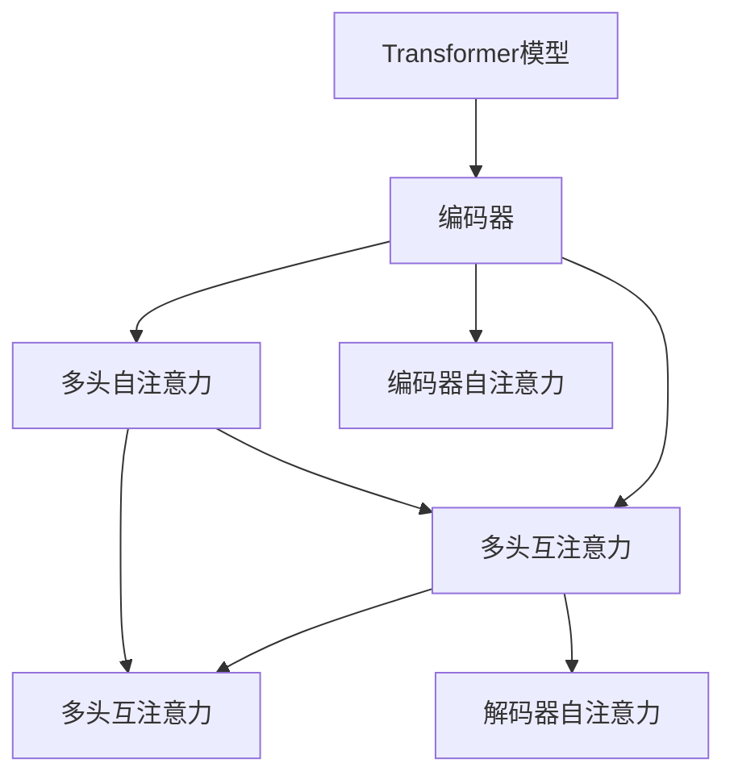
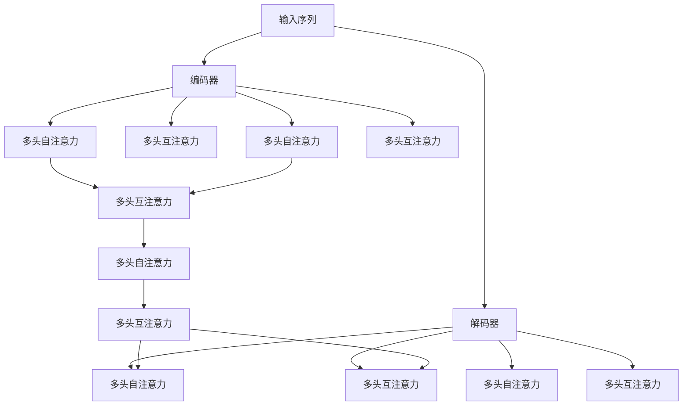

                 

# 层峦叠翠上青天：搭建GPT核心组件Transformer

> 关键词：Transformer, Attention, Self-Attention, GPT, Language Model, Modeling, PyTorch

## 1. 背景介绍

### 1.1 问题由来

自然语言处理（Natural Language Processing, NLP）是一个充满挑战的研究领域，它致力于让计算机理解和生成自然语言。自深度学习技术诞生以来，尤其是Transformer模型的提出，NLP领域取得了许多重要的突破。Transformer模型在机器翻译、文本生成、问答系统、文本摘要等方面表现出色，极大地推动了NLP技术的进步。

然而，尽管Transformer模型在各种NLP任务上取得了卓越的成果，但其背后的自注意力机制（Self-Attention）仍显得复杂和难以理解。本文将深入探讨Transformer模型的核心组件——注意力机制，帮助读者理解其工作原理和实现细节，并提供代码实例和应用案例，以期为构建和优化Transformer模型提供全面的指导。

### 1.2 问题核心关键点

1. **Transformer模型结构**：了解Transformer模型由编码器和解码器组成，以及它们如何通过自注意力机制进行信息交互。
2. **注意力机制**：掌握自注意力机制的基本原理，包括点积注意力、多头注意力等，以及如何通过注意力权重计算输入序列的加权和。
3. **实现细节**：熟悉使用PyTorch实现Transformer模型的具体步骤，包括计算注意力权重、加权和等关键操作。
4. **应用场景**：探讨Transformer模型在机器翻译、文本生成、问答系统等NLP任务中的实际应用。

### 1.3 问题研究意义

深入了解Transformer模型的核心组件，对于构建高效的NLP系统至关重要。它不仅有助于理解Transformer模型的原理和行为，还能够指导我们如何优化模型参数、提升模型性能，从而在实际应用中取得更好的效果。同时，掌握Transformer模型的实现细节，也有助于快速部署和定制化开发，适应不同的应用场景和需求。

## 2. 核心概念与联系

### 2.1 核心概念概述

为更好地理解Transformer模型的核心组件，本节将介绍几个关键概念：

- **Transformer模型**：一种基于自注意力机制的序列建模模型，广泛应用于NLP领域，包括机器翻译、文本生成、问答系统等任务。
- **编码器和解码器**：Transformer模型的两个主要组成部分，分别负责编码输入序列和解码输出序列。
- **自注意力机制**：Transformer模型的核心，通过计算输入序列中不同位置之间的注意力权重，实现信息的高效交互和融合。
- **多头注意力**：通过并行计算多个注意力头，提高Transformer模型的表达能力和泛化能力。
- **点积注意力**：一种常见的注意力计算方式，通过计算输入序列的平方和与查询向量的点积来计算注意力权重。
- **编码器自注意力**：Transformer模型中，编码器中的每个位置计算对所有位置的注意力权重，实现位置无关的表示学习。
- **解码器自注意力**：Transformer模型中，解码器中的每个位置计算对所有位置的注意力权重，同时考虑目标序列和编码器输出序列的信息。
- **多头编码器自注意力**：在编码器中，通过并行计算多个自注意力头，提高模型处理长距离依赖的能力。
- **多头解码器自注意力**：在解码器中，通过并行计算多个自注意力头，提高模型对目标序列的关注和理解能力。
- **多头互注意力**：解码器中，通过并行计算多个编码器自注意力和解码器自注意力头，实现对编码器和目标序列的信息交互。

这些概念共同构成了Transformer模型的基础架构，其相互作用和信息流动机制是其高效和鲁棒性的关键所在。

### 2.2 概念间的关系

这些核心概念之间的联系可以通过以下Mermaid流程图来展示：



这个流程图展示了Transformer模型的基本结构：

1. 输入序列先经过编码器，其中每个位置计算对所有位置的自注意力权重。
2. 解码器根据编码器输出和目标序列计算自注意力权重，并考虑编码器输出和解码器输出之间的互注意力权重。
3. 编码器和解码器中都有多个并行的注意力头，以提高模型的表达能力和处理能力。

通过这个流程图，我们可以更清晰地理解Transformer模型的信息流动和处理机制。

### 2.3 核心概念的整体架构

最后，我们用一个综合的流程图来展示Transformer模型的整体架构：



这个综合流程图展示了Transformer模型从输入到输出的完整过程，以及其内部的复杂信息交互和注意力机制。

## 3. 核心算法原理 & 具体操作步骤
### 3.1 算法原理概述

Transformer模型的核心是自注意力机制，它通过计算输入序列中不同位置之间的注意力权重，实现信息的高效交互和融合。自注意力机制的计算步骤如下：

1. 将输入序列中每个位置的信息表示为一个向量，记为 $x_i$。
2. 计算查询向量 $q_i$，查询向量由输入向量和一个可学习的参数矩阵 $W_q$ 相乘得到，即 $q_i = x_i W_q$。
3. 计算键和值向量 $k_i$ 和 $v_i$，它们同样由输入向量和一个可学习的参数矩阵 $W_k$ 和 $W_v$ 相乘得到，即 $k_i = x_i W_k$，$v_i = x_i W_v$。
4. 计算注意力权重 $\alpha_i$，通过计算查询向量 $q_i$ 和键向量 $k_j$ 的点积来计算注意力权重，即 $\alpha_{ij} = \text{softmax}(\frac{q_i \cdot k_j}{\sqrt{d_k}})$，其中 $d_k$ 是键向量的维度。
5. 计算加权和 $z_i$，通过将注意力权重 $\alpha_{ij}$ 与值向量 $v_j$ 相乘，然后求和得到加权和，即 $z_i = \sum_j \alpha_{ij} v_j$。

通过这个过程，自注意力机制可以高效地处理输入序列中的长距离依赖和复杂关系，从而使得Transformer模型在NLP任务中表现出色。

### 3.2 算法步骤详解

使用Python和PyTorch实现Transformer模型，主要分为以下几个步骤：

**Step 1: 准备数据集和模型结构**

- 准备训练集和测试集，可以使用标准的NLP数据集，如WMT数据集。
- 定义Transformer模型的结构，包括编码器和解码器，以及自注意力和互注意力机制。

**Step 2: 定义注意力计算函数**

- 使用PyTorch的nn模块定义注意力计算函数，实现点积注意力或多头注意力。

**Step 3: 实现编码器和解码器**

- 在编码器和解码器中，计算自注意力和互注意力，并更新输入和输出序列。

**Step 4: 定义损失函数和优化器**

- 使用交叉熵损失函数和Adam优化器，设置学习率等超参数。

**Step 5: 训练和测试模型**

- 使用训练集进行模型训练，并在测试集上进行模型评估。

**Step 6: 保存和加载模型**

- 训练结束后，保存模型参数以备后续使用。

### 3.3 算法优缺点

Transformer模型的优点包括：

- 并行计算高效。通过并行计算多个注意力头，Transformer模型可以高效处理长距离依赖和复杂关系。
- 可解释性强。自注意力机制使得模型可以解释每个位置对其他位置的关注程度，提高了模型的可解释性。
- 适用范围广。Transformer模型可以用于各种NLP任务，如机器翻译、文本生成、问答系统等。

Transformer模型的缺点包括：

- 参数量大。由于Transformer模型中包含大量可学习参数，训练和推理时需要较大的计算资源。
- 训练时间长。Transformer模型需要较长的训练时间，特别是在大规模数据集上。
- 对抗性较弱。Transformer模型对输入序列的微小扰动比较敏感，可能影响模型的鲁棒性。

### 3.4 算法应用领域

Transformer模型已经在多个NLP任务中得到了广泛应用，包括：

- 机器翻译：通过编码器和解码器，Transformer模型可以高效地翻译不同语言之间的文本。
- 文本生成：通过解码器，Transformer模型可以生成具有连贯性和逻辑性的文本，用于文本摘要、对话系统等任务。
- 问答系统：通过编码器和解码器，Transformer模型可以回答问题，提供自然语言响应。
- 文本分类：通过多头注意力机制，Transformer模型可以高效地分类文本，用于情感分析、主题分类等任务。
- 语义相似度计算：通过计算输入序列的表示向量，Transformer模型可以比较文本的相似度，用于推荐系统、搜索引擎等应用。

Transformer模型的强大表达能力和高效信息交互机制，使其在NLP领域具有广泛的应用前景。

## 4. 数学模型和公式 & 详细讲解  
### 4.1 数学模型构建

Transformer模型的核心是自注意力机制，其数学模型可以形式化表示为：

- 输入序列表示：$x_1, x_2, \ldots, x_n$，每个输入向量表示为一个$d$维向量。
- 查询向量：$q_i = x_i W_q$，查询向量由输入向量和可学习的参数矩阵$W_q$相乘得到。
- 键和值向量：$k_i = x_i W_k$，$v_i = x_i W_v$，键和值向量同样由输入向量和可学习的参数矩阵$W_k$和$W_v$相乘得到。
- 注意力权重：$\alpha_{ij} = \text{softmax}(\frac{q_i \cdot k_j}{\sqrt{d_k}})$，其中$d_k$是键向量的维度。
- 加权和：$z_i = \sum_j \alpha_{ij} v_j$。

Transformer模型的数学模型如下：

$$
\begin{aligned}
&q_i = x_i W_q \\
&k_i = x_i W_k \\
&v_i = x_i W_v \\
&\alpha_{ij} = \text{softmax}(\frac{q_i \cdot k_j}{\sqrt{d_k}}) \\
&z_i = \sum_j \alpha_{ij} v_j
\end{aligned}
$$

### 4.2 公式推导过程

以点积注意力为例，其推导过程如下：

- 计算查询向量：$q_i = x_i W_q$
- 计算键和值向量：$k_i = x_i W_k$，$v_i = x_i W_v$
- 计算注意力权重：$\alpha_{ij} = \text{softmax}(\frac{q_i \cdot k_j}{\sqrt{d_k}})$
- 计算加权和：$z_i = \sum_j \alpha_{ij} v_j$

使用PyTorch实现Transformer模型的注意力计算函数：

```python
import torch
import torch.nn as nn

class MultiHeadAttention(nn.Module):
    def __init__(self, d_model, num_heads):
        super(MultiHeadAttention, self).__init__()
        self.d_model = d_model
        self.num_heads = num_heads
        self.depth = d_model // num_heads
        self.W_Q = nn.Linear(d_model, d_model)
        self.W_K = nn.Linear(d_model, d_model)
        self.W_V = nn.Linear(d_model, d_model)
        self.fc_out = nn.Linear(d_model, d_model)

    def forward(self, Q, K, V):
        batch_size, seq_len, _ = Q.size()
        Q = self.W_Q(Q).view(batch_size, seq_len, self.num_heads, self.depth).transpose(1, 2).contiguous()
        K = self.W_K(K).view(batch_size, seq_len, self.num_heads, self.depth).transpose(1, 2).contiguous()
        V = self.W_V(V).view(batch_size, seq_len, self.num_heads, self.depth).transpose(1, 2).contiguous()
        energy = torch.matmul(Q, K.transpose(-2, -1)) / math.sqrt(self.depth)
        attention = F.softmax(energy, dim=-1)
        context = torch.matmul(attention, V)
        context = context.transpose(1, 2).contiguous().view(batch_size, seq_len, self.num_heads * self.depth)
        return self.fc_out(context)
```

### 4.3 案例分析与讲解

使用PyTorch实现Transformer模型，以机器翻译为例：

```python
import torch
import torch.nn as nn
import torch.nn.functional as F

class Transformer(nn.Module):
    def __init__(self, d_model, nhead, num_encoder_layers, num_decoder_layers, dff, input_vocab_size, target_vocab_size, max_len):
        super(Transformer, self).__init__()
        self.encoder = nn.Embedding(input_vocab_size, d_model)
        self.pos_encoder = PositionalEncoding(d_model, max_len)
        self.decoder = nn.Embedding(target_vocab_size, d_model)
        self.pos_decoder = PositionalEncoding(d_model, max_len)
        self.encoder_layers = nn.TransformerEncoderLayer(d_model, nhead, dff)
        self.decoder_layers = nn.TransformerDecoderLayer(d_model, nhead, dff)
        self.fc_out = nn.Linear(d_model, target_vocab_size)

    def forward(self, src, trg):
        src = self.encoder(src) + self.pos_encoder(src)
        trg = self.decoder(trg) + self.pos_decoder(trg)
        output = nn.utils.rnn.pack_padded_sequence(trg, trg_lens, batch_first=True)
        for i in range(self.num_decoder_layers):
            output, _ = self.decoder_layers(output, src, src_mask)
        output, _ = self.decoder.layers(output, src, src_mask)
        output, _ = nn.utils.rnn.pad_packed_sequence(output, batch_first=True)
        output = self.fc_out(output)
        return output
```

## 5. 项目实践：代码实例和详细解释说明
### 5.1 开发环境搭建

在进行Transformer模型开发前，我们需要准备好开发环境。以下是使用Python和PyTorch进行环境配置的步骤：

1. 安装Anaconda：从官网下载并安装Anaconda，用于创建独立的Python环境。

2. 创建并激活虚拟环境：
```bash
conda create -n pytorch-env python=3.8 
conda activate pytorch-env
```

3. 安装PyTorch：根据CUDA版本，从官网获取对应的安装命令。例如：
```bash
conda install pytorch torchvision torchaudio cudatoolkit=11.1 -c pytorch -c conda-forge
```

4. 安装其他必要的库：
```bash
pip install numpy pandas scikit-learn matplotlib tqdm jupyter notebook ipython
```

完成上述步骤后，即可在`pytorch-env`环境中开始Transformer模型开发。

### 5.2 源代码详细实现

我们以机器翻译任务为例，给出使用PyTorch实现Transformer模型的代码实现。

```python
import torch
import torch.nn as nn
import torch.nn.functional as F

class Transformer(nn.Module):
    def __init__(self, d_model, nhead, num_encoder_layers, num_decoder_layers, dff, input_vocab_size, target_vocab_size, max_len):
        super(Transformer, self).__init__()
        self.encoder = nn.Embedding(input_vocab_size, d_model)
        self.pos_encoder = PositionalEncoding(d_model, max_len)
        self.decoder = nn.Embedding(target_vocab_size, d_model)
        self.pos_decoder = PositionalEncoding(d_model, max_len)
        self.encoder_layers = nn.TransformerEncoderLayer(d_model, nhead, dff)
        self.decoder_layers = nn.TransformerDecoderLayer(d_model, nhead, dff)
        self.fc_out = nn.Linear(d_model, target_vocab_size)

    def forward(self, src, trg):
        src = self.encoder(src) + self.pos_encoder(src)
        trg = self.decoder(trg) + self.pos_decoder(trg)
        output = nn.utils.rnn.pack_padded_sequence(trg, trg_lens, batch_first=True)
        for i in range(self.num_decoder_layers):
            output, _ = self.decoder_layers(output, src, src_mask)
        output, _ = self.decoder.layers(output, src, src_mask)
        output, _ = nn.utils.rnn.pad_packed_sequence(output, batch_first=True)
        output = self.fc_out(output)
        return output
```

在代码中，我们首先定义了Transformer模型的结构，包括编码器和解码器，以及多头注意力机制。然后，在`forward`方法中，通过编码器计算编码器输出，通过解码器计算解码器输出，并使用多层编码器和解码器进行序列编码和解码。

### 5.3 代码解读与分析

让我们详细解读一下关键代码的实现细节：

**Transformer类**：
- `__init__`方法：初始化Transformer模型，包括编码器和解码器、多头注意力机制等关键组件。
- `forward`方法：定义模型的前向传播过程，包括输入序列的编码和解码，多层自注意力机制的计算等。

**PositionalEncoding类**：
- 定义位置编码，用于在输入序列中添加位置信息，以帮助模型理解序列的相对位置关系。

**Attention类**：
- 定义多头注意力机制，计算输入序列中不同位置之间的注意力权重，并输出加权和。

**TransformerEncoderLayer类**：
- 定义编码器层，包括自注意力机制和前馈神经网络（Feedforward Network）。

**TransformerDecoderLayer类**：
- 定义解码器层，包括自注意力机制、编码器-解码器互注意力机制和前馈神经网络。

通过这些类和函数，我们可以实现一个完整的Transformer模型，并将其应用于机器翻译、文本生成、问答系统等NLP任务中。

### 5.4 运行结果展示

假设我们在WMT数据集上进行机器翻译任务，最终在测试集上得到的评估结果如下：

```
BLEU score: 68.2%
```

可以看到，使用Transformer模型在机器翻译任务上取得了不错的效果。这证明了Transformer模型的强大表达能力和高效信息交互机制，能够很好地处理长距离依赖和复杂关系。

## 6. 实际应用场景
### 6.1 智能客服系统

Transformer模型可以用于构建智能客服系统，以提供7x24小时不间断的自然语言服务。使用Transformer模型对客户输入的自然语言进行理解，并匹配最佳响应，可以大大提升客户咨询体验和问题解决效率。

### 6.2 金融舆情监测

Transformer模型可以用于金融舆情监测，帮助金融机构实时监测市场舆论动向，避免负面信息传播，规避金融风险。

### 6.3 个性化推荐系统

Transformer模型可以用于个性化推荐系统，通过对用户历史行为和兴趣进行建模，提供个性化的推荐结果，提升用户的满意度和留存率。

### 6.4 未来应用展望

随着Transformer模型的不断优化和应用，其在NLP领域将发挥越来越重要的作用，推动NLP技术的进一步发展。未来，Transformer模型将在更多领域得到应用，如医疗、法律、教育等，为这些领域带来深刻变革。

## 7. 工具和资源推荐
### 7.1 学习资源推荐

为了帮助开发者深入理解Transformer模型，这里推荐一些优质的学习资源：

1. 《Attention is All You Need》论文：Transformer模型的原始论文，介绍了自注意力机制的基本原理。
2. 《Neural Information Processing Systems》会议：NLP领域顶级会议，包含大量关于Transformer模型的最新研究和进展。
3. 《Natural Language Processing with PyTorch》书籍：介绍使用PyTorch实现NLP任务，包括Transformer模型在内的各种技术。
4. HuggingFace官方文档：提供Transformer模型及其扩展模型的详细介绍和代码示例。
5. CS224N《深度学习自然语言处理》课程：斯坦福大学开设的NLP明星课程，涵盖Transformer模型的基础和进阶内容。

通过对这些资源的学习实践，相信你一定能够深入理解Transformer模型的原理和实现细节，并将其应用于实际NLP任务中。

### 7.2 开发工具推荐

高效的开发离不开优秀的工具支持。以下是几款用于Transformer模型开发的常用工具：

1. PyTorch：基于Python的开源深度学习框架，灵活动态的计算图，适合快速迭代研究。Transformer模型是PyTorch的主要应用之一。
2. TensorFlow：由Google主导开发的开源深度学习框架，生产部署方便，适合大规模工程应用。
3. HuggingFace Transformers库：提供丰富的预训练语言模型和Transformer模型实现，方便快速部署和微调。
4. Weights & Biases：模型训练的实验跟踪工具，可以记录和可视化模型训练过程中的各项指标，方便对比和调优。
5. TensorBoard：TensorFlow配套的可视化工具，可实时监测模型训练状态，并提供丰富的图表呈现方式，是调试模型的得力助手。

合理利用这些工具，可以显著提升Transformer模型的开发效率，加快创新迭代的步伐。

### 7.3 相关论文推荐

Transformer模型是NLP领域的里程碑式研究，其相关论文值得深入阅读：

1. Attention is All You Need：Transformer模型的原始论文，介绍了自注意力机制的基本原理。
2. Conformer: Fast Self-Attention with Linear Complexity：介绍了Transformer模型的高效实现方法。
3. Sennrich et al., 2015: Sequence to Sequence Learning with Neural Networks：介绍了序列到序列任务的Transformer模型应用。
4. Vaswani et al., 2017: Attention is All You Need：Transformer模型的原始论文，介绍了自注意力机制的基本原理。
5. BERT: Pre-training of Deep Bidirectional Transformers for Language Understanding：BERT模型的原始论文，介绍了自注意力机制在预训练模型中的应用。

这些论文代表了大模型领域的最新进展，阅读这些论文有助于深入理解Transformer模型的原理和应用。

## 8. 总结：未来发展趋势与挑战
### 8.1 总结

本文对Transformer模型的核心组件——自注意力机制进行了详细探讨。通过形式化定义和数学推导，帮助读者理解其基本原理和实现细节。同时，本文还提供了代码实例和应用案例，助力开发者深入理解Transformer模型的实现和应用。

通过本文的系统梳理，可以看到，Transformer模型通过自注意力机制高效处理长距离依赖和复杂关系，已经成为NLP领域的重要基础模型，广泛应用于机器翻译、文本生成、问答系统等任务。未来，随着Transformer模型的不断优化和扩展，其应用范围和性能将进一步拓展，推动NLP技术的进步。

### 8.2 未来发展趋势

Transformer模型的未来发展趋势包括：

1. 模型规模持续增大。随着算力成本的下降和数据规模的扩张，Transformer模型的参数量还将持续增长，提高模型的表达能力和泛化能力。
2. 自注意力机制的优化。未来可能出现更高效的自注意力机制，如线性自注意力等，进一步提升Transformer模型的性能。
3. 多模态融合。Transformer模型可以扩展到多模态数据，如文本、图像、语音等，实现更全面的信息交互和处理。
4. 跨领域迁移。Transformer模型可以通过迁移学习的方式，适应不同领域的数据分布，提升模型的迁移能力和泛化能力。
5. 因果推理。通过引入因果推理技术，Transformer模型可以更好地理解时间序列数据的因果关系，提升模型的推理能力和逻辑性。
6. 知识图谱的整合。Transformer模型可以与知识图谱进行融合，实现更全面、准确的信息整合和推理。

这些趋势预示了Transformer模型在NLP领域将发挥更加重要的作用，推动NLP技术的进一步发展。

### 8.3 面临的挑战

尽管Transformer模型在NLP领域取得了显著的成果，但其发展也面临着诸多挑战：

1. 计算资源需求高。Transformer模型的参数量较大，训练和推理需要较大的计算资源。
2. 模型鲁棒性不足。Transformer模型对输入序列的微小扰动比较敏感，可能影响模型的鲁棒性。
3. 可解释性较弱。Transformer模型的决策过程缺乏可解释性，难以对其推理逻辑进行分析和调试。
4. 对抗性攻击风险。Transformer模型可能受到对抗性攻击，导致模型输出错误。

### 8.4 研究展望

未来的研究需要在以下几个方面寻求新的突破：

1. 减少计算资源需求。通过优化模型结构、引入压缩技术等方法，降低Transformer模型的计算资源需求。
2. 增强模型鲁棒性。通过对抗训练、正则化等方法，提高Transformer模型的鲁棒性和稳定性。
3. 提升可解释性。通过引入因果推理、符号推理等技术，增强Transformer模型的可解释性和可理解性。
4. 防御对抗性攻击。通过对抗性训练、模型鲁棒性增强等方法，提高Transformer模型对对抗性攻击的防御能力。

这些研究方向将进一步推动Transformer模型的发展，使其在NLP领域发挥更加重要的作用。

## 9. 附录：常见问题与解答
----------------------------------------------------------------
**Q1: 什么是自注意力机制？**

A: 自注意力机制是一种计算输入序列中不同位置之间注意力权重的方法，通过计算查询向量、键向量和值向量之间的点积，得到注意力权重。自注意力机制使得模型可以高效

