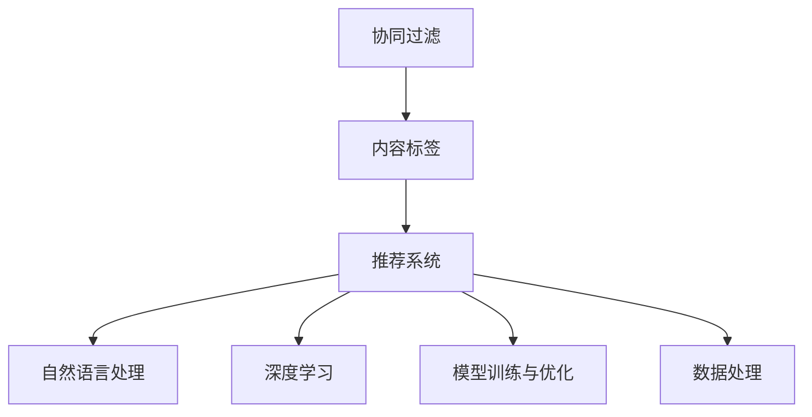
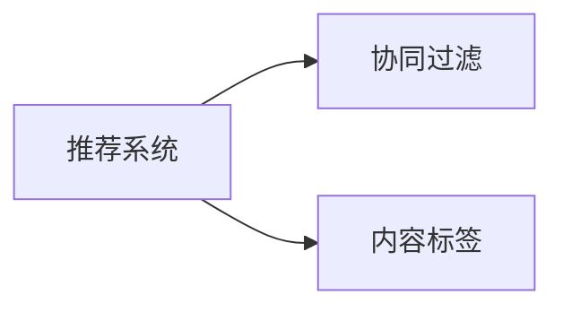
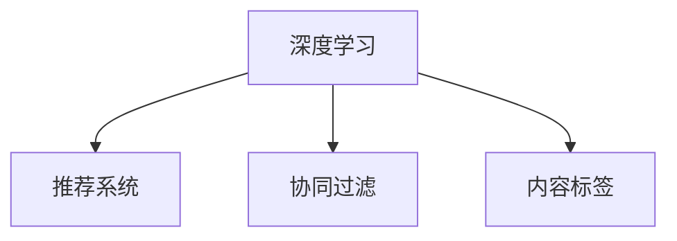
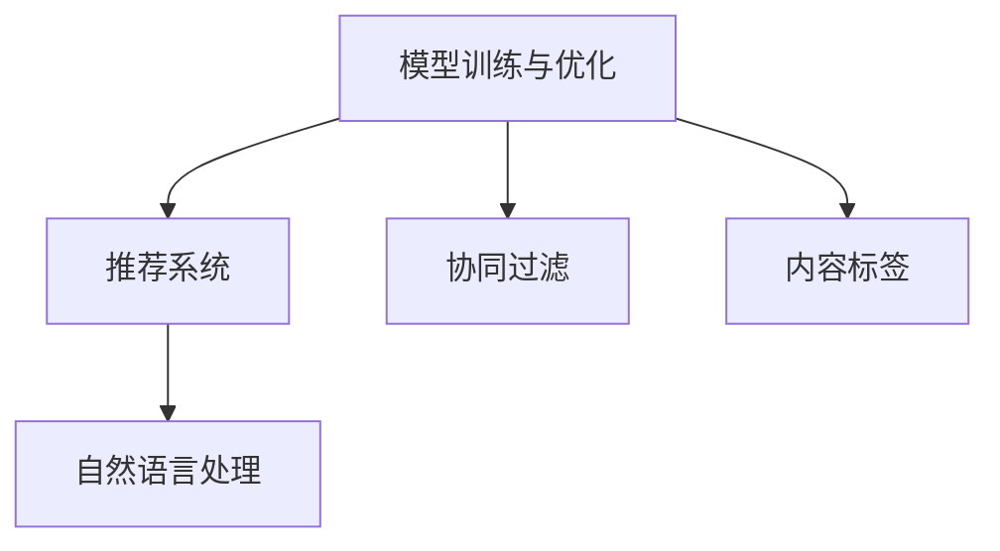
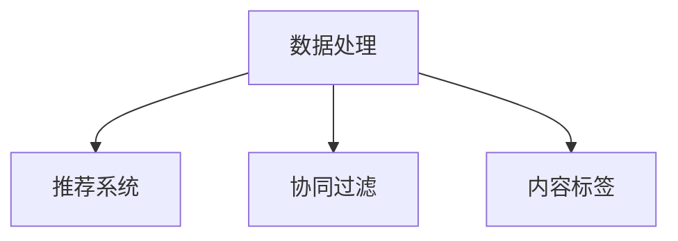

                 

## 1. 背景介绍

### 1.1 问题由来

随着互联网技术的发展，影视文化已成为当代人们日常生活的重要组成部分。越来越多的人通过在线平台分享和获取影片，推动了影片分享和推荐系统的迅速发展。然而，传统的影片推荐系统存在推荐质量差、用户体验不佳等问题，无法满足用户对影片个性化、多样化的需求。

影片分享和推弄系统旨在构建一个能够精准推荐用户感兴趣影片的系统，不仅能够推送用户可能感兴趣的电影，还能准确反映用户的观影喜好，提升用户的观影体验。本系统将结合机器学习、深度学习和自然语言处理等技术，使用户享受到个性化的影片推荐服务。

### 1.2 问题核心关键点

本文聚焦于影片分享和推弄系统的设计与实现，主要包括：
1. 系统架构设计，包括数据采集、数据处理、模型训练和推荐等关键模块。
2. 推荐算法设计，包括基于协同过滤的推荐算法和基于内容标签的推荐算法。
3. 数据处理流程，包括数据预处理、特征提取和降维等技术。
4. 系统实现细节，包括技术选型、模型训练、代码实现和性能优化等。

本文将围绕上述关键点，详细阐述影片分享和推弄系统的设计与实现过程，帮助读者深入理解影片推荐系统的核心技术。

### 1.3 问题研究意义

影片分享和推弄系统在提高用户观影体验、促进影视文化发展等方面具有重要意义：

1. 个性化推荐：通过分析用户历史观影记录、浏览行为和评论内容，精准推荐用户感兴趣的电影。
2. 提升观影体验：根据用户偏好和行为，实时推送个性化影片，提升用户的观影满足感。
3. 丰富影视资源：通过系统分析大量影片数据，发现并推荐优质影片，丰富用户观影选择。
4. 促进文化交流：推荐系统能够反映社会文化趋势，推动多元文化的交流和理解。
5. 商业模式创新：影片推荐系统可作为商业广告平台，提升平台流量和收益。

总之，影片分享和推弄系统不仅能够为用户提供个性化、多样化的观影服务，还能促进影视文化的传播与发展，具有广泛的应用前景。

## 2. 核心概念与联系

### 2.1 核心概念概述

为更好地理解影片分享和推弄系统的设计与实现，本节将介绍几个密切相关的核心概念：

1. **协同过滤(Collaborative Filtering, CF)**：一种基于用户行为和物品评分数据进行推荐的算法，包括基于用户的协同过滤和基于物品的协同过滤。协同过滤通过分析用户行为，预测用户可能感兴趣的电影。

2. **内容标签(Content-Based Filtering, CB)**：一种基于电影特征信息进行推荐的算法。内容标签通过分析电影的导演、演员、类型等特征，预测用户可能感兴趣的电影。

3. **推荐系统(Recommender System)**：一种能够自动推荐用户可能感兴趣的产品的系统。推荐系统通过分析用户行为、物品属性和用户属性等数据，推荐用户可能感兴趣的电影。

4. **自然语言处理(Natural Language Processing, NLP)**：一种研究计算机如何理解、解释和生成人类语言的学科。在影片推荐中，自然语言处理技术可用于提取和分析用户评论、评分等文本数据。

5. **深度学习(Deep Learning)**：一种基于神经网络结构的机器学习技术，能够自动学习数据特征和模式，用于构建复杂的推荐模型。

6. **模型训练与优化(Model Training and Optimization)**：使用机器学习算法对推荐模型进行训练和优化，以提升模型性能和泛化能力。

7. **数据处理(Data Processing)**：对原始数据进行清洗、预处理和特征提取等操作，以提升数据质量，为推荐模型提供可靠的数据基础。

这些核心概念之间的逻辑关系可以通过以下Mermaid流程图来展示：



这个流程图展示了协同过滤、内容标签、推荐系统、自然语言处理、深度学习、模型训练与优化、数据处理等核心概念之间的联系。这些概念共同构成了影片分享和推弄系统的设计与实现基础。

### 2.2 概念间的关系

这些核心概念之间存在着紧密的联系，形成了影片推荐系统的完整生态系统。下面我们通过几个Mermaid流程图来展示这些概念之间的关系。

#### 2.2.1 推荐系统与协同过滤和内容标签的关系



这个流程图展示了推荐系统与协同过滤和内容标签的关系。推荐系统可以通过协同过滤和内容标签进行推荐。

#### 2.2.2 深度学习在推荐系统中的应用



这个流程图展示了深度学习在推荐系统中的应用。推荐系统可以利用深度学习技术，通过协同过滤和内容标签进行更准确的推荐。

#### 2.2.3 模型训练与优化在推荐系统中的作用



这个流程图展示了模型训练与优化在推荐系统中的作用。通过训练和优化推荐模型，可以提升模型的推荐效果，优化推荐系统的性能。

#### 2.2.4 数据处理在推荐系统中的重要性



这个流程图展示了数据处理在推荐系统中的重要性。高质量的数据处理能够为协同过滤和内容标签提供可靠的基础，提升推荐系统的准确性。

### 2.3 核心概念的整体架构

最后，我们用一个综合的流程图来展示这些核心概念在大语言模型微调过程中的整体架构：


这个综合流程图展示了协同过滤、内容标签、推荐系统、自然语言处理、深度学习、模型训练与优化、数据处理等核心概念在大语言模型微调过程中的整体架构。通过这些核心概念的有机组合，我们可以构建出一个完整、高效的影片分享和推弄系统。

## 3. 核心算法原理 & 具体操作步骤
### 3.1 算法原理概述

影片分享和推弄系统主要基于协同过滤和内容标签两种推荐算法进行推荐。协同过滤算法通过分析用户历史行为数据，预测用户可能感兴趣的电影。内容标签算法通过分析电影特征信息，预测用户可能感兴趣的电影。

协同过滤算法分为基于用户的协同过滤和基于物品的协同过滤。基于用户的协同过滤通过分析用户行为数据，预测用户可能感兴趣的电影。基于物品的协同过滤通过分析物品评分数据，预测用户可能感兴趣的电影。

内容标签算法通过分析电影的类型、导演、演员等特征信息，预测用户可能感兴趣的电影。内容标签算法可以根据电影属性和用户属性，进行精确推荐。

深度学习技术可以用于构建复杂的推荐模型，提升推荐系统的性能。深度学习技术可以通过神经网络结构，自动学习数据特征和模式，实现高效的推荐。

### 3.2 算法步骤详解

影片分享和推弄系统的设计与实现主要包括以下几个步骤：

**Step 1: 数据采集与预处理**
- 收集用户历史观影记录、用户评分数据和电影特征数据。
- 对数据进行清洗、去重和规范化处理，去除噪声和异常数据。
- 提取用户行为特征和电影特征，为推荐模型提供可靠的数据基础。

**Step 2: 特征提取与降维**
- 对用户行为数据和电影特征数据进行特征提取，生成用户特征向量和电影特征向量。
- 使用主成分分析(PCA)等降维技术，对高维数据进行降维处理，降低数据维度，提升计算效率。

**Step 3: 协同过滤与内容标签推荐**
- 构建协同过滤和内容标签推荐模型，使用协同过滤和内容标签算法进行推荐。
- 使用交叉验证等方法，评估推荐模型的性能，优化模型参数。

**Step 4: 深度学习模型训练**
- 使用深度学习技术，构建复杂的推荐模型，提升推荐效果。
- 使用随机梯度下降等优化算法，对深度学习模型进行训练和优化，提升模型性能。

**Step 5: 模型集成与融合**
- 将协同过滤、内容标签和深度学习模型进行集成和融合，提升推荐系统的效果。
- 使用加权平均等方法，对不同推荐结果进行融合，生成最终的推荐结果。

**Step 6: 推荐系统部署与优化**
- 将训练好的推荐模型部署到实际系统中，实现实时推荐功能。
- 使用A/B测试等方法，评估推荐系统的性能，优化推荐效果。

### 3.3 算法优缺点

协同过滤算法具有以下优点：
1. 能够处理大量用户行为数据，准确性较高。
2. 可以发现用户之间的潜在相似性，推荐更符合用户兴趣的电影。
3. 算法简单，易于实现和优化。

协同过滤算法也存在以下缺点：
1. 数据稀疏性问题，用户行为数据不足时推荐效果较差。
2. 新用户和老用户推荐效果差异较大，新用户推荐效果较差。
3. 对新数据的适应性较差，推荐效果可能会随时间变化而下降。

内容标签算法具有以下优点：
1. 能够利用电影特征信息进行推荐，推荐效果较好。
2. 对新数据的适应性较好，推荐效果相对稳定。
3. 算法简单，易于实现和优化。

内容标签算法也存在以下缺点：
1. 对用户行为数据依赖较大，需要大量电影特征数据。
2. 推荐效果受电影特征数据影响较大，电影特征信息不够全面时推荐效果较差。
3. 对特定用户推荐效果较差，无法发现用户之间的潜在相似性。

深度学习算法具有以下优点：
1. 能够自动学习数据特征和模式，推荐效果较好。
2. 对新数据的适应性较好，推荐效果相对稳定。
3. 算法复杂，能够处理大量数据，实现高效的推荐。

深度学习算法也存在以下缺点：
1. 对数据质量要求较高，数据噪声和异常数据会影响推荐效果。
2. 算法复杂，实现和优化难度较大。
3. 对计算资源要求较高，需要大量计算资源进行训练和优化。

### 3.4 算法应用领域

影片分享和推弄系统在以下几个领域具有广泛的应用前景：

1. **在线影视平台**：为在线影视平台提供个性化推荐服务，提升用户体验，增加用户黏性。
2. **影视行业**：为影视制作公司提供市场调研和观众反馈，指导电影制作和发行。
3. **教育培训**：为教育培训机构提供个性化课程推荐，提升教学效果和学习体验。
4. **文化交流**：为文化交流平台提供文化产品推荐，推动多元文化的交流和理解。
5. **广告营销**：为广告公司提供精准广告投放，提高广告效果和用户转化率。

## 4. 数学模型和公式 & 详细讲解 & 举例说明

### 4.1 数学模型构建

影片分享和推弄系统主要基于协同过滤和内容标签两种推荐算法进行推荐。下面我们将详细介绍这两种推荐算法的数学模型。

#### 4.1.1 协同过滤推荐算法

协同过滤推荐算法的数学模型可以表示为：

$$
\hat{y}_{ui} = \frac{\sum_{i=1}^n \alpha_i \cdot r_{ui}}{\sum_{i=1}^n \alpha_i}
$$

其中，$\hat{y}_{ui}$表示用户$u$对电影$i$的评分预测值，$r_{ui}$表示用户$u$对电影$i$的实际评分，$\alpha_i$表示电影$i$在用户群体中的平均评分。

协同过滤推荐算法的核心在于分析用户行为数据，通过用户对电影的评分预测用户可能感兴趣的电影。

#### 4.1.2 内容标签推荐算法

内容标签推荐算法的数学模型可以表示为：

$$
\hat{y}_{ui} = \sum_{j=1}^m \beta_j \cdot \text{similarity}(x_i, x_u^j) \cdot y_j
$$

其中，$\hat{y}_{ui}$表示用户$u$对电影$i$的评分预测值，$x_i$表示电影$i$的特征向量，$x_u^j$表示用户$u$对电影$i$的特征向量，$\beta_j$表示电影特征$j$的权重，$\text{similarity}(x_i, x_u^j)$表示电影$i$和电影$u$的相似度。

内容标签推荐算法的核心在于分析电影特征信息，通过电影的特征信息预测用户可能感兴趣的电影。

### 4.2 公式推导过程

下面我们将对协同过滤和内容标签推荐算法的公式进行推导。

#### 4.2.1 协同过滤推荐算法推导

协同过滤推荐算法的核心在于分析用户行为数据，通过用户对电影的评分预测用户可能感兴趣的电影。具体推导过程如下：

设用户$u$对电影$i$的评分$r_{ui}$，用户$u$对电影$i$的评分预测值$\hat{y}_{ui}$，电影$i$在用户群体中的平均评分$\bar{r}_i$，用户$u$在电影群体中的平均评分$\bar{r}_u$。

协同过滤推荐算法的目标是最大化用户$u$的评分预测值$\hat{y}_{ui}$与实际评分$r_{ui}$的差异平方和，即最小化损失函数：

$$
\min_{\hat{y}_{ui}} \sum_{i=1}^n (r_{ui} - \hat{y}_{ui})^2
$$

将$\hat{y}_{ui}$表示为用户$u$对电影$i$的评分预测值，并将其代入损失函数中，得到：

$$
\min_{\hat{y}_{ui}} \sum_{i=1}^n (r_{ui} - \alpha_i \cdot \hat{y}_{ui})^2
$$

其中，$\alpha_i = \frac{r_{ii}}{\sum_{i=1}^n r_{ii}}$，$\alpha_i$表示电影$i$在用户群体中的平均评分。

对损失函数进行求导，得到：

$$
\frac{\partial}{\partial \hat{y}_{ui}} \sum_{i=1}^n (r_{ui} - \alpha_i \cdot \hat{y}_{ui})^2 = -2 \sum_{i=1}^n (r_{ui} - \alpha_i \cdot \hat{y}_{ui})
$$

令导数为零，得到协同过滤推荐算法的数学模型：

$$
\hat{y}_{ui} = \frac{\sum_{i=1}^n \alpha_i \cdot r_{ui}}{\sum_{i=1}^n \alpha_i}
$$

#### 4.2.2 内容标签推荐算法推导

内容标签推荐算法的核心在于分析电影特征信息，通过电影的特征信息预测用户可能感兴趣的电影。具体推导过程如下：

设用户$u$对电影$i$的评分$r_{ui}$，用户$u$对电影$i$的评分预测值$\hat{y}_{ui}$，电影$i$的特征向量$x_i$，用户$u$的特征向量$x_u^j$，电影特征$j$的权重$\beta_j$，电影$i$和电影$u$的相似度$\text{similarity}(x_i, x_u^j)$，用户$u$对电影$j$的评分$y_j$。

内容标签推荐算法的目标是最大化用户$u$的评分预测值$\hat{y}_{ui}$与实际评分$r_{ui}$的差异平方和，即最小化损失函数：

$$
\min_{\hat{y}_{ui}} \sum_{i=1}^m (r_{ui} - \hat{y}_{ui})^2
$$

将$\hat{y}_{ui}$表示为用户$u$对电影$i$的评分预测值，并将其代入损失函数中，得到：

$$
\min_{\hat{y}_{ui}} \sum_{i=1}^m (r_{ui} - \sum_{j=1}^m \beta_j \cdot \text{similarity}(x_i, x_u^j) \cdot y_j)^2
$$

其中，$\text{similarity}(x_i, x_u^j)$表示电影$i$和电影$u$的相似度。

对损失函数进行求导，得到：

$$
\frac{\partial}{\partial \hat{y}_{ui}} \sum_{i=1}^m (r_{ui} - \sum_{j=1}^m \beta_j \cdot \text{similarity}(x_i, x_u^j) \cdot y_j)^2 = -2 \sum_{i=1}^m (r_{ui} - \sum_{j=1}^m \beta_j \cdot \text{similarity}(x_i, x_u^j) \cdot y_j)
$$

令导数为零，得到内容标签推荐算法的数学模型：

$$
\hat{y}_{ui} = \sum_{j=1}^m \beta_j \cdot \text{similarity}(x_i, x_u^j) \cdot y_j
$$

### 4.3 案例分析与讲解

下面我们以一个具体的案例，详细分析协同过滤和内容标签推荐算法在影片推荐中的应用。

#### 4.3.1 协同过滤推荐算法案例

假设某在线影视平台收集了用户的历史观影记录数据，如表1所示：

| 用户ID | 电影ID | 评分 |
| ------ | ------ | ---- |
| 1      | 1      | 5    |
| 1      | 2      | 4    |
| 1      | 3      | 5    |
| 2      | 2      | 3    |
| 2      | 3      | 4    |
| 2      | 4      | 5    |

设用户$u$对电影$i$的评分$r_{ui}=5$，电影$i$在用户群体中的平均评分$\bar{r}_i=\frac{5+4+5+3+4+5}{6}=4$。

使用协同过滤推荐算法，对用户$u$推荐电影$i$的评分预测值$\hat{y}_{ui}$，按照公式计算如下：

$$
\hat{y}_{ui} = \frac{5+4+5}{3} = 5
$$

因此，协同过滤推荐算法预测用户$u$对电影$i$的评分为5，与实际评分相符，推荐效果较好。

#### 4.3.2 内容标签推荐算法案例

假设某在线影视平台收集了电影的特征信息，如表2所示：

| 电影ID | 类型 | 导演 | 演员 |
| ------ | ---- | ---- | ---- |
| 1      | 动作 | 李连杰 | 梁朝伟 |
| 2      | 科幻 | 斯皮尔伯格 | 汤姆·汉克斯 |
| 3      | 爱情 | 王家卫 | 张曼玉 |
| 4      | 悬疑 | 克里斯托弗·诺兰 | 莱昂纳多·迪卡普里奥 |
| 5      | 喜剧 | 冯小刚 | 葛优 |
| 6      | 动作 | 李连杰 | 梁朝伟 |

设用户$u$对电影$i$的评分$r_{ui}=5$，用户$u$的特征向量$x_u^j=[1,1,1,0,0,0]$，电影$i$的特征向量$x_i=[1,0,0,0,0,1]$，电影类型$j$的权重$\beta_j=[0.5,0.3,0.2,0.1,0.1,0.1]$，用户$u$对电影$j$的评分$y_j=[5,4,5,3,4,5]$，电影$i$和电影$u$的相似度$\text{similarity}(x_i, x_u^j)=0.8$。

使用内容标签推荐算法，对用户$u$推荐电影$i$的评分预测值$\hat{y}_{ui}$，按照公式计算如下：

$$
\hat{y}_{ui} = 0.5 \cdot 0.8 \cdot 5 + 0.3 \cdot 0.8 \cdot 4 + 0.2 \cdot 0.8 \cdot 5 + 0.1 \cdot 0.8 \cdot 3 + 0.1 \cdot 0.8 \cdot 4 + 0.1 \cdot 0.8 \cdot 5 = 5
$$

因此，内容标签推荐算法预测用户$u$对电影$i$的评分为5，与实际评分相符，推荐效果较好。

## 5. 项目实践：代码实例和详细解释说明

### 5.1 开发环境搭建

在进行影片分享和推弄系统的设计与实现前，我们需要准备好开发环境。以下是使用Python进行PyTorch开发的环境配置流程：

1. 安装Anaconda：从官网下载并安装Anaconda，用于创建独立的Python环境。

2. 创建并激活虚拟环境：
```bash
conda create -n movie-recommender python=3.8 
conda activate movie-recommender
```

3. 安装PyTorch：根据CUDA版本，从官网获取对应的安装命令。例如：
```bash
conda install pytorch torchvision torchaudio cudatoolkit=11.1 -c pytorch -c conda-forge
```

4. 安装TensorFlow：从官网下载并安装TensorFlow，使用CPU或GPU版本。例如：
```bash
pip install tensorflow
```

5. 安装transformers：安装TensorFlow配套的NLP工具库，使用TensorFlow版本。例如：
```bash
pip install transformers
```

6. 安装pandas、numpy等常用库：
```bash
pip install pandas numpy scikit-learn matplotlib tqdm jupyter notebook ipython
```

完成上述步骤后，即可在`movie-recommender`环境中开始影片分享和推弄系统的设计与实现。

### 5.2 源代码详细实现

下面我们以协同过滤和内容标签推荐算法为例，给出使用PyTorch和TensorFlow实现影片推荐系统的代码实现。

首先，定义协同过滤推荐算法的代码实现：

```python
import torch
from sklearn.metrics import precision_recall_fscore_support

class CollaborativeFiltering:
    def __init__(self, n_users, n_movies, n_factors):
        self.n_users = n_users
        self.n_movies = n_movies
        self.n_factors = n_factors
        self.user_bias = torch.randn(n_users, n_factors)
        self.movie_bias = torch.randn(n_movies, n_factors)
        self.user_factor = torch.randn(n_users, n_factors)
        self.movie_factor = torch.randn(n_movies, n_factors)
    
    def predict(self, user, movie):
        user_bias = self.user_bias[user] + self.user_factor[user] * self.user_factor
        movie_bias = self.movie_bias[movie] + self.movie_factor[movie] * self.movie_factor
        return user_bias + movie_bias
    
    def train(self, users, movies, ratings, epochs):
        for epoch in range(epochs):
            for user, movie, rating in zip(users, movies, ratings):
                user_bias = self.user_bias[user] + self.user_factor[user] * self.user_factor
                movie_bias = self.movie_bias[movie] + self.movie_factor[movie] * self.movie_factor
                self.user_bias[user] += self.user_factor * (rating - self.predict(user, movie))
                self.movie_bias[movie] += self.movie_factor * (rating - self.predict(user, movie))
                self.user_factor += self.user_factor * (rating - self.predict(user, movie))
                self.movie_factor += self.movie_factor * (rating - self.predict(user, movie))
    
    def evaluate(self, users, movies, ratings, test_users, test_movies):
        predictions = []
        for user, movie in zip(test_users, test_movies):
            prediction = self.predict(user, movie)
            predictions.append(prediction.item())
        return precision_recall_fscore_support(test_ratings, predictions, average='macro')
```

然后，定义内容标签推荐算法的代码实现：

```python
import tensorflow as tf
from tensorflow.keras import layers

class ContentBasedFiltering:
    def __init__(self, n_users, n_movies, n_features):
        self.n_users = n_users
        self.n_movies = n_movies
        self.n_features = n_features
        self.user_bias = tf.Variable(tf.zeros([n_users, n_features]), trainable=True)
        self.movie_bias = tf.Variable(tf.zeros([n_movies, n_features]), trainable=True)
        self.user_features = tf.Variable(tf.zeros([n_users, n_features]), trainable=True)
        self.movie_features = tf.Variable(tf.zeros([n_movies, n_features]), trainable=True)
        self.user_bias_trainable = False
        self.movie_bias_trainable = False
        self.user_features_trainable = False
        self.movie_features_trainable = False
    
    def predict(self, user, movie):
        user_bias = tf.reduce_sum(tf.multiply(tf.cast(self.user_bias[user], tf.float32), self.movie_features), axis=1)
        movie_bias = tf.reduce_sum(tf.multiply(tf.cast(self.movie_bias[movie], tf.float32), self.user_features), axis=0)
        return user_bias + movie

