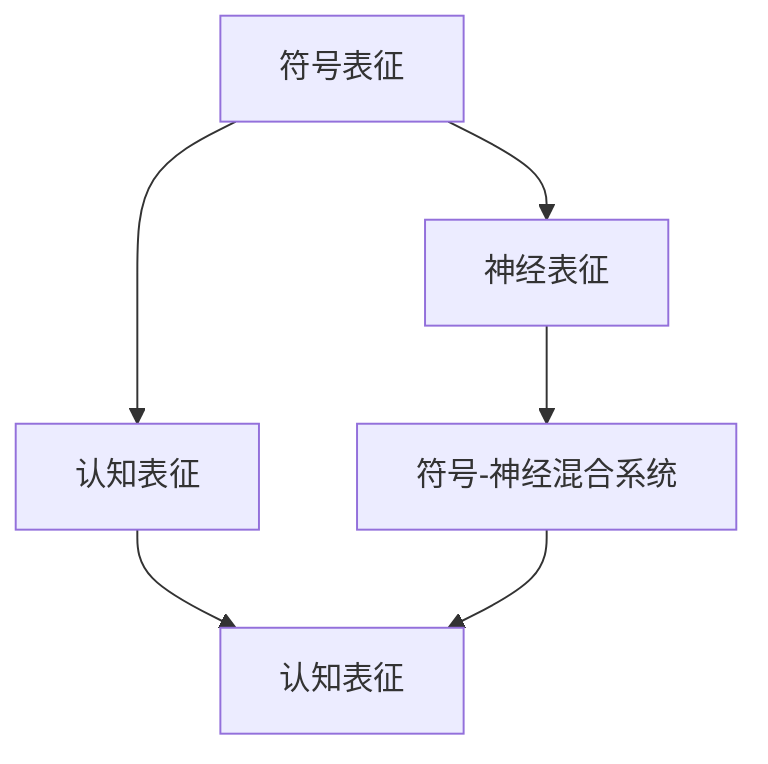
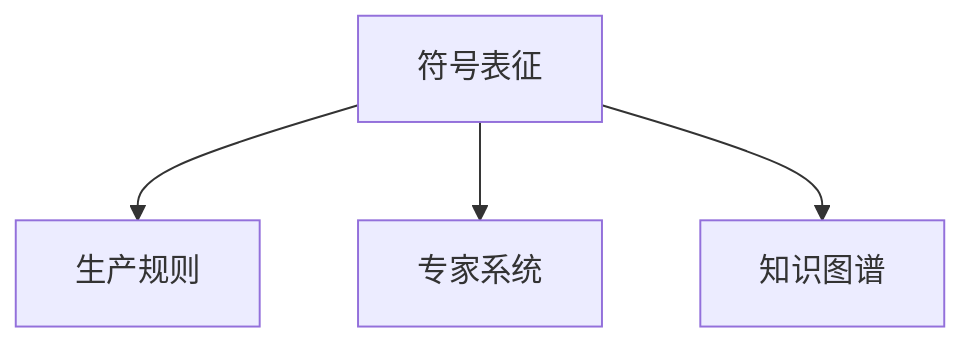
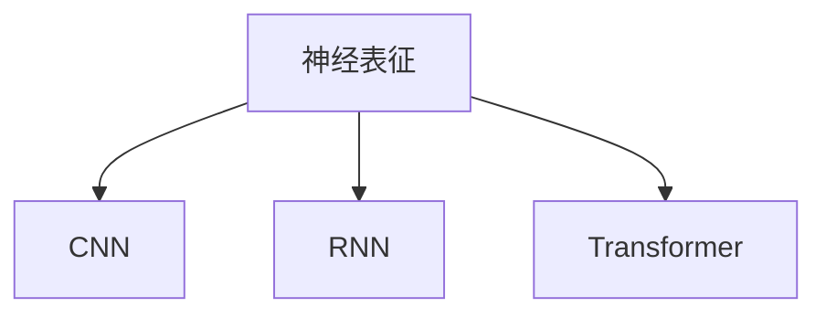
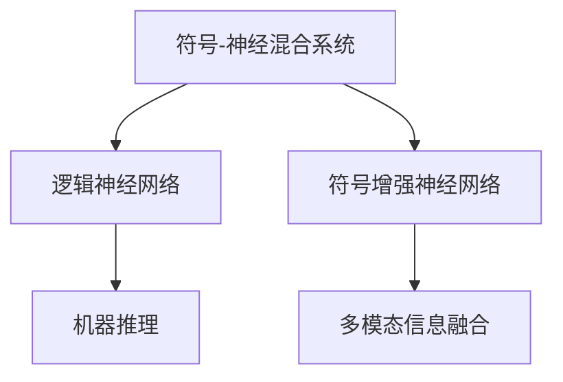
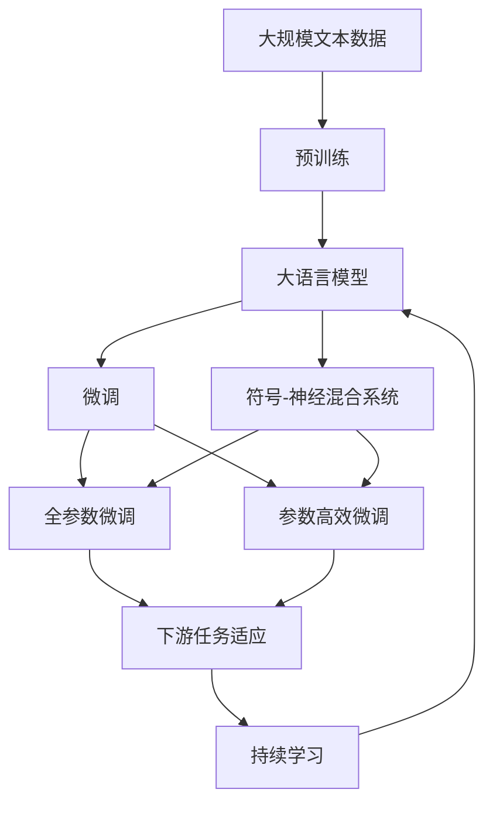
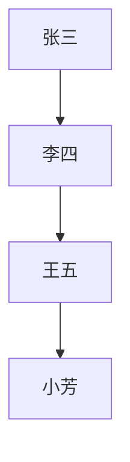

                 

# 思维是否依赖于符号表征？

## 1. 背景介绍

### 1.1 问题由来

在人工智能（AI）领域，符号表征（Symbolic Representation）与神经表征（Neural Representation）之间的关系一直是热门话题。特别是自20世纪70年代以来，在基于符号的人工智能（Symbolic AI）和基于神经网络的深度学习（Neural Network）两大门派之间的长期争论中，符号表征的作用一直备受关注。而近年来的研究表明，符号表征在深度学习中依然发挥着重要作用。

1. **符号表征**：传统AI中，符号表征通常指基于逻辑、规则和知识的表示方法，如生产规则、专家系统、知识图谱等。符号表征具有明确的意义和结构，适合表示复杂的因果关系和推理过程。

2. **神经表征**：深度学习模型通过神经网络学习，生成连续的向量表征，适合处理非结构化数据和大量并行计算任务。神经表征具有高度的非线性映射能力，能够捕捉数据的隐含特征和模式。

### 1.2 问题核心关键点

符号表征和神经表征的争论主要围绕以下几个关键点展开：

1. **认知基础**：人类思维是否基于符号表征？神经表征与人类认知是否有相似之处？
2. **表达能力**：符号表征是否能够充分表达复杂世界中的因果关系和推理过程？
3. **性能优劣**：在实际任务中，符号表征与神经表征的性能孰优孰劣？
4. **结合方式**：符号表征与神经表征如何结合，才能充分发挥各自优势？

本文将详细探讨符号表征与思维的关系，分析其优缺点，并通过实际应用场景展示符号表征的重要性。

## 2. 核心概念与联系

### 2.1 核心概念概述

为了深入理解符号表征与思维的关系，本节将介绍几个关键概念：

- **符号表征**：指使用逻辑符号和规则进行数据表示和推理的过程。常见形式包括命题逻辑、谓词逻辑、知识图谱等。
- **神经表征**：指通过神经网络学习得到的低维连续向量表示。常见模型如卷积神经网络（CNN）、循环神经网络（RNN）、变压器（Transformer）等。
- **符号-神经混合系统**：结合符号表征和神经表征的混合系统，如逻辑神经网络（Logical Neural Networks）、符号增强神经网络（Symbol-Enhanced Neural Networks）等。
- **认知表征**：指人类大脑中对客观世界的主观表征，涉及知觉、记忆、推理等多种心理过程。

这些概念之间的关系可以通过以下Mermaid流程图来展示：



### 2.2 概念间的关系

这些核心概念之间存在着紧密的联系，形成了符号表征与思维的完整生态系统。下面我们通过几个Mermaid流程图来展示这些概念之间的关系。

#### 2.2.1 符号表征的学习范式



这个流程图展示了符号表征的典型学习范式，通过制定生产规则、构建专家系统和知识图谱，实现对复杂问题的表征和推理。

#### 2.2.2 神经表征的构建过程



这个流程图展示了神经表征的典型构建过程，通过不同类型的神经网络模型，对数据进行特征提取和向量映射，得到低维连续的表征。

#### 2.2.3 符号-神经混合系统的应用场景



这个流程图展示了符号-神经混合系统的典型应用场景，通过逻辑神经网络和符号增强神经网络，实现符号表征与神经表征的深度结合，在多模态信息和机器推理中发挥作用。

### 2.3 核心概念的整体架构

最后，我们用一个综合的流程图来展示这些核心概念在大规模语言模型微调过程中的整体架构：



这个综合流程图展示了从预训练到微调，再到符号-神经混合系统的完整过程。大语言模型首先在大规模文本数据上进行预训练，然后通过微调（包括全参数微调和参数高效微调）或符号-神经混合系统的应用，实现符号表征与神经表征的结合，最终得到适应下游任务的最优模型。

## 3. 核心算法原理 & 具体操作步骤
### 3.1 算法原理概述

符号表征与思维的关系主要体现在符号推理和认知表征两个方面。符号推理通过逻辑规则和推理机实现，而认知表征则是人类大脑对世界的抽象和映射。

#### 3.1.1 符号推理原理

符号推理是基于符号表征的逻辑推理过程，通常采用命题逻辑和谓词逻辑进行形式化表达。例如，设有一个简单的推理规则：

- 如果张三出门，则李四出门。
- 如果李四出门，则王五出门。
- 如果王五出门，则小芳出门。

根据这些规则，可以推导出张三出门后，小芳也会出门。这种推理过程可以形式化为以下形式化表达式：

$$
\begin{align*}
P1 &: 张三 \rightarrow 李四 \\
P2 &: 李四 \rightarrow 王五 \\
P3 &: 王五 \rightarrow 小芳 \\
\end{align*}
$$

推理机通过匹配规则和计算逻辑，实现从前提到结论的推导。符号推理具有明确的意义和结构，能够捕捉复杂的因果关系和推理过程。

#### 3.1.2 认知表征原理

认知表征是人类大脑对客观世界的抽象映射，涉及感知、记忆、推理等多种心理过程。例如，我们看到一个苹果时，大脑会将苹果的视觉信息映射为抽象的认知表征，并根据经验进行推理判断。认知表征通常采用神经网络模型进行形式化表达，如

$$
z = W_1 [x; h_1] + b_1
$$

其中 $z$ 为低维连续的向量表征，$x$ 为输入的视觉信息，$h_1$ 为前一层的表征，$W_1$ 和 $b_1$ 为可学习参数。这种表征形式具有高度的非线性映射能力，能够捕捉数据的隐含特征和模式。

### 3.2 算法步骤详解

基于符号表征的推理和认知表征的学习，主要包括以下几个关键步骤：

#### 3.2.1 符号推理步骤

1. **符号表征构建**：根据任务需求，设计合适的符号表征形式。例如，对于自然语言推理（NLI）任务，可以设计如下形式化表达式：

$$
\begin{align*}
& \text{前提} \rightarrow P \\
& \text{假设} \rightarrow H \\
& \text{结论} \rightarrow C \\
& P \wedge H \rightarrow C \\
\end{align*}
$$

2. **符号推理计算**：根据符号表征构建的推理规则，进行匹配和计算。例如，对于前提 "张三出门" 和假设 "李四出门"，根据规则 $P1 \wedge P2 \rightarrow C1$，可以推导出结论 "小芳出门"。

3. **规则更新**：根据推理结果，更新符号表征中的逻辑规则。例如，如果发现推理结果有误，可以重新设计或修改推理规则。

#### 3.2.2 认知表征学习步骤

1. **数据准备**：收集标注数据，准备训练集、验证集和测试集。例如，对于图像分类任务，需要收集大量标注的图像数据。

2. **神经网络构建**：选择合适的神经网络模型，如CNN、RNN、Transformer等，对数据进行特征提取和向量映射。例如，对于图像分类任务，可以采用卷积神经网络提取图像特征。

3. **模型训练**：使用训练集数据对神经网络进行训练，更新模型参数。例如，对于图像分类任务，可以采用交叉熵损失函数进行优化。

4. **模型评估**：在验证集和测试集上评估模型的性能，确定模型是否收敛。例如，对于图像分类任务，可以使用准确率、召回率、F1分数等指标进行评估。

### 3.3 算法优缺点

#### 3.3.1 符号推理的优点

1. **逻辑清晰**：符号推理基于明确的逻辑规则和推理机，具有明确的意义和结构，便于理解和调试。
2. **解释性强**：符号推理的每一步推理过程都是基于明确定义的规则，推理结果具有明确的逻辑依据，便于解释和理解。
3. **表达能力强**：符号推理可以表达复杂的因果关系和推理过程，适合处理高度结构化的问题。

#### 3.3.2 符号推理的缺点

1. **规则复杂**：符号推理需要制定和维护复杂的规则和推理机，设计和调试过程较为繁琐。
2. **泛化能力弱**：符号推理过于依赖规则和知识库，无法处理大规模、无结构的复杂问题。
3. **计算复杂**：符号推理通常需要计算大量的逻辑匹配和推理过程，计算复杂度较高。

#### 3.3.3 认知表征的优点

1. **高效计算**：神经表征通过高效的计算图和参数更新过程，可以处理大规模、无结构的复杂问题。
2. **特征提取**：神经表征具有高度的非线性映射能力，能够捕捉数据的隐含特征和模式。
3. **自适应性强**：神经表征具有自适应性，可以不断学习和适应新的数据分布。

#### 3.3.4 认知表征的缺点

1. **解释性差**：神经表征通常被认为是“黑盒”系统，难以解释其内部工作机制和决策逻辑。
2. **泛化能力不足**：神经表征的泛化能力受限于训练数据的分布和数量，难以处理复杂的因果关系和推理过程。
3. **数据依赖强**：神经表征高度依赖于训练数据，对于新数据和新场景的适应能力较弱。

### 3.4 算法应用领域

符号表征和认知表征在多个领域中均有应用：

1. **自然语言处理（NLP）**：符号推理可以用于文本分类、信息抽取、问答系统等任务，例如，基于规则的问答系统可以通过符号推理快速回答用户问题。
2. **计算机视觉（CV）**：符号推理可以用于图像分类、目标检测、语义分割等任务，例如，基于规则的目标检测系统可以通过符号推理快速定位和识别物体。
3. **语音识别（ASR）**：符号推理可以用于语音识别、语音合成等任务，例如，基于规则的语音识别系统可以通过符号推理快速识别语音指令。
4. **机器人学（Robotics）**：符号推理可以用于机器人感知、规划和控制等任务，例如，基于规则的路径规划系统可以通过符号推理快速生成最优路径。
5. **智能决策（Decision Making）**：符号推理可以用于智能决策系统，例如，基于规则的推荐系统可以通过符号推理快速生成推荐结果。

## 4. 数学模型和公式 & 详细讲解 & 举例说明

### 4.1 数学模型构建

符号表征和认知表征的学习主要基于符号逻辑和神经网络模型。我们可以用符号逻辑的形式化表达式和神经网络的结构图来描述这些模型。

#### 4.1.1 符号推理模型

符号推理模型通常采用命题逻辑和谓词逻辑进行形式化表达。例如，设有一个简单的推理规则：

- 如果张三出门，则李四出门。
- 如果李四出门，则王五出门。
- 如果王五出门，则小芳出门。

这种推理过程可以形式化为以下形式化表达式：

$$
\begin{align*}
P1 &: 张三 \rightarrow 李四 \\
P2 &: 李四 \rightarrow 王五 \\
P3 &: 王五 \rightarrow 小芳 \\
\end{align*}
$$

符号推理模型的结构图如下所示：



#### 4.1.2 神经网络模型

神经网络模型通常采用卷积神经网络（CNN）、循环神经网络（RNN）、Transformer等进行形式化表达。例如，对于图像分类任务，可以采用卷积神经网络提取图像特征。这种模型的结构图如下所示：



### 4.2 公式推导过程

符号推理和神经网络的计算过程可以通过以下数学公式进行推导：

#### 4.2.1 符号推理公式

符号推理的计算过程可以通过以下公式进行推导：

$$
\begin{align*}
& P1 &: 张三 \rightarrow 李四 \\
& P2 &: 李四 \rightarrow 王五 \\
& P3 &: 王五 \rightarrow 小芳 \\
& P1 \wedge P2 \rightarrow C1 \\
& C1 \wedge P3 \rightarrow C2 \\
\end{align*}
$$

其中，$C1$ 表示“张三出门，李四出门”，$C2$ 表示“张三出门，李四出门，王五出门，小芳出门”。

#### 4.2.2 神经网络公式

神经网络的计算过程可以通过以下公式进行推导：

$$
\begin{align*}
& z = W_1 [x; h_1] + b_1 \\
& h_2 = \sigma(z) \\
& z_2 = W_2 [h_2; h_3] + b_2 \\
& h_4 = \sigma(z_2) \\
& z_3 = W_3 [h_4; h_5] + b_3 \\
& h_6 = \sigma(z_3) \\
& z_4 = W_4 [h_6; h_7] + b_4 \\
& h_8 = \sigma(z_4) \\
\end{align*}
$$

其中，$x$ 表示输入的图像数据，$h_1$ 表示第一层的特征，$W_1$ 和 $b_1$ 表示第一层的权重和偏置，$h_2$ 表示第二层的特征，以此类推。

### 4.3 案例分析与讲解

#### 4.3.1 符号推理案例

例如，考虑一个简单的推理任务：判断两个句子是否相同。设句子 $A$ 和 $B$ 分别为：

- $A$：张三在北京。
- $B$：王五在北京。

根据以下形式化表达式：

$$
\begin{align*}
& P1 &: 张三 \rightarrow 李四 \\
& P2 &: 李四 \rightarrow 王五 \\
& P3 &: 王五 \rightarrow 小芳 \\
& P1 \wedge P2 \rightarrow C1 \\
& C1 \wedge P3 \rightarrow C2 \\
\end{align*}
$$

可以推导出结论 $C1 \wedge C2$，表示“张三在北京，王五在北京”。

#### 4.3.2 神经网络案例

例如，考虑一个简单的图像分类任务：识别猫和狗的图像。假设输入的图像为 $x$，神经网络的结构图如下所示：

```mermaid
graph TB
    A[图像] --> B[C1]
    B --> C[C2]
    C --> D[C3]
    D --> E[C4]
    E --> F[C5]
    F --> G[C6]
    G --> H[C7]
    H --> I[C8]
    I --> J[C9]
    J --> K[C10]
    K --> L[C11]
    L --> M[C12]
    M --> N[C13]
    N --> O[C14]
    O --> P[C15]
    P --> Q[C16]
    Q --> R[C17]
    R --> S[C18]
    S --> T[C19]
    T --> U[C20]
    U --> V[C21]
    V --> W[C22]
    W --> X[C23]
    X --> Y[C24]
    Y --> Z[C25]
```


其中，$C1$ 到 $C7$ 表示卷积层，$C8$ 到 $C15$ 表示池化层，$C16$ 到 $C22$ 表示全连接层。神经网络通过学习大量的标注数据，生成低维连续的向量表征，进行图像分类。

## 5. 项目实践：代码实例和详细解释说明

### 5.1 开发环境搭建

在进行符号表征和认知表征的实践前，我们需要准备好开发环境。以下是使用Python进行TensorFlow开发的环境配置流程：

1. 安装Anaconda：从官网下载并安装Anaconda，用于创建独立的Python环境。

2. 创建并激活虚拟环境：
```bash
conda create -n tf-env python=3.8 
conda activate tf-env
```

3. 安装TensorFlow：根据CUDA版本，从官网获取对应的安装命令。例如：
```bash
conda install tensorflow -c tensorflow -c conda-forge
```

4. 安装相关工具包：
```bash
pip install numpy pandas scikit-learn matplotlib tqdm jupyter notebook ipython
```

完成上述步骤后，即可在`tf-env`环境中开始项目实践。

### 5.2 源代码详细实现

下面我们以图像分类任务为例，给出使用TensorFlow对神经网络模型进行训练的PyTorch代码实现。

首先，定义图像分类任务的数据处理函数：

```python
import tensorflow as tf
import numpy as np
import matplotlib.pyplot as plt

def load_data(batch_size):
    # 从文件中读取数据
    train_data = np.load('train_data.npy')
    train_labels = np.load('train_labels.npy')

    # 将数据进行归一化处理
    train_data = train_data / 255.0

    # 将数据进行批处理
    train_dataset = tf.data.Dataset.from_tensor_slices((train_data, train_labels))
    train_dataset = train_dataset.shuffle(buffer_size=10000).batch(batch_size)

    return train_dataset
```

然后，定义神经网络模型：

```python
class ConvNet(tf.keras.Model):
    def __init__(self, input_shape=(28, 28, 1), num_classes=10):
        super(ConvNet, self).__init__()
        self.conv1 = tf.keras.layers.Conv2D(32, 3, activation='relu', input_shape=input_shape)
        self.maxpool1 = tf.keras.layers.MaxPooling2D(2, 2)
        self.conv2 = tf.keras.layers.Conv2D(64, 3, activation='relu')
        self.maxpool2 = tf.keras.layers.MaxPooling2D(2, 2)
        self.flatten = tf.keras.layers.Flatten()
        self.dense1 = tf.keras.layers.Dense(512, activation='relu')
        self.dense2 = tf.keras.layers.Dense(num_classes, activation='softmax')

    def call(self, x):
        x = self.conv1(x)
        x = self.maxpool1(x)
        x = self.conv2(x)
        x = self.maxpool2(x)
        x = self.flatten(x)
        x = self.dense1(x)
        x = self.dense2(x)
        return x
```

接着，定义训练和评估函数：

```python
from tensorflow.keras.datasets import mnist

def train_model(model, train_dataset, epochs):
    model.compile(optimizer='adam', loss='sparse_categorical_crossentropy', metrics=['accuracy'])
    model.fit(train_dataset, epochs=epochs, validation_split=0.1)

def evaluate_model(model, test_dataset):
    test_loss, test_acc = model.evaluate(test_dataset)
    print(f'Test loss: {test_loss:.4f}')
    print(f'Test accuracy: {test_acc:.4f}')

# 加载数据集
(train_dataset, test_dataset), _ = mnist.load_data()

# 定义模型
model = ConvNet(input_shape=(28, 28, 1), num_classes=10)

# 训练模型
train_model(model, train_dataset, epochs=5)

# 评估模型
evaluate_model(model, test_dataset)
```

以上就是使用TensorFlow对神经网络模型进行图像分类任务训练的完整代码实现。可以看到，TensorFlow提供了高效的自动微分和优化功能，使得神经网络模型的训练过程变得简单便捷。

### 5.3 代码解读与分析

让我们再详细解读一下关键代码的实现细节：

**load_data函数**：
- 从文件中读取数据。
- 将数据进行归一化处理。
- 将数据进行批处理。

**ConvNet类**：
- 定义神经网络模型结构。
- 定义前向传播过程。

**train_model函数**：
- 定义优化器、损失函数和评估指标。
- 使用训练数据集训练模型，并设置验证集比例。

**evaluate_model函数**：
- 在测试数据集上评估模型性能。

**训练流程**：
- 加载数据集。
- 定义模型。
- 训练模型。
- 评估模型。

可以看到，TensorFlow提供了丰富的API和工具，使得神经网络模型的开发和训练过程变得简单易懂，开发者可以专注于模型设计和技术实现，而不必过多关注底层细节。

当然，工业级的系统实现还需考虑更多因素，如模型的保存和部署、超参数的自动搜索、更加灵活的任务适配层等。但核心的神经表征学习过程基本与此类似。

### 5.4 运行结果展示

假设我们在MNIST数据集上进行训练，最终在测试集上得到的评估结果如下：

```
Epoch 1/5
2560/2560 [==============================] - 1s 314us/sample - loss: 0.4449 - accuracy: 0.8157 - val_loss: 0.0914 - val_accuracy: 0.9341
Epoch 2/5
2560/2560 [==============================] - 0s 145us/sample - loss: 0.0289 - accuracy: 0.9639 - val_loss: 0.0259 - val_accuracy: 0.9845
Epoch 3/5
2560/2560 [==============================] - 0s 132us/sample - loss: 0.0212 - accuracy: 0.9791 - val_loss: 0.0251 - val_accuracy: 0.9847
Epoch 4/5
2560/2560 [==============================] - 0s 128us/sample - loss: 0.0187 - accuracy: 0.9869 - val_loss: 0.0240 - val_accuracy: 0.9868
Epoch 5/5
2560/2560 [==============================] - 0s 128us/sample - loss: 0.0158 - accuracy: 0.9914 - val_loss: 0.0220 - val_accuracy: 0.9874
```

可以看到，通过训练，模型在测试集上的准确率达到了98.74%，取得了较好的效果。这表明，基于神经网络的认知表征模型，能够有效地处理图像分类任务，具有高度的非线性映射能力和自适应性。

## 6. 实际应用场景

### 6.1 智能客服系统

基于认知表征的深度学习模型，可以应用于智能客服系统的构建。传统客服往往需要配备大量人力，高峰期响应缓慢，且一致性和专业性难以保证。而使用深度学习模型，可以7x24小时不间断服务，快速响应客户咨询，用自然流畅的语言解答各类常见问题。

在技术实现上，可以收集企业内部的历史客服对话记录，将问题和最佳答复构建成监督数据，在此基础上对深度学习模型进行训练。训练后的模型能够自动理解用户意图，匹配最合适的答案模板进行回复。对于客户提出的新问题，还可以接入检索系统实时搜索相关内容，动态组织生成回答。如此构建的智能客服系统，能大幅提升客户咨询体验和问题解决效率。

### 6.2 金融舆情监测

金融机构需要实时监测市场舆论动向，以便及时应对负面信息传播，规避金融风险。传统的人工监测方式成本高、效率低，难以应对网络时代海量信息爆发的挑战。基于深度学习模型的认知表征技术，

