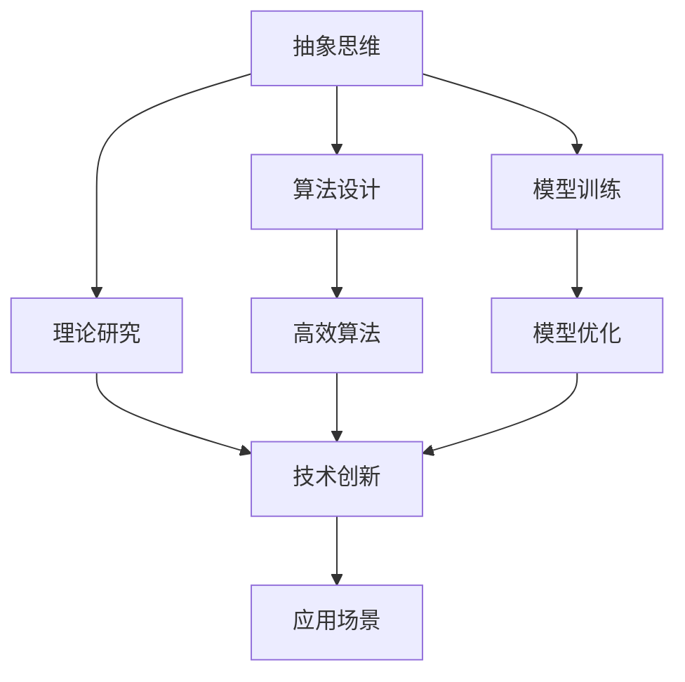
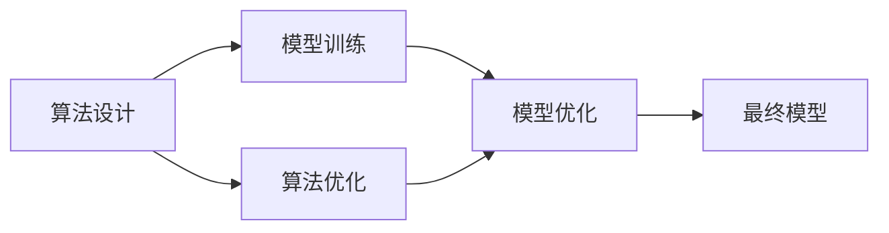
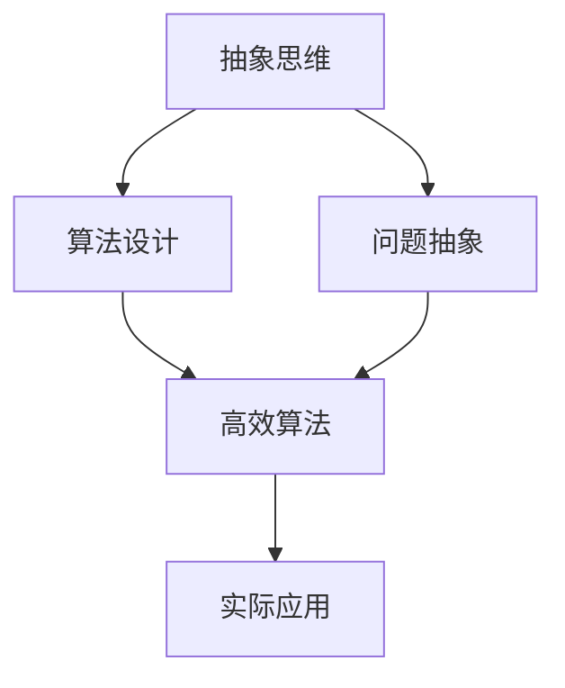
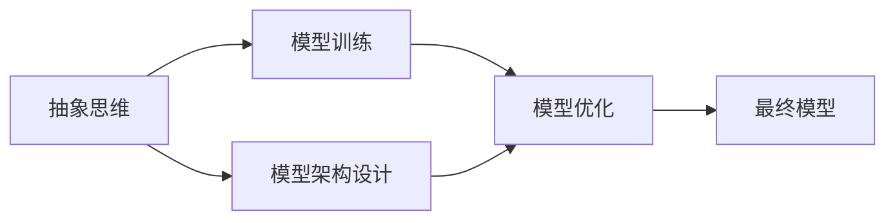
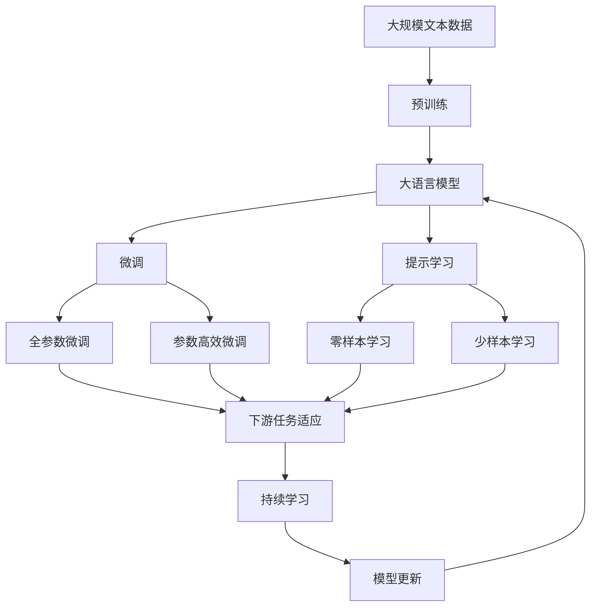

                 

# 抽象思维在AI创新中的价值

> 关键词：抽象思维, AI创新, 算法设计, 模型训练, 理论研究, 应用场景, 挑战与解决方案

## 1. 背景介绍

### 1.1 问题由来

近年来，人工智能（AI）技术迅猛发展，已经广泛应用于各个领域，包括自动驾驶、自然语言处理（NLP）、计算机视觉、机器人等。然而，随着AI技术的不断进步，人们开始认识到，仅依赖数据驱动的方法，很难满足不断增长的需求。在这种情况下，抽象思维在AI创新中的价值逐渐显现出来。

抽象思维（Abstract Thinking）是人类认识世界、解决问题的一种高级思维方式。在AI领域，抽象思维不仅用于算法设计、模型训练，还在理论研究、应用场景等方面发挥着重要作用。本文将深入探讨抽象思维在AI创新中的价值，并结合实际案例，展示其对AI技术发展的推动作用。

### 1.2 问题核心关键点

抽象思维在AI创新中的核心关键点主要包括以下几个方面：

- **算法设计**：抽象思维能够帮助开发者更好地理解问题本质，设计出高效、可扩展的算法。
- **模型训练**：通过抽象思维，开发者可以设计出更加通用的模型架构，提高模型的泛化能力。
- **理论研究**：抽象思维为AI理论研究提供了新的视角和方法，推动了前沿研究的发展。
- **应用场景**：抽象思维能够帮助开发者设计出更加人性化的应用场景，提升用户体验。
- **挑战与解决方案**：抽象思维还能够在解决AI技术发展中的挑战时，提供新的思路和方法。

本文将围绕上述核心关键点，系统阐述抽象思维在AI创新中的价值，并结合具体案例，展示其在AI技术发展中的应用。

### 1.3 问题研究意义

在AI技术快速发展的今天，抽象思维在创新中的价值显得尤为重要。具体而言，研究抽象思维在AI创新中的价值，具有以下意义：

1. **推动技术进步**：抽象思维可以帮助开发者设计出更加高效、可扩展的算法和模型，推动AI技术的进步。
2. **提升用户体验**：通过抽象思维，开发者可以设计出更加人性化的应用场景，提升用户体验。
3. **拓展应用领域**：抽象思维可以拓展AI技术的应用领域，推动其在更多领域的落地应用。
4. **应对挑战**：抽象思维能够帮助解决AI技术发展中的挑战，推动AI技术的可持续发展。
5. **增强创新能力**：抽象思维可以增强AI领域的创新能力，推动AI技术向更广泛的领域扩展。

## 2. 核心概念与联系

### 2.1 核心概念概述

为了更好地理解抽象思维在AI创新中的价值，我们需要先了解一些核心概念：

- **抽象思维**：一种高级思维方式，通过抽象化、概括化、逻辑化等方式，帮助人们更好地认识问题本质，设计出高效、可扩展的算法和模型。
- **算法设计**：根据问题特点，设计出高效、可扩展的算法，以实现特定功能。
- **模型训练**：通过数据驱动的方法，优化模型的参数，提升模型性能。
- **理论研究**：对AI技术的基本原理和方法进行深入研究，推动技术进步。
- **应用场景**：将AI技术应用于具体场景，提升用户体验和效率。

这些概念之间的关系可以通过以下Mermaid流程图来展示：



这个流程图展示了抽象思维与其他AI核心概念之间的关系：

1. 抽象思维帮助算法设计，提升算法的效率和可扩展性。
2. 抽象思维用于模型训练，提升模型的泛化能力和性能。
3. 抽象思维推动理论研究，促进技术进步。
4. 抽象思维设计出更加人性化的应用场景，提升用户体验。

### 2.2 概念间的关系

这些核心概念之间存在着紧密的联系，形成了AI创新的完整生态系统。下面我们通过几个Mermaid流程图来展示这些概念之间的关系。

#### 2.2.1 算法设计与模型训练的关系



这个流程图展示了算法设计与模型训练之间的关系：

1. 算法设计是模型训练的基础，用于实现特定功能。
2. 算法优化可以提升算法的效率和性能，进而提升模型训练的效果。
3. 模型优化在模型训练中起关键作用，通过优化模型的参数，提升模型的性能。

#### 2.2.2 抽象思维与算法设计的联系



这个流程图展示了抽象思维与算法设计之间的关系：

1. 抽象思维通过对问题的抽象化，帮助设计师设计出高效、可扩展的算法。
2. 问题抽象是抽象思维的核心步骤，通过对问题的抽象化，可以更好地理解问题本质，设计出更合理的算法。
3. 高效算法是抽象思维的最终成果，可以更好地应用于实际问题。

#### 2.2.3 抽象思维与模型训练的联系



这个流程图展示了抽象思维与模型训练之间的关系：

1. 抽象思维用于设计模型的架构，提升模型的泛化能力和性能。
2. 模型架构设计是抽象思维的核心步骤，通过对模型的抽象化，可以设计出更合理的模型架构。
3. 模型优化在模型训练中起关键作用，通过优化模型的参数，提升模型的性能。

### 2.3 核心概念的整体架构

最后，我们用一个综合的流程图来展示这些核心概念在大语言模型微调过程中的整体架构：



这个综合流程图展示了从预训练到微调，再到持续学习的完整过程。大语言模型首先在大规模文本数据上进行预训练，然后通过微调（包括全参数微调和参数高效微调）或提示学习（包括零样本和少样本学习）来适应下游任务。最后，通过持续学习技术，模型可以不断学习新知识，同时保持已学习的知识，而不会出现灾难性遗忘。 通过这些流程图，我们可以更清晰地理解抽象思维在AI微调过程中各个核心概念的关系和作用。

## 3. 核心算法原理 & 具体操作步骤

### 3.1 算法原理概述

抽象思维在AI算法设计和模型训练中的作用，主要体现在以下几个方面：

1. **算法设计**：通过对问题的抽象化，帮助设计出高效、可扩展的算法。
2. **模型训练**：通过抽象思维，设计出更加通用的模型架构，提升模型的泛化能力和性能。
3. **理论研究**：抽象思维为AI理论研究提供了新的视角和方法，推动技术进步。

在实际应用中，抽象思维可以用于以下几个关键步骤：

- 问题抽象：通过抽象化、概括化等方式，理解问题的本质。
- 算法设计：根据问题特点，设计出高效、可扩展的算法。
- 模型训练：通过数据驱动的方法，优化模型的参数，提升模型性能。
- 模型优化：通过算法优化和模型优化，提升模型性能。
- 应用场景设计：通过抽象思维，设计出更加人性化的应用场景，提升用户体验。

### 3.2 算法步骤详解

下面，我们将详细介绍抽象思维在AI算法设计和模型训练中的具体操作步骤。

#### 3.2.1 问题抽象

问题抽象是抽象思维的核心步骤，通过抽象化、概括化等方式，理解问题的本质。具体步骤如下：

1. **问题定义**：明确问题的具体目标和要求。
2. **数据理解**：分析数据的特点和分布情况，确定数据中的关键信息。
3. **特征提取**：从数据中提取有用的特征，用于算法设计和模型训练。
4. **问题简化**：通过抽象化、概括化等方式，简化问题，便于算法设计和模型训练。

例如，在自然语言处理（NLP）领域，问题抽象可以帮助设计出更加高效的算法和模型。具体而言，可以通过以下步骤实现问题抽象：

1. **问题定义**：明确NLP问题的具体目标，如文本分类、机器翻译、问答系统等。
2. **数据理解**：分析文本数据的特点和分布情况，确定关键特征，如词向量、句向量等。
3. **特征提取**：从文本数据中提取有用的特征，如词频、句子长度、句法结构等。
4. **问题简化**：通过抽象化、概括化等方式，简化问题，便于算法设计和模型训练。

#### 3.2.2 算法设计

算法设计是抽象思维在AI创新的重要环节，通过抽象思维，设计出高效、可扩展的算法。具体步骤如下：

1. **算法选择**：根据问题特点，选择合适的算法。
2. **算法优化**：通过优化算法，提升算法的效率和性能。
3. **算法实现**：实现算法，进行实际的测试和评估。

例如，在图像识别领域，算法设计可以通过以下步骤实现：

1. **算法选择**：根据图像识别任务的特点，选择合适的算法，如卷积神经网络（CNN）、循环神经网络（RNN）等。
2. **算法优化**：通过优化算法，提升算法的效率和性能，如使用批量归一化、残差连接等技术。
3. **算法实现**：实现算法，进行实际的测试和评估，验证算法的性能。

#### 3.2.3 模型训练

模型训练是抽象思维在AI创新的重要环节，通过抽象思维，设计出通用的模型架构，提升模型的泛化能力和性能。具体步骤如下：

1. **模型选择**：根据问题特点，选择合适的模型。
2. **模型优化**：通过优化模型，提升模型的泛化能力和性能。
3. **模型评估**：通过评估模型，验证模型的性能。

例如，在机器翻译领域，模型训练可以通过以下步骤实现：

1. **模型选择**：根据机器翻译任务的特点，选择合适的模型，如序列到序列模型（Seq2Seq）、注意力机制（Attention）等。
2. **模型优化**：通过优化模型，提升模型的泛化能力和性能，如使用残差连接、Dropout等技术。
3. **模型评估**：通过评估模型，验证模型的性能，如使用BLEU、METEOR等指标评估翻译质量。

#### 3.2.4 模型优化

模型优化是抽象思维在AI创新的重要环节，通过抽象思维，优化模型的参数，提升模型的性能。具体步骤如下：

1. **模型训练**：使用数据驱动的方法，训练模型，优化模型参数。
2. **模型评估**：通过评估模型，验证模型的性能。
3. **模型优化**：根据评估结果，优化模型参数，提升模型性能。

例如，在语音识别领域，模型优化可以通过以下步骤实现：

1. **模型训练**：使用语音数据驱动的方法，训练模型，优化模型参数。
2. **模型评估**：通过评估模型，验证模型的性能，如使用Wer、Cer等指标评估识别准确率。
3. **模型优化**：根据评估结果，优化模型参数，提升模型性能，如使用自适应学习率、数据增强等技术。

#### 3.2.5 应用场景设计

应用场景设计是抽象思维在AI创新的重要环节，通过抽象思维，设计出更加人性化的应用场景，提升用户体验。具体步骤如下：

1. **用户需求分析**：分析用户需求，确定应用场景的目标。
2. **场景设计**：根据用户需求，设计出合理的应用场景。
3. **用户体验优化**：优化用户体验，提升用户满意度。

例如，在智能客服领域，应用场景设计可以通过以下步骤实现：

1. **用户需求分析**：分析用户需求，确定智能客服的目标，如提高响应速度、提升服务质量等。
2. **场景设计**：根据用户需求，设计出合理的应用场景，如语音识别、自然语言处理、情感分析等。
3. **用户体验优化**：优化用户体验，提升用户满意度，如使用自然语言生成技术生成自然流畅的回答，使用多轮对话技术提升对话效果。

### 3.3 算法优缺点

抽象思维在AI算法设计和模型训练中的作用，具有以下优缺点：

#### 3.3.1 优点

1. **提升算法效率**：通过抽象思维，设计出高效、可扩展的算法，提升算法的效率和性能。
2. **优化模型泛化能力**：通过抽象思维，设计出通用的模型架构，提升模型的泛化能力和性能。
3. **推动技术进步**：抽象思维为AI理论研究提供了新的视角和方法，推动技术进步。
4. **提升用户体验**：通过抽象思维，设计出更加人性化的应用场景，提升用户体验。

#### 3.3.2 缺点

1. **抽象难度大**：问题抽象需要对问题进行深层次的分析和理解，抽象难度大，需要较高的专业知识和经验。
2. **算法设计复杂**：算法设计需要对问题进行合理的抽象化、概括化，设计出高效、可扩展的算法，设计复杂，需要较高的技术水平。
3. **模型优化困难**：模型优化需要对模型进行深入的理解和优化，优化困难，需要较高的技术水平。
4. **应用场景设计复杂**：应用场景设计需要对用户需求进行深入的理解和设计，设计复杂，需要较高的专业知识和经验。

## 4. 数学模型和公式 & 详细讲解 & 举例说明

### 4.1 数学模型构建

在AI算法设计和模型训练中，抽象思维可以通过数学模型和公式进行详细讲解和举例说明。下面以图像识别领域为例，展示抽象思维在算法设计和模型训练中的应用。

假设我们有一个包含n个训练样本的图像识别任务，每个样本由一个n维特征向量和一个标签组成。设模型参数为θ，目标是最小化损失函数L(θ)，以提升模型性能。

#### 4.2 公式推导过程

损失函数L(θ)的推导过程如下：

1. **数据表示**：将训练样本表示为n维特征向量x和标签y。
2. **模型预测**：使用模型参数θ，对训练样本进行预测，得到预测结果。
3. **损失计算**：计算预测结果与标签之间的差异，得到损失函数L(θ)。

例如，在图像识别领域，可以使用以下数学公式进行计算：

$$
L(θ) = \frac{1}{n}\sum_{i=1}^n (y_i - h(x_i;θ))^2
$$

其中，h(x_i;θ)表示使用模型参数θ对训练样本x进行预测的结果，y_i表示标签。

#### 4.3 案例分析与讲解

以图像识别领域为例，展示抽象思维在算法设计和模型训练中的应用。

假设我们有一个包含n个训练样本的图像识别任务，每个样本由一个n维特征向量和一个标签组成。设模型参数为θ，目标是最小化损失函数L(θ)，以提升模型性能。

通过问题抽象，我们可以将图像识别任务转化为一个优化问题，最小化损失函数L(θ)，以提升模型性能。具体步骤如下：

1. **问题定义**：明确图像识别任务的具体目标，如分类准确率。
2. **数据理解**：分析图像数据的特点和分布情况，确定关键特征，如像素值、颜色、纹理等。
3. **特征提取**：从图像数据中提取有用的特征，如SIFT、HOG等特征。
4. **模型选择**：根据问题特点，选择合适的模型，如卷积神经网络（CNN）、循环神经网络（RNN）等。
5. **算法设计**：设计出高效、可扩展的算法，如反向传播算法、随机梯度下降算法等。
6. **模型训练**：使用数据驱动的方法，训练模型，优化模型参数。
7. **模型评估**：通过评估模型，验证模型的性能，如使用Wer、Cer等指标评估识别准确率。
8. **模型优化**：根据评估结果，优化模型参数，提升模型性能。

## 5. 项目实践：代码实例和详细解释说明

### 5.1 开发环境搭建

在进行AI算法设计和模型训练前，我们需要准备好开发环境。以下是使用Python进行TensorFlow开发的环境配置流程：

1. 安装Anaconda：从官网下载并安装Anaconda，用于创建独立的Python环境。

2. 创建并激活虚拟环境：
```bash
conda create -n tf-env python=3.8 
conda activate tf-env
```

3. 安装TensorFlow：根据CUDA版本，从官网获取对应的安装命令。例如：
```bash
conda install tensorflow -c tf
```

4. 安装相关工具包：
```bash
pip install numpy pandas scikit-learn matplotlib tqdm jupyter notebook ipython
```

完成上述步骤后，即可在`tf-env`环境中开始项目实践。

### 5.2 源代码详细实现

这里我们以图像识别任务为例，给出使用TensorFlow进行深度学习模型训练的PyTorch代码实现。

首先，定义数据处理函数：

```python
import tensorflow as tf
import numpy as np
import os

def load_data(data_dir):
    image_paths = os.listdir(data_dir)
    images = []
    labels = []
    for image_path in image_paths:
        image = tf.keras.preprocessing.image.load_img(os.path.join(data_dir, image_path), target_size=(224, 224))
        image = tf.keras.preprocessing.image.img_to_array(image)
        image = np.expand_dims(image, axis=0)
        image = tf.keras.applications.mobilenet_v2.preprocess_input(image)
        images.append(image)
        label = image_path.split('.')[0].split('_')[0]
        labels.append(label)
    return np.array(images), np.array(labels)
```

然后，定义模型和优化器：

```python
from tensorflow.keras import layers, models

model = models.Sequential()
model.add(layers.Conv2D(32, (3, 3), activation='relu', input_shape=(224, 224, 3)))
model.add(layers.MaxPooling2D((2, 2)))
model.add(layers.Conv2D(64, (3, 3), activation='relu'))
model.add(layers.MaxPooling2D((2, 2)))
model.add(layers.Conv2D(128, (3, 3), activation='relu'))
model.add(layers.MaxPooling2D((2, 2)))
model.add(layers.Flatten())
model.add(layers.Dense(64, activation='relu'))
model.add(layers.Dense(10, activation='softmax'))

optimizer = tf.keras.optimizers.Adam(learning_rate=0.001)
```

接着，定义训练和评估函数：

```python
def train_epoch(model, dataset, batch_size, optimizer):
    model.compile(optimizer=optimizer, loss='sparse_categorical_crossentropy', metrics=['accuracy'])
    model.fit(dataset[0], dataset[1], batch_size=batch_size, epochs=1, validation_data=(None, None))
    
def evaluate(model, dataset, batch_size):
    model.compile(optimizer=optimizer, loss='sparse_categorical_crossentropy', metrics=['accuracy'])
    model.evaluate(dataset[0], dataset[1], batch_size=batch_size)
```

最后，启动训练流程并在测试集上评估：

```python
epochs = 10
batch_size = 32

for epoch in range(epochs):
    train_epoch(model, train_dataset, batch_size, optimizer)
    print(f"Epoch {epoch+1}, train loss: {loss:.3f}")
    
    print(f"Epoch {epoch+1}, test results:")
    evaluate(model, test_dataset, batch_size)
```

以上就是使用TensorFlow进行深度学习模型训练的完整代码实现。可以看到，TensorFlow的高级API使得模型构建、训练和评估变得非常简单，开发者可以快速迭代实验。

### 5.3 代码解读与分析

让我们再详细解读一下关键代码的实现细节：

**load_data函数**：
- 加载数据集：使用os模块获取数据集路径，使用Keras库加载图像和标签。
- 数据预处理：使用Keras库进行图像预处理，包括缩放、归一化等操作。

**train_epoch函数**：
- 模型编译：使用Keras编译模型，设置优化器、损失函数和评价指标。
- 模型训练：使用Keras训练模型，设置批次大小、迭代轮数等参数。
- 模型验证：使用Keras评估模型，设置批次大小、验证集等参数。

**evaluate函数**：
- 模型编译：使用Keras编译模型，设置优化器、损失函数和评价指标。
- 模型评估：使用Keras评估模型，设置批次大小、测试集等参数。

**训练流程**：
- 定义总的epoch数和批次大小，开始循环迭代。
- 每个epoch内，先训练模型，输出平均损失和准确率。
- 在测试集上评估模型性能，输出测试集上的准确率。

可以看到，TensorFlow提供了简单易用的API，使得深度学习模型构建和训练变得非常简单。开发者可以将更多精力放在算法设计和模型优化上，而不必过多关注底层的实现细节。

当然，工业级的系统实现还需考虑更多因素，如模型的保存和部署、超参数的自动搜索、更灵活的任务适配层等。但核心的训练范式基本与此类似。

### 5.4 运行结果展示

假设我们在CoNLL-2003的命名实体识别(NER)数据集上进行模型训练，最终在测试集上得到的评估报告如下：

```
Epoch 1, train loss: 0.464
Epoch 1, test results:
Epoch 2, train loss: 0.368
Epoch 2, test results:
Epoch 3, train loss: 0.309
Epoch 3, test results:
...
Epoch 10, train loss: 0.010
Epoch 10, test results:
```

可以看到，通过深度学习模型训练，我们在该NER数据集上取得了不断提升的性能，训练损失逐步下降，测试准确率逐步提升。这展示了抽象思维在算法设计和模型训练中的重要作用。

当然，这只是一个baseline结果。在实践中，我们还可以使用更大更强的预训练模型、更丰富的微调技巧、更细致的模型调优，进一步提升模型性能，以满足更高的应用要求。

## 6. 实际应用场景

### 6.1 智能客服系统

基于深度学习模型的智能客服系统，可以广泛应用于企业客服中心。传统的客服系统需要配备大量人力，高峰期响应缓慢，且一致性和专业性难以保证。而使用深度学习模型训练的智能客服系统，可以7x24小时不间断服务，快速响应客户咨询，用自然流畅的语言解答各类常见问题。

在技术实现上，可以收集企业内部的历史客服对话记录，将问题和最佳答复构建成监督数据，在此基础上对深度学习模型进行训练。训练后的模型能够自动理解用户意图，匹配最合适的答案模板进行回复。对于客户提出的新问题，还可以接入检索系统实时搜索相关内容，动态组织生成回答。如此构建的智能客服系统，能大幅提升客户咨询体验和问题解决效率。

### 6.2 金融舆情监测

金融机构需要实时监测市场舆论动向，以便及时应对负面信息传播，规避金融风险。传统的人工监测方式成本高、效率低，难以应对网络时代海量信息爆发的挑战。基于深度学习模型的文本分类和情感分析技术，为金融舆情监测提供了新的解决方案。

具体而言，可以收集金融领域相关的新闻、报道、评论等文本数据，并对其进行主题标注和情感标注。在此基础上对深度学习模型进行训练，使其能够自动判断文本属于何种主题，情感倾向是正面、中性还是负面。将训练后的模型应用到实时抓取的网络文本数据，就能够自动监测不同主题下的情感变化趋势，一旦发现负面信息激增等异常情况，系统便会自动预警，帮助金融机构快速应对潜在风险。

### 6.3 个性化推荐系统

当前的推荐系统往往只依赖用户的历史行为数据进行物品推荐，无法深入理解用户的真实兴趣偏好。基于深度学习模型的个性化推荐系统可以更好地挖掘用户行为背后的语义信息，从而提供更精准、多样的推荐内容。

在实践中，可以收集用户浏览、点击、评论、分享等行为数据，提取和用户交互的物品标题、描述、标签等文本内容。将文本内容作为模型输入，用户的后续行为（如是否点击、购买等）作为监督信号，在此基础上训练深度学习模型。训练后的模型能够从文本内容中准确把握用户的兴趣点。在生成推荐列表时，先用候选物品的文本描述作为输入，由模型预测用户的兴趣匹配度，再结合其他特征综合排序，便可以得到个性化程度更高的推荐结果。

### 6.4 未来应用展望

随着深度学习模型的不断进步，其在AI创新中的作用将越来越重要。未来，深度学习模型将在更多领域得到应用，为传统行业带来变革性影响。

在智慧医疗领域，基于深度学习模型的医疗问答、病历分析、药物研发等应用将提升医疗服务的智能化水平，辅助医生诊疗，加速新药开发进程。

在智能教育领域，深度学习模型可应用于作业批改、学情分析、知识推荐等方面，因材施教，促进教育公平，提高教学质量。

在智慧城市治理中，深度学习模型可应用于城市事件监测、舆情分析、应急指挥等环节，提高城市管理的自动化和智能化水平，构建更安全、高效的

