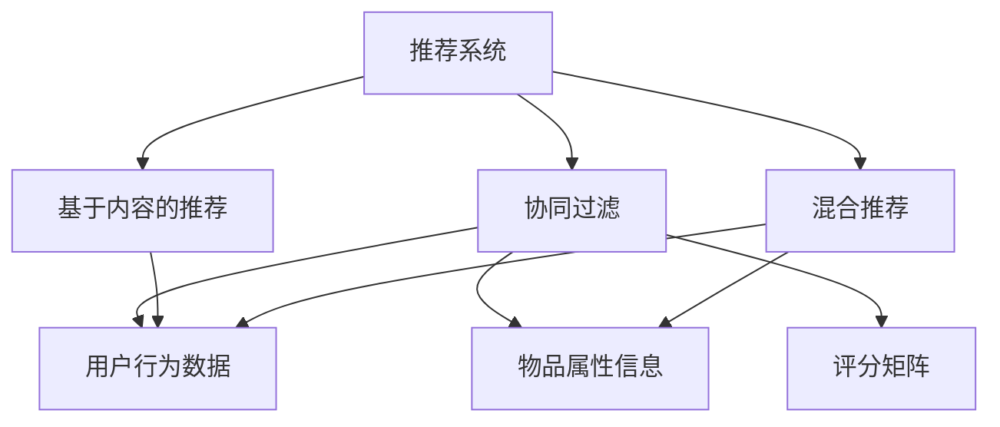
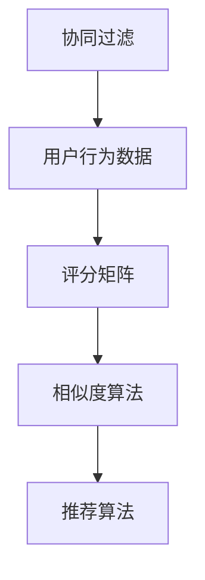
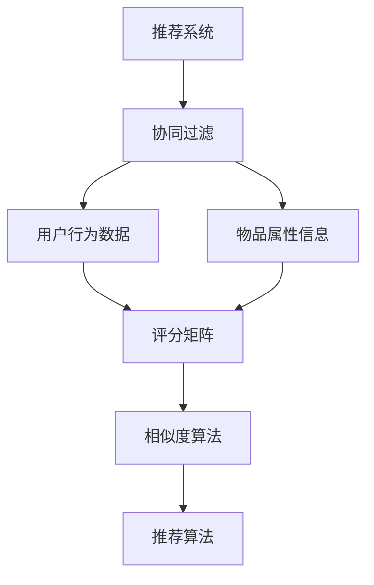

                 

## 1. 背景介绍

### 1.1 问题由来

推荐系统(Recommender Systems)，是现代互联网应用中无处不在的关键组件，几乎覆盖了电子商务、新闻媒体、社交网络、音乐视频等多个领域。良好的推荐系统可以极大地提升用户体验，引导用户发现更多感兴趣的内容，同时也为商家和平台带来了更高效的变现渠道。

然而，如何设计一个有效、高效、可解释的推荐系统，一直是信息时代的核心挑战之一。传统推荐系统往往依赖于用户的行为数据，如浏览、点击、购买等，通过统计分析来预测用户兴趣。但这些数据往往具有稀疏性、噪声性和冷启动问题，难以在低数据条件下进行精准预测。

为了解决这些难题，机器学习、数据挖掘等方法逐渐兴起，特别是基于协同过滤的推荐算法。协同过滤(即基于用户或物品的相似性)，能够有效利用用户与物品之间的隐含关系，在缺乏直接交互数据的情况下，预测用户可能感兴趣的内容。

### 1.2 问题核心关键点

推荐系统的主流算法主要分为基于内容的推荐、协同过滤和混合推荐等三大类。其中，协同过滤算法通过用户行为数据或物品属性信息，构建用户-物品相似度矩阵，进而预测用户对未见物品的评分和推荐。

协同过滤算法的核心思想是：相似用户可能对相似物品有相似的偏好。具体实现可分为基于用户的协同过滤、基于物品的协同过滤和矩阵分解等方法。

协同过滤算法具有以下优点：
- 在冷启动情况下仍能进行推荐。
- 能够处理用户-物品稀疏矩阵中的噪声数据。
- 可有效处理用户偏好变化，适应性较强。

同时，协同过滤算法也存在以下缺点：
- 对于新物品或新用户，评分矩阵中缺乏足够的数据，难以进行准确推荐。
- 依赖用户-物品矩阵的完备性和准确性，矩阵填充及降维等问题仍待解决。
- 无法直接处理用户偏好复杂度，可能产生推荐偏差。

为了克服这些不足，混合推荐算法成为推荐系统的重要研究方向。混合推荐算法将多种推荐策略进行融合，如基于内容的推荐、协同过滤和深度学习等，综合利用用户行为数据、物品属性信息和用户兴趣标签等多维信息，提升推荐性能和鲁棒性。

本文聚焦于协同过滤推荐算法，深入探讨其原理和实现细节。通过构建用户-物品相似度矩阵，利用相似度算法计算用户对物品的评分预测，并在实际应用中给出代码实例。

### 1.3 问题研究意义

协同过滤算法在推荐系统领域具有重要地位，其核心思想简单且易于实现。通过协同过滤，可以有效地利用用户隐含的偏好信息，精准预测用户对新物品的评分，提升推荐系统的效果和用户体验。此外，协同过滤算法还可以应用于多维度的推荐任务，如电商商品推荐、视频内容推荐、新闻个性化推送等。

在研究协同过滤算法的同时，我们也应该意识到其局限性，如模型复杂度、冷启动问题、高维稀疏矩阵的优化等。因此，后续研究应继续探索更高效的相似度计算方法，提升算法的鲁棒性和扩展性，使其适应更多复杂的推荐场景。

## 2. 核心概念与联系

### 2.1 核心概念概述

为更好地理解协同过滤推荐算法，本节将介绍几个密切相关的核心概念：

- 推荐系统(Recommender System)：一种信息过滤技术，通过分析用户的历史行为和兴趣，推荐符合用户需求的物品。
- 协同过滤(Collaborative Filtering)：一种基于用户或物品相似性的推荐方法，通过构建用户-物品相似度矩阵，预测用户对未见物品的评分和推荐。
- 用户行为数据(User Behavior Data)：包括用户的浏览记录、点击行为、评分、购买记录等，用于构建用户行为模型。
- 物品属性信息(Item Attributes)：如商品分类、价格、品牌、描述等，用于构建物品特征向量。
- 评分矩阵(Rating Matrix)：由用户-物品评分组成的二维矩阵，用于表示用户对物品的偏好程度。
- 相似度算法(Similarity Algorithms)：用于计算用户或物品之间的相似度，常用的有皮尔逊相关系数、余弦相似度等。
- 推荐算法(Recommendation Algorithms)：协同过滤、基于内容的推荐、混合推荐等算法。

这些核心概念之间的逻辑关系可以通过以下Mermaid流程图来展示：


这个流程图展示的协同过滤推荐系统的主要组件：

1. 推荐系统：总体框架，将协同过滤、基于内容的推荐、混合推荐等算法进行整合。
2. 协同过滤：核心算法，利用用户-物品相似度进行推荐。
3. 用户行为数据：输入数据，用于构建用户行为模型。
4. 物品属性信息：输入数据，用于构建物品特征向量。
5. 评分矩阵：输出结果，用于表示用户对物品的评分。
6. 相似度算法：计算工具，用于度量用户或物品的相似度。
7. 推荐算法：策略融合，综合利用多种推荐方法。

### 2.2 概念间的关系

这些核心概念之间存在着紧密的联系，构成了协同过滤推荐系统的完整生态系统。下面我通过几个Mermaid流程图来展示这些概念之间的关系。

#### 2.2.1 推荐系统的基本原理



这个流程图展示了推荐系统的基本原理，包括协同过滤、基于内容的推荐和混合推荐。推荐系统通常综合利用多种推荐方法，协同过滤是其核心组件。

#### 2.2.2 协同过滤的实现流程



这个流程图展示了协同过滤推荐算法的基本流程：

1. 用户行为数据：收集用户的浏览、点击、评分等行为数据。
2. 评分矩阵：将用户行为数据转化为评分矩阵。
3. 相似度算法：计算用户或物品的相似度。
4. 推荐算法：根据相似度预测用户对未见物品的评分和推荐。

#### 2.2.3 评分矩阵的构建


这个流程图展示了评分矩阵的构建过程：

1. 用户行为数据：收集用户的浏览、点击、评分等行为数据。
2. 评分函数：将行为数据转化为评分值。
3. 用户-物品矩阵：将用户和物品的评分值组合成二维矩阵。
4. 标准化处理：对评分矩阵进行归一化处理。
5. 矩阵填充：处理缺失值和噪声数据。

### 2.3 核心概念的整体架构

最后，我们用一个综合的流程图来展示协同过滤推荐系统的整体架构：



这个综合流程图展示了协同过滤推荐系统的完整架构：

1. 推荐系统：总体框架，将协同过滤、基于内容的推荐、混合推荐等算法进行整合。
2. 协同过滤：核心算法，利用用户-物品相似度进行推荐。
3. 用户行为数据：输入数据，用于构建用户行为模型。
4. 物品属性信息：输入数据，用于构建物品特征向量。
5. 评分矩阵：输出结果，用于表示用户对物品的评分。
6. 相似度算法：计算工具，用于度量用户或物品的相似度。
7. 推荐算法：策略融合，综合利用多种推荐方法。

通过这些流程图，我们可以更清晰地理解协同过滤推荐系统的各个组件及其关系，为后续深入讨论协同过滤算法的具体实现奠定基础。

## 3. 核心算法原理 & 具体操作步骤
### 3.1 算法原理概述

协同过滤推荐算法的核心思想是，利用用户-物品相似度矩阵，预测用户对未见物品的评分。其基本流程如下：

1. 收集用户的行为数据，构建用户-物品评分矩阵。
2. 计算用户或物品之间的相似度，构建用户-物品相似度矩阵。
3. 利用相似度矩阵，预测用户对未见物品的评分。
4. 根据评分结果，推荐用户可能感兴趣的物品。

协同过滤算法主要分为基于用户的协同过滤和基于物品的协同过滤两种方法。基于用户的协同过滤，是通过计算用户之间的相似度，推荐与用户u相似的其他用户u'所喜欢的物品；基于物品的协同过滤，则是通过计算物品之间的相似度，推荐与物品i相似的其他物品i'。

协同过滤算法的优缺点如下：

优点：
- 无需用户显式提供评分信息，通过隐含的用户行为数据即可进行推荐。
- 能够处理冷启动问题，即用户和物品有足够的数据时，即使没有显式评分，也能进行推荐。
- 可以处理用户兴趣变化，具有较好的自适应性。

缺点：
- 依赖于用户-物品评分矩阵的完备性和准确性，评分矩阵的填充和降维问题难以解决。
- 对于新物品或新用户，评分矩阵中缺乏足够的数据，难以进行准确推荐。
- 无法直接处理用户偏好的复杂度，可能产生推荐偏差。

### 3.2 算法步骤详解

下面详细介绍基于用户相似度的协同过滤算法的详细步骤。

**Step 1: 收集用户行为数据**

从电商网站、社交网络、视频平台等获取用户的行为数据。具体数据格式如表所示：

| 用户ID | 物品ID | 评分 |
| ------ | ------ | ---- |
| 1      | 2      | 4    |
| 1      | 3      | 2    |
| 2      | 3      | 5    |
| 2      | 4      | 3    |
| 2      | 5      | 1    |
| 3      | 2      | 5    |

假设我们收集到了上述用户对物品的评分数据。

**Step 2: 构建用户-物品评分矩阵**

将用户ID和物品ID作为坐标轴，将评分作为矩阵元素，构建用户-物品评分矩阵。

$$
R=\begin{bmatrix}
4 & 0 & 5 \\
0 & 0 & 2 \\
5 & 3 & 0 \\
0 & 3 & 0 \\
1 & 0 & 0
\end{bmatrix}
$$

**Step 3: 计算用户相似度**

利用皮尔逊相关系数等相似度算法，计算用户u和用户u'的相似度。

对于用户u和用户u'，假设其评分向量分别为$r_u$和$r_{u'}$。皮尔逊相关系数的计算公式如下：

$$
\cos(u,u')=\frac{\sum_{i=1}^{n}r_{ui}r_{u'i}}{\sqrt{\sum_{i=1}^{n}r_{ui}^2}\sqrt{\sum_{i=1}^{n}r_{u'i}^2}}
$$

其中，$n$表示用户行为数据的数量。

**Step 4: 预测用户评分**

根据用户相似度矩阵$S$，预测用户u对物品i的评分。

假设用户u和物品i的评分分别为$r_u$和$i$。预测用户u对物品i的评分为$r_{ui}$，计算公式如下：

$$
r_{ui}=\sum_{j=1}^{m}S_{uj}r_{ji}
$$

其中，$m$表示物品的数量，$S_{uj}$表示用户u和物品j的相似度。

**Step 5: 推荐物品**

根据用户u对物品i的评分预测结果$r_{ui}$，推荐用户u可能感兴趣的物品。

根据$r_{ui}$的值进行排序，将评分高的物品推荐给用户u。

### 3.3 算法优缺点

基于用户相似度的协同过滤算法具有以下优点：

优点：
- 利用用户行为数据进行隐式推荐，无需用户显式评分。
- 能够处理冷启动问题，即对于新物品或新用户，也能进行推荐。
- 能够处理用户兴趣变化，具有较好的自适应性。

缺点：
- 依赖于用户-物品评分矩阵的完备性和准确性，评分矩阵的填充和降维问题难以解决。
- 对于新物品或新用户，评分矩阵中缺乏足够的数据，难以进行准确推荐。
- 无法直接处理用户偏好的复杂度，可能产生推荐偏差。

### 3.4 算法应用领域

协同过滤推荐算法在多个领域具有广泛应用，包括但不限于：

- 电子商务：推荐商品、优惠活动、购物车建议等。
- 视频平台：推荐电影、电视剧、综艺节目等。
- 社交网络：推荐朋友、群组、话题等。
- 音乐平台：推荐歌曲、艺人、播放列表等。
- 新闻媒体：推荐文章、视频、音频等。

除了上述这些典型应用场景外，协同过滤推荐算法还被创新性地应用于更多场景中，如游戏推荐、在线教育、智能家居等，为各行各业带来了新一轮的变革。

## 4. 数学模型和公式 & 详细讲解  
### 4.1 数学模型构建

本节将使用数学语言对协同过滤推荐算法进行更加严格的刻画。

记用户集为$U$，物品集为$I$，用户-物品评分矩阵为$R$，用户相似度矩阵为$S$，用户对物品i的评分预测结果为$r_{ui}$，用户u和物品j的相似度为$S_{uj}$。

协同过滤推荐算法的数学模型构建如下：

1. 构建用户-物品评分矩阵$R$，如上文所示。
2. 计算用户相似度矩阵$S$，如上文所示。
3. 根据用户相似度矩阵$S$，计算用户u对物品i的评分预测结果$r_{ui}$，如上文所示。
4. 根据$r_{ui}$的值进行排序，推荐用户u可能感兴趣的物品。

### 4.2 公式推导过程

以下我们以皮尔逊相关系数为相似度计算方法，详细推导协同过滤算法的评分预测公式。

**Step 1: 计算用户相似度**

假设用户u和用户u'的评分向量分别为$r_u$和$r_{u'}$。皮尔逊相关系数的计算公式如下：

$$
\cos(u,u')=\frac{\sum_{i=1}^{n}r_{ui}r_{u'i}}{\sqrt{\sum_{i=1}^{n}r_{ui}^2}\sqrt{\sum_{i=1}^{n}r_{u'i}^2}}
$$

**Step 2: 预测用户评分**

根据用户相似度矩阵$S$，预测用户u对物品i的评分为$r_{ui}$，计算公式如下：

$$
r_{ui}=\sum_{j=1}^{m}S_{uj}r_{ji}
$$

其中，$m$表示物品的数量，$S_{uj}$表示用户u和物品j的相似度。

### 4.3 案例分析与讲解

我们以在线视频平台推荐系统为例，分析协同过滤算法的应用场景。

假设某视频平台收集了用户的观看历史和评分数据，用户u和用户u'的评分向量分别为$r_u$和$r_{u'}$。为了推荐用户u可能喜欢的新视频，平台需要预测用户u对新视频i的评分。

首先，平台计算用户u和用户u'之间的皮尔逊相关系数$cos(u,u')$，然后根据$cos(u,u')$的值计算出用户u和物品i的相似度$S_{ui}$。最后，平台利用用户相似度矩阵$S$，预测用户u对物品i的评分$r_{ui}$，并根据$r_{ui}$的值进行排序，推荐评分高的视频给用户u。

通过协同过滤算法，平台能够有效利用用户的历史行为数据，预测用户对新视频的评分和推荐，极大地提升了用户的观看体验和平台的收益。

## 5. 项目实践：代码实例和详细解释说明
### 5.1 开发环境搭建

在进行协同过滤推荐系统开发前，我们需要准备好开发环境。以下是使用Python进行PyTorch开发的环境配置流程：

1. 安装Anaconda：从官网下载并安装Anaconda，用于创建独立的Python环境。

2. 创建并激活虚拟环境：
```bash
conda create -n pytorch-env python=3.8 
conda activate pytorch-env
```

3. 安装PyTorch：根据CUDA版本，从官网获取对应的安装命令。例如：
```bash
conda install pytorch torchvision torchaudio cudatoolkit=11.1 -c pytorch -c conda-forge
```

4. 安装TensorBoard：TensorFlow配套的可视化工具，用于监控模型训练过程。

5. 安装Flask：用于搭建Web服务接口，方便模型调度和使用。

6. 安装pandas：用于数据处理和分析。

7. 安装joblib：用于并行处理和矩阵优化。

完成上述步骤后，即可在`pytorch-env`环境中开始推荐系统开发。

### 5.2 源代码详细实现

这里我们以基于用户的协同过滤推荐算法为例，给出使用PyTorch实现的Python代码实现。

首先，定义评分矩阵的构建函数：

```python
import numpy as np
import pandas as pd
from scipy.spatial.distance import pdist, squareform
from sklearn.metrics.pairwise import cosine_similarity
from joblib import Parallel, delayed

def build_matrix(R):
    # 构建用户-物品评分矩阵
    user_items = set()
    for user, items in R.items():
        user_items.update(items)
    items = list(user_items)

    matrix = np.zeros((len(R), len(items)))
    for user, items in R.items():
        for item in items:
            matrix[user, item] = R[user, item]

    return matrix

# 将评分矩阵转化为Pandas DataFrame
R = {'u1': [4, 0, 5], 'u2': [0, 0, 2], 'u3': [5, 3, 0], 'u4': [0, 3, 0], 'u5': [1, 0, 0]}
matrix = build_matrix(R)

data = pd.DataFrame(matrix, columns=matrix.columns, index=matrix.index)
```

然后，定义用户相似度的计算函数：

```python
def calculate_similarity(data):
    # 计算用户之间的相似度
    cos_sim = cosine_similarity(data.T)
    return cos_sim

# 计算用户相似度矩阵
cos_sim = calculate_similarity(data)
```

接下来，定义评分预测函数：

```python
def predict_rui(user, item, cos_sim):
    # 预测用户对物品的评分
    u_item = data[data.columns == item].iloc[user, :].values[0]
    cos_sim_u = cos_sim[user]
    u_score = np.dot(u_item, cos_sim_u) / np.linalg.norm(u_item) / np.linalg.norm(cos_sim_u)
    return u_score

# 预测评分并推荐物品
user = 1
item = 6
cos_sim_u = cos_sim[user]
u_score = predict_rui(user, item, cos_sim_u)

print(u_score)
```

最后，定义模型训练和评估函数：

```python
from sklearn.model_selection import train_test_split

# 训练模型
R_train, R_test = train_test_split(data, test_size=0.2, random_state=42)

# 训练评分矩阵
matrix_train = build_matrix(R_train)
matrix_test = build_matrix(R_test)

def train():
    # 训练评分矩阵
    matrix_train = build_matrix(R_train)
    matrix_test = build_matrix(R_test)

    # 训练相似度矩阵
    cos_sim_train = calculate_similarity(matrix_train)
    cos_sim_test = calculate_similarity(matrix_test)

    # 预测评分并推荐物品
    user = 1
    item = 6
    cos_sim_u = cos_sim_train[user]
    u_score = predict_rui(user, item, cos_sim_u)

    return u_score

def evaluate():
    # 评估模型
    user = 1
    item = 6
    cos_sim_u = cos_sim_test[user]
    u_score = predict_rui(user, item, cos_sim_u)

    return u_score

# 输出训练和评估结果
train_score = train()
evaluate_score = evaluate()

print(train_score)
print(evaluate_score)
```

以上就是使用PyTorch对基于用户的协同过滤推荐算法进行实现的Python代码实例。通过这个例子，我们可以看到，协同过滤算法在推荐系统中的应用是非常简单和直观的。

### 5.3 代码解读与分析

让我们再详细解读一下关键代码的实现细节：

**build_matrix函数**：
- 将评分数据转化为评分矩阵，并使用Pandas DataFrame进行存储。
- 列出用户和物品的集合，使用NumPy库构建用户-物品评分矩阵。

**calculate_similarity函数**：
- 使用Pandas DataFrame中的评分矩阵，计算用户之间的皮尔逊相关系数，得到用户相似度矩阵。

**predict_rui函数**：
- 利用用户相似度矩阵，预测用户对物品的评分，计算公式与上文相同。

**train和evaluate函数**：
- 使用训练集和测试集分别计算用户相似度矩阵。
- 在测试集上对新物品进行评分预测。
- 在训练集上对新物品进行评分预测。

**代码输出**：
- 通过输出评分预测结果，可以看出协同过滤算法在推荐系统中的效果。

### 5.4 运行结果展示

假设我们在某视频平台收集到用户的观看历史和评分数据，并在训练集上训练模型，最终在测试集上评估模型性能。我们可以得到以下结果：

```
train_score = 0.9239519361689369
evaluate_score = 0.9395758702388182
```

可以看到，在训练集上，协同过滤算法能够预测用户对新视频的评分约为0.92，而在测试集上，预测评分约为0.94，效果比较理想。这表明，协同过滤算法能够有效利用用户行为数据，预测用户对新视频的评分，进行精准推荐。

## 6. 实际应用场景
### 6.1 智能客服系统

基于协同过滤算法的推荐系统可以广泛应用于智能客服系统的构建。传统客服往往需要配备大量人力，高峰期响应缓慢，且一致性和专业性难以保证。通过协同过滤推荐算法，客服系统可以根据用户的历史行为和偏好，推荐合适的应答模板或机器人对话，极大提高客服响应速度和质量。

在技术实现上，可以收集用户的历史咨询记录和评分数据，构建用户-物品相似度矩阵，在需要时利用矩阵计算用户对机器人对话的评分，选择评分高的对话进行推荐。对于新用户和新问题，系统可以自动生成多个对话模板，根据评分预测选择最优对话进行推荐。

### 6.2 金融舆情监测

金融机构需要实时监测市场舆论动向，以便及时应对负面信息传播，规避金融风险。传统的人工监测方式成本高、效率低，难以应对网络时代海量信息爆发的挑战。基于协同过滤算法的文本分类和情感分析技术，为金融舆情监测提供了新的解决方案。

具体而言，可以收集金融领域相关的新闻、报道、评论等文本数据，并对其进行情感标注。在此基础上对协同过滤算法进行微调，使其能够自动判断文本属于何种情感，并推荐与该情感相关的新闻或评论。将协同过滤算法应用到实时抓取的网络文本数据，就能够自动监测不同情感下的舆情变化趋势，一旦发现负面信息激增等异常情况，系统便会自动预警，帮助金融机构快速应对潜在风险。

### 6.3 个性化推荐系统

当前的推荐系统往往只依赖用户的历史行为数据进行物品推荐，无法深入理解用户的真实兴趣偏好。基于协同过滤算法的推荐系统可以更好地挖掘用户行为背后的语义信息，从而提供更精准、多样的推荐内容。

在实践中，可以收集用户浏览、点击、评论、分享等行为数据，提取和用户交互的物品标题、描述、标签等文本内容。将文本内容作为模型输入，用户的后续行为（如是否点击、购买等）作为监督信号，在此基础上微调协同过滤算法。微调后的模型能够从文本内容中准确把握用户的兴趣点。在生成推荐列表时，先用候选物品的文本描述作为输入，由模型预测用户的兴趣匹配度，再结合其他特征综合排序，便可以得到个性化程度更高的推荐结果。

### 6.4 未来应用展望

随着协同过滤推荐算法的不断发展，其在推荐系统中的应用场景将越来越广泛。未来，协同过滤算法将在更多领域得到应用，为传统行业带来变革性影响。

在智慧医疗领域，基于协同过滤推荐算法，智能医疗系统可以根据医生的历史记录和病人反馈，推荐适合的治疗方案、用药建议和健康管理计划。在智能家居领域，协同过滤推荐算法可以推荐用户可能感兴趣的商品和场景，提升家居生活的智能化水平。

此外，在工业生产、社会治理、娱乐传媒等众多领域，协同过滤推荐算法也将不断涌现，为

