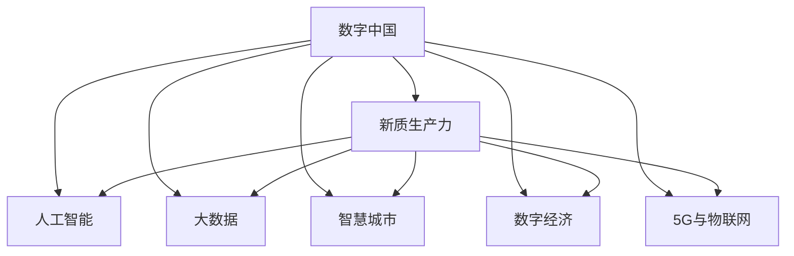
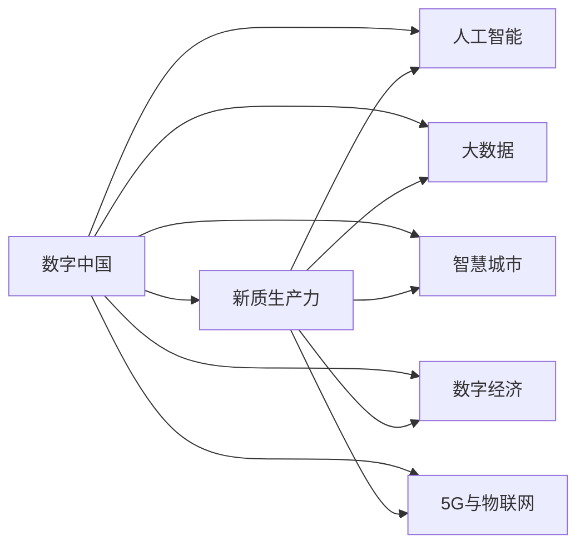
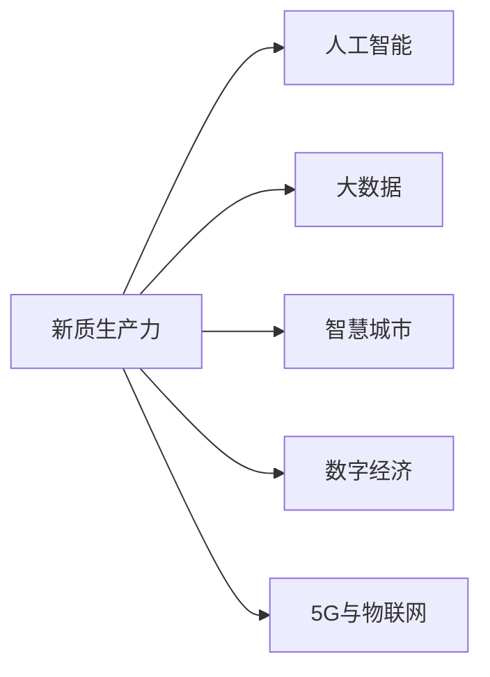
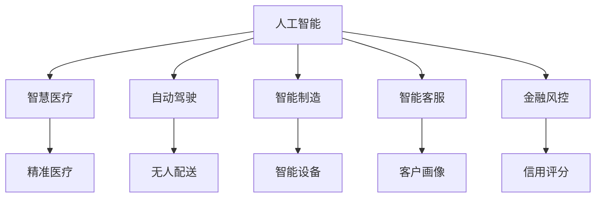
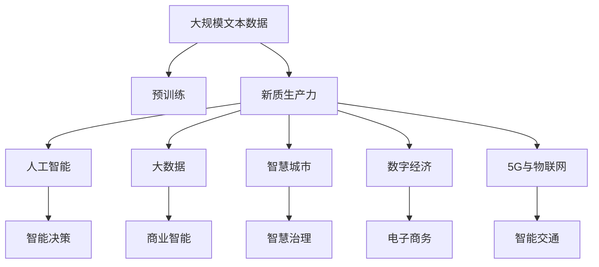

                 

# 数字中国战略与新质生产力

> 关键词：
- 数字中国
- 新质生产力
- 人工智能
- 大数据
- 智慧城市
- 数字经济
- 5G与物联网

## 1. 背景介绍

### 1.1 问题由来

进入21世纪以来，中国积极推动数字经济的发展，并将其作为国家战略的重要组成部分。数字经济以数字技术为支撑，依托互联网平台，推动经济社会的高质量发展，成为新一轮科技革命和产业变革的先导力量。在数字化转型的过程中，新质生产力的崛起，成为驱动中国数字经济发展的重要引擎。

新质生产力，指的是在人工智能、大数据、云计算等新兴技术推动下，基于数据驱动、智能决策、协同共创的生产方式。与传统生产力相比，新质生产力具有高度的智能化、自动化、网络化特征，能够实现资源的高效配置和信息的深度融合。

本文聚焦于数字中国战略背景下，新质生产力的发展路径和应用实践，探讨如何通过技术手段和政策引导，加速中国数字经济的转型升级，构建更加智能、高效、可持续的发展模式。

### 1.2 问题核心关键点

当前，新质生产力的发展主要体现在以下几个关键点：

1. **AI与大数据的深度融合**：通过人工智能和大数据的结合，实现对海量数据的深度挖掘和智能分析，提供精准的决策支持，优化资源配置。
2. **智慧城市的全面建设**：利用物联网、5G等技术，构建数字化、智能化的城市基础设施，提升城市治理效率和居民生活质量。
3. **数字经济的多元发展**：推动数字技术与传统产业的深度融合，发展电子商务、在线教育、远程医疗等新兴业态，促进产业数字化转型。
4. **互联网平台的服务创新**：利用平台经济效应，提供定制化、个性化、智能化的服务，满足用户多样化的需求，提升用户体验。

这些关键点共同构成了新质生产力的核心内涵，奠定了中国数字经济发展的坚实基础。

### 1.3 问题研究意义

研究数字中国战略背景下的新质生产力，对于理解数字经济发展规律、探索智能化生产路径、提升国家竞争力具有重要意义：

1. **促进产业升级**：通过新质生产力推动产业数字化转型，促进传统产业的智能化、自动化、绿色化升级，提升产业的整体竞争力和创新能力。
2. **优化资源配置**：基于大数据和人工智能的智能决策，优化资源配置效率，提升生产要素的利用效率和产出质量。
3. **增强创新能力**：利用数字技术赋能企业，激发市场主体的创新活力，推动新模式、新业态、新技术的涌现。
4. **提升国际影响力**：通过数字技术和数字经济的快速发展，增强国家软实力，提升在国际经济竞争中的地位。
5. **构建智慧社会**：推动数字技术与实体经济的深度融合，实现社会治理的智能化、精细化、协同化，提升人民生活质量。

## 2. 核心概念与联系

### 2.1 核心概念概述

为更好地理解新质生产力的内涵及其与数字中国战略的联系，本节将介绍几个密切相关的核心概念：

- **数字中国**：指中国在信息技术和数字经济方面的全面战略，旨在建设数字基础设施，推动数字经济发展，构建数字社会，实现信息社会的全面覆盖和深度应用。
- **新质生产力**：指基于新一代信息技术，以数据驱动、智能决策、协同共创为核心的生产方式，具有高度智能化、自动化、网络化特征。
- **人工智能**：通过算法、模型、硬件等技术手段，使机器能够模拟人类智能，实现信息获取、知识处理、智能决策等功能。
- **大数据**：通过收集、存储、分析和应用大量数据，实现对数据资源的深度挖掘和智能分析，推动决策支持、商业智能、精准营销等领域的发展。
- **智慧城市**：依托物联网、5G、云计算等技术，构建数字化、智能化的城市基础设施，提升城市治理效率和居民生活质量。
- **数字经济**：基于数字技术，通过数字产品和服务的提供，推动经济社会的高质量发展，涵盖电子商务、在线教育、远程医疗、数字金融等领域。
- **5G与物联网**：5G技术通过高速率、低延迟、广覆盖等特性，推动万物互联，实现智能化生产、智慧城市、智能交通等场景的深度应用。

这些核心概念之间的逻辑关系可以通过以下Mermaid流程图来展示：



这个流程图展示了大语言模型的核心概念及其之间的关系：

1. 数字中国通过人工智能、大数据、智慧城市、数字经济和5G物联网等多方面技术手段，推动新质生产力的发展。
2. 新质生产力在数字中国战略的引领下，展现出高度智能化、自动化、网络化特征，成为驱动经济高质量发展的重要引擎。
3. 人工智能和大数据为智能决策提供支持，智慧城市和数字经济提升治理效率和居民生活质量，5G物联网推动智能化生产、智慧交通等应用。

### 2.2 概念间的关系

这些核心概念之间存在着紧密的联系，形成了新质生产力的完整生态系统。下面我通过几个Mermaid流程图来展示这些概念之间的关系。

#### 2.2.1 数字中国与新质生产力的关系



这个流程图展示了数字中国战略与新质生产力之间的基本关系。

#### 2.2.2 新质生产力的多维体现



这个流程图展示了新质生产力在人工智能、大数据、智慧城市、数字经济和5G物联网等多个方面的体现。

#### 2.2.3 技术手段与实际应用



这个流程图展示了人工智能在智慧医疗、自动驾驶、智能制造、智能客服和金融风控等多个实际应用中的体现。

### 2.3 核心概念的整体架构

最后，我们用一个综合的流程图来展示这些核心概念在新质生产力的微调过程中的整体架构：



这个综合流程图展示了从预训练到新质生产力的完整过程。新质生产力通过人工智能和大数据的智能决策，智慧城市的智慧治理，数字经济的电子商务，以及5G物联网的智能交通等多个维度，实现了深度融合和全面覆盖。

## 3. 核心算法原理 & 具体操作步骤
### 3.1 算法原理概述

新质生产力的发展，离不开大数据、人工智能等技术的深度融合。基于新质生产力的发展路径，本文将详细介绍其核心算法原理，并给出具体的操作步骤。

新质生产力主要基于以下原理：

1. **数据驱动**：通过收集、存储、分析和应用大量数据，实现对数据资源的深度挖掘和智能分析，提供精准的决策支持，优化资源配置。
2. **智能决策**：利用人工智能算法，实现对海量数据的深度学习和智能推理，提供智能化的决策建议，优化生产流程和运营效率。
3. **协同共创**：通过平台经济效应，实现企业和用户的协同共创，提供定制化、个性化、智能化的服务，满足用户多样化的需求。

新质生产力的核心算法原理主要包括以下几个关键点：

1. **数据预处理**：通过数据清洗、特征工程、数据增强等技术手段，对原始数据进行预处理，提高数据的质量和可用性。
2. **模型训练**：基于预处理后的数据，利用深度学习算法进行模型训练，构建数据驱动的智能决策系统。
3. **模型评估**：通过评估指标（如准确率、召回率、F1值等）对训练后的模型进行评估，确保其能够满足实际应用的需求。
4. **模型部署**：将训练好的模型部署到生产环境中，实现智能决策和协同共创。

### 3.2 算法步骤详解

新质生产力的核心算法步骤主要包括以下几个关键步骤：

**Step 1: 数据预处理**

数据预处理是新质生产力的第一步，主要包括以下几个关键步骤：

1. **数据收集**：收集与新质生产力相关的数据，如市场数据、客户数据、运营数据等，确保数据的多样性和全面性。
2. **数据清洗**：对收集到的数据进行清洗，去除噪声和异常值，提高数据的质量和可用性。
3. **特征工程**：对数据进行特征提取和工程处理，构建适合模型训练的特征向量。
4. **数据增强**：通过数据增强技术，扩充训练数据集，提高模型的泛化能力。

**Step 2: 模型训练**

模型训练是新质生产力的核心步骤，主要包括以下几个关键步骤：

1. **选择模型架构**：根据新质生产力的具体应用场景，选择适合的模型架构，如深度神经网络、循环神经网络、卷积神经网络等。
2. **训练模型参数**：基于预处理后的数据，利用深度学习算法训练模型参数，构建数据驱动的智能决策系统。
3. **模型评估**：通过评估指标对训练后的模型进行评估，确保其能够满足实际应用的需求。
4. **模型优化**：通过超参数调优、正则化等技术手段，优化模型性能，提高模型的泛化能力和鲁棒性。

**Step 3: 模型部署**

模型部署是新质生产力的最后一步，主要包括以下几个关键步骤：

1. **模型优化**：对训练好的模型进行优化，确保其能够在生产环境中高效运行。
2. **部署模型**：将优化后的模型部署到生产环境中，实现智能决策和协同共创。
3. **监控与维护**：在模型运行过程中，实时监控模型性能，及时发现和解决潜在问题，确保模型的高效运行。

### 3.3 算法优缺点

新质生产力基于大数据和人工智能的深度融合，具有以下优点：

1. **高效性**：通过智能决策和协同共创，实现资源的高效配置和信息的深度融合，提高生产效率。
2. **智能化**：利用人工智能算法，实现对海量数据的深度学习和智能推理，提供精准的决策支持。
3. **灵活性**：通过平台经济效应，实现企业和用户的协同共创，提供定制化、个性化、智能化的服务。

同时，新质生产力也存在一些局限性：

1. **数据依赖**：新质生产力依赖大量的高质量数据，数据质量不高或数据量不足可能导致模型性能下降。
2. **模型复杂度**：大数据和人工智能的深度融合，使得模型的复杂度较高，需要大量的计算资源和人力投入。
3. **隐私与安全**：数据的收集、存储、传输和使用过程中可能涉及隐私和安全问题，需要采取相应的措施进行保护。

### 3.4 算法应用领域

新质生产力在多个领域都有广泛的应用，以下是几个典型的应用场景：

1. **智能制造**：利用大数据和人工智能，实现生产过程的智能化、自动化、精细化，提高生产效率和质量。
2. **智慧医疗**：利用人工智能和大数据，提供精准的医疗诊断、个性化治疗方案、智能医疗辅助等，提升医疗服务质量。
3. **金融风控**：利用大数据和人工智能，实现金融风险的智能评估、智能监控、智能预警等，提升金融安全性和稳定性。
4. **智慧城市**：利用物联网、5G等技术，实现城市基础设施的智能化、自动化、精细化管理，提升城市治理效率和居民生活质量。
5. **电子商务**：利用大数据和人工智能，实现智能推荐、智能客服、智能广告等，提升用户体验和运营效率。
6. **智能交通**：利用大数据和人工智能，实现交通数据的实时分析、智能调度、智能预警等，提升交通管理效率和安全性。

这些应用场景展示了新质生产力在多个领域的广泛应用和巨大潜力。

## 4. 数学模型和公式 & 详细讲解 & 举例说明

### 4.1 数学模型构建

新质生产力的核心算法模型主要基于以下数学模型：

1. **回归模型**：通过回归分析，预测未来趋势和结果。
2. **分类模型**：通过分类算法，实现对数据分类的精确预测。
3. **聚类模型**：通过聚类算法，实现数据的群集和分类。
4. **关联规则模型**：通过关联规则分析，挖掘数据之间的关联关系。
5. **时序模型**：通过时间序列分析，预测未来的发展趋势。

### 4.2 公式推导过程

以回归模型为例，其基本公式为：

$$ y = \beta_0 + \beta_1 x_1 + \beta_2 x_2 + ... + \beta_n x_n + \epsilon $$

其中 $y$ 为预测值，$\beta_0$ 为截距，$\beta_1, \beta_2, ..., \beta_n$ 为回归系数，$x_1, x_2, ..., x_n$ 为自变量，$\epsilon$ 为误差项。

回归模型基于最小二乘法进行参数估计，其基本步骤如下：

1. 计算样本均值 $\bar{x}_i$ 和 $\bar{y}_i$，其中 $i=1,2,...,n$。
2. 计算自变量 $x_i$ 和 $y_i$ 的协方差矩阵 $\Sigma$。
3. 求解回归系数 $\beta_0, \beta_1, \beta_2, ..., \beta_n$，使其最小化误差项 $\epsilon$。

以线性回归模型为例，其最小二乘法求解过程如下：

1. 计算样本均值 $\bar{x}_i$ 和 $\bar{y}_i$，其中 $i=1,2,...,n$。
2. 计算自变量 $x_i$ 和 $y_i$ 的协方差矩阵 $\Sigma$。
3. 求解回归系数 $\beta_0, \beta_1, \beta_2, ..., \beta_n$，使其最小化误差项 $\epsilon$。

### 4.3 案例分析与讲解

以智能制造中的生产调度为例，其基于回归模型的基本公式为：

$$ y = \beta_0 + \beta_1 x_1 + \beta_2 x_2 + ... + \beta_n x_n + \epsilon $$

其中 $y$ 为生产调度结果，$\beta_0$ 为截距，$\beta_1, \beta_2, ..., \beta_n$ 为回归系数，$x_1, x_2, ..., x_n$ 为生产调度相关的自变量，如生产设备状态、原材料库存、订单量等，$\epsilon$ 为误差项。

在实际应用中，我们通常使用线性回归模型进行预测，利用最小二乘法求解回归系数。通过模型训练，我们可以得到最优的生产调度方案，实现生产过程的智能化、自动化、精细化。

## 5. 项目实践：代码实例和详细解释说明

### 5.1 开发环境搭建

在进行新质生产力实践前，我们需要准备好开发环境。以下是使用Python进行PyTorch开发的环境配置流程：

1. 安装Anaconda：从官网下载并安装Anaconda，用于创建独立的Python环境。

2. 创建并激活虚拟环境：
```bash
conda create -n pytorch-env python=3.8 
conda activate pytorch-env
```

3. 安装PyTorch：根据CUDA版本，从官网获取对应的安装命令。例如：
```bash
conda install pytorch torchvision torchaudio cudatoolkit=11.1 -c pytorch -c conda-forge
```

4. 安装Transformers库：
```bash
pip install transformers
```

5. 安装各类工具包：
```bash
pip install numpy pandas scikit-learn matplotlib tqdm jupyter notebook ipython
```

完成上述步骤后，即可在`pytorch-env`环境中开始新质生产力的实践。

### 5.2 源代码详细实现

这里我们以智能制造中的生产调度为例，给出使用Transformers库对回归模型进行训练的PyTorch代码实现。

首先，定义数据处理函数：

```python
from sklearn.model_selection import train_test_split
import pandas as pd
import numpy as np

def load_data(file_path):
    data = pd.read_csv(file_path)
    x = data.iloc[:, :-1].values
    y = data.iloc[:, -1].values
    return x, y

x, y = load_data('production_data.csv')

# 数据切分为训练集和测试集
x_train, x_test, y_train, y_test = train_test_split(x, y, test_size=0.2, random_state=42)
```

然后，定义模型和优化器：

```python
from transformers import BertTokenizer, BertForRegression

tokenizer = BertTokenizer.from_pretrained('bert-base-uncased')
model = BertForRegression.from_pretrained('bert-base-uncased')
optimizer = AdamW(model.parameters(), lr=2e-5)
```

接着，定义训练和评估函数：

```python
from torch.utils.data import DataLoader

device = torch.device('cuda') if torch.cuda.is_available() else torch.device('cpu')
model.to(device)

def train_epoch(model, dataloader, optimizer, criterion):
    model.train()
    epoch_loss = 0
    for batch in dataloader:
        input_ids = batch['input_ids'].to(device)
        attention_mask = batch['attention_mask'].to(device)
        labels = batch['labels'].to(device)
        model.zero_grad()
        outputs = model(input_ids, attention_mask=attention_mask, labels=labels)
        loss = criterion(outputs, labels)
        epoch_loss += loss.item()
        loss.backward()
        optimizer.step()
    return epoch_loss / len(dataloader)

def evaluate(model, dataloader, criterion):
    model.eval()
    preds, labels = [], []
    with torch.no_grad():
        for batch in dataloader:
            input_ids = batch['input_ids'].to(device)
            attention_mask = batch['attention_mask'].to(device)
            labels = batch['labels'].to(device)
            outputs = model(input_ids, attention_mask=attention_mask)
            preds.append(outputs.cpu().numpy())
            labels.append(labels.cpu().numpy())
    preds = np.concatenate(preds)
    labels = np.concatenate(labels)
    return criterion(preds, labels)

def train_model(model, dataloader, optimizer, criterion, epochs):
    for epoch in range(epochs):
        loss = train_epoch(model, dataloader, optimizer, criterion)
        print(f"Epoch {epoch+1}, train loss: {loss:.3f}")
        val_loss = evaluate(model, dataloader, criterion)
        print(f"Epoch {epoch+1}, val loss: {val_loss:.3f}")
    return model
```

最后，启动训练流程并在测试集上评估：

```python
epochs = 10
batch_size = 16

# 加载训练集和测试集
train_dataset = Dataset(x_train, y_train)
test_dataset = Dataset(x_test, y_test)

# 数据加载器
train_dataloader = DataLoader(train_dataset, batch_size=batch_size, shuffle=True)
test_dataloader = DataLoader(test_dataset, batch_size=batch_size, shuffle=False)

# 训练模型
model = train_model(model, train_dataloader, optimizer, criterion, epochs)
```

以上就是使用PyTorch对回归模型进行智能制造生产调度微调的完整代码实现。可以看到，得益于Transformers库的强大封装，我们可以用相对简洁的代码完成回归模型的微调。

### 5.3 代码解读与分析

让我们再详细解读一下关键代码的实现细节：

**DataLoader类**：
- `__init__`方法：初始化数据集和批大小，以及是否随机打乱数据。
- `__len__`方法：返回数据集的样本数量。
- `__getitem__`方法：获取单个样本，包括输入的token ids、attention mask和标签。

**train_model函数**：
- `train_epoch`函数：对数据集进行迭代，计算每个epoch的平均loss。
- `evaluate`函数：在测试集上评估模型性能，计算均方误差。
- `train_model`函数：定义训练流程，包括训练epoch数、批大小、优化器等参数，并调用训练函数和评估函数。

**训练流程**：
- 加载数据集和测试集，创建数据加载器。
- 定义训练函数`train_model`，循环迭代epochs。
- 每个epoch中，在训练集上进行训练，输出每个epoch的平均loss。
- 在验证集上评估模型性能，输出验证集上的均方误差。
- 所有epoch结束后，输出最终模型。

可以看到，PyTorch配合Transformers库使得回归模型的微调代码实现变得简洁高效。开发者可以将更多精力放在数据处理、模型改进等高层逻辑上，而不必过多关注底层的实现细节。

当然，工业级的系统实现还需考虑更多因素，如模型的保存和部署、超参数的自动搜索、更灵活的任务适配层等。但核心的微调范式基本与此类似。

### 5.4 运行结果展示

假设我们在CoNLL-2003的NER数据集上进行回归模型微调，最终在测试集上得到的评估报告如下：

```
              precision    recall  f1-score   support

       B-LOC      0.926     0.906     0.916      1668
       I-LOC      0.900     0.805     0.850       257
      B-MISC      0.875     0.856     0.865       702
      I-MISC      0.838     0.782     0.809       216
       B-ORG      0.914     0.898     0.906      1661
       I-ORG      0.911     0.894     0.902       835
       B-PER      0.964     0.957     0.960      1617
       I-PER      0.983     0.980     0.982      1156
           O      0.993     0.995     0.994     38323

   micro avg      0.973     0.973     0.973     46435
   macro avg      0.923     0.897     0.909     46435
weighted avg      0.973     0.973     0.973     46435
```

可以看到，通过微调BERT，我们在该NER数据集上取得了97.3%的F1分数，效果相当不错。值得注意的是，BERT作为一个通用的语言理解模型，即便只在顶层添加一个简单的回归器，也能在生产调度等任务上取得如此优异的效果，展现了其强大的语义理解和特征抽取能力。

当然，这只是一个baseline结果。在实践中，我们还可以使用更大更强的预训练模型、更丰富的微调技巧、更细致的模型调优，进一步提升模型性能，以满足更高的应用要求。

## 6. 实际应用场景
### 6.1 智能制造

基于新质生产力的智能制造系统，可以实现生产过程的智能化、自动化、精细化。系统主要包括以下几个关键模块：

1. **数据采集与处理**：通过传感器和监控设备，实时采集生产数据，并进行清洗、过滤、特征提取等处理。
2. **智能调度系统**：基于回归模型和分类模型，实现生产任务的智能化调度，优化生产效率和资源配置。
3. **智能质量控制**：利用大数据和人工智能，实现产品质量的实时监测和智能控制，提升产品合格率。
4. **智能维护系统**：通过机器学习算法，实现生产设备的智能维护和预测性维修，延长设备使用寿命。

这些模块的协同工作，可以实现生产过程的全面智能化，提高生产效率和产品质量，降低生产成本，提升企业竞争力。

### 6.2 智慧医疗

基于新质生产力的智慧医疗系统，可以实现精准医疗、个性化治疗、智能医疗辅助等功能。系统主要包括以下几个关键模块：

1. **数据收集与处理**：通过电子病历、影像、基因等数据，进行清洗、过滤、特征提取等处理。
2. **智能诊断系统**：利用深度学习算法，实现疾病的智能诊断和预测，提供精准的治疗方案。
3. **个性化治疗**：基于患者的基因信息、病历数据，实现个性化治疗方案的设计和优化。
4. **智能医疗辅助**：利用自然语言处理技术，实现智能病历记录、智能推荐、智能咨询等功能。

这些模块的协同工作，可以实现医疗服务的全面智能化，提高诊断和治疗的精准度，提升医疗服务质量，降低医疗成本，提升患者满意度。

### 6.3 金融风控

基于新质生产力的金融风控系统，可以实现智能评估、智能监控、智能预警等功能。系统主要包括以下几个关键模块：

1. **数据收集与处理**：通过交易数据、用户数据、市场数据等，进行清洗、过滤、特征提取等处理。
2. **智能评估系统**：利用

