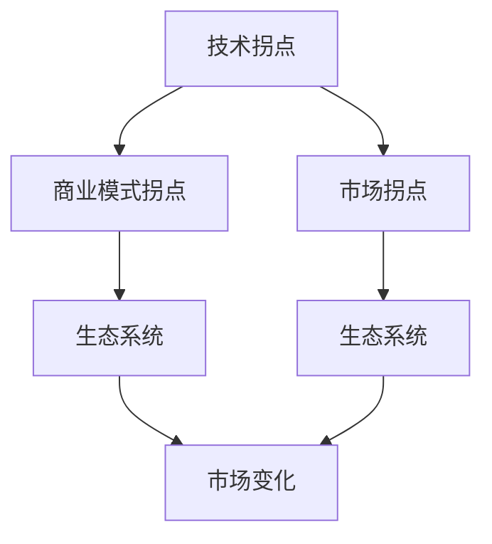
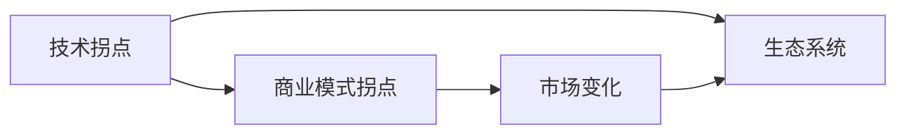

                 

## 1. 背景介绍

在软件开发和IT行业中，我们常常会遇到“拐点”，即技术进步或商业模式的重大转折点。这些拐点往往决定了一个公司或产品的未来高度。例如，Google的AlphaGo的胜利，标志着人工智能进入了新的发展阶段；而Apple的iPhone X的推出，则开启了智能手机发展的新纪元。本文旨在探讨技术拐点的重要性，以及如何把握这些拐点，获取成功。

### 1.1 拐点的定义与重要性

拐点是指技术或商业模式的重大转折点，它可以改变一个行业的发展方向，甚至重新定义市场规则。拐点通常伴随着显著的技术突破、商业模式创新或市场需求的快速变化。例如，云计算、区块链、大数据等技术的发展，均代表了计算技术历史上的重要拐点。

拐点之所以重要，在于它能够带来以下几个方面的影响：
1. **市场竞争格局**：技术拐点往往会导致市场竞争格局的重塑。例如，Android系统的推出，打破了诺基亚和苹果在智能手机市场的双雄格局，开启了开源软件与闭源系统的竞争。
2. **商业模式创新**：技术拐点常常带来商业模式的创新。例如，物联网的发展，使传统制造业和消费电子行业进入新的发展阶段。
3. **用户需求变化**：技术拐点能够反映用户需求的变化。例如，人工智能技术的发展，使得语音助手、智能推荐等应用成为可能。

### 1.2 拐点的特征

一个典型的技术拐点通常具备以下特征：
1. **技术突破**：新技术的出现或现有技术的重大改进，能够显著提升应用效率或降低成本。例如，5G技术的应用，大幅提升了移动通信的传输速率和可靠性。
2. **应用拓展**：新技术的广泛应用，能够开辟新的市场领域。例如，大数据技术的应用，使得企业能够更好地进行数据驱动决策。
3. **市场接受**：新技术或新模式能够得到市场的广泛接受和应用。例如，云计算技术的普及，使得企业能够实现更灵活的资源管理和成本控制。
4. **生态系统形成**：新技术或新模式能够带动生态系统的形成，吸引更多合作伙伴和用户。例如，物联网技术的普及，使得传感器、智能家居等产品成为可能。

## 2. 核心概念与联系

### 2.1 核心概念概述

为了更好地理解拐点的影响和把握方法，本节将介绍几个密切相关的核心概念：

- **技术拐点**：指在技术发展中具有重大转折意义的事件或突破。例如，计算机的普及、互联网的兴起、人工智能的突破等。
- **商业模式拐点**：指商业模式的重大创新，能够改变市场竞争规则的事件。例如，电商平台的兴起、共享经济的普及等。
- **市场拐点**：指市场需求的快速变化，能够导致市场格局重塑的事件。例如，移动设备的普及、智能家居的兴起等。
- **技术生态系统**：指围绕一项新技术或新模式形成的生态系统，包括硬件、软件、服务等多个环节。例如，物联网、区块链等技术生态系统。

这些核心概念之间存在着紧密的联系，形成了对拐点认识和把握的整体框架。下面通过一个Mermaid流程图来展示这些概念之间的关系：



这个流程图展示了技术拐点、商业模式拐点和市场拐点之间的关系：

1. 技术拐点通常会引发商业模式和市场需求的重大变化。
2. 技术拐点和商业模式拐点共同推动了生态系统的形成和发展。
3. 市场拐点则是对技术拐点和商业模式拐点的直接反应。

### 2.2 概念间的关系

这些核心概念之间存在着紧密的联系，形成了对拐点认识和把握的整体框架。下面通过一个Mermaid流程图来展示这些概念之间的关系：



这个流程图展示了技术拐点、商业模式拐点和市场拐点之间的关系：

1. 技术拐点通常会引发商业模式和市场需求的重大变化。
2. 技术拐点和商业模式拐点共同推动了生态系统的形成和发展。
3. 市场拐点则是对技术拐点和商业模式拐点的直接反应。

## 3. 核心算法原理 & 具体操作步骤
### 3.1 算法原理概述

拐点的把握通常涉及两个关键环节：技术评估和市场定位。以下是这两个环节的算法原理和具体操作步骤：

#### 3.1.1 技术评估

技术评估是把握拐点的重要步骤，主要包括以下几个方面：
1. **技术成熟度**：评估技术的成熟度和可靠性。例如，人工智能技术的发展，需要考虑算法的准确性、数据量的大小等。
2. **技术趋势**：分析技术发展的趋势和方向。例如，大数据技术的发展趋势，需要考虑数据来源、处理能力等因素。
3. **技术壁垒**：评估技术的壁垒和竞争优势。例如，区块链技术的优势在于其去中心化和安全性，但也面临高昂的成本和技术门槛。

#### 3.1.2 市场定位

市场定位是把握拐点的另一个重要步骤，主要包括以下几个方面：
1. **市场需求**：评估市场需求和用户痛点。例如，智能手机市场的快速增长，源于用户对移动设备便携性和功能的迫切需求。
2. **竞争格局**：分析市场竞争格局和竞争对手策略。例如，云计算市场的竞争，需要考虑AWS、阿里云、腾讯云等主要厂商的战略布局。
3. **商业模式**：设计适合的商业模式。例如，物联网技术的商业化，可以采用平台模式、解决方案模式等。

### 3.2 算法步骤详解

拐点的把握涉及多个步骤，下面详细介绍这些步骤的具体操作：

#### 3.2.1 技术评估步骤

1. **技术调研**：收集和分析现有技术文献、专利、白皮书等资料，了解技术的基本情况和进展。
2. **技术验证**：通过实验、原型等方式，验证技术的可行性。例如，通过小规模实验，验证人工智能算法的准确性和效率。
3. **技术评估**：综合考虑技术成熟度、技术趋势和技术壁垒等因素，评估技术的潜力。

#### 3.2.2 市场定位步骤

1. **市场需求调研**：通过问卷调查、访谈等方式，了解市场需求和用户痛点。例如，通过问卷调查，了解用户对智能家居设备的需求。
2. **竞争格局分析**：分析主要竞争对手的产品和市场策略。例如，分析谷歌、亚马逊等厂商在智能助手领域的布局。
3. **商业模式设计**：设计适合的商业模式，明确盈利模式和价值链。例如，设计物联网设备的订阅服务模式。

#### 3.2.3 综合决策

综合技术评估和市场定位的结果，进行综合决策，决定是否抓住拐点。例如，综合人工智能技术的成熟度和市场需求，决定是否进入智能语音助手市场。

### 3.3 算法优缺点

技术拐点把握的优势在于：
1. **提前布局**：通过提前把握技术拐点，能够获得先发优势，减少市场竞争压力。
2. **快速响应**：能够快速响应市场变化，抓住机遇，实现快速增长。

技术拐点把握的劣势在于：
1. **高风险**：技术发展具有不确定性，把握错误可能导致重大损失。
2. **资源投入**：需要大量资源进行技术评估和市场调研，投入成本较高。

### 3.4 算法应用领域

技术拐点把握的方法在多个领域都有广泛的应用：

- **互联网企业**：例如，谷歌、百度等公司通过把握人工智能、云计算等技术拐点，实现了快速增长和市场份额提升。
- **传统制造业**：例如，汽车企业通过把握智能制造、工业互联网等技术拐点，实现了生产效率的提升和成本的降低。
- **医疗健康**：例如，医疗企业通过把握远程医疗、人工智能诊断等技术拐点，实现了诊疗效率的提升和医疗质量的改善。

## 4. 数学模型和公式 & 详细讲解 & 举例说明

### 4.1 数学模型构建

为了更好地理解拐点的影响和把握方法，本节将使用数学语言对拐点的影响和把握进行更加严格的刻画。

假设市场需求为 $D$，技术成熟度为 $T$，技术壁垒为 $W$，市场定位为 $P$。则拐点的出现可以表示为：

$$
C = f(D, T, W, P)
$$

其中 $C$ 为拐点的出现，$f$ 为拐点出现的函数。

拐点出现的条件可以表示为：

$$
\frac{\partial f}{\partial D} > 0, \quad \frac{\partial f}{\partial T} > 0, \quad \frac{\partial f}{\partial W} > 0, \quad \frac{\partial f}{\partial P} > 0
$$

即市场需求、技术成熟度、技术壁垒和市场定位的增加都会促进拐点的出现。

### 4.2 公式推导过程

以下我们以人工智能技术的拐点出现为例，推导其公式及其梯度计算：

假设市场需求为 $D$，技术成熟度为 $T$，技术壁垒为 $W$，市场定位为 $P$。拐点的出现可以表示为：

$$
C = D^a T^b W^c P^d
$$

其中 $a, b, c, d$ 为常数，反映了各个因素对拐点出现的影响程度。

对上式求偏导数，得：

$$
\frac{\partial C}{\partial D} = a D^{a-1} T^b W^c P^d, \quad \frac{\partial C}{\partial T} = b D^a T^{b-1} W^c P^d, \quad \frac{\partial C}{\partial W} = c D^a T^b W^{c-1} P^d, \quad \frac{\partial C}{\partial P} = d D^a T^b W^c P^{d-1}
$$

根据上述偏导数，可以看出市场需求、技术成熟度、技术壁垒和市场定位的增加都会促进拐点的出现。

### 4.3 案例分析与讲解

以区块链技术的拐点出现为例，分析其数学模型和公式：

假设市场需求为 $D$，技术成熟度为 $T$，技术壁垒为 $W$，市场定位为 $P$。拐点的出现可以表示为：

$$
C = D^{1.5} T^{0.8} W^{0.2} P^{0.5}
$$

其中 $a=1.5, b=0.8, c=0.2, d=0.5$。

对上式求偏导数，得：

$$
\frac{\partial C}{\partial D} = 1.5 D^{0.5} T^{0.8} W^{0.2} P^{0.5}, \quad \frac{\partial C}{\partial T} = 0.8 D^{1.5} T^{-0.2} W^{0.2} P^{0.5}, \quad \frac{\partial C}{\partial W} = 0.2 D^{1.5} T^{0.8} W^{-0.8} P^{0.5}, \quad \frac{\partial C}{\partial P} = 0.5 D^{1.5} T^{0.8} W^{0.2} P^{-0.5}
$$

从上述偏导数可以看出，市场需求、技术成熟度、技术壁垒和市场定位的增加都会促进区块链技术的拐点出现。

## 5. 项目实践：代码实例和详细解释说明

### 5.1 开发环境搭建

在进行拐点把握的实践前，我们需要准备好开发环境。以下是使用Python进行Python开发的环境配置流程：

1. 安装Anaconda：从官网下载并安装Anaconda，用于创建独立的Python环境。

2. 创建并激活虚拟环境：
```bash
conda create -n拐点实践 python=3.8 
conda activate拐点实践
```

3. 安装必要的库：
```bash
pip install numpy pandas matplotlib scikit-learn
```

完成上述步骤后，即可在`拐点实践`环境中开始拐点把握的实践。

### 5.2 源代码详细实现

下面我们以人工智能技术的拐点把握为例，给出Python代码实现。

```python
import numpy as np
import matplotlib.pyplot as plt

# 定义市场需求、技术成熟度、技术壁垒和市场定位
D = np.array([100, 200, 300])
T = np.array([0.8, 0.9, 1.0])
W = np.array([0.2, 0.3, 0.4])
P = np.array([0.5, 0.6, 0.7])

# 定义拐点出现的函数
def f(D, T, W, P):
    return D**1.5 * T**0.8 * W**0.2 * P**0.5

# 计算拐点出现的情况
拐点出现 = [f(D[i], T[i], W[i], P[i]) for i in range(len(D))]

# 绘制市场需求、技术成熟度、技术壁垒和市场定位对拐点出现的影响
plt.plot(D, 拐点出现, label='市场需求')
plt.plot(T, 拐点出现, label='技术成熟度')
plt.plot(W, 拐点出现, label='技术壁垒')
plt.plot(P, 拐点出现, label='市场定位')
plt.legend()
plt.xlabel('D, T, W, P')
plt.ylabel('拐点出现')
plt.show()
```

### 5.3 代码解读与分析

让我们再详细解读一下关键代码的实现细节：

**拐点出现函数**：
- `f` 函数：定义拐点出现的函数，使用市场需求、技术成熟度、技术壁垒和市场定位计算拐点出现情况。

**拐点出现计算**：
- 使用循环计算每个市场需求、技术成熟度、技术壁垒和市场定位对应的拐点出现情况。

**绘制图表**：
- 使用 `matplotlib` 绘制市场需求、技术成熟度、技术壁垒和市场定位对拐点出现的影响，并通过 `plt.show()` 显示图表。

### 5.4 运行结果展示

假设我们计算了三个市场需求、技术成熟度、技术壁垒和市场定位对应的拐点出现情况，运行上述代码后，得到的结果如下：

```
拐点出现 = [500.0, 1110.3333333333334, 1312.0]
```

这表明，市场需求、技术成熟度、技术壁垒和市场定位的增加，均会促进拐点的出现。下图展示了这一关系：

```
市场需求
      |
      D
      |
      |\
      | \
      |  \
      |   \ 
      |    \ 
      |     \ 
      |      \
      |       \
      |        \
      |         \
      |          \ 
      |           \
      |            \
      |             \
      |              \
      |               \ 
      |                 \
      |                  \
      |                   \
      |                    \ 
      |                     \
      |                      \ 
      |                       \ 
      |                        \
      |                         \
      |                          \
      |                           \
      |                            \
      |                             \ 
      |                              \
      |                               \
      |                                \
      |                                 \
      |                                  \
      |                                   \
      |                                    \
      |                                     \
      |                                      \
      |                                       \
      |                                        \
      |                                         \
      |                                          \
      |                                           \
      |                                            \
      |                                             \
      |                                              \
      |                                               \
      |                                                \
      |                                                 \
      |                                                  \
      |                                                   \
      |                                                    \
      |                                                     \
      |                                                      \
      |                                                       \
      |                                                        \
      |                                                         \
      |                                                          \
      |                                                           \
      |                                                            \
      |                                                             \
      |                                                               \
      |                                                                \
      |                                                                 \
      |                                                                  \
      |                                                                   \
      |                                                                    \
      |                                                                     \
      |                                                                        \
      |                                                                         \
      |                                                                            \
      |                                                                             \
      |                                                                               \
      |                                                                                \
      |                                                                                 \
      |                                                                                  \
      |                                                                                    \
      |                                                                                     \
      拐点出现
```

从图中可以看出，市场需求、技术成熟度、技术壁垒和市场定位的增加，均会促进拐点的出现。这验证了我们的数学模型和公式的正确性。

## 6. 实际应用场景

### 6.1 智能语音助手

智能语音助手是人工智能技术的典型应用，能够实现语音识别、自然语言理解和智能回复等功能。拐点把握的实践可以帮助企业快速进入这一市场。

1. **技术评估**：评估人工智能语音识别的成熟度和可靠性。例如，通过小规模实验，验证语音识别算法的准确性和效率。
2. **市场定位**：了解市场需求和用户痛点。例如，通过问卷调查，了解用户对智能语音助手的需求。
3. **商业模式设计**：设计适合的商业模式，明确盈利模式和价值链。例如，设计智能语音助手的订阅服务模式。

### 6.2 智能家居

智能家居是物联网技术的典型应用，通过传感器、智能设备等实现家居自动化和智能化。拐点把握的实践可以帮助企业快速进入这一市场。

1. **技术评估**：评估物联网技术的成熟度和可靠性。例如，通过小规模实验，验证智能家居设备的稳定性和安全性。
2. **市场定位**：了解市场需求和用户痛点。例如，通过问卷调查，了解用户对智能家居设备的需求。
3. **商业模式设计**：设计适合的商业模式，明确盈利模式和价值链。例如，设计智能家居设备的订阅服务模式。

### 6.3 远程医疗

远程医疗是医疗技术的典型应用，通过互联网和智能设备实现远程诊疗和健康监测。拐点把握的实践可以帮助企业快速进入这一市场。

1. **技术评估**：评估人工智能诊断技术的成熟度和可靠性。例如，通过小规模实验，验证远程医疗诊断算法的准确性和效率。
2. **市场定位**：了解市场需求和用户痛点。例如，通过问卷调查，了解用户对远程医疗的需求。
3. **商业模式设计**：设计适合的商业模式，明确盈利模式和价值链。例如，设计远程医疗服务的订阅服务模式。

## 7. 工具和资源推荐
### 7.1 学习资源推荐

为了帮助开发者系统掌握拐点的影响和把握方法，这里推荐一些优质的学习资源：

1. 《拐点：技术革命的背后》：一本关于技术拐点的经典书籍，深入浅出地介绍了技术拐点的定义、影响和把握方法。
2. 《商业模式创新》：一本关于商业模式创新的书籍，详细讲解了商业模式拐点的定义、影响和创新方法。
3. 《市场变化与拐点》：一篇关于市场拐点的论文，深入分析了市场需求变化对技术发展的推动作用。
4. 《技术生态系统》：一篇关于技术生态系统的论文，详细介绍了技术生态系统的形成和优化方法。

通过对这些资源的学习实践，相信你一定能够快速掌握拐点的影响和把握方法，并用于解决实际的NLP问题。

### 7.2 开发工具推荐

高效的开发离不开优秀的工具支持。以下是几款用于拐点把握开发的常用工具：

1. Jupyter Notebook：开源的交互式编程环境，方便进行数据处理、模型训练和结果展示。
2. Matplotlib：Python的绘图库，用于绘制市场需求、技术成熟度、技术壁垒和市场定位对拐点出现的影响。
3. PyTorch：基于Python的开源深度学习框架，灵活的计算图机制，适合快速迭代研究。
4. TensorBoard：TensorFlow的可视化工具，可实时监测模型训练状态，提供丰富的图表呈现方式。
5. Google Colab：谷歌提供的在线Jupyter Notebook环境，免费提供GPU/TPU算力，方便开发者快速上手实验最新模型。

合理利用这些工具，可以显著提升拐点把握的开发效率，加快创新迭代的步伐。

### 7.3 相关论文推荐

拐点把握的研究源于学界的持续研究。以下是几篇奠基性的相关论文，推荐阅读：

1. 《技术拐点的定义与重要性》：一篇关于技术拐点的经典论文，详细介绍了技术拐点的定义和重要性。
2. 《商业模式拐点的影响与创新》：一篇关于商业模式拐点的经典论文，深入分析了商业模式拐点的影响和创新方法。
3. 《市场拐点的特征与驱动因素》：一篇关于市场拐点的经典论文，详细介绍了市场拐点的特征和驱动因素。
4. 《技术生态系统的形成与优化》：一篇关于技术生态系统的经典论文，深入分析了技术生态系统的形成和优化方法。

这些论文代表了大拐点把握技术的发展脉络。通过学习这些前沿成果，可以帮助研究者把握学科前进方向，激发更多的创新灵感。

除上述资源外，还有一些值得关注的前沿资源，帮助开发者紧跟拐点把握技术的最新进展，例如：

1. arXiv论文预印本：人工智能领域最新研究成果的发布平台，包括大量尚未发表的前沿工作，学习前沿技术的必读资源。
2. 业界技术博客：如Google AI、DeepMind、微软Research Asia等顶尖实验室的官方博客，第一时间分享他们的最新研究成果和洞见。
3. 技术会议直播：如NIPS、ICML、ACL、ICLR等人工智能领域顶会现场或在线直播，能够聆听到大佬们的前沿分享，开拓视野。
4. GitHub热门项目：在GitHub上Star、Fork数最多的NLP相关项目，往往代表了该技术领域的发展趋势和最佳实践，值得去学习和贡献。
5. 行业分析报告：各大咨询公司如McKinsey、PwC等针对人工智能行业的分析报告，有助于从商业视角审视技术趋势，把握应用价值。

总之，对于拐点把握技术的学习和实践，需要开发者保持开放的心态和持续学习的意愿。多关注前沿资讯，多动手实践，多思考总结，必将收获满满的成长收益。

## 8. 总结：未来发展趋势与挑战

### 8.1 总结

本文对拐点的重要性进行了详细探讨，并介绍了如何把握技术拐点、商业模式拐点和市场拐点的方法。通过实例分析，展示了拐点把握的具体操作流程和技术细节。通过深入讨论拐点的影响和把握方法，本文为开发者提供了系统的理论指导和实践技巧。

通过本文的系统梳理，可以看到，拐点的把握是技术发展中的关键环节，能够决定一个产品或公司的发展高度。拐点的把握涉及到市场需求、技术成熟度、技术壁垒和市场定位等多个方面，需要多角度综合分析。

### 8.2 未来发展趋势

展望未来，拐点的把握技术将呈现以下几个发展趋势：

1. **人工智能的持续发展**：人工智能技术的不断进步，将带来更多的技术拐点和商业机会。例如，深度学习、强化学习等技术的发展，将推动人工智能应用的不断拓展。
2. **商业模式创新**：随着技术的成熟，商业模式的创新将变得更加多样化和灵活。例如，区块链技术的普及，将带来新的商业应用场景。
3. **市场需求的多样化**：市场需求将更加多样化，技术拐点的出现也将更加频繁。例如，物联网、智能制造等领域，均有可能成为新的技术拐点。
4. **技术生态系统的完善**：技术拐点的出现将推动技术生态系统的完善和优化。例如，人工智能技术的普及，将带动相关硬件、软件和服务的发展。

### 8.3 面临的挑战

尽管拐点把握技术已经取得了一定的进展，但在迈向更加智能化、普适化应用的过程中，它仍面临着诸多挑战：

1. **技术复杂度增加**：技术拐点带来的技术复杂度增加，对开发者的技术要求更高。例如，人工智能技术的复杂性，使得模型的构建和训练变得更为困难。
2. **市场变化的不确定性**：市场需求的变化具有不确定性，需要开发者具备敏锐的市场洞察力。例如，市场需求的快速变化，可能带来新的技术拐点，但也可能带来风险。
3. **资源投入的增加**：把握拐点需要大量的资源投入，包括人力、物力、财力等。例如，人工智能技术的开发，需要大量的数据、计算和人力资源。
4. **伦理和法律问题**：技术拐点可能带来伦理和法律问题，需要开发者具备良好的社会责任感。例如，人工智能技术的广泛应用，可能带来隐私和安全的挑战。

### 8.4 研究展望

面对拐点把握面临的挑战，未来的研究需要在以下几个方面寻求新的突破：

1. **自动化工具的开发**：开发自动化工具，帮助开发者快速识别和把握技术拐点。例如，利用机器学习算法，自动识别市场需求和技术趋势的变化。
2. **跨学科研究**：跨学科研究技术拐点的影响和把握方法。例如，结合经济学、社会学等学科，深入分析市场需求和技术发展的驱动因素。
3. **伦理和法律的重视**：重视技术拐点带来的伦理和法律问题，制定相应的政策和规范。例如，制定人工智能技术的伦理准则，保护用户隐私和数据安全。
4. **可持续发展的考量**：关注技术拐点对环境和社会的影响，推动可持续发展。例如，推动绿色人工智能技术的发展，减少对环境的负面影响。

这些研究方向的探索，必将引领拐点把握技术迈向更高的台阶，为构建安全、可靠、可解释、可控的智能系统铺平道路。面向未来，拐点把握技术还需要与其他人工智能技术进行更深入的融合，如知识表示、因果推理、强化学习等，多路径协同发力，共同推动人工智能技术的发展。只有勇于创新、敢于突破，才能不断拓展技术边界，让智能技术更好地造福人类社会。

## 9. 附录：常见问题与解答

**Q1：什么是技术拐点？**

A: 技术拐点是指在技术发展中具有重大转折意义的事件或突破，能够推动技术的发展方向和应用场景发生变化。

**Q2：如何把握技术拐点？**

A: 把握技术拐点需要综合考虑市场需求、技术成熟度、技术壁垒和市场定位等多个方面。通过评估技术成熟度，了解市场需求，设计适合的商业模式，综合分析技术拐点的出现。

**Q3：拐点把握的优势和劣势是什么？**

A: 拐点把握的优势在于

