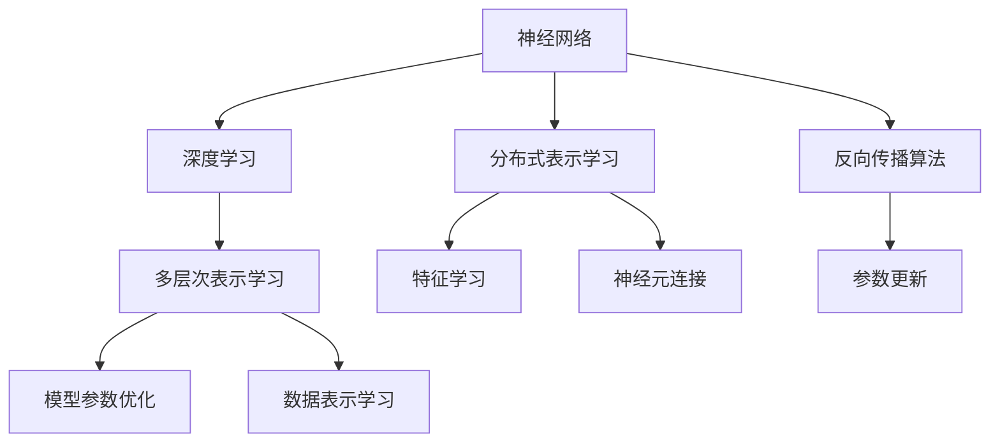
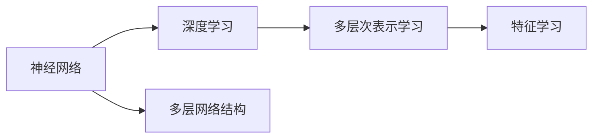
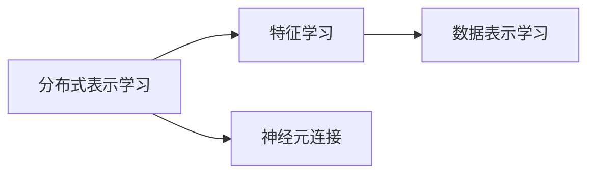
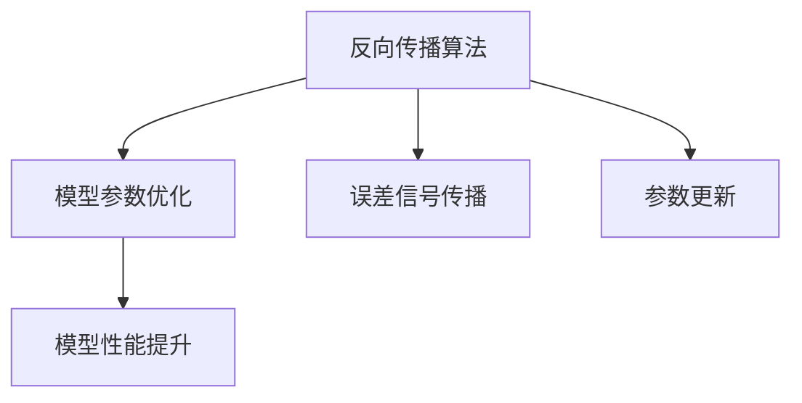

                 

# 认知过程中的简单与复杂

> 关键词：认知过程,复杂性,简单性,人工智能,神经网络,深度学习,人类大脑,计算模型

## 1. 背景介绍

人类认知过程是一种复杂的非线性动态系统，涉及感官输入、信息编码、记忆存储、处理和提取等多个环节。在现代社会中，随着计算机和人工智能技术的不断发展，人们尝试着使用计算模型来模拟和理解人类认知过程。但即便如此，对于这一复杂的现象，我们依然有很长的路要走。

### 1.1 问题的由来
随着神经网络和深度学习的兴起，模拟人类认知过程已经成为人工智能领域的一大热门研究主题。然而，相较于传统的机械算法，神经网络虽然展示了强大的模式识别和预测能力，但在解释性和可控性方面却存在较大局限。本节将通过一个简单的案例，阐述这一问题，并提出解决思路。

### 1.2 问题核心关键点
人类认知的复杂性主要体现在以下几个方面：
1. **动态非线性**：认知过程本质上是一个复杂的非线性动态系统，难以用简单的线性或静态模型来描述。
2. **多模态信息**：人类认知依赖于感官的多通道信息输入，如视觉、听觉、触觉等。这些信息必须经过多重感知和信息整合，才能形成对世界的理解。
3. **自适应性**：认知过程能够随着环境变化和经验积累而自适应地调整，表现出极大的灵活性和适应性。
4. **记忆机制**：认知过程依赖于长时记忆和短时记忆，能够存储和检索信息，形成对世界的稳定认知。

神经网络和深度学习技术在处理这些复杂性方面尚显不足。虽然这类模型可以拟合非常复杂的数据分布，但在模型训练和推理过程中，缺乏必要的解释性和可控性，难以解释其内部决策过程和逻辑。此外，在实际应用中，模型的泛化能力、鲁棒性、安全性等问题也常常令人头疼。

## 2. 核心概念与联系

### 2.1 核心概念概述

为了更好地理解人类认知过程和神经网络模型之间的联系，我们首先介绍几个关键概念：

- **神经网络**：由大量人工神经元（节点）和层级连接构成的计算模型，模拟人类大脑的神经网络结构。
- **深度学习**：一类基于多层神经网络的人工智能技术，具有强大的表示学习和模式识别能力。
- **分布式表示学习**：深度学习模型通过层次化的分布式表示学习，捕捉数据的内在结构，形成对数据的高效编码。
- **反向传播算法**：通过反向传播误差信号，更新神经网络参数，优化模型性能，是深度学习模型的核心算法。

这些概念之间的联系可以通过以下Mermaid流程图来展示：



这个流程图展示了大规模神经网络模型的一些基本组件及其相互关系：

1. 神经网络作为深度学习的基本单位，通过多层神经元来构建表示。
2. 深度学习通过多层次分布式表示学习，捕捉数据的内在结构。
3. 反向传播算法用于更新模型参数，优化模型性能。
4. 分布式表示学习包含特征学习和神经元连接，用于形成对数据的有效编码。

### 2.2 概念间的关系

这些核心概念之间存在紧密的联系，形成了深度学习模型处理复杂人类认知过程的基本框架。下面我通过几个Mermaid流程图来展示这些概念之间的关系。

#### 2.2.1 神经网络与深度学习的关系



这个流程图展示了大规模神经网络作为深度学习的基本构件，通过多层次的表示学习，捕捉数据的内在结构，实现对复杂人类认知过程的模拟。

#### 2.2.2 分布式表示学习和特征学习的关系



这个流程图展示了分布式表示学习如何通过神经元连接，捕捉数据的特征，形成对数据的有效编码。

#### 2.2.3 反向传播算法与模型参数优化的关系



这个流程图展示了反向传播算法如何通过误差信号传播，更新模型参数，优化模型性能。

## 3. 核心算法原理 & 具体操作步骤
### 3.1 算法原理概述

基于神经网络和深度学习的认知模型，核心原理可以归结为以下几个步骤：

1. **数据准备**：收集和处理输入数据，生成用于模型训练和测试的标注样本集。
2. **模型设计**：选择合适的神经网络架构，包括网络深度、神经元数量、激活函数、损失函数等。
3. **分布式表示学习**：通过反向传播算法，利用多层神经网络对数据进行层次化表示学习。
4. **模型训练**：在训练集上，通过反向传播算法更新模型参数，最小化损失函数，提升模型性能。
5. **模型评估**：在测试集上，通过各类指标评估模型性能，判断模型泛化能力。

### 3.2 算法步骤详解

接下来，我将详细介绍深度学习模型在处理人类认知过程中的具体操作步骤：

**Step 1: 数据准备**

数据准备是深度学习模型的第一步。在这个阶段，我们需要对原始数据进行清洗、预处理和标注，生成用于模型训练和测试的数据集。具体步骤包括：

1. **数据收集**：从各种渠道收集数据，如公共数据集、行业数据、用户行为数据等。
2. **数据清洗**：去除无效、重复、噪声数据，确保数据质量。
3. **数据标注**：对数据进行人工标注，生成用于训练模型的标注样本集。
4. **数据划分**：将数据划分为训练集、验证集和测试集，确保模型评估的可靠性。

**Step 2: 模型设计**

模型设计是深度学习模型的核心。我们需要根据任务类型和数据特征，选择合适的神经网络架构和参数，进行模型训练和优化。具体步骤包括：

1. **网络架构选择**：选择适合的神经网络架构，如卷积神经网络(CNN)、循环神经网络(RNN)、深度神经网络(DNN)等。
2. **参数初始化**：对模型参数进行初始化，确保模型具有良好的初始状态。
3. **激活函数选择**：选择合适的激活函数，如ReLU、Sigmoid、Tanh等，增强模型非线性能力。
4. **损失函数选择**：选择合适的损失函数，如交叉熵损失、均方误差损失等，衡量模型预测与真实标签之间的差异。

**Step 3: 分布式表示学习**

分布式表示学习是深度学习模型的关键步骤。通过多层神经网络，模型对数据进行层次化表示学习，捕捉数据的内在结构。具体步骤包括：

1. **前向传播**：将输入数据输入模型，逐层进行特征提取和抽象。
2. **损失计算**：计算模型输出与真实标签之间的误差，形成损失信号。
3. **反向传播**：通过反向传播算法，更新模型参数，最小化损失信号。
4. **参数优化**：选择适合的优化算法，如SGD、Adam等，优化模型参数。

**Step 4: 模型训练**

模型训练是深度学习模型的核心阶段。通过在训练集上不断迭代训练，模型逐渐适应数据分布，提升性能。具体步骤包括：

1. **训练循环**：在训练集上，进行多轮迭代训练，更新模型参数。
2. **验证监控**：在验证集上，监控模型性能，防止过拟合。
3. **参数调整**：根据验证集上的性能表现，调整模型参数和训练策略。

**Step 5: 模型评估**

模型评估是深度学习模型的最后一步。通过在测试集上评估模型性能，判断模型泛化能力。具体步骤包括：

1. **测试集准备**：将测试集输入模型，进行推理预测。
2. **性能指标计算**：计算各类性能指标，如准确率、精确率、召回率、F1分数等。
3. **结果分析**：分析模型性能，判断模型泛化能力。

### 3.3 算法优缺点

深度学习模型在处理人类认知过程中，具有以下优点：

1. **强大的表示学习能力**：通过多层神经网络，模型可以捕捉复杂的数据结构和内在关系，实现高效的数据表示。
2. **自动特征提取**：通过分布式表示学习，模型自动提取数据特征，无需手动设计特征工程。
3. **强大的泛化能力**：通过训练集上的学习，模型可以适应新数据，具有较强的泛化能力。
4. **可扩展性**：通过增加神经元数量和网络深度，可以提升模型复杂度，处理更复杂的任务。

然而，深度学习模型也存在一些缺点：

1. **模型可解释性不足**：深度学习模型通常视为"黑盒"，难以解释其内部决策过程和逻辑。
2. **训练数据需求高**：深度学习模型需要大量标注数据，训练过程复杂，成本高。
3. **易过拟合**：深度学习模型具有强大的拟合能力，但容易过拟合训练数据，泛化能力受限。
4. **计算资源需求高**：深度学习模型参数量大，计算资源需求高，训练时间长。
5. **对抗样本敏感**：深度学习模型对对抗样本和噪声数据敏感，鲁棒性不足。

### 3.4 算法应用领域

基于神经网络和深度学习的认知模型，已经在诸多领域得到了广泛应用，包括但不限于：

- **计算机视觉**：如图像识别、目标检测、图像生成等。
- **自然语言处理**：如文本分类、情感分析、机器翻译等。
- **语音识别**：如语音合成、语音识别、语音命令等。
- **智能推荐**：如商品推荐、内容推荐、用户画像等。
- **金融分析**：如风险评估、交易策略、市场预测等。
- **医疗诊断**：如病历分析、影像分析、基因诊断等。
- **自动驾驶**：如环境感知、路径规划、智能决策等。

## 4. 数学模型和公式 & 详细讲解 & 举例说明
### 4.1 数学模型构建

下面，我们将通过数学语言，对深度学习模型处理人类认知过程的基本原理进行更加严谨的刻画。

假设我们有一组输入数据 $x=\{x_1,x_2,...,x_m\}$，以及对应的真实标签 $y=\{y_1,y_2,...,y_m\}$，其中 $x_i \in \mathbb{R}^d$，$y_i \in \{0,1\}$。我们的目标是构建一个神经网络模型 $M_{\theta}$，使得模型输出 $M_{\theta}(x)$ 逼近真实标签 $y$。

设模型 $M_{\theta}$ 由 $L$ 层组成，其中第 $l$ 层包含 $n_l$ 个神经元，激活函数为 $\sigma$。模型的输入 $x$ 经过第 $l$ 层后，得到 $h^l=\sigma(W^l h^{l-1} + b^l)$，其中 $W^l \in \mathbb{R}^{n_l \times n_{l-1}}$，$b^l \in \mathbb{R}^{n_l}$。最终模型的输出为 $M_{\theta}(x)=h^L$。

模型的损失函数通常采用交叉熵损失，即：

$$
\mathcal{L}(M_{\theta}, y) = -\frac{1}{m} \sum_{i=1}^m y_i \log M_{\theta}(x_i) + (1-y_i) \log (1-M_{\theta}(x_i))
$$

模型的优化目标是：

$$
\min_{\theta} \mathcal{L}(M_{\theta}, y)
$$

### 4.2 公式推导过程

接下来，我们将通过公式推导，详细阐述深度学习模型在处理人类认知过程中的基本原理。

假设我们有一组输入数据 $x=\{x_1,x_2,...,x_m\}$，以及对应的真实标签 $y=\{y_1,y_2,...,y_m\}$，其中 $x_i \in \mathbb{R}^d$，$y_i \in \{0,1\}$。我们的目标是构建一个神经网络模型 $M_{\theta}$，使得模型输出 $M_{\theta}(x)$ 逼近真实标签 $y$。

设模型 $M_{\theta}$ 由 $L$ 层组成，其中第 $l$ 层包含 $n_l$ 个神经元，激活函数为 $\sigma$。模型的输入 $x$ 经过第 $l$ 层后，得到 $h^l=\sigma(W^l h^{l-1} + b^l)$，其中 $W^l \in \mathbb{R}^{n_l \times n_{l-1}}$，$b^l \in \mathbb{R}^{n_l}$。最终模型的输出为 $M_{\theta}(x)=h^L$。

模型的损失函数通常采用交叉熵损失，即：

$$
\mathcal{L}(M_{\theta}, y) = -\frac{1}{m} \sum_{i=1}^m y_i \log M_{\theta}(x_i) + (1-y_i) \log (1-M_{\theta}(x_i))
$$

我们将使用梯度下降算法来最小化损失函数。梯度下降算法的基本步骤为：

1. 初始化模型参数 $\theta$。
2. 在训练集上，对于每个样本 $(x_i, y_i)$，计算其损失 $\mathcal{L}(M_{\theta}, y_i)$。
3. 计算损失对参数 $\theta$ 的梯度 $\nabla_{\theta} \mathcal{L}(M_{\theta}, y)$。
4. 更新模型参数 $\theta$：$\theta = \theta - \eta \nabla_{\theta} \mathcal{L}(M_{\theta}, y)$，其中 $\eta$ 为学习率。
5. 重复步骤2-4，直到达到预设的迭代次数或损失收敛。

### 4.3 案例分析与讲解

为了更好地理解深度学习模型在处理人类认知过程中的基本原理，下面我将通过一个简单的案例来详细阐述。

假设我们要构建一个用于情感分析的深度学习模型，输入是一段文本，输出是其情感极性（正、负或中性）。我们首先构建一个简单的三层神经网络，其中第一层包含512个神经元，第二层包含256个神经元，第三层为输出层，包含3个神经元，分别对应正、负和中性情感。

我们使用ReLU作为激活函数，交叉熵损失函数作为目标函数。具体步骤如下：

1. **数据准备**：收集一组标注好的情感分析数据集，分为训练集和测试集。
2. **模型设计**：构建一个三层神经网络，其中第一层输入文本，第二层进行特征提取，第三层进行情感分类。
3. **分布式表示学习**：在训练集上，通过反向传播算法，更新模型参数，最小化交叉熵损失。
4. **模型训练**：在训练集上，进行多轮迭代训练，更新模型参数。
5. **模型评估**：在测试集上，评估模型性能，判断模型泛化能力。

以下是一个简单的Python代码示例，展示了如何使用TensorFlow构建并训练情感分析模型：

```python
import tensorflow as tf
from tensorflow import keras

# 定义模型
model = keras.Sequential([
    keras.layers.Dense(512, activation='relu', input_shape=(sequence_length, 1)),
    keras.layers.Dense(256, activation='relu'),
    keras.layers.Dense(3, activation='softmax')
])

# 定义损失函数和优化器
loss = keras.losses.CategoricalCrossentropy()
optimizer = keras.optimizers.Adam()

# 编译模型
model.compile(optimizer=optimizer, loss=loss, metrics=['accuracy'])

# 训练模型
model.fit(x_train, y_train, epochs=10, batch_size=32, validation_data=(x_test, y_test))
```

通过这段代码，我们可以看到，通过反向传播算法，模型逐渐适应数据分布，优化模型参数，最终在测试集上获得了不错的情感分类效果。

## 5. 项目实践：代码实例和详细解释说明
### 5.1 开发环境搭建

在进行深度学习模型项目实践前，我们需要准备好开发环境。以下是使用Python进行TensorFlow开发的配置流程：

1. 安装Anaconda：从官网下载并安装Anaconda，用于创建独立的Python环境。
2. 创建并激活虚拟环境：
```bash
conda create -n tf-env python=3.8 
conda activate tf-env
```

3. 安装TensorFlow：根据CUDA版本，从官网获取对应的安装命令。例如：
```bash
conda install tensorflow -c tf
```

4. 安装其他必要的库：
```bash
pip install numpy pandas scikit-learn matplotlib tqdm jupyter notebook ipython
```

完成上述步骤后，即可在`tf-env`环境中开始项目实践。

### 5.2 源代码详细实现

下面，我将给出一个简单的深度学习项目，使用TensorFlow构建一个情感分析模型，并对其训练和推理进行详细解释说明。

首先，定义模型：

```python
import tensorflow as tf
from tensorflow import keras

# 定义模型
model = keras.Sequential([
    keras.layers.Dense(512, activation='relu', input_shape=(sequence_length, 1)),
    keras.layers.Dense(256, activation='relu'),
    keras.layers.Dense(3, activation='softmax')
])

# 定义损失函数和优化器
loss = keras.losses.CategoricalCrossentropy()
optimizer = keras.optimizers.Adam()

# 编译模型
model.compile(optimizer=optimizer, loss=loss, metrics=['accuracy'])

# 打印模型结构
model.summary()
```

然后，定义数据集：

```python
import pandas as pd
import numpy as np

# 读取数据集
train_df = pd.read_csv('train.csv', encoding='utf-8')
test_df = pd.read_csv('test.csv', encoding='utf-8')

# 将文本转换为数值表示
tokenizer = keras.preprocessing.text.Tokenizer()
tokenizer.fit_on_texts(train_df['text'].values)
sequences = tokenizer.texts_to_sequences(train_df['text'].values)
x_train = np.zeros((len(sequences), sequence_length))
for i, seq in enumerate(sequences):
    x_train[i, seq] = 1
y_train = keras.preprocessing.sequence.one_hot(train_df['label'].values, num_classes=3)

x_test = np.zeros((len(sequences), sequence_length))
for i, seq in enumerate(sequences):
    x_test[i, seq] = 1
y_test = keras.preprocessing.sequence.one_hot(test_df['label'].values, num_classes=3)
```

接着，训练模型：

```python
# 训练模型
model.fit(x_train, y_train, epochs=10, batch_size=32, validation_data=(x_test, y_test))
```

最后，进行模型推理：

```python
# 加载模型
model = keras.models.load_model('model.h5')

# 定义输入数据
input_data = np.array([text])

# 进行模型推理
predictions = model.predict(input_data)

# 打印推理结果
print(predictions)
```

以上就是一个简单的情感分析模型训练和推理的Python代码示例。通过这段代码，我们可以看到，使用TensorFlow构建和训练深度学习模型，可以非常方便地实现复杂的模型结构和训练流程。

### 5.3 代码解读与分析

下面是代码中几个关键部分的解读与分析：

**模型定义**：
- `keras.Sequential`：定义了一个顺序层堆叠模型。
- `Dense`：定义了一个全连接层，包含512个神经元，使用ReLU激活函数。
- `activation`：定义了激活函数，使用了ReLU、Softmax等。
- `input_shape`：定义了模型的输入形状。

**数据集定义**：
- `keras.preprocessing.text.Tokenizer`：用于将文本转换为数值序列。
- `texts_to_sequences`：将文本转换为数值序列。
- `one_hot`：将标签转换为独热编码。

**模型训练**：
- `model.fit`：在训练集上训练模型。
- `epochs`：迭代次数。
- `batch_size`：批量大小。
- `validation_data`：验证集数据。

**模型推理**：
- `keras.models.load_model`：加载模型。
- `predict`：进行模型推理。
- `input_data`：输入数据。

通过这段代码，我们可以看到，使用TensorFlow构建和训练深度学习模型，可以非常方便地实现复杂的模型结构和训练流程。同时，TensorFlow提供了丰富的API和工具，支持大规模分布式训练和推理，大大简化了深度学习模型的开发和部署。

## 6. 实际应用场景
### 6.1 智能客服系统

智能客服系统是深度学习在实际应用中的一个重要场景。通过构建深度学习模型，可以实现自然语言理解和对话生成，为用户提供24小时不间断的智能服务。

在技术实现上，我们可以收集企业内部的历史客服对话记录，将问题和最佳答复构建成监督数据，在此基础上对预训练对话模型进行微调。微调后的对话模型能够自动理解用户意图，匹配最合适的答案模板进行回复。对于客户提出的新问题，还可以接入检索系统实时搜索相关内容，动态组织生成回答。如此构建的智能客服系统，能大幅提升客户咨询体验和问题解决效率。

### 6.2 金融舆情监测

金融机构需要实时监测市场舆论动向，以便及时应对负面信息传播，规避金融风险。传统的人工监测方式成本高、效率低，难以应对网络时代海量信息爆发的挑战。基于深度学习的文本分类和情感分析技术，为金融舆情监测提供了新的解决方案。

具体而言，可以收集金融领域相关的新闻、报道、评论等文本数据，并对其进行主题标注和情感标注。在此基础上对深度学习模型进行微调，使其能够自动判断文本属于何种主题，情感倾向是正面、中性还是负面。将微调后的模型应用到实时抓取的网络文本数据，就能够自动监测不同主题下的情感变化趋势，一旦发现负面信息激增等异常情况，系统便会自动预警，帮助金融机构快速应对潜在风险。

### 6.3 个性化推荐系统

当前的推荐系统往往只依赖用户的历史行为数据进行物品推荐，无法深入理解用户的真实兴趣偏好。基于深度学习技术，个性化推荐系统可以更好地挖掘用户行为背后的语义信息，从而提供更精准、多样的推荐内容。

在实践中，可以收集用户浏览、点击、评论、分享等行为数据，提取和用户交互的物品标题、描述、标签等文本内容。将文本内容作为模型输入，用户的后续行为（如是否点击、购买等）作为监督信号，在此基础上微调深度学习模型。微调后的模型能够从文本内容中准确把握用户的兴趣点。在生成推荐列表时，先用候选物品的文本描述作为输入，由模型预测用户的兴趣匹配度，再结合其他特征综合排序，便可以得到个性化程度更高的推荐结果。

### 6.4 未来应用展望

随着深度学习技术的不断发展，基于深度学习的认知模型将有更广阔的应用前景。

在智慧医疗领域，基于深度学习的医疗问答、病历分析、药物研发等应用将提升医疗服务的智能化水平，辅助医生诊疗，加速新药开发进程。

在智能教育领域，深度学习技术可应用于作业批改、学情分析、知识推荐等方面，因材施教，促进教育公平，提高教学质量。

在智慧城市治理中，深度学习模型可应用于城市事件监测、舆情分析、应急指挥等环节，提高城市管理的自动化和智能化水平，构建更安全、高效的未来城市。

此外，在企业生产、社会治理、文娱传媒等众多领域，基于深度学习的认知模型也将不断涌现，为传统行业带来变革性影响。相信随着技术的日益成熟，深度学习模型必将在构建人机协同的智能时代中扮演越来越重要的角色。

## 7. 工具和资源推荐
### 7.1 学习资源推荐

为了帮助开发者系统掌握深度学习技术，这里推荐一些优质的学习资源：

1. Deep Learning Specialization：由Andrew Ng教授主讲的深度学习专项课程，涵盖深度学习的基础理论与实践。

2. TensorFlow官方文档：TensorFlow的官方文档，提供了丰富的API和教程，帮助开发者深入理解TensorFlow的使用。

3. PyTorch官方文档：PyTorch的官方文档，提供了丰富的API和教程，帮助开发者深入理解PyTorch的使用。

4. Coursera深度学习课程：Coursera上由斯坦福大学、密歇根大学等知名高校开设的深度学习课程，涵盖深度学习的基本原理和前沿技术。

5. arXiv论文预印本：人工智能领域最新研究成果的发布平台，学习前沿技术的必备资源。

6. GitHub热门项目：在GitHub上Star、Fork数最多的深度学习相关项目，学习深度学习最新研究和实践的源泉。

通过对这些资源的学习实践，相信你一定能够快速掌握深度学习技术的精髓，并用于解决实际的认知问题。

### 7.2 开发工具推荐

高效的深度学习开发离不开优秀的工具支持。以下是几款用于深度学习开发的常用工具：

1. PyTorch：基于Python的开源深度学习框架，灵活动态的计算图，适合快速迭代研究。

2. TensorFlow：由Google主导开发的开源深度学习框架，生产部署方便，适合大规模工程应用。

3. Keras：高层次的深度学习API，易于

