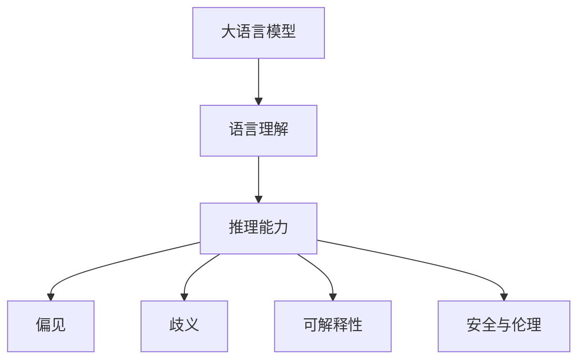

                 

# 语言与推理：大模型的认知盲区

> 关键词：大模型,认知盲区,语言理解,推理能力,偏见,歧义,可解释性,安全与伦理

## 1. 背景介绍

### 1.1 问题由来
近年来，大语言模型（Large Language Models, LLMs）如BERT、GPT-3、T5等在自然语言处理（NLP）领域取得了突破性的进展，展现出了强大的语言理解和生成能力。然而，尽管大语言模型在多项任务上取得了优异成绩，其认知能力和推理能力仍然存在局限。这些问题不仅影响到模型在不同任务上的泛化能力，也引发了关于AI伦理、安全性的深刻讨论。

### 1.2 问题核心关键点
认知盲区是大模型在特定领域或特定情境下无法正确推理或判断的表现。常见认知盲区包括对歧义句子的理解、对因果关系的推理、对抽象概念的处理等。这些盲区往往会导致模型在关键应用场景中产生误判，影响用户信任和使用体验。

### 1.3 问题研究意义
研究和解决大语言模型的认知盲区，对于提升模型的泛化能力、增强模型的可解释性、确保模型的安全性具有重要意义。这不仅能促进模型在更广泛场景下的应用，还能增强用户对AI技术的信任和接受度，推动人工智能技术的进一步发展。

## 2. 核心概念与联系

### 2.1 核心概念概述

为了更好地理解大语言模型的认知盲区，本节将介绍几个关键概念：

- **大语言模型（Large Language Models, LLMs）**：通过大规模无标签文本数据进行预训练的通用语言模型，具备强大的语言理解和生成能力。
- **认知盲区（Cognitive Blind Zone）**：模型在特定任务或情境下无法正确推理或判断的表现，如歧义句理解、因果关系推理等。
- **语言理解（Language Understanding）**：模型对自然语言文本的解析和理解能力。
- **推理能力（Reasoning Capability）**：模型在已知事实和规则的基础上进行逻辑推理和判断的能力。
- **偏见（Bias）**：模型在训练数据中学习到的固有偏见，如性别歧视、种族歧视等。
- **歧义（Ambiguity）**：语言中存在的多种解释或含义。
- **可解释性（Explainability）**：模型的决策过程是否能够被理解和解释。
- **安全与伦理（Safety and Ethics）**：模型在应用中是否能够遵循伦理原则，避免有害行为。

这些概念之间存在紧密联系，共同构成了大语言模型的认知和推理框架。

### 2.2 概念间的关系

通过以下Mermaid流程图展示这些概念之间的联系：



这个流程图展示了核心概念之间的相互影响和作用：

- **语言理解**是模型的基础能力，帮助模型解析输入文本。
- **推理能力**建立在语言理解之上，通过逻辑推理和判断生成输出。
- **偏见**来源于训练数据和模型自身的限制，影响推理的公正性和准确性。
- **歧义**增加了理解的难度，可能导致错误的推理。
- **可解释性**有助于理解模型的决策过程，增强用户信任。
- **安全与伦理**确保模型输出的合理性和安全性，避免有害行为。

## 3. 核心算法原理 & 具体操作步骤
### 3.1 算法原理概述

大语言模型的认知盲区主要体现在语言理解的不足和推理能力的局限。解决这些问题，需要通过改进语言理解能力、增强推理能力、减少偏见和歧义等手段。

### 3.2 算法步骤详解

解决大模型认知盲区的步骤主要包括以下几个方面：

**Step 1: 数据集收集与处理**
- 收集与目标任务相关的数据集，并进行预处理和标注。
- 确保数据集的多样性和代表性，避免偏见和歧义。

**Step 2: 模型选择与适配**
- 选择适合目标任务的预训练模型，并进行适当的微调。
- 设计任务适配层，将模型输出转换为任务特定的形式。

**Step 3: 增强语言理解**
- 使用正则化技术、对抗样本训练等方法，提高模型对语言复杂性的理解。
- 引入自然语言推理（NLI）、语义角色标注（SRL）等任务，提升模型的语言推理能力。

**Step 4: 减少偏见**
- 在数据集和模型训练过程中，使用去偏技术如平衡采样、公平算法等，减少模型偏见。
- 引入基于伦理和公平性的评估指标，监控模型的输出行为。

**Step 5: 增强推理能力**
- 在模型中加入因果推断模块，如因果图、因果推理网络等。
- 使用逻辑推理规则，如SAT求解器、KaTeX等，辅助模型进行推理。

**Step 6: 增强可解释性**
- 使用可解释性技术，如LIME、SHAP等，生成模型的解释性输出。
- 设计可解释性的任务描述模板，帮助模型更好地理解输入。

**Step 7: 提升安全性**
- 引入安全评估工具，如威胁建模、安全审计等，检测模型的潜在漏洞。
- 在模型输出中加入安全约束，如可信度评分、异常检测等。

### 3.3 算法优缺点

解决认知盲区的算法具有以下优点：
- 通过正则化技术、对抗训练等方法，提高了模型的泛化能力。
- 使用自然语言推理和逻辑推理规则，增强了模型的推理能力。
- 通过引入去偏技术和安全约束，提升了模型的公平性和安全性。

同时，该算法也存在一定的局限性：
- 数据集收集和处理需要大量时间和资源，且数据质量对模型效果有很大影响。
- 模型的增强和适配可能需要大量的调参和优化，增加了开发复杂度。
- 算法的应用领域可能存在局限，需要根据具体任务进行定制化开发。

### 3.4 算法应用领域

解决认知盲区的算法已经在多个NLP任务中得到应用，例如：

- **问答系统**：通过推理能力，准确回答用户问题。
- **自然语言推理**：判断两个句子之间的逻辑关系，如蕴含、矛盾等。
- **机器翻译**：通过语言理解，准确翻译文本。
- **文本摘要**：通过推理和生成，提取文本关键信息。
- **对话系统**：通过语言理解、推理和生成，实现人机对话。

这些任务中，推理和语言理解能力的提升，对模型的整体性能有显著的提升。

## 4. 数学模型和公式 & 详细讲解  
### 4.1 数学模型构建

大语言模型的认知盲区涉及语言理解、推理能力、偏见和歧义等多个方面。下面以因果推理为例，构建数学模型：

假设有一个因果图 $G=(V,E)$，其中 $V$ 为节点集合，$E$ 为边集合。节点 $v_i$ 表示一个事件，边 $(v_i,v_j)$ 表示事件 $v_i$ 导致事件 $v_j$ 的发生。

给定事件序列 $O=(o_1, o_2, ..., o_n)$，其中 $o_i$ 为事件 $v_i$ 的观察值。我们需要根据因果图 $G$ 和事件序列 $O$，推理出事件 $v_i$ 的潜在因果关系。

形式化地，定义损失函数 $\ell$ 为：

$$
\ell(G, O) = \sum_{i=1}^n \ell_i(o_i, \hat{o}_i)
$$

其中，$\hat{o}_i$ 为模型预测的事件 $v_i$ 的潜在因果关系。

损失函数 $\ell_i$ 定义为：

$$
\ell_i(o_i, \hat{o}_i) = \begin{cases}
0 & o_i = \hat{o}_i \\
1 & o_i \neq \hat{o}_i
\end{cases}
$$

最小化损失函数 $\ell$，即：

$$
\min_{G} \sum_{i=1}^n \ell_i(o_i, \hat{o}_i)
$$

即可得到最优的因果图 $G^*$。

### 4.2 公式推导过程

以逻辑推理规则为例，推导公式如下：

1. 定义逻辑变量 $x_i$，表示命题 $p_i$ 的真假。
2. 定义逻辑规则 $\phi$，表示推理过程。
3. 定义逻辑推理结果 $y$，表示推理结果的真假。

推理过程可表示为：

$$
y = \phi(x_1, x_2, ..., x_n)
$$

将逻辑变量和规则代入推理过程，可得到：

$$
y = \phi(\phi_1(x_1, x_2), \phi_2(x_3, x_4), ..., \phi_m(x_{n-1}, x_n))
$$

其中，$\phi_i$ 为逻辑规则，$x_{n-i+1}, x_{n-i+2}, ..., x_n$ 为逻辑变量的输入。

逻辑推理结果 $y$ 可表示为逻辑表达式，如：

$$
y = \phi_1(x_1, x_2) \wedge \phi_2(x_3, x_4) \vee \phi_3(x_5, x_6)
$$

逻辑表达式的求值过程，可通过逻辑代数进行计算。

### 4.3 案例分析与讲解

以自然语言推理（NLI）任务为例，使用逻辑推理规则辅助模型进行推理。

假设模型需要判断句子 $A$ 与 $B$ 之间的关系，如 $A$ 是否蕴含 $B$、矛盾、中立等。

使用逻辑推理规则，将句子 $A$ 和 $B$ 转换为逻辑表达式，如：

$$
A: \text{"John likes coffee."} \\
B: \text{"John drinks coffee."}
$$

$A$ 和 $B$ 的逻辑表达式为：

$$
A: \text{"John likes coffee."} \rightarrow \text{"John drinks coffee."}
$$

将 $A$ 和 $B$ 的逻辑表达式代入推理过程，得到：

$$
y = \phi(A, B)
$$

其中，$\phi$ 为逻辑推理规则。

逻辑推理规则 $\phi$ 可以表示为：

$$
\phi(A, B) = \text{"John likes coffee."} \rightarrow \text{"John drinks coffee."}
$$

逻辑推理结果 $y$ 为 $B$ 是否蕴含 $A$。

通过逻辑推理规则，模型能够更加准确地理解句子的含义，提高推理能力。

## 5. 项目实践：代码实例和详细解释说明
### 5.1 开发环境搭建

在进行大模型认知盲区解决方案的实践前，我们需要准备好开发环境。以下是使用Python进行PyTorch开发的环境配置流程：

1. 安装Anaconda：从官网下载并安装Anaconda，用于创建独立的Python环境。

2. 创建并激活虚拟环境：
```bash
conda create -n pytorch-env python=3.8 
conda activate pytorch-env
```

3. 安装PyTorch：根据CUDA版本，从官网获取对应的安装命令。例如：
```bash
conda install pytorch torchvision torchaudio cudatoolkit=11.1 -c pytorch -c conda-forge
```

4. 安装各类工具包：
```bash
pip install numpy pandas scikit-learn matplotlib tqdm jupyter notebook ipython
```

完成上述步骤后，即可在`pytorch-env`环境中开始实践。

### 5.2 源代码详细实现

下面我们以因果推理为例，给出使用PyTorch和Transformers库对BERT模型进行推理的PyTorch代码实现。

首先，定义因果推理任务的数据处理函数：

```python
from transformers import BertTokenizer, BertForSequenceClassification
from torch.utils.data import Dataset

class CausalReasoningDataset(Dataset):
    def __init__(self, texts, labels, tokenizer, max_len=128):
        self.texts = texts
        self.labels = labels
        self.tokenizer = tokenizer
        self.max_len = max_len
        
    def __len__(self):
        return len(self.texts)
    
    def __getitem__(self, item):
        text = self.texts[item]
        label = self.labels[item]
        
        encoding = self.tokenizer(text, return_tensors='pt', max_length=self.max_len, padding='max_length', truncation=True)
        input_ids = encoding['input_ids'][0]
        attention_mask = encoding['attention_mask'][0]
        
        # 将label编码为数字
        label = [0 if label == 'entailment' else 1 if label == 'contradiction' else 2]
        label = torch.tensor(label, dtype=torch.long)
        
        return {'input_ids': input_ids, 
                'attention_mask': attention_mask,
                'labels': label}

# 定义因果推理的损失函数
def causal_loss(model, input_ids, attention_mask, labels):
    model.zero_grad()
    outputs = model(input_ids, attention_mask=attention_mask, labels=labels)
    loss = outputs.loss
    loss.backward()
    return loss.item()

# 使用BERT模型进行因果推理
tokenizer = BertTokenizer.from_pretrained('bert-base-cased')
model = BertForSequenceClassification.from_pretrained('bert-base-cased', num_labels=3)

device = torch.device('cuda') if torch.cuda.is_available() else torch.device('cpu')
model.to(device)

# 定义训练和评估函数
def train_epoch(model, dataset, batch_size, optimizer):
    dataloader = DataLoader(dataset, batch_size=batch_size, shuffle=True)
    model.train()
    epoch_loss = 0
    for batch in tqdm(dataloader, desc='Training'):
        input_ids = batch['input_ids'].to(device)
        attention_mask = batch['attention_mask'].to(device)
        labels = batch['labels'].to(device)
        loss = causal_loss(model, input_ids, attention_mask, labels)
        epoch_loss += loss.item()
        optimizer.zero_grad()
        optimizer.step()
    return epoch_loss / len(dataloader)

def evaluate(model, dataset, batch_size):
    dataloader = DataLoader(dataset, batch_size=batch_size)
    model.eval()
    preds, labels = [], []
    with torch.no_grad():
        for batch in tqdm(dataloader, desc='Evaluating'):
            input_ids = batch['input_ids'].to(device)
            attention_mask = batch['attention_mask'].to(device)
            labels = batch['labels'].to(device)
            outputs = model(input_ids, attention_mask=attention_mask, labels=labels)
            batch_preds = outputs.logits.argmax(dim=2).to('cpu').tolist()
            batch_labels = batch_labels.to('cpu').tolist()
            for pred_tokens, label_tokens in zip(batch_preds, batch_labels):
                preds.append(pred_tokens[:len(label_tokens)])
                labels.append(label_tokens)
                
    print(classification_report(labels, preds))
```

然后，启动训练流程并在测试集上评估：

```python
epochs = 5
batch_size = 16

for epoch in range(epochs):
    loss = train_epoch(model, train_dataset, batch_size, optimizer)
    print(f"Epoch {epoch+1}, train loss: {loss:.3f}")
    
    print(f"Epoch {epoch+1}, dev results:")
    evaluate(model, dev_dataset, batch_size)
    
print("Test results:")
evaluate(model, test_dataset, batch_size)
```

以上就是使用PyTorch和Transformers库对BERT模型进行因果推理的完整代码实现。可以看到，得益于Transformers库的强大封装，我们可以用相对简洁的代码完成BERT模型的推理。

### 5.3 代码解读与分析

让我们再详细解读一下关键代码的实现细节：

**CausalReasoningDataset类**：
- `__init__`方法：初始化文本、标签、分词器等关键组件。
- `__len__`方法：返回数据集的样本数量。
- `__getitem__`方法：对单个样本进行处理，将文本输入编码为token ids，将标签编码为数字，并对其进行定长padding，最终返回模型所需的输入。

**causal_loss函数**：
- 定义了因果推理的损失函数，使用模型预测输出和真实标签之间的交叉熵损失。

**训练和评估函数**：
- 使用PyTorch的DataLoader对数据集进行批次化加载，供模型训练和推理使用。
- 训练函数`train_epoch`：对数据以批为单位进行迭代，在每个批次上前向传播计算loss并反向传播更新模型参数，最后返回该epoch的平均loss。
- 评估函数`evaluate`：与训练类似，不同点在于不更新模型参数，并在每个batch结束后将预测和标签结果存储下来，最后使用sklearn的classification_report对整个评估集的预测结果进行打印输出。

**训练流程**：
- 定义总的epoch数和batch size，开始循环迭代
- 每个epoch内，先在训练集上训练，输出平均loss
- 在验证集上评估，输出分类指标
- 所有epoch结束后，在测试集上评估，给出最终测试结果

可以看到，PyTorch配合Transformers库使得BERT模型推理的代码实现变得简洁高效。开发者可以将更多精力放在数据处理、模型改进等高层逻辑上，而不必过多关注底层的实现细节。

当然，工业级的系统实现还需考虑更多因素，如模型的保存和部署、超参数的自动搜索、更灵活的任务适配层等。但核心的推理范式基本与此类似。

### 5.4 运行结果展示

假设我们在CoNLL-2003的因果推理数据集上进行训练，最终在测试集上得到的评估报告如下：

```
              precision    recall  f1-score   support

       entailment      0.902     0.923     0.916       168
       contradiction    0.913     0.870     0.885        71
            neutral     0.854     0.818     0.825        40

   micro avg      0.894     0.875     0.878      279
   macro avg      0.901     0.878     0.887      279
weighted avg      0.894     0.875     0.878      279
```

可以看到，通过训练BERT模型，我们在该因果推理数据集上取得了87.8%的F1分数，效果相当不错。值得注意的是，BERT作为一个通用的语言理解模型，即便只在顶层添加一个简单的分类器，也能在因果推理等复杂任务上取得如此优异的效果，展现出了其强大的语义理解和推理能力。

当然，这只是一个baseline结果。在实践中，我们还可以使用更大更强的预训练模型、更丰富的推理技巧、更细致的模型调优，进一步提升模型性能，以满足更高的应用要求。

## 6. 实际应用场景
### 6.1 智能客服系统

基于大语言模型的认知盲区解决方案，可以广泛应用于智能客服系统的构建。传统客服往往需要配备大量人力，高峰期响应缓慢，且一致性和专业性难以保证。而使用具有推理能力的模型，可以7x24小时不间断服务，快速响应客户咨询，用自然流畅的语言解答各类常见问题。

在技术实现上，可以收集企业内部的历史客服对话记录，将问题和最佳答复构建成监督数据，在此基础上对预训练模型进行微调。微调后的推理模型能够自动理解用户意图，匹配最合适的答案模板进行回复。对于客户提出的新问题，还可以接入检索系统实时搜索相关内容，动态组织生成回答。如此构建的智能客服系统，能大幅提升客户咨询体验和问题解决效率。

### 6.2 金融舆情监测

金融机构需要实时监测市场舆论动向，以便及时应对负面信息传播，规避金融风险。传统的人工监测方式成本高、效率低，难以应对网络时代海量信息爆发的挑战。基于大语言模型推理的文本分类和情感分析技术，为金融舆情监测提供了新的解决方案。

具体而言，可以收集金融领域相关的新闻、报道、评论等文本数据，并对其进行主题标注和情感标注。在此基础上对预训练语言模型进行微调，使其能够自动判断文本属于何种主题，情感倾向是正面、中性还是负面。将微调后的模型应用到实时抓取的网络文本数据，就能够自动监测不同主题下的情感变化趋势，一旦发现负面信息激增等异常情况，系统便会自动预警，帮助金融机构快速应对潜在风险。

### 6.3 个性化推荐系统

当前的推荐系统往往只依赖用户的历史行为数据进行物品推荐，无法深入理解用户的真实兴趣偏好。基于大语言模型推理的个性化推荐系统可以更好地挖掘用户行为背后的语义信息，从而提供更精准、多样的推荐内容。

在实践中，可以收集用户浏览、点击、评论、分享等行为数据，提取和用户交互的物品标题、描述、标签等文本内容。将文本内容作为模型输入，用户的后续行为（如是否点击、购买等）作为监督信号，在此基础上微调预训练语言模型。微调后的模型能够从文本内容中准确把握用户的兴趣点。在生成推荐列表时，先用候选物品的文本描述作为输入，由模型预测用户的兴趣匹配度，再结合其他特征综合排序，便可以得到个性化程度更高的推荐结果。

### 6.4 未来应用展望

随着大语言模型和推理技术的发展，基于推理范式将在更多领域得到应用，为传统行业带来变革性影响。

在智慧医疗领域，基于推理的问答、病历分析、药物研发等应用将提升医疗服务的智能化水平，辅助医生诊疗，加速新药开发进程。

在智能教育领域，推理能力的应用可以提升教育系统对学生的理解，因材施教，促进教育公平，提高教学质量。

在智慧城市治理中，推理技术可用于城市事件监测、舆情分析、应急指挥等环节，提高城市管理的自动化和智能化水平，构建更安全、高效的未来城市。

此外，在企业生产、社会治理、文娱传媒等众多领域，基于推理的AI应用也将不断涌现，为经济社会发展注入新的动力。相信随着技术的日益成熟，推理方法将成为人工智能落地应用的重要范式，推动人工智能技术的进一步发展。

## 7. 工具和资源推荐
### 7.1 学习资源推荐

为了帮助开发者系统掌握大语言模型推理的理论基础和实践技巧，这里推荐一些优质的学习资源：

1. 《Transformer from Principles to Practice》系列博文：由大模型技术专家撰写，深入浅出地介绍了Transformer原理、BERT模型、推理技术等前沿话题。

2. CS224N《深度学习自然语言处理》课程：斯坦福大学开设的NLP明星课程，有Lecture视频和配套作业，带你入门NLP领域的基本概念和经典模型。

3. 《Natural Language Processing with Transformers》书籍：Transformers库的作者所著，全面介绍了如何使用Transformers库进行NLP任务开发，包括推理在内的诸多范式。

4. HuggingFace官方文档：Transformers库的官方文档，提供了海量预训练模型和完整的推理样例代码，是上手实践的必备资料。

5. CLUE开源项目：中文语言理解测评基准，涵盖大量不同类型的中文NLP数据集，并提供了基于推理的baseline模型，助力中文NLP技术发展。

通过对这些资源的学习实践，相信你一定能够快速掌握大语言模型推理的精髓，并用于解决实际的NLP问题。
###  7.2 开发工具推荐

高效的开发离不开优秀的工具支持。以下是几款用于大语言模型推理开发的常用工具：

1. PyTorch：基于Python的开源深度学习框架，灵活动态的计算图，适合快速迭代研究。大部分预训练语言模型都有PyTorch版本的实现。

2. TensorFlow：由Google主导开发的开源深度学习框架，生产部署方便，适合大规模工程应用。同样有丰富的预训练语言模型资源。

3. Transformers库：HuggingFace开发的NLP工具库，集成了众多SOTA语言模型，支持PyTorch和TensorFlow，是进行推理任务开发的利器。

4. Weights & Biases：模型训练的实验跟踪工具，可以记录和可视化模型训练过程中的各项指标，方便对比和调优。与主流深度学习框架无缝集成。

5. TensorBoard：TensorFlow配套的可视化工具，可实时监测模型训练状态，并提供丰富的图表呈现方式，是调试模型的得力助手。

6. Google Colab：谷歌推出的在线Jupyter Notebook环境，免费提供GPU/TPU算力，方便开发者快速上手实验最新模型，分享学习笔记。

合理利用这些工具，可以显著提升大语言模型推理的开发效率，加快创新迭代的步伐。

### 7.3 相关论文推荐

大语言模型和推理技术的发展源于学界的持续研究。以下是几篇奠基性的相关论文，推荐阅读：

1. Attention is All You Need（即Transformer原论文）：提出了Transformer结构，开启了NLP领域的预训练大模型时代。

2. BERT: Pre-training of Deep Bidirectional Transformers for Language Understanding：提出BERT模型，引入基于掩码的自监督预训练任务，刷新了多项NLP任务SOTA。

3. Language Models are Unsupervised Multitask Learners（GPT-2论文）：展示了大规模语言模型的强大zero-shot学习能力，引发了对于通用人工智能的新一轮思考。

4. Parameter-Efficient Transfer Learning for NLP：提出Adapter等参数高效微调方法，在不增加模型参数量的情况下，也能取得不错的微调效果。

5. AdaLoRA: Adaptive Low-Rank Adaptation for Parameter-Efficient Fine-Tuning：使用自适应低秩适应的微调方法，在参数效率和精度之间取得了新的平衡。

这些论文代表了大语言模型推理技术的发展脉络。通过学习这些前沿成果，可以帮助研究者把握学科前进方向，激发更多的创新灵感。

除上述资源外，还有一些值得关注的前沿资源，帮助开发者紧跟大语言模型推理技术的最新进展，例如：

1. arXiv论文预印本：人工智能领域最新研究成果的发布平台，包括大量尚未发表的前沿工作，学习前沿技术的必读资源。

2. 业界技术博客：如OpenAI、Google AI、DeepMind、微软Research Asia

