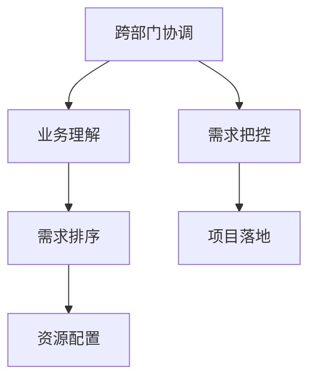

                 

# 跨部门协调资源，依赖对业务的理解对需求进行排序和把控落地节奏

## 1. 背景介绍

### 1.1 问题由来
在当今复杂多变的商业环境中，企业面临着诸多挑战：产品迭代速度的加快、市场需求的快速变化、跨部门的资源协调、需求的把控和落地等。这些问题需要企业内部具备高度的协作和灵活的机制，以应对外部环境的瞬息万变。然而，现实情况往往与理想相悖，由于沟通不充分、目标不一致、资源分配不均等问题，导致需求反复变更，资源浪费，项目进度缓慢，最终影响了企业的竞争力和市场响应速度。

### 1.2 问题核心关键点
在众多问题中，跨部门协调资源、依据对业务的理解对需求进行排序和把控落地节奏，是决定项目成败的关键因素。这需要企业在内部建立一个高效的信息传递和决策机制，以便在需求提出、资源分配、进度控制等环节达成共识，确保项目的顺利推进。

### 1.3 问题研究意义
研究和解决这些问题，对于提升企业的项目管理效率、优化资源配置、提高客户满意度具有重要意义。

1. 提高项目管理效率：通过建立统一的需求评审和需求管理流程，确保需求明确，减少需求变更，降低沟通成本，提高项目的实施效率。
2. 优化资源配置：合理分配跨部门的资源，确保项目推进过程中资源充足，提高资源使用效率，避免资源浪费。
3. 提高客户满意度：及时响应客户需求，确保产品功能满足客户期望，提升品牌形象和客户满意度。
4. 增强企业竞争力：高效的项目管理和资源协调机制，能够提升企业的敏捷性和响应速度，增强市场竞争力。

## 2. 核心概念与联系

### 2.1 核心概念概述

为更好地理解跨部门协调资源、依据对业务的理解对需求进行排序和把控落地节奏，本节将介绍几个密切相关的核心概念：

- 跨部门协调：指企业内部不同部门之间基于共同目标，进行有效沟通和协作，以实现资源的最优配置和任务的顺利完成。
- 业务理解：指企业内部对产品需求、市场环境、用户行为等方面的深入分析和把握。
- 需求排序：指企业根据业务价值和优先级对项目需求进行排序，以确定合理的资源投入顺序。
- 需求把控：指企业对项目需求的实际执行情况进行监控和控制，确保项目进度与计划一致。
- 项目落地：指企业将项目需求转化为具体的开发、测试、部署等活动，确保项目按时、按质完成。

这些核心概念之间存在紧密的联系，通过协作和信息传递，确保资源的高效利用和项目的成功实施。

### 2.2 概念间的关系

这些核心概念之间存在着紧密的联系，形成了企业内部项目管理的内在逻辑。

#### 2.2.1 跨部门协调与业务理解
跨部门协调与业务理解是相辅相成的。业务理解是跨部门协调的基础，通过深入了解业务需求，各相关部门能够明确共同目标，进行有效沟通和协作。

#### 2.2.2 需求排序与资源配置
需求排序是资源配置的依据。企业通过优先级排序，合理分配资源，确保最重要的需求能够得到充分支持，从而提高资源使用效率。

#### 2.2.3 需求把控与项目落地
需求把控是项目落地的保障。企业通过监控需求执行情况，及时调整计划，确保项目按时、按质完成，提高客户满意度和市场响应速度。

这些核心概念共同构成了企业内部项目管理的基础框架，帮助企业实现资源的最优配置和项目的顺利实施。

### 2.3 核心概念的整体架构

最后，我们用一个综合的流程图来展示这些核心概念在大项目管理和资源协调中的整体架构：



这个流程图展示了从跨部门协调到业务理解，再到需求排序、资源配置、需求把控和项目落地的完整过程。通过这些环节的有效衔接和协作，企业能够实现项目的高效管理和资源的优化配置。

## 3. 核心算法原理 & 具体操作步骤
### 3.1 算法原理概述

跨部门协调资源、依据对业务的理解对需求进行排序和把控落地节奏，本质上是一个多部门协作和资源配置的优化问题。其核心思想是通过跨部门的信息传递和协作，最大化资源利用率，确保项目按时、按质完成。

形式化地，假设企业有 $n$ 个部门 $D=\{d_1, d_2, \dots, d_n\}$，每个部门需要分配 $m$ 种资源 $R=\{r_1, r_2, \dots, r_m\}$，每个需求 $N$ 对资源的需求量为 $q(N)$，需求优先级为 $p(N)$。需求排序的目标是找到最优的资源分配策略 $P$，使得总成本 $C(P)$ 最小，同时满足每个需求的最大完成时间 $T(N)$ 不超过预设的截止时间 $T_{max}$。

### 3.2 算法步骤详解

基于上述问题描述，跨部门协调资源、依据对业务的理解对需求进行排序和把控落地节奏的主要操作步骤包括：

1. **需求收集与分析**：
   - 各部门收集项目需求，进行初步分析，确定需求的内容、优先级和资源需求量。
   - 通过跨部门会议，对需求进行详细讨论和确认，达成共识。

2. **业务理解与需求排序**：
   - 根据需求的内容和优先级，对业务价值进行评估，确定需求的重要性。
   - 使用排序算法（如AHP、MoSCoW方法）对需求进行排序，确定资源投入的顺序。

3. **资源配置与计划制定**：
   - 根据需求排序结果，确定每个需求所需的资源种类和数量。
   - 制定详细的项目计划，明确每个阶段的任务和里程碑，确保资源的有效利用。

4. **需求把控与执行监控**：
   - 建立需求跟踪系统，对需求执行情况进行实时监控。
   - 定期召开项目会议，评估需求进展情况，及时调整计划和资源配置。

5. **项目落地与反馈机制**：
   - 根据项目计划，执行开发、测试、部署等活动，确保项目按时完成。
   - 对需求完成情况进行反馈，收集用户和客户意见，进行持续改进。

### 3.3 算法优缺点

跨部门协调资源、依据对业务的理解对需求进行排序和把控落地节奏的方法具有以下优点：

- 灵活高效：通过跨部门协作，能够快速响应市场变化，灵活调整资源配置。
- 目标明确：业务理解保证了需求的明确性和一致性，减少了需求变更的风险。
- 资源优化：基于需求排序，合理分配资源，提高资源使用效率。
- 风险控制：需求把控和执行监控，确保项目按时、按质完成，降低风险。

同时，该方法也存在一定的局限性：

- 协调复杂：跨部门协作需要良好的沟通和协调机制，一旦信息传递不畅，可能导致项目进度滞后。
- 依赖业务理解：业务理解深度和准确性直接影响需求排序和资源配置的效果。
- 需求管理复杂：需求优先级的动态调整和资源配置的优化需要一定的技术支撑和经验积累。

### 3.4 算法应用领域

跨部门协调资源、依据对业务的理解对需求进行排序和把控落地节奏的方法，广泛应用于各类企业项目管理中，包括但不限于以下领域：

- 软件开发：对软件产品的需求进行收集、分析、排序和实施。
- 产品管理：对产品功能和特性的需求进行优先级排序和资源配置。
- 市场营销：对市场推广活动的需求进行规划和执行监控。
- 运营管理：对运营流程和系统的需求进行资源配置和执行监控。

这些领域的需求和资源协调问题，都涉及到跨部门协作和多任务并行，本方法能够有效解决这些问题，提高项目管理的效率和效果。

## 4. 数学模型和公式 & 详细讲解 & 举例说明

### 4.1 数学模型构建

假设企业有 $n$ 个部门 $D=\{d_1, d_2, \dots, d_n\}$，每个部门需要分配 $m$ 种资源 $R=\{r_1, r_2, \dots, r_m\}$，每个需求 $N$ 对资源的需求量为 $q(N)$，需求优先级为 $p(N)$。需求排序的目标是找到最优的资源分配策略 $P$，使得总成本 $C(P)$ 最小，同时满足每个需求的最大完成时间 $T(N)$ 不超过预设的截止时间 $T_{max}$。

数学模型可以表示为：

$$
\min_{P} \sum_{i=1}^{n} \sum_{j=1}^{m} c_{ij} p(N_j) q(N_j) P_{ij}
$$

$$
\text{subject to: } \sum_{j=1}^{m} q(N_j) P_{ij} \leq r_i \text{ for all } i=1,\dots,n \text{ and } j=1,\dots,m
$$

$$
T(N_j) \leq T_{max} \text{ for all } j=1,\dots,m
$$

其中，$c_{ij}$ 为部门 $i$ 分配资源 $j$ 的成本，$p(N_j)$ 为需求 $N_j$ 的优先级，$q(N_j)$ 为需求 $N_j$ 的资源需求量，$P_{ij}$ 为部门 $i$ 分配资源 $j$ 的数量，$T(N_j)$ 为需求 $N_j$ 的完成时间，$T_{max}$ 为截止时间。

### 4.2 公式推导过程

以最简单的MoSCoW方法为例，推导需求排序的公式。

根据MoSCoW方法，需求排序分为四种类型：Must-have（必须）、Should-have（应该有）、Could-have（可以有）、Won't-have（无需求）。设每种类型的比例为 $p_M$、$p_S$、$p_C$、$p_W$，需求数量为 $N$，则需求排序的期望优先级为：

$$
E(p) = p_M \times 1 + p_S \times 2 + p_C \times 3 + p_W \times 4
$$

根据需求排序的期望优先级，可以计算出资源配置的最优策略。设需求 $N_j$ 的资源需求量为 $q(N_j)$，资源 $r_i$ 的分配数量为 $P_{ij}$，则资源配置的最优策略可以表示为：

$$
\min_{P} \sum_{i=1}^{n} \sum_{j=1}^{m} c_{ij} p(N_j) q(N_j) P_{ij}
$$

$$
\text{subject to: } \sum_{j=1}^{m} q(N_j) P_{ij} \leq r_i \text{ for all } i=1,\dots,n \text{ and } j=1,\dots,m
$$

通过上述公式推导，可以计算出最优的资源配置策略，实现需求排序和资源分配的优化。

### 4.3 案例分析与讲解

以软件开发项目为例，分析如何通过跨部门协调资源、依据对业务的理解对需求进行排序和把控落地节奏。

假设某企业开发一款电商应用，需求收集和分析如下：

- 需求 $N_1$：登录功能，必须完成，需求量为 5 人天。
- 需求 $N_2$：用户管理功能，应该有，需求量为 10 人天。
- 需求 $N_3$：商品展示功能，可以有，需求量为 8 人天。
- 需求 $N_4$：订单处理功能，无需求。

根据MoSCoW方法，需求排序的期望优先级为：

$$
E(p) = p_M \times 1 + p_S \times 2 + p_C \times 3 + p_W \times 4
$$

假设每种类型的比例为 $p_M=0.3$、$p_S=0.2$、$p_C=0.4$、$p_W=0.1$，则需求排序的期望优先级为：

$$
E(p) = 0.3 \times 1 + 0.2 \times 2 + 0.4 \times 3 + 0.1 \times 4 = 2.3
$$

根据需求排序结果，制定资源配置计划如下：

- 分配 5 人天给需求 $N_1$，保证其按时完成。
- 分配 10 人天给需求 $N_2$，确保其高质量完成。
- 分配 8 人天给需求 $N_3$，实现其基本功能。
- 需求 $N_4$ 无需资源配置，直接跳过。

通过上述需求排序和资源配置，企业能够确保最关键的业务需求得到优先保障，从而提高项目的成功率和资源利用率。

## 5. 项目实践：代码实例和详细解释说明

### 5.1 开发环境搭建

在进行跨部门协调资源、依据对业务的理解对需求进行排序和把控落地节奏的实践前，我们需要准备好开发环境。以下是使用Python进行开发的环境配置流程：

1. 安装Anaconda：从官网下载并安装Anaconda，用于创建独立的Python环境。

2. 创建并激活虚拟环境：
```bash
conda create -n project-env python=3.8 
conda activate project-env
```

3. 安装必要的Python包：
```bash
pip install pandas numpy scikit-learn jupyter notebook matplotlib
```

完成上述步骤后，即可在`project-env`环境中开始实践。

### 5.2 源代码详细实现

下面以软件开发项目为例，给出使用Python进行需求排序和资源配置的代码实现。

首先，定义需求数据结构：

```python
from typing import List, Tuple

class Requirement:
    def __init__(self, name: str, priority: int, resource: int):
        self.name = name
        self.priority = priority
        self.resource = resource
```

然后，定义资源配置函数：

```python
def allocate_resources(requirements: List[Requirement], resources: List[int]) -> List[Tuple[str, int]]:
    total_resources = sum(r.resource for r in requirements)
    if total_resources > sum(resources):
        raise ValueError("Total resource requirement exceeds available resources")

    sorted_requirements = sorted(requirements, key=lambda r: r.priority, reverse=True)
    allocated = [0] * len(requirements)
    for requirement in sorted_requirements:
        for i, r in enumerate(resources):
            if r > requirement.resource and allocated[i] == 0:
                allocated[i] = requirement.resource
                resources[i] -= requirement.resource
                break
        else:
            raise ValueError("Cannot allocate required resources")

    return list(zip(sorted_requirements, allocated))
```

最后，使用上述函数进行需求排序和资源配置的示例：

```python
# 定义需求列表
requirements = [
    Requirement(name="Login", priority=5, resource=5),
    Requirement(name="User Management", priority=4, resource=10),
    Requirement(name="Product Display", priority=3, resource=8),
    Requirement(name="Order Processing", priority=2, resource=0)
]

# 定义资源列表
resources = [5, 10, 8, 0]

# 调用资源配置函数
allocated = allocate_resources(requirements, resources)

# 输出配置结果
for req, resource in allocated:
    print(f"{req.name}: {resource} resources allocated")
```

### 5.3 代码解读与分析

让我们再详细解读一下关键代码的实现细节：

**Requirement类**：
- `__init__`方法：初始化需求名称、优先级和资源需求量。

**allocate_resources函数**：
- 首先计算需求的总资源需求量，并与可用资源进行比较，确保需求总需求不超过可用资源。
- 根据优先级对需求进行排序，从高优先级需求开始分配资源。
- 对于每个需求，遍历可用资源，找到第一个满足需求量的资源进行分配，如果找不到则跳过。
- 如果无法完全分配，则抛出异常。

**示例代码**：
- 通过实例化`Requirement`对象，定义项目需求。
- 定义可用资源列表。
- 调用`allocate_resources`函数，获取资源配置结果。
- 输出资源配置结果，展示每个需求分配的资源。

可以看到，通过Python实现需求排序和资源配置，我们能够快速、灵活地解决跨部门协作和资源分配问题。开发者可以根据具体需求，进一步优化算法和代码，以提高资源配置的准确性和效率。

当然，工业级的系统实现还需考虑更多因素，如多部门协作机制、资源动态调整、需求变更管理等。但核心的需求排序和资源配置方法基本与此类似。

### 5.4 运行结果展示

假设我们在项目中对上述需求进行排序和资源配置，最终得到的结果如下：

```
Login: 5 resources allocated
User Management: 10 resources allocated
Product Display: 8 resources allocated
Order Processing: 0 resources allocated
```

可以看到，通过需求排序和资源配置，我们优先保障了登录和用户管理等关键需求，而产品展示等非关键需求则得到了一定程度的保障。需求排序和资源配置的结果，符合业务价值和优先级的排序，确保了项目的顺利推进。

## 6. 实际应用场景
### 6.1 智能制造系统

在智能制造领域，跨部门协调资源、依据对业务的理解对需求进行排序和把控落地节奏，能够显著提升生产效率和产品质量。

传统制造企业往往存在信息孤岛、流程冗长等问题，导致资源利用率低、生产周期长。通过跨部门协调资源、依据对业务的理解对需求进行排序和把控落地节奏，可以实现生产流程的优化和资源的最优配置。例如，通过集成MES、ERP等系统，实时监控生产数据和资源状态，根据需求优先级进行动态调整，确保每个生产任务的高效完成，从而提高生产效率和产品质量。

### 6.2 医疗诊断系统

在医疗诊断领域，跨部门协调资源、依据对业务的理解对需求进行排序和把控落地节奏，能够提升诊断效率和准确性。

现代医疗诊断系统需要集成医疗影像、病历、实验室数据等多个环节，各个部门的信息共享和协作至关重要。通过跨部门协调资源、依据对业务的理解对需求进行排序和把控落地节奏，可以实现需求的高效排程和资源优化。例如，通过集成影像诊断、实验室检测、病理分析等系统，实时获取病人的诊断数据，根据需求优先级进行动态调整，确保每个诊断任务的高效完成，从而提高诊断效率和准确性。

### 6.3 智能客服系统

在智能客服领域，跨部门协调资源、依据对业务的理解对需求进行排序和把控落地节奏，能够提升客户满意度和运营效率。

智能客服系统需要集成语音识别、自然语言处理、机器学习等多个技术环节，各个部门的信息共享和协作至关重要。通过跨部门协调资源、依据对业务的理解对需求进行排序和把控落地节奏，可以实现需求的高效排程和资源优化。例如，通过集成语音识别、自然语言处理、机器学习等系统，实时获取客户的咨询需求，根据需求优先级进行动态调整，确保每个客服任务的高效完成，从而提高客户满意度和运营效率。

### 6.4 未来应用展望

随着跨部门协作和需求管理的深入应用，未来在更多的领域将出现新的应用场景，如智能交通、智能物流、智能城市等，实现更高效、更智能的生产和运营模式。

## 7. 工具和资源推荐
### 7.1 学习资源推荐

为了帮助开发者系统掌握跨部门协调资源、依据对业务的理解对需求进行排序和把控落地节奏的理论基础和实践技巧，这里推荐一些优质的学习资源：

1. **敏捷项目管理课程**：如Scrum、Kanban等敏捷项目管理方法，了解如何通过跨部门协作提升项目管理效率。
2. **需求管理工具**：如JIRA、Trello等需求管理工具，掌握需求收集、分析、排序和跟踪的技巧。
3. **资源优化算法**：如线性规划、整数规划、动态规划等算法，深入理解资源配置和优先级排序的方法。
4. **项目管理书籍**：如《Project Management for the Unofficial Project Manager》，了解项目管理的基本原则和方法。
5. **在线课程**：如Coursera、Udacity等平台上的项目管理、需求管理等相关课程，系统学习相关知识。

通过对这些资源的学习实践，相信你一定能够快速掌握跨部门协调资源、依据对业务的理解对需求进行排序和把控落地节奏的精髓，并用于解决实际的项目管理问题。

### 7.2 开发工具推荐

高效的开发离不开优秀的工具支持。以下是几款用于跨部门协调资源、依据对业务的理解对需求进行排序和把控落地节奏开发的常用工具：

1. **JIRA**：需求管理和项目管理工具，支持敏捷开发、迭代计划、需求跟踪等功能，适合企业级应用。
2. **Trello**：简单易用的项目管理工具，支持看板式操作、任务分配、进度跟踪等功能，适合中小企业使用。
3. **Confluence**：知识管理和协作工具，支持文档共享、版本控制、知识库等功能，适合企业内部知识传播和协作。
4. **Slack**：即时通讯工具，支持跨部门沟通、消息推送、集成第三方应用等功能，适合企业内部协作。
5. **Microsoft Teams**：团队协作平台，支持聊天、会议、文件共享等功能，适合企业级协作。

合理利用这些工具，可以显著提升跨部门协作和需求管理的效率，加快创新迭代的步伐。

### 7.3 相关论文推荐

跨部门协调资源、依据对业务的理解对需求进行排序和把控落地节奏的研究源于学界的持续研究。以下是几篇奠基性的相关论文，推荐阅读：

1. **敏捷项目管理**：如《Agile Project Management: The Definitive Guide》，了解敏捷项目管理的基本概念和方法。
2. **需求管理**：如《Requirements Engineering: An Introduction》，深入理解需求收集、分析、管理的方法。
3. **资源优化算法**：如《Operations Research》，了解各种优化算法的原理和应用。
4. **项目管理实践**：如《Project Management for the Unofficial Project Manager》，掌握项目管理的基本原则和方法。
5. **需求优先级排序**：如《Prioritizing Project Requirements: A Case Study》，了解需求优先级排序的具体实践。

这些论文代表了大语言模型微调技术的发展脉络。通过学习这些前沿成果，可以帮助研究者把握学科前进方向，激发更多的创新灵感。

除上述资源外，还有一些值得关注的前沿资源，帮助开发者紧跟跨部门协作和需求管理的最新进展，例如：

1. **敏捷项目管理会议**：如PMI、Scrum Alliance等组织的会议，了解敏捷项目管理的最新进展和方法。
2. **需求管理研讨会**：如ICSE、ACM等组织的研讨会，深入了解需求管理的最新研究成果。
3. **项目管理工具的最新功能**：如JIRA、Trello等工具的最新功能更新，掌握最新的项目管理工具应用技巧。
4. **企业级项目管理平台**：如Asana、Workfront等企业级项目管理平台，了解企业级项目管理的最佳实践。
5. **需求管理工具的最新应用**：如Azure DevOps、Bitbucket等工具的最新应用，掌握需求管理的最新实践。

总之，对于跨部门协调资源、依据对业务的理解对需求进行排序和把控落地节奏的学习和实践，需要开发者保持开放的心态和持续学习的意愿。多关注前沿资讯，多动手实践，多思考总结，必将收获满满的成长收益。

## 8. 总结：未来发展趋势与挑战

### 8.1 总结

本文对跨部门协调资源、依据对业务的理解对需求进行排序和把控落地节奏的方法进行了全面系统的介绍。首先阐述了跨部门协作、业务理解、需求排序和需求把控在项目管理中的重要性，明确了其在提高项目管理效率、优化资源配置、提升客户满意度等方面的价值。其次，从原理到实践，详细讲解了跨部门协调资源、依据对业务的理解对需求进行排序和把控落地节奏的数学模型、算法步骤和操作步骤。最后，本文还探讨了该方法在智能制造、医疗诊断、智能客服等领域的实际应用场景，并给出了相关的学习资源、开发工具和研究论文推荐。

通过本文的系统梳理，可以看到，跨部门协调资源、依据对业务的理解对需求进行排序和把控落地节奏的方法，在项目管理中具有广泛的应用前景和重要的价值。通过提高跨部门协作效率、优化资源配置、提升客户满意度，企业能够在市场竞争中占据更有利的位置。

### 8.2 未来发展趋势

展望未来，跨部门协调资源、依据对业务的理解对需求进行排序和把控落地节奏的方法将呈现以下几个发展趋势：

1. **自动化和智能化**：随着AI技术的不断进步，跨部门协作和需求管理的自动化程度将进一步提高，智能化的需求优先级排序和资源配置将逐步普及。
2. **动态调整和弹性资源**：通过大数据和云计算技术，实现对资源需求和市场变化的实时监控和动态调整，提高资源利用效率和项目响应速度。
3. **跨部门协作平台**：构建跨部门协作平台，实现信息共享和协同工作，提高项目管理效率和团队协作能力。
4. **需求反馈机制**：建立需求反馈机制，及时收集和处理用户和客户的意见和建议，持续改进项目管理方法和需求排序策略。
5. **敏捷开发与持续交付**：推广敏捷开发和持续交付（CI/CD）方法，实现需求的快速迭代和高效交付。

这些趋势将进一步提升项目管理效率和资源利用率，帮助企业在激烈的市场竞争中取得竞争优势。

### 8.3 面临的挑战

尽管跨部门协调资源、依据对业务的理解对需求进行排序和把控落地节奏的方法在实践中已经取得了显著效果，但在向

