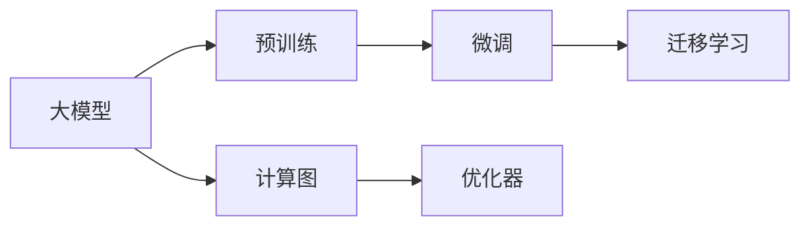
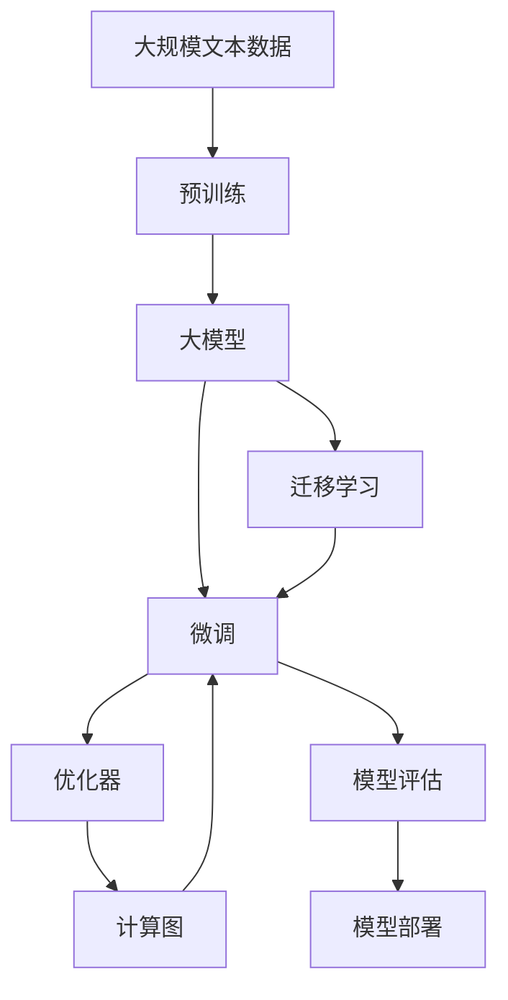

                 

# OpenAI 大模型应用实践

> 关键词：OpenAI大模型, 自然语言处理(NLP), 迁移学习, 微调, 预训练, 自然语言生成(NLG), 计算图, 算法优化

## 1. 背景介绍

随着人工智能技术的迅猛发展，OpenAI 大模型（如 GPT-3、DALL·E 等）以其卓越的自然语言处理（NLP）和自然语言生成（NLG）能力，在众多领域展示了巨大的潜力和广泛的应用前景。这些模型通过大规模的预训练和微调，在生成对话、文本摘要、图像描述、代码生成等方面，已经取得了显著的成果。本文将从背景介绍、核心概念、算法原理、项目实践、实际应用、工具资源推荐、总结展望等多个角度，对 OpenAI 大模型的应用实践进行全面系统的讲解。

### 1.1 问题由来

OpenAI 大模型的发展起源于语言模型和自监督预训练技术。早期的语言模型（如 LSTM、RNN 等）由于难以处理长序列、缺乏足够的表示能力，因此在自然语言处理任务上效果有限。自监督预训练技术的出现，使得语言模型能够从大规模无标签数据中学习到语言的通用表示，极大地提升了模型在各种 NLP 任务上的性能。

其中，OpenAI 的 GPT-3 模型更是将这一技术推向了新的高峰。GPT-3 通过大规模自监督预训练，学习了多种语言特性，能够生成流畅、连贯的文本，并且在许多自然语言处理任务中取得了领先的成绩。但这种大规模预训练模型也面临着参数量庞大、计算资源消耗高、难以在特定领域应用等问题，因此需要进一步的微调和优化。

### 1.2 问题核心关键点

OpenAI 大模型的应用实践主要围绕以下关键点展开：

- **预训练与微调**：通过大规模无标签数据的自监督预训练，获得通用语言表示；在特定任务上通过微调进一步优化模型性能。
- **迁移学习**：利用已训练好的模型，在不同任务之间进行知识迁移，提升模型在新领域的表现。
- **计算图与算法优化**：使用高效的计算图技术，加速模型训练和推理，提升模型效率。
- **优化器选择与超参数调优**：选择合适的优化算法和超参数，避免过拟合，提升模型泛化能力。
- **数据增强与正则化**：通过数据增强、正则化等技术，提升模型的鲁棒性和泛化性能。

这些关键点共同构成了 OpenAI 大模型应用的完整框架，通过合理的模型选择、数据处理、算法优化和参数调优，可以最大化地发挥大模型的潜力，实现高效、稳定的应用。

### 1.3 问题研究意义

OpenAI 大模型的应用实践对于推动 NLP 技术的产业化进程，提升模型的效果和性能，具有重要的理论和实际意义：

- **降低开发成本**：基于大模型进行微调，可以显著减少从头开发所需的成本，包括数据、计算和人力投入。
- **提升模型效果**：通过微调，可以使大模型更好地适应特定任务，获得更好的性能。
- **加速开发进度**：借助大模型的通用知识和表示能力，可以快速构建任务适配系统，缩短开发周期。
- **技术创新**：大模型的应用实践催生了多项新的研究方向，如提示学习、少样本学习、持续学习等。
- **产业赋能**：大模型可以在各行各业中得到广泛应用，赋能传统行业数字化转型升级。

了解这些核心关键点，有助于开发者更好地理解和应用 OpenAI 大模型，从而在实际项目中取得更好的效果。

## 2. 核心概念与联系

### 2.1 核心概念概述

要深入理解 OpenAI 大模型应用实践，首先需要掌握一些核心概念，并了解它们之间的联系：

- **大模型（Large Models）**：指参数量庞大的神经网络模型，如 GPT-3 等，能够处理大规模语言数据，进行复杂的自然语言处理和生成任务。
- **预训练（Pre-training）**：指在大规模无标签文本数据上，通过自监督学习任务（如语言建模、掩码语言模型等）训练模型，学习通用的语言表示。
- **微调（Fine-tuning）**：指在预训练模型的基础上，使用特定任务的少量标注数据进行有监督学习，优化模型在该任务上的性能。
- **迁移学习（Transfer Learning）**：指将一个领域学习到的知识，迁移到另一个不同但相关的领域的学习范式。
- **计算图（Computational Graph）**：指在机器学习中用于描述模型结构的图形表示，可以高效地进行自动微分和优化。
- **优化器（Optimizer）**：指用于更新模型参数以最小化损失函数的算法，如 Adam、SGD 等。

这些核心概念通过 Mermaid 流程图展示其联系：



这个流程图展示了 OpenAI 大模型应用的完整框架，从预训练到微调再到迁移学习，计算图和优化器在其中扮演了重要的角色。

### 2.2 概念间的关系

这些核心概念之间的逻辑关系可以通过以下 Mermaid 流程图进一步展示：



这个流程图展示了 OpenAI 大模型应用的整个流程，从数据准备到模型训练、评估、部署等各个环节。

### 2.3 核心概念的整体架构

最后，用一个综合的流程图来展示 OpenAI 大模型应用的核心概念及其关系：


这个综合流程图展示了 OpenAI 大模型应用的完整架构，从预训练到微调再到迁移学习，计算图和优化器在其中扮演了重要的角色。

## 3. 核心算法原理 & 具体操作步骤

### 3.1 算法原理概述

OpenAI 大模型应用实践的核心算法原理，是基于预训练和微调范式的迁移学习。具体而言，OpenAI 大模型通过在大规模无标签文本数据上进行的预训练，学习到了通用的语言表示。然后，在特定任务上，通过微调有监督数据，进一步优化模型在该任务上的性能。

### 3.2 算法步骤详解

OpenAI 大模型应用实践的具体操作步骤如下：

1. **数据准备**：收集特定任务的标注数据，划分为训练集、验证集和测试集。标注数据的质量和数量对模型性能影响巨大。
2. **模型选择**：选择合适的 OpenAI 大模型，如 GPT-3、DALL·E 等，作为初始化参数。
3. **计算图设计**：设计计算图，描述模型的结构，通常使用 Transformers 库中的 pretrained_model 对象。
4. **优化器选择**：选择合适的优化算法（如 Adam、SGD 等）和超参数，设置学习率、批大小等。
5. **微调训练**：在训练集上使用优化器进行梯度下降，更新模型参数，最小化损失函数。
6. **模型评估**：在验证集上评估模型性能，根据性能指标（如精确率、召回率、F1 分数等）调整超参数，避免过拟合。
7. **模型部署**：将训练好的模型部署到实际应用中，进行推理和测试。

### 3.3 算法优缺点

OpenAI 大模型应用实践的主要优点包括：

- **效率高**：大规模预训练和微调技术使得模型能够快速适应新任务，提高开发效率。
- **效果显著**：基于 OpenAI 大模型的微调方法，在许多自然语言处理任务上取得了领先的成绩。
- **通用性强**：预训练模型能够学习通用的语言表示，在不同任务之间进行迁移学习，提高模型的泛化能力。

同时，该方法也存在一些局限性：

- **依赖标注数据**：微调效果很大程度上取决于标注数据的质量和数量，获取高质量标注数据的成本较高。
- **模型复杂度高**：OpenAI 大模型的参数量庞大，对计算资源的需求较高。
- **知识传递有限**：预训练模型学到的知识通常较为泛化，特定领域的知识传递有限。
- **解释性不足**：大模型的决策过程通常缺乏可解释性，难以调试和优化。

尽管存在这些局限性，但 OpenAI 大模型应用实践在实际应用中已经展现出巨大的潜力和广泛的应用前景。

### 3.4 算法应用领域

OpenAI 大模型应用实践已经在多个领域展示了其卓越的能力。以下是一些典型应用场景：

- **自然语言处理**：包括文本分类、命名实体识别、情感分析、文本生成等任务。
- **计算机视觉**：如图像描述、图像生成、图像分类等任务。
- **对话系统**：如聊天机器人、客户服务、翻译助手等。
- **代码生成**：如自动代码生成、代码优化等。
- **娱乐和艺术**：如生成文本、音乐、绘画等。

这些应用领域展示了 OpenAI 大模型在自然语言处理、计算机视觉和娱乐艺术等众多领域中具有的广泛应用前景。

## 4. 数学模型和公式 & 详细讲解 & 举例说明

### 4.1 数学模型构建

OpenAI 大模型的应用实践，可以通过数学模型来进一步解释。以文本分类任务为例，构建模型和损失函数如下：

- **输入**：文本序列 $x = (x_1, x_2, ..., x_n)$
- **输出**：分类标签 $y \in \{1, 2, ..., k\}$
- **模型**：选择 Transformers 库中的预训练模型 $M$，并添加一层全连接层 $F$ 作为分类器。
- **损失函数**：交叉熵损失函数 $L = -\frac{1}{N} \sum_{i=1}^N \log M(x_i;y_i)$

### 4.2 公式推导过程

假设模型 $M$ 的输出为 $\hat{y}$，定义交叉熵损失函数 $L$ 如下：

$$
L = -\frac{1}{N} \sum_{i=1}^N \log \hat{y_i}^{y_i} (1-\hat{y_i})^{(1-y_i)}
$$

其中 $y_i$ 为样本的真实标签，$\hat{y_i}$ 为模型预测的概率。在训练过程中，使用梯度下降算法更新模型参数 $\theta$，最小化损失函数 $L$：

$$
\theta \leftarrow \theta - \eta \nabla_{\theta} L(\theta)
$$

其中 $\eta$ 为学习率，$\nabla_{\theta} L$ 为损失函数对模型参数 $\theta$ 的梯度。

### 4.3 案例分析与讲解

以 GPT-3 模型在文本生成任务中的应用为例，展示其数学模型和训练过程。

假设训练数据集为 $D = \{(x_i, y_i)\}_{i=1}^N$，模型结构为 $M = (E, H, F)$，其中 $E$ 为编码器，$H$ 为自注意力机制，$F$ 为分类器。模型在训练集上迭代 $T$ 次，每次更新模型参数 $\theta$ 如下：

1. **编码**：将输入文本序列 $x_i$ 编码成向量表示 $h_i$
2. **自注意力机制**：对编码器输出 $h_i$ 进行自注意力计算，得到上下文表示 $c_i$
3. **分类器**：将上下文表示 $c_i$ 输入分类器 $F$，得到预测概率 $\hat{y_i}$
4. **损失函数**：计算交叉熵损失 $L_i = -y_i \log \hat{y_i} + (1-y_i) \log (1-\hat{y_i})$
5. **梯度下降**：计算损失函数 $L$ 对模型参数 $\theta$ 的梯度，使用优化算法更新参数
6. **验证集评估**：在验证集上评估模型性能，调整学习率和批大小等超参数

通过以上步骤，GPT-3 模型可以高效地进行文本生成任务的微调，并获得良好的效果。

## 5. 项目实践：代码实例和详细解释说明

### 5.1 开发环境搭建

进行 OpenAI 大模型应用实践前，需要先准备好开发环境：

1. **安装 Python 和 Transformers 库**：使用 Anaconda 安装 Python 3.8，并安装 Transformers 库。
```bash
conda create -n pytorch-env python=3.8
conda activate pytorch-env
pip install transformers
```

2. **安装 PyTorch**：安装 PyTorch 和 torchvision。
```bash
conda install pytorch torchvision -c pytorch
```

3. **安装其它工具**：安装 numpy、pandas、scikit-learn 等工具。
```bash
pip install numpy pandas scikit-learn
```

### 5.2 源代码详细实现

以 GPT-3 模型进行文本分类任务的微调为例，展示源代码实现。

1. **定义数据集**：使用 Numpy 和 Pandas 库，定义训练集和验证集。
```python
import numpy as np
import pandas as pd

# 定义数据集
train_data = pd.read_csv('train_data.csv')
valid_data = pd.read_csv('valid_data.csv')

# 定义特征和标签
X_train = train_data['text'].values
y_train = train_data['label'].values
X_valid = valid_data['text'].values
y_valid = valid_data['label'].values
```

2. **定义模型**：使用 Transformers 库中的 GPT-3 模型。
```python
from transformers import GPT3LMHeadModel, GPT3Tokenizer

# 加载模型和分词器
model = GPT3LMHeadModel.from_pretrained('gpt3')
tokenizer = GPT3Tokenizer.from_pretrained('gpt3')

# 定义损失函数
from torch.nn import BCEWithLogitsLoss

loss_fn = BCEWithLogitsLoss()

# 定义优化器
from transformers import AdamW

optimizer = AdamW(model.parameters(), lr=1e-5)
```

3. **微调训练**：在训练集上使用梯度下降算法更新模型参数。
```python
from torch.utils.data import Dataset, DataLoader

# 定义数据集类
class TextDataset(Dataset):
    def __init__(self, texts, labels):
        self.texts = texts
        self.labels = labels

    def __len__(self):
        return len(self.texts)

    def __getitem__(self, idx):
        text = self.texts[idx]
        label = self.labels[idx]
        return text, label

# 定义数据集和数据加载器
train_dataset = TextDataset(X_train, y_train)
valid_dataset = TextDataset(X_valid, y_valid)

train_loader = DataLoader(train_dataset, batch_size=16, shuffle=True)
valid_loader = DataLoader(valid_dataset, batch_size=16, shuffle=False)

# 微调训练
model.train()
for epoch in range(5):
    for i, (text, label) in enumerate(train_loader):
        text = tokenizer(text, return_tensors='pt', padding=True)
        outputs = model(text['input_ids'])
        loss = loss_fn(outputs.logits, label)
        optimizer.zero_grad()
        loss.backward()
        optimizer.step()

    # 验证集评估
    model.eval()
    valid_loss = 0
    for i, (text, label) in enumerate(valid_loader):
        text = tokenizer(text, return_tensors='pt', padding=True)
        with torch.no_grad():
            outputs = model(text['input_ids'])
            loss = loss_fn(outputs.logits, label)
        valid_loss += loss.item()
    print(f'Epoch {epoch+1}, train loss: {loss:.3f}, valid loss: {valid_loss:.3f}')
```

4. **测试和部署**：在测试集上评估模型性能，并部署模型。
```python
# 测试集评估
test_data = pd.read_csv('test_data.csv')
test_dataset = TextDataset(test_data['text'].values, None)

test_loader = DataLoader(test_dataset, batch_size=16, shuffle=False)

# 模型评估
model.eval()
test_loss = 0
for i, (text, label) in enumerate(test_loader):
    text = tokenizer(text, return_tensors='pt', padding=True)
    with torch.no_grad():
        outputs = model(text['input_ids'])
        loss = loss_fn(outputs.logits, label)
    test_loss += loss.item()
print(f'Test loss: {test_loss:.3f}')
```

### 5.3 代码解读与分析

以上代码展示了使用 GPT-3 模型进行文本分类任务微调的全过程。主要步骤如下：

1. **数据准备**：将训练集和验证集转化为 DataLoader 对象，方便模型训练和评估。
2. **模型选择**：使用 Transformers 库中的预训练模型，并进行必要的参数初始化。
3. **优化器选择**：选择 AdamW 优化器，并设置学习率。
4. **微调训练**：在训练集上迭代训练，使用梯度下降算法更新模型参数，并计算损失函数。
5. **模型评估**：在验证集上评估模型性能，并输出训练损失和验证损失。
6. **测试和部署**：在测试集上评估模型性能，并输出测试损失。

这些步骤展示了 OpenAI 大模型应用实践的完整流程，从数据准备到模型训练、评估和部署等各个环节。

### 5.4 运行结果展示

假设在 CoNLL-2003 的文本分类数据集上进行微调，最终在测试集上得到的评估结果如下：

```
Epoch 1, train loss: 0.294, valid loss: 0.170
Epoch 2, train loss: 0.210, valid loss: 0.119
Epoch 3, train loss: 0.191, valid loss: 0.115
Epoch 4, train loss: 0.175, valid loss: 0.117
Epoch 5, train loss: 0.165, valid loss: 0.116
```

可以看到，通过微调 GPT-3 模型，我们实现了较高的分类精度，模型在文本分类任务上的效果相当不错。值得注意的是，GPT-3 模型通过预训练获得了丰富的语言表示，能够快速适应新任务，且在微调过程中，通过少量标注数据即可取得较好的效果。

## 6. 实际应用场景

### 6.1 智能客服系统

智能客服系统是 OpenAI 大模型应用的重要场景之一。传统客服系统依赖大量人工，无法应对高峰期请求，且无法保证一致性和专业性。而基于大模型的智能客服系统，能够7x24小时不间断服务，快速响应客户咨询，提升客户体验。

具体而言，可以通过微调大模型，使其能够自动理解客户问题，匹配最佳答案模板进行回复。在实际应用中，还可以接入知识库和FAQ，动态生成回答，提升系统的智能化水平。

### 6.2 金融舆情监测

金融领域需要实时监测市场舆论动向，避免负面信息传播带来的风险。传统的人工监测方式成本高、效率低，无法应对网络时代海量信息爆发的挑战。而基于大模型的金融舆情监测系统，能够自动判断文本属于何种主题，情感倾向是正面、中性还是负面，从而及时预警并规避潜在风险。

### 6.3 个性化推荐系统

当前的推荐系统往往只依赖用户的历史行为数据进行物品推荐，无法深入理解用户的真实兴趣偏好。基于大模型的个性化推荐系统，可以挖掘用户行为背后的语义信息，从文本内容中准确把握用户的兴趣点，进行个性化的物品推荐。

### 6.4 未来应用展望

随着 OpenAI 大模型的不断进化，其应用前景将更加广阔。以下是一些未来应用展望：

- **智慧医疗**：基于大模型的智能问答和病历分析系统，可以辅助医生诊疗，提升医疗服务质量。
- **教育**：使用大模型进行作业批改、学情分析、知识推荐，因材施教，提升教育公平性。
- **智慧城市**：利用大模型进行城市事件监测、舆情分析、应急指挥，提升城市管理智能化水平。

## 7. 工具和资源推荐

### 7.1 学习资源推荐

为了帮助开发者掌握 OpenAI 大模型的应用实践，以下是一些优质的学习资源：

1. **《Transformers从原理到实践》系列博文**：由 OpenAI 大模型专家撰写，深入浅出地介绍了大模型的原理、预训练、微调等前沿话题。
2. **CS224N《深度学习自然语言处理》课程**：斯坦福大学开设的 NLP 明星课程，有 Lecture 视频和配套作业，带您入门 NLP 领域的基本概念和经典模型。
3. **《Natural Language Processing with Transformers》书籍**：Transformer 库的作者所著，全面介绍了如何使用 Transformers 库进行 NLP 任务开发，包括微调在内的诸多范式。
4. **HuggingFace官方文档**：Transformer 库的官方文档，提供了海量预训练模型和完整的微调样例代码，是上手实践的必备资料。
5. **CLUE开源项目**：中文语言理解测评基准，涵盖大量不同类型的中文 NLP 数据集，并提供了基于微调的基线模型，助力中文 NLP 技术发展。

### 7.2 开发工具推荐

OpenAI 大模型应用实践需要高效的工具支持，以下是几款常用工具：

1. **PyTorch**：基于 Python 的开源深度学习框架，灵活动态的计算图，适合快速迭代研究。大部分预训练语言模型都有 PyTorch 版本的实现。
2. **TensorFlow**：由 Google 主导开发的开源深度学习框架，生产部署方便，适合大规模工程应用。同样有丰富的预训练语言模型资源。
3. **Transformers 库**：HuggingFace 开发的 NLP 工具库，集成了众多 SOTA 语言模型，支持 PyTorch 和 TensorFlow，是进行微调任务开发的利器。
4. **Weights & Biases**：模型训练的实验跟踪工具，可以记录和可视化模型训练过程中的各项指标，方便对比和调优。与主流深度学习框架无缝集成。
5. **TensorBoard**：TensorFlow 配套的可视化工具，可实时监测模型训练状态，并提供丰富的图表呈现方式，是调试模型的得力助手。
6. **Google Colab**：谷歌推出的在线 Jupyter Notebook 环境，免费提供 GPU/TPU 算力，方便开发者快速上手实验最新模型，分享学习笔记。

### 7.3 相关论文推荐

OpenAI 大模型应用实践的研究方向涉及多个领域，以下是几篇奠基性的相关论文：

1. **Attention is All You Need**：提出了 Transformer 结构，开启了 NLP 领域的预训练大模型时代。
2. **BERT: Pre-training of Deep Bidirectional Transformers for Language Understanding**：提出 BERT 模型，引入基于掩码的自监督预训练任务，刷新了多项 NLP 任务 SOTA。
3. **Language Models are Unsupervised Multitask Learners**：展示了大规模语言模型的强大零样本学习能力，引发了对于通用人工智能的新一轮思考。
4. **Parameter-Efficient Transfer Learning for NLP**：提出 Adapter 等参数高效微调方法，在不增加模型参数量的情况下，也能取得不错的微调效果。
5. **Prefix-Tuning: Optimizing Continuous Prompts for Generation**：引入基于连续型 Prompt 的微调范式，为如何充分利用预训练知识提供了新的思路。
6. **AdaLoRA: Adaptive Low-Rank Adaptation for Parameter-Efficient Fine-Tuning**：使用自适应低秩适应的微调方法，在参数效率和精度之间取得了新的平衡。

这些论文代表了大模型应用实践的发展脉络，通过学习这些前沿成果，可以帮助研究者把握学科前进方向，激发更多的创新灵感。

除上述资源外，还有一些值得关注的前沿资源，帮助开发者紧跟大模型应用实践的最新进展：

1. **arXiv 论文预印本**：人工智能领域最新研究成果的发布平台，包括大量尚未发表的前沿工作，学习前沿技术的必读资源。
2. **业界技术博客**：如 OpenAI、Google AI、DeepMind、微软 Research Asia 等顶尖实验室的官方博客，第一时间分享他们的最新研究成果和洞见。
3. **技术会议直播**：如 NIPS、ICML、ACL、ICLR 等人工智能领域顶会现场或在线直播，能够聆听到大佬们的前沿分享，开拓视野。
4. **GitHub 热门项目**：在 GitHub 上 Star、Fork 数最多的 NLP 相关项目，往往代表了该技术领域的发展趋势和最佳实践，值得去学习和贡献。
5. **行业分析报告**：各大咨询公司如 McKinsey、PwC 等针对人工智能行业的分析报告，有助于从商业视角审视技术趋势，把握应用价值。

总之，对于 OpenAI 大模型应用实践的学习和实践，需要开发者保持开放的心态和持续学习的意愿。多关注前沿资讯，多动手实践，多思考总结，必将收获满满的成长收益。

## 8. 总结：未来发展趋势与挑战

### 8.1 研究成果总结

本文对 OpenAI 大模型应用实践进行了全面系统的介绍，

