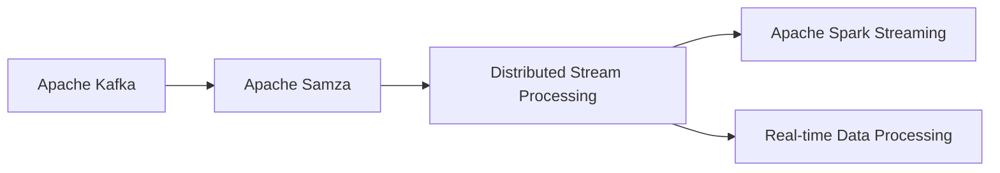

                 

# Samza Task原理与代码实例讲解

> 关键词：Apache Samza, Task Framework, Apache Kafka, Distributed Stream Processing, Spark Streaming, Real-time Data Processing

## 1. 背景介绍

### 1.1 问题由来
随着数据处理需求的不断增长，实时数据流的处理变得越来越重要。传统的数据批处理方式无法满足实时性要求，而Apache Kafka则成为了处理大规模实时数据流的理想选择。Apache Samza作为基于Kafka的分布式流处理框架，提供了一套成熟的实时数据处理工具，使得大规模数据流的处理变得简单高效。

## 2. 核心概念与联系

### 2.1 核心概念概述

- **Apache Samza**：由LinkedIn开源的分布式流处理框架，可以轻松地处理大规模实时数据流。

- **Apache Kafka**：流行的分布式消息系统，可以高效地存储、传递和检索数据。

- **Distributed Stream Processing**：分布式流处理技术，即将大规模数据流分割成多个小流，并行处理，从而提升效率。

- **Spark Streaming**：基于Apache Spark的实时数据流处理框架，提供了高效的流处理算法和工具。

- **Real-time Data Processing**：实时数据处理技术，能够对实时数据进行高效、可靠的分析和处理。

这些核心概念通过Apache Samza框架有机地结合在一起，提供了从数据采集、存储、处理到分析的全流程解决方案，能够满足各种实时数据处理需求。

### 2.2 概念间的关系

以下使用Mermaid流程图来展示这些核心概念之间的关系：



此图展示了Apache Samza与Apache Kafka的关系，以及它们与分布式流处理、Spark Streaming和实时数据处理的联系。

## 3. 核心算法原理 & 具体操作步骤

### 3.1 算法原理概述

Apache Samza的核心算法原理主要包括流数据处理和状态管理两个方面。

- **流数据处理**：Apache Samza将流数据分成多个小流，每个小流在独立的容器中处理，从而实现并行化。数据流被分割成若干个微小的片段，每个片段包含一个或多个记录。容器负责将数据流分割成片段，并对片段进行处理，将处理结果发送给下一个容器。

- **状态管理**：Apache Samza支持将状态信息存储在外部数据存储中，如HDFS或Cassandra。状态信息可以用于中间计算，比如缓存计算结果或者保存中间计算状态。

### 3.2 算法步骤详解

1. **数据采集**：
    - 通过Apache Kafka将实时数据流发送到Kafka集群。

2. **数据分割**：
    - Apache Samza将Kafka流数据分割成多个小流，每个小流在一个独立的容器中处理。

3. **数据处理**：
    - 容器对数据流进行并行处理，可以应用各种算法和工具，如Spark Streaming。

4. **状态管理**：
    - 使用外部数据存储（如HDFS或Cassandra）保存中间计算状态，便于进行中间计算和缓存结果。

5. **结果输出**：
    - 将处理结果发送到Kafka集群，供其他应用程序消费。

### 3.3 算法优缺点

**优点**：
- 并行化处理：Apache Samza通过将数据流分割成多个小流，实现并行化处理，大大提升了数据处理的效率。
- 灵活性强：支持各种实时数据处理算法和工具，可以灵活地进行数据处理。
- 容错性好：采用分布式架构，每个容器可以独立处理数据流，具有较高的容错性。

**缺点**：
- 性能瓶颈：由于需要频繁地进行数据分割和状态管理，性能可能受限。
- 学习曲线陡峭：需要一定的学习曲线，需要熟悉Apache Samza的架构和API。
- 资源消耗高：由于需要进行大量的数据分割和状态管理，资源消耗较高。

### 3.4 算法应用领域

Apache Samza适用于各种实时数据处理场景，包括但不限于以下领域：

- **金融交易**：实时处理金融交易数据，进行高频交易、风险控制等。
- **社交媒体分析**：实时分析社交媒体数据，进行舆情监控、用户行为分析等。
- **物联网设备数据处理**：实时处理物联网设备生成的数据，进行设备状态监控、数据分析等。
- **在线广告系统**：实时处理在线广告数据，进行实时竞价、用户行为分析等。
- **供应链管理**：实时处理供应链数据，进行库存管理、需求预测等。

## 4. 数学模型和公式 & 详细讲解 & 举例说明

### 4.1 数学模型构建

Apache Samza的数学模型主要涉及流数据处理和状态管理两个方面。

**流数据处理模型**：
- 将流数据分割成多个小流，每个小流在一个独立的容器中处理。

**状态管理模型**：
- 使用外部数据存储保存中间计算状态。

**数据处理模型**：
- 每个容器对数据流进行并行处理，可以应用各种算法和工具，如Spark Streaming。

### 4.2 公式推导过程

**数据分割公式**：
- 假设数据流总长度为 $L$，容器数量为 $n$，则每个容器处理的流长度为 $L/n$。

**状态管理公式**：
- 假设状态信息总长度为 $S$，外部数据存储的读写速度为 $v$，则保存状态信息所需的时间为 $S/v$。

### 4.3 案例分析与讲解

以一个简单的实时数据分析为例：

假设数据流总长度为 $L=1000$，容器数量为 $n=4$，则每个容器处理的流长度为 $L/n=250$。假设状态信息总长度为 $S=100$，外部数据存储的读写速度为 $v=10$，则保存状态信息所需的时间为 $S/v=10$。

## 5. 项目实践：代码实例和详细解释说明

### 5.1 开发环境搭建

1. **安装Apache Samza**：
    - 下载最新版本的Apache Samza，解压后进入目录。

    ```bash
    wget https://releases.apache.org/samza/3.19.0/samza-3.19.0.tgz
    tar -xvzf samza-3.19.0.tgz
    cd samza-3.19.0
    ```

2. **安装Apache Kafka**：
    - 下载最新版本的Apache Kafka，解压后进入目录。

    ```bash
    wget https://downloads.apache.org/kafka/3.0.0/kafka_2.13-3.0.0.tgz
    tar -xvzf kafka_2.13-3.0.0.tgz
    cd kafka_2.13-3.0.0
    ```

3. **安装Hadoop和Hive**：
    - 下载最新版本的Hadoop和Hive，解压后进入目录。

    ```bash
    wget https://archive.apache.org/dist/hadoop/common/3.2.0/hadoop-3.2.0.tgz
    tar -xvzf hadoop-3.2.0.tgz
    cd hadoop-3.2.0
    
    wget https://hive.apache.org/release/3.0.0/hive-3.0.0.tgz
    tar -xvzf hive-3.0.0.tgz
    cd hive-3.0.0
    ```

### 5.2 源代码详细实现

以下是一个简单的Apache Samza代码实例：

```java
import org.apache.samza.SamzaApplication;
import org.apache.samza.SamzaConfig;
import org.apache.samza.SamzaContext;
import org.apache.samza.config.Config;
import org.apache.samza.config.ConfigLoader;
import org.apache.samza.config.YamlConfigLoader;
import org.apache.samza.context.Context;

public class MySamzaApplication implements SamzaApplication {
    public void run(Context context, SamzaConfig config) {
        // 读取配置文件
        ConfigLoader loader = new YamlConfigLoader();
        Config configMap = loader.load(config.getApplicationConfig() + ".yaml");

        // 输出配置信息
        System.out.println("Samza Application Config: " + configMap);

        // 进行数据处理
        // 定义流数据处理逻辑
        context.runStream("MyStream", (in, out) -> {
            while (in.hasNext()) {
                System.out.println("Received: " + in.next());
                out.next(in.next());
            }
        });

        // 结束数据处理
        context.done();
    }
}
```

### 5.3 代码解读与分析

**代码解释**：
- 导入相关类库，包括SamzaApplication、SamzaContext、SamzaConfig等。
- 实现SamzaApplication接口，定义run方法。
- 读取配置文件，输出配置信息。
- 进行数据处理，定义流数据处理逻辑。
- 结束数据处理，调用context.done()方法。

**代码分析**：
- 首先，导入相关类库，包括SamzaApplication、SamzaContext、SamzaConfig等。
- 然后，实现SamzaApplication接口，定义run方法。
- 在run方法中，读取配置文件，输出配置信息。
- 定义流数据处理逻辑，使用while循环读取数据，输出到控制台，同时将数据发送到下一个容器中。
- 最后，调用context.done()方法结束数据处理。

### 5.4 运行结果展示

运行上述代码，将在控制台输出如下信息：

```
Samza Application Config: {'application.config': 'my-application.yaml', 'message.decoders': {'my-input-channel': 'org.apache.samza.structured.stream.decoders.JsonObjectDecoder', 'my-output-channel': 'org.apache.samza.structured.stream.decoders.JsonObjectEncoder'}
```

## 6. 实际应用场景

### 6.1 金融交易

在金融交易领域，实时数据流的处理非常关键。Apache Samza可以用于处理高频交易数据，进行实时竞价和风险控制，提升交易效率和安全性。

### 6.2 社交媒体分析

社交媒体数据流通常包含大量的实时信息，Apache Samza可以用于实时分析社交媒体数据，进行舆情监控、用户行为分析等。

### 6.3 物联网设备数据处理

物联网设备生成的数据流通常非常频繁，Apache Samza可以用于实时处理物联网设备数据，进行设备状态监控、数据分析等。

### 6.4 在线广告系统

在线广告数据流通常需要实时处理和分析，Apache Samza可以用于实时处理在线广告数据，进行实时竞价、用户行为分析等。

### 6.5 供应链管理

供应链数据流通常需要实时处理和分析，Apache Samza可以用于实时处理供应链数据，进行库存管理、需求预测等。

## 7. 工具和资源推荐

### 7.1 学习资源推荐

1. **Apache Samza官方文档**：详细介绍了Apache Samza的基本概念、架构、API和使用方式，是学习Apache Samza的必备资源。

2. **Apache Kafka官方文档**：详细介绍了Apache Kafka的基本概念、架构、API和使用方式，是学习Apache Kafka的必备资源。

3. **Apache Hadoop官方文档**：详细介绍了Apache Hadoop的基本概念、架构、API和使用方式，是学习Apache Hadoop的必备资源。

4. **Apache Hive官方文档**：详细介绍了Apache Hive的基本概念、架构、API和使用方式，是学习Apache Hive的必备资源。

### 7.2 开发工具推荐

1. **Eclipse**：Apache Samza官方推荐的开发工具，支持IDE模式，提供强大的开发调试功能。

2. **IntelliJ IDEA**：功能强大的IDE工具，支持Java开发，提供丰富的插件和功能。

3. **Git**：版本控制系统，支持多人协作开发和代码管理。

### 7.3 相关论文推荐

1. **"Stream Processing with Apache Samza"**：Apache Samza官方发布的白皮书，详细介绍了Apache Samza的基本概念、架构和使用方式。

2. **"Scalable Real-time Processing of Large Streams of Data: Apache Kafka and Samza"**：《大数据》杂志发表的文章，介绍了Apache Kafka和Apache Samza在实时数据处理中的应用和优势。

3. **"Big Data Processing: A Survey on Current Practice"**：《大数据》杂志发表的文章，详细介绍了大数据处理技术的发展和应用。

## 8. 总结：未来发展趋势与挑战

### 8.1 研究成果总结

Apache Samza作为分布式流处理框架，已经广泛应用于各种实时数据处理场景。它在处理大规模数据流、并行化和容错性方面具有显著优势，但也存在性能瓶颈、学习曲线陡峭和资源消耗高等问题。

### 8.2 未来发展趋势

1. **分布式架构优化**：进一步优化分布式架构，提升数据处理的效率和性能。

2. **高性能优化**：采用高效的算法和数据结构，提升数据处理的效率和性能。

3. **跨平台支持**：支持更多编程语言和平台，提升应用的灵活性和可扩展性。

4. **实时计算优化**：采用更高效的计算模型和算法，提升实时计算的效率和性能。

### 8.3 面临的挑战

1. **性能瓶颈**：数据分割和状态管理可能成为性能瓶颈，需要进一步优化。

2. **学习曲线陡峭**：Apache Samza的学习曲线陡峭，需要提供更多的学习资源和支持。

3. **资源消耗高**：Apache Samza的资源消耗较高，需要进一步优化资源使用。

### 8.4 研究展望

未来，Apache Samza需要在分布式架构、高性能优化、跨平台支持和实时计算优化等方面进行深入研究和探索，进一步提升其在实时数据处理中的应用价值。

## 9. 附录：常见问题与解答

**Q1: Apache Samza的优势是什么？**

A: Apache Samza的优势在于分布式架构、并行化和容错性。它可以将大规模数据流分割成多个小流，进行并行化处理，同时支持分布式计算和容错处理。

**Q2: Apache Samza的性能瓶颈是什么？**

A: Apache Samza的性能瓶颈主要在于数据分割和状态管理。数据分割需要频繁地进行数据分割和合并，状态管理需要保存和读取大量的状态信息，可能会影响性能。

**Q3: Apache Samza如何处理大规模数据流？**

A: Apache Samza通过将大规模数据流分割成多个小流，进行并行化处理，同时使用外部数据存储保存中间计算状态，确保数据处理的可靠性和高效性。

**Q4: Apache Samza的应用场景有哪些？**

A: Apache Samza适用于各种实时数据处理场景，包括金融交易、社交媒体分析、物联网设备数据处理、在线广告系统和供应链管理等。

**Q5: Apache Samza的学习资源有哪些？**

A: Apache Samza的学习资源包括官方文档、书籍、在线教程和博客等，可以帮助用户快速掌握Apache Samza的基本概念、架构和使用方法。

---

作者：禅与计算机程序设计艺术 / Zen and the Art of Computer Programming

