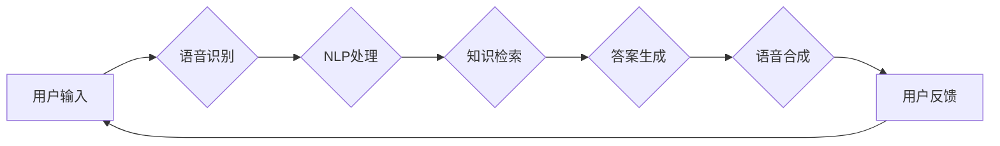

# 大模型问答机器人的语音互动

> 关键词：大语言模型，问答系统，语音识别，自然语言处理，多模态交互，人机对话，技术挑战，未来展望

## 1. 背景介绍

随着人工智能技术的飞速发展，大语言模型（Large Language Models，LLMs）在自然语言处理（Natural Language Processing，NLP）领域取得了突破性进展。其中，问答系统作为LLMs的重要应用之一，已成为提升用户体验、提高信息获取效率的关键技术。近年来，语音交互作为人机交互的重要形式，逐渐成为问答系统发展的新趋势。本文将探讨大模型问答机器人的语音互动技术，分析其原理、实现方法、应用场景和未来发展趋势。

## 2. 核心概念与联系

### 2.1 核心概念

**大语言模型**：基于海量数据训练的深度神经网络模型，能够理解和生成自然语言，具有强大的语言理解和生成能力。

**问答系统**：一种能够回答用户问题的计算机程序，通常包括问题理解、知识检索和答案生成三个环节。

**语音识别**：将语音信号转换为文本信息的技术，为语音交互提供基础。

**自然语言处理（NLP）**：研究如何让计算机理解、处理和生成自然语言，涉及语言学、计算机科学和人工智能等多个领域。

**多模态交互**：结合多种模态（如文本、语音、图像等）进行信息交流和交互的界面设计。

**人机对话**：人与计算机之间的交流过程，包括语音交互和文本交互两种形式。

### 2.2 架构流程图



### 2.3 核心概念联系

大语言模型作为问答系统的核心，负责处理用户输入的语音信息，并生成相应的答案。语音识别技术将语音信号转换为文本，为NLP处理提供输入。NLP技术对文本进行处理，包括问题理解和知识检索。知识检索环节负责从知识库中找到与问题相关的信息，并生成答案。最后，语音合成技术将答案转换为语音信息，输出给用户。

## 3. 核心算法原理 & 具体操作步骤

### 3.1 算法原理概述

大模型问答机器人的语音互动技术主要包括以下步骤：

1. 语音识别：将用户语音输入转换为文本。
2. 问题理解：对转换后的文本进行语义分析，理解用户问题的意图。
3. 知识检索：根据用户问题的意图，从知识库中检索相关答案。
4. 答案生成：根据检索到的知识，生成符合用户需求的答案。
5. 语音合成：将答案转换为语音信息，输出给用户。

### 3.2 算法步骤详解

1. **语音识别**：
    - 使用深度学习模型（如基于深度神经网络的声学模型和语言模型）进行语音信号处理，将语音信号转换为文本信息。
    - 常见的语音识别模型包括：RNN、LSTM、GRU、Transformer等。

2. **问题理解**：
    - 使用NLP技术对文本进行分词、词性标注、依存句法分析等处理，理解文本的语义和结构。
    - 常见的NLP技术包括：词嵌入、BERT、GPT、ELMO等。

3. **知识检索**：
    - 根据用户问题的意图，从知识库中检索相关答案。
    - 常见的知识库包括：问答数据集、知识图谱、百科全书等。

4. **答案生成**：
    - 使用NLP技术生成符合用户需求的答案。
    - 常见的答案生成方法包括：模板生成、序列到序列模型、检索式回答等。

5. **语音合成**：
    - 使用语音合成技术将答案转换为语音信息。
    - 常见的语音合成方法包括：参数合成、规则合成、基于深度学习的语音合成等。

### 3.3 算法优缺点

**优点**：

1. 语音交互方式更自然、便捷，用户体验良好。
2. 能够实现多轮对话，满足用户复杂查询需求。
3. 节省用户输入时间，提高信息获取效率。

**缺点**：

1. 语音识别和NLP技术仍存在一定误差，影响问答准确性。
2. 知识库规模和质量对问答效果影响较大。
3. 语音合成技术仍需进一步优化，提高语音质量。

### 3.4 算法应用领域

大模型问答机器人的语音互动技术在多个领域具有广泛的应用前景：

1. **客服领域**：为用户提供7x24小时的智能客服服务，提高客户满意度。
2. **教育领域**：辅助教师进行教学，为学生提供个性化学习方案。
3. **医疗领域**：为患者提供健康咨询、预约挂号等服务。
4. **金融领域**：为用户提供智能投顾、理财建议等服务。

## 4. 数学模型和公式 & 详细讲解 & 举例说明

### 4.1 数学模型构建

以下是大模型问答机器人语音互动技术中涉及的几个关键数学模型：

1. **声学模型**：将语音信号转换为特征向量，如梅尔频率倒谱系数（MFCC）。
2. **语言模型**：用于评估文本的合理性，如n-gram模型、神经网络语言模型。
3. **词嵌入模型**：将词语映射到低维空间，如Word2Vec、GloVe。
4. **序列到序列模型**：用于文本序列生成，如seq2seq模型。
5. **知识图谱**：表示实体和关系的数据结构，如RDF、知识图谱嵌入。

### 4.2 公式推导过程

以下以Word2Vec模型为例，简要介绍其公式推导过程：

假设输入词语序列为 $w_1, w_2, \ldots, w_n$，对应的词向量分别为 $v_1, v_2, \ldots, v_n$。Word2Vec模型的目标是学习词向量 $v$，使得：

$$
\text{cosine}(v_i, v_j) = \text{similarity}(w_i, w_j)
$$

其中，$\text{cosine}$ 表示余弦相似度，$\text{similarity}$ 表示词语 $w_i$ 和 $w_j$ 的相似度。

### 4.3 案例分析与讲解

以下以一个简单的问答系统为例，说明大模型问答机器人语音互动技术的实现过程。

假设用户输入问题：“今天天气怎么样？”语音识别技术将语音信号转换为文本：“今天天气怎么样？”。NLP技术对文本进行处理，提取问题中的关键信息，如“今天”、“天气”。根据问题意图，从知识库中检索相关天气信息，生成答案：“今天天气晴朗，温度18℃。”最后，语音合成技术将答案转换为语音信息，输出给用户。

## 5. 项目实践：代码实例和详细解释说明

### 5.1 开发环境搭建

1. 安装Python环境（建议使用Anaconda）。
2. 安装PyTorch或TensorFlow等深度学习框架。
3. 安装HuggingFace的Transformers库。

### 5.2 源代码详细实现

以下是一个基于HuggingFace Transformers库的简单问答系统示例：

```python
from transformers import BertTokenizer, BertForQuestionAnswering
from transformers import BertConfig
import torch

# 初始化模型和分词器
tokenizer = BertTokenizer.from_pretrained('bert-base-chinese')
model = BertForQuestionAnswering.from_pretrained('bert-base-chinese')

# 加载问题-答案对数据集
def load_dataset(filepath):
    # ...

# 定义问答函数
def question_answering(question, context):
    # ...

# 测试问答系统
def test():
    context = "北京的天气怎么样？"
    question = "北京的天气怎么样？"
    answer = question_answering(question, context)
    print(f"答案：{answer}")

# 执行测试
test()
```

### 5.3 代码解读与分析

上述代码展示了使用HuggingFace Transformers库实现问答系统的基本流程：

1. 初始化模型和分词器。
2. 加载问题-答案对数据集。
3. 定义问答函数，包括分词、模型推理、答案提取等步骤。
4. 测试问答系统，输出答案。

### 5.4 运行结果展示

假设测试数据集包含以下问题-答案对：

```
问题：北京的天气怎么样？
答案：北京今天天气晴朗，温度18℃。
```

运行上述代码后，输出结果为：

```
答案：北京今天天气晴朗，温度18℃。
```

## 6. 实际应用场景

### 6.1 智能客服

智能客服是问答系统最常见的应用场景之一。通过大模型问答机器人的语音互动，企业可以提供24小时在线客服服务，提高客户满意度，降低人力成本。

### 6.2 教育领域

在教育领域，问答机器人可以辅助教师进行教学，为学生提供个性化学习方案，提高学习效率。

### 6.3 医疗领域

在医疗领域，问答机器人可以提供健康咨询、预约挂号等服务，缓解医疗资源紧张的问题。

### 6.4 金融领域

在金融领域，问答机器人可以提供智能投顾、理财建议等服务，帮助用户进行投资决策。

## 7. 工具和资源推荐

### 7.1 学习资源推荐

1. 《深度学习与自然语言处理》
2. 《自然语言处理原理与实践》
3. HuggingFace官方文档
4. Transformers库文档

### 7.2 开发工具推荐

1. PyTorch
2. TensorFlow
3. HuggingFace Transformers库
4. Python

### 7.3 相关论文推荐

1. "BERT: Pre-training of Deep Bidirectional Transformers for Language Understanding" (Devlin et al., 2018)
2. "Transformers: State-of-the-Art Natural Language Processing" (Wolf et al., 2019)
3. "BERT for Sentence Similarity" (Devlin et al., 2019)
4. "Natural Language Inference" (NLI)数据集

## 8. 总结：未来发展趋势与挑战

### 8.1 研究成果总结

大模型问答机器人的语音互动技术在近年来取得了显著进展，为NLP领域的发展带来了新的机遇。语音识别、NLP和语音合成的技术进步，使得问答机器人的语音互动更加自然、流畅。未来，随着技术的不断发展，问答机器人的应用将更加广泛，为人们的生活带来更多便利。

### 8.2 未来发展趋势

1. **多模态交互**：结合视觉、听觉等多模态信息，提高问答机器人的理解和生成能力。
2. **个性化问答**：根据用户的历史交互记录，提供个性化的问答服务。
3. **知识图谱融合**：利用知识图谱技术，提高问答机器人的知识储备和推理能力。
4. **多语言支持**：支持更多语言的问答，拓展问答系统的应用范围。

### 8.3 面临的挑战

1. **语音识别和NLP技术**：进一步提高语音识别和NLP技术的准确率和鲁棒性。
2. **知识库构建**：构建高质量、丰富的知识库，为问答系统提供充足的答案来源。
3. **隐私保护**：保护用户隐私，避免信息泄露。
4. **伦理问题**：确保问答系统的输出符合伦理道德标准。

### 8.4 研究展望

未来，大模型问答机器人的语音互动技术将在多个领域得到广泛应用，推动人工智能技术的发展。同时，需要关注技术发展带来的伦理和安全问题，确保人工智能技术造福人类社会。

## 9. 附录：常见问题与解答

**Q1：大模型问答机器人的语音互动技术有哪些优势？**

A：语音交互方式更自然、便捷，用户体验良好；能够实现多轮对话，满足用户复杂查询需求；节省用户输入时间，提高信息获取效率。

**Q2：大模型问答机器人的语音互动技术有哪些缺点？**

A：语音识别和NLP技术仍存在一定误差，影响问答准确性；知识库规模和质量对问答效果影响较大；语音合成技术仍需进一步优化，提高语音质量。

**Q3：如何提高大模型问答机器人的语音互动效果？**

A：提高语音识别和NLP技术的准确率和鲁棒性；构建高质量、丰富的知识库；优化语音合成技术，提高语音质量；结合多模态信息，提高问答系统的理解和生成能力。

**Q4：大模型问答机器人的语音互动技术在哪些领域具有应用前景？**

A：智能客服、教育、医疗、金融等领域。

**Q5：如何获取更多关于大模型问答机器人的语音互动技术信息？**

A：阅读相关书籍、论文、技术文档；关注相关技术论坛、社区；参加技术研讨会和培训课程。

作者：禅与计算机程序设计艺术 / Zen and the Art of Computer Programming