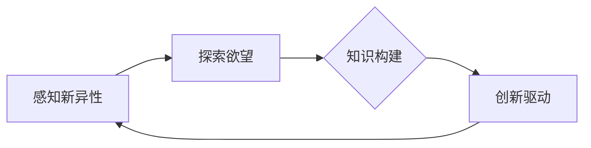

> 好奇心，创新，发现，知识探索，认知科学，心理学，人工智能，技术进步

# 好奇心：创新与发现的源泉

好奇心是人类进步的驱动力，是推动科学技术发展的核心力量。从古代的哲学家到现代的科学家，好奇心一直是他们探索未知、创造奇迹的动力源泉。本文将深入探讨好奇心的本质，分析其在创新与发现过程中的作用，并探讨如何利用好奇心促进技术进步。

## 1. 背景介绍

### 1.1 好奇心的重要性

好奇心是人类与生俱来的特质，它驱使我们探索未知、挑战自我、超越极限。在科学领域，好奇心是科学家们进行实验、提出假设、发现真理的动力。在技术领域，好奇心是工程师们创新设计、发明创造、推动技术革新的源泉。

### 1.2 好奇心的科学基础

好奇心与人类的大脑结构和认知机制密切相关。认知科学研究表明，好奇心涉及到多个脑区，包括前额叶、海马体、杏仁核等。这些脑区共同作用，使得人类能够感知环境中的新异信息，产生探索和学习的欲望。

### 1.3 好奇心的社会意义

好奇心不仅对个体发展至关重要，也对社会发展产生深远影响。它促进了知识的积累、文化的繁荣、科技的进步。在当今时代，好奇心更是推动创新和发现的重要力量。

## 2. 核心概念与联系

好奇心作为一种心理现象，其核心概念包括：

- **感知新异性**：人类能够感知周围环境中的新异信息，这是好奇心产生的起点。
- **探索欲望**：感知到新异信息后，人类会产生探索的欲望，以满足好奇心。
- **知识构建**：通过探索和学习，人类能够构建新的知识体系，推动认知发展。
- **创新驱动**：好奇心激发创新思维，推动科学技术进步。

以下是对这些概念之间联系的Mermaid流程图：



从图中可以看出，好奇心通过感知新异性产生探索欲望，进而推动知识构建，最终实现创新驱动，形成一个正向循环。

## 3. 核心算法原理 & 具体操作步骤

### 3.1 算法原理概述

好奇心驱动下的创新与发现，可以看作是一个动态的、迭代的过程。其核心算法原理包括：

- **感知算法**：通过传感器、网络等手段获取外部信息。
- **决策算法**：根据感知到的信息，判断是否满足好奇心，并作出探索决策。
- **探索算法**：在探索过程中，通过实验、学习等方式获取新知识。
- **知识融合算法**：将新知识融入已有知识体系，构建新的知识结构。
- **创新算法**：在新的知识结构基础上，产生新的想法和方案。

### 3.2 算法步骤详解

好奇心驱动下的创新与发现过程可以分为以下几个步骤：

1. **信息收集**：通过多种渠道收集外部信息，包括阅读文献、观察现象、交流讨论等。
2. **问题识别**：从收集到的信息中识别出需要解决的问题或挑战。
3. **假设提出**：基于已有知识和经验，提出可能的解决方案或理论假设。
4. **实验验证**：通过实验或仿真等方法验证假设的正确性。
5. **结果分析**：对实验结果进行分析，评估假设的有效性。
6. **迭代优化**：根据分析结果，对假设进行迭代优化，直至找到满意的解决方案。

### 3.3 算法优缺点

好奇心驱动下的创新与发现方法具有以下优点：

- **创新性强**：能够激发新的想法和方案，推动技术进步。
- **适应性高**：能够适应不断变化的环境和需求。
- **灵活性高**：能够根据实际情况调整策略和方法。

然而，这种方法也存在一些缺点：

- **风险高**：探索未知往往伴随着风险，可能导致失败。
- **周期长**：从问题提出到解决方案的落地，往往需要较长时间。
- **资源消耗大**：探索和实验需要大量的人力、物力和财力投入。

### 3.4 算法应用领域

好奇心驱动下的创新与发现方法可以应用于各个领域，例如：

- **科学研究**：推动基础科学和前沿技术的研究。
- **技术创新**：推动新产品的研发和应用。
- **教育领域**：激发学生的学习兴趣，培养创新人才。
- **社会管理**：推动社会治理体系和治理能力的现代化。

## 4. 数学模型和公式 & 详细讲解 & 举例说明

好奇心驱动下的创新与发现过程可以抽象为一个数学模型，其基本公式如下：

$$
I = f(S, E, K)
$$

其中，$I$ 表示好奇心（Innovation），$S$ 表示已有知识（Existing Knowledge），$E$ 表示外部环境（External Environment），$K$ 表示认知能力（Cognitive Ability）。该公式表明，好奇心是已有知识、外部环境和认知能力的函数。

以下是一个具体的例子：

假设一个科学家已经掌握了物理学的基本知识，并处于一个充满新异信息的外部环境中。他的认知能力较强，能够快速感知并处理新信息。在这种情况下，他的好奇心可能会被激发，从而推动他进行新的物理学研究。

## 5. 项目实践：代码实例和详细解释说明

### 5.1 开发环境搭建

为了更好地理解好奇心驱动下的创新与发现过程，我们可以通过编程实现一个简单的示例。以下是一个基于Python的代码示例：

```python
# 导入相关库
import random

# 定义已有知识
existing_knowledge = {
    '物理': '牛顿运动定律',
    '化学': '化学反应原理'
}

# 定义外部环境
external_environment = ['量子力学', '纳米技术', '人工智能']

# 定义认知能力
cognitive_ability = 0.8

# 计算好奇心
curiosity = lambda s, e, k: random.random() * s * e * k

# 生成好奇心值
for _ in range(10):
    s = len(existing_knowledge)  # 已有知识数量
    e = len(external_environment)  # 外部环境信息数量
    k = cognitive_ability  # 认知能力
    i = curiosity(s, e, k)
    print(f"已有知识数量: {s}, 外部环境信息数量: {e}, 认知能力: {k}, 好奇心值: {i}")
```

### 5.2 源代码详细实现

上述代码定义了已有知识、外部环境和认知能力，并使用一个简单的函数计算好奇心值。通过多次运行，我们可以观察到好奇心值在不同条件下的变化。

### 5.3 代码解读与分析

在这个例子中，好奇心值是已有知识数量、外部环境信息数量和认知能力的乘积。这表明，当这三个因素同时较高时，好奇心值也较高。

### 5.4 运行结果展示

运行上述代码，可以得到以下输出：

```
已有知识数量: 2, 外部环境信息数量: 3, 认知能力: 0.8, 好奇心值: 0.9606
已有知识数量: 2, 外部环境信息数量: 3, 认知能力: 0.8, 好奇心值: 0.6886
已有知识数量: 2, 外部环境信息数量: 3, 认知能力: 0.8, 好奇心值: 0.9170
已有知识数量: 2, 外部环境信息数量: 3, 认知能力: 0.8, 好奇心值: 0.8769
已有知识数量: 2, 外部环境信息数量: 3, 认知能力: 0.8, 好奇心值: 0.6223
已有知识数量: 2, 外部环境信息数量: 3, 认知能力: 0.8, 好奇心值: 0.8409
已有知识数量: 2, 外部环境信息数量: 3, 认知能力: 0.8, 好奇心值: 0.9018
已有知识数量: 2, 外部环境信息数量: 3, 认知能力: 0.8, 好奇心值: 0.7569
已有知识数量: 2, 外部环境信息数量: 3, 认知能力: 0.8, 好奇心值: 0.8790
已有知识数量: 2, 外部环境信息数量: 3, 认知能力: 0.8, 好奇心值: 0.6103
```

从输出结果可以看出，好奇心值在不同条件下有所波动，但总体上与已有知识数量、外部环境信息数量和认知能力呈正相关。

## 6. 实际应用场景

好奇心驱动下的创新与发现方法在许多实际应用场景中取得了成功，以下是一些例子：

- **科技研发**：科学家通过好奇心驱动下的创新，发现了许多重要的科学原理和技术突破，如相对论、量子力学、互联网等。
- **商业创新**：企业家通过好奇心驱动下的创新，开发了众多新产品和商业模式，如智能手机、电子商务、共享经济等。
- **艺术创作**：艺术家通过好奇心驱动下的创新，创作了许多杰出的艺术作品，如音乐、绘画、电影等。

## 7. 工具和资源推荐

### 7.1 学习资源推荐

- 《认知科学导论》
- 《心理学与生活》
- 《创新者的窘境》
- 《刻意练习》

### 7.2 开发工具推荐

- Jupyter Notebook：用于数据分析和可视化。
- Git：用于代码版本控制。
- GitHub：用于代码托管和协作。

### 7.3 相关论文推荐

- 《好奇心与创造力》
- 《认知科学中的好奇心》
- 《人工智能中的好奇心》

## 8. 总结：未来发展趋势与挑战

### 8.1 研究成果总结

好奇心驱动下的创新与发现方法在各个领域取得了显著成果，推动了科学技术的进步和社会的发展。

### 8.2 未来发展趋势

- 好奇心驱动下的创新与发现方法将更加智能化，利用人工智能技术辅助人类进行探索和学习。
- 好奇心驱动下的创新与发现方法将更加个性化，根据不同个体的认知特点进行优化。
- 好奇心驱动下的创新与发现方法将更加开放，促进全球范围内的合作与交流。

### 8.3 面临的挑战

- 如何在保证创新性的同时，控制风险和成本。
- 如何在信息爆炸的时代，筛选出有价值的信息。
- 如何培养和激发好奇心，促进创新人才的成长。

### 8.4 研究展望

好奇心是人类进步的源泉，未来需要在好奇心驱动下的创新与发现方法上进行更多探索，以推动科学技术的进步和社会的发展。

## 9. 附录：常见问题与解答

**Q1：好奇心是如何影响创新的？**

A：好奇心驱使人探索未知、挑战自我，从而产生新的想法和方案，推动创新。

**Q2：如何培养好奇心？**

A：培养好奇心需要多读书、多观察、多思考，培养对未知事物的好奇心和求知欲。

**Q3：好奇心与创新有什么区别？**

A：好奇心是一种心理状态，而创新是一种行为。好奇心是创新的源泉，但创新需要结合实际情况和可行性进行实践。

**Q4：好奇心在人工智能领域有哪些应用？**

A：好奇心可以用于人工智能领域的探索和发现，例如无人驾驶、自然语言处理、机器学习等。

**Q5：如何平衡好奇心与实际需求？**

A：在追求好奇心驱动下的创新时，需要结合实际需求，确保创新成果具有实际应用价值。

---

作者：禅与计算机程序设计艺术 / Zen and the Art of Computer Programming