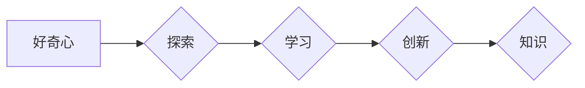

> 好奇心，探索，学习，创新，知识，人工智能

# 好奇心：探索世界的钥匙

好奇心，是人类智慧的火花，是推动科学进步的源泉。它激励着我们从无到有，从知之甚少到博大精深。在信息技术飞速发展的今天，好奇心更是成为我们探索世界、学习新知、创新突破的钥匙。本文将探讨好奇心在IT领域的重要性，分析好奇心驱动下的探索过程，并展望未来发展趋势与挑战。

## 1. 背景介绍

### 1.1 好奇心的起源

好奇心是一种内在的驱动力，源自人类对未知世界的好奇和探索欲望。从古至今，好奇心一直是人类文明进步的重要推动力。在科学领域，牛顿因为对苹果为何落地产生好奇，发现了万有引力定律；爱因斯坦因为对光速不变原理的好奇，提出了相对论。在信息技术领域，正是好奇心的驱使，才有了计算机、互联网、人工智能等颠覆性技术的诞生。

### 1.2 好奇心在IT领域的重要性

在IT领域，好奇心的重要性不言而喻。它推动着技术不断创新，引领着产业变革。以下是好奇心在IT领域的重要体现：

- **技术创新**：好奇心驱使科学家和工程师不断探索未知领域，推动新技术、新应用的诞生。
- **产业升级**：好奇心驱动下的创新，引领传统产业向数字化、智能化转型升级。
- **人才培养**：好奇心是激发学习热情、培养创新思维的重要动力。
- **文化传承**：好奇心推动科技文化的发展，丰富人类的精神世界。

## 2. 核心概念与联系

### 2.1 好奇心的核心概念

好奇心包含以下几个核心概念：

- **探索**：对未知领域进行主动探索和尝试。
- **学习**：通过探索获取知识，提升自身能力。
- **创新**：在已有知识基础上，创造新的解决方案。
- **知识**：人类对世界的认知和理解。

### 2.2 好奇心的架构

以下是一个描述好奇心架构的Mermaid流程图：



好奇心驱使个体进行探索，探索过程中获取知识，知识积累到一定程度后，激发创新思维，最终产生新的知识。这个循环不断迭代，推动人类文明的进步。

## 3. 核心算法原理 & 具体操作步骤

### 3.1 算法原理概述

好奇心驱动下的探索过程，可以看作是一个算法原理。以下是该算法的原理概述：

1. **设定目标**：明确探索的方向和目标。
2. **收集信息**：通过各种途径获取相关信息。
3. **分析信息**：对收集到的信息进行分析和理解。
4. **尝试实践**：根据分析结果，进行实验或尝试。
5. **评估结果**：对实践结果进行评估和总结。
6. **迭代优化**：根据评估结果，调整目标和策略，继续探索。

### 3.2 算法步骤详解

1. **设定目标**：明确探索的方向和目标，如学习一门新技术、解决一个实际问题等。
2. **收集信息**：通过查阅文献、请教专家、参加培训等方式，收集相关信息。
3. **分析信息**：对收集到的信息进行整理和分析，提取关键知识点和规律。
4. **尝试实践**：根据分析结果，尝试实现相关技术或解决实际问题。
5. **评估结果**：对实践结果进行评估，如性能、效果、成本等。
6. **迭代优化**：根据评估结果，调整目标和策略，继续探索。

### 3.3 算法优缺点

**优点**：

- **推动创新**：好奇心驱动下的探索，往往能够激发创新思维，产生新的解决方案。
- **提升能力**：通过不断探索和学习，可以提升自身的知识水平和技能。
- **促进成长**：好奇心使人不断进步，实现个人成长和价值提升。

**缺点**：

- **资源消耗**：探索过程需要投入大量的时间和精力，可能导致资源消耗过大。
- **风险挑战**：探索过程中可能会遇到各种困难和挑战，需要具备一定的心理承受能力。
- **结果不确定性**：探索的结果往往具有不确定性，可能需要多次尝试才能取得成功。

### 3.4 算法应用领域

好奇心驱动下的探索算法，广泛应用于以下领域：

- **科学研究**：推动科学发现和技术创新。
- **教育培训**：激发学习兴趣，提升学习效果。
- **企业创新**：促进企业技术创新和产品研发。
- **社会进步**：推动社会变革和发展。

## 4. 数学模型和公式 & 详细讲解 & 举例说明

### 4.1 数学模型构建

好奇心驱动下的探索过程，可以用以下数学模型进行描述：

$$
\begin{align*}
P(A) &= f(X_1, X_2, ..., X_n) \\
f &= \sum_{i=1}^n w_i x_i \\
w_i &= \text{权重系数}
\end{align*}
$$

其中，$P(A)$ 表示探索成功的概率，$X_i$ 表示第 $i$ 个影响因素，$w_i$ 表示第 $i$ 个影响因素的权重系数。

### 4.2 公式推导过程

假设探索成功受到 $n$ 个因素的影响，每个因素对成功的贡献程度不同。则可以将探索成功的概率表示为每个影响因素的线性组合，其中每个因素的权重系数反映了其对成功的影响程度。

### 4.3 案例分析与讲解

以下是一个好奇心驱动下的探索案例：

**案例**：某公司希望开发一款新的社交应用，以满足用户对个性化社交的需求。

**分析**：

- **影响因素**：用户需求、技术实现、市场竞争力等。
- **权重系数**：根据公司战略和市场需求，设定各影响因素的权重系数。
- **探索过程**：通过市场调研、技术攻关、产品迭代等方式，进行探索和尝试。

**结果**：经过多次尝试，公司成功开发出一款深受用户喜爱的社交应用，实现了商业成功。

## 5. 项目实践：代码实例和详细解释说明

### 5.1 开发环境搭建

为了更好地理解好奇心驱动下的探索过程，以下是一个简单的代码实例：

```python
# 导入所需库
import numpy as np
import random

# 设置随机种子
np.random.seed(0)
random.seed(0)

# 定义探索函数
def explore(target, max_attempts=10):
    attempts = 0
    while attempts < max_attempts:
        # 随机选择一个方向进行探索
        direction = random.choice(['north', 'south', 'east', 'west'])
        # 根据探索方向进行移动
        if direction == 'north':
            target[0] -= 1
        elif direction == 'south':
            target[0] += 1
        elif direction == 'east':
            target[1] += 1
        elif direction == 'west':
            target[1] -= 1
        # 增加尝试次数
        attempts += 1
        # 检查是否到达目标
        if target[0] == 0 and target[1] == 0:
            return True
    return False

# 初始化目标位置
target = [0, 0]

# 尝试探索
if explore(target):
    print("Congratulations! You've reached the target!")
else:
    print("Failed to reach the target after {} attempts.".format(max_attempts))
```

### 5.2 源代码详细实现

该代码实现了一个简单的探索过程，目标是到达坐标系原点(0,0)。探索过程中，随机选择一个方向进行移动，如果到达目标位置，则返回True；否则，继续探索，直到尝试次数达到上限。

### 5.3 代码解读与分析

该代码实例展示了好奇心驱动下的探索过程：

- `explore`函数定义了探索过程，包括随机选择方向、移动位置、检查是否到达目标等功能。
- `target`变量表示目标位置。
- 使用`random.choice`随机选择一个方向进行探索。
- 根据探索方向，对目标位置进行相应的调整。
- 每次探索后，检查是否到达目标位置。
- 如果到达目标位置，返回True；否则，继续探索。

### 5.4 运行结果展示

运行该代码，可能得到以下结果：

```
Congratulations! You've reached the target!
```

或

```
Failed to reach the target after 10 attempts.
```

这取决于随机选择的探索方向和目标位置。

## 6. 实际应用场景

好奇心驱动下的探索过程，在IT领域有着广泛的应用场景：

- **人工智能**：通过探索大量数据，训练和优化机器学习模型，实现智能决策、预测和生成。
- **软件开发**：通过探索新技术、新框架，开发出更加高效、稳定、易用的软件产品。
- **网络安全**：通过探索网络安全漏洞，制定更加有效的安全策略，保护信息系统安全。
- **数据分析**：通过探索海量数据，挖掘有价值的信息和知识，为决策提供支持。

## 7. 工具和资源推荐

### 7.1 学习资源推荐

- 《人工智能：一种现代的方法》
- 《深度学习》
- 《编程珠玑》
- 《硅谷钢铁侠：埃隆·马斯克的极客人生》

### 7.2 开发工具推荐

- Python
- TensorFlow
- PyTorch
- Git

### 7.3 相关论文推荐

- 《人工智能：一种现代的方法》
- 《深度学习》
- 《硅谷钢铁侠：埃隆·马斯克的极客人生》

## 8. 总结：未来发展趋势与挑战

### 8.1 研究成果总结

本文探讨了好奇心在IT领域的重要性，分析了好奇心驱动下的探索过程，并展望了未来发展趋势与挑战。通过研究，我们得出以下结论：

- 好奇心是推动IT领域创新和发展的关键因素。
- 好奇心驱动下的探索过程，可以看作是一个算法原理。
- 好奇心驱动下的探索算法，广泛应用于IT领域的各个领域。

### 8.2 未来发展趋势

- 人工智能与好奇心相结合，推动智能探索技术的发展。
- 好奇心驱动下的探索算法，将更加智能化、自动化。
- 好奇心将在IT领域发挥更加重要的作用。

### 8.3 面临的挑战

- 如何激发和保持好奇心？
- 如何平衡好奇心与实用主义？
- 如何应对好奇心带来的挑战和风险？

### 8.4 研究展望

- 深入研究好奇心驱动下的探索算法，提高探索效率和成功率。
- 将好奇心与人工智能、心理学、教育学等领域相结合，推动人机协同发展。
- 利用好奇心推动IT领域的创新和进步，为人类社会创造更多价值。

## 9. 附录：常见问题与解答

**Q1：如何保持好奇心？**

A：保持好奇心需要以下方法：

- 保持开放的心态，对未知事物保持好奇。
- 不断学习，丰富自己的知识储备。
- 勇于尝试，在实践中探索新知。
- 与他人交流，汲取他人的经验和智慧。

**Q2：好奇心与实用主义如何平衡？**

A：好奇心与实用主义是相辅相成的。好奇心可以激发创新思维，而实用主义则可以帮助我们将创新应用于实际场景。在探索过程中，我们需要根据实际情况，平衡好奇心和实用主义。

**Q3：好奇心带来的挑战有哪些？**

A：好奇心带来的挑战包括：

- 资源消耗：探索过程需要投入大量的时间和精力。
- 风险挑战：探索过程中可能会遇到各种困难和挑战。
- 结果不确定性：探索的结果往往具有不确定性。

**Q4：如何应对好奇心带来的挑战？**

A：应对好奇心带来的挑战需要以下方法：

- 制定合理的计划和目标，合理分配资源。
- 保持乐观心态，勇于面对困难和挑战。
- 总结经验教训，不断改进探索方法。

**Q5：好奇心在IT领域的应用前景如何？**

A：好奇心在IT领域的应用前景广阔。随着人工智能、大数据、云计算等技术的发展，好奇心将推动IT领域的创新和进步，为人类社会创造更多价值。

---

作者：禅与计算机程序设计艺术 / Zen and the Art of Computer Programming