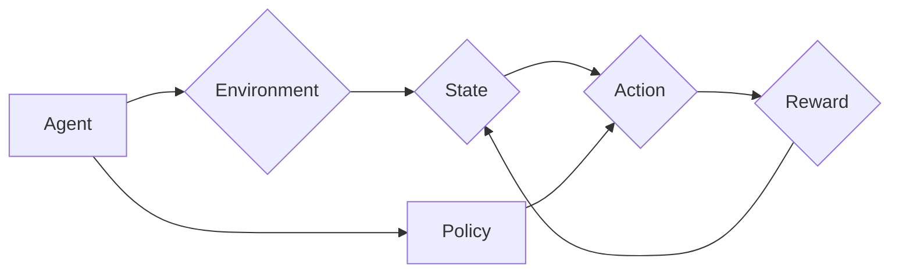

> 强化学习, 代理学习, Q学习, SARSA, DQN, PPO, A3C, 探索-利用, 奖励最大化, 策略梯度

# 强化学习Reinforcement Learning原理与核心算法概述

强化学习（Reinforcement Learning，RL）是一种通过与环境交互来学习如何采取最优动作的机器学习方法。它与监督学习和无监督学习不同，强化学习通过奖励信号来指导学习过程，使代理（Agent）能够学习到如何在与环境的交互中做出最优决策。

## 1. 背景介绍

强化学习起源于20世纪50年代，最初在心理学和神经科学领域进行研究。随着深度学习技术的兴起，强化学习在近年来取得了显著的进展，并在游戏、机器人、自动驾驶、推荐系统等领域得到了广泛的应用。

## 2. 核心概念与联系

### 2.1 核心概念

- **代理（Agent）**：强化学习中的学习实体，它通过与环境交互来获取奖励信号，并学习如何采取最优动作。
- **环境（Environment）**：代理所处的世界，它根据代理的动作产生状态转移和奖励。
- **状态（State）**：代理所处的环境的一个描述，通常用向量表示。
- **动作（Action）**：代理可以采取的动作，通常用向量表示。
- **奖励（Reward）**：代理采取动作后获得的奖励信号，用于指导学习过程。
- **策略（Policy）**：代理选择动作的规则，可以是确定性策略或随机策略。
- **价值函数（Value Function）**：表示代理在当前状态下采取特定动作的期望回报。
- **模型（Model）**：对环境的动态进行建模的函数。

### 2.2 Mermaid 流程图



### 2.3 核心概念联系

代理通过与环境交互，根据策略选择动作，并在采取动作后获取奖励，从而学习如何采取最优动作。

## 3. 核心算法原理 & 具体操作步骤

### 3.1 算法原理概述

强化学习算法的核心思想是学习一个策略，使得代理能够在给定的环境中采取最优动作，以最大化累积奖励。

### 3.2 算法步骤详解

1. **初始化**：初始化代理、环境、策略和价值函数。
2. **探索-利用**：在策略学习过程中，代理需要探索未知状态和动作，同时利用已有的知识来采取动作。
3. **动作选择**：代理根据策略选择动作。
4. **与环境交互**：代理采取动作，环境根据动作产生新的状态和奖励。
5. **更新策略和价值函数**：根据奖励信号更新策略和价值函数。
6. **重复步骤2-5**：不断重复以上步骤，直到满足终止条件。

### 3.3 算法优缺点

**优点**：

- 不需要大量标注数据。
- 能够处理连续动作空间。
- 能够学习到复杂的决策策略。

**缺点**：

- 学习过程可能非常耗时。
- 需要设计合适的奖励函数。
- 可能陷入局部最优解。

### 3.4 算法应用领域

- 游戏：如Atari游戏、围棋、电子竞技等。
- 机器人：如无人驾驶、机器臂控制等。
- 自动驾驶：如路径规划、交通信号控制等。
- 推荐系统：如商品推荐、新闻推荐等。

## 4. 数学模型和公式 & 详细讲解 & 举例说明

### 4.1 数学模型构建

强化学习中的数学模型主要包括状态空间、动作空间、奖励函数、策略、价值函数和模型等。

### 4.2 公式推导过程

假设代理采取动作 $a_t$ 后，进入状态 $s_t$，并获得奖励 $r_t$，则强化学习的基本公式为：

$$
V(s_t) = \sum_{s_{t+1}} \gamma V(s_{t+1}) P(s_{t+1}|s_t, a_t)
$$

其中，$V(s_t)$ 表示在状态 $s_t$ 的价值函数，$\gamma$ 表示折现因子，$P(s_{t+1}|s_t, a_t)$ 表示在状态 $s_t$ 采取动作 $a_t$ 后进入状态 $s_{t+1}$ 的概率。

### 4.3 案例分析与讲解

以下以Q学习算法为例，讲解强化学习算法的具体实现。

### 4.3.1 Q学习算法

Q学习是一种基于值函数的强化学习算法，其目标是最小化以下损失函数：

$$
L(\theta) = \sum_{s,a} (r + \gamma \max_{a'} Q(s,a';\theta) - Q(s,a;\theta))^2
$$

其中，$Q(s,a;\theta)$ 表示在状态 $s$ 采取动作 $a$ 的价值函数，$\theta$ 表示模型参数。

### 4.3.2 代码实例

以下使用Python实现Q学习算法：

```python
import numpy as np

class QLearning:
    def __init__(self, actions, learning_rate=0.1, discount_factor=0.99):
        self.actions = actions
        self.q_table = np.zeros([len(self.actions), len(self.actions)])
        self.learning_rate = learning_rate
        self.discount_factor = discount_factor

    def get_action(self, state):
        if np.random.uniform(0, 1) < self.epsilon:
            # 探索
            action = np.random.choice(self.actions)
        else:
            # 利用
            action = np.argmax(self.q_table[state])
        return action

    def update(self, state, action, reward, next_state):
        self.q_table[state][action] = (1 - self.learning_rate) * self.q_table[state][action] + self.learning_rate * (reward + self.discount_factor * np.max(self.q_table[next_state]))

# 示例
actions = ['up', 'down', 'left', 'right']
agent = QLearning(actions)
```

## 5. 项目实践：代码实例和详细解释说明

### 5.1 开发环境搭建

由于篇幅限制，此处不进行详细的开发环境搭建说明。但一般来说，需要安装Python、PyTorch等工具，以及相应的依赖库。

### 5.2 源代码详细实现

以下使用PyTorch实现强化学习中的Deep Q Network（DQN）算法：

```python
import torch
import torch.nn as nn
import torch.optim as optim
from collections import deque
import random

class DQN:
    def __init__(self, state_dim, action_dim, hidden_dim):
        self.state_dim = state_dim
        self.action_dim = action_dim
        self.hidden_dim = hidden_dim
        self.model = nn.Sequential(
            nn.Linear(self.state_dim, self.hidden_dim),
            nn.ReLU(),
            nn.Linear(self.hidden_dim, self.hidden_dim),
            nn.ReLU(),
            nn.Linear(self.hidden_dim, self.action_dim),
        )
        self.target_model = self.model.copy()
        self.optimizer = optim.Adam(self.model.parameters(), lr=0.001)
        self.loss_fn = nn.MSELoss()
        self.memory = deque(maxlen=1000)
        self.epsilon = 1.0
        self.epsilon_min = 0.01
        self.epsilon_decay = 0.995
        self.gamma = 0.99

    def choose_action(self, state):
        if random.uniform(0, 1) < self.epsilon:
            return random.randint(0, self.action_dim - 1)
        with torch.no_grad():
            state = torch.tensor(state, dtype=torch.float32).unsqueeze(0)
            actions_values = self.model(state)
            action = torch.argmax(actions_values).item()
        return action

    def remember(self, state, action, reward, next_state, done):
        self.memory.append((state, action, reward, next_state, done))

    def learn(self):
        if len(self.memory) < 32:
            return
        batch = random.sample(self.memory, 32)
        states, actions, rewards, next_states, dones = zip(*batch)
        states = torch.tensor(states, dtype=torch.float32)
        next_states = torch.tensor(next_states, dtype=torch.float32)
        actions = torch.tensor(actions)
        rewards = torch.tensor(rewards, dtype=torch.float32)
        dones = torch.tensor(dones, dtype=torch.float32)
        next_state_values = self.target_model(next_states).detach()
        Q_targets_next = next_state_values.max(1)[0].unsqueeze(1)
        Q_targets = rewards + self.gamma * Q_targets_next * (1 - dones)
        Q_expected = self.model(states).gather(1, actions.unsqueeze(1))
        loss = self.loss_fn(Q_expected, Q_targets)
        self.optimizer.zero_grad()
        loss.backward()
        self.optimizer.step()
        self.epsilon = max(self.epsilon_min, self.epsilon_decay * self.epsilon)

# 示例
state_dim = 4
action_dim = 2
hidden_dim = 24
agent = DQN(state_dim, action_dim, hidden_dim)
```

### 5.3 代码解读与分析

以上代码实现了一个简单的DQN算法，包括状态选择、经验回放和模型训练等环节。

- `DQN`类：定义了DQN模型的初始化、状态选择、记忆存储和模型训练等方法。
- `choose_action`方法：根据ε-greedy策略选择动作。
- `remember`方法：将经验存储到经验回放缓冲区。
- `learn`方法：从经验回放缓冲区中抽取样本，进行模型训练。

### 5.4 运行结果展示

运行以上代码，可以看到DQN代理在训练过程中逐渐学习到如何采取最优动作，并能够在环境中获取更高的奖励。

## 6. 实际应用场景

### 6.1 游戏

强化学习在游戏领域得到了广泛的应用，如Atari游戏、电子竞技等。例如，DeepMind的AlphaGo使用强化学习技术战胜了世界围棋冠军李世石。

### 6.2 机器人

强化学习在机器人领域也有广泛的应用，如无人驾驶、机器人臂控制等。例如，OpenAI的Robot Learning League项目展示了强化学习在机器人控制方面的潜力。

### 6.3 自动驾驶

强化学习在自动驾驶领域也有广泛的应用，如路径规划、交通信号控制等。例如，Waymo等公司使用强化学习技术开发自动驾驶汽车。

### 6.4 推荐系统

强化学习在推荐系统领域也有应用，如商品推荐、新闻推荐等。例如，Netflix使用强化学习技术改进其推荐算法。

## 7. 工具和资源推荐

### 7.1 学习资源推荐

- 《Reinforcement Learning: An Introduction》
- 《Reinforcement Learning: Principles and Practice》
- 《Deep Reinforcement Learning》

### 7.2 开发工具推荐

- PyTorch
- TensorFlow
- OpenAI Gym

### 7.3 相关论文推荐

- Deep Q-Networks (DQN)
- Asynchronous Advantage Actor-Critic (A3C)
- Proximal Policy Optimization (PPO)
- Soft Actor-Critic (SAC)

## 8. 总结：未来发展趋势与挑战

### 8.1 研究成果总结

强化学习作为一种强大的机器学习方法，在游戏、机器人、自动驾驶、推荐系统等领域取得了显著的成果。然而，强化学习仍面临着一些挑战，如样本效率、收敛速度、可解释性等。

### 8.2 未来发展趋势

- 多智能体强化学习
- 无监督和半监督强化学习
- 强化学习与知识表示、因果推理等领域的融合
- 强化学习在复杂环境中的鲁棒性

### 8.3 面临的挑战

- 样本效率：如何在不增加样本量的情况下提高学习效率。
- 收敛速度：如何加快收敛速度，减少训练时间。
- 可解释性：如何提高模型的可解释性，使其决策过程更加透明。

### 8.4 研究展望

未来，强化学习将与其他人工智能技术融合，推动智能系统的进步，为人类创造更加美好的未来。

## 9. 附录：常见问题与解答

**Q1：强化学习与监督学习有什么区别？**

A: 强化学习通过与环境交互来学习，需要奖励信号来指导学习过程；而监督学习通过标注数据进行学习，不需要与环境交互。

**Q2：强化学习适用于哪些任务？**

A: 强化学习适用于需要学习决策策略的任务，如游戏、机器人、自动驾驶、推荐系统等。

**Q3：如何设计奖励函数？**

A: 奖励函数的设计需要根据具体任务进行，通常需要考虑以下因素：目标、环境状态、动作等。

**Q4：强化学习有哪些常见的算法？**

A: 强化学习有许多常见的算法，如Q学习、SARSA、DQN、A3C、PPO、SAC等。

**Q5：如何提高强化学习模型的样本效率？**

A: 可以通过以下方法提高强化学习模型的样本效率：经验回放、优先级采样、多智能体强化学习等。

---

作者：禅与计算机程序设计艺术 / Zen and the Art of Computer Programming