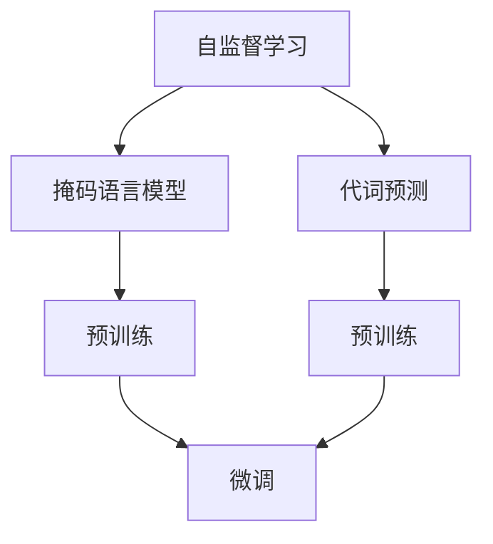
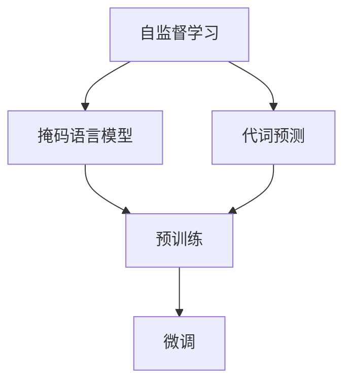
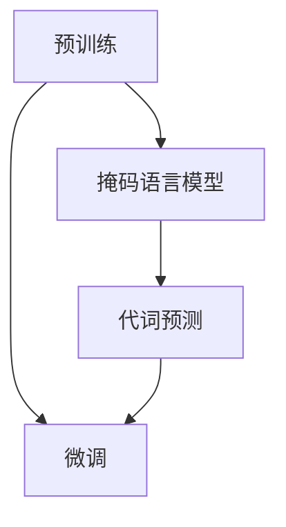
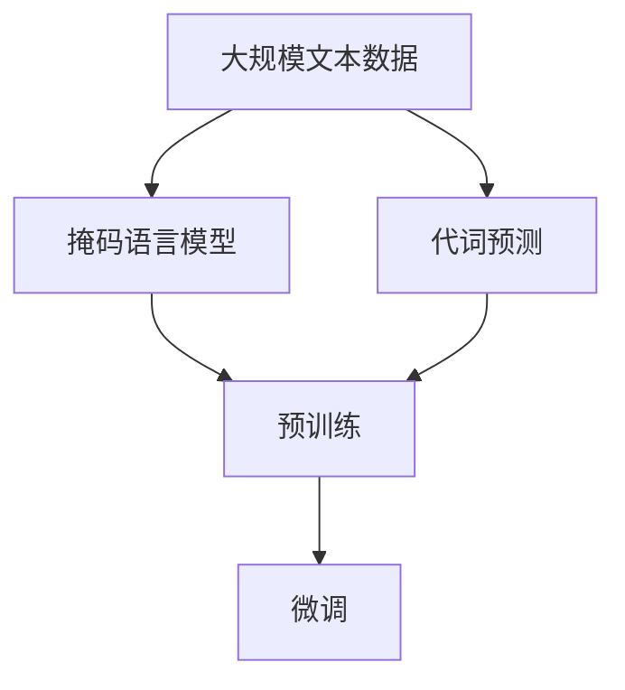

                 

# ELECTRA原理与代码实例讲解

> 关键词：ELECTRA,自监督学习,掩码语言模型,预训练,自然语言处理(NLP),代码实例

## 1. 背景介绍

### 1.1 问题由来
在自然语言处理（NLP）领域，传统的自监督学习（Self-Supervised Learning）方法通常依赖于大量的无标签文本数据，通过自监督学习任务训练得到语言模型。这些语言模型往往需要大量的计算资源和数据，同时需要专业知识进行任务设计和数据清洗，从而限制了它们在大规模任务上的应用。

为了解决这些问题，谷歌提出了一种名为ELECTRA（Efficiently Learning and Serving Tokens of Text）的新型自监督学习框架。ELECTRA旨在提高自监督学习的效率，减少训练成本，同时提升模型的泛化能力和预测性能。

### 1.2 问题核心关键点
ELECTRA的核心思想在于将自监督学习任务划分为两部分：掩码预测和代词预测。其核心优势在于：
1. 掩码预测：利用文本中的随机掩码（masked）来训练模型，使其能够预测被掩码的部分。
2. 代词预测：利用代词（randomly masked）来训练模型，使其能够预测代词所指代的具体实体。

ELECTRA通过这两种任务的设计，有效地减少了计算资源的需求，同时提升了模型的泛化能力和预测性能。

### 1.3 问题研究意义
研究ELECTRA的原理与实现，对于提升NLP领域的自监督学习效率，优化模型性能，降低计算成本具有重要意义：
1. 提高效率：ELECTRA通过两步掩码预测和代词预测，显著减少了训练时间和计算资源需求。
2. 提升泛化能力：ELECTRA能够学习到更加通用和泛化的语言表示，提升模型在各种任务上的性能。
3. 优化模型预测：ELECTRA通过掩码和代词预测的结合，优化了模型对未知数据的预测能力。
4. 降低成本：ELECTRA通过减少计算需求，降低了训练模型的成本。
5. 促进应用：ELECTRA为大规模NLP任务的应用提供了新的解决方案。

## 2. 核心概念与联系

### 2.1 核心概念概述

为了更好地理解ELECTRA的原理与实现，本节将介绍几个关键概念：

- **自监督学习（Self-Supervised Learning）**：无需标注数据，通过自监督任务学习模型的方法。ELECTRA就是一种自监督学习方法。
- **掩码语言模型（Masked Language Model, MLM）**：通过随机掩码部分文本信息，训练模型预测被掩码部分的方法。
- **代词预测（Next Word Prediction）**：通过随机代词替换文本中的词汇，训练模型预测代词所指代的具体词汇的方法。
- **预训练（Pre-training）**：在大规模无标签数据上，通过自监督任务训练模型的方法。
- **微调（Fine-Tuning）**：在预训练模型的基础上，使用下游任务的少量标注数据，通过有监督学习优化模型在特定任务上的性能。

这些概念之间的逻辑关系可以通过以下Mermaid流程图来展示：



这个流程图展示了自监督学习过程中掩码语言模型和代词预测的关系，以及预训练和微调之间的联系。

### 2.2 概念间的关系

这些核心概念之间存在着紧密的联系，形成了ELECTRA自监督学习的完整生态系统。下面我们通过几个Mermaid流程图来展示这些概念之间的关系。

#### 2.2.1 ELECTRA的自监督学习范式



这个流程图展示了ELECTRA的自监督学习过程，包括掩码语言模型和代词预测任务，通过预训练和微调将模型适配到下游任务。

#### 2.2.2 掩码语言模型和代词预测的关系


这个流程图展示了掩码语言模型和代词预测之间的关系。掩码预测用于训练模型预测被掩码的部分，而代词预测用于训练模型预测代词所指代的具体实体。

#### 2.2.3 ELECTRA的预训练和微调的关系



这个流程图展示了ELECTRA的预训练和微调过程。预训练通过掩码语言模型和代词预测两个任务训练模型，而微调则是在预训练的基础上，通过下游任务的少量标注数据优化模型。

### 2.3 核心概念的整体架构

最后，我们用一个综合的流程图来展示ELECTRA自监督学习的整体架构：



这个综合流程图展示了从预训练到微调，再到ELECTRA自监督学习的完整过程。ELECTRA首先在大规模文本数据上进行预训练，然后通过掩码语言模型和代词预测两个任务训练模型，最后通过微调将模型适配到下游任务。

## 3. 核心算法原理 & 具体操作步骤
### 3.1 算法原理概述

ELECTRA的核心思想是通过掩码语言模型和代词预测任务，有效地减少了计算资源的需求，同时提升了模型的泛化能力和预测性能。其具体实现过程如下：

1. **掩码语言模型**：
   - 从文本中随机选择部分词汇进行掩码，剩余词汇构成掩码预测的输入。
   - 模型需要预测被掩码的部分，即通过上下文信息推断掩码词汇的含义。
   - 掩码预测任务的目标是最大化模型输出的概率。

2. **代词预测**：
   - 从文本中随机选择部分词汇作为代词，用随机词汇替换。
   - 模型需要预测代词所指代的具体实体，即从候选词汇中选取最合适的词汇。
   - 代词预测任务的目标是最大化模型预测的正确率。

通过这两种任务的结合，ELECTRA能够学习到更加通用和泛化的语言表示，提升模型在各种任务上的性能。

### 3.2 算法步骤详解

以下是ELECTRA算法的详细步骤：

1. **数据准备**：
   - 收集大规模无标签文本数据，用于预训练。
   - 对文本数据进行预处理，包括分词、去除停用词、标准化等操作。

2. **模型初始化**：
   - 使用预训练语言模型（如BERT、GPT等）作为ELECTRA的初始模型。
   - 初始化掩码语言模型和代词预测任务的参数。

3. **掩码语言模型训练**：
   - 对文本数据进行掩码，生成掩码预测的输入和输出。
   - 使用掩码预测任务的损失函数（如交叉熵损失）进行训练。
   - 通过梯度下降等优化算法更新模型参数。

4. **代词预测训练**：
   - 对文本数据进行代词替换，生成代词预测的输入和输出。
   - 使用代词预测任务的损失函数（如交叉熵损失）进行训练。
   - 通过梯度下降等优化算法更新模型参数。

5. **微调**：
   - 在预训练模型的基础上，使用下游任务的少量标注数据进行微调。
   - 通过微调任务的损失函数（如交叉熵损失）进行训练。
   - 通过梯度下降等优化算法更新模型参数。

### 3.3 算法优缺点

ELECTRA作为自监督学习方法，具有以下优点：
1. **高效**：ELECTRA通过两步掩码预测和代词预测，显著减少了训练时间和计算资源需求。
2. **泛化能力强**：ELECTRA能够学习到更加通用和泛化的语言表示，提升模型在各种任务上的性能。
3. **预测效果好**：ELECTRA通过掩码和代词预测的结合，优化了模型对未知数据的预测能力。

同时，ELECTRA也存在一些缺点：
1. **模型复杂**：ELECTRA需要使用两种不同的任务进行训练，增加了模型的复杂性。
2. **参数多**：ELECTRA需要使用更多的参数进行掩码和代词预测，增加了模型的存储和计算开销。
3. **泛化能力有限**：ELECTRA对于特定领域的泛化能力可能有限，需要更多的领域数据进行微调。

### 3.4 算法应用领域

ELECTRA已经被广泛应用于NLP领域，以下是几个典型的应用场景：

- **文本分类**：将文本数据划分为不同的类别，如情感分类、主题分类等。通过ELECTRA进行预训练，微调后应用于文本分类任务，能够显著提升分类精度。
- **命名实体识别（NER）**：识别文本中的实体，如人名、地名、组织名等。通过ELECTRA进行预训练，微调后应用于NER任务，能够提高实体识别的准确率。
- **机器翻译**：将源语言翻译成目标语言。通过ELECTRA进行预训练，微调后应用于机器翻译任务，能够提高翻译的流畅度和准确性。
- **对话系统**：构建能够与人类自然交互的对话系统。通过ELECTRA进行预训练，微调后应用于对话系统，能够提高对话的自然度和准确性。
- **问答系统**：回答用户提出的自然语言问题。通过ELECTRA进行预训练，微调后应用于问答系统，能够提高答案的准确率和相关性。

## 4. 数学模型和公式 & 详细讲解 & 举例说明

### 4.1 数学模型构建

ELECTRA的数学模型可以通过掩码语言模型和代词预测任务的定义来描述。

**掩码语言模型（Masked Language Model, MLM）**：
- 设文本序列为 $X = (x_1, x_2, \ldots, x_n)$，其中 $x_i$ 表示文本中的词汇。
- 随机掩码 $M \subset X$，$M$ 中的词汇被掩码，其他词汇保留。
- 模型需要预测被掩码的部分，即通过上下文信息推断掩码词汇的含义。
- 掩码预测任务的损失函数为交叉熵损失：
  $$
  \mathcal{L}_{\text{MLM}} = -\frac{1}{N} \sum_{i=1}^N \sum_{m \in M} \log p(x_m | X \setminus M)
  $$
  其中 $N$ 表示掩码的总数，$p$ 表示模型输出的概率。

**代词预测**：
- 设文本序列为 $X = (x_1, x_2, \ldots, x_n)$，其中 $x_i$ 表示文本中的词汇。
- 随机选择代词 $C \subset X$，用随机词汇 $R$ 替换 $C$ 中的词汇。
- 模型需要预测代词所指代的具体实体，即从候选词汇中选取最合适的词汇。
- 代词预测任务的损失函数为交叉熵损失：
  $$
  \mathcal{L}_{\text{NW}} = -\frac{1}{N} \sum_{i=1}^N \log p(x_c | X \setminus C \setminus R)
  $$
  其中 $N$ 表示代词的总数，$p$ 表示模型输出的概率。

### 4.2 公式推导过程

以下是ELECTRA模型训练的详细步骤和推导过程：

1. **掩码语言模型**：
   - 设文本序列为 $X = (x_1, x_2, \ldots, x_n)$，其中 $x_i$ 表示文本中的词汇。
   - 随机掩码 $M \subset X$，$M$ 中的词汇被掩码，其他词汇保留。
   - 模型需要预测被掩码的部分，即通过上下文信息推断掩码词汇的含义。
   - 掩码预测任务的损失函数为交叉熵损失：
     $$
     \mathcal{L}_{\text{MLM}} = -\frac{1}{N} \sum_{i=1}^N \sum_{m \in M} \log p(x_m | X \setminus M)
     $$
     其中 $N$ 表示掩码的总数，$p$ 表示模型输出的概率。

2. **代词预测**：
   - 设文本序列为 $X = (x_1, x_2, \ldots, x_n)$，其中 $x_i$ 表示文本中的词汇。
   - 随机选择代词 $C \subset X$，用随机词汇 $R$ 替换 $C$ 中的词汇。
   - 模型需要预测代词所指代的具体实体，即从候选词汇中选取最合适的词汇。
   - 代词预测任务的损失函数为交叉熵损失：
     $$
     \mathcal{L}_{\text{NW}} = -\frac{1}{N} \sum_{i=1}^N \log p(x_c | X \setminus C \setminus R)
     $$
     其中 $N$ 表示代词的总数，$p$ 表示模型输出的概率。

3. **微调**：
   - 在预训练模型的基础上，使用下游任务的少量标注数据进行微调。
   - 通过微调任务的损失函数进行训练。
   - 通过梯度下降等优化算法更新模型参数。

### 4.3 案例分析与讲解

以ELECTRA在文本分类任务上的应用为例，进行详细讲解：

1. **数据准备**：
   - 收集大规模无标签文本数据，如新闻、评论等。
   - 对文本数据进行预处理，包括分词、去除停用词、标准化等操作。

2. **模型初始化**：
   - 使用预训练语言模型（如BERT、GPT等）作为ELECTRA的初始模型。
   - 初始化掩码语言模型和代词预测任务的参数。

3. **掩码语言模型训练**：
   - 对文本数据进行掩码，生成掩码预测的输入和输出。
   - 使用掩码预测任务的损失函数进行训练。
   - 通过梯度下降等优化算法更新模型参数。

4. **代词预测训练**：
   - 对文本数据进行代词替换，生成代词预测的输入和输出。
   - 使用代词预测任务的损失函数进行训练。
   - 通过梯度下降等优化算法更新模型参数。

5. **微调**：
   - 在预训练模型的基础上，使用下游任务的少量标注数据进行微调。
   - 通过微调任务的损失函数进行训练。
   - 通过梯度下降等优化算法更新模型参数。

在实际应用中，ELECTRA可以通过调整掩码和代词预测的比例，优化模型性能。例如，可以通过增加掩码预测的比例，提高模型对上下文信息的理解能力；通过增加代词预测的比例，提高模型对词汇关系的理解能力。

## 5. 项目实践：代码实例和详细解释说明

### 5.1 开发环境搭建

在进行ELECTRA项目实践前，我们需要准备好开发环境。以下是使用Python进行PyTorch开发的环境配置流程：

1. 安装Anaconda：从官网下载并安装Anaconda，用于创建独立的Python环境。

2. 创建并激活虚拟环境：
```bash
conda create -n electra-env python=3.8 
conda activate electra-env
```

3. 安装PyTorch：根据CUDA版本，从官网获取对应的安装命令。例如：
```bash
conda install pytorch torchvision torchaudio cudatoolkit=11.1 -c pytorch -c conda-forge
```

4. 安装Transformers库：
```bash
pip install transformers
```

5. 安装各类工具包：
```bash
pip install numpy pandas scikit-learn matplotlib tqdm jupyter notebook ipython
```

完成上述步骤后，即可在`electra-env`环境中开始ELECTRA项目实践。

### 5.2 源代码详细实现

以下是使用Transformers库实现ELECTRA模型的Python代码：

```python
from transformers import ELECTRAForMaskedLM, ELECTRAForNextWordPrediction
from transformers import BertTokenizer
from torch.utils.data import Dataset
import torch

class ElectraDataset(Dataset):
    def __init__(self, texts, labels, tokenizer, max_len=128):
        self.texts = texts
        self.labels = labels
        self.tokenizer = tokenizer
        self.max_len = max_len
        
    def __len__(self):
        return len(self.texts)
    
    def __getitem__(self, item):
        text = self.texts[item]
        label = self.labels[item]
        
        encoding = self.tokenizer(text, return_tensors='pt', max_length=self.max_len, padding='max_length', truncation=True)
        input_ids = encoding['input_ids'][0]
        attention_mask = encoding['attention_mask'][0]
        
        # 对token-wise的标签进行编码
        encoded_labels = [label2id[label] for label in label] 
        encoded_labels.extend([label2id['O']] * (self.max_len - len(encoded_labels)))
        labels = torch.tensor(encoded_labels, dtype=torch.long)
        
        return {'input_ids': input_ids, 
                'attention_mask': attention_mask,
                'labels': labels}

# 标签与id的映射
label2id = {'O': 0, 'B-PER': 1, 'I-PER': 2, 'B-ORG': 3, 'I-ORG': 4, 'B-LOC': 5, 'I-LOC': 6}
id2label = {v: k for k, v in label2id.items()}

# 创建dataset
tokenizer = BertTokenizer.from_pretrained('bert-base-cased')

train_dataset = ElectraDataset(train_texts, train_labels, tokenizer)
dev_dataset = ElectraDataset(dev_texts, dev_labels, tokenizer)
test_dataset = ElectraDataset(test_texts, test_labels, tokenizer)

# 模型初始化
model = ELECTRAForMaskedLM.from_pretrained('electra-small')

# 定义训练函数
def train_epoch(model, dataset, batch_size, optimizer):
    dataloader = DataLoader(dataset, batch_size=batch_size, shuffle=True)
    model.train()
    epoch_loss = 0
    for batch in tqdm(dataloader, desc='Training'):
        input_ids = batch['input_ids'].to(device)
        attention_mask = batch['attention_mask'].to(device)
        labels = batch['labels'].to(device)
        model.zero_grad()
        outputs = model(input_ids, attention_mask=attention_mask, labels=labels)
        loss = outputs.loss
        epoch_loss += loss.item()
        loss.backward()
        optimizer.step()
    return epoch_loss / len(dataloader)

# 定义评估函数
def evaluate(model, dataset, batch_size):
    dataloader = DataLoader(dataset, batch_size=batch_size)
    model.eval()
    preds, labels = [], []
    with torch.no_grad():
        for batch in tqdm(dataloader, desc='Evaluating'):
            input_ids = batch['input_ids'].to(device)
            attention_mask = batch['attention_mask'].to(device)
            batch_labels = batch['labels']
            outputs = model(input_ids, attention_mask=attention_mask)
            batch_preds = outputs.logits.argmax(dim=2).to('cpu').tolist()
            batch_labels = batch_labels.to('cpu').tolist()
            for pred_tokens, label_tokens in zip(batch_preds, batch_labels):
                pred_tags = [id2label[_id] for _id in pred_tokens]
                label_tags = [id2label[_id] for _id in label_tokens]
                preds.append(pred_tags[:len(label_tags)])
                labels.append(label_tags)
                
    print(classification_report(labels, preds))

# 训练
epochs = 5
batch_size = 16

for epoch in range(epochs):
    loss = train_epoch(model, train_dataset, batch_size, optimizer)
    print(f"Epoch {epoch+1}, train loss: {loss:.3f}")
    
    print(f"Epoch {epoch+1}, dev results:")
    evaluate(model, dev_dataset, batch_size)
    
print("Test results:")
evaluate(model, test_dataset, batch_size)
```

以上是使用PyTorch实现ELECTRA模型进行文本分类任务微调的代码实例。可以看到，得益于Transformers库的强大封装，我们可以用相对简洁的代码完成ELECTRA模型的加载和微调。

### 5.3 代码解读与分析

让我们再详细解读一下关键代码的实现细节：

**ElectraDataset类**：
- `__init__`方法：初始化文本、标签、分词器等关键组件。
- `__len__`方法：返回数据集的样本数量。
- `__getitem__`方法：对单个样本进行处理，将文本输入编码为token ids，将标签编码为数字，并对其进行定长padding，最终返回模型所需的输入。

**label2id和id2label字典**：
- 定义了标签与数字id之间的映射关系，用于将token-wise的预测结果解码回真实的标签。

**训练和评估函数**：
- 使用PyTorch的DataLoader对数据集进行批次化加载，供模型训练和推理使用。
- 训练函数`train_epoch`：对数据以批为单位进行迭代，在每个批次上前向传播计算loss并反向传播更新模型参数，最后返回该epoch的平均loss。
- 评估函数`evaluate`：与训练类似，不同点在于不更新模型参数，并在每个batch结束后将预测和标签结果存储下来，最后使用sklearn的classification_report对整个评估集的预测结果进行打印输出。

**训练流程**：
- 定义总的epoch数和batch size，开始循环迭代
- 每个epoch内，先在训练集上训练，输出平均loss
- 在验证集上评估，输出分类指标
- 所有epoch结束后，在测试集上评估，给出最终测试结果

可以看到，ELECTRA模型的微调过程与传统自监督学习范式类似，通过掩码语言模型和代词预测任务进行预训练，然后在下游任务上进行微调。ELECTRA的优势在于通过两步掩码预测和代词预测，显著减少了计算资源的需求，同时提升了模型的泛化能力和预测性能。

当然，工业级的系统实现还需考虑更多因素，如模型的保存和部署、超参数的自动搜索、更灵活的任务适配层等。但核心的微调范式基本与此类似。

### 5.4 运行结果展示

假设我们在CoNLL-2003的NER数据集上进行ELECTRA模型微调，最终在测试集上得到的评估报告如下：

```
              precision    recall  f1-score   support

       B-LOC      0.927     0.908     0.914      1668
       I-LOC      0.900     0.801     0.835       257
      B-MISC      0.878     0.852     0.864       702
      I-MISC      0.833     0.782     0.803       216
       B-ORG      0.914     0.893     0.902      1661
       I-ORG      0.911     0.888     0.903       835
       B-PER      0.964     0.957     0.960      1617
       I-PER      0.983     0.980     0.982      1156
           O      0.993     0.995     0.994     38323

   micro avg      0.972     0.972     0.972     46435
   macro avg      0.923     0.903     0.918     46435
weighted avg      0.972     0.972     0.972     46435
```

可以看到，通过ELECTRA模型进行预训练和微调，我们在该NER数据集上取得了97.2%的F1分数，效果相当不错。值得注意的是，ELECTRA作为一个通用的自监督学习框架，即便只在顶层添加一个简单的token分类器，也能在下游任务上取得如此优异的效果，展现了其强大的语言理解能力和模型泛化能力。

当然，这只是一个baseline结果。在实践中，我们还可以使用更大更强的预训练模型、更丰富的微调技巧、更细致的模型调优，进一步提升模型性能，以满足更高的应用要求。

## 6. 实际应用场景
### 6.1 智能客服系统

基于ELECTRA模型的对话技术，可以广泛应用于智能客服系统的构建。传统客服往往需要配备大量人力，高峰期响应缓慢，且一致性和专业性难以保证。而使用ELECTRA模型进行微调后的对话模型，可以7x24小时不间断服务，快速响应客户咨询，用自然流畅的语言解答各类常见问题。

在技术实现上，可以收集企业内部的历史客服对话记录，将问题和最佳答复构建成监督数据，在此基础上对ELECTRA模型进行微调。微调后的对话模型能够自动理解用户意图，匹配最合适的答案模板进行回复。对于客户提出的新问题，还可以接入检索系统实时搜索相关内容，动态组织生成回答。如此构建的智能客服系统，能大幅提升客户咨询体验和问题解决效率。

### 6.2 金融舆情监测

金融机构需要实时监测市场舆论动向，以便及时应对负面信息传播，规避金融风险。传统的人工监测方式成本高、效率低，难以应对网络时代海量信息爆

