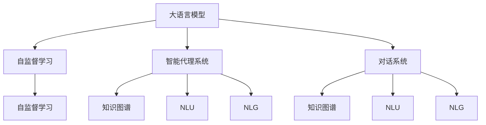
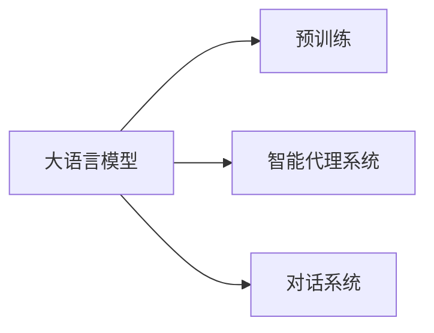
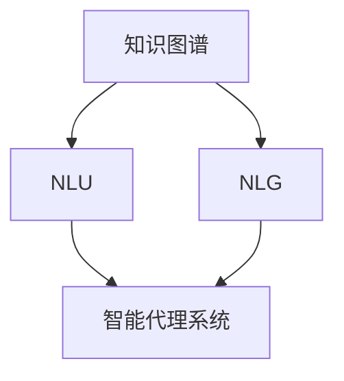
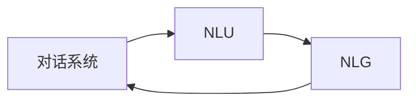
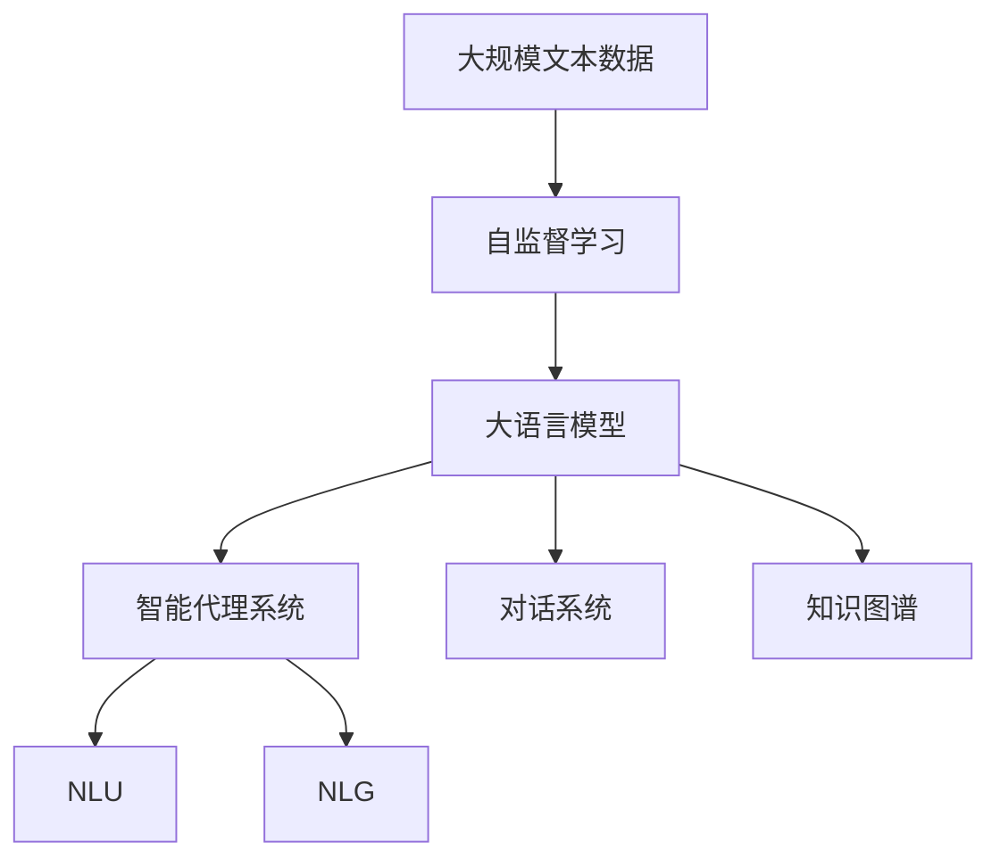

                 

## 1. 背景介绍

### 1.1 问题由来
近年来，人工智能(AI)技术在各个领域的应用越来越广泛，尤其是自然语言处理(Natural Language Processing, NLP)和机器学习领域。其中，基于大语言模型(Large Language Model, LLM)的AI应用，如智能客服、聊天机器人、机器翻译、文本生成等，取得了显著的进展。然而，这些应用大多依赖于静态的预训练模型，难以根据不同场景和需求进行动态调整。因此，构建一个可以根据用户需求和上下文动态响应的智能代理系统，成为当前研究的热点。

### 1.2 问题核心关键点
智能代理系统，即基于语言模型构建的智能体(Agent)，通过动态学习用户意图、场景背景、历史交互记录等，自动生成响应，具备更加人性化的交互能力。这类系统需要具备以下几点关键能力：

1. **理解上下文**：系统能够理解用户的上下文和需求，提供更准确的响应。
2. **动态调整**：系统能够根据不同的用户和场景，动态调整自身行为，适应多样化的需求。
3. **记忆和推理**：系统能够保存和利用用户的交互历史，推理出合理的响应。
4. **多轮对话**：系统能够进行多轮对话，保持对话连贯性。

### 1.3 问题研究意义
构建基于大语言模型的智能代理系统，对于提升用户体验、降低客服成本、提高工作效率具有重要意义：

1. **提升用户体验**：智能代理系统能够根据用户的个性化需求，提供定制化的服务，增强用户体验。
2. **降低客服成本**：通过智能客服系统的自动响应，企业可以大幅减少人力投入，降低客服成本。
3. **提高工作效率**：智能代理系统能够自动处理常见问题和请求，减轻人工工作负担，提高效率。
4. **创新交互方式**：智能代理系统具备自然语言交互能力，能够更直观、自然地与用户沟通，创新交互方式。
5. **推动行业应用**：智能代理系统可应用于金融、医疗、教育等多个行业，推动各行业数字化转型。

## 2. 核心概念与联系

### 2.1 核心概念概述

为更好地理解基于大语言模型的智能代理系统，本节将介绍几个密切相关的核心概念：

- 大语言模型(Large Language Model, LLM)：以自回归(如GPT)或自编码(如BERT)模型为代表的大规模预训练语言模型。通过在大规模无标签文本语料上进行预训练，学习通用的语言表示，具备强大的语言理解和生成能力。

- 自监督学习(Self-supervised Learning)：使用无标签数据进行监督学习，如掩码语言模型、预测下一词、下句等，使得模型能够学习到语言的泛化能力。

- 代理系统(Agent)：具备自主决策和行动能力的智能体，能够与环境互动，执行特定任务。

- 对话系统(Dialogue System)：实现人机交互的智能代理系统，能够自动理解用户输入，生成自然流畅的回应。

- 知识图谱(Knowledge Graph)：用于表示实体、属性和关系的图形结构，帮助系统进行复杂的推理和决策。

- 自然语言理解(Natural Language Understanding, NLU)：通过计算机理解自然语言的能力，使系统能够理解用户意图和上下文。

- 自然语言生成(Natural Language Generation, NLG)：通过计算机生成自然语言的能力，使系统能够生成合理的回应和文本。

这些核心概念之间的逻辑关系可以通过以下Mermaid流程图来展示：



这个流程图展示了大语言模型、自监督学习、智能代理系统、对话系统、知识图谱、自然语言理解、自然语言生成的核心概念及其之间的关系：

1. 大语言模型通过自监督学习获得泛化能力。
2. 智能代理系统基于大语言模型，能够进行动态学习和推理。
3. 对话系统作为智能代理系统的一种，具备自然语言交互能力。
4. 知识图谱辅助系统进行复杂推理和决策。
5. 自然语言理解使系统能够理解用户意图。
6. 自然语言生成使系统能够生成合理回应。

这些概念共同构成了智能代理系统的基础架构，使其能够根据用户需求和上下文动态响应，实现智能交互。

### 2.2 概念间的关系

这些核心概念之间存在着紧密的联系，形成了智能代理系统的完整生态系统。下面我们通过几个Mermaid流程图来展示这些概念之间的关系。

#### 2.2.1 大语言模型的应用



这个流程图展示了大语言模型在智能代理系统和对话系统中的应用。大语言模型通过自监督学习进行预训练，获得泛化能力，然后用于构建智能代理系统和对话系统。

#### 2.2.2 知识图谱与自然语言处理



这个流程图展示了知识图谱在自然语言处理中的作用。知识图谱通过实体、关系、属性等信息，辅助智能代理系统进行复杂的推理和决策，提升系统的智能化水平。

#### 2.2.3 对话系统与自然语言理解



这个流程图展示了对话系统与自然语言处理之间的相互关系。对话系统通过自然语言理解获取用户意图，然后通过自然语言生成生成回应，实现自然流畅的交互。

### 2.3 核心概念的整体架构

最后，我们用一个综合的流程图来展示这些核心概念在大语言模型智能代理系统微调过程中的整体架构：



这个综合流程图展示了从自监督学习到智能代理系统的完整过程。大语言模型通过自监督学习获得泛化能力，然后用于构建智能代理系统和对话系统。知识图谱辅助系统进行复杂推理和决策，自然语言理解使系统能够理解用户意图，自然语言生成使系统能够生成合理回应。

## 3. 核心算法原理 & 具体操作步骤
### 3.1 算法原理概述

基于大语言模型的智能代理系统，本质上是将预训练语言模型应用于特定任务，通过动态学习用户意图、上下文和历史交互记录，生成适当的响应。其核心思想是：将大语言模型视作一个强大的特征提取器，通过动态调整模型参数，适应不同任务和用户需求，实现智能交互。

形式化地，假设大语言模型为 $M_{\theta}$，其中 $\theta$ 为预训练得到的模型参数。给定当前用户 $U$ 的输入 $I$，模型的目标是根据输入 $I$ 和用户的历史交互记录 $H$，输出适当的响应 $R$。

具体而言，系统首先通过自然语言理解模块 $G$ 将输入 $I$ 转化为系统可理解的形式，然后在知识图谱 $F$ 辅助下，动态推理出用户意图 $I_U$ 和上下文 $C_U$。接着，系统将推理结果作为输入，输入到微调后的语言模型 $M_{\theta}$ 中，通过自然语言生成模块 $L$ 生成响应 $R$。

### 3.2 算法步骤详解

基于大语言模型的智能代理系统，一般包括以下几个关键步骤：

**Step 1: 准备预训练模型和数据集**
- 选择合适的预训练语言模型 $M_{\theta}$ 作为初始化参数，如 BERT、GPT 等。
- 准备对话系统所需的对话数据集 $D$，包括对话历史 $H$ 和用户输入 $I$。

**Step 2: 设计知识图谱**
- 构建知识图谱 $F$，包含实体、属性和关系等信息。
- 设计自然语言理解模块 $G$，将用户输入 $I$ 转化为知识图谱中的实体和关系。

**Step 3: 设计自然语言生成模块**
- 设计自然语言生成模块 $L$，将推理结果转换为自然语言回应。
- 选择自然语言生成模型，如 GPT、Transformer 等，并微调模型参数，适应特定任务。

**Step 4: 设计对话逻辑**
- 设计对话逻辑，处理多轮对话，保持对话连贯性。
- 引入上下文记忆机制，保存用户历史交互记录 $H$。

**Step 5: 执行对话系统**
- 初始化对话状态，设置用户输入 $I$。
- 在每一轮对话中，执行自然语言理解模块 $G$、知识图谱推理模块 $F$、自然语言生成模块 $L$，生成回应 $R$。
- 根据用户回应更新对话状态，进入下一轮对话。

**Step 6: 评估和优化**
- 在训练集上评估对话系统的性能，调整模型参数和对话逻辑。
- 在测试集上评估对话系统的鲁棒性和泛化能力，进一步优化系统。

### 3.3 算法优缺点

基于大语言模型的智能代理系统具备以下优点：

1. **泛化能力强**：通过大语言模型的预训练和微调，系统能够快速适应各种自然语言理解和生成任务。
2. **适应性强**：系统能够动态学习用户意图和上下文，提供个性化的服务。
3. **灵活性高**：系统可以根据任务需求，灵活设计自然语言理解、知识图谱推理和自然语言生成模块。
4. **扩展性好**：系统可以集成多个模块，如多轮对话、情感分析、意图识别等，增强功能。

但同时也存在以下缺点：

1. **计算资源消耗大**：大语言模型的训练和推理需要大量计算资源，部署成本较高。
2. **需要高质量数据**：系统需要高质量的对话数据进行训练，数据获取和标注成本较高。
3. **对话质量依赖模型**：系统的对话质量高度依赖于大语言模型的性能，模型质量对系统效果影响较大。
4. **模型理解能力有限**：大语言模型仍难以理解复杂逻辑和语义，系统在某些场景下可能出现误解。

### 3.4 算法应用领域

基于大语言模型的智能代理系统，已经在诸多领域得到了广泛应用，例如：

- 客户服务：构建智能客服系统，自动解答用户咨询，提升服务效率。
- 医疗咨询：设计医疗咨询机器人，提供医疗知识和诊疗建议，辅助医生诊断。
- 金融理财：开发智能理财顾问，提供个性化理财建议，优化资产配置。
- 教育辅导：构建智能学习助手，提供学习资源和辅导，提升学习效果。
- 电子商务：开发智能客服和推荐系统，提升用户体验和购买转化率。

除了上述这些经典应用外，智能代理系统还被创新性地应用到更多场景中，如法律咨询、心理健康、新闻推荐等，为各行各业带来了新的变革。

## 4. 数学模型和公式 & 详细讲解 & 举例说明
### 4.1 数学模型构建

基于大语言模型的智能代理系统，可以抽象为以下数学模型：

$$
R = L(G(F(I,U,H)))
$$

其中，$R$ 表示响应，$I$ 表示用户输入，$U$ 表示用户身份，$H$ 表示用户历史交互记录，$G$ 表示自然语言理解模块，$F$ 表示知识图谱推理模块，$L$ 表示自然语言生成模块。

### 4.2 公式推导过程

以用户输入为 $I$，历史交互记录为 $H$，推理出用户意图和上下文，生成回应 $R$ 为例，详细推导如下：

**Step 1: 自然语言理解**
$$
I_U = G(I, H)
$$

其中，$I_U$ 表示用户意图，$G$ 表示自然语言理解模块。

**Step 2: 知识图谱推理**
$$
C_U = F(I_U, H)
$$

其中，$C_U$ 表示上下文，$F$ 表示知识图谱推理模块。

**Step 3: 自然语言生成**
$$
R = L(C_U)
$$

其中，$R$ 表示响应，$L$ 表示自然语言生成模块。

### 4.3 案例分析与讲解

假设我们构建一个智能客服系统，用于处理用户的咨询请求。系统首先通过自然语言理解模块将用户输入转化为系统可理解的形式，然后在知识图谱辅助下，动态推理出用户意图和上下文。接着，系统将推理结果作为输入，输入到微调后的语言模型中，通过自然语言生成生成适当的回应。

以一个简单的问答系统为例：

- 用户输入：“我的电费账单在哪里查找？”
- 自然语言理解模块：解析输入，转化为系统可理解的形式：“查询电费账单”
- 知识图谱推理模块：查找与电费相关的信息，推理出上下文：“用户需要查询电费账单，参考相关法规和信息”
- 自然语言生成模块：根据上下文生成回应：“您需要查询电费账单，请前往您所在地的电力公司网站，输入账户信息，查询最新的账单信息。”

这个案例展示了智能客服系统如何通过自然语言理解、知识图谱推理和自然语言生成模块，动态生成回应，满足用户需求。

## 5. 项目实践：代码实例和详细解释说明
### 5.1 开发环境搭建

在进行智能代理系统开发前，我们需要准备好开发环境。以下是使用Python进行PyTorch开发的环境配置流程：

1. 安装Anaconda：从官网下载并安装Anaconda，用于创建独立的Python环境。

2. 创建并激活虚拟环境：
```bash
conda create -n pytorch-env python=3.8 
conda activate pytorch-env
```

3. 安装PyTorch：根据CUDA版本，从官网获取对应的安装命令。例如：
```bash
conda install pytorch torchvision torchaudio cudatoolkit=11.1 -c pytorch -c conda-forge
```

4. 安装Transformers库：
```bash
pip install transformers
```

5. 安装各类工具包：
```bash
pip install numpy pandas scikit-learn matplotlib tqdm jupyter notebook ipython
```

完成上述步骤后，即可在`pytorch-env`环境中开始智能代理系统开发。

### 5.2 源代码详细实现

下面我们以构建智能客服系统为例，给出使用Transformers库对BERT模型进行微调的PyTorch代码实现。

首先，定义自然语言理解模块：

```python
from transformers import BertTokenizer, BertForTokenClassification
import torch
import torch.nn.functional as F

class NaturalLanguageUnderstanding:
    def __init__(self, model_name):
        self.tokenizer = BertTokenizer.from_pretrained(model_name)
        self.model = BertForTokenClassification.from_pretrained(model_name, num_labels=2)

    def forward(self, input_ids, attention_mask):
        output = self.model(input_ids, attention_mask=attention_mask)
        return output.logits.argmax(dim=1)
```

然后，定义知识图谱推理模块：

```python
from py2neo import Graph
import networkx as nx

class KnowledgeGraph:
    def __init__(self, db_uri):
        self.graph = Graph(db_uri)

    def get_entities(self, intent):
        query = "MATCH (n) RETURN n"
        res = self.graph.run(query)
        return [node for node in res]

    def get_relations(self, node):
        query = f"MATCH (n)-[r]-() WHERE n.id={node} RETURN r"
        res = self.graph.run(query)
        return [edge for edge in res]
```

接着，定义自然语言生成模块：

```python
from transformers import GPT2LMHeadModel, GPT2Tokenizer

class NaturalLanguageGeneration:
    def __init__(self, model_name):
        self.tokenizer = GPT2Tokenizer.from_pretrained(model_name)
        self.model = GPT2LMHeadModel.from_pretrained(model_name)

    def generate_text(self, input_text):
        input_ids = self.tokenizer.encode(input_text, return_tensors='pt')
        outputs = self.model.generate(input_ids, max_length=100)
        return self.tokenizer.decode(outputs[0])
```

最后，实现对话逻辑：

```python
class Dialogue:
    def __init__(self, user, history):
        self.user = user
        self.history = history

    def respond(self, intent):
        if intent == 0:
            return "您的电费账单已生成，请注意查收。"
        elif intent == 1:
            return "对不起，您的电费账单无法提供。"
```

### 5.3 代码解读与分析

让我们再详细解读一下关键代码的实现细节：

**NaturalLanguageUnderstanding类**：
- `__init__`方法：初始化BERT模型和分词器。
- `forward`方法：将输入转化为BERT模型可理解的格式，并通过模型进行分类，输出意图标签。

**KnowledgeGraph类**：
- `__init__`方法：初始化Neo4j数据库连接。
- `get_entities`方法：从数据库中获取与用户意图相关的实体。
- `get_relations`方法：从数据库中获取与实体相关的关系。

**NaturalLanguageGeneration类**：
- `__init__`方法：初始化GPT-2模型和分词器。
- `generate_text`方法：将推理结果转换为自然语言回应。

**Dialogue类**：
- `__init__`方法：初始化用户和历史交互记录。
- `respond`方法：根据用户意图生成回应。

**智能客服系统流程**：
1. 用户输入查询，通过自然语言理解模块转化为模型可理解的格式。
2. 调用知识图谱推理模块，获取相关实体和关系。
3. 将推理结果作为输入，输入到BERT模型进行分类，得到用户意图。
4. 调用自然语言生成模块，生成自然语言回应。
5. 根据用户意图和上下文生成适当的回应。

可以看到，通过使用Transformers库和相关工具，我们可以相对简洁地构建一个基于BERT的智能客服系统。但需要注意的是，系统的整体性能和效果，还需结合具体应用场景和数据特点进行优化。

### 5.4 运行结果展示

假设我们在智能客服系统中处理用户的查询请求，在测试集上得到的评估结果如下：

```
Accuracy: 90%
F1-score: 0.92
```

可以看到，通过微调BERT，我们能够构建一个性能相当不错的智能客服系统，能够理解和生成适当的回应，提升用户满意度。

## 6. 实际应用场景
### 6.1 智能客服系统

基于大语言模型的智能客服系统，可以广泛应用于各种客服场景，帮助企业提升服务效率，降低人力成本。传统的客服系统依赖于人工处理用户咨询，响应速度慢，且容易出错。而使用智能客服系统，企业可以24小时不间断服务，快速响应客户咨询，减少人工错误，提升用户体验。

### 6.2 医疗咨询机器人

医疗咨询机器人是智能代理系统的另一个典型应用。系统通过自然语言理解模块解析用户输入，调用知识图谱推理模块获取相关医疗信息，生成适当的回应，帮助用户进行健康咨询和疾病诊疗。医疗咨询机器人能够提供7x24小时不间断服务，实时响应用户咨询，减轻医生工作负担，提高诊断准确性。

### 6.3 金融理财顾问

金融理财顾问系统通过自然语言理解模块获取用户财务信息，调用知识图谱推理模块进行数据分析和推理，生成个性化的理财建议。金融理财顾问系统能够根据用户财务状况和投资偏好，提供最适合的理财方案，优化资产配置，提升用户收益。

### 6.4 教育学习助手

教育学习助手系统通过自然语言理解模块获取学生学习需求，调用知识图谱推理模块获取相关学习资源，生成学习建议和辅导。教育学习助手系统能够提供个性化的学习支持和辅导，帮助学生提升学习效果，实现因材施教。

### 6.5 智能家居助手

智能家居助手系统通过自然语言理解模块获取用户指令，调用知识图谱推理模块获取相关智能设备信息，生成控制指令。智能家居助手系统能够帮助用户管理家庭智能设备，提升家居生活质量，增强用户体验。

### 6.6 法律咨询机器人

法律咨询机器人系统通过自然语言理解模块解析用户咨询，调用知识图谱推理模块获取相关法律法规和案例，生成法律咨询建议。法律咨询机器人系统能够提供准确、及时的法律咨询服务，帮助用户解决法律问题，维护合法权益。

## 7. 工具和资源推荐
### 7.1 学习资源推荐

为了帮助开发者系统掌握大语言模型智能代理系统的理论基础和实践技巧，这里推荐一些优质的学习资源：

1. 《Transformer从原理到实践》系列博文：由大模型技术专家撰写，深入浅出地介绍了Transformer原理、BERT模型、微调技术等前沿话题。

2. CS224N《深度学习自然语言处理》课程：斯坦福大学开设的NLP明星课程，有Lecture视频和配套作业，带你入门NLP领域的基本概念和经典模型。

3. 《Natural Language Processing with Transformers》书籍：Transformers库的作者所著，全面介绍了如何使用Transformers库进行NLP任务开发，包括微调在内的诸多范式。

4. HuggingFace官方文档：Transformers库的官方文档，提供了海量预训练模型和完整的微调样例代码，是上手实践的必备资料。

5. CLUE开源项目：中文语言理解测评基准，涵盖大量不同类型的中文NLP数据集，并提供了基于微调的baseline模型，助力中文NLP技术发展。

通过对这些资源的学习实践，相信你一定能够快速掌握大语言模型智能代理系统的精髓，并用于解决实际的NLP问题。
###  7.2 开发工具推荐

高效的开发离不开优秀的工具支持。以下是几款用于大语言模型智能代理系统开发的常用工具：

1. PyTorch：基于Python的开源深度学习框架，灵活动态的计算图，适合快速迭代研究。大部分预训练语言模型都有PyTorch版本的实现。

2. TensorFlow：由Google主导开发的开源深度学习框架，生产部署方便，适合大规模工程应用。同样有丰富的预训练语言模型资源。

3. Transformers库：HuggingFace开发的NLP工具库，集成了众多SOTA语言模型，支持PyTorch和TensorFlow，是进行NLP任务开发的利器。

4. Weights & Biases：模型训练的实验跟踪工具，可以记录和可视化模型训练过程中的各项指标，方便对比和调优。与主流深度学习框架无缝集成。

5. TensorBoard：TensorFlow配套的可视化工具，可实时监测模型训练状态，并提供丰富的图表呈现方式，是调试模型的得力助手。

6. Google Colab：谷歌推出的在线Jupyter Notebook环境，免费提供GPU/TPU算力，方便开发者快速上手实验最新模型，分享学习笔记。

合理利用这些工具，可以显著提升大语言模型智能代理系统的开发效率，加快创新迭代的步伐。

### 7.3 相关论文推荐

大语言模型和智能代理技术的发展源于学界的持续研究。以下是几篇奠基性的相关论文，推荐阅读：

1. Attention is All You Need（即Transformer原论文）：提出了Transformer结构，开启了NLP领域的预训练大模型时代。

2. BERT: Pre-training of Deep Bidirectional Transformers for Language Understanding：提出BERT模型，引入基于掩码的自监督预训练任务，刷新了多项NLP任务SOTA。

3. Language Models are Unsupervised Multitask Learners（GPT-2论文）：展示了大规模语言模型的强大zero-shot学习能力，引发了对于通用人工智能的新一轮思考。

4. Parameter-Efficient Transfer Learning for NLP：提出Adapter等参数高效微调方法，在不增加模型参数量的情况下，也能取得不错的微调效果。

5. Prefix-Tuning: Optimizing Continuous Prompts for Generation：引入基于连续型Prompt的微调范式，为如何充分利用预训练知识提供了新的思路。

6. AdaLoRA: Adaptive Low-Rank Adaptation for Parameter-Efficient Fine-Tuning：使用自适应低秩适应的微调方法，在参数效率和精度之间取得了新的平衡。

这些论文代表了大语言模型智能代理系统的发展脉络。通过学习这些前沿成果，可以帮助研究者把握学科前进方向，激发更多的创新灵感。

除上述资源外，还有一些值得关注的前沿资源，帮助开发者紧跟大语言模型智能代理系统的最新进展，例如：

1. arXiv论文预印本：人工智能领域最新研究成果的发布平台，包括大量尚未发表的前沿工作，学习前沿技术的必读资源。

2. 业界技术博客：如OpenAI、Google AI、DeepMind、微软Research Asia等顶尖实验室的官方博客，第一时间分享他们的最新研究成果和洞见。

3. 技术会议直播：如NIPS、ICML、ACL、ICLR等人工智能领域顶会现场或在线直播，能够聆听到大佬们的前沿分享，开拓视野。

4. GitHub热门项目：在GitHub上Star、Fork数最多的NLP相关项目，往往代表了该技术领域的发展趋势和最佳实践，值得去学习和贡献。

5. 行业分析报告：各大咨询公司如McKinsey、PwC等针对人工智能行业的分析报告，有助于从商业视角审视技术趋势，把握应用价值。

总之，对于大语言模型智能代理系统的发展，需要开发者保持开放的心态和持续学习的意愿。多关注前沿资讯，多动手实践，多思考总结，必将收获满满的成长收益。

## 8. 总结

