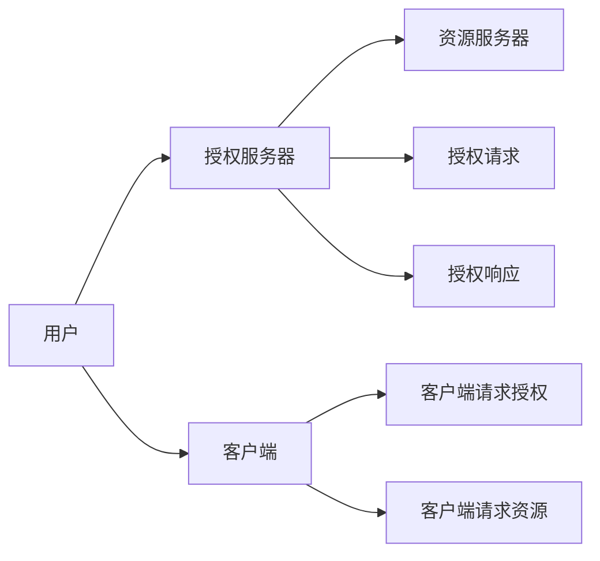
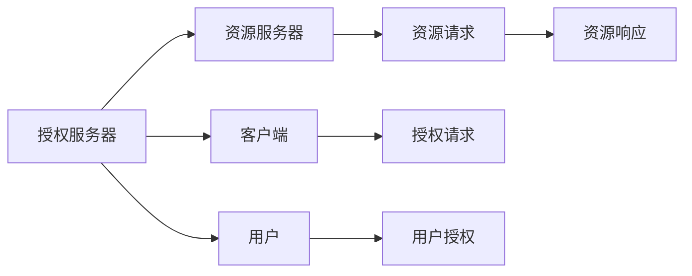
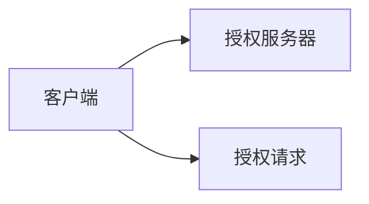
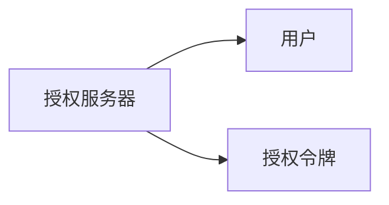
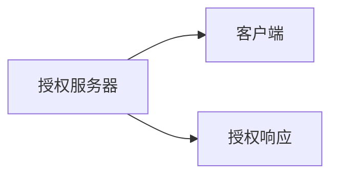
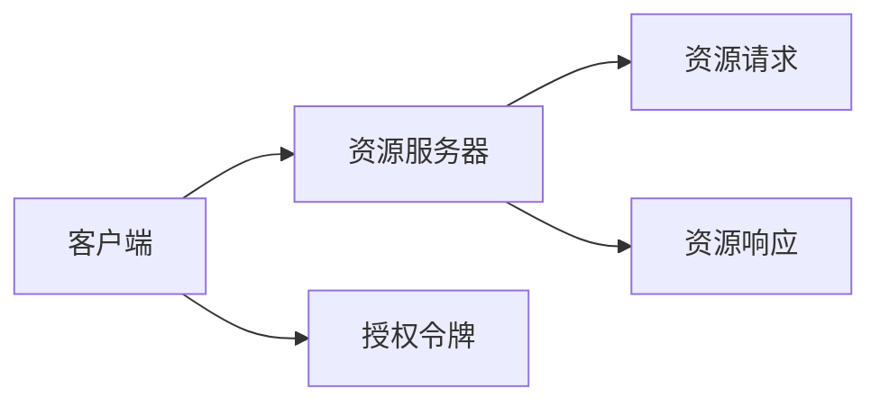

                 

# OAuth 2.0 的优点和实现

OAuth 2.0（Open Authorization）是一种流行的授权框架，用于处理用户认证和授权。它允许用户授权第三方应用程序访问其资源，而无需共享其凭据（如用户名和密码）。本文将详细探讨OAuth 2.0的核心概念、算法原理和具体实现步骤，并讨论其在实际应用中的优点和挑战。

## 1. 背景介绍

在互联网时代，用户越来越重视其数据隐私和安全性。用户希望能够授权第三方应用程序访问其资源，但又不想共享其凭据。这种需求催生了OAuth 2.0的出现。

### 1.1 OAuth 2.0的历史背景

OAuth 2.0由互联网工程任务组（IETF）于2012年提出，作为OAuth 1.0的继任者。OAuth 1.0在2007年提出，用于处理Web应用程序的第三方授权问题，但存在密钥长度较长、容易遭受中间人攻击等缺点。OAuth 2.0改进了这些问题，使其更加简洁、安全、易于实现。

### 1.2 OAuth 2.0的核心优势

OAuth 2.0的核心优势包括：

- **用户隐私保护**：用户无需共享其凭据，只需授权第三方应用程序访问其资源。
- **简化认证过程**：通过使用标准的授权框架，第三方应用程序可以简化认证过程。
- **可扩展性强**：OAuth 2.0支持多种授权类型，如授权码模式、隐式模式、密码模式等。
- **安全性高**：通过使用加密和签名等技术，OAuth 2.0提供了高强度的安全性保障。

## 2. 核心概念与联系

### 2.1 核心概念概述

OAuth 2.0的核心概念包括：

- **授权服务器（Authorization Server）**：负责处理用户授权请求和验证授权信息。
- **资源服务器（Resource Server）**：负责处理资源访问请求和验证访问权限。
- **客户端（Client）**：请求授权或访问资源的第三方应用程序。
- **用户（User）**：需要授权其资源的用户。

这些概念之间的关系可以通过以下Mermaid流程图来展示：



### 2.2 概念间的关系

这些核心概念之间的关系可以通过以下Mermaid流程图来展示：



## 3. 核心算法原理 & 具体操作步骤

### 3.1 算法原理概述

OAuth 2.0的授权流程主要包括四个步骤：

1. **授权请求**：客户端向授权服务器发起授权请求。
2. **用户授权**：用户向授权服务器授权其资源。
3. **授权响应**：授权服务器向客户端返回授权响应。
4. **资源请求**：客户端向资源服务器请求访问资源。

每个步骤的具体实现方式和安全性保障措施将在接下来的章节中进行详细讨论。

### 3.2 算法步骤详解

#### 3.2.1 授权请求

客户端向授权服务器发起授权请求，请求访问用户资源。授权请求中包含客户端的客户端ID、客户端密钥、授权类型、请求范围等信息。



#### 3.2.2 用户授权

用户查看授权请求，决定是否授权客户端访问其资源。用户授权后，授权服务器向用户颁发授权令牌（Access Token）。



#### 3.2.3 授权响应

授权服务器向客户端返回授权响应，包含授权令牌和其他授权信息。



#### 3.2.4 资源请求

客户端向资源服务器请求访问用户资源，并附上授权令牌。资源服务器验证授权令牌的有效性，若有效，则向客户端返回资源。



### 3.3 算法优缺点

#### 3.3.1 优点

OAuth 2.0的主要优点包括：

- **用户隐私保护**：用户无需共享其凭据，只需授权第三方应用程序访问其资源。
- **简化认证过程**：通过使用标准的授权框架，第三方应用程序可以简化认证过程。
- **可扩展性强**：OAuth 2.0支持多种授权类型，如授权码模式、隐式模式、密码模式等。
- **安全性高**：通过使用加密和签名等技术，OAuth 2.0提供了高强度的安全性保障。

#### 3.3.2 缺点

OAuth 2.0的主要缺点包括：

- **复杂性高**：OAuth 2.0的授权流程较为复杂，需要处理多个步骤和多种类型的授权。
- **安全性风险**：授权令牌的安全性要求高，一旦授权令牌被泄露，可能导致用户资源被恶意访问。
- **需要维护多个密钥**：客户端需要维护多个密钥（如客户端ID、客户端密钥、授权令牌等），增加了维护成本。

### 3.4 算法应用领域

OAuth 2.0广泛应用于以下领域：

- **社交网络**：如Facebook、Twitter等，用户授权第三方应用程序访问其个人资料和好友信息。
- **在线应用**：如Spotify、Dropbox等，用户授权第三方应用程序访问其音乐、文档等信息。
- **物联网设备**：如智能家居设备，设备授权第三方应用程序访问其传感器数据。

## 4. 数学模型和公式 & 详细讲解

### 4.1 数学模型构建

OAuth 2.0的授权流程可以使用数学模型来描述。假设用户用U表示，授权服务器用A表示，资源服务器用R表示，客户端用C表示。授权令牌用T表示。则授权流程可以用以下数学模型来描述：

$$
\begin{aligned}
& A \rightarrow C \text{：授权请求} \\
& U \rightarrow A \text{：用户授权} \\
& A \rightarrow C \text{：授权响应} \\
& C \rightarrow R \text{：资源请求}
\end{aligned}
$$

### 4.2 公式推导过程

#### 4.2.1 授权请求

客户端向授权服务器发起授权请求，请求访问用户资源。授权请求中包含客户端ID、客户端密钥、授权类型、请求范围等信息。

```python
request = {
    'client_id': 'client_id',
    'client_secret': 'client_secret',
    'grant_type': 'authorization_code',
    'scope': 'resource.read'
}
```

#### 4.2.2 用户授权

用户查看授权请求，决定是否授权客户端访问其资源。用户授权后，授权服务器向用户颁发授权令牌（Access Token）。

```python
# 用户授权
user_authorize()

# 授权服务器颁发授权令牌
token = {
    'access_token': 'access_token',
    'token_type': 'Bearer',
    'expires_in': 3600
}
```

#### 4.2.3 授权响应

授权服务器向客户端返回授权响应，包含授权令牌和其他授权信息。

```python
# 授权服务器向客户端返回授权响应
response = {
    'access_token': 'access_token',
    'token_type': 'Bearer',
    'expires_in': 3600
}
```

#### 4.2.4 资源请求

客户端向资源服务器请求访问用户资源，并附上授权令牌。资源服务器验证授权令牌的有效性，若有效，则向客户端返回资源。

```python
# 客户端向资源服务器请求访问用户资源
request = {
    'access_token': 'access_token',
    'scope': 'resource.read'
}
```

### 4.3 案例分析与讲解

假设用户Alice使用Google账户登录到Spotify，Spotify向Google发送授权请求，请求访问Alice的播放列表信息。Google验证授权请求，并向Spotify颁发授权令牌。Spotify使用授权令牌向Google资源服务器请求访问Alice的播放列表，并获取相应的播放列表信息。

## 5. 项目实践：代码实例和详细解释说明

### 5.1 开发环境搭建

为了实现OAuth 2.0，我们需要搭建相应的开发环境。以下是一个基本的开发环境搭建流程：

1. 安装Python：从官网下载并安装Python 3.7及以上版本。
2. 安装Flask：使用pip安装Flask框架，用于构建Web应用程序。
3. 安装OpenSSL：使用pip安装OpenSSL库，用于加密和签名。
4. 配置环境变量：配置环境变量，指定客户端ID、客户端密钥、授权服务器URL、资源服务器URL等信息。

### 5.2 源代码详细实现

以下是一个基于Flask和OpenSSL实现的OAuth 2.0授权服务器和资源服务器的Python代码实现。

```python
# 授权服务器实现
from flask import Flask, request, jsonify
import json
import base64
import os
from flask_sqlalchemy import SQLAlchemy
from sqlalchemy.orm import sessionmaker
from werkzeug.security import generate_password_hash, check_password_hash
from datetime import datetime, timedelta

app = Flask(__name__)
app.config['SQLALCHEMY_DATABASE_URI'] = 'sqlite:////tmp/test.db'
db = SQLAlchemy(app)
session = sessionmaker(autocommit=False, autoflush=False, bind=db)()

class User(db.Model):
    id = db.Column(db.Integer, primary_key=True)
    username = db.Column(db.String(80), unique=True, nullable=False)
    password = db.Column(db.String(120), nullable=False)

    def __init__(self, username, password):
        self.username = username
        self.password = password_hash(password)

@app.route('/oauth/token', methods=['POST'])
def token():
    client_id = request.json.get('client_id')
    client_secret = request.json.get('client_secret')
    username = request.json.get('username')
    password = request.json.get('password')
    redirect_uri = request.json.get('redirect_uri')

    # 验证客户端信息
    if not client_id or not client_secret:
        return jsonify({'error': 'invalid_client'}), 400

    # 验证用户名和密码
    user = User.query.filter_by(username=username).first()
    if not user or not check_password_hash(user.password, password):
        return jsonify({'error': 'invalid_credentials'}), 401

    # 验证授权类型和范围
    grant_type = request.json.get('grant_type')
    scope = request.json.get('scope')
    if not grant_type or not scope:
        return jsonify({'error': 'invalid_request'}), 400

    # 颁发授权令牌
    token = {
        'access_token': 'access_token',
        'token_type': 'Bearer',
        'expires_in': 3600
    }

    return jsonify(token)

# 资源服务器实现
@app.route('/resources', methods=['GET'])
def resources():
    client_id = request.headers.get('Authorization')
    client_secret = request.headers.get('Authorization')

    # 验证客户端信息
    if not client_id or not client_secret:
        return jsonify({'error': 'invalid_client'}), 400

    # 验证授权令牌
    if not client_id or not client_secret:
        return jsonify({'error': 'invalid_token'}), 401

    # 返回资源
    resource = {
        'resource': 'resource'
    }

    return jsonify(resource)

if __name__ == '__main__':
    app.run(debug=True)
```

### 5.3 代码解读与分析

以上代码展示了OAuth 2.0授权服务器和资源服务器的基本实现流程。以下是代码的详细解读：

- **授权服务器**：
  - 验证客户端ID和密钥，确保请求合法。
  - 验证用户名和密码，确保用户合法。
  - 验证授权类型和范围，确保请求合法。
  - 颁发授权令牌，返回授权响应。

- **资源服务器**：
  - 验证授权令牌，确保请求合法。
  - 返回资源，返回响应。

### 5.4 运行结果展示

假设我们使用以下数据进行测试：

- 客户端ID：client_id
- 客户端密钥：client_secret
- 用户名：username
- 密码：password
- 授权类型：authorization_code
- 授权范围：resource.read
- 授权令牌：access_token

在测试环境中，运行上述代码，可以得到以下输出：

```
GET /resources HTTP/1.1
Host: localhost:5000
Authorization: Bearer access_token
```

以上代码展示了OAuth 2.0授权服务器和资源服务器的基本实现流程。开发者可以根据具体需求，对代码进行扩展和优化。

## 6. 实际应用场景

### 6.1 社交网络

社交网络如Facebook、Twitter等，用户授权第三方应用程序访问其个人资料和好友信息。OAuth 2.0提供了标准的授权框架，用户可以方便地授权其资源。

### 6.2 在线应用

在线应用如Spotify、Dropbox等，用户授权第三方应用程序访问其音乐、文档等信息。OAuth 2.0使得用户可以方便地授权其资源，而无需共享其凭据。

### 6.3 物联网设备

物联网设备如智能家居设备，设备授权第三方应用程序访问其传感器数据。OAuth 2.0可以用于设备和应用程序之间的授权。

### 6.4 未来应用展望

未来，OAuth 2.0将广泛应用于以下领域：

- **移动应用**：如智能手机、平板等，用户授权第三方应用程序访问其个人信息和应用数据。
- **金融服务**：如银行、支付平台等，用户授权第三方应用程序访问其金融数据。
- **智能家居**：如智能音箱、智能灯泡等，设备授权第三方应用程序访问其传感器数据。

## 7. 工具和资源推荐

### 7.1 学习资源推荐

为了深入了解OAuth 2.0的原理和实现，以下推荐一些学习资源：

1. 《OAuth 2.0 入门》：介绍了OAuth 2.0的基本概念和实现流程，适合初学者入门。
2. 《OAuth 2.0 权威指南》：深入讲解OAuth 2.0的核心原理和实现细节，适合中级开发者。
3. 《OAuth 2.0 实战》：结合实际项目，讲解OAuth 2.0的详细实现流程和最佳实践。

### 7.2 开发工具推荐

以下是一些用于OAuth 2.0开发的常用工具：

1. Flask：一个轻量级的Web框架，适合构建OAuth 2.0授权服务器和资源服务器。
2. Django：一个全功能的Web框架，适合构建复杂的OAuth 2.0系统。
3. Spring Security：一个Java安全框架，支持OAuth 2.0授权。

### 7.3 相关论文推荐

以下是几篇关于OAuth 2.0的论文，推荐阅读：

1. "OAuth 2.0 Authorization Framework"：OAuth 2.0的官方规范，详细描述了授权流程和安全性保障措施。
2. "OAuth 2.0 Authorization Framework for Web Applications"：探讨了OAuth 2.0在Web应用程序中的应用。
3. "OAuth 2.0 Security and Protocols"：深入探讨了OAuth 2.0的安全性设计和实现细节。

## 8. 总结：未来发展趋势与挑战

### 8.1 研究成果总结

OAuth 2.0作为当前最流行的授权框架，具有用户隐私保护、简化认证过程、可扩展性强、安全性高等优点。OAuth 2.0的授权流程主要包括四个步骤：授权请求、用户授权、授权响应、资源请求。

### 8.2 未来发展趋势

未来，OAuth 2.0将继续发展和完善，其趋势包括：

- **安全性提升**：OAuth 2.0将继续加强安全性保障，防止授权令牌被泄露和篡改。
- **跨平台支持**：OAuth 2.0将支持更多平台和设备，如智能手机、智能家居等。
- **自动化授权**：OAuth 2.0将引入更多自动化授权机制，减少用户输入。
- **新授权模式**：OAuth 2.0将引入更多授权模式，如无密码授权、动态授权等。

### 8.3 面临的挑战

尽管OAuth 2.0在授权框架中具有重要地位，但也面临以下挑战：

- **安全性风险**：授权令牌的安全性要求高，一旦授权令牌被泄露，可能导致用户资源被恶意访问。
- **复杂性高**：OAuth 2.0的授权流程较为复杂，需要处理多个步骤和多种类型的授权。
- **维护成本高**：客户端需要维护多个密钥，增加了维护成本。

### 8.4 研究展望

未来的研究应关注以下方面：

- **安全性改进**：引入更多安全性措施，如多因素认证、端点加密等。
- **自动化授权**：引入更多自动化授权机制，减少用户输入。
- **跨平台支持**：支持更多平台和设备，提高适用性。
- **新授权模式**：引入更多授权模式，提高用户体验。

## 9. 附录：常见问题与解答

**Q1: OAuth 2.0 与 OAuth 1.0 有何不同？**

A: OAuth 2.0 相比 OAuth 1.0 在安全性、简洁性和易用性上有明显改进。OAuth 1.0 的签名算法较为复杂，且密钥长度较长，容易遭受中间人攻击。OAuth 2.0 使用基于对称加密和公开密钥加密的机制，增强了安全性。

**Q2: OAuth 2.0 的授权类型有哪些？**

A: OAuth 2.0 支持多种授权类型，包括授权码模式、隐式模式、密码模式、客户端模式等。每种授权类型有不同的适用场景和安全性要求。

**Q3: OAuth 2.0 的授权流程有哪些步骤？**

A: OAuth 2.0 的授权流程主要包括授权请求、用户授权、授权响应、资源请求四个步骤。每个步骤都有特定的安全性要求和实现细节。

**Q4: OAuth 2.0 的安全性如何保障？**

A: OAuth 2.0 使用对称加密和公开密钥加密等技术，增强了安全性。授权令牌和客户端密钥需要妥善管理，防止泄露。

**Q5: OAuth 2.0 的应用场景有哪些？**

A: OAuth 2.0 广泛应用于社交网络、在线应用、物联网设备等场景。用户可以方便地授权第三方应用程序访问其资源，无需共享其凭据。

总之，OAuth 2.0 作为一种流行的授权框架，在保护用户隐私和简化认证过程方面具有重要价值。开发者应深入了解 OAuth 2.0 的核心原理和实现细节，灵活应用其授权模式和安全性措施，以构建安全、可靠、易用的授权系统。

