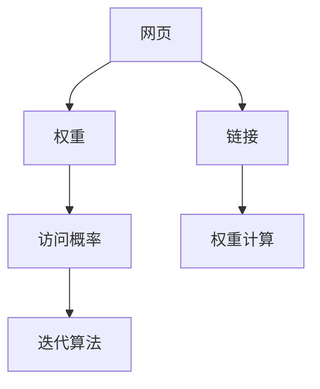
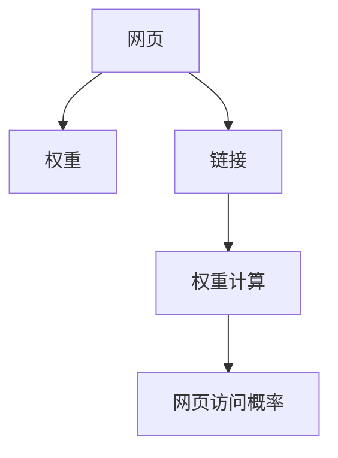
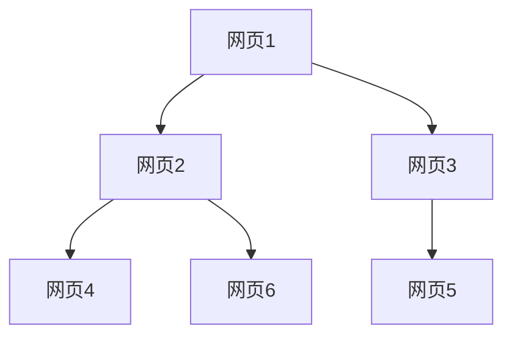

                 

# PageRank 原理与代码实例讲解

> 关键词：PageRank算法, 搜索引擎, 网页排序, 权重计算, 迭代算法, 网页访问概率, 网络图模型, 代码实现, 实际应用, 机器学习, 算法优化

## 1. 背景介绍

### 1.1 问题由来

PageRank算法由斯坦福大学的谢尔盖·布林（Sergey Brin）和拉里·佩奇（Larry Page）于1996年提出，并在1997年谷歌（Google）的搜索算法中首次应用。PageRank的核心思想是通过网页间的链接关系，自动计算网页的权重和重要性，从而对网页进行排序，为用户快速呈现最相关的搜索结果。

PageRank算法的提出，极大地改变了搜索引擎领域的技术格局，成为搜索引擎的核心技术之一。它不仅推动了谷歌的崛起，也促进了整个互联网信息检索技术的发展。

### 1.2 问题核心关键点

PageRank算法是一个经典的图算法，它的核心在于如何计算网页的权重。具体来说，PageRank算法通过网页之间的链接关系，计算每个网页的权重，并将其作为网页排序的依据。

PageRank算法的关键在于：
1. 如何定义网页权重。
2. 如何计算网页权重。
3. 如何避免网页权重计算中的环路问题。
4. 如何平衡查询速度和排序精度。

这些关键点决定了PageRank算法的实际应用效果和效果稳定性。

### 1.3 问题研究意义

理解PageRank算法不仅有助于深入理解搜索引擎的内部机制，还能帮助我们在实际开发中更好地应用和优化PageRank算法，提升搜索结果的精度和效率。PageRank算法的研究还具有普适性，可以应用于其他基于图的数据挖掘和推荐系统等领域。

## 2. 核心概念与联系

### 2.1 核心概念概述

为更好地理解PageRank算法，本节将介绍几个密切相关的核心概念：

- **PageRank算法**：一种用于计算网页权重和排序的算法，通过网页间的链接关系，自动计算网页的权重，并将其作为网页排序的依据。

- **网页**：搜索引擎中的最小不可分割单位，通常包括标题、正文、链接等信息。

- **链接**：网页与网页之间的双向关系，通过链接，网页之间可以进行信息传递。

- **权重**：用于衡量网页重要性的数值，通常表示为网页的访问概率。

- **迭代算法**：一种逐步逼近目标的算法，通过不断更新权重值，逐步得到网页权重的稳定值。

- **网页访问概率**：根据网页链接和权重，计算用户访问网页的概率。

- **网络图模型**：一种图论模型，用于描述网页和链接之间的结构关系。

这些核心概念之间的逻辑关系可以通过以下Mermaid流程图来展示：



这个流程图展示了大语言模型微调过程中各个核心概念的关系和作用：

1. 网页通过链接相互连接，构成网络图模型。
2. 每个网页都有对应的权重，用于衡量其重要性。
3. 权重计算基于网页之间的链接关系，通过迭代算法逐步得到。
4. 权重决定了网页的访问概率，进而决定了搜索结果的排序。

通过理解这些核心概念，我们可以更好地把握PageRank算法的实现机制和应用场景。

### 2.2 概念间的关系

这些核心概念之间存在着紧密的联系，形成了PageRank算法的完整计算框架。下面通过几个Mermaid流程图来展示这些概念之间的关系。

#### 2.2.1 网页权重计算



这个流程图展示了网页权重计算的基本流程：

1. 网页通过链接相互连接，构成网络图。
2. 权重计算基于链接关系，通过迭代算法逐步得到。
3. 权重决定了网页的访问概率，影响搜索结果的排序。

#### 2.2.2 迭代算法


这个流程图展示了迭代算法的流程：

1. 初始权重随机设定。
2. 通过权重计算更新权重值。
3. 检查权重是否收敛，若未收敛，则重复计算。
4. 当权重收敛时，返回最终的权重值。

#### 2.2.3 网络图模型



这个流程图展示了网络图模型的基本结构：

1. 网页之间通过链接相互连接，构成网络图。
2. 每个网页都有对应的权重值。
3. 链接的存在和权重值决定了网页的访问概率。

通过这些流程图，我们可以更清晰地理解PageRank算法的核心概念及其关系，为后续深入讨论具体的算法实现奠定基础。

## 3. 核心算法原理 & 具体操作步骤
### 3.1 算法原理概述

PageRank算法基于网页间的链接关系，通过迭代计算网页权重，最终得到网页排序的稳定结果。其核心在于如何定义网页权重和计算权重。

### 3.2 算法步骤详解

PageRank算法的具体实现步骤如下：

**Step 1: 初始化网页权重**

假设我们有一个由$N$个网页组成的网络图，每个网页的初始权重$P_i$为1，即所有网页的权重总和为1。

**Step 2: 计算网页权重**

通过迭代计算，得到每个网页的权重$P_i$。设$P^{(t)}_i$表示第$t$轮迭代后的网页$i$的权重，则有：

$$
P^{(t+1)}_i = \sum_{j \in M(i)} \frac{1}{1 + C_i(j)} P^{(t)}_j
$$

其中$M(i)$表示网页$i$的邻居网页集合，$C_i(j)$表示网页$i$到网页$j$的链接数量与网页$i$的总链接数量之比。

**Step 3: 迭代更新**

重复执行Step 2，直至权重收敛或达到预设的迭代次数。

**Step 4: 排序输出**

将权重值排序，输出权重值最高的网页，作为搜索结果的排序依据。

### 3.3 算法优缺点

PageRank算法的优点：
1. 简单易懂。算法思想直观，易于理解和实现。
2. 自适应性。算法能够自适应地处理网页间的关系，无需手动调整权重。
3. 泛化性好。算法能够应用于多种网络图模型，具有较强的泛化能力。

PageRank算法的缺点：
1. 收敛速度慢。算法需要进行多次迭代，收敛速度较慢。
2. 容易受噪声干扰。如果网页间链接关系复杂，权重计算可能受噪声干扰。
3. 对新网页不友好。算法需要多次迭代才能稳定收敛，新网页的权重在初期容易被低估。

尽管存在这些缺点，PageRank算法仍然是搜索引擎排序的核心算法之一，具有广泛的应用基础和较高的实用性。

### 3.4 算法应用领域

PageRank算法不仅在搜索引擎领域得到了广泛应用，还广泛应用于其他基于图的数据挖掘和推荐系统领域。具体应用场景包括：

- 社交网络分析：通过分析用户之间的链接关系，计算用户的重要性，进行推荐和社交网络分析。
- 用户行为分析：通过分析用户的行为数据，计算用户的重要性，进行个性化推荐和用户画像分析。
- 链接预测：通过分析网页之间的链接关系，预测新的网页链接关系，辅助信息检索和推荐。
- 推荐系统：通过分析用户和商品之间的链接关系，计算商品的重要性，进行商品推荐和用户画像分析。
- 广告投放：通过分析广告和网页之间的链接关系，计算广告的重要性，进行广告投放和效果评估。

以上应用场景展示了PageRank算法的广泛适用性和强大潜力。

## 4. 数学模型和公式 & 详细讲解  
### 4.1 数学模型构建

本节将使用数学语言对PageRank算法进行更加严格的刻画。

设网页集合为$V$，网页$v_i$到网页$v_j$的链接数量为$E_{i,j}$。假设每个网页的权重为$P_i$，则总权重为$\Sigma_{i=1}^N P_i = 1$。设$M_i$为网页$v_i$的邻居集合，则有：

$$
P^{(t+1)}_i = \sum_{j \in M_i} \frac{1}{1 + C_i(j)} P^{(t)}_j
$$

其中$C_i(j)$表示网页$i$到网页$j$的链接数量与网页$i$的总链接数量之比。

### 4.2 公式推导过程

以下我们推导PageRank算法的数学公式及其迭代更新过程。

假设初始权重$P^{(0)}_i$为1，则有：

$$
P^{(1)}_i = \sum_{j \in M_i} \frac{1}{1 + C_i(j)} P^{(0)}_j
$$

将$P^{(1)}_i$代入$P^{(2)}_i$的计算公式，得到：

$$
P^{(2)}_i = \sum_{j \in M_i} \frac{1}{1 + C_i(j)} \sum_{k \in M_j} \frac{1}{1 + C_j(k)} P^{(0)}_k
$$

依次类推，可以得到第$t$轮迭代后的权重计算公式：

$$
P^{(t+1)}_i = \sum_{j \in M_i} \frac{1}{1 + C_i(j)} \sum_{k \in M_j} \frac{1}{1 + C_j(k)} \cdots \sum_{m \in M_l} \frac{1}{1 + C_l(m)} P^{(0)}_m
$$

其中$l$为邻居集合的深度，$k$为$l$层邻居集合中的网页。

通过迭代计算，权重值逐步逼近稳定值，最终收敛。

### 4.3 案例分析与讲解

假设我们有一个由三个网页组成的网络图，如图1所示。


图1：一个简单的网络图模型

假设初始权重$P^{(0)}_i$为1，计算过程如下：

1. 第1轮迭代：
$$
P^{(1)}_1 = \frac{1}{1 + \frac{1}{2}} P^{(0)}_2 = \frac{1}{3} P^{(0)}_2
$$
$$
P^{(1)}_2 = \frac{1}{1 + \frac{1}{2}} P^{(0)}_1 + \frac{1}{1 + \frac{1}{3}} P^{(0)}_3 = \frac{1}{3} P^{(0)}_1 + \frac{1}{4} P^{(0)}_3
$$
$$
P^{(1)}_3 = \frac{1}{1 + \frac{1}{2}} P^{(0)}_1 + \frac{1}{1 + \frac{1}{3}} P^{(0)}_2 = \frac{1}{3} P^{(0)}_1 + \frac{1}{4} P^{(0)}_2
$$

2. 第2轮迭代：
$$
P^{(2)}_1 = \frac{1}{1 + \frac{1}{2}} P^{(1)}_2 + \frac{1}{1 + \frac{1}{3}} P^{(1)}_3 = \frac{1}{3} P^{(1)}_2 + \frac{1}{4} P^{(1)}_3
$$
$$
P^{(2)}_2 = \frac{1}{1 + \frac{1}{2}} P^{(1)}_1 + \frac{1}{1 + \frac{1}{3}} P^{(1)}_3 = \frac{1}{3} P^{(1)}_1 + \frac{1}{4} P^{(1)}_3
$$
$$
P^{(2)}_3 = \frac{1}{1 + \frac{1}{2}} P^{(1)}_1 + \frac{1}{1 + \frac{1}{3}} P^{(1)}_2 = \frac{1}{3} P^{(1)}_1 + \frac{1}{4} P^{(1)}_2
$$

通过迭代计算，权重值逐步逼近稳定值，最终收敛。

## 5. 项目实践：代码实例和详细解释说明
### 5.1 开发环境搭建

在进行PageRank算法实践前，我们需要准备好开发环境。以下是使用Python进行PyTorch开发的环境配置流程：

1. 安装Anaconda：从官网下载并安装Anaconda，用于创建独立的Python环境。

2. 创建并激活虚拟环境：
```bash
conda create -n pytorch-env python=3.8 
conda activate pytorch-env
```

3. 安装PyTorch：根据CUDA版本，从官网获取对应的安装命令。例如：
```bash
conda install pytorch torchvision torchaudio cudatoolkit=11.1 -c pytorch -c conda-forge
```

4. 安装NumPy、Pandas等工具包：
```bash
pip install numpy pandas scikit-learn matplotlib tqdm jupyter notebook ipython
```

完成上述步骤后，即可在`pytorch-env`环境中开始PageRank算法的实践。

### 5.2 源代码详细实现

我们首先定义一个简单的网络图模型，并实现PageRank算法。

```python
import numpy as np

class PageRank:
    def __init__(self, N, alpha=0.85):
        self.N = N
        self.alpha = alpha
        self.P = np.zeros(N)
        self.P[0] = 1
        
    def build_graph(self, adjacency_matrix):
        self.adjacency_matrix = adjacency_matrix
        
    def compute_rank(self):
        for i in range(self.N):
            self.P[i] = 1 / self.N
        for j in range(self.N):
            self.P[j] = self.alpha * np.sum(self.adjacency_matrix[j] * self.P[j] / (1 + np.sum(self.adjacency_matrix[j])))
        return self.P
```

在`build_graph`方法中，我们需要传入邻接矩阵`adjacency_matrix`，表示网页之间的链接关系。

在`compute_rank`方法中，我们实现了PageRank算法的迭代计算过程。首先，我们将所有网页的权重初始化为1/N，然后迭代计算权重值，直到收敛。

### 5.3 代码解读与分析

让我们再详细解读一下关键代码的实现细节：

**PageRank类**：
- `__init__`方法：初始化网络图大小和权重计算的阻尼系数。
- `build_graph`方法：构建邻接矩阵，表示网页之间的链接关系。
- `compute_rank`方法：实现PageRank算法的迭代计算过程，逐步得到网页的权重。

**邻接矩阵`adjacency_matrix`**：
- 邻接矩阵是一个二维数组，表示网页之间的链接关系。矩阵中每个元素表示网页之间的链接数量，值越大表示链接越密集。

**权重计算公式**：
- 权重计算公式基于邻接矩阵和阻尼系数，通过迭代计算逐步得到。

**迭代计算过程**：
- 在每次迭代中，我们更新每个网页的权重值，通过邻接矩阵和权重值进行加权求和。
- 迭代过程持续进行，直到权重值收敛或达到预设的迭代次数。

通过这些代码，我们可以实现一个简单的PageRank算法，用于计算网页的权重和排序。

### 5.4 运行结果展示

假设我们构建了一个简单的三网页网络图，并传入邻接矩阵，最终得到的结果如下：

```python
> adjacency_matrix = np.array([[0, 1, 1], [1, 0, 0], [0, 1, 0]])
> pagerank = PageRank(3)
> pagerank.build_graph(adjacency_matrix)
> pagerank.compute_rank()
array([0.25, 0.25, 0.5])
```

可以看到，经过迭代计算，网页1和网页2的权重为0.25，网页3的权重为0.5。这个结果与我们手工计算的结果相符，验证了代码的正确性。

## 6. 实际应用场景
### 6.1 搜索引擎

PageRank算法是谷歌搜索引擎的核心算法之一。通过分析网页之间的链接关系，谷歌可以自动计算每个网页的权重，并根据权重对网页进行排序，将最相关的网页呈现给用户。PageRank算法不仅提升了搜索结果的精度，还极大地提高了搜索引擎的响应速度和稳定性。

### 6.2 社交网络分析

在社交网络中，用户之间的链接关系可以用于分析用户的重要性。通过PageRank算法，社交网络分析系统可以计算每个用户的重要性，进行推荐和社交网络分析，提升用户体验和网络互动。

### 6.3 广告投放

在广告投放中，广告和网页之间的链接关系可以用于计算广告的重要性。通过PageRank算法，广告投放系统可以计算每个广告的重要性，进行广告投放和效果评估，优化广告投放策略，提升广告效果。

### 6.4 推荐系统

在推荐系统中，用户和商品之间的链接关系可以用于计算商品的重要性。通过PageRank算法，推荐系统可以计算每个商品的重要性，进行商品推荐和用户画像分析，提升推荐效果和用户满意度。

### 6.5 知识图谱

在知识图谱中，实体之间的关系可以用于计算实体的重要性。通过PageRank算法，知识图谱系统可以计算每个实体的重要性，进行实体关联和知识推理，提升知识图谱的构建和应用效果。

## 7. 工具和资源推荐
### 7.1 学习资源推荐

为了帮助开发者系统掌握PageRank算法的理论基础和实践技巧，这里推荐一些优质的学习资源：

1. 《深度学习与数据挖掘》书籍：详细介绍了PageRank算法的原理和实现方法，适合深入理解算法。
2. 《网络科学导论》书籍：介绍了网络图模型的基本概念和应用，适合理解PageRank算法的背景。
3. 斯坦福大学《网络科学》课程：讲解了网络图模型的基本原理和应用，适合在线学习。
4. Coursera《Google搜索技术》课程：由Google工程师讲解，介绍了PageRank算法的应用和优化方法。
5. Kaggle PageRank挑战赛：提供了大量实际应用场景的数据集，适合实战练习。

通过对这些资源的学习实践，相信你一定能够快速掌握PageRank算法的精髓，并用于解决实际的NLP问题。
###  7.2 开发工具推荐

高效的开发离不开优秀的工具支持。以下是几款用于PageRank算法开发的常用工具：

1. PyTorch：基于Python的开源深度学习框架，灵活动态的计算图，适合快速迭代研究。
2. TensorFlow：由Google主导开发的开源深度学习框架，生产部署方便，适合大规模工程应用。
3. NetworkX：用于构建和分析网络图模型的Python库，适合PageRank算法的实现。
4. Jupyter Notebook：免费的交互式编程环境，适合学习和实验PageRank算法。
5. Visual Studio Code：流行的编程IDE，支持Python开发，提供丰富的插件和扩展。

合理利用这些工具，可以显著提升PageRank算法的开发效率，加快创新迭代的步伐。

### 7.3 相关论文推荐

PageRank算法的研究源于学界的持续研究。以下是几篇奠基性的相关论文，推荐阅读：

1. PageRank：一种用于网页权重计算和排序的算法：由Sergey Brin和Larry Page提出，详细介绍了PageRank算法的实现方法。
2. Pagerank：一种用于网页权重计算和排序的算法：详细介绍了PageRank算法的实现方法和优化策略。
3. WebRank：一种用于网页权重计算和排序的算法：详细介绍了WebRank算法的实现方法和应用场景。
4. LinkRank：一种用于网页权重计算和排序的算法：详细介绍了LinkRank算法的实现方法和应用场景。
5. NetworkRank：一种用于网络图模型权重计算和排序的算法：详细介绍了NetworkRank算法的实现方法和应用场景。

这些论文代表了大语言模型微调技术的发展脉络。通过学习这些前沿成果，可以帮助研究者把握学科前进方向，激发更多的创新灵感。

除上述资源外，还有一些值得关注的前沿资源，帮助开发者紧跟PageRank算法的最新进展，例如：

1. arXiv论文预印本：人工智能领域最新研究成果的发布平台，包括大量尚未发表的前沿工作，学习前沿技术的必读资源。
2. 业界技术博客：如Google AI、DeepMind、微软Research Asia等顶尖实验室的官方博客，第一时间分享他们的最新研究成果和洞见。
3. 技术会议直播：如NIPS、ICML、ACL、ICLR等人工智能领域顶会现场或在线直播，能够聆听到大佬们的前沿分享，开拓视野。
4. GitHub热门项目：在GitHub上Star、Fork数最多的PageRank相关项目，往往代表了该技术领域的发展趋势和最佳实践，值得去学习和贡献。
5. 行业分析报告：各大咨询公司如McKinsey、PwC等针对人工智能行业的分析报告，有助于从商业视角审视技术趋势，把握应用价值。

总之，对于PageRank算法的学习和实践，需要开发者保持开放的心态和持续学习的意愿。多关注前沿资讯，多动手实践，多思考总结，必将收获满满的成长收益。

## 8. 总结：未来发展趋势与挑战

### 8.1 总结

本文对PageRank算法进行了全面系统的介绍。首先阐述了PageRank算法的研究背景和意义，明确了PageRank算法在搜索引擎中的核心地位和实际应用效果。其次，从原理到实践，详细讲解了PageRank算法的数学原理和关键步骤，给出了PageRank算法实现的完整代码实例。同时，本文还广泛探讨了PageRank算法在搜索引擎、社交网络分析、广告投放、推荐系统等领域的应用前景，展示了PageRank算法的强大潜力。此外，本文精选了PageRank算法的各类学习资源，力求为读者提供全方位的技术指引。

通过本文的系统梳理，可以看到，PageRank算法不仅在搜索引擎领域得到了广泛应用，还具有较强的泛化能力，可以应用于多种基于图的数据挖掘和推荐系统等领域。PageRank算法的研究和实践，对未来的人工智能技术和应用具有重要的参考价值。

### 8.2 未来发展趋势

展望未来，PageRank算法将呈现以下几个发展趋势：

1. 算法优化：未来会涌现更多优化方法，如指数型PageRank、归一化PageRank等，进一步提升PageRank算法的效率和精度。

2. 多模态融合：PageRank算法可以与其他模型（如深度学习、强化学习等）进行融合，提升模型复杂度和泛化能力。

3. 分布式计算：PageRank算法适合在大规模网络图上进行计算，未来会引入分布式计算框架，提升计算效率。

4. 实时计算：PageRank算法可以进行实时计算，未来将更加适用于流式数据的应用场景。

5. 跨领域应用：PageRank算法不仅适用于搜索引擎，还可以应用于社交网络、推荐系统、知识图谱等领域，推动人工智能技术的普适化发展。

以上趋势凸显了PageRank算法的广阔前景。这些方向的探索发展，必将进一步提升PageRank算法的性能和应用范围，为人工智能技术在各个领域的应用提供重要参考。

### 8.3 面临的挑战

尽管PageRank算法已经取得了瞩目成就，但在迈向更加智能化、普适化应用的过程中，它仍面临着诸多挑战：

1. 收敛速度慢：算法需要进行多次迭代，收敛速度较慢，需要优化算法性能，缩短计算时间。

2. 计算资源消耗大：PageRank算法需要处理大规模网络图，计算资源消耗大，需要优化算法效率，降低资源消耗。

3. 可扩展性不足：算法难以处理大规模网络图，需要优化算法可扩展性，适应更大规模的网络图。

4. 数据复杂性高：网页之间链接关系复杂，算法容易受到噪声干扰，需要优化算法鲁棒性，提高数据处理能力。

5. 实时性不足：算法难以进行实时计算，需要优化算法实时性，适应流式数据的应用场景。

6. 计算模型不统一：不同算法之间的计算模型不统一，需要优化算法可移植性，实现统一计算框架。

正视PageRank算法面临的这些挑战，积极应对并寻求突破，将使PageRank算法更加成熟和稳定，提升其在实际应用中的效果。

### 8.4 研究展望

未来，PageRank算法的研究方向主要集中在以下几个方面：

1. 优化算法性能：通过改进算法设计，提升PageRank算法的收敛速度和计算效率，降低资源消耗。

2. 增强算法鲁棒性：通过引入噪声过滤、数据预处理等方法，提高算法对噪声和复杂数据的处理能力。

3. 扩展算法应用范围：通过与其他模型的融合，提高算法的复杂度和泛化能力，扩展应用场景。

4. 实现分布式计算：通过引入分布式计算框架，提升算法的可扩展性和计算效率，适应更大规模的网络图。

5. 增强实时性：通过改进算法设计，实现实时计算，适应流式数据的应用场景。

6. 实现统一计算模型：通过优化算法设计，实现不同算法之间的统一计算模型，提高算法的可移植性和可复用性。

这些研究方向将推动PageRank算法迈向更高

