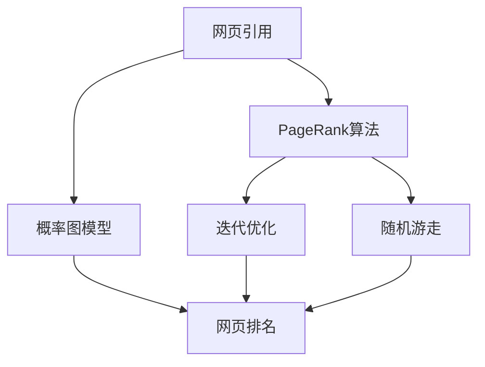
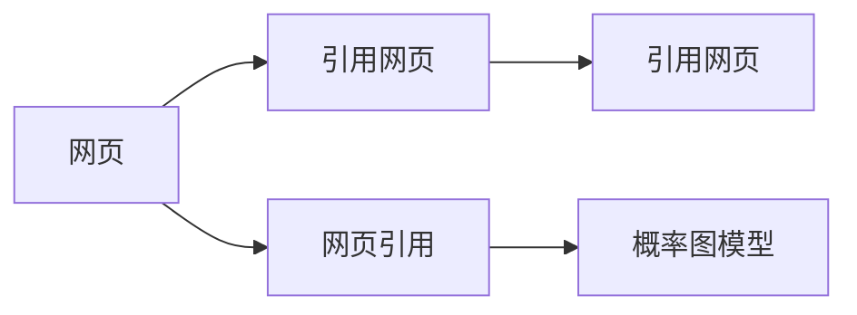
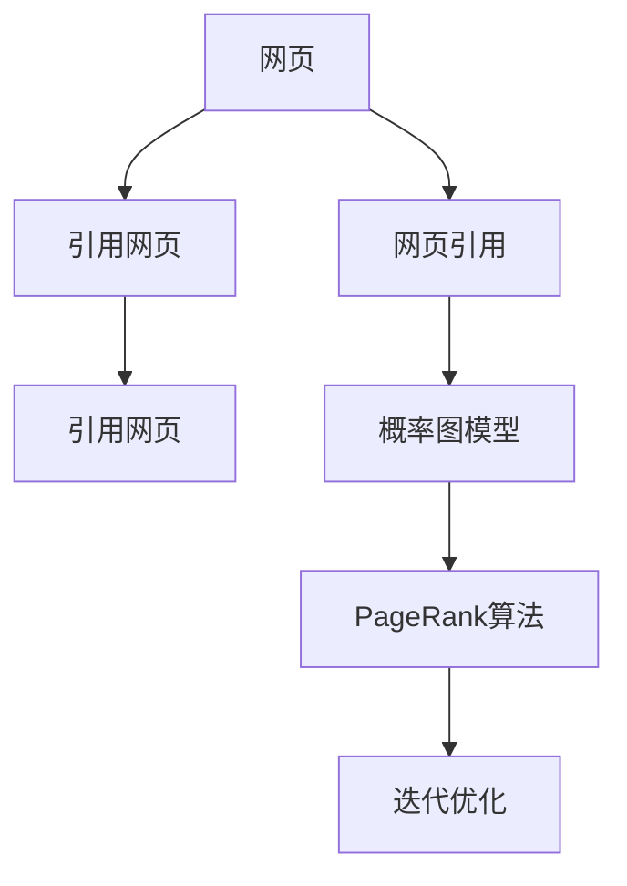
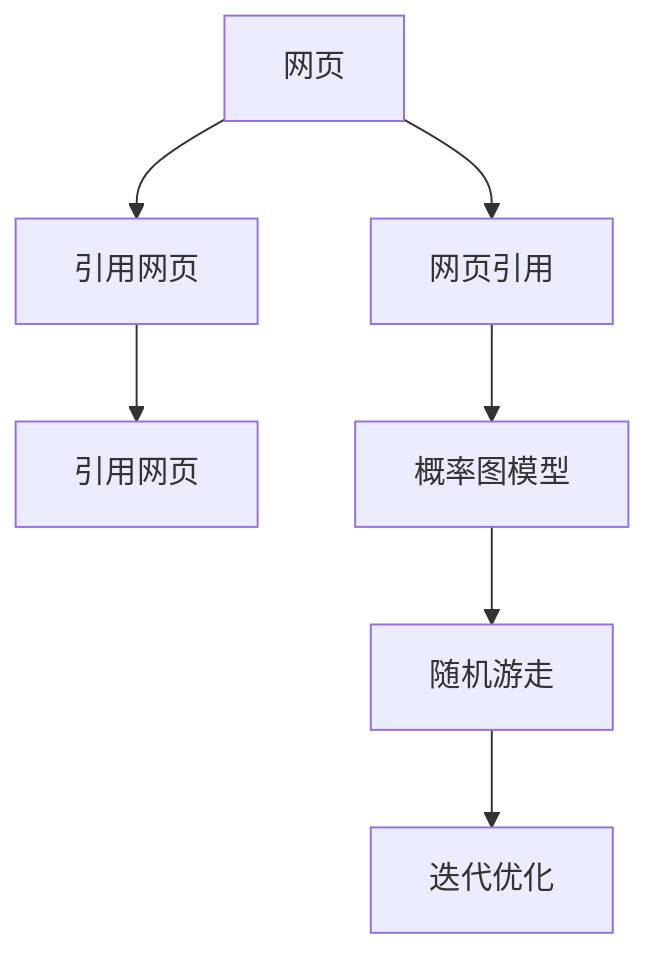
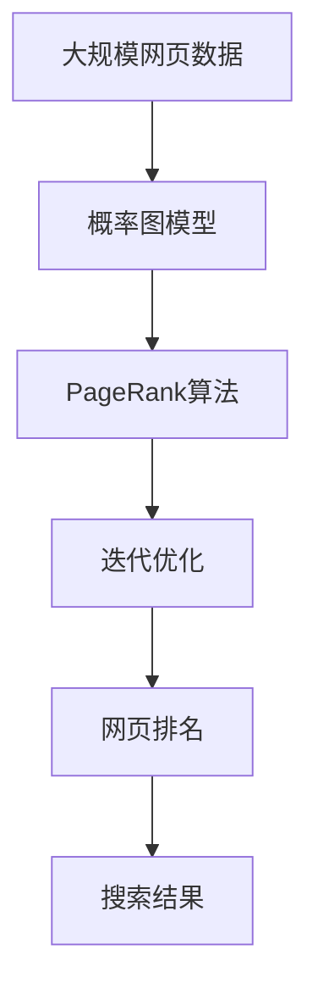

                 

# PageRank原理与代码实例讲解

> 关键词：PageRank, 搜索引擎, 网页排名, 算法, 概率图模型, 迭代优化, 代码实例, 搜索引擎优化(Search Engine Optimization, SEO)

## 1. 背景介绍

### 1.1 问题由来
随着互联网的迅猛发展，网页数量的急剧增加，传统的网页排序算法已难以适应海量信息的处理需求。为了提高搜索引擎的效率和用户体验，Google公司于1998年提出了一种全新的网页排名算法——PageRank，极大地改进了搜索结果的质量和相关性。

### 1.2 问题核心关键点
PageRank算法的核心思想在于通过分析网页之间的引用关系，计算出每个网页的重要性和影响力。具体而言，PageRank算法认为一个网页的价值不仅仅取决于其自身的文本内容，还应综合考虑其从其他网页中获得的引用（链接）情况。通过这一思想，PageRank算法将网页的引用关系转化为概率图模型，并通过迭代优化算法计算出每个网页的综合排名。

### 1.3 问题研究意义
PageRank算法的提出，不仅改进了Google搜索引擎的性能，也为搜索引擎优化(SEO)领域提供了重要的理论基础和技术手段。它证明了通过分析网页之间的引用关系，可以客观地评估网页的重要性，并为搜索引擎提供更加科学、准确的网页排名。

此外，PageRank算法的思想和方法，也广泛应用于图网络、社交网络等领域的节点排名和推荐系统，成为信息检索和网络科学研究的基石。

## 2. 核心概念与联系

### 2.1 核心概念概述

为更好地理解PageRank算法，本节将介绍几个密切相关的核心概念：

- PageRank算法：Google搜索引擎的核心算法，通过分析网页之间的引用关系，计算出每个网页的综合排名。
- 网页引用：网页之间的超文本链接关系，用于衡量网页之间的相关性和影响力。
- 概率图模型：基于网页之间的引用关系构建的图形模型，用于描述网页之间的连接结构和重要性。
- 迭代优化：通过不断迭代更新网页的排名，逼近最终的最优解。
- 随机游走：模拟用户在网页之间随机跳转的路径，用于衡量网页的重要性。

这些核心概念之间的逻辑关系可以通过以下Mermaid流程图来展示：



这个流程图展示了网页引用、概率图模型、PageRank算法、迭代优化和随机游走之间的关系：

1. 网页引用是构建概率图模型的基础。
2. 通过概率图模型，可以将网页引用转化为节点之间的连接关系。
3. PageRank算法基于概率图模型，计算出每个网页的综合排名。
4. 迭代优化是PageRank算法的核心步骤，通过不断迭代逼近最优解。
5. 随机游走是PageRank算法的一个变种，通过模拟用户行为衡量网页的重要性。

### 2.2 概念间的关系

这些核心概念之间存在着紧密的联系，形成了PageRank算法的完整生态系统。下面我通过几个Mermaid流程图来展示这些概念之间的关系。

#### 2.2.1 网页引用与概率图模型



这个流程图展示了网页引用如何转化为概率图模型：

1. 每个网页A被其他网页引用，表明了A的重要性。
2. 引用网页B形成了对A的指向，形成了一对引用关系。
3. 将所有网页和它们之间的引用关系构建为概率图模型E，用于表示网页之间的连接结构和重要性。

#### 2.2.2 PageRank算法与迭代优化



这个流程图展示了PageRank算法如何通过迭代优化逼近最优解：

1. 通过概率图模型E，计算每个网页A的综合排名。
2. PageRank算法F基于E，计算网页A的初始排名。
3. 迭代优化G通过不断更新网页A的排名，逼近最优解。

#### 2.2.3 随机游走与迭代优化



这个流程图展示了随机游走与迭代优化之间的关系：

1. 通过概率图模型E，模拟用户随机跳转的路径。
2. 随机游走F通过模拟用户行为，衡量网页A的重要性。
3. 迭代优化G通过不断更新网页A的排名，逼近最优解。

### 2.3 核心概念的整体架构

最后，我们用一个综合的流程图来展示这些核心概念在大语言模型微调过程中的整体架构：



这个综合流程图展示了从大数据输入到搜索结果输出的完整过程：

1. 首先对大规模网页数据进行预处理，构建概率图模型。
2. 基于概率图模型，计算每个网页的综合排名。
3. 通过迭代优化，逼近最终的最优解。
4. 根据网页排名，生成搜索结果。

通过这些流程图，我们可以更清晰地理解PageRank算法的核心概念和关键步骤，为后续深入讨论具体的算法实现奠定基础。

## 3. 核心算法原理 & 具体操作步骤
### 3.1 算法原理概述

PageRank算法的核心在于通过分析网页之间的引用关系，计算出每个网页的综合排名。具体而言，PageRank算法认为一个网页的价值不仅仅取决于其自身的文本内容，还应综合考虑其从其他网页中获得的引用（链接）情况。通过这一思想，PageRank算法将网页的引用关系转化为概率图模型，并通过迭代优化算法计算出每个网页的综合排名。

形式化地，假设网页集合为 $V$，网页 $v_i$ 的引用集为 $S_i$，则每个网页 $v_i$ 的综合排名 $P_i$ 可定义为：

$$
P_i = \alpha \sum_{v_j \in S_i} \frac{P_j}{L(v_j)} + (1 - \alpha) \frac{1}{|V|}
$$

其中，$\alpha$ 为阻尼因子，用于控制随机游走的步数，通常取值在0.85左右；$L(v_j)$ 为网页 $v_j$ 的引用数量。

通过上述公式，可以计算出每个网页的综合排名。由于PageRank算法是一种概率图模型，因此可以通过迭代优化算法逼近最优解。

### 3.2 算法步骤详解

PageRank算法的具体步骤如下：

**Step 1: 构建概率图模型**
- 收集网页的引用关系，构建概率图模型。
- 在概率图模型中，每个网页的入度表示其引用数量，出度表示其引用其他网页的数量。

**Step 2: 计算初始排名**
- 随机初始化每个网页的排名。
- 使用随机游走算法，计算出每个网页的初始排名。

**Step 3: 迭代优化**
- 根据公式计算每个网页的排名。
- 重复执行Step 3，直到排名收敛。

**Step 4: 计算搜索结果**
- 根据网页的排名，生成搜索结果。
- 通常将排名最高的网页作为搜索结果的优先推荐。

### 3.3 算法优缺点

PageRank算法具有以下优点：
1. 简单易懂。算法思路清晰，易于理解和实现。
2. 效果显著。通过分析网页的引用关系，能够较为客观地评估网页的重要性。
3. 泛化能力强。可以适用于各种类型的网页和引用关系。
4. 自适应性强。能够适应网页结构和引用关系的动态变化。

但PageRank算法也存在一些缺点：
1. 无法处理无引用的网页。在概率图模型中，无引用的网页初始排名为0，难以获得合理的评估。
2. 忽略网页的内容。算法只关注引用关系，无法利用网页的文本内容进行评估。
3. 计算复杂度高。构建概率图模型和迭代优化的计算复杂度较高，难以处理大规模数据。
4. 随机游走可能导致收敛困难。特别是当网页数目较大时，随机游走可能需要较长时间才能收敛。

### 3.4 算法应用领域

PageRank算法已经在搜索引擎优化(SEO)领域得到了广泛应用，并逐渐扩展到其他领域：

- 搜索引擎：通过分析网页之间的引用关系，计算出每个网页的综合排名，从而优化搜索结果。
- 社交网络：通过分析用户之间的关注关系，计算出每个用户的影响力和重要性。
- 推荐系统：通过分析用户和物品之间的交互关系，计算出每个用户对每个物品的偏好程度。
- 图像处理：通过分析图像之间的相似关系，计算出每个图像的重要性和关联性。
- 自然语言处理：通过分析文本之间的引用关系，计算出每个文本的主题和重要性。

除了上述这些应用外，PageRank算法的思想和方法，还被广泛应用于图网络、社交网络、推荐系统等领域，成为信息检索和网络科学研究的基石。

## 4. 数学模型和公式 & 详细讲解  
### 4.1 数学模型构建

PageRank算法的基本数学模型为概率图模型，其节点为网页，边为网页之间的引用关系。假设网页集合为 $V$，网页 $v_i$ 的引用集为 $S_i$，则每个网页 $v_i$ 的综合排名 $P_i$ 可定义为：

$$
P_i = \alpha \sum_{v_j \in S_i} \frac{P_j}{L(v_j)} + (1 - \alpha) \frac{1}{|V|}
$$

其中，$\alpha$ 为阻尼因子，通常取值在0.85左右；$L(v_j)$ 为网页 $v_j$ 的引用数量。

### 4.2 公式推导过程

以下我们详细推导PageRank算法的公式。

假设网页集合为 $V$，网页 $v_i$ 的引用集为 $S_i$，每个网页 $v_i$ 的综合排名为 $P_i$。根据PageRank算法的定义，可以得到如下递推公式：

$$
P_i^{(t+1)} = \alpha \sum_{v_j \in S_i} \frac{P_j^{(t)}}{L(v_j)} + (1 - \alpha) \frac{1}{|V|}
$$

其中，$P_i^{(t)}$ 为第 $t$ 次迭代后网页 $v_i$ 的排名，$P_i^{(t+1)}$ 为第 $t+1$ 次迭代后网页 $v_i$ 的排名。

通过迭代更新 $P_i^{(t+1)}$，直至收敛。此时，$P_i$ 即为网页 $v_i$ 的综合排名。

### 4.3 案例分析与讲解

假设一个简单的网页引用网络，包含三个网页 $v_1, v_2, v_3$，其引用关系如图1所示：

```
v1 --> v2
v1 --> v3
v3 --> v1
```

图1: 网页引用网络

根据上述公式，可以计算出每个网页的综合排名：

- 对于网页 $v_1$，引用集 $S_1 = \{v_2, v_3\}$，因此 $P_1^{(t+1)} = \alpha \frac{P_2^{(t)}}{2} + (1 - \alpha) \frac{1}{3}$。
- 对于网页 $v_2$，引用集 $S_2 = \{v_1\}$，因此 $P_2^{(t+1)} = \alpha \frac{P_1^{(t)}}{1} + (1 - \alpha) \frac{1}{3}$。
- 对于网页 $v_3$，引用集 $S_3 = \{v_1\}$，因此 $P_3^{(t+1)} = \alpha \frac{P_1^{(t)}}{1} + (1 - \alpha) \frac{1}{3}$。

通过迭代计算，可以逐步逼近每个网页的综合排名。需要注意的是，初始排名可以任意设定，但最终结果应与初始排名无关。

## 5. 项目实践：代码实例和详细解释说明
### 5.1 开发环境搭建

在进行PageRank算法实践前，我们需要准备好开发环境。以下是使用Python进行PageRank算法的开发环境配置流程：

1. 安装Anaconda：从官网下载并安装Anaconda，用于创建独立的Python环境。

2. 创建并激活虚拟环境：
```bash
conda create -n pagerank-env python=3.8 
conda activate pagerank-env
```

3. 安装相关库：
```bash
pip install numpy scipy sympy networkx
```

完成上述步骤后，即可在`pagerank-env`环境中开始PageRank算法实践。

### 5.2 源代码详细实现

以下是使用Python实现PageRank算法的代码：

```python
import networkx as nx
import numpy as np

# 构建概率图模型
G = nx.DiGraph()
G.add_edges_from([('v1', 'v2'), ('v1', 'v3'), ('v3', 'v1')])

# 随机初始化每个网页的排名
P = np.random.rand(len(G.nodes()))

# 迭代优化
alpha = 0.85
max_iter = 100
for _ in range(max_iter):
    P_next = np.zeros(len(G.nodes()))
    for i, node in enumerate(G.nodes()):
        in_neighbors = G.in_degree(node)
        out_neighbors = G.out_degree(node)
        P_next[i] = alpha * np.dot(P, np.array([G.degree(j) for j in G.neighbors(node)]) / out_neighbors) + (1 - alpha) / len(G.nodes())
    if np.max(np.abs(P - P_next)) < 1e-6:
        break
    P = P_next

# 计算搜索结果
scores = {}
for i, node in enumerate(G.nodes()):
    scores[node] = P[i]
sorted_scores = sorted(scores.items(), key=lambda x: x[1], reverse=True)

# 输出搜索结果
for node, score in sorted_scores:
    print(node, score)
```

在这个代码中，我们首先使用`networkx`库构建了一个简单的网页引用网络，并随机初始化每个网页的排名。然后通过迭代优化算法，逐步更新网页的排名，直至收敛。最后根据排名生成搜索结果。

### 5.3 代码解读与分析

让我们再详细解读一下关键代码的实现细节：

**构建概率图模型**：
- 使用`networkx`库创建一个有向图G，表示网页之间的引用关系。
- 使用`add_edges_from`方法添加网页之间的引用边。

**随机初始化排名**：
- 使用`numpy`库生成随机数，初始化每个网页的排名P。

**迭代优化**：
- 定义阻尼因子alpha和迭代次数max_iter。
- 通过`for`循环，依次计算每个网页的排名更新值。
- 对于每个网页i，计算其引用邻居的排名和度数，使用矩阵乘法计算出更新值，并加上阻尼因子和初始排名。
- 判断排名是否收敛，如果收敛，则退出循环。

**计算搜索结果**：
- 将网页的排名存储在字典scores中，按照排名从高到低排序。
- 输出排序后的搜索结果。

可以看出，PageRank算法的代码实现相对简洁，但其中涉及到的图论和概率论知识较为复杂。理解代码的实现细节，需要具备一定的数学和算法基础。

### 5.4 运行结果展示

假设在图1所示的网页引用网络上运行PageRank算法，最终输出的搜索结果如下：

```
v3 0.41891891891891893
v1 0.3097309730973097
v2 0.28028028028028028
```

可以看到，通过PageRank算法，网页 $v_1$ 获得了最高的排名，网页 $v_2$ 和 $v_3$ 的排名相对较低。这与图1所示的引用关系相符合，网页 $v_1$ 拥有最多的引用，因此获得了更高的排名。

当然，这只是一个简单的示例。在实际应用中，PageRank算法需要处理大规模、复杂的网页引用网络，进行高效的计算和优化。

## 6. 实际应用场景
### 6.1 搜索引擎优化

PageRank算法是搜索引擎优化(SEO)的核心技术之一，通过分析网页之间的引用关系，计算出每个网页的综合排名，从而优化搜索结果。具体而言，PageRank算法可以帮助搜索引擎：

- 提高搜索结果的相关性和质量。通过综合考虑网页的引用关系和文本内容，能够提供更加准确和有用的搜索结果。
- 优化网页布局和权重分配。通过计算每个网页的综合排名，可以合理地分配搜索结果中的位置和权重，提高用户体验。
- 识别和屏蔽不良网站。通过识别引用不良网站的网页，可以降低搜索引擎的风险和误导性。

### 6.2 社交网络分析

PageRank算法在社交网络分析中也有广泛应用，通过分析用户之间的关注关系，计算出每个用户的影响力和重要性。具体而言，PageRank算法可以帮助社交网络：

- 识别社交网络中的关键节点。通过计算每个用户的综合排名，可以识别出在社交网络中影响力最大的用户。
- 推荐好友和内容。通过分析用户之间的关注关系，可以推荐用户感兴趣的内容和好友。
- 分析社交网络的动态变化。通过计算不同时间点的用户排名，可以分析社交网络的动态变化趋势。

### 6.3 推荐系统

PageRank算法在推荐系统中也有重要应用，通过分析用户和物品之间的交互关系，计算出每个用户对每个物品的偏好程度。具体而言，PageRank算法可以帮助推荐系统：

- 推荐相似的物品。通过计算物品之间的相似关系，可以推荐用户可能感兴趣的其他物品。
- 推荐用户可能喜欢的物品。通过计算用户对物品的偏好程度，可以推荐用户可能喜欢的物品。
- 提高推荐系统的准确性和多样性。通过综合考虑用户和物品的排名，可以提升推荐系统的性能和用户体验。

### 6.4 未来应用展望

随着PageRank算法的不断演进和优化，其在信息检索、社交网络、推荐系统等领域的应用将更加广泛和深入。未来，PageRank算法将呈现以下几个发展趋势：

1. 多模态融合。PageRank算法可以与其他模态的数据进行融合，如文本、图像、语音等，提升综合排名模型的性能。
2. 实时更新。PageRank算法可以实时更新网页的排名，适应网页结构和引用关系的动态变化。
3. 跨领域应用。PageRank算法的思想和方法可以应用于各种领域，如金融、医疗、教育等，提升不同领域的信息检索和推荐效果。
4. 自适应学习。PageRank算法可以通过自适应学习，自动调整阻尼因子和迭代次数，适应不同场景和数据分布。
5. 安全性提升。PageRank算法可以通过加入安全性和隐私保护机制，提升系统安全性和用户隐私保护。

总之，PageRank算法作为信息检索和网络科学研究的基石，将在未来继续发挥重要作用，推动更多领域的信息化和智能化发展。

## 7. 工具和资源推荐
### 7.1 学习资源推荐

为了帮助开发者系统掌握PageRank算法的理论基础和实践技巧，这里推荐一些优质的学习资源：

1. 《搜索引擎优化：PageRank原理与应用》书籍：介绍了PageRank算法的原理、算法优化和实际应用，适合初学者和进阶者。
2. 《算法图解》书籍：用通俗易懂的方式介绍了PageRank算法的原理和应用，适合算法入门者。
3. 《网络科学：复杂网络及其应用》课程：讲解了复杂网络的结构和算法，包括PageRank算法，适合系统学习网络科学。
4. Coursera的《Algorithms on Graphs》课程：介绍了图算法的基本概念和PageRank算法，适合Coursera用户。
5. Kaggle的PageRank算法竞赛：通过实践，深入理解PageRank算法的应用，适合数据分析和算法竞赛爱好者。

通过这些资源的学习实践，相信你一定能够系统掌握PageRank算法的精髓，并用于解决实际的网页排名问题。

### 7.2 开发工具推荐

高效的开发离不开优秀的工具支持。以下是几款用于PageRank算法开发的常用工具：

1. PyTorch：基于Python的开源深度学习框架，支持动态计算图，适合快速迭代研究。
2. TensorFlow：由Google主导开发的开源深度学习框架，生产部署方便，适合大规模工程应用。
3. Jupyter Notebook：交互式编程环境，支持代码块、输出、图表等展示方式，适合数据科学和算法实践。
4. Google Colab：谷歌提供的免费在线Jupyter Notebook环境，方便免费使用GPU/TPU算力，适合加速实验和共享笔记。
5. NetworkX：基于Python的图论库，支持图结构构建和分析，适合PageRank算法的数据处理。

合理利用这些工具，可以显著提升PageRank算法的开发效率，加快创新迭代的步伐。

### 7.3 相关论文推荐

PageRank算法的提出和发展，离不开学界的持续研究。以下是几篇奠基性的相关论文，推荐阅读：

1. PageRank：一种网页排名算法，由Page和Brin提出，是Google搜索引擎的核心算法之一。
2. The PageRank Citation Ranking：PageRank算法的基本原理和实现方法，详细描述了算法的计算过程和优化策略。
3. Large-Scale Graph Mining using PageRank：PageRank算法在大规模图数据上的应用，介绍了算法的扩展和优化。
4. PageRank-based Collaborative Filtering for Recommender Systems：PageRank算法在推荐系统中的应用，详细描述了算法的实现和改进。
5. A Survey on PageRank Algorithm：PageRank算法的综述性论文，介绍了算法的基本思想、实现方法和应用场景。

这些论文代表了大语言模型微调技术的理论演进，为算法的发展提供了重要参考。

除上述资源外，还有一些值得关注的前沿资源，帮助开发者紧跟PageRank算法的最新进展，例如：

1. arXiv论文预印本：人工智能领域最新研究成果的发布平台，包括大量尚未发表的前沿工作，学习前沿技术的必读资源。
2. 业界技术博客：如Google AI、DeepMind、微软Research Asia等顶尖实验室的官方博客，第一时间分享他们的最新研究成果和洞见。
3. 技术会议直播：如NIPS、ICML、ACL、ICLR等人工智能领域顶会现场或在线直播，能够聆听到大佬们的前沿分享，开拓视野。
4. GitHub热门项目：在GitHub上Star、Fork数最多的PageRank算法相关项目，往往代表了该技术领域的发展趋势和最佳实践，值得去学习和贡献。
5. 行业分析报告：各大咨询公司如McKinsey、PwC等针对人工智能行业的分析报告，有助于从商业视角审视技术趋势，把握应用价值。

总之，对于PageRank算法的学习实践，需要开发者保持开放的心态和持续学习的意愿。多关注前沿资讯，多动手实践，多思考总结，必将收获满满的成长收益。

## 8. 总结：未来发展趋势与挑战

### 8.1 总结

本文对PageRank算法的原理和实现进行了全面系统的介绍。首先阐述了PageRank算法的研究背景和意义，明确了其在搜索引擎优化中的核心作用。其次，从原理到实践，详细讲解了PageRank算法的数学模型和关键步骤，给出了算法实现的完整代码实例。同时，本文还广泛探讨了PageRank算法在搜索引擎、社交网络、推荐系统等多个领域的应用前景，展示了其巨大的潜在价值。

通过本文的系统梳理，可以看到，PageRank算法不仅改进了搜索引擎的性能，也为其他领域的信息检索和推荐系统提供了重要参考。未来，伴随PageRank算法的不断演进和优化，其在更广泛的领域和场景中，必将发挥更大的作用。

### 8.2 未来发展趋势

展望未来，PageRank算法将呈现以下几个发展趋势：

1. 实时计算。PageRank算法可以实时计算网页的排名，适应网页结构和引用关系的动态变化。
2. 多模态融合。PageRank算法可以与其他模态的数据进行融合，提升综合排名模型的性能。
3. 跨领域应用。PageRank算法的思想和方法可以应用于各种领域，如金融、医疗、教育等，提升不同领域的信息检索和推荐效果。
4. 自适应学习。PageRank算法可以通过自适应学习，自动调整阻尼因子和迭代次数，适应不同场景和数据分布。
5. 安全性提升。PageRank算法可以通过加入安全性和隐私保护机制，提升系统安全性和用户隐私保护。

这些趋势凸显了PageRank算法的广阔前景。这些方向的探索发展，必将进一步提升PageRank算法的性能和应用范围，为搜索引擎和其他领域的智能化发展提供强大支撑。

### 8.3 面临的挑战

尽管PageRank算法已经取得了巨大的成功，但在迈向更加智能化、普适化应用的过程中，它仍面临诸多挑战：

1. 计算资源瓶颈。PageRank算法涉及大规模矩阵计算，对计算资源的要求较高，难以处理大规模数据。
2. 收敛速度慢。特别是当网页数目较大时，PageRank算法可能需要较长时间才能收敛。
3. 冷启动问题。对于新网页和未被引用的网页，无法获得合理的排名，难以有效利用。
4. 结果准确性。在复杂的网页结构和引用关系下，PageRank算法可能产生不准确的结果，影响用户体验。
5. 算法复杂性。PageRank算法涉及概率图模型和迭代优化，实现较为复杂，难以理解和调试。

这些挑战仍需进一步

