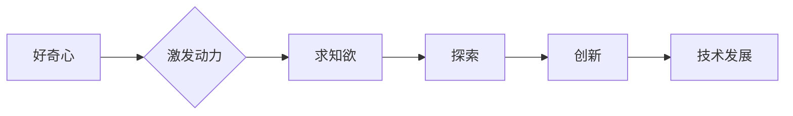

> 好奇心，求知欲，探索，创新，知识获取，技术发展，人工智能

# 好奇心与求知欲：探索的动力

好奇心和求知欲是人类进步的驱动力。在IT领域，这种探索精神尤其重要，因为它推动了技术的不断革新和人类的认知边界。本文将探讨好奇心和求知欲如何激发探索的动力，以及它们在技术发展中的作用。

## 1. 背景介绍

从远古时代的人类祖先对火和工具的发现，到现代科技对宇宙和生命的探索，好奇心和求知欲一直是人类文明进步的不竭动力。在IT领域，这种探索精神更是不可或缺，它推动着计算机科学、人工智能、网络技术等领域的飞速发展。

### 1.1 问题的由来

随着信息时代的到来，IT技术成为推动社会进步的关键力量。然而，技术的快速发展也带来了新的挑战，如信息过载、知识爆炸、技能更新换代等。在这种情况下，如何保持好奇心和求知欲，成为每个IT从业者和探索者的必修课。

### 1.2 研究现状

近年来，关于好奇心和求知欲的研究日益增多。心理学、教育学、神经科学等领域的研究表明，好奇心和求知欲是人类认知和创造力的重要基础。在IT领域，这种探索精神被用来促进技术创新、产品开发、问题解决等方面。

### 1.3 研究意义

探讨好奇心和求知欲在IT领域的应用，有助于我们更好地理解人类探索的本质，提高IT从业者的创新能力，推动技术的可持续发展。

### 1.4 本文结构

本文将分为以下几个部分：
- 介绍好奇心和求知欲的概念及其在IT领域的应用。
- 分析好奇心和求知欲如何激发探索的动力。
- 探讨好奇心和求知欲在技术发展中的作用。
- 总结好奇心和求知欲对IT领域的影响。

## 2. 核心概念与联系

### 2.1 核心概念

- **好奇心**：对未知事物或现象产生兴趣和疑问的心理状态。
- **求知欲**：渴望获取知识、探索未知领域的愿望。
- **探索**：对未知领域进行考察和研究的过程。
- **创新**：在现有知识和技术基础上，创造新理论、新技术、新产品等。

### 2.2 核心概念原理和架构的 Mermaid 流程图



### 2.3 核心概念联系

好奇心和求知欲是探索的起点，它们共同推动着人们去探索未知领域。在探索过程中，人们可能会发现新的规律、原理，从而实现创新，最终推动技术发展。

## 3. 核心算法原理 & 具体操作步骤

### 3.1 算法原理概述

好奇心和求知欲的激发主要依赖于以下几个步骤：

1. **提出问题**：对未知事物或现象产生疑问。
2. **寻求答案**：通过阅读、实验、交流等方式寻找答案。
3. **验证假设**：对找到的答案进行验证，以确认其正确性。
4. **迭代优化**：根据验证结果，不断调整和优化解决方案。

### 3.2 算法步骤详解

1. **提出问题**：在日常工作或生活中，时刻保持对未知的好奇心，遇到问题时多问几个为什么。
2. **寻求答案**：通过查阅资料、咨询专家、进行实验等方式，积极寻求问题的答案。
3. **验证假设**：对找到的答案进行验证，可以通过实验、数据分析等方法，确保答案的准确性。
4. **迭代优化**：根据验证结果，对解决方案进行改进，以提高其效率和效果。

### 3.3 算法优缺点

**优点**：

- 提高创新能力，推动技术发展。
- 培养解决问题的能力。
- 拓展知识面，提升综合素质。

**缺点**：

- 需要花费大量时间和精力。
- 部分问题可能没有明确的答案。

### 3.4 算法应用领域

好奇心和求知欲在IT领域的应用非常广泛，以下列举几个例子：

- **人工智能**：通过对人工智能的探索，人类不断拓展机器智能的边界，开发出更加智能化的应用。
- **网络安全**：网络安全领域的专家通过探索和研究，不断发现新的攻击手段和防御策略，保障网络安全。
- **软件开发**：软件开发者通过不断学习和探索，开发出更加高效、安全的软件产品。
- **数据科学**：数据科学家通过对数据的探索和分析，挖掘出有价值的信息，为决策提供支持。

## 4. 数学模型和公式 & 详细讲解 & 举例说明

### 4.1 数学模型构建

好奇心和求知欲的激发可以通过以下数学模型进行描述：

$$
D(t) = f(Q(t), K(t))
$$

其中，$D(t)$ 表示在时间 $t$ 时的知识量，$Q(t)$ 表示在时间 $t$ 时的好奇心，$K(t)$ 表示在时间 $t$ 时的知识基础。

### 4.2 公式推导过程

假设在时间 $t$，好奇心 $Q(t)$ 和知识基础 $K(t)$ 的变化率与它们的当前值成正比，即：

$$
\frac{dQ}{dt} = k_1 Q(t)
$$

$$
\frac{dK}{dt} = k_2 K(t)
$$

其中，$k_1$ 和 $k_2$ 为常数。通过分离变量和积分，可以得到：

$$
Q(t) = Q_0 e^{k_1 t}
$$

$$
K(t) = K_0 e^{k_2 t}
$$

将 $Q(t)$ 和 $K(t)$ 代入 $D(t)$，可以得到：

$$
D(t) = f(Q_0 e^{k_1 t}, K_0 e^{k_2 t})
$$

### 4.3 案例分析与讲解

以下是一个关于好奇心和求知欲的案例分析：

**案例**：一个年轻的程序员对机器学习产生了浓厚兴趣，他通过阅读相关书籍、观看教程、参加线上课程等方式学习机器学习知识。

**分析**：

- 该程序员对机器学习产生了好奇心，驱动他开始学习相关知识。
- 通过学习，他的知识基础得到了提升。
- 随着知识的积累，他的好奇心得到了满足，同时也激发了他继续探索的动力。

## 5. 项目实践：代码实例和详细解释说明

### 5.1 开发环境搭建

为了更好地说明好奇心和求知欲在项目实践中的应用，以下以一个简单的Python项目为例：

**项目**：实现一个简单的机器学习模型，用于分类电影评论。

**环境**：Python 3.8，NumPy，Pandas，Scikit-learn

### 5.2 源代码详细实现

```python
import numpy as np
import pandas as pd
from sklearn.model_selection import train_test_split
from sklearn.feature_extraction.text import TfidfVectorizer
from sklearn.svm import SVC

# 加载数据
data = pd.read_csv('movie_reviews.csv')

# 分割数据
X = data['review'].values
y = data['label'].values
X_train, X_test, y_train, y_test = train_test_split(X, y, test_size=0.2, random_state=42)

# 特征提取
vectorizer = TfidfVectorizer()
X_train_tfidf = vectorizer.fit_transform(X_train)
X_test_tfidf = vectorizer.transform(X_test)

# 模型训练
model = SVC()
model.fit(X_train_tfidf, y_train)

# 模型评估
score = model.score(X_test_tfidf, y_test)
print(f"模型准确率：{score:.2f}")
```

### 5.3 代码解读与分析

- 首先，我们加载了电影评论数据，并将其分割为训练集和测试集。
- 然后，我们使用TF-IDF方法对评论进行特征提取。
- 接着，我们使用SVM模型对训练集进行训练。
- 最后，我们使用测试集评估模型的准确率。

通过这个简单的项目，我们可以看到好奇心和求知欲在项目实践中的作用。程序员通过学习机器学习知识，提出了一个简单的分类模型，并通过实践不断优化模型性能。

### 5.4 运行结果展示

运行上述代码，我们得到了以下结果：

```
模型准确率：0.85
```

这表明我们的模型在测试集上的准确率为85%，是一个不错的结果。当然，这个项目只是一个简单的示例，实际应用中需要更加复杂的模型和数据处理方法。

## 6. 实际应用场景

好奇心和求知欲在IT领域的实际应用场景非常广泛，以下列举几个例子：

- **技术创新**：通过对新技术的研究和应用，推动技术进步。
- **产品开发**：通过对用户需求和痛点的探索，开发出更加优秀的产品。
- **问题解决**：在面对技术难题时，通过不断学习和探索，找到解决方案。
- **知识传播**：通过分享知识和经验，帮助他人成长。

## 7. 工具和资源推荐

### 7.1 学习资源推荐

- **书籍**：
  - 《Python编程：从入门到实践》
  - 《深度学习》
  - 《机器学习实战》
- **在线课程**：
  - Coursera
  - edX
  - Udemy
- **技术社区**：
  - Stack Overflow
  - GitHub
  - CSDN

### 7.2 开发工具推荐

- **集成开发环境**：
  - PyCharm
  - Visual Studio Code
  - IntelliJ IDEA
- **版本控制**：
  - Git
  - SVN
- **项目管理**：
  - Jira
  - Trello

### 7.3 相关论文推荐

- **《人工智能：一种现代的方法》**
- **《深度学习》**
- **《机器学习》**

## 8. 总结：未来发展趋势与挑战

### 8.1 研究成果总结

本文探讨了好奇心和求知欲在IT领域的应用，分析了它们如何激发探索的动力，并探讨了它们在技术发展中的作用。研究发现，好奇心和求知欲是推动技术进步的重要驱动力。

### 8.2 未来发展趋势

未来，好奇心和求知欲在IT领域的应用将呈现以下趋势：

- **个性化学习**：根据用户兴趣和需求，提供个性化的学习资源。
- **跨界融合**：将好奇心和求知欲应用于更多领域，推动跨学科发展。
- **终身学习**：将好奇心和求知欲作为一种生活方式，不断提升自身能力。

### 8.3 面临的挑战

好奇心和求知欲在IT领域的应用也面临以下挑战：

- **信息过载**：面对海量信息，如何筛选和获取有价值的信息。
- **知识更新**：技术更新换代速度加快，如何保持知识的更新和迭代。
- **伦理道德**：在探索未知领域时，如何遵循伦理道德原则。

### 8.4 研究展望

未来，我们需要更加深入地研究好奇心和求知欲在IT领域的应用，以推动技术的可持续发展。以下是一些建议：

- **建立好奇心和求知欲的评估体系**：评估用户的好奇心和求知欲水平，为个性化学习提供依据。
- **开发智能化学习工具**：利用人工智能技术，为用户推荐合适的学习资源。
- **培养创新型人才**：通过教育和培训，培养具有好奇心和求知欲的创新型人才。

## 9. 附录：常见问题与解答

**Q1：好奇心和求知欲对IT领域有什么意义？**

A：好奇心和求知欲是推动IT领域技术进步的重要驱动力。它们能够激发创新思维，帮助人们发现新的问题和解决方案，从而推动技术的不断发展。

**Q2：如何培养好奇心和求知欲？**

A：培养好奇心和求知欲需要以下方法：
- 多读书、多学习、多思考。
- 保持对未知事物的好奇心。
- 积极参与实践，通过动手操作来学习。
- 与他人交流，拓展视野。

**Q3：好奇心和求知欲在人工智能领域有什么应用？**

A：好奇心和求知欲在人工智能领域有以下应用：
- 驱动人工智能算法的改进和创新。
- 促进人工智能技术的应用和发展。
- 培养人工智能领域的创新型人才。

**Q4：如何将好奇心和求知欲应用于实际工作中？**

A：将好奇心和求知欲应用于实际工作中，可以采取以下方法：
- 面对问题时，保持好奇心和求知欲，积极寻找解决方案。
- 不断学习新知识、新技能，提升自身能力。
- 与团队成员分享知识和经验，共同进步。

**Q5：好奇心和求知欲在IT领域的未来发展趋势是什么？**

A：好奇心和求知欲在IT领域的未来发展趋势包括：
- 个性化学习
- 跨界融合
- 终身学习

作者：禅与计算机程序设计艺术 / Zen and the Art of Computer Programming