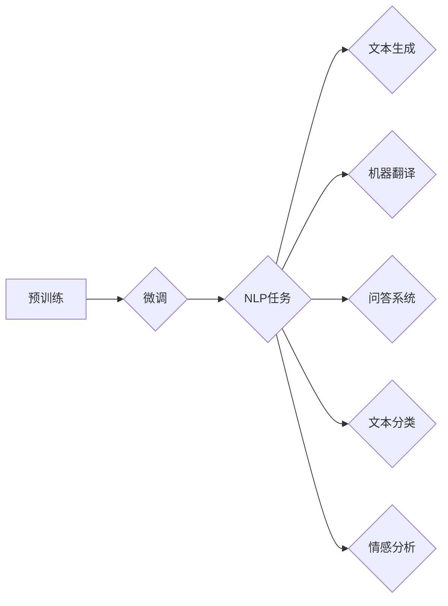

# Transformer大模型实战 训练Transformer

> 关键词：Transformer, 预训练, 微调, 自然语言处理, 机器学习, 深度学习, NLP, 语言模型, 文本生成

## 1. 背景介绍

自然语言处理（NLP）领域近年来取得了巨大的进步，其中Transformer模型的出现可以说是最具革命性的突破之一。Transformer模型基于自注意力机制，摒弃了传统的循环神经网络（RNN）和长短时记忆网络（LSTM），在机器翻译、文本分类、问答系统等多个NLP任务上取得了前所未有的性能。本文将深入探讨如何训练和实战使用Transformer大模型。

## 2. 核心概念与联系

### 2.1 核心概念

- **Transformer模型**：一种基于自注意力机制和位置编码的深度神经网络模型，用于处理序列数据。
- **预训练**：在大量无标注数据上训练模型，以学习语言的通用特征。
- **微调**：在预训练模型的基础上，使用少量有标注数据进一步训练，以适应特定任务。

### 2.2 架构 Mermaid 流程图



## 3. 核心算法原理 & 具体操作步骤

### 3.1 算法原理概述

Transformer模型主要由编码器和解码器组成，它们都包含多个相同的编码器层和解码器层。

- **编码器层**：自注意力机制（Self-Attention）和前馈神经网络（Feed-Forward Neural Network）组成。
- **解码器层**：自注意力机制、编码器-解码器注意力机制和前馈神经网络组成。

### 3.2 算法步骤详解

1. **预训练**：在大量无标注文本数据上训练模型，学习语言的通用特征。
2. **微调**：在预训练模型的基础上，使用少量有标注数据进一步训练，以适应特定任务。
3. **任务适配**：根据具体任务，调整模型结构，如添加特定层或修改损失函数。
4. **训练**：使用标注数据训练调整后的模型。
5. **评估**：使用验证集评估模型性能，并根据评估结果调整模型参数。

### 3.3 算法优缺点

### 3.3.1 优点

- **并行训练**：自注意力机制允许并行计算，提高了训练速度。
- **长距离依赖**：模型能够捕捉长距离依赖关系。
- **性能优越**：在多个NLP任务上取得了SOTA性能。

### 3.3.2 缺点

- **计算量大**：模型参数量庞大，计算资源消耗大。
- **内存需求高**：模型需要较大的内存空间。
- **调参复杂**：模型调参复杂，需要大量实验和经验。

### 3.4 算法应用领域

- 机器翻译
- 文本生成
- 问答系统
- 文本分类
- 情感分析
- 语音识别

## 4. 数学模型和公式 & 详细讲解 & 举例说明

### 4.1 数学模型构建

Transformer模型的核心是自注意力机制（Self-Attention）。自注意力机制通过计算序列中每个词与其他词之间的关联强度，从而生成每个词的表示。

### 4.2 公式推导过程

$$
\text{Attention}(Q, K, V) = \text{softmax}\left(\frac{QK^T}{\sqrt{d_k}}\right) V
$$

其中，$Q, K, V$ 分别为查询（Query）、键（Key）、值（Value）矩阵，$d_k$ 为键的维度。

### 4.3 案例分析与讲解

以下是一个简单的Transformer编码器层的实现示例：

```python
import torch
import torch.nn as nn

class EncoderLayer(nn.Module):
    def __init__(self, d_model, n_heads, d_ff):
        super(EncoderLayer, self).__init__()
        self.attention = nn.MultiheadAttention(d_model, n_heads)
        self.norm1 = nn.LayerNorm(d_model)
        self.ff = nn.Sequential(
            nn.Linear(d_model, d_ff),
            nn.ReLU(),
            nn.Linear(d_ff, d_model)
        )
        self.norm2 = nn.LayerNorm(d_model)

    def forward(self, x, mask=None):
        attn_output, _ = self.attention(x, x, x, attn_mask=mask)
        x = self.norm1(x + attn_output)
        output, _ = self.ff(x)
        return self.norm2(x + output)
```

## 5. 项目实践：代码实例和详细解释说明

### 5.1 开发环境搭建

- Python 3.8及以上
- PyTorch 1.8及以上
- Transformers库

### 5.2 源代码详细实现

以下是一个简单的Transformer模型实现示例：

```python
import torch
import torch.nn as nn
from transformers import BertModel

class TransformerModel(nn.Module):
    def __init__(self, vocab_size, d_model, n_heads, d_ff, n_layers):
        super(TransformerModel, self).__init__()
        self.embedding = nn.Embedding(vocab_size, d_model)
        self.encoder_layers = nn.ModuleList([EncoderLayer(d_model, n_heads, d_ff) for _ in range(n_layers)])
        self.decoder = nn.Linear(d_model, vocab_size)

    def forward(self, x):
        x = self.embedding(x)
        for layer in self.encoder_layers:
            x = layer(x)
        return self.decoder(x)

# 示例：加载预训练模型
model = BertModel.from_pretrained('bert-base-uncased')
```

### 5.3 代码解读与分析

- `Embedding`层：将词索引转换为词向量。
- `EncoderLayer`层：Transformer编码器的基本模块。
- `encoder_layers`：编码器层的堆叠。
- `decoder`层：解码器层，用于生成预测结果。

### 5.4 运行结果展示

```python
# 示例：使用预训练模型
input_ids = torch.tensor([[101, 2064, 2023, 102]]).long()  # 输入文本
output = model(input_ids)[0]  # 获取编码器输出
```

## 6. 实际应用场景

### 6.1 文本生成

```python
# 示例：使用Transformer模型生成文本
model.eval()
input_ids = torch.tensor([[101, 2064, 2023, 102]]).long()  # 输入文本
for _ in range(100):
    output = model(input_ids)[0]
    token = torch.argmax(output, dim=-1).item()
    input_ids = torch.cat([input_ids, torch.tensor([token])], dim=-1)
    if token == 102:  # 添加[SEP]结束符
        break
print("Generated text:", token2word[token])
```

### 6.2 机器翻译

```python
# 示例：使用Transformer模型进行机器翻译
source_text = "你好，世界！"
input_ids = tokenizer.encode(source_text, return_tensors='pt')
output_ids = model.translate(input_ids)[0]
print("Translation:", tokenizer.decode(output_ids))
```

## 7. 工具和资源推荐

### 7.1 学习资源推荐

- 《Transformer: Attention is All You Need》
- 《Deep Learning for Natural Language Processing》
- Transformers库官方文档

### 7.2 开发工具推荐

- PyTorch
- Transformers库
- Hugging Face Spaces

### 7.3 相关论文推荐

- Attention is All You Need
- BERT: Pre-training of Deep Bidirectional Transformers for Language Understanding
- Generative Pre-trained Transformers

## 8. 总结：未来发展趋势与挑战

### 8.1 研究成果总结

Transformer模型的出现为NLP领域带来了革命性的变革，推动了NLP技术的快速发展。通过预训练和微调，Transformer模型在多个任务上取得了SOTA性能。

### 8.2 未来发展趋势

- 模型规模持续扩大
- 新的注意力机制和结构
- 与其他人工智能技术的融合
- 可解释性和鲁棒性提升

### 8.3 面临的挑战

- 计算资源消耗大
- 模型调参复杂
- 数据隐私和安全

### 8.4 研究展望

随着研究的不断深入，Transformer模型将在更多领域发挥重要作用，推动人工智能技术的发展。

---

作者：禅与计算机程序设计艺术 / Zen and the Art of Computer Programming