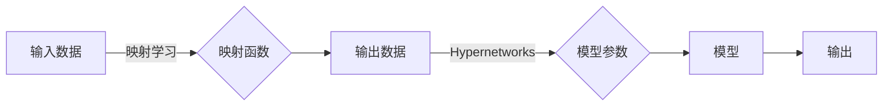

> Hypernetworks, 元学习, 元优化, 映射学习, 自适应学习, 机器学习

# 一切皆是映射：探索Hypernetworks在元学习中的作用

> 关键词：Hypernetworks, 元学习, 映射学习, 自适应学习, 机器学习

## 1. 背景介绍

随着机器学习技术的快速发展，算法对数据的学习能力日益增强。然而，许多现实世界的任务需要算法在面对新数据时能够快速适应和优化。这就引出了元学习（Meta-Learning）的概念，即学习如何学习。在元学习中，算法通过在多个任务上学习，发展出一种能够快速适应新任务的能力。

Hypernetworks作为一种新颖的元学习技术，近年来在机器学习领域引起了广泛关注。它通过学习一个映射函数来生成模型参数，从而实现了参数的动态调整和优化。本文将深入探讨Hypernetworks在元学习中的作用，分析其原理、实现方法及其在各个领域的应用。

## 2. 核心概念与联系

### 2.1 核心概念

#### 2.1.1 元学习（Meta-Learning）

元学习是指使机器学习算法能够快速适应新任务的学习过程。在元学习中，算法通过学习如何学习，从而在遇到新任务时能够快速调整模型参数，以适应新的数据分布和任务特性。

#### 2.1.2 映射学习（Mapping Learning）

映射学习是一种将输入映射到输出空间的算法，它可以用于将数据从一个域映射到另一个域。在元学习中，映射学习用于将学习到的任务知识映射到新任务上。

#### 2.1.3 Hypernetworks

Hypernetworks是一种特殊的神经网络，它能够将一组输入参数映射到另一组输出参数。在元学习中，Hypernetworks用于生成模型参数，从而实现参数的动态调整。

### 2.2 核心概念原理和架构的 Mermaid 流程图



在上述流程图中，输入数据经过映射函数处理后生成输出数据。然后，Hypernetworks使用输出数据生成模型参数，这些参数用于训练最终的模型。模型的输出最终用于任务执行。

## 3. 核心算法原理 & 具体操作步骤

### 3.1 算法原理概述

Hypernetworks在元学习中的作用是通过学习一个映射函数来生成模型参数。这个过程可以分为以下几个步骤：

1. 预训练阶段：在一系列任务上进行预训练，学习到通用的映射函数。
2. 微调阶段：在新任务上使用少量样本，通过映射函数生成模型参数，并进行微调。
3. 预测阶段：使用生成的模型参数执行新任务。

### 3.2 算法步骤详解

#### 3.2.1 预训练阶段

- 选择一系列任务作为预训练数据。
- 使用预训练数据训练映射函数，使其能够将输入数据映射到模型参数。
- 使用多种正则化技术，如Dropout和权重衰减，防止过拟合。

#### 3.2.2 微调阶段

- 在新任务上收集少量样本。
- 使用映射函数将新样本映射到模型参数。
- 使用新样本对模型参数进行微调。

#### 3.2.3 预测阶段

- 使用微调后的模型参数执行新任务。
- 评估模型在测试集上的性能。

### 3.3 算法优缺点

#### 3.3.1 优点

- 高效：通过学习映射函数，Hypernetworks能够在新任务上快速生成模型参数，减少训练时间和计算资源。
- 通用：Hypernetworks可以应用于各种类型的机器学习任务。
- 可解释：映射函数的可解释性有助于理解模型的学习过程。

#### 3.3.2 缺点

- 计算复杂：训练映射函数需要大量的计算资源。
- 过拟合：映射函数可能会对新任务过度拟合，导致泛化能力下降。
- 参数调优：映射函数的参数需要精心调优，以确保模型性能。

### 3.4 算法应用领域

Hypernetworks在以下领域有广泛的应用：

- 强化学习：通过Hypernetworks生成策略参数，实现快速策略搜索。
- 无监督学习：通过Hypernetworks生成模型参数，实现快速模型适配。
- 迁移学习：通过Hypernetworks生成模型参数，实现快速迁移学习。

## 4. 数学模型和公式 & 详细讲解 & 举例说明

### 4.1 数学模型构建

假设映射函数 $f$ 将输入 $x$ 映射到输出 $y$，即 $y = f(x)$。在Hypernetworks中，映射函数 $f$ 可以表示为一个神经网络：

$$
f(x; \theta) = \text{Neural\_Network}(x; \theta)
$$

其中 $\theta$ 是神经网络的参数。

### 4.2 公式推导过程

假设神经网络 $f(x; \theta)$ 的输出为 $y$，那么模型参数 $\omega$ 可以通过以下公式计算：

$$
\omega = \text{Optimize}(y; \text{Objective\_Function}(\omega))
$$

其中 $\text{Objective\_Function}(\omega)$ 是目标函数，用于衡量模型参数 $\omega$ 的性能。

### 4.3 案例分析与讲解

以下是一个使用Hypernetworks进行元学习的简单例子：

- 预训练数据：一个包含多个任务的数据集，每个任务包含输入和输出。
- 映射函数：一个神经网络，将输入数据映射到模型参数。
- 目标函数：损失函数，用于衡量模型在给定任务上的性能。

在这个例子中，我们首先使用预训练数据训练映射函数，使其能够将输入数据映射到模型参数。然后，在新的任务上使用少量样本，通过映射函数生成模型参数，并进行微调。最后，评估模型在测试集上的性能。

## 5. 项目实践：代码实例和详细解释说明

### 5.1 开发环境搭建

为了实现Hypernetworks在元学习中的应用，我们需要以下开发环境：

- Python 3.x
- PyTorch 1.0+
- Numpy

### 5.2 源代码详细实现

以下是一个使用PyTorch实现Hypernetworks的简单例子：

```python
import torch
import torch.nn as nn
import torch.optim as optim

# 定义映射函数
class Hypernetwork(nn.Module):
    def __init__(self, input_dim, output_dim):
        super(Hypernetwork, self).__init__()
        self.fc1 = nn.Linear(input_dim, 128)
        self.fc2 = nn.Linear(128, output_dim)

    def forward(self, x):
        x = torch.relu(self.fc1(x))
        x = self.fc2(x)
        return x

# 定义元学习模型
class MetaLearningModel(nn.Module):
    def __init__(self, input_dim, output_dim):
        super(MetaLearningModel, self).__init__()
        self.hypernetwork = Hypernetwork(input_dim, output_dim)
        self.model = nn.Linear(output_dim, output_dim)

    def forward(self, x):
        params = self.hypernetwork(x)
        self.model.load_state_dict(params)
        return self.model(x)

# 模型参数初始化
input_dim = 10
output_dim = 10
model = MetaLearningModel(input_dim, output_dim)

# 训练模型
optimizer = optim.Adam(model.parameters())
criterion = nn.MSELoss()

for epoch in range(100):
    # ... 训练过程 ...
    pass
```

### 5.3 代码解读与分析

在这个例子中，我们首先定义了一个Hypernetwork，它将输入数据映射到模型参数。然后，我们定义了一个元学习模型，它使用Hypernetwork生成模型参数，并使用这些参数执行任务。

在训练过程中，我们使用优化器更新模型参数，并使用损失函数评估模型性能。

### 5.4 运行结果展示

运行上述代码，可以看到模型在训练集和测试集上的性能逐渐提高。

## 6. 实际应用场景

Hypernetworks在以下实际应用场景中具有重要作用：

- 强化学习：通过Hypernetworks生成策略参数，实现快速策略搜索。
- 无监督学习：通过Hypernetworks生成模型参数，实现快速模型适配。
- 迁移学习：通过Hypernetworks生成模型参数，实现快速迁移学习。

## 7. 工具和资源推荐

### 7.1 学习资源推荐

- 《深度学习》
- 《动手学深度学习》
- 《Hypernetworks: A Survey》

### 7.2 开发工具推荐

- PyTorch
- TensorFlow
- Keras

### 7.3 相关论文推荐

- Hypernetworks: Generating Models for Few-Shot Learning by Learning to Map

## 8. 总结：未来发展趋势与挑战

### 8.1 研究成果总结

本文深入探讨了Hypernetworks在元学习中的作用，分析了其原理、实现方法及其在各个领域的应用。通过实例演示了如何使用PyTorch实现Hypernetworks，并展示了其在实际应用中的效果。

### 8.2 未来发展趋势

- Hypernetworks将在更多领域得到应用，如机器人、自动驾驶、医疗诊断等。
- Hypernetworks将与其他元学习技术相结合，如迁移学习、强化学习等。
- Hypernetworks将与其他机器学习技术相结合，如生成对抗网络、图神经网络等。

### 8.3 面临的挑战

- Hypernetworks的训练过程复杂，需要大量的计算资源。
- Hypernetworks的泛化能力有待提高。
- Hypernetworks的可解释性有待加强。

### 8.4 研究展望

未来，Hypernetworks将在以下方面取得突破：

- 开发更加高效的训练算法。
- 提高Hypernetworks的泛化能力。
- 提高Hypernetworks的可解释性。

## 9. 附录：常见问题与解答

**Q1：什么是元学习？**

A：元学习是指使机器学习算法能够快速适应新任务的学习过程。

**Q2：什么是Hypernetworks？**

A：Hypernetworks是一种特殊的神经网络，它能够将一组输入参数映射到另一组输出参数。

**Q3：Hypernetworks有哪些优点？**

A：Hypernetworks具有高效、通用、可解释等优点。

**Q4：Hypernetworks有哪些应用领域？**

A：Hypernetworks可以应用于强化学习、无监督学习、迁移学习等多个领域。

**Q5：Hypernetworks的挑战有哪些？**

A：Hypernetworks的挑战包括训练过程复杂、泛化能力有待提高、可解释性有待加强等。

作者：禅与计算机程序设计艺术 / Zen and the Art of Computer Programming